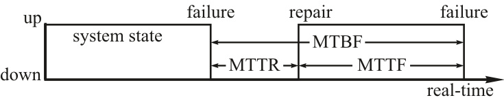
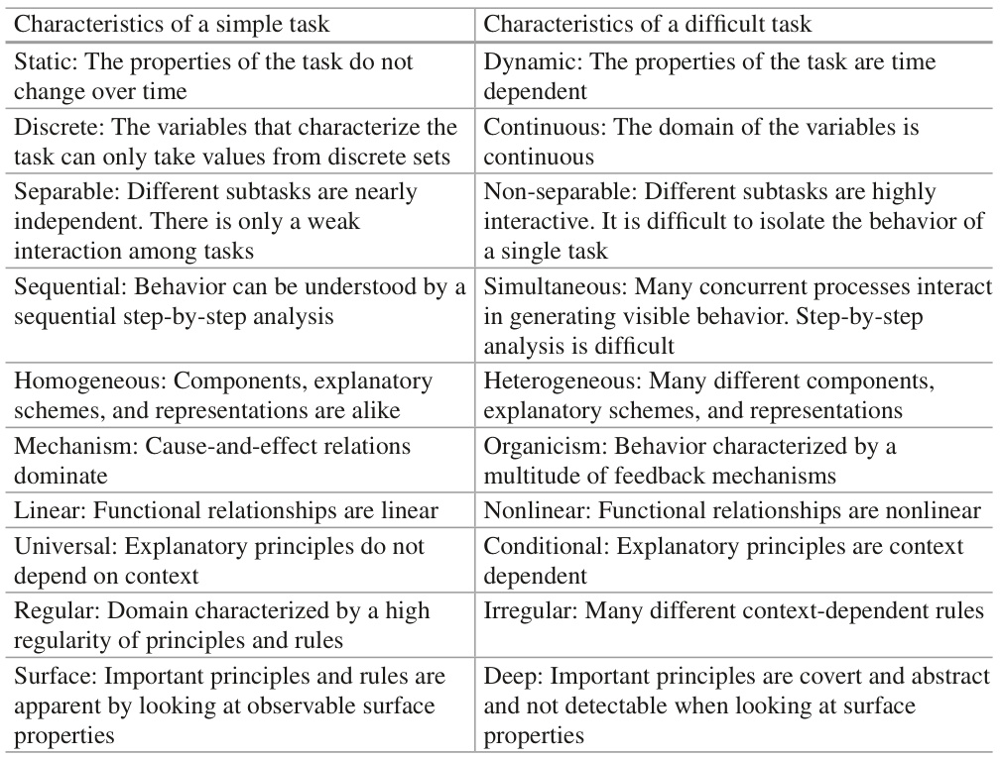
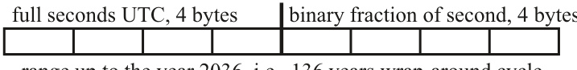
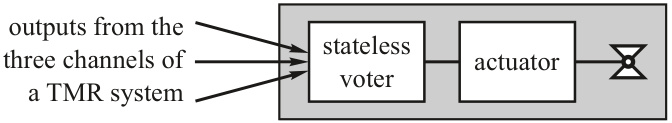
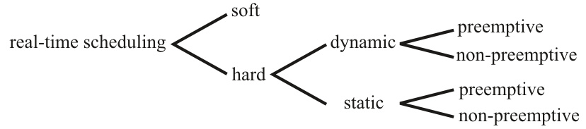

# Hermann Kopetz Wilfried Steiner

## Real-Time Systems

Design Principles for Distributed Embedded Applications 3rd ed. 2022

Hermann Kopetz Vienna University of Technology Vienna, Austria

Wilfried Steiner TTTech Computer tech nik AG Vienna, Austria

## ISBN 978-3-031-11991-0 ISBN 978-3-031-11992-7 (eBook) https://doi.org/10.1007/978-3-031-11992-7


$\copyright$ The Editor(s) (if applicable) and The Author(s), under exclusive license to Springer Nature Switzerland AG 2022

> $\copyright$根据施普林格自然瑞士公司2022的独家许可，编辑（如适用）和作者


This work is subject to copyright. All rights are solely and exclusively licensed by the Publisher, whether the whole or part of the material is concerned, specifically the rights of translation, reprinting, reuse of illustrations, recitation, broadcasting, reproduction on microfilms or in any other physical way, and transmission or information storage and retrieval, electronic adaptation, computer software, or by similar or dissimilar methodology now known or hereafter developed.

> 此作品受版权保护。所有权利均由出版商独家许可，无论涉及全部或部分材料，特别是翻译、重印、重新使用插图、背诵、广播、在缩微胶片上或以任何其他物理方式复制的权利，以及传输或信息存储和检索、电子改编、计算机软件或通过现在已知或以后开发的类似或不同方法的权利。


The use of general descriptive names, registered names, trademarks, service marks, etc. in this publication does not imply, even in the absence of a specific statement, that such names are exempt from the relevant protective laws and regulations and therefore free for general use.

> 本出版物中使用的一般描述性名称、注册名称、商标、服务标志等并不意味着，即使没有具体声明，这些名称也不受相关保护法律法规的约束，因此可以免费用于一般用途。


The publisher, the authors, and the editors are safe to assume that the advice and information in this book are believed to be true and accurate at the date of publication. Neither the publisher nor the authors or the editors give a warranty, expressed or implied, with respect to the material contained herein or for any errors or omissions that may have been made. The publisher remains neutral with regard to jurisdictional claims in published maps and institutional affiliations.

> 出版商、作者和编辑可以放心地假设，本书中的建议和信息在出版之日被认为是真实准确的。出版商、作者或编辑均不对本文所含材料或可能出现的任何错误或遗漏作出明示或暗示的保证。出版商对已出版地图和机构附属机构的管辖权主张保持中立。


This Springer imprint is published by the registered company Springer Nature Switzerland AG The registered company address is: G ewer best rass e 11, 6330 Cham, Switzerland

> 本施普林格印记由注册公司施普林格自然瑞士股份公司出版。注册公司地址为：G ewer best rass e 11，6330 Cham，Switzerland

## Preface


The primary objective of this book is to serve as a textbook for students who take a senior undergraduate or a first-year graduate course on real-time embedded sys­ tems, also called cyber-physical systems . The book’s structure—the material is organized into 14 chapters—maps to the 14 weeks of a semester. The book is also intended for practitioners in industry who want to learn about the state of the art in real-time embedded system design and need a reference book that explains the fun­ damental concepts of the field. More than a 1000 students used the first edition of this book, published about 25 years ago, as a text for the real-time systems course at the Vienna University of Technology. The feedback from these students and many new developments in this dynamic field of embedded real-time systems have been incorporated in the second edition. This third edition of the book includes learnings from industrial applications of its elaborated design principles and addresses the ongoing convergence of real-time embedded systems with IT (information technol­ ogy) systems. It also covers emerging autonomous system developments.

> 本书的主要目的是为修读实时嵌入式系统（也称为网络物理系统）高年级本科生或一年级研究生课程的学生提供教科书。这本书的结构——材料分为14章——对应一学期的14周。这本书也适用于希望了解实时嵌入式系统设计最新技术并需要一本解释该领域有趣基本概念的参考书的行业从业者。超过1000名学生将这本大约25年前出版的第一版作为维也纳理工大学实时系统课程的教材。这些学生的反馈以及嵌入式实时系统这一动态领域的许多新发展已被纳入第二版。这本书的第三版包括从工业应用中学习其精心设计的原则，并解决了实时嵌入式系统与IT（信息技术）系统的持续融合问题。它还涵盖了新兴的自主系统开发。


The book’s focus is on the design of distributed real-time systems at the architec­ ture level. While a significant part of the established computer science literature abstracts from the progression of real time, real-time system designers cannot get away with such an abstraction. In this book, the progression of physical time is considered a first-order citizen that shapes many of the relevant concepts. The book explains the fundamental concepts related to the progression of time on a number of practical, insightful examples from industry. The conceptual model of a distributed real-time system has been extended, and precise definitions of important time-­ related concepts, such as sparse time , state , temporal accuracy of real-time data , and determinism , are given. This book emphasizes design principles that result in understandable systems, ir respectively of a system’s size . Following these principles ensures that simple models faithfully represent an implemented system from differ­ ent viewpoints and at different levels of abstraction.

> 本书的重点是在架构级别设计分布式实时系统。虽然已有的计算机科学文献中有很大一部分是从实时发展中抽象出来的，但实时系统设计人员无法摆脱这种抽象。在这本书中，物理时间的进程被认为是一个一阶公民，它塑造了许多相关概念。这本书通过行业中一些实用、有见地的例子解释了与时间进程相关的基本概念。扩展了分布式实时系统的概念模型，并给出了重要时间相关概念的精确定义，如稀疏时间、状态、实时数据的时间精度和确定性。这本书强调了设计原则，这些原则分别导致了系统大小的可理解系统。遵循这些原则可以确保简单模型从不同的角度和不同的抽象级别忠实地表示一个已实现的系统。


Since the second edition of this book, about 11 years ago, cloud computing has revolutionized classical IT systems. Inspired by this development, strong market forces seek to replicate this success in the real-time embedded systems market by reusing native cloud technologies and principles. However, naively doing so will lead to disaster. Thus, this third edition includes a new chapter on cloud and fog computing that argues for the fog architectural style to decouple the world of cloud from the world of real-time embedded systems . The second major change is the rewritten chapter on real-time networks that now also covers IEEE 802.1 Time-­ Sensitive Networking (TSN), the incorporation of the time-triggered paradigm in the mainstream IT networking set of standards. All other chapters have been revised and updated. This third edition includes approximately 80 new references in total.

> 自大约11年前本书第二版问世以来，云计算已经彻底改变了传统的IT系统。受到这一发展的启发，强大的市场力量试图通过重用本地云技术和原理，在实时嵌入式系统市场复制这一成功。然而，天真地这样做会导致灾难。因此，第三版包括一个关于云和雾计算的新章节，该章节主张雾架构风格将云世界与实时嵌入式系统世界解耦。第二个主要变化是重写了关于实时网络的章节，现在也涵盖了IEEE 802.1时间敏感网络（TSN），将时间触发范式纳入了主流IT网络标准集。所有其他章节均已修订和更新。第三版共包括约80篇新参考文献。


Since the publication of the first edition, a visible paradigm shift from the event-­ triggered to the time-triggered design methodology for dependable distributed real-­ time systems has taken place in a number of applications.

> 自第一版发布以来，在许多应用中，可靠分布式实时系统的设计方法从事件触发到时间触发发生了明显的范式转变。


It is assumed that the reader of this book has a background in basic computer science or computer engineering or has some practical experience in the design or implementation of embedded systems.

> 假设本书的读者具有基础计算机科学或计算机工程的背景，或者在嵌入式系统的设计或实现方面有一些实践经验。


The glossary, provided at the end, is an integral part of this book, providing defi­ nitions for many of the technical terms used throughout. If the reader is not sure about the meaning of a term, they are advised to refer to the glossary.

> 最后提供的术语表是本书不可分割的一部分，为本书中使用的许多技术术语提供了定义。如果读者不确定一个术语的含义，建议他们参考术语表。

## Acknowledgments


It is impossible to name all students, colleagues from industry, and fellow scientists who have contributed to this third edition of the book by asking intelligent questions or making constructive comments over the last decade—thanks to all of you.

> 在过去的十年里，通过提出聪明的问题或提出建设性的意见，为这本书的第三版做出贡献的所有学生、行业同事和科学家都是不可能的——这要归功于你们所有人。

Vienna, Austria Hermann Kopetz Wilfried Steiner

May 2022

```
# Contents

## 1 The Real-Time Environment  1

1.1 When Is a Computer System Real-Time?  2

1.2 Functional Requirements  3
 1.2.1 Data Collection  3
 1.2.2 Direct Digital Control  6
 1.2.3 Man-Machine Interaction 6

1.3 Temporal Requirements  7
 1.3.1 Where Do Temporal Requirements Come From?  7
 1.3.2 Minimal Latency Jitter  9
 1.3.3 Minimal Error-Detection Latency 10

1.4 Dependability Requirements 10
 1.4.1 Reliability 10
 1.4.2 Safety 11
 1.4.3 Maintainability 12
 1.4.4 Availability 12
 1.4.5 Security  13

1.5 Classification of Real-Time Systems 13
 1.5.1 Hard Real-Time System Versus Soft Real-Time System 14
 1.5.2 Fail-Safe Versus Fail-Operational 16
 1.5.3 Guaranteed Response Versus Best Effort 16
 1.5.4 Resource-Adequate Versus Resource-Inadequate 17
 1.5.5 Event-Triggered Versus Time-Triggered 17

1.6 The Real-Time System Market 18
 1.6.1 Embedded Real-Time Systems 18
 1.6.2 Plant Automation Systems 21
 1.6.3 Multimedia Systems  22

1.7 Examples of Real-Time Systems 23
 1.7.1 Controlling the Flow in a Pipe 23
 1.7.2 Engine Control 24
 1.7.3 Rolling Mill 25

Bibliographic Notes  27
Review Questions and Problems 28

## 2 Simplicity  31

2.1 Cognition 32
 2.1.1 Problem-Solving  32
 2.1.2 Definition of a Concept 34
 2.1.3 Cognitive Complexity 35
 2.1.4 Simplification Strategies 37

2.2 The Conceptual Landscape 38
 2.2.1 Concept Formation 38
 2.2.2 Scientific Concepts 40
 2.2.3 The Concept of a Message 41
 2.2.4 Semantic Content of a Variable 42

2.3 The Essence of Model Building 43
 2.3.1 Purpose and Viewpoint  44
 2.3.2 The Grand Challenge 46

2.4 Emergence 46
 2.4.1 Irreducibility  47
 2.4.2 Prior and Derived Properties 47
 2.4.3 Complex Systems 48

2.5 How Can We Achieve Simplicity? 51

Bibliographic Notes  53
Points to Remember 53
Review Questions and Problems 55

## 3 Global Time  57

3.1 Time and Order 58
 3.1.1 Different Orders 58
 3.1.2 Clocks  59
 3.1.3 Precision and Accuracy 61
 3.1.4 Time Standards  63

3.2 Time Measurement  64
 3.2.1 Global Time 64
 3.2.2 Interval Measurement  66
 3.2.3 π / Δ -Precedence 66
 3.2.4 Fundamental Limits of Time Measurement 68

3.3 Dense Time Versus Sparse Time 68
 3.3.1 Dense Time Base 69
 3.3.2 Sparse Time Base 70
 3.3.3 Space-Time Lattice  71
 3.3.4 Cyclic Representation of Time  72

3.4 Internal Clock Synchronization 73
 3.4.1 The Synchronization Condition 73
 3.4.2 Central Master Synchronization  75
 3.4.3 Fault-Tolerant Synchronization Algorithms 75

3.4.4 State Correction Versus Rate Correction 79
 3.5 External Clock Synchronization  79
 3.5.1 External Time Sources 79
 3.5.2 Time Gateway 81
 3.5.3 Time Formats 81

Points to Remember 82
Bibliographic Notes  83
Review Questions and Problems 83

## 4 Real-Time (RT) Model  87

4.1 Model Outline 88
 4.1.1 Components and Messages 88
 4.1.2 Cluster of Components  89
 4.1.3 Temporal Control Versus Logical Control 90
 4.1.4 Event-Triggered Control Versus Time-Triggered Control 92

4.2 Component State 92
 4.2.1 Definition of State 93
 4.2.2 The Pocket Calculator Example 93
 4.2.3 Ground State  95
 4.2.4 Database Components 96

4.3 The Message Concept 97
 4.3.1 Message Structure 97
 4.3.2 Event Information Versus State Information 98
 4.3.3 Event-Triggered (ET) Message 99
 4.3.4 Time-Triggered (TT) Message 99

4.4 Component Interfaces 100
 4.4.1 Interface Characterization 101
 4.4.2 Linking Interface (LIF) 102
 4.4.3 Technology-Independent Interface (TII) 103
 4.4.4 Technology-Dependent Interface (TDI) 103
 4.4.5 Local Interfaces 103

4.5 Gateway Component 104
 4.5.1 Property Mismatches 105
 4.5.2 LIF Versus Local Interface of a Gateway Component 105
 4.5.3 Standardized Message Interface 107

4.6 Linking Interface Specification 107
 4.6.1 Transport Specification 108
 4.6.2 Operational Specification 109
 4.6.3 Meta-Level Specification 110

4.7 Component Integration 111
 4.7.1 Principles of Composability 111
 4.7.2 Integration Viewpoints 112
 4.7.3 System of Systems 113

Bibliographic Notes 117
Review Questions and Problems 117

## 5 Temporal Relations 119

5.1 Real-Time Entities 120
 5.1.1 Sphere of Control 120
 5.1.2 Discrete and Continuous Real-Time Entities 121

5.2 Observations 121
 5.2.1 Untimed Observation 121
 5.2.2 Indirect Observation 122
 5.2.3 State Observation 122
 5.2.4 Event Observation 123

5.3 Real-Time Images and Real-Time Objects 124
 5.3.1 Real-Time Images 124
 5.3.2 Real-Time Objects 124

5.4 Temporal Accuracy 125
 5.4.1 Definition 125
 5.4.2 Classification of Real-Time Images 127
 5.4.3 State Estimation 129
 5.4.4 Composability Considerations 130

5.5 Permanence and Idempotency 130
 5.5.1 Permanence 130
 5.5.2 Duration of the Action Delay 132
 5.5.3 Accuracy Interval Versus Action Delay 133
 5.5.4 Idempotency 133

5.6 Determinism 133
 5.6.1 Definition of Determinism 134
 5.6.2 Consistent Initial States 136
 5.6.3 Nondeterministic Design Constructs (NDDCs) 137
 5.6.4 Recovery of Determinism 138

Points to Remember 139
Bibliographic Notes 140
Review Questions and Problems 140

## 6 Dependability 143

6.1 Basic Concepts 144
 6.1.1 Faults 145
 6.1.2 Errors 146
 6.1.3 Failures 147

6.2 Information Security 150
 6.2.1 Secure Information Flow 151
 6.2.2 Security Threats 152
 6.2.3 Cryptographic Methods 154
 6.2.4 Network Authentication 157
 6.2.5 Protection of Real-Time Control Data 157

6.3 Anomaly Detection 158
 6.3.1 What Is an Anomaly? 158
 6.3.2 Failure Detection 160
 6.3.3 Error Detection 161

6.4 Fault Tolerance 162
 6.4.1 Fault Hypotheses 163
 6.4.2 Fault-Tolerant Unit 164
 6.4.3 The Membership Service 167

6.5 Robustness and Resilience 168
 6.5.1 The Concept of Robustness 168
 6.5.2 The Concept of Resilience 170

6.6 Component Reintegration 170
 6.6.1 Finding a Reintegration Point 170
 6.6.2 Minimizing the Ground State 171
 6.6.3 Component Restart 172

Points to Remember 173
Bibliographic Notes 174
Review Questions and Problems 174

## 7 Real-Time Communication 177

7.1 Requirements 178
 7.1.1 Timeliness 178
 7.1.2 Dependability and Security 179
 7.1.3 Flexibility 180
 7.1.4 Communication Bandwidth and Cost Efficiency 181

7.2 Design Principles and Pitfalls 181
 7.2.1 Real-Time Network Model 182
 7.2.2 Message Types 182
 7.2.3 Flow Control 183
 7.2.4 Design Limitations 184
 7.2.5 Design Pitfalls 186

7.3 Event-Triggered Communication 187
 7.3.1 CAN 188
 7.3.2 Ethernet 189

7.4 Rate-Constrained Communication 190
 7.4.1 Avionics Full-Duplex Switched Ethernet (AFDX): ARINC 664-p7 191
 7.4.2 Audio/Video Bridging: IEEE 802.1 AVB 192

7.5 Time-Triggered Communication 192
 7.5.1 TTP 194
 7.5.2 TTEthernet 195
 7.5.3 Time-Sensitive Networking: IEEE 802.1 TSN 197

Points to Remember 198
Bibliographic Notes 200
Review Questions and Problems 200

## 8 Power and Energy Awareness 201

8.1 Power and Energy 202
 8.1.1 Basic Concepts 202
 8.1.2 Energy Estimation 204
 8.1.3 Thermal Effects and Reliability 208

8.2 Hardware Power Reduction Techniques 209
 8.2.1 Device Scaling 209
 8.2.2 Low-Power Hardware Design 211
 8.2.3 Voltage and Frequency Scaling 211
 8.2.4 Sub-threshold Logic 212

8.3 System Architecture 213
 8.3.1 Technology-Agnostic Design 213
 8.3.2 Pollack’s Rule 214
 8.3.3 Power Gating 216
 8.3.4 Real Time Versus Execution Time 217

8.4 Software Techniques 218
 8.4.1 System Software 218
 8.4.2 Application Software 219
 8.4.3 Software Tools 219

Points to Remember 198
Bibliographic Notes 200
Review Questions and Problems 200

## 9 Real-Time Operating Systems 223

9.1 Inter-Component Communication 224
 9.1.1 Technology-Independent Interface (TII) 224
 9.1.2 Linking Interface (LIF) 225
 9.1.3 Technology-Dependent Interface (TDI) 225
 9.1.4 Generic Middleware (GM) 225

9.2 Task Management 226
 9.2.1 Simple Tasks 226
 9.2.2 Trigger Tasks 228
 9.2.3 Complex Tasks 229

9.3 The Dual Role of Time 229
 9.3.1 Time as Data 230
 9.3.2 Time as Control 231

9.4 Inter-Task Interactions 232
 9.4.1 Coordinated Static Schedules 232
 9.4.2 The Non-blocking Write (NBW) Protocol 233
 9.4.3 Semaphore Operations 234

9.5 Process Input/Output 234
 9.5.1 Analog Input/Output 234
 9.5.2 Digital Input/Output 235
 9.5.3 Interrupts 236
 9.5.4 Fault-Tolerant Actuators 238
 9.5.5 Intelligent Instrumentation 239
 9.5.6 Physical Installation 240

9.6 Agreement Protocols 241
 9.6.1 Raw Data, Measured Data, and Agreed Data 241
 9.6.2 Syntactic Agreement 242
 9.6.3 Semantic Agreement 242

9.7 Error Detection 243
 9.7.1 Monitoring Task Execution Times 243
 9.7.2 Monitoring Interrupts 243
 9.7.3 Double Execution of Tasks 243
 9.7.4 Watchdogs 244

Points to Remember 245
Bibliographic Notes 245
Review Questions and Problems 246

## 10 Real-Time Scheduling 247

10.1 The Scheduling Problem 248
 10.1.1 Classification of Scheduling Algorithms 248
 10.1.2 Schedulability Test 249
 10.1.3 The Adversary Argument 250

10.2 Worst-Case Execution Time 251
 10.2.1 WCET of Simple Tasks 252
 10.2.2 WCET of Complex Tasks 254
 10.2.3 Anytime Algorithms 255
 10.2.4 State of Practice 255

10.3 Static Scheduling 256
 10.3.1 Static Scheduling Viewed as a Search 257
 10.3.2 Increasing the Flexibility in Static Schedules 258

10.4 Dynamic Scheduling 260
 10.4.1 Scheduling Independent Tasks 260
 10.4.2 Scheduling Dependent Tasks 262

10.5 Alternative Scheduling Strategies 263
 10.5.1 Scheduling in Distributed Systems 263
 10.5.2 Feedback Scheduling 264

Points to Remember 265
Bibliographic Notes 266
Review Questions and Problems 267

## 11 System Design 269

11.1 System Design 270
 11.1.1 The Design Process 270
 11.1.2 The Role of Constraints 272
 11.1.3 System Design Versus Software Design 272

11.2 Design Phases 274
 11.2.1 Purpose Analysis 275
 11.2.2 Requirements Capture 275
 11.2.3 Architecture Design 276
 11.2.4 Design of Components 277

11.3 Design Styles 277
 11.3.1 Model-Based Design 277
 11.3.2 Component-Based Design 279
 11.3.3 Architecture Design Languages 280
 11.3.4 Test of a Decomposition 281

11.4 Design of Safety-Critical Systems 283
 11.4.1 What Is Safety? 284
 11.4.2 Safety Analysis 285
 11.4.3 Safety Case 288
 11.4.4 Safety Standards 291

11.5 Design Diversity 293
 11.5.1 Diverse Software Versions 294
 11.5.2 An Example of a Fail-Safe System 295
 11.5.3 Multilevel System 296

11.6 Design for Maintainability 296
 11.6.1 Cost of Maintenance 297
 11.6.2 Maintenance Strategy 298
 11.6.3 Software Maintenance 299

11.7 The Time-Triggered Architecture 300
 11.7.1 Principle of a Consistent Global Time 300
 11.7.2 Principle of Component Orientation 301
 11.7.3 Principle of Coherent Communication 302
 11.7.4 Principle of Fault Tolerance 303

Bibliographic Notes 303
Points to Remember 303
Review Questions and Problems 305

## 12 Validation 307

12.1 Validation Versus Verification 308

12.2 Testing Challenges 309
 12.2.1 Design for Testability 310
 12.2.2 Test Data Selection 310
 12.2.3 Test Oracle 312
 12.2.4 System Evolution and Technology Readiness Levels (TRLs) 313

12.3 Testing of Component-Based Systems 314
 12.3.1 Component Provider 314
 12.3.2 Component User 314
 12.3.3 Communicating Components 315

12.4 Formal Methods 316
 12.4.1 Formal Methods in the Real World 316
 12.4.2 Classification of Formal Methods 317
 12.4.3 Benefits of Formal Methods 317
 12.4.4 Model Checking 319

12.5 Fault Injection 319
 12.5.1 Software-Implemented Fault Injection 320
 12.5.2 Physical Fault Injection 320
 12.5.3 Sensor and Actuator Failures 321

Points to Remember 322
Bibliographic Notes 323
Review Questions and Problems 323

## 13 Internet of Things 325

13.1 The Vision of the Internet of Things (IoT) 326

13.2 Drivers for an IoT 327
 13.2.1 Uniformity of Access 327
 13.2.2 Logistics 327
 13.2.3 Energy Savings 328
 13.2.4 Physical Security and Safety 328
 13.2.5 Industrial 329
 13.2.6 Medical 329
 13.2.7 Lifestyle 329

13.3 Technical Issues of the IoT 329
 13.3.1 Internet Integration 329
 13.3.2 Naming and Identification 330
 13.3.3 Near-Field Communication 331
 13.3.4 IoT Device Capabilities Versus Cloud Computing 332
 13.3.5 Autonomic Components 332

13.4 RFID Technology 333
 13.4.1 Overview 334
 13.4.2 The Electronic Product Code (EPC) 334
 13.4.3 RFID Tags 335
 13.4.4 RFID Readers 336
 13.4.5 RFID Security 336

13.5 Wireless Sensor Networks (WSN) 338

Points to Remember 339
Bibliographic Notes 340
Review Questions and Problems 341

## 14 Cloud and Fog Computing 343

14.1 Introduction 344

14.2 Characteristics of the Cloud 345

14.3 The Advent of Fog Computing 347
 14.3.1 Fog Computing for Distributed Embedded Systems 348
 14.3.2 Fog Computing Benefits and Risks 349
 14.3.3 General Fog Computing and Comparison to Edge Computing 351

14.4 Selected Cloud and Fog Technologies 351
 14.4.1 Resource Pooling 352
 14.4.2 Connectivity 356
 14.4.3 Configuration 357
 14.4.4 System Design Automation 358

14.5 Example Use Cases 358
 14.5.1 Cloud Computing-Enabled Use Cases 359
 14.5.2 Fog Computing-Enabled Use Cases 360
 14.5.3 Nerve 362

Points to Remember 363
Bibliographic Notes 364
Review Questions and Problems 365

Annexes 367
References 383
Index 395
```

# Chapter 1 The Real-Time Environment

## Overview


The purpose of this introductory chapter is to describe the environment of real-time computer systems from a number of different perspectives. A solid understanding of the technical and economic factors that characterize a real-time application helps to interpret the demands that the system designer must cope with. The chapter starts with the definition of a real-time system and with a discussion of its functional and non functional requirements. Particular emphasis is placed on the temporal require­ ments that are derived from the well-understood properties of control applications. The objective of a control algorithm is to drive a process such that a performance criterion is satisfied. Random disturbances occurring in the environment degrade system performance and must be taken into account by the control algorithm. Any additional uncertainty that is introduced into the control loop by the control system itself, e.g., a non-predictable jitter of the control loop, results in a degradation of the quality of control.

> 本介绍性章节的目的是从多个不同的角度描述实时计算机系统的环境。对表征实时应用程序的技术和经济因素的深入理解有助于解释系统设计者必须应对的需求。本章从实时系统的定义开始，讨论了其功能和非功能要求。特别强调的是从控制应用程序的良好理解属性中得出的时间要求。控制算法的目标是驱动一个过程，以满足性能标准。环境中发生的随机干扰会降低系统性能，控制算法必须考虑到这一点。控制系统本身引入控制回路的任何额外的不确定性，例如控制回路的不可预测的抖动，都会导致控制质量的下降。


In Sects. 1.2 , 1.3 , 1.4 and 1.5 , real-time applications are classified from a number of viewpoints. Special emphasis is placed on the fundamental differences between hard and soft real-time systems. Because soft real-time systems do not have severe failure modes, a less rigorous approach to their design is often followed. Sometimes resource-inadequate solutions that will not handle the rarely occurring peak-load scenarios are accepted on economic arguments. In a hard real-time application, such an approach is unacceptable because the safety of a design in all specified situa­ tions, even if they occur only very rarely, must be demonstrated vis-a-vis a certifica­ tion agency. In Sect. 1.6 , a brief analysis of the real-time system market is carried out with emphasis on the field of embedded real-time systems. An embedded real-­ time system is a part of a self-contained product, e.g., a television set or an automo­ bile. Embedded real-time systems, also called cyber-physical systems (CPS), form the most important market segment for real-time technology and the computer industry in general.

> 在教派中。1.2、1.3、1.4和1.5，实时应用程序从多个角度进行分类。特别强调了硬实时系统和软实时系统之间的根本区别。由于软实时系统没有严重的故障模式，因此通常采用不那么严格的设计方法。有时，资源不足的解决方案无法处理很少发生的峰值负载情况，这在经济上是可以接受的。在硬实时应用中，这种方法是不可接受的，因为必须向认证机构证明设计在所有指定情况下的安全性，即使这种情况很少发生。在门派。1.6，对实时系统市场进行了简要分析，重点分析了嵌入式实时系统领域。嵌入式实时系统是独立产品的一部分，例如电视机或汽车。嵌入式实时系统，也称为网络物理系统（CPS），是实时技术和计算机行业最重要的细分市场。

## 1.1 When Is a Computer System Real-Time?


A real-time computer system is a computer system where the correctness of the system behavior depends not only on the logical results of the computations but also on the physical time when these results are produced. By system behavior we mean the sequence of outputs in time of a system.

> 实时计算机系统是一种计算机系统，其中系统行为的正确性不仅取决于计算的逻辑结果，还取决于产生这些结果的物理时间。系统行为是指系统在时间上的输出序列。


We model the flow of time by a directed timeline that extends from the past into the future. A cut of the timeline is called an instant . Any ideal occurrence that hap­ pens at an instant is called an event . Information that describes an event (see also Sect. 5.2.4 on event observation) is called event information. The present point in time, now , is a very special event that separates the past from the future (the pre­ sented model of time is based on Newtonian physics and disregards relativistic effects). An interval on the timeline, called a duration , is defined by two events, the start event and the terminating event of the interval . A digital clock partitions the timeline into a sequence of equally spaced durations, called the granules of the clock, which are delimited by special periodic events, the ticks of the clock.

> 我们通过从过去延伸到未来的有向时间线来模拟时间流。时间线的切割称为瞬间。任何在瞬间发生的理想事件都被称为事件。描述事件的信息（另见关于事件观察的第5.2.4节）称为事件信息。现在的时间点，现在，是一个非常特殊的事件，将过去与未来分开（所提出的时间模型基于牛顿物理学，忽略了相对论效应）。时间线上的间隔称为持续时间，由两个事件定义，即间隔的开始事件和终止事件。数字时钟将时间线划分为一系列等距的持续时间，称为时钟的颗粒，由特殊的周期性事件（时钟的滴答声）分隔。


If the real-time computer system is distributed (and most of them are), it consists of a set of (computer) nodes interconnected by a real-time communication network.

> 如果实时计算机系统是分布式的（大多数都是分布式的），它由一组通过实时通信网络互连的（计算机）节点组成。


The interface between the human operator and the real-time computer system is called the man-machine interface , and the interface between the controlled object and the real-time computer system is called the instrumentation interface . The man-­ machine interface consists of input devices (e.g., keyboard) and output devices (e.g., display) that interface to the human operator. The instrumentation interface consists of the sensors and actuators that transform the physical signals (e.g., voltages, cur­ rents) in the controlled cluster into a digital form and vice versa.

> 操作人员与实时计算机系统之间的接口称为人机接口，被控对象与实时计算机之间的接口也称为仪表接口。人机界面由输入设备（如键盘）和输出设备（如显示器）组成，与人类操作员进行交互。仪表接口由传感器和执行器组成，它们将受控集群中的物理信号（如电压、电流）转换为数字形式，反之亦然。

> 
> Fig.1.1 Real-time system


A real-time computer system must react to stimuli from its environment (the controlled cluster or the operator cluster) within time intervals dictated by its envi­ ronment. The instant when a result must be produced is called a deadline . If a result has utility even after the deadline has passed, the deadline is classified as soft ; oth­ erwise it is firm . If severe consequences could result if a firm deadline is missed, the deadline is called hard.

> 实时计算机系统必须在其环境规定的时间间隔内对来自其环境（受控集群或操作员集群）的刺激做出反应。必须产生结果的时刻称为截止日期。如果一个结果在截止日期过后仍然有用，则该截止日期被归类为软截止日期；否则，它是坚定的。如果错过一个确定的截止日期可能会导致严重后果，那么这个截止日期就很难了。


Example : Consider a traffic signal at a road before a railway crossing. If the traffic signal does not change to red before the train arrives, an accident could result.

> 示例：考虑铁路道口前道路上的交通信号。如果列车到达前交通信号灯没有变为红色，可能会导致事故。


A real-time computer system that must meet at least one hard deadline is called a hard real-time computer system or a safety-critical real-time computer system . If no hard deadline exists, then the system is called a soft real-time computer system .

> 必须满足至少一个硬截止日期的实时计算机系统称为硬实时计算机系统或安全关键实时计算机系统。如果不存在硬截止日期，则该系统称为软实时计算机系统。


The design of a hard real-time system is fundamentally different from the design of a soft real-time system. While a hard real-time computer system must sustain a guaranteed temporal behavior under all specified load and fault conditions, it is permissible for a soft real-time computer system to miss a deadline occasionally. The differences between soft and hard real-time systems will be discussed in detail in the following sections. The focus of this book is on the design of hard real-time systems.

> 硬实时系统的设计与软实时系统的设计有着根本的不同。虽然硬实时计算机系统必须在所有指定的负载和故障条件下维持有保证的时间行为，但软实时计算机系统偶尔会错过截止日期是允许的。以下章节将详细讨论软实时系统和硬实时系统之间的差异。本书的重点是硬实时系统的设计。

## 1.2 Functional Requirements


The functional requirements of real-time systems are concerned with the functions that a real-time computer system must perform. They are grouped into data collec­ tion requirements, direct digital control requirements, and man-machine interaction requirements.

> 实时系统的功能要求与实时计算机系统必须执行的功能有关。它们分为数据收集要求、直接数字控制要求和人机交互要求。

### 1.2.1 Data Collection


A controlled object, e.g., a car or an industrial plant, changes its state as a function of time (whenever we use the word time without a qualifier, we mean physical time as described in Sect. 3.1 ). If we freeze the time, we can describe the current state of the controlled object by recording the values of its state variables at that moment. Possible state variables of a controlled object car are the position of the car, the speed of the car, the position of switches on the dashboard, and the position of a piston in a cylinder. We are normally not interested in all state variables, but only in the subset of state variables that is significant for our purpose. A significant state variable is called a real-time (RT) entity .

> 受控对象，如汽车或工业厂房，其状态会随时间而变化（当我们使用没有限定符的时间一词时，我们指的是第3.1节中描述的物理时间）。如果我们冻结时间，我们可以通过记录受控对象在该时刻的状态变量值来描述其当前状态。受控对象汽车的可能状态变量是汽车的位置、汽车的速度、仪表板上开关的位置以及气缸中活塞的位置。我们通常对所有状态变量都不感兴趣，而只对对我们的目的有意义的状态变量子集感兴趣。一个重要的状态变量称为实时（RT）实体。


Every RT entity is in the sphere of control (SOC) of a subsystem, i.e., it belongs to a subsystem that has the authority to change the value of this RT entity (see also Sect. 5.1.1 ). Outside its sphere of control, the value of an RT entity can be observed, but its semantic content (see Sect. 2.2.4 ) cannot be modified. For example, the cur­ rent position of a piston in a cylinder of the engine is in the sphere of control of the engine. Outside the car engine, the current position of the piston can only be observed, but we are not allowed to modify the semantic content of this observation (the representation of the semantic content can be changed!).

> 每个RT实体都在子系统的控制范围（SOC）内，即它属于有权更改此RT实体值的子系统（另见第5.1.1节）。在其控制范围之外，可以观察到RT实体的值，但不能修改其语义内容（见第2.2.4节）。例如，发动机气缸中活塞的当前位置在发动机的控制范围内。在汽车发动机外部，只能观察活塞的当前位置，但我们不允许修改此观察的语义内容（语义内容的表示可以更改！）。


The first functional requirement of a real-time computer system is the observa­ tion of the RT entities in a controlled cluster and the collection of these observa­ tions. An observation of an RT entity is represented by a real-time (RT) image in the computer system. Since the state of a controlled object in the controlled cluster is a function of real time, a given RT image is only temporally accurate for a limited time interval. The length of this time interval depends on the dynamics of the con­ trolled object. If the state of the controlled object changes very quickly, the corre­ sponding RT image has a very short accuracy interval .

> 实时计算机系统的第一个功能要求是观察受控集群中的RT实体并收集这些观察结果。RT实体的观察由计算机系统中的实时（RT）图像表示。由于受控簇中受控对象的状态是实时的函数，因此给定的RT图像仅在有限的时间间隔内具有时间精度。这个时间间隔的长度取决于受控对象的动力学。如果受控对象的状态变化非常快，则相应的RT图像的精度间隔非常短。


The set of all temporally accurate real-time images of the controlled cluster is called the real-time database . The real-time database must be updated whenever an RT entity changes its value. These updates can be performed periodically, triggered by the progression of the real-time clock by a fixed period ( time-triggered (TT) observation ), or immediately after a change of state, which constitutes an event, occurs in the RT entity ( event-triggered (ET) observation ). A more detailed analysis of time-triggered and event-triggered observations will be presented in Chaps. 4 and 5 .

> 受控集群的所有时间上精确的实时图像集称为实时数据库。每当RT实体更改其值时，都必须更新实时数据库。这些更新可以定期执行，由实时时钟按固定周期的进程触发（时间触发（TT）观测），或者在RT实体中发生构成事件的状态变化后立即执行（事件触发（ET）观测）。第章将对时间触发和事件触发的观测进行更详细的分析。如图4和5所示。

> 
> Fig.1.2 Temporal accuracy of the traffic light information


Signal Conditioning A physical sensor, e.g., a thermocouple, produces a raw data element (e.g., a voltage). Often, a sequence of raw data elements is collected and an averaging algorithm is applied to reduce the measurement error. In the next step, the raw data must be calibrated and transformed to standard measurement units. The term signal conditioning is used to refer to all the processing steps that are neces­ sary to obtain meaningful measured data of an RT entity from the raw sensor data. After signal conditioning, the measured data must be checked for plausibility and related to other measured data to detect a possible fault of the sensor. A data element that is judged to be a correct RT image of the corresponding RT entity is called an agreed data element .

> 信号调节物理传感器（如热电偶）产生原始数据元素（如电压）。通常，会收集一系列原始数据元素，并应用平均算法来减少测量误差。下一步，必须校准原始数据并将其转换为标准测量单位。术语信号调节用于指从原始传感器数据中获得RT实体的有意义测量数据所需的所有处理步骤。信号调节后，必须检查测量数据的合理性以及与其他测量数据的相关性，以检测传感器可能的故障。被判断为对应RT实体的正确RT图像的数据元素称为商定数据元素。


Alarm Monitoring An important function of a real-time computer system is the continuous monitoring of the RT entities to detect abnormal process behaviors.

> 报警监控实时计算机系统的一个重要功能是持续监控RT实体，以检测异常过程行为。


Example : The rupture of a pipe, a primary event , in a chemical plant will cause many RT entities (diverse pressures, temperatures, liquid levels) to deviate from their normal operat­ ing ranges and to cross some preset alarm limits, thereby generating a set of correlated alarms, which is called an alarm shower .

> 示例：化工厂管道破裂是一个主要事件，会导致许多RT实体（不同的压力、温度、液位）偏离其正常工作范围，并超过一些预设的报警限值，从而产生一组相关的报警，称为报警淋浴。


The real-time computer system must detect and display these alarms and must assist the operator in identifying a primary event that was the initial cause of these alarms. For this purpose, alarms that are observed must be logged in a special alarm log with the exact instant when the alarm occurred. The exact temporal order of the alarms is helpful in identifying the secondary alarms , i.e., all alarms that can be a causal consequence of the primary event. In complex industrial plants, sophisticated knowledge-based systems are used to assist the operator in the alarm analysis.

> 实时计算机系统必须检测并显示这些警报，并且必须协助操作员识别导致这些警报的主要事件。为此，必须将观察到的警报记录在特殊的警报日志中，并注明警报发生的确切时刻。警报的确切时间顺序有助于识别次要警报，即所有可能是主要事件因果结果的警报。在复杂的工业工厂中，使用复杂的基于知识的系统来协助操作员进行报警分析。


Example : In the final report on the August 14, 2003 power blackout in the USA and Canada, we find on [Tas03, p. 162] the following statement: A valuable lesson from the August 14 blackout is the importance of having time-synchronized system data recorders. The Task Force’s investigators labored over thousands of data items to determine the sequence of events much like putting together small pieces of a very large puzzle. That process would have been significantly faster and easier if there had been wider use of syn­ chronized data recording devices.

> 示例：在2003年8月14日美国和加拿大停电的最终报告中，我们在[Tas03，第162页]上发现了以下陈述：8月14号停电的一个宝贵教训是拥有时间同步系统数据记录器的重要性。工作组的调查人员对数千个数据项进行了研究，以确定事件的顺序，就像把一个非常大的谜题的小碎片放在一起一样。如果同步数据记录设备得到更广泛的使用，这个过程会更快、更容易。


A situation that occurs infrequently but is of utmost concern when it does occur is called a rare-event situation. The validation of the performance of a real-time computer system in a rare-event situation is a challenging task and requires models of the physical environment (see Sect. 12.2.2 ).

> 不经常发生但确实发生时最令人担忧的情况称为罕见事件情况。在罕见事件情况下验证实时计算机系统的性能是一项具有挑战性的任务，需要物理环境模型（见第12.2.2节）。


Example : The sole purpose of a nuclear power plant monitoring and shutdown system is reliable performance in a peak-load alarm situation (a rare event ). Hopefully, this rare event will never occur during the operational life of the plant.

> 示例：核电站监控和停机系统的唯一目的是在峰值负荷报警情况下（罕见事件）具有可靠的性能。希望这种罕见事件在核电站的运行寿命期间永远不会发生。

### 1.2.2 Direct Digital Control


Many real-time computer systems must calculate the actuating variables for the actuators in order to control the controlled object directly ( direct digital control— DDC ), i.e., without any underlying conventional control system.

> 许多实时计算机系统必须计算致动器的致动变量，以便直接控制受控对象（直接数字控制-DDC），即不需要任何底层的传统控制系统。


Control applications are highly regular, consisting of an (infinite) sequence of control cycles, each one starting with sampling (observing) of the RT entities, fol­ lowed by the execution of the control algorithm to calculate a new actuating variable and subsequently by the output of the actuating variable to the actuator. The design of a proper control algorithm that achieves the desired control objective, and com­ pensates for the random disturbances that perturb the controlled object, is the topic of the field of control engineering. In the next section on temporal requirements, some basic notions of control engineering will be introduced.

> 控制应用程序是高度规则的，由一系列（无限）控制循环组成，每个循环都从RT实体的采样（观察）开始，然后执行控制算法以计算新的驱动变量，然后将驱动变量输出到执行器。设计一种适当的控制算法来实现所需的控制目标，并补偿扰动受控对象的随机干扰，是控制工程领域的主题。在下一节关于时间要求的部分，将介绍控制工程的一些基本概念。

### 1.2.3 Man-Machine Interaction


A real-time computer system must inform the operator of the current state of the controlled object and must assist the operator in controlling the machine or plant object. This is accomplished via the man-machine interface, a critical subsystem of major importance. Many severe computer-related accidents in safety-critical real-­ time systems have been traced to mistakes made at the man-machine interface [Lev95].

> 实时计算机系统必须通知操作员受控对象的当前状态，并且必须协助操作员控制机器或工厂对象。这是通过人机界面实现的，人机界面是一个非常重要的关键子系统。安全关键实时系统中许多严重的计算机相关事故都可以追溯到人机界面的错误[Lev95]。


Example : Mode confusion at the man-machine interface of an aircraft has been identified to be the cause of major aircraft accidents [Deg95].

> 示例：飞机人机界面上的模式混淆已被确定为重大飞机事故的原因[Deg95]。


Most process-control applications contain, as part of the man-machine interface, an extensive data logging and data reporting subsystem that is designed according to the demands of the particular industry.

> 大多数过程控制应用程序都包含一个根据特定行业需求设计的广泛的数据记录和数据报告子系统，作为人机界面的一部分。


Example : In some countries, the pharmaceutical industry is required by law to record and store all relevant process parameters of every production batch in an archival storage in order that the process conditions prevailing at the time of a production run can be reexam­ ined in case a defective product is identified on the market at a later time.

> 示例：在一些国家，法律要求制药行业将每批生产的所有相关工艺参数记录并存储在档案存储器中，以便在以后市场上发现有缺陷的产品时，可以重新检查生产运行时的工艺条件。


Man-machine interfacing has become such an important issue in the design of computer-based systems that a number of courses dealing with this topic have been developed. In the context of this book, we will introduce an abstract man-machine interface in Sect. 4.5.2 , but we will not cover its design in detail. The interested reader is referred to standard textbooks on user interface design.

> 人机接口已成为计算机系统设计中的一个重要问题，因此开发了许多涉及这一主题的课程。在本书的背景下，我们将在Sect.中介绍一个抽象的人机界面。4.5.2，但我们不会详细介绍它的设计。感兴趣的读者可以参考用户界面设计的标准教科书。

## 1.3 Temporal Requirements

### 1.3.1 Where Do Temporal Requirements Come From?


The most stringent temporal demands for real-time systems have their origin in the requirements of control loops, e.g., in the control of a fast process such as an auto­ motive engine. The temporal requirements at the man-machine interface are, in comparison, less stringent because the human perception delay, in the range of $50{-}100\,\mathrm{ms}$ , is orders of magnitude larger than the latency requirements of fast con­ trol loops.

> 对实时系统最严格的时间要求源于控制回路的要求，例如，对汽车发动机等快速过程的控制。相比之下，人机界面的时间要求不那么严格，因为人类的感知延迟在50美元左右{-}100\mathrm{ms}$的延迟比快速控制回路的延迟要求大几个数量级。


The focus of the following discussion is on the temporal properties of this simple control loop consisting of a controlled object and a controlling computer system .

> 以下讨论的重点是由受控对象和控制计算机系统组成的简单控制回路的时间特性。


There are two important temporal parameters characterizing this elementary step-response function, the object delay $d^{\mathrm{object}}$ (sometimes called the lag time or lag ) after which the measured variable temperature begins to rise (caused by the initial inertia of the process and the instrumentation, called the process lag ) and the rise time $d^{\mathrm{rise}}$ of the temperature until the new equilibrium state has been reached. To determine the object delay $d^{\mathrm{object}}$ and the rise time $d^{\mathrm{rise}}$ from a given experimentally recorded shape of the step-response function, one finds the two points in time where the response function has reached $I O\%$ and $90\%$ of the difference between the two stationary equilibrium values. These two points are connected by a straight line (Fig.1.4 ). The significant points in time that characterize the object delay $d^{\mathrm{object}}$ and the rise time $d^{\mathrm{rise}}$ of the step-response function are constructed by finding the inter­ section of this straight line with the two horizontal lines that denote the two liquid temperatures that correspond to the stable equilibrium states before and after the application of the step function.

> 有两个重要的时间参数表征了这个基本的阶跃响应函数，即对象延迟$d^{\mathrm{object}}$（有时称为滞后时间或滞后），在此之后，测量的可变温度开始上升（由过程和仪器的初始惯性引起，称为过程滞后），以及温度的上升时间$d^{\mathrm{rise}$，直到达到新的平衡状态。为了从给定的实验记录的阶跃响应函数形状中确定对象延迟$d^{\mathrm{object}}$和上升时间$d^{\mathrm{rise}$，可以找到响应函数达到两个稳态平衡值之差的$IO\%$和$90\%$的两个时间点。这两点由一条直线连接（图1.4）。表征阶跃响应函数的对象延迟$d^{\mathrm{object}}$和上升时间$d^{\mathrm{1rise}}$的重要时间点是通过找到这条直线与两条水平线的交点来构建的，这两条水平线上表示在应用阶跃函数之前和之后与稳定平衡状态相对应的两个液体温度。

> 
> Fig.1.3 A simple control loop

> 
> Fig.1.4 Delay and rise time of the step response


Controlling Computer System The controlling computer system must sample the temperature of the vessel periodically to detect any deviation between the intended value and the actual value of the controlled variable temperature . The constant dura­ tion between two sampling points is called the sampling period $d^{\mathrm{sample}}$ , and the ­reciprocal $\boldsymbol{I}/d^{\mathrm{sample}}$ is the sampling frequency, $\boldsymbol f^{\mathrm{sample}}$ . A rule of thumb says that, in a digital system which is expected to behave like a quasi-continuous system, the sam­ pling period should be less than one-tenth of the rise time $d^{\mathrm{rise}}$ of the step-response function of the controlled object, i.e., $\begin{array}{r}{d^{\mathrm{sample}}<(d^{\mathrm{rise}}/I O).}\end{array}$ . The computer compares the measured temperature to the temperature set point selected by the operator and calculates the error term . This error term forms the basis for the calculation of a new value of the control variable by a control algorithm . Given a time interval after each sampling point, called the computer delay $d^{\mathrm{{counter}}}$ , the controlling computer will output this new value of the actuating variable to the control valve, thus closing the control loop. The delay $d^{\mathrm{{counter}}}$ should be smaller than the sampling period $d^{\mathrm{sample}}$ .

> 控制计算机系统控制计算机系统必须定期对容器的温度进行采样，以检测受控变量温度的预期值和实际值之间的任何偏差。两个采样点之间的恒定持续时间称为采样周期$d^{\mathrm{sample}}$，倒数$\boldsymbol{I}/d^{\math{sample}$是采样频率，$\boldsymbol f^{\mothrm{sample}}$。根据经验法则，在一个预期表现得像准连续系统的数字系统中，采样周期应小于受控对象阶跃响应函数上升时间$d^{\mathrm{rise}$的十分之一，即$\begin{array}{r}{d^{\mathrm{sample}}<（d^{\mathm{rise}/IO）\end{array}$。计算机将测量的温度与操作员选择的温度设定点进行比较，并计算误差项。该误差项构成了控制算法计算控制变量新值的基础。给定每个采样点后的时间间隔，称为计算机延迟$d^{\mathrm{{counter}}$，控制计算机将向控制阀输出这个新的致动变量值，从而关闭控制回路。延迟$d^{\mathrm{{counter}}$应小于采样周期$d^{\mathrm{sample}$。


The difference between the maximum and the minimum values of the delay of the computer is called the jitter of the computer delay, $\Delta d^{\mathrm{{counter}}}$ . This jitter is a sensi­ tive parameter for the quality of control.

> 计算机延迟的最大值和最小值之间的差值称为计算机延迟抖动，$\Delta d^{\mathrm{{counter}}$。这种抖动是控制质量的敏感参数。

> Table 1.1 Parameters of an elementary control loop
> 

> 
> Figure_1.5 $d^{\mathrm{{counter}}}$

### 1.3.2 Minimal Latency Jitter

> Figure_1.6

### 1.3.3 Minimal Error-Detection Latency

> 
> Fig.1.6 The effect of jitter on the measured variable $T$


Hard real-time applications are, by definition, safety-critical. It is therefore impor­ tant that any error within the control system, e.g., the loss or corruption of a message or the failure of a node, is detected within a short time with a very high probability. The required error-detection latency must be in the same order of magnitude as the sampling period of the fastest critical control loop. It is then possible to perform some corrective action, or to bring the system into a safe state, before the conse­ quences of an error can cause any severe system failure. Almost-no-jitter systems will have shorter guaranteed error-detection latencies than systems that allow for jitter.

> 根据定义，硬实时应用程序对安全至关重要。因此，重要的是，控制系统内的任何错误，例如消息丢失或损坏或节点故障，都应在短时间内以很高的概率被检测到。所需的错误检测延迟必须与最快关键控制回路的采样周期处于相同的数量级。然后，在错误的后果导致任何严重的系统故障之前，可以执行一些纠正措施，或使系统进入安全状态。几乎没有抖动系统会比允许抖动的系统具有更短的保证错误检测延迟。

## 1.4 Dependability Requirements


The notion of dependability covers the non functional attributes of a computer sys­ tem that relate to the quality of service a system delivers to its users during an extended interval of time. (A user could be a human or another technical system.) The following measures of dependability attributes are of importance [Avi04].

> 可靠性的概念涵盖了计算机系统的非功能属性，这些属性与系统在较长时间间隔内向用户提供的服务质量有关。（用户可以是人类或其他技术系统。）以下可靠性属性度量很重要[Avi04]。

### 1.4.1 Reliability


The reliability $R(t)$ of a system is the probability that a system will provide the specified service until time $t$ , given that the system was operational at the beginning, i.e., $t\,=\,t_{0}$ . The probability that a system will fail in a given interval of time is expressed by the failure rate , measured in FITs (failure in time). A failure rate of $I$ $F I T$ means that the mean time to a failure (MTTF) of a device is $I O^{9}$ hours, i.e., one failure occurs in about 115,000 years . If a system has a constant failure rate of $\lambda$ failures/hour , then the reliability at time $t$ is given by where $t{-}t_{0}$ is given in hours. The inverse of the failure rate ${\cal{I}}/\lambda={\cal{M T T F}}$ is called the mean time to failure (MTTF) (in hours) . If the failure rate of a system is required to be in the order of $I O^{-9}$ failures/h or lower, then we speak of a system with an ultra­ high reliability requirement.

> 系统的可靠性$R（t）$是系统在时间$t$之前提供指定服务的概率，假设系统在开始时是可操作的，即$t\，=\，t_{0}$。系统在给定时间间隔内发生故障的概率由故障率表示，以FITs（时间故障）为单位进行测量。$I$F I T$的故障率意味着设备的平均故障时间（MTTF）为$I O^{9}$小时，即大约115000年发生一次故障。如果一个系统的故障率恒定为$\lambda$故障/小时，则时间$t$的可靠性由下式给出：{-}t_｛0｝$以小时为单位。故障率${cal{I}/\lambda={cal{M T F}}$的倒数称为平均故障时间（MTTF）（以小时为单位）。如果要求系统的故障率在$I O^{-9}$故障/h或更低的数量级，那么我们谈论的是具有超高可靠性要求的系统。

$$
\begin{array}{l}{R\mathopen{}\mathclose\bgroup\left(t\aftergroup\egroup\right)=\exp\mathopen{}\mathclose\bgroup\left(-\lambda\mathopen{}\mathclose\bgroup\left(t-t_{0}\aftergroup\egroup\right)\aftergroup\egroup\right),}\end{array}
$$

### 1.4.2 Safety


Safety is reliability regarding critical failure modes . A critical failure mode is said to be malign , in contrast with a non critical failure, which is benign . In a malign failure mode, the cost of a failure can be orders of magnitude higher than the utility of the system during normal operation. Examples of malign failures are an airplane crash due to a failure in the flight-control system and an automobile accident due to a failure of a computer-controlled intelligent brake in the automobile. Safety-critical (hard) real-time systems must have a failure rate with regard to critical failure modes that conforms to the ultrahigh reliability requirement.

> 安全是关键故障模式的可靠性。与良性的非关键故障相比，关键故障模式被认为是恶性的。在恶性故障模式下，故障的成本可能比正常运行期间系统的效用高出几个数量级。恶性故障的例子是由于飞行控制系统故障导致的飞机失事和由于汽车中计算机控制的智能制动器故障导致的车祸。安全关键（硬）实时系统必须具有符合超高可靠性要求的关键故障模式的故障率。


Example : Consider the example of a computer-controlled brake in an automobile. The failure rate of a computer-caused critical brake failure must be lower than the failure rate of a conventional braking system. Under the assumption that a car is operated about 1 hour per day on the average, one safety-critical failure per million cars per year translates into a failure rate in the order of $I O^{-9}$ failures/h.

> 示例：考虑汽车中计算机控制的制动器的示例。计算机导致的关键制动故障的故障率必须低于传统制动系统的故障率。假设一辆汽车平均每天运行约1小时，每年每百万辆汽车发生一次安全关键故障，转化为故障率约为每小时10亿美元。


Similarly low failure rates are required in flight-control systems, train-signaling systems, and nuclear power plant monitoring systems.

> 同样，飞行控制系统、列车信号系统和核电站监控系统也需要低故障率。


Certification In many cases the design of a safety-critical real-time system must be approved by an independent certification agency. The certification process can be simplified if the certification agency can be convinced that:

> 认证在许多情况下，安全关键实时系统的设计必须得到独立认证机构的批准。如果认证机构能够确信：


(i) The subsystems that are critical for the safe operation of the system are pro­ tected by fault-containment mechanisms that eliminate the possibility of error propagation from the rest of the system into these safety-critical subsystems.

> （i） 对系统安全运行至关重要的子系统受到故障遏制机制的保护，该机制消除了错误从系统其他部分传播到这些安全关键子系统的可能性。


(ii) From the point of view of design, all scenarios that are covered by the given load and fault hypothesis can be handled according to the specification without reference to probabilistic arguments. This makes a resource-adequate design necessary.

> （ii）从设计的角度来看，给定负载和故障假设所涵盖的所有场景都可以根据规范进行处理，而无需参考概率论证。这使得资源充足的设计成为必要。


(iii) The architecture supports a constructive modular certification process where the certification of subsystems can be done independently of each other. At the system level, only the emergent properties must be validated.

> （iii）该架构支持一个建设性的模块化认证过程，其中子系统的认证可以彼此独立完成。在系统级别，只需验证紧急属性。


[Joh92] specifies the required properties for a system that is designed for validation :

> [Joh92]规定了为验证而设计的系统所需的属性：


(i) A complete and accurate reliability model can be constructed. All parameters of the model that cannot be deduced analytically must be measurable in feasi­ ble time under test.

> （i） 可以构建完整准确的可靠性模型。模型中所有无法通过分析推导出的参数必须在测试的可行时间内可测量。


(ii) The reliability model does not include state transitions representing design faults; analytical arguments must be presented to show that design faults will not cause system failure.

> （ii）可靠性模型不包括表示设计故障的状态转换；必须提出分析论证，以表明设计故障不会导致系统故障。


(iii) Design tradeoffs are made in favor of designs that minimize the number of parameters that must be measured.

> （iii）设计权衡有利于最小化必须测量的参数数量的设计。

### 1.4.3 Maintainability


Maintainability is a measure of the time interval required to repair a system after the occurrence of a benign failure. Maintainability is measured by the probability $M\left(d\right)$ that the system is restored within a time interval $d$ after the failure. In keeping with the reliability formalism, a constant repair rate $\mu$ (repairs per hour) and a mean time to repair (MTTR) are introduced to define a quantitative maintainability measure.

> 可维护性是衡量良性故障发生后修复系统所需的时间间隔。可维护性是通过系统在故障后的时间间隔$d$内恢复的概率$M\left（d\right）$来衡量的。为了与可靠性形式主义保持一致，引入了恒定的维修率（每小时维修次数）和平均维修时间（MTTR）来定义定量的可维护性度量。


There is a fundamental conflict between reliability and maintainability. A main­ tainable design requires the partitioning of a system into a set of field-replaceable units ( FRUs ) connected by serviceable interfaces that can be easily disconnected and reconnected to replace a faulty $F R U$ in case of a failure. A serviceable interface, e.g., a plug connection, has a significantly higher physical failure rate than a non-­ serviceable interface. Furthermore, a serviceable interface is more expensive to produce.

> 可靠性和可维护性之间存在根本冲突。主可持续设计要求将系统划分为一组现场可更换单元（FRU），这些单元通过可维修的接口连接，在发生故障时可以很容易地断开和重新连接，以更换有故障的$F R U$。可用接口（如插头连接）的物理故障率明显高于不可用接口。此外，一个可用的接口的生产成本更高。


In the field of ambient intelligence , automatic diagnosis and maintainability by an untrained end user are important system properties that are critical for the mar­ ket success of a product.

> 在环境智能领域，未经培训的最终用户的自动诊断和可维护性是重要的系统属性，对产品的市场成功至关重要。

### 1.4.4 Availability


Availability is a measure of the delivery of correct service with respect to the alter­ nation of correct and incorrect service. It is measured by the fraction of time that the system is ready to provide the service.

> 可用性是相对于正确和不正确服务的改变，提供正确服务的衡量标准。它是通过系统准备提供服务的时间分数来衡量的。


Example : Whenever a user picks up the phone, the telephone switching system should be ready to provide the telephone service with a very high probability. A telephone exchange is allowed to be out of service for only a few minutes per year.

> 示例：每当用户拿起电话时，电话交换系统应该准备好以很高的概率提供电话服务。电话交换机每年只允许停止服务几分钟。


In systems with constant failure and repair rates, the reliability ( MTTF ), main­ ta inability ( MTTR ), and availability ( A ) measures are related by

> 在故障率和维修率恒定的系统中，可靠性（MTTF）、主数据能力（MTTR）和可用性（A）指标之间的关系如下

$$
A=M T T F/\big(M T T F+M T T R\big).
$$

> 
> Fig.1.7 Relationship between MTTF , MTBF , and MTTR


A high availability can be achieved either by a long MTTF or by a short MTTR . The designer has thus some freedom in the selection of her/his approach to the construction of a high-availability system.

> 高可用性可以通过长MTTF或短MTTR来实现。因此，设计者在选择构建高可用性系统的方法时有一定的自由。

### 1.4.5 Security


A dependable system must also be secure. Security is concerned with the authentic­ ity and integrity of information and the ability of a system to prevent unauthorized access to information or services (see also Sect. 6.2 ). There are difficulties in defin­ ing a quantitative security measure, e.g., the specification of a standard burglar that takes a certain time to intrude a system. Traditionally, security issues have been associated with large databases, where the concerns are confidentiality, privacy, and authenticity of information. During the last few years, security issues have also become important in real-time systems, e.g., a cryptographic theft-avoidance sys­ tem that locks the ignition of a car if the user cannot present the specified access code. In the Internet of Things (IoT) , where the endpoints of the Internet are embed­ ded systems that bridge the gap between the cyber world and physical world, secu­ rity concerns are of crucial importance, since an intruder cannot only corrupt a data structure in a computer, but can cause harm in the physical environment.

> 一个可靠的系统也必须是安全的。安全性涉及信息的真实性和完整性，以及系统防止未经授权访问信息或服务的能力（另见第6.2节）。定义定量安全措施存在困难，例如，对需要一定时间侵入系统的标准窃贼的规范。传统上，安全问题与大型数据库有关，其中关注的是信息的机密性、隐私性和真实性。在过去的几年里，安全问题在实时系统中也变得越来越重要，例如，如果用户无法出示指定的访问代码，则锁定汽车点火的加密防盗系统。在物联网（IoT）中，互联网的端点是弥合网络世界和物理世界之间差距的嵌入式系统，安全问题至关重要，因为入侵者不仅会破坏计算机中的数据结构，还会对物理环境造成伤害。

## 1.5 Classification of Real-Time Systems


In this section we classify real-time systems from different perspectives. The first two classifications, hard real-time versus soft real-time (online) and fail-safe versus fail-operational , depend on the characteristics of the application, i.e., on factors outside the computer system. The second three classifications, guaranteed timeli­ ness versus best effort , resource-adequate versus resource-inadequate , and event-­ triggered versus time-triggered , depend on the design and implementation of the computer application, i.e., on factors inside the computer system.

> 在本节中，我们将从不同的角度对实时系统进行分类。前两种分类，硬实时与软实时（在线）和故障安全与故障操作，取决于应用程序的特性，即计算机系统之外的因素。后三种分类，即保证时间与尽最大努力、资源充足与资源不足、事件触发与时间触发，取决于计算机应用程序的设计和实现，即计算机系统内部的因素。

### 1.5.1 Hard Real-Time System Versus Soft Real-Time System


Table_1.2 Table_1.2 Table_1.2 Table_1.2 Table_1.2 Table_1.2 Table_1.2 Table_1.2 Table_1.2 Table_1.2 ­ Table_1.2 1.2 Table_1.2 Table_1.2

> 表_1.2、表_1.2和表_1.2


Response Time The demanding response time requirements of hard real-time applications, often in the order of milliseconds or less, preclude direct human inter­ vention during normal operation or in critical situations. A hard real-time system must be highly autonomous to maintain safe operation of the process. In contrast, the response time requirements of soft real-time and online systems are often in the order of seconds. Furthermore, if a deadline is missed in a soft real-time system, no catastrophe can result.

> 响应时间硬实时应用程序的苛刻响应时间要求，通常在毫秒或更短的时间内，在正常运行或关键情况下排除了直接的人为干预。硬实时系统必须高度自治，以保持过程的安全运行。相比之下，软实时和在线系统的响应时间要求通常在几秒钟的数量级。此外，如果在软实时系统中错过了截止日期，就不会导致灾难。


Peak-Load Performance In a hard real-time system, the peak-load scenario must be well defined. It must be guaranteed by design that the computer system meets the specified deadlines in all situations, since the utility of many hard real-time applica­ tions depends on their predictable performance during rare-event scenarios leading to a peak load. This is in contrast to the situation in a soft real-time system, where the average performance is important, and a degraded operation in a rarely occur­ ring peak-load case is tolerated for economic reasons.

> 峰值负载性能在硬实时系统中，必须很好地定义峰值负载场景。设计必须保证计算机系统在所有情况下都能满足指定的截止日期，因为许多硬实时应用程序的效用取决于它们在导致峰值负载的罕见事件场景中的可预测性能。这与软实时系统的情况形成鲜明对比，在软实时系统中，平均性能很重要，出于经济原因，在很少出现的峰值负载情况下，可以容忍降级运行。


Control of Pace A hard real-time computer system is often paced by the state changes occurring in the environment. It must keep up with the state of the environ­ ment (the controlled object and the human operator) under all circumstances. This is in contrast to an online system, which can exercise some control over the environ­ ment in case it cannot process the offered load.

> 速度控制硬实时计算机系统通常由环境中发生的状态变化来控制速度。在任何情况下，它都必须跟上环境（受控对象和人类操作员）的状态。这与在线系统形成鲜明对比，在线系统可以在无法处理提供的负载的情况下对环境进行一些控制。


Example : Consider the case of a transaction processing system, such as an airline reserva­ tion system. If the computer cannot keep up with the demands of the users, it just extends the response time and forces the users to slow down.

> 示例：考虑交易处理系统的情况，例如航空公司预订系统。如果计算机无法满足用户的需求，它只会延长响应时间并迫使用户放慢速度。

> Table 1.2 Hard real-time versus soft real-time systems
> 


Safety The safety critical it y of many real-time applications has a number of conse­ quences for the system designer. In particular, error detection and recovery must be autonomous such that the system can initiate appropriate recovery actions and arrive at a safe state within the time intervals dictated by the application without human intervention.

> 安全许多实时应用程序的安全关键对系统设计者有许多后果。特别是，错误检测和恢复必须是自主的，这样系统就可以在应用程序规定的时间间隔内启动适当的恢复操作并达到安全状态，而无需人工干预。


Size of Data Files The real-time database that is composed of the temporally accurate images of the RT entities is normally of small size. The key concern in hard real-time systems is on the short-term temporal accuracy of the real-time database that is invalidated by the flow of real time. In contrast, in online transaction process­ ing systems, the maintenance of the long-term integrity and availability of large data files is the key issue. Large data files may also be present in hard real-time applica­ tions, like real-time camera data for self-driving cars. However, these large files are typically only part of the state during a computation that contracts them into small-­ sized RT images of the RT entities (see Sect. 5.3 for RT images and Sect. 4.2.2 for state expansion and contraction). For example, although the cameras of self-driving cars produce large data files, the resulting information of the position, speed, and direction of surrounding objects is only of small size.

> 数据文件的大小由RT实体的时间精确图像组成的实时数据库通常很小。硬实时系统中的关键问题是实时数据库的短期时间精度，该精度因实时流而无效。相比之下，在在线交易处理系统中，维护大型数据文件的长期完整性和可用性是关键问题。大数据文件也可能出现在硬实时应用程序中，例如自动驾驶汽车的实时摄像头数据。然而，在计算过程中，这些大文件通常只是状态的一部分，将它们收缩为RT实体的小尺寸RT图像（RT图像见第5.3节，状态扩展和收缩见第4.2.2节）。例如，尽管自动驾驶汽车的摄像头会产生大量数据文件，但由此产生的周围物体的位置、速度和方向信息却很小。


Redundancy Type After an error has been detected in an online system, the com­ putation is rolled back to a previously established checkpoint to initiate a recovery action. In hard real-time systems, rollback/recovery is of limited utility for the fol­ lowing reasons:

> 冗余类型在在线系统中检测到错误后，计算将回滚到之前建立的检查点以启动恢复操作。在硬实时系统中，回滚/恢复的效用有限，原因如下：


(i) It is difficult to guarantee the deadline after the occurrence of an error, since the rollback/recovery action can take an unpredictable amount of time.

> （i） 很难保证错误发生后的截止日期，因为回滚/恢复操作可能需要不可预测的时间。


(ii) An action can be irrevocable because its effect on the environment cannot be undone.

> （ii）一项行动可能是不可撤销的，因为它对环境的影响是不可逆转的。


(iii) The temporal accuracy of the checkpoint data may be invalidated by the time difference between the checkpoint time and the instant now .

> （iii）检查点数据的时间精度可能因检查点时间和现在时刻之间的时间差而无效。


The topic of temporal accuracy of real-time data is discussed at length in Sect. 5.4 , while the issues of error detection and types of redundancy are dealt with in Chap. 6 .

> 第二节详细讨论了实时数据的时间精度问题。5.4，而错误检测和冗余类型的问题在第6章中进行了讨论。

### 1.5.2 Fail-Safe Versus Fail-Operational


In many hard real-time systems, one or more safe states, which can be reached in case of a system failure, can be identified. If such a safe state can be identified and quickly reached upon the occurrence of a failure, then we call the system fail-safe. Fail safeness is a characteristic of the controlled object, not the computer system. In fail-safe applications, the computer system must have a high error-detection cover­ age , i.e., the probability that an error is detected, provided it has occurred, must be close to one.

> 在许多硬实时系统中，可以识别一个或多个安全状态，在系统发生故障时可以达到这些状态。如果在发生故障时能够识别并快速达到这种安全状态，那么我们称之为系统故障安全。故障安全性是受控对象的特征，而不是计算机系统的特征。在故障安全应用中，计算机系统必须具有较高的错误检测覆盖率，即检测到错误的概率（如果已经发生）必须接近1。


Example : In case a failure is detected in a railway signaling system, it is possible to set all signals to red and thus stop all the trains in order to bring the system to a safe state.

> 示例：如果铁路信号系统检测到故障，可以将所有信号设置为红色，从而停止所有列车，使系统处于安全状态。


In many real-time computer systems, a special external device, a watchdog , is provided to monitor the operation of the computer system. The computer system must send a periodic life sign (e.g., a digital output of predefined form) to the watch­ dog. If this life sign fails to arrive at the watchdog within the specified time interval, the watchdog assumes that the computer system has failed and forces the controlled object into a safe state. In such a system, timeliness is needed only to achieve high availability, but is not needed to maintain safety since the watchdog forces the con­ trolled object into a safe state in case of a timing violation.

> 在许多实时计算机系统中，提供了一种特殊的外部设备，即看门狗，来监视计算机系统的运行。计算机系统必须向看门狗发送周期性的生命体征（例如，预定义形式的数字输出）。如果此生命信号未能在指定的时间间隔内到达看门狗，看门狗会认为计算机系统发生了故障，并迫使受控对象进入安全状态。在这种系统中，只需要及时性来实现高可用性，但不需要及时性来维护安全性，因为看门狗会在违反时间的情况下迫使受控对象进入安全状态。


There are, however, applications where a safe state that can be reached quickly cannot be identified, e.g., a flight-control system aboard an airplane. In such an application, the computer system must remain operational and provide a minimal level of service even in the case of a failure to avoid a catastrophe. This is why these applications are called fail-operational .

> 然而，在某些应用中，无法识别可以快速达到的安全状态，例如飞机上的飞行控制系统。在这种应用中，即使在无法避免灾难的情况下，计算机系统也必须保持运行并提供最低水平的服务。这就是为什么这些应用程序被称为故障操作。

### 1.5.3 Guaranteed Response Versus Best Effort


If we start out with a specified fault and load hypothesis and deliver a design that makes it possible to reason about the adequacy of the design without reference to probabilistic arguments (even in the case of a peak-load and fault scenario), then we can speak of a system with a guaranteed response . The probability of failure of a perfect system with guaranteed response is reduced to the probability that the assumptions about the peak load and the number and types of faults do not hold in reality. This probability is called assumption coverage [Pow95]. Guaranteed response systems require careful planning and extensive analysis during the design phase.

> 如果我们从一个指定的故障和负载假设开始，并交付一个设计，该设计可以在不参考概率参数的情况下对设计的充分性进行推理（即使在峰值负载和故障场景的情况下），那么我们就可以说是一个有保证响应的系统。具有保证响应的完美系统的故障概率降低到关于峰值负载、故障数量和类型的假设在现实中不成立的概率。这种概率被称为假设覆盖率[Pow95]。有保证的响应系统需要在设计阶段进行仔细的规划和广泛的分析。


If such an analytic response guarantee cannot be given, we speak of a best-effort design. Best-effort systems do not require a rigorous specification of the load and fault hypothesis. The design proceeds according to the principle best possible effort taken , and the sufficiency of the design is established during the test and integration phases. It is difficult to establish that a best-effort design operates correctly in a rare-­ event scenario. At present, many non-safety-critical real-time systems are designed according to the best-effort paradigm.

> 如果不能给出这样的分析响应保证，我们就称之为尽力设计。尽力而为系统不需要严格的负载和故障假设规范。设计按照尽最大努力的原则进行，并在测试和集成阶段确定设计的充分性。在极少数情况下，很难确定尽力设计是否正确运行。目前，许多非安全关键的实时系统都是根据尽力范式设计的。

### 1.5.4 Resource-Adequate Versus Resource-Inadequate


Guaranteed response systems are based on the principle of resource adequacy, i.e., there are enough computing resources available to handle the specified peak-load and the fault scenario. Many non-safety-critical real-time system designs are based on the principle of resource inadequacy. It is assumed that the provision of sufficient resources to handle every possible situation is not economically viable and that a dynamic resource allocation strategy based on resource sharing and probabilistic arguments about the expected load and fault scenarios is acceptable.

> 有保证的响应系统基于资源充足的原则，即有足够的计算资源来处理指定的峰值负载和故障情况。许多非安全关键的实时系统设计都是基于资源不足的原则。假设提供足够的资源来处理每种可能的情况在经济上是不可行的，基于资源共享和关于预期负载和故障场景的概率论证的动态资源分配策略是可以接受的。


It is expected that, in the future, there will be a paradigm shift to resource-­ adequate designs in many applications. The use of computers in important volume-­ based applications, e.g., in cars, raises both the public awareness and concerns about computer-related incidents and forces the designer to provide convincing arguments that the design functions properly under all stated conditions. Hard real-time sys­ tems must be designed according to the guaranteed response paradigm that requires the availability of adequate resources.

> 预计未来，在许多应用中，将出现向资源充足设计的范式转变。在重要的基于体积的应用中使用计算机，例如在汽车中，提高了公众对计算机相关事件的认识和关注，并迫使设计师提供令人信服的论据，证明设计在所有规定条件下都能正常运行。硬实时系统必须根据需要足够资源可用性的保证响应范式进行设计。

### 1.5.5 Event-Triggered Versus Time-Triggered


The distinction between event-triggered and time-triggered depends on the type of internal triggers and not the external behavior of a real-time system. A trigger is an event that causes the start of some action in the computer, e.g., the execution of a task or the transmission of a message. Depending on the triggering mechanisms for the start of communication and processing actions in each node of a computer sys­ tem, two distinctly different approaches to the design of the control mechanisms of real-time computer applications can be identified, event-triggered control and time-­ triggered control .

> 事件触发和时间触发之间的区别取决于内部触发的类型，而不是实时系统的外部行为。触发器是导致计算机中某些操作开始的事件，例如任务的执行或消息的传输。根据计算机系统每个节点中通信和处理动作启动的触发机制，可以确定两种截然不同的实时计算机应用程序控制机制设计方法，即事件触发控制和时间触发控制。


In event-triggered (ET) control, all communication and processing activities are initiated whenever a significant event other than the regular event of a clock tick occurs. In an ET system, the signaling of significant events to the central processing unit (CPU) of a computer is realized by the well-known interrupt mechanism. ET systems require a dynamic scheduling strategy to activate the appropriate software task that services the event.

> 在事件触发（ET）控制中，每当发生除时钟滴答的常规事件之外的重大事件时，所有通信和处理活动都会启动。在ET系统中，向计算机的中央处理单元（CPU）发送重要事件的信号是通过众所周知的中断机制实现的。ET系统需要动态调度策略来激活为事件提供服务的适当软件任务。


In a time-triggered (TT) system , all activities are initiated by the progression of real time. There is only one interrupt in each node of a distributed TT system, the periodic real-time clock interrupt. Every communication or processing activity is initiated at a periodically occurring predetermined tick of a clock. In a distributed TT real-time system, it is assumed that the clocks of all nodes are synchronized to form a global time that is available at every node. Every observation of the con­ trolled object is time-stamped with this global time. The granularity of the global time must be chosen such that the time order of any two observations made any­ where in a distributed TT system can be established from their time-stamps with adequate faithfulness [Kop09]. The topics of global time and clock synchronization will be discussed at length in Chap. 3 .

> 在时间触发（TT）系统中，所有活动都是由实时进程启动的。分布式TT系统的每个节点中只有一个中断，即周期性实时时钟中断。每一个通信或处理活动都是在时钟的一个周期性预定时刻启动的。在分布式TT实时系统中，假设所有节点的时钟同步，形成每个节点可用的全球时间。对受控对象的每次观察都会用这个全球时间标记时间戳。必须选择全球时间的粒度，以便在分布式TT系统中的任何位置进行的任何两次观测的时间顺序都可以从它们的时间戳中以足够的可信度建立起来[Kop09]。全球时间和时钟同步的主题将在第3章中详细讨论。


Example : The distinction between event-triggered and time-triggered can be explained by an example of an elevator control system. When you push a call button in the event-­ triggered implementation, the event is immediately relayed to the interrupt system of the computer in order to start the action of calling the elevator. In a time-triggered system, the

> 示例：事件触发和时间触发之间的区别可以通过电梯控制系统的示例来解释。当您在事件触发的实现中按下呼叫按钮时，事件会立即中继到计算机的中断系统，以启动呼叫电梯的动作。在时间触发系统中


button push is stored locally, and periodically, e.g., every second, the computer asks to get the state of all push buttons. The flow of control in a time-triggered system is managed by the progression of time, while in an event-triggered system, the flow of control is deter­ mined by the events that happen in the environment or the computer system.

> 按钮按下是本地存储的，并且计算机会定期（例如每秒）要求获取所有按钮的状态。时间触发系统中的控制流由时间的进程来管理，而在事件触发系统中，控制流由环境或计算机系统中发生的事件决定。

## 1.6 The Real-Time System Market


In a market economy, the cost/performance relation is a decisive parameter for the market success of any product. There are only a few scenarios where cost arguments are not the major concern. The total life-cycle cost of a product can be broken down into three rough categories: non-recurring development cost, production cost, and operation and maintenance cost. Depending on the product type, the distribution of the total life-cycle cost over these three cost categories can vary significantly. We will examine this life-cycle cost distribution by looking at two important examples of real-time systems, embedded real-time systems and plant automation systems.

> 在市场经济中，成本/性能关系是任何产品市场成功的决定性参数。只有少数情况下，成本争论不是主要问题。产品的总生命周期成本可以大致分为三类：非经常性开发成本、生产成本和运营维护成本。根据产品类型，这三个成本类别的总生命周期成本分布可能会有很大差异。我们将通过查看实时系统的两个重要示例来研究这种生命周期成本分布，即嵌入式实时系统和工厂自动化系统。

### 1.6.1 Embedded Real-Time Systems


The ever-decreasing price/performance ratio of microcontrollers makes it economi­ cally attractive to replace conventional mechanical or electronic control system within many products by an embedded real-time computer system. There are numerous examples of products with embedded computer systems: cellular phones, engine controllers in cars, heart pacemakers, computer printers, television sets, washing machines, and even some electric razors contain a microcontroller with some thousand instructions of software code. Because the external interfaces (par­ ticularly the man-machine interface) of the product often remain unchanged relative to the previous product generation, it is often not visible from the outside that a real-time computer system is controlling the product behavior.

> 微控制器的性价比不断下降，使得用嵌入式实时计算机系统取代许多产品中的传统机械或电子控制系统在经济上具有吸引力。有许多带有嵌入式计算机系统的产品示例：手机、汽车发动机控制器、心脏起搏器、计算机打印机、电视机、洗衣机，甚至一些电动剃须刀都包含一个带有数千条软件代码指令的微控制器。由于产品的外部接口（尤其是人机界面）相对于上一代产品通常保持不变，因此从外部通常看不到实时计算机系统正在控制产品行为。


Characteristics An embedded real-time computer system is always part of a well-­ specified larger system, which we call an intelligent product . An intelligent product consists of a physical (mechanical) subsystem: the controlling embedded computer and, most often, a man-machine interface. The ultimate success of any intelligent product depends on the relevance and quality of service it can provide to its users. A focus on the genuine user needs is thus of utmost importance.

> 特征嵌入式实时计算机系统始终是一个指定良好的大型系统的一部分，我们称之为智能产品。智能产品由物理（机械）子系统组成：控制嵌入式计算机，最常见的是人机界面。任何智能产品的最终成功都取决于它能为用户提供的服务的相关性和质量。因此，关注真正的用户需求至关重要。


Embedded systems have a number of distinctive characteristics that influence the system development process:

> 嵌入式系统具有许多影响系统开发过程的独特特征：


(i) Mass Production: many embedded systems are designed for a mass market and consequently for mass production in highly automated assembly plants. This implies that the production cost of a single unit must be as low as pos­ sible, i.e., efficient memory and processor utilization are of concern.

> （i） 大规模生产：许多嵌入式系统是为大众市场设计的，因此适用于高度自动化的装配厂的大规模生产。这意味着单个单元的生产成本必须尽可能低，即高效的内存和处理器利用率值得关注。


(ii) Static Structure: the computer system is embedded in an intelligent product of given functionality and rigid structure. The known a priori static environment can be analyzed at design time to simplify the software, to increase the robust­ ness, and to improve the efficiency of the embedded computer system. In many embedded systems, there is no need for flexible dynamic software mechanisms. These mechanisms increase the resource requirements and lead to an unnecessary complexity of the implementation.

> （ii）静态结构：计算机系统嵌入具有给定功能和刚性结构的智能产品中。可以在设计时分析已知的先验静态环境，以简化软件，提高鲁棒性，并提高嵌入式计算机系统的效率。在许多嵌入式系统中，不需要灵活的动态软件机制。这些机制增加了资源需求，并导致实施过程变得不必要的复杂。


(iii) Man-Machine Interface: if an embedded system has a man-machine inter­ face, it must be specifically designed for the stated purpose and must be easy to operate. Ideally, the use of the intelligent product should be self-­explanatory and not require any training or reference to an operating manual.

> （iii）人机界面：如果嵌入式系统具有人机界面，则必须针对指定目的进行专门设计，并且必须易于操作。理想情况下，智能产品的使用应该是不言自明的，不需要任何培训或参考操作手册。


(iv) Minimization of the Mechanical Subsystem: to reduce the manufacturing cost and to increase the reliability of the intelligent product, the complexity of the mechanical subsystem is minimized.

> （iv）机械子系统最小化：为了降低制造成本，提高智能产品的可靠性，将机械子系统的复杂性降至最低。


(v) Functionality Determined by Software in Read-Only Memory (ROM): the integrated software that often resides in ROM determines the functionality of many intelligent products. Since it is not possible to modify the software in a ROM after its release, the quality standards for this software are high.

> （v） 功能由只读存储器（ROM）中的软件决定：通常驻留在ROM中的集成软件决定了许多智能产品的功能。由于ROM中的软件在发布后无法修改，因此该软件的质量标准很高。


(vi) Maintenance Strategy: many intelligent products are designed to be non-­ maintainable, because the partitioning of the product into replaceable units is too expensive. If, however, a product is designed to be maintained in the field, the provision of an excellent diagnostic interface and a self-evident mainte­ nance strategy is of importance.

> （vi）维护策略：许多智能产品的设计都是不可维护的，因为将产品划分为可更换单元的成本太高。然而，如果产品设计用于现场维护，那么提供出色的诊断界面和不言而喻的维护策略非常重要。


(vii) Ability to Communicate: many intelligent products are required to intercon­ nect with some larger system or the Internet. Whenever a connection to the Internet is supported, the topic of security is of utmost concern.

> （vii）通信能力：许多智能产品需要与一些更大的系统或互联网互连。每当支持连接到互联网时，安全问题都是人们最关心的问题。


(viii) Limited Amount of Energy: many mobile embedded devices are powered by a battery. The lifetime of a battery load is a critical parameter for the utility of a system.

> （viii）能量有限：许多移动嵌入式设备由电池供电。电池负载的寿命是系统效用的关键参数。


A large fraction of the life-cycle cost of many intelligent products is in the pro­ duction, i.e., in the hardware. The known a priori static configuration of the intelli­ gent product can be used to reduce the resource requirements, and thus the production cost, and also to increase the robustness of the embedded computer sys­ tem. Maintenance cost can become significant, particularly if an undetected design fault (software fault) requires a recall of the product and the replacement of a com­ plete production series.

> 许多智能产品的生命周期成本中有很大一部分在生产中，即在硬件中。智能产品的已知先验静态配置可用于降低资源需求，从而降低生产成本，并提高嵌入式计算机系统的鲁棒性。维护成本可能会变得很高，特别是如果未检测到的设计故障（软件故障）需要召回产品并更换完整的生产系列。


Example : In [Neu96] we find the following laconic one-liner: General Motors recalls almost 300 K cars for engine software flaw.

> 示例：在[Neu96]中，我们发现了以下简洁的一句话：通用汽车因发动机软件缺陷召回了近30万辆汽车。


Future Trends During the last few years, the variety and number of embedded computer applications have grown to the point that, by now, this segment is by far the most important one in the computer market. The embedded system market is driven by the continuing improvements in the cost/performance ratio of the semi­ conductor industry that makes computer-based control systems cost-competitive relative to their mechanical, hydraulic, and electronic counterparts. Among the key mass markets are the domains of consumer electronics and automotive electronics. The automotive electronics market is of particular interest, because of stringent tim­ ing, dependability, and cost requirements that act as technology catalysts .

> 未来趋势在过去的几年里，嵌入式计算机应用的种类和数量都在增长，到目前为止，这一领域是计算机市场上最重要的领域。嵌入式系统市场是由半导体行业成本/性能比的持续提高推动的，这使得基于计算机的控制系统相对于其机械、液压和电子同行具有成本竞争力。主要的大众市场包括消费电子和汽车电子领域。汽车电子市场尤其引人关注，因为严格的时间、可靠性和成本要求是技术催化剂。


Automotive manufacturers view the proper exploitation of computer technology as a key competitive element in the never-ending quest for increased vehicle perfor­ mance and reduced manufacturing cost. While some years ago, the computer appli­ cations on board a car focused on non critical body electronics or comfort functions, there is now a substantial growth in the computer control of core vehicle functions, e.g., engine control, brake control, transmission control, and suspension control. We observe an integration of many of these functions with the goal of increasing the vehicle stability in critical driving maneuvers. Obviously, an error in any of these core vehicle functions has severe safety implications.

> 汽车制造商认为，在不断追求提高车辆性能和降低制造成本的过程中，适当利用计算机技术是一个关键的竞争因素。虽然几年前，汽车上的计算机应用程序主要集中在非关键的车身电子设备或舒适功能上，但现在核心车辆功能的计算机控制有了显著增长，例如发动机控制、制动控制、变速器控制和悬架控制。我们观察到许多这些功能的集成，目的是提高车辆在关键驾驶操作中的稳定性。显然，这些核心车辆功能中的任何一个错误都会对安全产生严重影响。


At present the topic of computer safety in cars is approached at two levels. At the basic level, a mechanical system provides the proven safety level that is considered sufficient to operate the car. The computer system provides optimized performance on top of the basic mechanical system. In case the computer system fails cleanly, the mechanical system takes over. Consider, for example, an Electronic Stability Program (ESP). If the computer fails, the conventional mechanical brake system is still operational. Soon, this approach to safety may reach its limits for three reasons:

> 目前，汽车计算机安全的话题从两个层面进行探讨。在基本层面上，机械系统提供了被认为足以操作汽车的经过验证的安全水平。计算机系统在基本机械系统的基础上提供了优化的性能。如果计算机系统完全失效，机械系统将接管。例如，考虑电子稳定程序（ESP）。如果计算机发生故障，传统的机械制动系统仍在运行。很快，这种安全方法可能会达到极限，原因有三：


(i) If the computer-controlled system is further improved, the magnitude of the difference between the performance of the computer-controlled system and the performance of the basic mechanical system is further increased. A driver who is used to the high performance of the computer-controlled system might con­ sider the fallback to the inferior performance of the mechanical system a safety risk.

> （i） 如果计算机控制系统得到进一步改进，计算机控制系统的性能与基本机械系统的性能之间的差异幅度将进一步增加。习惯于计算机控制系统高性能的驾驶员可能会认为，退回到机械系统低性能是一种安全风险。


(ii) The improved price/performance of the micro electronic devices will make the implementation of fault-tolerant computer systems cheaper than the imple­ mentation of mixed computer/mechanical systems. Thus, there will be an eco­ nomic pressure to eliminate the redundant mechanical system and to replace it with a computer system using active redundancy.

> （ii）微电子设备的性价比提高将使容错计算机系统的实施比混合计算机/机械系统的实施更便宜。因此，将有经济压力来消除冗余的机械系统，并用使用主动冗余的计算机系统取而代之。


(iii) Self-driving cars cannot rely on a human to exercise the mechanical backup. Therefore, the real-time computer system that controls the self-driving car must be designed according to the ultrahigh reliability requirement.

> （iii）自动驾驶汽车不能依靠人类来行使机械备份。因此，控制自动驾驶汽车的实时计算机系统必须根据超高可靠性要求进行设计。


The embedded system market is expected to continue steep growth during the next 10 years. Today many embedded systems already connect to the Internet, form­ ing the Internet of Things (see Chap. 13 ). We expect this trend to even intensify by fog and cloud computing (see Chap. 14 ).

> 嵌入式系统市场预计将在未来10年继续快速增长。如今，许多嵌入式系统已经连接到互联网，形成了物联网（见第13章）。我们预计这一趋势甚至会因雾和云计算而加剧（见第14章）。

### 1.6.2 Plant Automation Systems


Characteristics Historically, industrial plant automation was the first field for the application of real-time digital computer control. This is understandable since the benefits that can be gained by the computerization of a sizable plant are much larger than the cost of even an expensive process-control computer of the late 1960s. In the early days, human operators controlled the industrial plants locally. With the ­refinement of industrial plant instrumentation and the availability of remote auto­ matic controllers, plant monitoring and command facilities were concentrated into a central control room, thus reducing the number of operators required to run the plant. In the 1970s, the next logical step was the introduction of central processcontrol computers to monitor the plant and assist the operator in her/his routine functions, e.g., data logging and operator guidance. In the beginning, the computer was considered an add-on facility that was not fully trusted. It was the duty of the operator to judge whether a set point calculated by a computer made sense and could be applied to the process ( open-loop control ). In the next phase, Supervisory Control and Data Acquisition (SCADA) systems calculated the set points for the programmable logic controllers (PLCs) in the plant. With the improvement of the process models and the growth of the reliability of the computer, control functions have been increasingly allocated to the computer, and gradually the operator has been taken out of the control loop ( closed-loop control ). Sophisticated nonlinear control techniques, which have response time requirements beyond human capabili­ ties, have been implemented.

> 从历史上看，工业工厂自动化是实时数字计算机控制应用的第一个领域。这是可以理解的，因为大型工厂的计算机化所带来的好处远远大于20世纪60年代末昂贵的过程控制计算机的成本。在早期，人类操作员在当地控制着工业工厂。随着工业厂房仪表的完善和远程自动控制器的可用性，厂房监控和指挥设施集中在一个中央控制室，从而减少了运行厂房所需的操作员数量。在20世纪70年代，下一个合乎逻辑的步骤是引入中央过程控制计算机来监控工厂并协助操作员执行日常功能，例如数据记录和操作员指导。起初，计算机被认为是一种不完全可信的附加设施。操作员有责任判断计算机计算的设定点是否有意义，是否可以应用于过程（开环控制）。在下一阶段，监控和数据采集（SCADA）系统计算了工厂中可编程逻辑控制器（PLC）的设定点。随着过程模型的改进和计算机可靠性的提高，控制功能越来越多地分配给计算机，操作员逐渐被移出控制回路（闭环控制）。已经实现了复杂的非线性控制技术，其响应时间要求超出了人类的能力。


Usually, every plant automation system is unique. There is an extensive amount of engineering and software effort required to adapt the computer system to the physical layout, the operating strategy, the rules and regulations, and the reporting system of a particular plant. To reduce these engineering and software efforts, many process-control companies have developed a set of modular building blocks, which can be configured individually to meet the requirements of a customer. Compared to the development cost, the production cost (hardware cost) is of minor importance. Maintenance cost can be an issue if a maintenance technician must be on-site for $24{\mathrm{~h~}}$ in order to minimize the downtime of a plant.

> 通常，每个工厂自动化系统都是独一无二的。需要大量的工程和软件工作来使计算机系统适应特定工厂的物理布局、运营策略、规章制度和报告系统。为了减少这些工程和软件工作，许多过程控制公司开发了一套模块化构建块，可以单独配置以满足客户的要求。与开发成本相比，生产成本（硬件成本）并不重要。如果维护技术人员必须以24美元的价格在现场，以尽量减少工厂的停机时间，维护成本可能是一个问题。


Future Trends The market of industrial plant automation systems is limited by the number of plants that are newly constructed or are refurbished to install a computer-­ control system. During the last 30 years, many plants have already been automated. This investment must pay off before a new generation of computers and control equipment is installed.

> 未来趋势工业工厂自动化系统的市场受到新建或翻新以安装计算机控制系统的工厂数量的限制。在过去的30年里，许多工厂已经实现了自动化。在安装新一代计算机和控制设备之前，这项投资必须得到回报。


Furthermore, the installation of a new generation of control equipment in a pro­ duction plant causes disruption in the operation of the plant with a costly loss of production that must be justified economically. This is difficult if the plant’s effi­ ciency is already high, and the margin for further improvement by refined computer control is limited.

> 此外，在生产工厂安装新一代控制设备会导致工厂运营中断，造成成本高昂的生产损失，必须在经济上加以证明。如果工厂的效率已经很高，而且通过精细计算机控制进一步改进的余地有限，那么这就很难了。


The size of the plant automation market is too small to support the mass produc­ tion of special application-specific components. This is the reason why many VLSI components that are developed for other application domains, such as automotive electronics, are taken up by this market to reduce the system cost. Examples of such components are sensors, actuators, real-time local area networks, and processing nodes. Already several process-control companies have announced a new genera­ tion of process-control equipment that takes advantage of the low-priced mass-­ produced components that have been developed for the automotive market, such as the chips developed for the Controller Area Network (CAN—see Sect. 7.3.2 ). On the other hand, the plant automation market can use cross-industry solutions, such as IEEE 802.1 Time-Sensitive Networking (TSN—see Sect. 7.5.3 ).

> 工厂自动化市场的规模太小，无法支持特殊应用特定组件的大规模生产。这就是为什么许多为其他应用领域（如汽车电子）开发的VLSI组件被这个市场所采用以降低系统成本的原因。此类组件的示例包括传感器、执行器、实时局域网和处理节点。已经有几家过程控制公司宣布了一种新一代的过程控制设备，该设备利用了为汽车市场开发的低价量产组件，如为控制器局域网（CAN）开发的芯片，见第7.3.2节。另一方面，工厂自动化市场可以使用跨行业解决方案，如IEEE 802.1时间敏感网络（TSN——见第7.5.3节）。


We also expect a steep increase in the connectivity of industrial automation sys­ tems to fog and cloud computing systems (for use cases, see Sect. 14.5 ) to realize Industry 4.0 and the Industrial Internet of Things (Industrial IoT).

> 我们还预计，工业自动化系统与雾和云计算系统的连接将大幅增加（用例见第14.5节），以实现工业4.0和工业物联网（工业物联网）。

### 1.6.3 Multimedia Systems


Characteristics The multimedia market is a mass market for specially designed soft and firm real-time systems. Although the deadlines for many multimedia tasks, such as the synchronization of audio and video streams, are firm, they are not hard deadlines. An occasional failure to meet a deadline results in a degradation of the quality of the user experience , but will not cause a catastrophe. The processing power required to transport and render a continuous video stream is large and dif­ ficult to estimate, because it is possible to improve a good picture even further. The resource allocation strategy in multimedia applications is thus quite different from that of hard real-time applications; it is not determined by the given application requirements, but by the amount of available resources. A fraction of the given com­ putational resources (processing power, memory, bandwidth) is allocated to a user domain. Quality of experience considerations at the end user determine the detailed resource allocation strategy. For example, if a user reduces the size of a window and enlarges the size of another window on his multimedia terminal, then the system can reduce the bandwidth and the processing allocated to the first window to free the resources for the other window that has been enlarged. Other users of the system should not be affected by this local reallocation of resources.

> 特点多媒体市场是专门设计的软实时系统和硬实时系统的大众市场。尽管许多多媒体任务（如音频和视频流的同步）的截止日期是确定的，但它们并不是硬性截止日期。偶尔未能在截止日期前完成任务会导致用户体验质量下降，但不会造成灾难。传输和渲染连续视频流所需的处理能力很大，难以估计，因为可以进一步改善良好的图像。因此，多媒体应用中的资源分配策略与硬实时应用中的策略截然不同；它不是由给定的应用程序要求决定的，而是由可用资源的量决定的。给定的计算资源（处理能力、内存、带宽）的一小部分被分配给用户域。最终用户的体验质量考虑因素决定了详细的资源分配策略。例如，如果用户减小窗口的大小并放大其多媒体终端上的另一个窗口的大小，则系统可以减少分配给第一个窗口的带宽和处理，以释放已放大的另一窗口的资源。系统的其他用户不应受到这种本地资源重新分配的影响。


Future Trends The marriage of the Internet with smartphones and multimedia personal computers leads to many new volume applications. The focus of this book is not on multimedia systems, because these systems belong to the class of soft and firm real-time applications.

> 未来趋势互联网与智能手机和多媒体个人电脑的结合带来了许多新的批量应用。本书的重点不是多媒体系统，因为这些系统属于软实时应用和硬实时应用。

## 1.7 Examples of Real-Time Systems


In this section, three typical examples of real-time systems are introduced. These examples will be used throughout the book to explain the evolving concepts. We start with an example of a very simple system for flow control to demonstrate the need for end-to-end protocols in process input/output.

> 本节介绍了实时系统的三个典型示例。这些例子将在整本书中用来解释不断发展的概念。我们从一个非常简单的流控制系统示例开始，以证明在过程输入/输出中需要端到端协议。

### 1.7.1 Controlling the Flow in a Pipe


The dynamics of the system in Fig.1.8 is essentially determined by the speed of the control valve. Assume that the control valve takes $I O$  s to open or close from $O\%$ to $I O O\%$ and that the flow sensor $F$ has a precision of $I\%$ . If a sampling interval of ${\mathit{l00}}\;\mathrm{ms}$ is chosen, the maximum change of the valve position within one sampling interval is $I\%$ , the same as the precision of the flow sensor. Because of this finite speed of the control valve, an output action taken by the computer at a given time will lead to an effect in the environment at some later time. The observation of this effect by the computer will be further delayed by the given latency of the sensor. All these latencies must either be derived analytically or measured experimentally, before the temporal control structure for a stable control system can be designed.

> 图1.8中系统的动力学基本上由控制阀的速度决定。假设控制阀需要$I O$s才能从$O\%$打开或关闭到$I O \%$，并且流量传感器$F$的精度为$I\%$。如果采样间隔为${\mathit{l00}}\；\选择mathrm{ms}$，一个采样间隔内阀门位置的最大变化为$I\%$，与流量传感器的精度相同。由于控制阀的速度有限，计算机在给定时间采取的输出动作将在稍后的某个时间对环境产生影响。计算机对这种效应的观察将因传感器的给定延迟而进一步延迟。在设计稳定控制系统的时间控制结构之前，所有这些延迟都必须通过分析或实验测量得出。

> 
> Fig.1.8 Flow of liquid in a pipe

### 1.7.2 Engine Control


The task of an engine controller in an automobile engine is the calculation of the proper amount of fuel and the exact moment at which the fuel must be injected into the combustion chamber of each cylinder. The amount of fuel and the timing depend on a multitude of parameters: the intentions of the driver, articulated by the position of the accelerator pedal, the current load on the engine, the temperature of the engine, the condition of the cylinder, and many more. A modern engine controller is a complex piece of equipment. Up to 100 concurrently executing software tasks must cooperate in tight synchronization to achieve the desired goal, a smoothly run­ ning and efficient engine with a minimal output of pollutants.

> 汽车发动机中的发动机控制器的任务是计算适当的燃料量以及燃料必须喷射到每个气缸的燃烧室中的确切时刻。燃油量和正时取决于许多参数：驾驶员的意图，通过加速踏板的位置、发动机上的当前负载、发动机的温度、气缸的状况等等来表达。现代发动机控制器是一种复杂的设备。多达100个同时执行的软件任务必须紧密同步，以实现预期目标，即一个平稳运行、高效的发动机，污染物排放量最小。


The up- and downward moving piston in each cylinder of a combustion engine is connected to a rotating axle, the crankshaft . The intended start point of fuel injec­ tion is relative to the position of the piston in the cylinder and must be precise within an accuracy of about 0.1 degree of the measured angular position of the crankshaft. The precise angular position of the crankshaft is measured by a number of digital sensors that generate a rising edge of a signal at the instant when the crankshaft passes these defined positions. Consider an engine that turns with $6000\,\mathrm{rpm}$ (revolu­ tions per minute), i.e., the crankshaft takes $l0\;\mathrm{ms}$ for a $360$  degree rotation. If the required precision of $0.1$  degree is transformed into the time domain, then a tempo­ ral accuracy of $3\,\upmu\mathrm{s}$ is required. The fuel injection is realized by opening a solenoid valve or a piezoelectric actuator that controls the fuel flow from a high-pressure reservoir into the cylinder. The latency between giving an open command to the valve and the actual point in time when the valve opens can be in the order of hun­ dreds of $\upmu\mathrm{{sec}}$ and changes considerably depending on environmental conditions (e.g., temperature). To be able to compensate for this latency jitter, a sensor signal indicates the point in time when the valve has actually opened. The duration between the execution of the output command by the computer and the start of opening of the valve is measured during every engine cycle. The measured latency is used to deter­ mine when the output command must be executed during the next cycle so that the intended effect, the start of fuel injection, happens at the proper point in time.

> 内燃机每个气缸中上下移动的活塞都连接到一个旋转轴，即曲轴。燃油喷射的预期起点与气缸中活塞的位置有关，必须精确到曲轴测量角位置的0.1度以内。曲轴的精确角位置由多个数字传感器测量，这些传感器在曲轴经过这些限定位置的瞬间产生信号的上升沿。考虑一台转速为6000美元的发动机，即曲轴转速为10美元；\mathrm{ms}$用于360度旋转。如果将所需的精度$0.1$度转换为时域，则需要$3\，\upmu\mathrm{s}$的速度精度。燃料喷射是通过打开电磁阀或压电致动器来实现的，该致动器控制从高压储液罐到气缸的燃料流量。从向阀门发出打开命令到阀门打开的实际时间点之间的延迟可能在数百美元左右，并且会根据环境条件（如温度）而发生很大变化。为了能够补偿这种延迟抖动，传感器信号指示阀门实际打开的时间点。在每个发动机循环期间，测量计算机执行输出命令和阀门开始打开之间的持续时间。测量的延迟用于确定在下一个循环中何时必须执行输出命令，以便在适当的时间点实现预期的效果，即开始燃油喷射。


This example of an engine controller has been chosen because it demonstrates convincingly the need for extremely precise temporal control. For example, if the processing of the signal that measures the exact position of the crankshaft in the engine is delayed by a few $\upmu\mathrm{{sec}}$ , the quality of control of the whole system is com­ promised. It can even happen that the engine is mechanically damaged if a valve is opened at an incorrect moment.

> 之所以选择这个发动机控制器的例子，是因为它令人信服地证明了对极其精确的时间控制的需求。例如，如果测量曲轴在发动机中确切位置的信号处理延迟了几秒钟，那么整个系统的控制质量就会得到保证。如果气门在不正确的时刻打开，甚至可能导致发动机机械损坏。

### 1.7.3 Rolling Mill


The total duration of the RT transaction (bold line in Fig.1.9 ) is an important parameter for the quality of control. The shorter the duration of this transaction, the better the control quality and the stability of the control loop, since this transaction contributes to the dead time of the critical control loop. The other important term of the dead time is the time it takes for the strip to travel from the drive to the sensor. A jitter in the dead time that is not compensated for will reduce the quality of con­ trol significantly. It is evident from Fig.1.9 that the latency jitter in an event-­ triggered system is the sum of the jitter of all processing and communication actions that form the critical RT transaction.

> RT事务的总持续时间（图1.9中的粗线）是控制质量的重要参数。此事务的持续时间越短，控制质量和控制回路的稳定性就越好，因为此事务会导致关键控制回路的死区时间。死区时间的另一个重要术语是带材从驱动器到传感器所需的时间。死区时间中未得到补偿的抖动将显著降低控制质量。从图1.9中可以明显看出，事件触发系统中的延迟抖动是构成关键RT事务的所有处理和通信动作的抖动之和。


Note that the communication pattern among the nodes of this control system is multicast , not point-to-point . This is typical for most distributed real-time control systems. Furthermore, the communication between the model node and the drive nodes has an atomicity requirement . Either all of the drives are changed according to the output of the model or none of them is changed. The loss of a message, which may result in the failure of a drive to readjust to a new position, may cause mechani­ cal damage to the drive.

> 请注意，此控制系统的节点之间的通信模式是多播，而不是点对点。这对于大多数分布式实时控制系统来说是典型的。此外，模型节点和驱动节点之间的通信具有原子性要求。根据模型的输出更改所有驱动器，或者不更改任何驱动器。信息丢失可能导致驱动器无法重新调整到新位置，这可能会对驱动器造成机械损坏。

> 
> Fig.1.9 An RT transaction

## Points to Remember


• A real-time computer system must react to stimuli from the controlled object (or the operator) within time intervals dictated by its environment. If a catastrophe could result in case a firm deadline is missed, the deadline is called hard .

> •实时计算机系统必须在其环境规定的时间间隔内对受控对象（或操作员）的刺激做出反应。如果错过了一个确定的最后期限，可能会导致灾难，那么最后期限就很难了。


• In a hard real-time computer system, it must be guaranteed by design that the computer system will meet the specified deadlines in all situations because the utility of many hard real-time applications can depend on predictable perfor­ mance during a peak-load scenario.

> •在硬实时计算机系统中，必须通过设计保证计算机系统在所有情况下都能满足规定的截止日期，因为许多硬实时应用程序的效用可能取决于峰值负载情况下的可预测性能。


• A hard real-time system must maintain synchrony with the state of the environ­ ment (the controlled object and the human operator) in all operational scenarios. It is thus paced by the state changes occurring in the environment.

> •硬实时系统必须在所有操作场景中与环境状态（受控对象和人类操作员）保持同步。因此，它是由环境中发生的状态变化来决定的。


• Because the state of the controlled object changes as a function of real time, an observation is temporally accurate only for a limited time interval.

> •由于受控对象的状态随实时变化，因此观测仅在有限的时间间隔内具有时间准确性。


• A trigger is an event that causes the start of some action, e.g., the execution of a task or the transmission of a message.

> •触发器是导致某些动作开始的事件，例如任务的执行或消息的传输。


• Real-time systems have only small data files, the real-time database that is formed by the temporally accurate images of the RT entities. The key concern is on the short-term temporal accuracy of the real-time database that is invalidated by the flow of real time.

> •实时系统只有小数据文件，即由RT实体的时间精确图像形成的实时数据库。关键问题在于实时数据库的短期时间准确性，该准确性因实时流而无效。


• The real-time database must be updated whenever an RT entity changes its value. This update can be performed periodically, triggered by the progression of the real-time clock by a fixed period ( time-triggered observation ) or immediately after the occurrence of an event in the RT entity ( event-triggered observation ).

> •每当RT实体更改其值时，必须更新实时数据库。此更新可以定期执行，由实时时钟按固定周期（时间触发的观察）的进展触发，或在RT实体中发生事件后立即执行（事件触发观察）。


• The most stringent temporal demands for real-time systems have their origin in the requirements of the control loops.

> •对实时系统最严格的时间要求源于控制回路的要求。


• The temporal behavior of a simple controlled object can be characterized by process lag and rise time of the step-response function .

> •简单受控对象的时间行为可以通过阶跃响应函数的过程滞后和上升时间来表征。


• The dead time of a control loop is the time interval between the observation of the RT entity and the start of a reaction of the controlled object as a consequence of a computer action based on this observation.

> •控制回路的死区时间是指RT实体的观测与受控对象因基于该观测的计算机动作而开始反应之间的时间间隔。


• Many control algorithms are based on the assumption that the delay jitter is a very small fraction of the delay since control algorithms are designed to compen­ sate a known constant delay. Delay jitter brings an additional uncertainty into the control loop that has an adverse effect on the quality of control.

> •许多控制算法都基于这样的假设，即延迟抖动是延迟的一小部分，因为控制算法的设计是为了补偿已知的恒定延迟。延迟抖动给控制回路带来了额外的不确定性，对控制质量产生了不利影响。


• The term signal conditioning is used to refer to all processing steps that are needed to get a meaningful RT image of an RT entity from the raw sensor data.

> •术语信号调节用于指从原始传感器数据中获得RT实体的有意义RT图像所需的所有处理步骤。


• The reliability $R(t)$ of a system is the probability that a system will provide the specified service until time $t.$ , given that the system was operational at $t=t_{0}$ .

> •系统的可靠性$R（t）$是指系统在时间$t.$之前提供指定服务的概率，前提是系统在$t=t_{0}$时运行。


• If the failure rate of a system is required to be about $I O^{-9}$ failures/h or lower, then we are dealing with a system with an ultrahigh reliability requirement.

> •如果要求系统的故障率约为$I O^{-9}$故障/h或更低，那么我们正在处理具有超高可靠性要求的系统。


• Safety is reliability regarding malign ( critical) failure modes . In a malign failure mode, the cost of a failure can be orders of magnitude higher than the utility of the system during normal operation.

> •安全是指恶性（关键）故障模式的可靠性。在恶性故障模式下，故障的成本可能比正常运行期间系统的效用高出几个数量级。


• Maintainability is a measure of the time it takes to repair a system after the last experienced benign failure and is measured by the probability $M(d)$ that the sys­ tem is restored within a time interval $d$ after the failure.

> •可维护性是衡量在最后一次经历良性故障后修复系统所需时间的指标，通过系统在故障后的时间间隔$d$内恢复的概率$M（d）$来衡量。


• Availability is a measure for the correct service delivery regarding the alternation of correct and incorrect service and is measured by the probability $A(t)$ that the system is ready to provide the service at time $t$ .

> •可用性是关于正确和不正确服务交替的正确服务交付的衡量标准，通过系统在时间$t$准备好提供服务的概率$a（t）$来衡量。


• The main security concerns in real-time systems are the authenticity , integrity , and timeliness of the real-time information.

> •实时系统中的主要安全问题是实时信息的真实性、完整性和及时性。


• The probability of failure of a perfect system with guaranteed response is reduced to the probability that the assumptions concerning the peak load and the number and types of faults are valid in reality.

> •具有保证响应的完美系统的故障概率降低到有关峰值负载、故障数量和类型的假设在现实中有效的概率。


• If we start out from a specified fault and load hypothesis and deliver a design that makes it possible to reason about the adequacy of the design without reference to probabilistic arguments (even in the case of the extreme load and fault scenar­ ios), we speak of a system with a guaranteed response .

> •如果我们从指定的故障和负载假设开始，并交付一个设计，该设计可以在不参考概率参数的情况下对设计的充分性进行推理（即使在极端负载和故障场景的情况下），我们就可以说是一个有保证响应的系统。


• An embedded real-time computer system is part of a well-specified larger sys­ tem, an intelligent product . An intelligent product normally consists of a mechan­ ical subsystem, the controlling embedded computer, and a man-machine interface.

> •嵌入式实时计算机系统是精心设计的大型系统的一部分，是一种智能产品。智能产品通常由机械子系统、控制嵌入式计算机和人机界面组成。


• The static configuration, known a priori, of the intelligent product can be used to reduce the resource requirements and increase the robustness of the embedded computer system.

> •智能产品的静态配置（先验已知）可用于减少资源需求，提高嵌入式计算机系统的鲁棒性。


• Usually, every plant automation system is unique. Compared to development cost, the production cost (hardware cost) of a plant automation system is less important.

> •通常，每个工厂自动化系统都是独一无二的。与开发成本相比，工厂自动化系统的生产成本（硬件成本）不太重要。


• The embedded system market continues to grow significantly during the next 10 years. Automated vehicles like self-driving cars and Industry 4.0 are example drivers. Compared with other information technology markets, this market will offer the best employment opportunities for the computer engineers of the future.

> •嵌入式系统市场在未来10年将继续大幅增长。自动驾驶汽车和工业4.0等自动驾驶汽车就是例子。与其他信息技术市场相比，这个市场将为未来的计算机工程师提供最好的就业机会。

## Bibliographic Notes


There exist a number of textbooks on real-time and embedded systems, such as Introduction to Embedded Systems – A Cyber-Physical Systems Approach [Lee10] by Ed Lee and Seshia, Real-Time Systems by Jane Liu [Liu00], Hard Real-Time Computing Systems: Predictable Scheduling Algorithms and Applications by Giorgio Buttazzo [But04], and Real-Time Systems and Programming Languages: Ada, Real-Time Java and C/Real-Time POSIX by Burns and Wellings [Bur09]. Principles of Cyber-Physical Systems by Rajeev Alur [Alu15] emphasizes cyber-­ physical systems’ formal and theoretical aspects. The Journal Real-Time Systems by Springer publishes archival research articles on the topic.

> 有许多关于实时和嵌入式系统的教科书，如Ed Lee和Seshia的《嵌入式系统导论——一种网络物理系统方法》[Lee10]，Jane Liu的《实时系统》[Liu00]，Giorgio Buttazzo的《硬实时计算系统：可预测的调度算法和应用》[But04]，以及Burns和Wellings的《实时的系统和编程语言：Ada、实时Java和C/实时POSIX》[Bur09]。Rajeev Alur的《信息物理系统原理》[Alu15]强调了信息物理系统的形式和理论方面。施普林格的《实时系统杂志》发表了关于这一主题的档案研究文章。

## Review Questions and Problems

1.1 What makes a computer system a real-time computer system?


1.2 What are typical functions that a real-time computer system must perform?

> 1.2实时计算机系统必须执行的典型功能是什么？


1.3 Where do the temporal requirements come from? What are the parameters that describe the temporal characteristics of a controlled object?

> 1.3时间要求从何而来？描述受控对象时间特征的参数是什么？


1.4 Give a “rule of thumb” that relates the sampling period in a quasi-continuous system to the rise time of the step-response function of the controlled object.

> 1.4给出一个“经验法则”，将准连续系统中的采样周期与受控对象阶跃响应函数的上升时间联系起来。


1.5 What are the effects of delay and delay jitter on the quality of control? Compare the error-detection latency in systems with and without jitter.

> 1.5延迟和延迟抖动对控制质量有什么影响？比较有抖动和没有抖动的系统中的错误检测延迟。

1.6 What does signal conditioning mean?


1.7 Consider an RT entity that changes its value periodically according to $\nu(t)=A_{0}$  sin  $(2\pi t/T)$ where $T_{c}$ , the period of the oscillation, is $I00\,\mathrm{ms}$ . What is the maximum change of value of this RT entity within a time interval of $l\mathrm{\ms^{\circ}}$ (Express the result in percentage of the amplitude $\mathrm{A}_{0}$ .)

> 1.7考虑一个RT实体，它根据$\nu（t）=A_{0}$sin$（2\pi t/t）$定期更改其值，其中$t_{c}$是振荡周期$I00\，\mathrm{ms}$。在$l\mathrm{\ms^{\circ}}$的时间间隔内，此RT实体的最大值变化是多少（以振幅$\mathrm的百分比表示结果{A}_{0}$ .)


1.8 Consider an engine that rotates with $3000\,\mathrm{rpm}$ . By how many degrees will the crankshaft turn within $l\mathrm{\ms?}$ 1.9 Give some examples where the predictable rare-event performance deter­ mines the utility of a hard real-time system.

> 1.8考虑一台转速为3000美元的发动机。曲轴将在1.9美元内转动多少度？举一些例子，在这些例子中，可预测的罕见事件性能决定了硬实时系统的实用性。


1.10 Consider a fail-safe application. Is it necessary that the computer system pro­ vides guaranteed timeliness to maintain the safety of the application? What is the level of error-detection coverage required in an ultrahigh dependability application?

> 1.10考虑故障安全应用程序。计算机系统是否有必要提供有保证的及时性来维护应用程序的安全性？超高可靠性应用程序所需的错误检测覆盖率是多少？


1.11 What is the difference between availability and reliability? What is the rela­ tionship between maintainability and reliability?

> 1.11可用性和可靠性有什么区别？可维护性和可靠性之间的关系是什么？


1.12 When is there a simple relation between the MTTF and the failure rate?

> 1.12 MTTF和故障率之间何时存在简单关系？


1.13 Assume you are asked to certify a safety-critical control system. How would you proceed?

> 1.13假设您被要求对安全关键控制系统进行认证。你会怎么做？


1.14 What are the main differences between a soft real-time system and a hard real-­ time system?

> 1.14软实时系统和硬实时系统的主要区别是什么？


1.15 Why is an end-to-end protocol required at the interface between the computer system and the controlled object?

> 1.15为什么计算机系统和受控对象之间的接口需要端到端协议？


1.16 What is the fraction development cost/production cost in embedded systems and in plant automation systems? How does this relation influence the sys­ tem design?

> 1.16嵌入式系统和工厂自动化系统的开发成本/生产成本是多少？这种关系如何影响系统设计？


1.17 Assume that an automotive company produces 2,000,000 electronic engine controllers of a special type. The following design alternatives are discussed:

> 1.17假设一家汽车公司生产2000000个特殊类型的电子发动机控制器。讨论了以下设计备选方案：


(i) Construct the engine control unit as a single SRU with the application software in read-only memory (ROM).The production cost of such a unit is $250\,\S$ . In case of an error, the complete unit has to be replaced.

> （i） 使用只读存储器（ROM）中的应用软件将发动机控制单元构造为单个SRU。这种装置的生产成本为250美元。如果出现错误，必须更换整个装置。


(ii) Construct the engine control unit such that the software is contained in a ROM that is placed on a socket and can be replaced in case of a software error. The production cost of the unit without the ROM is $248\,\S$ . The cost of the ROM is $5\;\S$ .

> （ii）构造发动机控制单元，使软件包含在放置在插座上的ROM中，并在软件错误时可以更换。不带ROM的装置的生产成本为248美元。ROM的成本为5美元；S


(iii) Construct the engine control unit as a single SRU where the software is loaded in a flash EPROM that can be reloaded. The production cost of such a unit is $255\;\S$ . The labor cost of repair is assumed to be $50\;\S$ for each vehicle. (It is assumed to be the same for each one of the three alternatives.) Calculate the cost of a software error for each one of the three alternative designs if 300,000 cars have to be recalled because of the software error (example in Sect. 1.6.1 ). Which one is the lowest-cost alternative if only 1000 cars are affected by a recall?

> （iii）将发动机控制单元构造为单个SRU，其中软件加载在可重新加载的闪存EPROM中。这种装置的生产成本为255美元；S维修的人工成本假设为50美元；\每辆车S$。（假设三种替代方案中的每一种都是相同的。）如果由于软件错误而必须召回300000辆汽车，则计算三种替代设计中每一种的软件错误成本（第1.6.1节中的示例）。如果只有1000辆汽车受到召回的影响，哪一种成本最低？


1.18 Estimate the relation (development cost)/(production cost) in an embedded consumer application and in a plant automation system.

> 1.18估算嵌入式消费应用程序和工厂自动化系统中的关系（开发成本）/（生产成本）。


1.19 Compare the peak load (number of messages, number of task activation s inside the computer) that can be generated in an event-triggered and a time-­ triggered implementation of an elevator control system!

> 1.19比较电梯控制系统的事件触发和时间触发实施中可以产生的峰值负载（消息数量、计算机内的任务激活数量）！

# Chapter 2 Simplicity

## Overview


The report on Software for Dependable Systems: Sufficient Evidence? [Jac07] by the National Academies contains as one of its central recommendations : One key to achieving dependability at reasonable cost is a serious and sustained commitment to simplicity, including simplicity of critical functions and simplicity in system inter­ actions. This commitment is often the mark of true expertise. We consider simplicity to be the antonym of cognitive complexity (in the rest of this book, we mean cogni­ tive complexity whenever we use the word complexity ). In everyday life, many embedded systems seem to move in the opposite direction. The ever-increasing demands on the functionality and the non functional constraints (such as safety, security, or energy consumption) that must be satisfied by embedded systems lead to a growth in system complexity.

> 关于可靠系统软件的报告：足够的证据？美国国家科学院的[Jac07]包含了其核心建议之一：以合理的成本实现可靠性的一个关键是对简单性的认真和持续的承诺，包括关键功能的简单性和系统交互的简单性。这种承诺往往是真正专业知识的标志。我们认为简单性是认知复杂性的反义词（在本书的其余部分，每当我们使用复杂性这个词时，我们的意思都是认知复杂性）。在日常生活中，许多嵌入式系统似乎朝着相反的方向发展。对嵌入式系统必须满足的功能和非功能约束（如安全、安保或能耗）的日益增长的需求导致了系统复杂性的增长。


In this chapter we investigate the notion of cognitive complexity and develop guidelines for building understandable computer systems. We ask the question: What does it mean when we say we understand a scenario? We argue that it is not the embedded system but the models of the embedded system that must be simple and understandable relative to the background knowledge of the observer. The mod­ els must be based on clear concepts that capture the relevant properties of the sce­ nario under investigation. The semantic content of a program variable is one of these concepts that we investigate in some detail. The major challenge of design is the building of an artifact that can be modeled at different levels of abstraction by models of adequate simplicity.

> 在本章中，我们研究了认知复杂性的概念，并制定了构建可理解计算机系统的指导方针。我们问这样一个问题：当我们说我们理解一个场景时，这意味着什么？我们认为，相对于观察者的背景知识，嵌入式系统的模型必须简单易懂，而不是嵌入式系统。模型必须基于清晰的概念，以捕捉所调查场景的相关属性。程序变量的语义内容是我们详细研究的概念之一。设计的主要挑战是构建一个工件，该工件可以通过足够简单的模型在不同的抽象级别进行建模。


This chapter is structured as follows. Section 2.1 focuses on the topic of cogni­ tion and problem-solving and an elaboration of the two different human problem-­ solving subsystems, the intuitive-experiential subsystem and the analytic-rational subsystem. Concept formation and the conceptual landscape , that is, the private knowledge base that a human develops over his lifetime, are discussed in Sect. 2.2 .

> 本章结构如下。第2.1节侧重于认知和问题解决的主题，并详细阐述了两个不同的人类问题解决子系统，即直观经验子系统和分析理性子系统。概念形成和概念景观，即人类一生中发展起来的私人知识库，在第二节中进行了讨论。2.2 .


Section 2.3 looks at the essence of model building and investigates what makes a task difficult. Section 2.4 deals with the important topic of emergence in large sys­ tems and system complexity. Finally, Sect. 2.5 defines seven principles that guide system design.

> 第2.3节着眼于模型构建的本质，并研究了是什么让任务变得困难。第2.4节讨论了大型系统中的涌现和系统复杂性这一重要主题。最后，宗派。2.5定义了指导系统设计的七项原则。

## 2.1 Cognition


Cognition deals with the study of thought processes and the interpretation and bind­ ing of sensory inputs to the existing knowledge base of an individual [Rei10]. It is an interdisciplinary effort that stands between the humanities, i.e., philosophy, lan­ guage studies, and social science on one side and the natural sciences, such as neu­ ral science, logic, and computer science, on the other side. The study of model building, problem-solving, and knowledge representation forms an important part of the cognitive sciences.

> 认知涉及对思维过程的研究，以及对感官输入与个体现有知识库的解释和绑定[Rei10]。这是一项跨学科的努力，介于人文科学（即哲学、语言研究和社会科学）和自然科学（如神经科学、逻辑学和计算机科学）之间。模型构建、问题解决和知识表示的研究是认知科学的重要组成部分。

### 2.1.1 Problem-Solving

> Table 2.1 Intuitive-experiential versus analytic-rational problem-solving strategy
> 

Adapted from [Eps08, p. 26]


Example : A typical task for the intuitive-experiential subsystem is face recognition , a demanding task that a baby at the age of 6 months can accomplish. A typical task for the analytic-rational subsystem is the confirmation of a proof of a mathematical theorem .

> 示例：直观体验子系统的一个典型任务是面部识别，这是一个6个月大的婴儿可以完成的艰巨任务。解析有理子系统的一个典型任务是确认一个数学定理的证明。


The experiential subsystem is a pre conscious emotionally based subsystem that operates holistic ally, automatically, and rapidly and demands minimal cognitive resources for its execution. Since it is nearly effortless, it is used most of the time. It is assumed that the experiential subsystem has access to a large coherent knowledge base that represents an implicit model of the world. This subjective knowledge base, which is one part of what we call the conceptual landscape of an individual, is mainly built up and maintained by experience and emotional events that are accu­ mulated over the lifetime of an individual. Although this knowledge base is continu­ ally adapted and extended, its core structure is rather rigid and cannot be changed easily. Experiential reasoning is holistic and has the tendency to use limited infor­ mation for general and broad classifications of scenarios and subjects (e.g., this is a good or bad person). The experiential system does assimilate the data about reality in a coherent stable conceptual framework. The concepts in this framework are mostly linked by unconscious associative connections , where the source of an asso­ ciation is often unknown .

> 体验子系统是一个基于情感的前意识子系统，它以整体、自动和快速的方式运行，并为其执行需要最少的认知资源。由于它几乎毫不费力，因此大部分时间都在使用。假设经验子系统可以访问一个庞大的连贯知识库，该知识库代表了世界的隐式模型。这种主观知识库是我们所说的个人概念景观的一部分，主要是由个人一生中积累的经验和情感事件建立和维护的。尽管这个知识库不断地被调整和扩展，但它的核心结构相当僵化，不容易改变。经验推理是全面的，倾向于使用有限的信息对场景和主题进行一般和广泛的分类（例如，这是一个好人或坏人）。经验系统确实在一个连贯稳定的概念框架中吸收了关于现实的数据。这个框架中的概念大多是通过无意识的联想联系联系在一起的，而联想的来源往往是未知的。


The rational subsystem is a conscious analytic subsystem that operates according to the laws of causality and logic. Bunge [Bun08, p. 48] defines a causality relation­ ship between a cause $C$ and an event $E$ as follows: If C happens, then (and only then) $E$ is always produced by it . We try to get an understanding of a dynamic scenario by isolating a primary cause , suppressing seemingly irrelevant detail, and establishing a unidirectional causal chain between this primary cause and an observed effect. If cause and effect cannot be cleanly isolated, such as is the case in a feedback sce­ nario, or if the relationship between cause and effect is non deterministic (see also Sect. 5.6.1 on the definition of determinism ), then it is more difficult to understand a scenario.

> 理性子系统是一个有意识的分析子系统，它根据因果关系和逻辑规律运作。Bunge[Bun08，第48页]将原因$C$和事件$E$之间的因果关系定义如下：如果C发生，那么（并且只有在那时）$E$总是由它产生的。我们试图通过分离主要原因、抑制看似无关的细节，并在主要原因和观察到的效果之间建立单向因果链，来理解动态场景。如果因果关系不能完全隔离，例如在反馈场景中，或者因果关系是非确定性的（另见第5.6.1节关于确定性的定义），那么就更难理解一个场景。


Example : Consider the analysis of a car accident that is caused by the skidding of a car. There are a number of conditions that must hold for skidding to occur: the speed of the car, the conditions of the road (e.g., icy road), the conditions of the tires, abrupt maneuver by the driver, the nonoptimal functioning of the computer-based skid-control system, etc. In order to simplify the model of the situation (the reality is not simplified), we often isolate a primary cause, e.g., the speed , and consider the other conditions as secondary.

> 示例：考虑对一辆汽车打滑造成的车祸的分析。发生打滑必须满足许多条件：汽车速度、道路状况（如结冰的道路）、轮胎状况、驾驶员的突然操作、基于计算机的防滑控制系统的非最佳功能等。为了简化情况模型（现实情况没有简化），我们通常会隔离一个主要原因，如速度，并将其他条件视为次要原因。


The rational subsystem is a verbal and symbolic reasoning system, driven by a con­ trolled and noticeable mental effort to investigate a scenario. Adult humans have a conscious explicit model of reality in their rational subsystem, in addition to their implicit model of reality in the experiential subsystem. These two models of reality coincide to different degrees and form jointly the conceptual landscape of an indi­ vidual. There seem to be a nearly unlimited set of resources in the experiential subsystem, whereas the cognitive resources that are available to the rational subsys­ tem are limited [Rei10].

> 理性子系统是一个言语和符号推理系统，由受控制和明显的心理努力驱动，以调查一个场景。除了经验子系统中的隐含现实模型外，成年人在理性子系统中还有一个有意识的显式现实模型。这两种现实模型在不同程度上相吻合，共同构成了个人的概念景观。经验子系统中似乎有一组几乎无限的资源，而理性子系统可用的认知资源是有限的[Rei10]。


There are many subtle interrelationships between these two problem-solving subsystems, which form the extremes of a continuum of problem-solving strategies where both systems cooperate to arrive at a solution. It is not infrequent that, after unsuccessful tries by the rational subsystem, at first a solution to a problem is pro­ duced unconsciously by the experiential subsystem. Afterward this solution is justi­ fied by analytical and logical arguments that are constructed by the rational subsystem.

> 这两个问题解决子系统之间存在许多微妙的相互关系，它们形成了一系列问题解决策略的极端，在这些策略中，两个系统相互合作以达成解决方案。在理性子系统尝试失败后，经验子系统最初会在不知不觉中产生问题的解决方案，这种情况并不罕见。之后，这个解决方案由理性子系统构建的分析和逻辑论证来证明。


Similarly, the significance of a new scenario is often recognized at first by the experiential subsystem. At a later stage, it is investigated and analyzed by the ratio­ nal subsystem, and rational problem-solving strategies are developed. Repeated encounters of similar problems—the accumulation of experience —effortful learn­ ing, and drill move the problem-solving process gradually from the rational subsys­ tem to the experiential subsystem, thus freeing the cognitive resources that have previously been allocated to the problem-solving process in the limited rational subsystem. There exist many practical examples that demonstrate this phenomenon: learning a foreign language, learning a new sport, or learning how to drive a car. It is characteristic for a domain expert that she/he has mastered this transition in her/ his domain and mainly operates in the effortless experiential mode, where a fast, holistic, and intuitive approach to problem-solving dominates.

> 同样，一个新场景的重要性通常首先由经验子系统认识到。在后期，由比例子系统进行调查和分析，并制定合理的问题解决策略。反复遇到类似的问题——经验的积累——努力学习和练习，使问题解决过程逐渐从理性子系统转移到经验子系统，从而释放了之前分配给有限理性子系统中问题解决过程的认知资源。有许多实际例子可以证明这一现象：学习一门外语、学习一项新运动或学习如何开车。一个领域专家的特点是，她/他已经掌握了自己领域的这种转变，并且主要在轻松的体验模式下运作，在这种模式下，快速、全面和直观的解决问题的方法占主导地位。


Example : A brain-imaging study of the chess-playing strategy of amateurs vs. grandmas­ ters investigated the activity in different sections of the brain immediately after a chess move by the partner. The amateurs displayed the highest activity in the medial temporal lobe of the brain, which is consistent with the interpretation that their mental activity is focused on the rational analysis of the new move. The highly skilled grandmasters showed more activity in the frontal and parietal cortices , indicating that they are retrieving stored information about previous games from expert memory in order to develop an understand­ ing of the scenario [Ami01].

> 示例：一项关于业余爱好者与祖母下棋策略的脑成像研究调查了搭档下棋后大脑不同部位的活动。业余爱好者在大脑内侧颞叶表现出最高的活动，这与他们的心理活动集中在对新动作的理性分析的解释是一致的。高技能的特级大师在额叶和顶叶皮层表现出更多的活动，这表明他们正在从专家记忆中检索有关以前游戏的存储信息，以了解场景[Ami01]。

### 2.1.2 Definition of a Concept


In a changing world, knowledge about permanent and characteristic properties of objects and situations must be identified and maintained since such knowledge is of critical importance for survival. This knowledge is acquired by the process of abstraction , by which the particular is subordinated to the general, so that what is known about the general is applicable to many particulars. Abstraction is a funda­ mental task of the human cognitive system.

> 在不断变化的世界中，必须识别和维护关于物体和情况的永久和特征属性的知识，因为这些知识对生存至关重要。这种知识是通过抽象过程获得的，通过抽象过程，特定从属于一般，因此关于一般的知识适用于许多细节。抽象是人类认知系统的一项基本任务。


Example : Face recognition is an example for the powerful process of abstraction . Out of many particular images of the face of a person—varying angles of observation, varying distance, and changing lighting conditions—characteristic permanent features of the face are identified and stored in order that they can be used in the future to recognize the face again. This demanding abstraction process is executed unconsciously, seemingly without effort, in the experiential subsystem. Only its results are delivered to the rational subsystem.

> 示例：人脸识别是强大的抽象过程的一个例子。从人脸的许多特定图像中——不同的观察角度、不同的距离和不断变化的照明条件——识别并存储人脸的特征性永久特征，以便将来再次识别人脸。这种要求苛刻的抽象过程是在体验子系统中无意识地、似乎毫不费力地执行的。只有它的结果被传递给rational子系统。


Abstraction forms categories, where a category is a set of elements that share com­ mon characteristic features . The notion of category is recursive : the elements of a category can themselves be categories. We thus arrive at a hierarchy of categories, going from the concrete to the abstract. At the lowest level, we find immediate sen­ sory experiences.

> 抽象形成类别，其中类别是一组共享共同特征的元素。范畴的概念是递归的：范畴的元素本身也可以是范畴。因此，我们得出了一个从具体到抽象的类别层次结构。在最底层，我们发现了直接的感官体验。


A concept is a category that is augmented by a set of beliefs about its relations to other categories [Rei01, pp. 261–300] . The set of beliefs relates a new concept to already existing concepts and provides for an implicit theory (a subjective mental model). As a new domain is penetrated, new concepts are formed and linked to the concepts that are already present in the conceptual landscape. A concept is a mental construct of the general iz able aspects of a known entity. It has an intension ( What is the essence? ) and an extension, answering the question as to which things and mental constructs are exemplars of the concept. A concept can also be considered as a unit of thought [Vig62].

> 概念是一个范畴，它被一组关于它与其他范畴关系的信念所增强[Rei01，第261-300页]。这套信念将一个新概念与现有概念联系起来，并提供了一个隐含理论（一个主观心理模型）。当一个新的领域被渗透时，新的概念就会形成，并与概念景观中已经存在的概念联系起来。概念是对已知实体的一般可理解方面的心理构造。它有一个内涵（本质是什么？）和一个外延，回答了哪些事物和心理结构是概念的例子的问题。一个概念也可以被视为一个思维单位[Vig62]。

### 2.1.3 Cognitive Complexity


What do we mean when we say an observer understands a scenario ? It means that the concepts and relationships that are employed in the representation of the sce­ nario have been adequately linked with the conceptual landscape and the methods of reasoning of the observer. The tighter the links are, the better is the understand­ ing. Understanding (and therefore simplicity ) is thus a relation between an observer and a scenario, not a property of the scenario.

> 当我们说观察者理解一个场景时，我们是什么意思？这意味着在场景表示中使用的概念和关系已经与概念景观和观察者的推理方法充分联系起来。联系越紧密，理解就越好。因此，理解（以及简单性）是观察者和场景之间的关系，而不是场景的属性。


We take the view of Edmonds $[\mathrm{Edm}00]$ that complexity can only be assigned to models of physical systems , but not to the physical systems themselves, no matter whether these physical systems are natural or man-made. A physical system has a nearly infinite number of properties—every single transistor of a billion-transistor system-on-chip consists of a huge number of atoms that are placed at distinct posi­ tions in space. We need to abstract, to build models that leave out the seemingly irrelevant detail of the micro-level, in order to be able to reason about properties of interest to us at the macro-level.

> 我们采纳Edmonds的观点{Edm}00]这种复杂性只能被分配给物理系统的模型，而不能被分配给这些物理系统本身，无论这些物理系统是自然的还是人造的。一个物理系统具有几乎无限的属性——芯片上十亿个晶体管系统中的每个晶体管都由放置在空间不同位置的大量原子组成。我们需要抽象，建立模型，忽略微观层面看似无关的细节，以便能够在宏观层面上对我们感兴趣的属性进行推理。


What then is a good measure for the cognitive complexity of a model ? We are looking for a quantity that measures the cognitive effort needed to understand the model by a human observer. We consider the elapsed time needed to understand a model by a given observer a reasonable measure for the cognitive effort and thus for the complexity of a model relative to the observer. We assume that the given observer is representative for the intended user group of the model.

> 那么，什么是衡量模型认知复杂性的好方法呢？我们正在寻找一个量来衡量人类观察者理解模型所需的认知努力。我们认为，给定观察者理解模型所需的时间是认知努力的合理衡量标准，因此也是模型相对于观察者的复杂性的合理衡量指标。我们假设给定的观察者代表模型的预期用户组。


According to the scientific tradition , it would be desirable to introduce an objec­ tive notion of cognitive complexity without reference to the subjective human expe­ rience. However, this does not seem to be possible, since cognitive complexity refers to a relation between an objective external scenario and the subjective inter­ nal conceptual landscape of the observer.

> 根据科学传统，最好引入一个客观的认知复杂性概念，而不涉及主观的人类经验。然而，这似乎是不可能的，因为认知复杂性是指客观外部场景与观察者主观内部概念景观之间的关系。


The perceived complexity of a model depends on the relationship between the existing subjective conceptual landscape and the problem-solving capability of the observer and the concepts deployed in the representation of the model, the interrela­ tions among these concepts, and the notation used to represent these concepts. If the observer is an expert, such as the chess grandmaster in the previous example, the experiential subsystem provides an understanding of the scenario within a short time and without any real effort. According to our metric, the scenario will be judged as simple . An amateur has to go through a tedious cause-and-effect analysis of every move employing the rational subsystem that takes time and explicit cogni­ tive effort. According to the above metric, the same chess scenario will be judged as complex .

> 模型的感知复杂性取决于现有的主观概念景观与观察者的问题解决能力之间的关系，以及模型表示中部署的概念、这些概念之间的相互关系以及用于表示这些概念的符号。如果观察者是专家，如前一个例子中的国际象棋大师，体验子系统可以在短时间内无需任何实际努力即可理解场景。根据我们的指标，该场景将被判断为简单。业余爱好者必须使用理性子系统对每一个动作进行繁琐的因果分析，这需要时间和明确的认知努力。根据上述指标，相同的国际象棋场景将被判断为复杂。


In order to gain an understanding of a large system, we have to understand many models that describe the system from different viewpoints at different abstraction levels (see also Sect. 2.3.1 ). The cognitive complexity of a large system depends on the number and complexity of the different models that must be comprehended in order to understand the complete system. The time it takes to understand all these models can be considered as a measure for the cognitive complexity of a large system .

> 为了了解一个大型系统，我们必须了解许多从不同抽象级别的不同视角描述系统的模型（另见第2.3.1节）。一个大系统的认知复杂性取决于为了理解整个系统而必须理解的不同模型的数量和复杂性。理解所有这些模型所需的时间可以被视为衡量大型系统认知复杂性的一个指标。


Case studies about the understanding of the behavior of large systems have shown that the perceptual ly available information plays an important role for devel­ oping an understanding of a system [Hme04]. Invisible information flows between identified subsystems pose a considerable barrier to understanding.

> 关于理解大系统行为的案例研究表明，感知可用信息对于理解系统起着重要作用[Hme04]。识别的子系统之间不可见的信息流对理解构成了相当大的障碍。


If every embedded system is one of its kind and no relationships between differ­ ent instances of systems can be established, then there is hardly a chance that experience-­based expert knowledge can be developed, and the transition from the tedious and effortful rational subsystem to the effortless experiential subsystem can take place.

> 如果每个嵌入式系统都是同类系统中的一个，并且无法建立系统不同实例之间的关系，那么基于经验的专家知识几乎不可能被开发出来，从乏味而费力的理性子系统到毫不费力的经验子系统的转变也不可能发生。


One route to simplification is thus the development of a generic model of an embedded system that can be successfully deployed in many different domains at a proper level of abstraction. This model should contain few orthogonal mechanisms that are used recursively. The model must support simplification strategies and make public the internal information flow between identified subsystems, such that the process of gaining an understanding of the behavior is supported. By getting intimately acquainted with this model and gaining experience by using this model over and over again, the engineer can incorporate this model in the experiential subsystem and become an expert. It is one stated goal of this book to develop such a generic cross-domain model of embedded systems.

> 因此，简化的一条途径是开发一个嵌入式系统的通用模型，该模型可以在适当的抽象级别上成功部署在许多不同的领域。该模型应包含少量递归使用的正交机制。该模型必须支持简化策略，并公开已识别子系统之间的内部信息流，从而支持对行为的理解过程。通过深入了解该模型并反复使用该模型获得经验，工程师可以将该模型纳入体验子系统并成为专家。本书的一个既定目标是开发这样一个通用的嵌入式系统跨域模型。

### 2.1.4 Simplification Strategies


The resources in the rational problem-solving subsystem of humans, both in storage and processing capacity, are limited. The seminal work of Miller [Mil56] introduced a limit of five to seven chunks of information that can be stored in short-term mem­ ory at a given instant. Processing limitations are established by the relational com­ plexity theory of Halford [Hal96]. Relational complexity is considered to correspond to the arity (number of arguments) of a relation. For example, binary relations have two arguments as in LARGER-THAN (elephant, mouse). The relational complexity theory states that the upper limits of adult cognition seem to be relations at the qua­ ternary level.

> 人类理性问题解决子系统中的资源，无论是存储还是处理能力，都是有限的。Miller[Mil56]的开创性工作引入了在给定时刻可以存储在短期内存中的五到七个信息块的限制。Halford的关系复杂性理论确定了处理限制[Hal96]。关系复杂性被认为与关系的参数数量相对应。例如，二元关系有两个参数，如LARGER-THAN（大象、老鼠）。关系复杂性理论认为，成人认知的上限似乎是四元层次的关系。


If a scenario requires cognitive resources that are beyond the given limits, then humans tend to apply simplification strategies to reduce the problem size and com­ plexity in order that the problem can be tackled (possibly well, possibly inade­ quately) with the limited cognitive resources at hand. We know of four strategies to simplify a complex scenario in order that it can be processed by the limited cogni­ tive capabilities of humans: abstraction , partitioning , isolation , and segmentation:

> 如果一个场景需要超出给定限制的认知资源，那么人类倾向于应用简化策略来减少问题的规模和复杂性，以便用有限的认知资源来解决问题（可能很好，也可能不充分）。我们知道有四种策略可以简化复杂的场景，以便人类有限的认知能力能够处理它：抽象、分区、隔离和分段：


• Abstraction refers to the formation of a higher-level concept that captures the essence of the problem at hand and reduces the complexity of the scenario by omitting irrelevant detail that is not needed, given the purpose of the abstraction. Abstraction is applied recursively .

> •抽象是指形成一个更高层次的概念，该概念抓住了手头问题的本质，并通过省略不需要的无关细节来降低场景的复杂性，这是基于抽象的目的。抽象是递归应用的。


• Partitioning (also known as separation of concerns ) refers to the division of the problem scenario into nearly independent parts that can be studied successfully in isolation. Partitioning is at the core of reduction is m , the preferred simplifica­ tion strategy in the natural sciences over the past 300 years. Partitioning is not always possible. It has its limits when emergent properties are at stake.

> •划分（也称为关注点分离）是指将问题场景划分为几乎独立的部分，这些部分可以单独成功地进行研究。划分是reduction的核心，m是过去300年来自然科学中首选的简化策略。分区并不总是可能的。当紧急财产受到威胁时，它有其局限性。


• Isolation refers to the suppression of seemingly irrelevant detail when trying to find a primary cause . The primary cause forms the starting point of the causal chain that links a sequence of events between this primary cause and the observed effect. There is a danger that the simplification strategy of isolation leads to a too simplistic model of reality (see the example on skidding of a car in Sect. 2.1.1 ).

> •隔离是指在试图找到主要原因时，抑制看似无关的细节。主要原因构成了因果链的起点，该因果链将一系列事件连接在主要原因和观察到的效果之间。隔离的简化策略有可能导致现实模型过于简单化（见第2.1.1节中汽车打滑的例子）。


• Segmentation refers to the temporal decomposition of intricate behavior into smaller parts that can be processed sequentially , one after the other. Segmentation reduces the amount of information that must be processed in parallel at any par­ ticular instant. Segmentation is difficult or impossible if the behavior is formed by highly concurrent processes, depends on many interdependent variables, and is strongly nonlinear, caused by positive or negative feedback loops.

> •分段是指将复杂的行为在时间上分解为可以顺序处理的较小部分，一个接一个。分段减少了在任何特定时刻必须并行处理的信息量。如果行为是由高度并发的过程形成的，取决于许多相互依存的变量，并且是由正反馈或负反馈回路引起的强非线性的，则分割是困难的或不可能的。

## 2.2 The Conceptual Landscape


The notion of conceptual landscape , or the image [Bou61], refers to the personal knowledge base that is built up and maintained by an individual in the experiential and rational subsystem of the mind. The knowledge base in the experiential subsystem is implicit , while the knowledge base in the rational subsystem is explicit . The conceptual landscape can be thought of as a structured network of interrelated concepts that defines the world model , the personality , and the intentions of an indi­ vidual. It is built up over the lifetime of an individual, starting from pre-wired struc­ tures that are established during the development of the genotype to the phenotype , and continually augmented as the individual interacts with its environment by exchanging messages via the sensory systems.

> 概念景观或图像的概念[Bou61]是指个人在心灵的经验和理性子系统中建立和维护的个人知识库。经验子系统中的知识库是隐式的，而理性子系统中知识库是显式的。概念景观可以被认为是一个相互关联的概念的结构化网络，它定义了世界模型、个性和个人的意图。它是在个体的一生中建立起来的，从基因型发展到表型过程中建立的预连线结构开始，随着个体通过感觉系统交换信息与环境相互作用而不断增强。

### 2.2.1 Concept Formation


The formation of concepts is governed by the following two principles [And01]:

> 概念的形成遵循以下两个原则[And01]：


• The principle of utility states that a new concept should encompass those proper­ ties of a scenario that are of utility in achieving a stated purpose. The purpose is determined by the human desire to fulfill basic or advanced needs.

> •效用原则指出，一个新概念应该包括对实现既定目的有用的情景的适当性。目的是由人类满足基本或高级需求的愿望决定的。


• The principle of parsimony (also called Occam’s razor ) states that out of a set of alternative conceptualizations that are of comparable utility, the one that requires the least amount of mental effort is selected.

> •简约原则（也称为奥卡姆剃刀）指出，在一组具有可比效用的替代概念化中，选择需要最少脑力的概念化。


There seems to be a natural level of categorization , neither too specific nor too general, that is used in human communication and thinking about a domain. We call the concepts at this natural level of categorization basic-level concepts [Rei01, p. 276].

> 在人类交流和思考某个领域时，似乎有一种自然的分类水平，既不太具体也不太笼统。我们称这种自然分类层次上的概念为基本层次概念[Rei01，第276页]。


Example : The basic-level concept temperature is more fundamental than the sub-concept oil-temperature or the encompassing concept sensor data .

> 示例：基本概念温度比子概念油温或包含的概念传感器数据更基本。


Studies with children have shown that basic-level concepts are acquired earlier than sub-concepts or encompassing concepts. As a child grows up, it continually builds and adds to its conceptual landscape by observing regularities in the perceptions and utility in grouping properties of perceptions into new categories [Vig62]. These new categories must be interlinked with the already existing concepts in the child’s mind to form a consistent conceptual landscape . By abstracting not only over per­ ceptions but also over already existing concepts, new concepts are formed.

> 对儿童的研究表明，基本概念比子概念或包含概念更早获得。随着孩子的成长，它通过观察感知的规律和将感知的属性分组到新类别中的效用，不断构建和增加其概念景观[Vig62]。这些新类别必须与儿童头脑中已有的概念相互联系，形成一致的概念景观。通过不仅抽象概念，而且抽象已有的概念，形成了新的概念。


A new concept requires for its formation a number of experiences that have something in common and form the basis for the abstraction. Concept acquisition is normally a bottom-up process, where sensory experiences or basic concepts are the starting point. Examples, prototypes, and feature specification play an important role in concept formation. A more abstract concept is understood best bottom up by generalizations from a set of a suitable collection of examples of already acquired concepts. Abstract analysis and concrete interpretation and explanation should be intertwined frequently. If one remains only at a low level of abstraction , then the amount of nonessential detail is overwhelming. If one remains only at a high level of abstraction , then relationships to the world as it is experienced are difficult to form.

> 一个新概念的形成需要许多共同的经验，这些经验构成了抽象的基础。概念获取通常是一个自下而上的过程，感官体验或基本概念是起点。示例、原型和特征规范在概念形成中起着重要作用。一个更抽象的概念最好通过从一组已经获得的概念的适当例子中进行概括来自下而上地理解。抽象分析和具体解释应该经常交织在一起。如果一个人只停留在一个低层次的抽象上，那么非必要的细节数量是压倒性的。如果一个人只停留在高层次的抽象上，那么与所经历的世界的关系就很难形成。


In the real world (in contrast to an artificial world ), a precise definition of a con­ cept is often not possible, since many concepts become fuzzy at their boundaries [Rei10, p. 272].

> 在现实世界中（与人工世界相反），概念的精确定义往往是不可能的，因为许多概念在边界处变得模糊[Rei10，第272页]。


Example : How do you define the concept of dog ? What are its characteristic features? Is a dog, which has lost a leg, still a dog?

> 示例：你如何定义狗的概念？它的特点是什么？失去一条腿的狗还是狗吗？


Understanding a new concept is a matter of establishing connections between the new concept and already familiar concepts that are well embedded in the conceptual landscape.

> 理解一个新概念是在新概念和已经很好地嵌入概念景观中的熟悉概念之间建立联系的问题。


Example : In order to understand the new concept of counterfeit money , one must relate this new concept to the following already familiar concepts: (i) the concept of money , (ii) the concept of a legal system , (iii) the concept of a national bank that is legalized to print money, and (iv) the concept of cheating. A counterfeit money bill looks like an authentic money bill . In this situation, examples and prototypes are of limited utility.

> 示例：为了理解假币的新概念，必须将这一新概念与以下已经熟悉的概念联系起来：（i）货币的概念，（ii）法律制度的概念。假钞看起来像真钞。在这种情况下，示例和原型的实用性有限。


In the course of cognitive development and language acquisition, words (names) are associated with concepts. The essence of a concept associated with a word can be assumed to be the same within a natural language community ( denotation ), but dif­ ferent individuals may associate different shades of meaning with a concept ( con­ notation ), dependent on their individual existing conceptual landscape and the differing personal emotional experiences in the acquisition of the concept.

> 在认知发展和语言习得过程中，单词（名字）与概念有关。与单词相关的概念的本质可以假设在自然语言社区（外延）中是相同的，但不同的个体可能会将不同层次的意义与一个概念（内涵）联系起来，这取决于他们个人现有的概念景观和在获取概念时的不同个人情感体验。


Example : If communicating partners refer to different concepts when using a word or if the concept behind a word is not well established in the (scientific) language community (i.e., does not have a well-defined denotation), then effective communication among partners becomes difficult to impossible.

> 示例：如果交流伙伴在使用一个单词时引用了不同的概念，或者如果一个单词背后的概念在（科学）语言社区中没有得到很好的确立（即没有明确界定的外延），那么伙伴之间的有效沟通就变得困难甚至不可能。


If we change the language community, the names of concepts will be changed, although the essence of the concept , its semantic content , remains the same. The names of concepts are thus relative to the context of discourse, while the semantic content remains invariant.

> 如果我们改变语言社区，概念的名称也会改变，尽管概念的本质、语义内容保持不变。因此，概念的名称与话语的语境有关，而语义内容保持不变。


Example : The semantic content of the concept speed is precisely defined in the realm of physics. Different language communities give different names to the same concept: in German Ge schw in dig ke it , in French vitesse , and in Spanish velocidad .

> 示例：速度概念的语义内容在物理学领域得到了精确的定义。不同的语言社区给同一个概念起了不同的名字：在德语中，Ge schw的名字是dig-ke-it，在法语中是vitesse，在西班牙语中是velocidad。

### 2.2.2 Scientific Concepts


In the world of science, new concepts are introduced in many publications in order to be able to express new units of thought . Often these concepts are named by a mnemonic , leading to, what is often called, scientific jargon. In order to make an exposition understandable , new concepts should be introduced sparingly and with utmost care. A new scientific concept should have the following properties [Kop08]:

> 在科学领域，许多出版物都引入了新概念，以便能够表达新的思维单位。通常，这些概念是用助记符命名的，这导致了所谓的科学术语。为了使论述易于理解，应谨慎引入新概念。一个新的科学概念应该具有以下属性[Kop08]：

• Utility : The new concept should serve a useful well-defined purpose.


• Abstraction and Refinement : The new concept should abstract from lower-level properties of the scenario under investigation. It should be clear which properties are not parts of the concept. In the case of refinement of a basic-level concept , it should be clearly stated what additional aspects are considered in the refined concept.

> •抽象和细化：新概念应从所调查场景的低级属性中抽象出来。应该清楚哪些属性不是概念的一部分。在完善基本概念的情况下，应明确说明在完善的概念中考虑了哪些其他方面。


• Precision : The characteristic properties of the new concept must be precisely defined.

> •精度：必须精确定义新概念的特征属性。


• Identity : The new concept should have a distinct identity and should be signifi­ cantly different from other concepts in the domain.

> •身份：新概念应具有独特的身份，并应与该领域的其他概念有显著不同。


• Stability : The new concept should be usable uniformly in many different con­ texts without any qualification or modification.

> •稳定性：新概念应能在许多不同的文本中统一使用，无需任何限定或修改。


• Analogy : If there is any concept in the existing conceptual landscape that is, in some respects, analogous to the new concept, this similarity should be pointed out. The analogy helps to establish links to the existing conceptual landscape of a user and facilitates understanding. According to [Hal96, p. 5]: Analogical rea­ soning mechanisms are important to virtually every area of higher cognition, including language comprehension, reasoning and creativity. Human reasoning appears to be based less on an application of formal laws of logic than on mem­ ory retrieval and analogy .

> •类比：如果现有概念景观中有任何概念在某些方面与新概念相似，则应指出这种相似性。这种类比有助于建立与用户现有概念景观的联系，并促进理解。根据[Hal96，第5页]：类比推理机制对几乎所有高级认知领域都很重要，包括语言理解、推理和创造力。人类的推理似乎不是基于形式逻辑定律的应用，而是基于记忆检索和类比。


The availability of a useful, well-defined, and stable set of concepts and associ­ ated terms that are generally accepted and employed by the scientific community is a mark for the maturity of a scientific domain. An ontology is a shared taxonomy that classifies terms in a way useful to a specific application domain in which all participants share similar levels of understanding of the meaning of the terms [Fis06, p. 23]. Progress in a field of science is intimately connected with concept formation and the establishment of a well-defined ontology.

> 科学界普遍接受和使用的一组有用、定义明确、稳定的概念和相关术语的可用性是科学领域成熟的标志。本体是一种共享的分类法，它以一种对特定应用领域有用的方式对术语进行分类，在该领域中，所有参与者对术语含义的理解水平相似[Fis06，第23页]。科学领域的进步与概念的形成和定义明确的本体论的建立密切相关。


Example : The main contributions of Newton in the field of mechanics are not only in the formulation of the laws that bear his name but also in the isolation and conceptualization of the abstract notions power , mass , acceleration , and energy out of an unstructured reality.

> 示例：牛顿在力学领域的主要贡献不仅在于以他的名字命名的定律的表述，还在于从非结构化现实中分离和概念化抽象概念——功率、质量、加速度和能量。


Clear concept formation is an essential prerequisite for any formal analysis or for­ mal verification of a given scenario. The mere replacement of fuzzy concepts by formal symbols will not improve the understanding.

> 清晰的概念形成是对给定场景进行任何形式化分析或错误验证的必要前提。仅仅用形式符号替换模糊概念并不能提高理解。

### 2.2.3 The Concept of a Message


We consider a message as a basic concept in the realm of communication. A mes­ sage is an atomic unit that captures the value domain and the temporal domain of a unidirectional information transport at a level of abstraction that is applicable in many diverse scenarios of human communication [Bou61] and machine communi­ cation. A basic message-transport service (BMTS) transports a message from a sender to one or a set of receivers. The BMTS can be realized by different means, e.g., biological or electrical.

> 我们认为信息是通信领域的一个基本概念。消息是一个原子单位，它在抽象级别上捕获单向信息传输的值域和时域，适用于人类通信和机器通信的许多不同场景[Bou61]。基本消息传输服务（BMTS）将消息从发送方传输到一个或一组接收方。BMTS可以通过不同的方式实现，例如生物或电气。


For example, the message concept can be used to express the information flow from the human sensory system to the conceptual landscape of an individual. The message concept can also model the indirect high-level interactions of a human with his environment that are based on the use of language.

> 例如，消息概念可用于表达从人类感官系统到个体概念景观的信息流。信息概念还可以模拟人类与环境之间基于语言使用的间接高级交互。


Example : We can model the sensory perception, e.g., of temperature, by saying that a mes­ sage containing the sensed variable (temperature) is sent to the conceptual landscape. A message could also contain verbal information about the temperature at a location that is outside the realm of direct sensory experience.

> 示例：我们可以通过将包含感测变量（温度）的消息发送到概念景观来模拟感官感知，例如温度感知。消息还可以包含关于直接感官体验领域之外位置的温度的口头信息。


The message concept is also a basic concept in the domain of distributed embedded computer systems at the architecture level. If the BMTS between encapsulated sub­ systems is based on unidirectional temporally predictable multicast messages , then the data aspect, the timing aspect, the synchronization aspect, and the publication aspect are integrated in a single mechanism. The BMTS can be refined at a lower level of abstraction by explaining the transport mechanism. The transport mecha­ nism could be wired or wireless. The information can be coded by different signals. These refinements are relevant when studying the implementation of the message mechanism at the physical level, but are irrelevant at a level where the only concern is the timely arrival of the information sent by one partner to another partner.

> 消息概念也是分布式嵌入式计算机系统体系结构级别的一个基本概念。如果封装子系统之间的BMTS基于单向时间可预测的多播消息，那么数据方面、定时方面、同步方面和发布方面都集成在一个机制中。通过解释传输机制，可以在较低的抽象级别对BMTS进行细化。传输机制可以是有线或无线的。信息可以通过不同的信号进行编码。在研究物理层面的消息机制实现时，这些改进是相关的，但在唯一关心的是一个合作伙伴向另一个合作夥伴发送的信息是否及时到达的层面上，这些改进则是不相关的。


A protocol is an abstraction over a sequence of rule-based message exchanges between communicating partners. A protocol can provide additional services, such as flow control or error detection. A protocol can be understood by breaking it down to the involved messages without the need to elaborate on the concrete transport mechanisms that are used.

> 协议是对通信伙伴之间基于规则的消息交换序列的抽象。协议可以提供附加服务，例如流控制或错误检测。协议可以通过将其分解为所涉及的消息来理解，而不需要详细说明所使用的具体传输机制。

### 2.2.4 Semantic Content of a Variable


The concept of a variable , a fundamental concept in the domain of computing, is of such importance for the rest of the book that it justifies some special elaboration. A variable can be considered as a language construct that assigns an attribute to a concept. If the point in real time, the instant , when this assignment is valid, is of relevance, then we call the variable a state variable . As time progresses, the attri­ bute of a state variable may change, while the concept remains the same. A variable thus consists of two parts, a fixed part , the variable name (or the identifier ), and a variable part called the value of the variable that is assigned to the variable. The variable name designates the concept that determines what we are talking about. In a given context, the variable name—which is analogous to the name of a concept in a natural language community—must be unique and point to the same concept at all communicating partners. The meaning that is conveyed by a variable is called the semantic content of the variable. As we will show in the latter part of this section, the semantic content of a variable is invariant to a change in representation. The requirement of semantic precision demands that the concept that is associated with a variable name and the domain of values of the variable are unambiguously defined in the model of the given application.

> 变量的概念是计算领域的一个基本概念，对于本书的其余部分来说非常重要，因此需要进行一些特殊的阐述。变量可以被视为一种为概念分配属性的语言构造。如果实时点，即赋值有效的时刻是相关的，那么我们称该变量为状态变量。随着时间的推移，状态变量的属性可能会发生变化，但概念保持不变。因此，变量由两部分组成，一部分是固定部分，即变量名（或标识符），另一部分是分配给变量的变量值。变量名指定了决定我们谈论什么的概念。在给定的上下文中，变量名（类似于自然语言社区中的概念名称）必须是唯一的，并且指向所有通信伙伴的相同概念。变量所传达的含义称为变量的语义内容。正如我们将在本节后半部分展示的那样，变量的语义内容对表示的变化是不变的。语义精度的要求要求在给定应用程序的模型中明确定义与变量名和变量值域相关的概念。


Example : Consider the variable name engine-temperature that is used in an automotive application. This concept is too abstract to be meaningful to an automotive engineer, since there are different temperatures in an automotive engine: the temperature of the oil, the temperature of the water, or the temperature in the combustion chamber of the engine.

> 示例：考虑汽车应用中使用的变量名称发动机温度。这个概念太抽象了，对汽车工程师来说没有意义，因为汽车发动机中有不同的温度：油温、水温或发动机燃烧室的温度。


The unambiguous definition of a concept does not only relate to the meaning of the concept associated with the variable but also to the specification of the domain of values of the variable. In many computer languages, the type of a variable , which is introduced as an attribute of the variable name, specifies primitive attributes of the value domain of the variable. These primitive attributes, like integer or floating point number , are often not sufficient to properly describe all relevant attributes of the value domain. An extension of the type system will alleviate the problem.

> 概念的明确定义不仅与变量相关概念的含义有关，还与变量值域的规范有关。在许多计算机语言中，变量的类型（作为变量名的属性引入）指定了变量值域的基本属性。这些原始属性，如整数或浮点数，通常不足以正确描述值域的所有相关属性。类型系统的扩展将缓解这个问题。


Example : If we declare the value domain of the variable temperature to be floating point , we still have not specified whether the temperature is measured in units of Celsius , Kelvin , or Fahrenheit .

> 示例：如果我们将变量温度的值域声明为浮点，我们仍然没有指定温度是以摄氏度、开尔文还是华氏度为单位测量的。


Example : The Mars Climate Orbiter crash occurred because the ground-based software used different system units than the flight software. The first of the recommendations in the report of the mishap investigation board was that the MPL (Mars Polar Lander) project verify the consistent use of units throughout the MPL spacecraft design and operation [NAS99].

> 示例：火星气候轨道飞行器坠毁是因为地面软件使用了与飞行软件不同的系统单元。事故调查委员会报告中的第一项建议是，MPL（火星极地着陆器）项目应验证MPL航天器设计和运行过程中各单元的一致使用[NAS99]。


In different language communities, different variable names may be used to point to the same concept. For example, in an English-speaking language community, the temperature of the air may be abbreviated by $t$ -air , while a German-speaking com­ munity may call it $t.$ -luft . If we change the representation of the value domain of a variable, e.g., if we replace the units for measuring the temperature from Celsius to Fahrenheit and adapt the value of the variable accordingly, the semantic content expressed by the variable remains the same.

> 在不同的语言社区中，可以使用不同的变量名来指向同一个概念。例如，在讲英语的社区中，空气温度可以缩写为$t$-air，而讲德语的社区可以称之为$t$-luft。如果我们改变变量值域的表示，例如，如果我们将测量温度的单位从摄氏度替换为华氏度，并相应地调整变量的值，则变量表示的语义内容保持不变。


Example : On the surface the two variables $t–a i r=86$ and $\mathit{t-l u f t}=30$ are completely differ­ ent since they have different names and different values. If, however, t-air and $t$ -luft refer to the same concept, i.e., the temperature of the air, and the value of $t$ -air is expressed in degrees Fahrenheit and that of $t$ -luft in degrees Celsius, then it becomes evident that the semantic contents of these two variables are the same.

> 示例：从表面上看，两个变量$t–a i r=86$和$\mathit{t-l u f t}=30$完全不同，因为它们有不同的名称和不同的值。然而，如果t-air和$t$-luft指的是相同的概念，即空气的温度，并且$t$-al的值以华氏度表示，而$t$-lufft的值以摄氏度表示，那么很明显这两个变量的语义内容是相同的。


These differences in the representations of the semantic content of a variable become important when we look at gateway components which link two subsystems of a system of systems that have been developed by two different organizations accord­ ing to two different architectural styles . The term architectural style refers to all explicit and implicit principles, rules, and conventions that are followed by an orga­ nization in the design of a system, e.g., the representation of data, protocols, syntax, naming, semantics, etc. The gateway component must translate the variable names and representations from one architectural style to the other architectural style, while keeping the semantic content invariant .

> 当我们查看连接由两个不同组织根据两种不同架构风格开发的系统体系的两个子系统的网关组件时，变量语义内容表示的这些差异变得很重要。架构风格一词是指组织在系统设计中遵循的所有显式和隐式原则、规则和约定，例如数据、协议、语法、命名、语义等的表示。网关组件必须将变量名称和表示从一种架构风格转换为另一种架构风格，同时保持语义内容不变。


Data that describes the properties of (object) data is sometimes called meta-­ data. In our model of a variable, data that describes the properties of the fixed parts of a variable is meta-data , while the variable part of a variable, the value set , is ( object ) data . Meta-data thus describes the properties of the concept that is referred to by the variable name. Since meta-data can become object data of another level, the distinction between data and meta-data is relative to the viewpoint of the observer.

> 描述（对象）数据属性的数据有时被称为元数据。在我们的变量模型中，描述变量固定部分属性的数据是元数据，而变量的变量部分，即值集，是（对象）数据。因此，元数据描述了变量名所引用的概念的属性。由于元数据可以成为另一个层次的对象数据，因此数据和元数据之间的区别与观察者的观点有关。


Example : The price of a product is data , while the currency used to denote the price, the time interval, and the location where this price is applicable are meta-data .

> 示例：产品的价格是数据，而用于表示价格的货币、时间间隔和适用此价格的位置是元数据。

## 2.3 The Essence of Model Building


Given the rather limited cognitive capabilities of the rational subsystem of the human mind, we can only develop a rational understanding of the world around us if we build simple models of those properties that are of relevance and interest to us and disregard (abstract from) detail that proves to be irrelevant for the given pur­ pose. A model is thus a deliberate simplification of reality with the objective of explaining a chosen property of reality that is relevant for a particular purpose.

> 鉴于人类思维理性子系统的认知能力相当有限，我们只有建立与我们相关和感兴趣的属性的简单模型，并忽略（抽象）与给定目的无关的细节，才能对我们周围的世界形成理性的理解。因此，模型是对现实的刻意简化，目的是解释与特定目的相关的现实的选定属性。


Example : The purpose of a model in celestial mechanics is the explanation of the move­ ments of the heavenly bodies in the universe. For this purpose it makes sense to introduce the abstract concept of a mass point and to reduce the whole diversity of the world to a single mass point in space in order that the interactions with other mass points (heavenly bodies) can be studied without any distraction by unnecessary detail.

> 示例：天体力学模型的目的是解释宇宙中天体的运动。为此，引入质点的抽象概念并将世界的整体多样性简化为空间中的一个质点是有意义的，这样就可以研究与其他质点（天体）的相互作用，而不会受到不必要细节的干扰。


When a new level of abstraction (a new model) is introduced that successfully con­ c ep tu aliz es the properties relevant for the given purpose and disregards the rest, simplicity emerges. Such simplicity, made possible by the formation of proper con­ cepts, gives rise to new insights that are at the roots of the laws of nature . As Popper [Pop68] points out, due to the inherent imperfection of the abstraction and induc­ tion process, laws of nature can only be falsified, but never be proven to be abso­ lutely correct.

> 当引入了一个新的抽象层次（一个新模型），成功地实现了与给定目的相关的属性，而忽略了其他属性时，简单性就出现了。通过形成适当的概念，这种简单性成为可能，从而产生了作为自然法则根源的新见解。正如波普尔[Pop68]所指出的那样，由于抽象和归纳过程的固有缺陷，自然法则只能被证伪，但永远无法被证明是绝对正确的。

### 2.3.1 Purpose and Viewpoint


At the start of any modeling activity, a clear purpose of the model must be estab­ lished. Formulating the precise questions the model must address helps to concret­ ize the purpose of the model. If the purpose of a model is not crystal clear or if there are multiple divergent purposes to satisfy, then it is not possible to develop a sim­ ple model.

> 在任何建模活动开始时，必须确定模型的明确目的。制定模型必须解决的精确问题有助于具体化模型的目的。如果模型的目的不明确，或者有多个不同的目的需要满足，那么就不可能开发出一个简单的模型。


Example : The purpose of a model of behavior of a real-time computer system is to provide answers to the question at what points in real time will the computer system produce what kind of outputs . If our computer system is a system-on-chip (SoC) with a billion transistors, then we must find a hierarchy of behavioral models to meet our purpose.

> 示例：实时计算机系统行为模型的目的是为计算机系统在实时的什么点产生什么样的输出提供答案。如果我们的计算机系统是一个拥有十亿个晶体管的片上系统（SoC），那么我们必须找到一个行为模型的层次结构来满足我们的目的。


The recursive application of the principles of abstraction leads to such a hierarchy of models that Hayakawa [Hay90] calls the abstraction ladder. Starting with basic-­level concepts that are essential for understanding a domain, more general concepts can be formed by abstraction , and more concrete concepts can be formed by refinement . At the lowest level of the abstraction ladder are the direct sensory experiences.

> 抽象原则的递归应用导致了Hayakawa[Hay90]称之为抽象阶梯的模型层次结构。从理解一个领域所必需的基本概念开始，抽象可以形成更一般的概念，细化可以形成更具体的概念。在抽象阶梯的最低层次是直接的感官体验。


Example : The four-universe model of Avizienis [Avi82] introduces a hierarchy of models in order to simplify the description of the behavior of a computer system. At the lowest level of the hierarchy, the physical level , the analog signals of the circuits are observed, such as the rise time of the voltages as a transistor performs a switching operation. The analysis of a circuit behavior at the physical (analog) level becomes difficult as soon as more and more transistors get involved ( emerging complexity ) . The next higher level, the digital logic level , abstracts from the physical analog quantities and the dense time and introduces binary logic values ( high or low ) of signals at discrete instants, resulting in a much simpler representa­ tion of the behavior of an elementary circuit, e.g., an AND gate ( emerging simplicity ). Complexity creeps in again as we combine more and more logic circuits. The next higher level, the information level , lumps a (possible large) sequence of binary values into a mean­ ingful data structure (e.g., a pointer, a real-valued variable, or a complete picture) and intro­ duces powerful high-level operations on these data structures. Finally, at the external level , only the services of the computer system to the environment, as seen by an outside user, are of relevance.

> 示例：Avizienis的四宇宙模型[Avi82]引入了一个模型层次结构，以简化对计算机系统行为的描述。在层次结构的最低级别，即物理级别，观察电路的模拟信号，例如晶体管执行开关操作时的电压上升时间。随着越来越多的晶体管参与进来（新兴的复杂性），在物理（模拟）层面分析电路行为变得困难。下一个更高的级别，数字逻辑级别，从物理模拟量和密集时间中抽象出来，并在离散时刻引入信号的二进制逻辑值（高或低），从而更简单地表示基本电路的行为，例如and门（新兴的简单性）。随着我们组合越来越多的逻辑电路，复杂性再次蔓延。下一个更高的层次，信息层，将一个（可能很大的）二进制值序列组合成一个有意义的数据结构（例如指针、实值变量或完整图片），并对这些数据结构引入强大的高级操作。最后，在外部层面，只有外部用户看到的计算机系统对环境的服务是相关的。


Example : The model for predicting the temporal properties of the behavior of a real-time computer system is straightforward if there is a predictable sequence of computational and communication actions between the start of a computation and the termination of a compu­ tation. Conversely, if the actual durations of the computational and communication actions depend on global system activity (e.g., arbitration for access to shared resources such as caches, communication links, etc.), then it will not be possible to construct a simple model for predicting the temporal properties of the behavior.

> 示例：如果在计算开始和终止之间存在可预测的计算和通信动作序列，则预测实时计算机系统行为的时间属性的模型是简单的。相反，如果计算和通信动作的实际持续时间取决于全局系统活动（例如，对缓存、通信链路等共享资源的访问的仲裁），那么就不可能构建一个简单的模型来预测行为的时间属性。


In a computer system, given rules relate the different levels of abstraction (like the levels discussed in Avizienis’ four-universe model above) to each other. These rules even allow the specification of an abstract model and to synthesize a lower level of abstraction. However, the resource-optimized refinement from one abstraction level to the next lower one can require sophisticated tooling.

> 在计算机系统中，给定的规则将不同层次的抽象（如上面Avizienis的四宇宙模型中讨论的层次）相互关联。这些规则甚至允许指定抽象模型并综合较低级别的抽象。然而，从一个抽象级别到下一个较低级别的资源优化细化可能需要复杂的工具。


Example : In chip design two succeeding levels of abstraction on the abstraction ladder are the register-transfer level (e.g., a VHDL or Verilog model) and the netlist level (the concrete list of electronic components and their connections in a circuit). There are rules that deter­ mine the relation between the register-transfer and the netlist level. Although these rules are given, the chip industry relies on sophisticated logic synthesis tools to produce a resource-­ optimized netlist from the register-transfer level.

> 示例：在芯片设计中，抽象阶梯上的两个连续抽象级别是寄存器传输级别（例如VHDL或Verilog模型）和网表级别（电路中电子元件及其连接的具体列表）。有一些规则可以确定寄存器传输和网表级别之间的关系。尽管给出了这些规则，但芯片行业依赖于复杂的逻辑综合工具，从寄存器传输级别生成资源优化的网表。

> 
> Fig.2.1 Purpose and abstraction level of a model


Simple Verification Procedure Although the synthesis of lower-level models from higher-level models can become computationally intense, verifying that an existing lower-level model is a correct refinement of an existing higher-level model is some­ times simple.

> 简单的验证程序尽管从高级模型合成低级模型可能会变得计算量很大，但验证现有的低级模型是现有高级模型的正确改进有时很简单。


Example : In a puzzle game, the picture on the box that contains the puzzle pieces serves as a model. Assembling the puzzle is computationally intense and requires frequent trial and error. However, once the puzzle has been completed, it is simple to verify that the puzzle equals the picture on the box.

> 示例：在益智游戏中，包含拼图块的盒子上的图片充当模型。组装拼图需要大量的计算，需要频繁的试错。然而，一旦拼图完成，就很容易验证拼图是否与盒子上的图片相等。


An abstraction ladder with simple verification procedures on each step (i.e., between every two succeeding models of abstraction) is of exceptionally high value: such an abstraction ladder simplifies verification and validation (see Chap. 12 ). The static scheduling of tasks (see Sect. 10.3 ) and the static scheduling of messages (see Sect. 7.5 ) have simple verification procedures .

> 每个步骤（即每两个连续的抽象模型之间）都有简单验证程序的抽象阶梯具有极高的价值：这样的抽象阶梯简化了验证和确认（见第12章）。任务的静态调度（见第10.3节）和消息的静态调度有简单的验证过程（见第7.5节）。

### 2.3.2 The Grand Challenge


Whereas the natural scientist must uncover the regularities in a given reality and find appropriate concepts at a suitable level of abstraction in order to formulate models and theories that explain the observed phenomena, the computer scientist is— at least theoretically —in a much better position: The computer scientist has the freedom to design the system— an artifact —which is the subject of his modeling. The requirement to build artifacts, the properties of which can be analyzed by sim­ ple models , should thus be an explicit design driver. In many areas of computer science, this principle of building artifacts that can be modeled by simple models is violated. For example, the temporal behavior of a modern pipelined microprocessor with multiple caches cannot be captured in a simple model .

> 尽管自然科学家必须揭示给定现实中的规律，并在适当的抽象层次上找到适当的概念，以便制定解释观察到的现象的模型和理论，但计算机科学家至少在理论上处于更好的地位：计算机科学家有权自由设计系统——一个人工制品——这是他建模的主题。因此，构建工件的要求（其属性可以通过简单模型进行分析）应该是一个明确的设计驱动因素。在计算机科学的许多领域，构建可以用简单模型建模的工件的原则被违反了。例如，具有多个缓存的现代流水线微处理器的时间行为无法在简单的模型中捕获。


The major challenge of design is the building of a software/hardware artifact (an embedded computer system) that provides the intended behavior (i.e. the service) under given constraints and where relevant properties of this artifact (e.g., the behavior) can be modeled at different levels of abstraction by models of adequate simplicity.

> 设计的主要挑战是构建一个软件/硬件工件（嵌入式计算机系统），该工件在给定的约束下提供预期的行为（即服务），并且该工件的相关属性（例如行为）可以通过足够简单的模型在不同的抽象级别进行建模。


As stated before, there are many different purposes that give rise to a hierarchy of models of an artifact. Examples are behavior, reliability, man-machine interac­ tion, energy consumption, physical dimension, cost of manufacturing, or cost of maintenance, to name a few. Out of these, the most important one is the model of behavior . In the context of real-time systems, behavior specifies the output actions of a computer system as a consequence of the inputs, the state and the progression of real time. Output actions and input can be captured in the concepts of input mes­ sages and output messages . In Chap. 4 of this book, we present a cross-domain model for the behavior of a real-time computer system using these concepts.

> 如前所述，有许多不同的目的会产生工件模型的层次结构。例如行为、可靠性、人机交互、能耗、物理尺寸、制造成本或维护成本等。其中，最重要的是行为模式。在实时系统的背景下，行为指定了计算机系统的输出动作，这是实时输入、状态和进程的结果。输出动作和输入可以用输入消息和输出消息的概念来捕捉。在本书的第4章中，我们使用这些概念为实时计算机系统的行为提供了一个跨域模型。

## 2.4 Emergence


We speak of emergence when the interactions of subsystems give rise to unique global properties at the system level that are not present at the level of the subsys­ tems [Mor07]. Nonlinear behavior of the subsystems, feedback and feed forward mechanisms, and time delays are of relevance for the appearance of emergent prop­ erties. Up to now, the phenomenon of emergence is not fully understood and a topic of intense study.

> 当子系统的相互作用在系统级别产生子系统级别不存在的独特全局属性时，我们就谈到了涌现[Mor07]。子系统的非线性行为、反馈和前馈机制以及时间延迟与紧急特性的出现有关。到目前为止，涌现现象还没有被完全理解，是一个研究热点。

### 2.4.1 Ir red uci bil it y


Emergent properties are irreducible, holistic, and novel—they disappear when the system is partitioned into its subsystem. Emergent properties can appear unexpect­ edly or they are planned. In many situations, the first appearance of the emergent properties is unforeseen and unpredictable. Often a fundamental revision of state-­ of-­the-art models is required to get a better understanding of the conditions that lead to the intended emergence. In some cases, the emergent properties can be captured in a new conceptualization (model) at a higher level of abstraction resulting in an abrupt simplification of the scenario.

> 涌现属性是不可约的、整体的、新颖的——当系统被划分为子系统时，它们就会消失。紧急属性可能会意外出现，也可能是有计划的。在许多情况下，涌现属性的首次出现是不可预见和不可预测的。通常需要对最先进的模型进行根本性的修订，以更好地理解导致预期出现的条件。在某些情况下，涌现的属性可以在更高抽象级别的新概念化（模型）中捕获，从而导致场景的突然简化。


Example : The emergent properties of a diamond , such as brilliance and hardness , which are caused by the coherent alignment of the carbon atoms, are substantially different from the properties of graphite (which consists of the same atoms ). We can consider the diamond with its characteristic properties a new concept, a new unit of thought , and forget about its composition and internal structure. Simplicity comes out as a result of the intricate interac­ tions among the elements that help to generate a new whole with its new emergent properties.

> 示例：钻石的发光特性，如亮度和硬度，是由碳原子的相干排列引起的，与石墨（由相同的原子组成）的特性有很大不同。我们可以将钻石及其特征属性视为一个新概念、一个新思维单位，而忘记它的成分和内部结构。简单性是元素之间复杂相互作用的结果，这些元素有助于生成一个具有新涌现属性的新整体。

### 2.4.2 Prior and Derived Properties


When dealing with emergence, it is helpful to distinguish between the prior proper­ ties of the components and the new derived properties that come about by the inter­ actions of the components.

> 在处理涌现时，区分组件的先前特性和组件相互作用产生的新衍生特性是有帮助的。


Example : The high reliability of the services of a fault-tolerant system ( derived property ) that is the result of the interactions of many unreliable components ( prior property ) is an emergent property.

> 示例：容错系统服务的高可靠性（派生属性）是许多不可靠组件（先验属性）相互作用的结果，是一种紧急属性。


In many cases the prior properties and the derived properties can be of a completely different kind. It often happens that the derived properties open a completely new domain of science and engineering. This new domain requires the formation of novel concepts that capture essential properties of this new domain.

> 在许多情况下，先验属性和派生属性可以是完全不同的类型。衍生性质经常打开一个全新的科学和工程领域。这个新领域需要形成新的概念，以捕捉这个新领域的基本性质。


Example : The property of being able to fly which comes about by the proper interaction of the subsystems of an airplane, such as the wings, the fuselage, the engines, and the controls, is only present in the airplane as a whole but not in any of the isolated subsystems. Being able to fly has opened the domain of the air transportation industry with its own rules and regulations. For example, the subject of air traffic control is far removed from the prior properties of the components that make up an airplane.

> 示例：通过飞机的子系统（如机翼、机身、发动机和控制装置）的适当相互作用而产生的能够飞行的特性仅存在于飞机的整体中，而不存在于任何孤立的子系统中。能够飞行开辟了航空运输业的领域，并制定了自己的规章制度。例如，空中交通管制的主题与构成飞机的部件的先前属性相去甚远。


Prior properties and derived properties are relative to the viewpoint of the observer. When climbing up the abstraction ladder, the derived properties at one level of abstraction become the prior properties at the next higher level of abstraction and so on, since a new form of emergence can appear at higher levels.

> 先验属性和派生属性与观察者的视角有关。当爬上抽象阶梯时，一个抽象级别的派生属性会成为下一个更高抽象级别的先前属性，以此类推，因为一种新的出现形式可能会出现在更高的级别。


Example : In the evolution of the universe, two very significant stages of emergence are the appearance of life and at a further stage the appearance of consciousness that forms the basis for the development of human culture. The realm of human culture has developed its own system of concepts in the arts, sciences, etc. that are far removed from the biological prior properties that are characterizing the human brain.

> 例如：在宇宙的进化过程中，出现的两个非常重要的阶段是生命的出现，在另一个阶段是形成人类文化发展基础的意识的出现。人类文化领域在艺术、科学等领域发展了自己的概念体系，这些概念体系与人类大脑的生物先验特性相去甚远。


Emergent behavior cannot be predicted analytically, but must be detected in an operating system. Thus control elements must incorporate hooks for monitoring system performance in real time [Par97, p. 7]. The multicast message concept, dis­ cussed in Sect. 2.2.3 , provides the basis for the non intrusive observation of system behavior.

> 紧急行为无法通过分析预测，但必须在操作系统中检测到。因此，控制元件必须包含钩子，用于实时监测系统性能[Par97，第7页]。第2节讨论了组播消息的概念。2.2.3，为系统行为的非侵入式观察提供了依据。

### 2.4.3 Complex Systems


In 2003, Joseph Sussman compiled a working paper on Collected Views on Complexity in Systems [Sus03]. Out of this paper, we have extracted the following eight quotes on the topic of complexity to address different perspectives: what makes systems complex, what are insights about complex systems, what are poten­ tial threats of complex systems, and how can we manage complex systems?

> 2003年，Joseph Sussman编写了一篇关于系统复杂性的观点集的工作论文[Sus03]。在这篇论文中，我们提取了以下关于复杂性主题的八句引文，以解决不同的观点：是什么让系统变得复杂，对复杂系统有什么见解，复杂系统的潜在威胁是什么，以及我们如何管理复杂系统？

#### What Makes Systems Complex?


1. “Complexity has to do with interconnections between parts of a system, and it has to do with the nature of these interconnections (their intricate ness).” [Mos]

> 1.“复杂性与系统各部分之间的相互联系有关，也与这些相互联系的性质（它们的复杂性）有关。”[Mos]


In a cyber-physical system, the interconnections among the parts of a system are realized by the exchange of real-time messages. Let us look at the unidirectional transport of a message that contains time-sensitive data elements .

> 在网络物理系统中，系统各部分之间的互连是通过实时消息的交换来实现的。让我们看看包含时间敏感数据元素的消息的单向传输。

> Table 2.2 Simple and complex transmission of real-time data
> 


2. “A system is complex when it is composed of a group of related units (subsystems), for which the degree and nature of the relationships is imperfectly known.” [Sus00] 3. “Complex systems are characterized by unfamiliar or unintended feedback loops (often closed by stigmergic communication channels).” [Per99]

> 2.“一个系统是复杂的，当它由一组相关的单元（子系统）组成时，其关系的程度和性质是不完全已知的。”[Sus00]3。“复杂系统的特点是不熟悉或意外的反馈回路（通常由刺激能通信通道关闭）。”[Per99]


Complexity, thus, arises in systems consisting of many parts (components, sub­ systems, etc.) interacting in various ways. Moreover, both the parts and their inter­ actions are likely only partially known and characterized.

> 因此，复杂性出现在由许多以各种方式相互作用的部分（组件、子系统等）组成的系统中。此外，这些部分及其相互作用可能只是部分已知和特征化的。


Example : Earth’s weather is a complex system. Some parts of the weather system are posi­ tion and altitude on earth, local population density, spatial proximity to significant water sources, intensity and angle of solar irradiation, air and water streams, etc. Unfortunately, we do not know the precise interaction of all these parts sufficiently, and there are likely many further, yet unknown, parts and interactions as well.

> 例如：地球的天气是一个复杂的系统。天气系统的某些部分包括地球上的位置和高度、当地人口密度、与重要水源的空间接近度、太阳辐射的强度和角度、空气和水流等。不幸的是，我们还不充分了解所有这些部分的精确相互作用，而且可能还有许多其他未知的部分和相互作用。


Example : Large enterprise IT systems can be complex systems. Besides the imperfection and shortcomings of current IT solutions, many of these systems have grown over time and give rise to unknown interactions between different generations of equipment. Furthermore, the system includes human users, and human behavior is often irrational.

> 示例：大型企业IT系统可能是复杂的系统。除了当前IT解决方案的不完善和缺点外，许多这些系统随着时间的推移而发展，并导致不同代设备之间未知的相互作用。此外，该系统包括人类用户，人类行为往往是非理性的。


Example : Power grids can be complex systems. Power generation and distribution may fail because of system design faults or natural phenomena (e.g., earthquakes). On the other hand, a large portion of power consumption depends on human behavior. Emerging con­ sumer trends like electric vehicles have a tremendous impact on the power grid. Furthermore, many consumers also become producers via photovoltaic installations.

> 示例：电网可以是复杂的系统。发电和配电可能会因系统设计故障或自然现象（如地震）而失败。另一方面，很大一部分功耗取决于人类行为。电动汽车等新兴消费趋势对电网产生了巨大影响。此外，许多消费者也通过光伏装置成为生产者。


Example : The human body is a complex system, and so is the behavior of social groups.

> 例如：人体是一个复杂的系统，社会群体的行为也是如此。


In this book, we classify a system as complex , if we are not in the position to develop a set of models of adequate simplicity —commensurate to the rational capa­ bilities of the human mind—to explain the structure and behavior of the system. Further examples of complex systems are life and consciousness , the earth’s cli­ mate, the global economy, living organisms, and many large computer systems, to name a few.

> 在这本书中，如果我们不能开发一套足够简单的模型——与人类思维的理性能力相称——来解释系统的结构和行为，我们就将系统归类为复杂系统。复杂系统的其他例子包括生命和意识、地球气候、全球经济、生物体和许多大型计算机系统等。

#### What Are Insights About Complex Systems?


4. “The world abounds with complex systems that have successfully evolved—organisms, economies, our legal system. We should begin to ask, What kinds of complex systems can be assembled by an evolutionary process? I should stress that no general answer is known, but that systems with some kinds of redundancy are almost certainly far more readily evolved than those without redundancy. Unfortunately, we only roughly understand what redundancy actu­ ally means in evolving systems.” [Kau93]

> 4.“世界上充满了成功进化的复杂系统——生物体、经济体、我们的法律体系。我们应该开始问，什么样的复杂系统可以通过进化过程组装起来？我应该强调的是，目前还没有普遍的答案，但具有某种冗余的系统几乎肯定比没有冗余的系统更容易进化。不幸的是，我们只大致了解冗余在进化系统中的实际含义。”[Kau93]


We do not comprehend complex systems but can observe common patterns in successful ones. For example, redundancy is almost always present in purposeful complex systems.

> 我们不理解复杂的系统，但可以观察到成功系统的共同模式。例如，冗余几乎总是存在于有目的的复杂系统中。


Example : Redundancy is inherent in the human body. For example, we have two eyes, two ears, and two kidneys and remain mobile even if we lose some extremities.

> 例如：冗余是人体固有的。例如，我们有两只眼睛、两只耳朵和两个肾脏，即使我们失去了一些四肢，我们仍然可以活动。


Example : Large and complex IT systems typically implement redundancy, for example, in form of backup servers.

> 示例：大型复杂的IT系统通常会实现冗余，例如以备份服务器的形式。

#### What Are Potential Threats of Complex Systems?


5. “Its overall emergent behavior is difficult to predict, even when subsystem behavior is readily predictable” [Sus00]. 6. “Familiar computer programs are precisely the kind of complex systems that do not have the property that small changes in structure yield small changes in behavior. Almost all small changes in structure lead to catastrophic changes in behavior.” [Kau93]

> 5.“即使子系统行为很容易预测，其整体紧急行为也很难预测”[Sus00]。6.“熟悉的计算机程序正是那种复杂的系统，它们不具有结构的微小变化会导致行为的微小变化的特性。几乎所有结构的微小改变都会导致行为发生灾难性的变化。”[Kau93]


Since we do not understand complex systems, we cannot predict their future behavior with adequate certainty. As a consequence, black swan events , i.e., unan­ ticipated events with major effect, often on a global scale, may erupt [Tal08].

> 由于我们不了解复杂的系统，我们无法足够确定地预测它们未来的行为。因此，黑天鹅事件，即通常在全球范围内产生重大影响的意外事件，可能会爆发[Tal08]。


Example : Power outages ( blackouts ) occur commonly. In 2020–2021 alone, several hun­ dred thousand households in the USA have been subject to power outages.

> 示例：停电（停电）经常发生。仅在2020-2021年，美国就有数十万户家庭遭遇停电。


Example : Cyber security is a growing concern in IT enterprises, but all kinds of organiza­ tions are under attack more recently. For example, hackers gained control over the IT sys­ tems in hotels, hospitals, and factories.

> 示例：网络安全是IT企业日益关注的问题，但最近各种组织都受到了攻击。例如，黑客控制了酒店、医院和工厂的IT系统。


Example : Globalization and free travel significantly increased the spread of infectious dis­ eases. As a result, in 2020, Covid-19 evolved into a global pandemic.

> 例如：全球化和自由旅行大大增加了传染病的传播。因此，在2020年，新冠肺炎演变成了一场全球大流行。


Although we lack complex system understanding, we still aim to achieve a particu­ lar future system behavior by a modification of its components. Often, this modifi­ cation does not have the desired outcome.

> 尽管我们缺乏对复杂系统的理解，但我们的目标仍然是通过修改其组件来实现特定的未来系统行为。通常，这种修改并没有达到预期的效果。


Example : Software updates, including bug fixes, are common in IT systems. However, frequently, updates result in unexpected emergent phenomena. For example, software updates in banking IT systems have caused millions of inaccessible bank accounts. On the other hand, the operating system update in mobile phones regularly causes phones to mal­ function, i.e., these phones are said to be bricked .

> 示例：软件更新，包括错误修复，在IT系统中很常见。然而，更新经常导致意外的紧急现象。例如，银行IT系统的软件更新导致数百万银行账户无法访问。另一方面，手机的操作系统更新经常导致手机出现故障，也就是说，这些手机被称为砖砌的。


Example : Medical drugs may have severe side effects on the human body. For example, pregnant women consuming the tranquilizer Contergan gave birth to infants with congeni­ tal disabilities.

> 例如：药物可能对人体有严重的副作用。例如，服用镇静剂Contergan的孕妇生下了先天性残疾的婴儿。

#### How Can We Manage Complex Systems?


7. “Scientists have broken down many kinds of systems. They think they know most of the elements and forces. The next task is to reassemble them, at least in mathematical models that capture the key properties of the entire ensembles. Success in this enterprise [i.e., the accurate and complete description of complex systems] will be measured by the power researchers acquire to predict emergent phenomena when passing from general to more specific levels of organization.” [Wil98]

> 7.“科学家们已经分解了许多种系统。他们认为自己知道大多数元素和力。下一个任务是重新组装它们，至少是在捕捉整个集合关键属性的数学模型中。这项事业的成功[即对复杂系统的准确和完整描述]将通过研究人员在从一般组织到更具体的组织层次时预测突发现象的能力来衡量。”[Wil98]


8. “In evolving systems, bursts of simplicity often cut through growing complexity and establish new bases upon which complexity can then grow.” [Art94]

> 8.“在不断发展的系统中，简单性的爆发往往会突破日益增长的复杂性，并为复杂性的增长奠定新的基础。”[第94条]


Example : The Avizienis four-universe model (see Sect. 2.3.1 ) is an example of a burst of simplicity that forms the basis for modern chip development.

> 示例：Avizienis四宇宙模型（见第2.3.1节）是构成现代芯片开发基础的简单性爆发的一个例子。


We hold the opinion that a fundamental understanding of a complex system can only be achieved by a proper conceptualization and not by the execution of elabo­ rate computer simulations. This view is also shared by Mesarovic et al. [Mes04, p. 19] when he speaks about biology: We further argue that for a deeper under­ standing in systems biology investigations should go beyond building numerical mathematical or computer models—important as they are … Such a categorical perspective led us to propose that the core of understanding in systems biology depends on the search for organizing principles rather than solely on construction of predictive descriptions (i.e. models) that exactly outline the evolution of systems in space and time. The search for organizing principles requires an identification/ discovery of new concepts and hypotheses.

> 我们认为，对复杂系统的基本理解只能通过适当的概念化来实现，而不是通过执行精心设计的计算机模拟。Mesarovic等人也认同这一观点。[Mes04，第19页]当他谈到生物学时：我们进一步认为，为了更深入地了解系统生物学，研究应该超越建立数值数学或计算机模型——尽管它们很重要……这样的分类视角使我们提出，系统生物学的理解核心取决于对组织原则的探索，而不仅仅是构建预测性描述（即模型），这些描述准确地概述了系统在空间和时间上的演化。寻找组织原则需要识别/发现新的概念和假设。


Maybe, sometimes in the future, we will form appropriate concepts that will lead to an abrupt simplification of some of today’s complex systems. If this happens, the system will not be classified as complex anymore.

> 也许，有时在未来，我们会形成适当的概念，从而突然简化当今的一些复杂系统。如果发生这种情况，该系统将不再被归类为复杂系统。


Whereas system biology deals with a natural system, a large computer system is an artifact developed by humans. When designing such an artifact, we should take consideration of the limited rational problem-solving capability of humans in order that we can describe the behavior of the artifact by models of adequate simplicity. These models should guide the design process, such that a structure clash between the model and the artifact is avoided.

> 系统生物学研究的是自然系统，而大型计算机系统是人类开发的人工制品。在设计这样一个工件时，我们应该考虑到人类有限的理性解决问题的能力，以便我们可以通过足够简单的模型来描述工件的行为。这些模型应该指导设计过程，以避免模型和工件之间的结构冲突。


Example : Let us look at the technical example of designing the on-chip communication infrastructure for the communication among IP cores on a system-on-chip. There are basi­ cally two technical alternatives, the provision of a shared memory that can be accessed by all IP cores or the provision of local memory to each one of the IP cores and the design of a message-passing subsystem that enables the exchange of messages among IP cores [Pol07, Lev08]. The message-passing subsystem isolates and makes explicit the global communication among subsystems and thus supports the introduction of a new level in the hierarchy where a distinction is made between the intra-IP core interactions and the inter $I P$ core interactions. The common memory intermixes global intra-IP core and local inter­IP core interactions and makes it very difficult to separate global and local concerns, leading to a more complex system model.

> 示例：让我们来看看为片上系统上的IP核之间的通信设计片上通信基础设施的技术示例。基本上有两种技术替代方案，提供可由所有IP核访问的共享内存，或为每个IP核提供本地内存，以及设计一个消息传递子系统，实现IP核之间的消息交换[Pol07，Lev08]。消息传递子系统隔离并明确子系统之间的全局通信，从而支持在层次结构中引入一个新的级别，在该级别中区分IP核心内交互和IP核心间交互。公共内存混合了全局IP核内和局部IP核间的交互，使得很难将全局和局部问题分开，从而导致更复杂的系统模型。


Example : The electrical/electronic vehicle system of modern cars is complicated. The push toward self-driving cars moves it toward the edge to become a complex system (i.e., per our definition, a system that exceeds the rational capabilities of the human mind). A conceptual architecture that defines an abstraction ladder of simple models is the essential enabler of safe self-driving cars. On the top level of this ladder, the simple model should distinguish a critical and a non critical subsystem with minimal information exchange. While the purpose of the critical subsystem is the safe maneuvering of the car, the purpose of the non critical subsystem is passenger comfort (including infotainment). A conceptual architecture to real­ ize the critical subsystem is given by Kopetz [Kop21] (see example in Sect. 6.5.1 ).

> 示例：现代汽车的电动/电子汽车系统很复杂。对自动驾驶汽车的推动使其向边缘发展，成为一个复杂的系统（即，根据我们的定义，一个超出人类思维理性能力的系统）。定义简单模型抽象阶梯的概念架构是安全自动驾驶汽车的重要推动者。在这个阶梯的顶层，简单模型应该区分信息交换最少的关键和非关键子系统。虽然关键子系统的目的是汽车的安全操纵，但非关键子系统是乘客舒适度（包括信息娱乐）。Kopetz[Kop21]给出了实现关键子系统的概念架构（见第6.5.1节中的示例）。

## 2.5 How Can We Achieve Simplicity?


Cognitive scientists have studied how students learn and understand different tasks [Fel04]. They have identified a set of task characteristics that require a dispropor­ tional mental effort for understanding the task. Table  2.3 compares the character is­ tics of simple tasks versus difficult tasks. We thus need to design a generic model for expressing the behavior of an embedded system that avoids the characteristics of difficult tasks. It should be possible to apply the model recursively , such that large systems can be modeled at different levels of abstraction using the same modeling mechanisms.

> 认知科学家研究了学生如何学习和理解不同的任务[Fel04]。他们已经确定了一组任务特征，这些特征需要有争议的心理努力来理解任务。表2.3比较了简单任务和困难任务的特征。因此，我们需要设计一个通用模型来表达嵌入式系统的行为，以避免困难任务的特征。应该可以递归地应用该模型，以便使用相同的建模机制在不同的抽象级别对大型系统进行建模。

> Table 2.3 Characteristics of simple versus difficult tasks
> 

Adapted from [Fel04], p. 91


The real-time system model, presented in Chap. 4 , is such a generic model that gives guidance on building understandable systems. Simplicity is achieved by adhering to the following seven design principles:

> 第4章中提出的实时系统模型是一个通用模型，它为构建可理解的系统提供了指导。通过坚持以下七个设计原则来实现简单性：


(i) Principle of Abstraction: The introduction of a component (a hardware/soft­ ware unit) as a basic structural and computational unit makes it possible to use the component on the basis of its precise interface specifications without any need to understand the internals of the component operation. In order to main­ tain the abstraction of a component even in the case that faults are occurring, a component should be a fault-containment unit (Sect. 6.1.1 ). If components stand in a hierarchical relationship to each other, different levels of abstraction can be distinguished. At a high level of abstraction, the behavior of a complete autonomous constituent system (consisting of many clusters of components) of a system of systems (SoS) is captured in the precise linking interface speci­ fication of its gateway component (see Sects. 4.6 and 4.7.3 ).

> （i） 抽象原理：引入组件（硬件/软件单元）作为基本的结构和计算单元，可以根据其精确的接口规范使用组件，而无需了解组件操作的内部。即使在发生故障的情况下，为了保持组件的抽象性，组件也应该是故障控制单元（第6.1.1节）。如果组件之间存在层次关系，则可以区分不同的抽象级别。在高度抽象的层面上，系统体系（SoS）的完整自治组成系统（由许多组件集群组成）的行为在其网关组件的精确链接接口规范中得到了体现（见第4.6节和第4.7.3节）。


(ii) Principle of Separation of Concerns: This principle helps to build simple sys­ tems by disentangling functions that are separable in order that they can be grouped in self-contained architectural units, thus generating stable intermedi­ ate forms [Sim81]. This principle is sometimes called principle of partitioning [Ses08]. An example is the strict separation of computational activities from communication activities such that the communication system and the compu­ tational components can be developed independently (Sect. 4.1.1 ).

> （ii）关注点分离原则：该原则有助于构建简单的系统，通过将可分离的功能分离出来，以便将它们分组到自包含的架构单元中，从而生成稳定的中间形式[Sim81]。这个原理有时被称为分区原理[Ses08]。一个例子是将计算活动与通信活动严格分离，这样通信系统和计算组件就可以独立开发（第4.1.1节）。


(iii) Principle of Causality: The analytical-rational problem-solving subsystem of humans excels in reasoning along causal chains. The deterministic behavior of basic mechanisms makes it possible that a causal chain between a cause and the consequent effect can be established without a doubt (Sect. 5.6 ).

> （iii）因果关系原理：人类的分析理性问题解决子系统擅长沿着因果链进行推理。基本机制的确定性行为使得毫无疑问地建立因果关系链成为可能（第5.6节）。


(iv) Principle of Segmentation: This principle suggests that hard-to-understand behavior should be decomposed, wherever possible, into a serial behavioral structure such that a sequential step-by-step analysis of the behavior becomes possible. Each step requires only the investigation of the limited context that is of relevance at this step (Sect. 5.4 ).

> （iv）分段原则：该原则建议，应尽可能将难以理解的行为分解为一个连续的行为结构，以便对行为进行逐步分析。每一步只需要调查与此步骤相关的有限背景（第5.4节）。


(v) Principle of Independence: This principle suggests that the interdependence of architectural units ( components or clusters ; see Sect. 1.1 ) should be reduced to the necessary minimum that is required by the application. An example is the provision of a single unidirectional primitive for the communication among components such that any low-level dependency of the sender of a message on the correct operation of the receiver is eliminated by design. This principle is of paramount importance in the design of fault-tolerant systems to ensure that back propagation of failures is avoided and the independence of failures of fault-containment units can be assumed (see fault-containment unit in Sect. 6.1.1 and flow control in Sect. 7.2.3 ).

> （v） 独立性原则：该原则建议将架构单元（组件或集群；见第1.1节）的相互依赖性降低到应用程序所需的最低限度。一个例子是为组件之间的通信提供单个单向原语，从而通过设计消除了消息发送者对接收者正确操作的任何低级依赖。这一原则在容错系统的设计中至关重要，以确保避免故障的反向传播，并假设故障控制单元的故障独立性（见第6.1.1节中的故障控制单元和第7.2.3节中的流量控制）。


(vi) Principle of Ob ser v ability: Non-visible communication channels among architectural units pose a severe impediment for the understanding of system behavior. This can be avoided by supporting a multicast topology in the basic message-passing primitive. It is then possible to observe the external behavior of any component without a probe effect (Sect. 12.2 ).

> （vi）Ob ser v ability原则：架构单元之间不可见的沟通渠道严重阻碍了对系统行为的理解。通过在基本消息传递原语中支持多播拓扑，可以避免这种情况。然后，可以在没有探针效应的情况下观察任何组件的外部行为（第12.2节）。


(vii) Principle of a Consistent Time: The progression of real time is an important independent variable in any behavioral model of the physical subsystem of an embedded system. This principle suggests that a global time base should be introduced in the distributed computer system such that system-wide consis­ tent temporal relations (e.g., si multan e it y) and temporal distances among events can be established on the basis of global time-stamps (Sect. 3.3 ). The availability of a global time simplifies the solution of many problems in dis­ tributed systems (see Sect. 11.7 ).

> （vii）一致时间原则：在嵌入式系统物理子系统的任何行为模型中，实时性的进展都是一个重要的自变量。这一原则建议在分布式计算机系统中引入全局时基，以便在全局时间戳的基础上建立全系统一致的时间关系（例如，时间戳）和事件之间的时间距离（第3.3节）。全球时间的可用性简化了分布式系统中许多问题的解决方案（见第11.7节）。

## Bibliographic Notes


The textbook by Reisberg [Rei10] gives a good overview of the state of the art in the field of cognition and introduces many of the terms that have been used in this chap­ ter. Epstein [Eps08] discusses the characteristics of the intuitive-experiential sub­ system and the analytic-rational subsystem of problem-solving. Boulding [Bou61] elaborates extensively on the notion of conceptual landscape (which he calls the image ) and the role of the message metaphor in all types of communication. The hierarchy of concepts, the abstraction ladder , is taken from Hayakawa [Hay90]. The relational complexity theory of Halford [Hal96] establishes limits for the ratio­ nal reasoning capability of humans, while Miller [Mil56] elaborates on the limits of the human short-term memory capacity. Popper [Pop68] and Edmonds [Edm00] discuss the relevance and limitations of model building for understanding physical systems. The book by Bedau [Bed08] is devoted to the topic of emergence. The comparison of simple versus difficult tasks is taken from [Fel04]. The PhD thesis by Rumpler $\left[\mathrm{num08}\right]$ deals with design comprehension of embedded real-time sys­ tems. Roger Session’s book [Ses08] Simple Architectures for Complex Enterprises contains practical guidelines for designing understandable enterprise information architectures.

> Reisberg的教科书[Rei10]很好地概述了认知领域的最新进展，并介绍了本章中使用的许多术语。Epstein[Eps08]讨论了问题解决的直观经验子系统和分析理性子系统的特征。Boulding[Bou61]详细阐述了概念景观（他称之为图像）的概念以及信息隐喻在所有类型的交流中的作用。概念的层次结构，即抽象阶梯，取自早川[Hay90]。Halford的关系复杂性理论[Hal96]为人类的比例推理能力设定了极限，而Miller[Mil56]则详细阐述了人类短期记忆能力的极限。Popper[Pop68]和Edmonds[Edm00]讨论了模型构建在理解物理系统方面的相关性和局限性。Bedau的书[Bed08]专门讨论了涌现的话题。简单任务与困难任务的比较来自[Fel04]。Rumpler的博士论文[\mathrm{num08}\right]$涉及嵌入式实时系统的设计理解。Roger Session的书[Ses08]《复杂企业的简单架构》包含了设计可理解的企业信息架构的实用指南。

## Points to Remember


• Humans have two quite different mental subsystems for solving problems: the intuitive-experiential subsystem and the analytic-rational subsystem .

> •人类在解决问题时有两个截然不同的心理子系统：直觉经验子系统和分析理性子系统。


• The experiential subsystem is a pre conscious emotionally based subsystem that operates holistic ally, automatically, and rapidly and demands minimal cognitive resources for its execution.

> •体验子系统是一个基于情绪的前意识子系统，它以整体、自动和快速的方式运行，执行时需要最少的认知资源。


• The rational subsystem is a conscious analytic subsystem that operates accord­ ing to the laws of logic. It is well equipped to handle deterministic relations and causality .

> •理性子系统是一个有意识的分析子系统，它按照逻辑规律运作。它能够很好地处理确定性关系和因果关系。


• Adult humans have a conscious explicit model of reality in their rational subsys­ tem, in addition to their implicit model of reality in the experiential subsystem. These two models of reality coincide to different degrees and form jointly the conceptual landscape of an individual.

> •除了在经验子系统中的隐含现实模型外，成年人在理性子系统中还有一个有意识的显式现实模型。这两种现实模型在不同程度上相吻合，共同构成了个人的概念景观。


• Knowledge is acquired by the process of abstraction , by which the particular is subordinated to the general, so that what is known about the general is applicable to many particulars.

> •知识是通过抽象过程获得的，通过抽象过程，特定从属于一般，因此关于一般的知识适用于许多细节。


• A concept is a category that is augmented by a set of beliefs about its relations to other categories . The set of beliefs relates a new concept to already existing con­ cepts and provides for an implicit theory (a subjective mental model).

> •一个概念是一个类别，它被一组关于它与其他类别关系的信念所增强。这套信念将一个新概念与现有的概念联系起来，并提供了一个隐含的理论（一个主观的心理模型）。


• Understanding means that the concepts and relationships that are employed in the representation of a scenario have been adequately linked with the conceptual landscape and the methods of reasoning of the observer. The tighter the links are, the better is the understanding. Understanding (and therefore simplicity ) is thus a relation between an observer and a scenario , not a property of the scenario.

> •理解意味着在场景表示中使用的概念和关系已经与概念景观和观察者的推理方法充分联系起来。联系越紧密，理解就越好。因此，理解（以及简单性）是观察者和场景之间的关系，而不是场景的属性。


• The elapsed time needed to understand a model by an intended observer is a reasonable measure for the cognitive effort and thus for the complexity of a model relative to the observer .

> •预期观察者理解模型所需的时间是对认知努力的合理衡量，因此也是对模型相对于观察者复杂性的合理衡量。


• Complexity can only be assigned to models of physical systems , but not to the physical systems themselves, no matter whether these physical systems are natu­ ral or man-made.

> •复杂性只能分配给物理系统的模型，而不是物理系统本身，无论这些物理系统是自然的还是人为的。


• The complexity of a large system depends on the number and complexity of the models that must be comprehended in order to understand the complete system. The time it takes to understand all these models can be considered as a measure for the cognitive complexity of a large system .

> •大型系统的复杂性取决于为了理解整个系统而必须理解的模型的数量和复杂性。理解所有这些模型所需的时间可以被视为衡量大型系统认知复杂性的一个指标。


• Invisible information flows between identified subsystems pose a considerable barrier for understanding.

> •识别的子系统之间不可见的信息流对理解构成了相当大的障碍。


• The resources in the rational problem-solving subsystem of humans, both in stor­ age and processing capacity, are limited.

> •人类理性问题解决子系统中的资源，无论是存储还是处理能力，都是有限的。


• The four strategies to simplify a complex scenario in order that it can be pro­ cessed by the limited cognitive capabilities of humans are abstraction , partition­ ing , isolation , and segmentation.

> •简化复杂场景以使其能够由人类有限的认知能力处理的四种策略是抽象、分割、隔离和分段。


• The formation of concepts is governed by the following two principles the prin­ ciple of utility and the principle of parsimony (also called Occam’s razor ) .

> •概念的形成受以下两个原则的支配——效用原则和简约原则（也称为奥卡姆剃刀）。


• The essence of a concept, i.e., the semantic content of a concept , associated with a name , can be assumed to be the same within a natural language community ( denotation ), but different individuals may associate different shades of meaning with a concept ( connotation ).

> •概念的本质，即与名称相关的概念的语义内容，可以假设在自然语言社区内是相同的（外延），但不同的人可能会将不同层次的意义与概念（内涵）联系起来。


• A variable is a language construct that assigns an attribute to a concept at the given instant . A variable thus consists of two parts, a fixed part , the variable name , and a variable part called the value of the variable that is assigned to the variable at a particular instant.

> •变量是一种在给定时刻为概念分配属性的语言构造。因此，变量由两部分组成，一部分是固定部分，即变量名，另一部分是在特定时刻分配给变量的变量值。


• Differences in the representations of the semantic content of a variable become important when we look at gateway components which link two subsystems that have been developed by two different organizations according to two different architectural styles .

> •当我们查看连接两个不同组织根据两种不同架构风格开发的两个子系统的网关组件时，变量语义内容表示的差异变得很重要。


• A model is a deliberate simplification of reality with the objective of explaining a chosen property of reality that is relevant for a particular purpose .

> •模型是对现实的刻意简化，目的是解释与特定目的相关的现实的选定属性。


• If the purpose of a model is not crystal clear or if there are multiple divergent purposes to satisfy, it is not possible to develop a simple model.

> •如果模型的目的不明确，或者需要满足多个不同的目的，则不可能开发一个简单的模型。


• The recursive application of the principles of abstraction leads to such a hierar­ chy of models. More general models can be formed by abstraction and more concrete models can be formed by refinement .

> •抽象原则的递归应用导致了这样的模型层次。通过抽象可以形成更通用的模型，通过细化可以形成更具体的模型。


• The major challenge of design is the building of a software/hardware artifact (an embedded computer system) that provides the intended behavior (i.e., the ser­ vice) under given constraints and where relevant properties of this artifact (e.g., the behavior) can be modeled at different levels of abstraction by models of adequate simplicity.

> •设计的主要挑战是构建一个软件/硬件工件（嵌入式计算机系统），该工件在给定的约束下提供预期的行为（即服务），并且该工件的相关属性（例如行为）可以通过足够简单的模型在不同的抽象级别进行建模。


• We talk about e mergence when the interactions of subsystems give rise to unique global properties at the system level that are not present at the level of the sub­ systems. Emergent properties are irreducible, holistic, and novel—they disap­ pear when the system is partitioned into its subsystems.

> •当子系统的相互作用在系统级别产生子系统级别不存在的独特全局属性时，我们谈论电子合并。涌现属性是不可约的、整体的、新颖的——当系统被划分为子系统时，它们就会失效。


• We classify a system as complex if we are not in the position to develop a set of models of adequate simplicity —commensurate to the rational capabilities of the human mind—to explain the structure and behavior of the system.

> •如果我们不能开发一套足够简单的模型来解释系统的结构和行为，那么我们就会将系统归类为复杂的系统，这些模型与人类思维的理性能力相称。

## Review Questions and Problems


2.1. What are the distinguishing characteristics of the intuitive-experiential and the analytic-rational subsystems for human problem-solving?

> 2.1. 人类解决问题的直观经验子系统和分析理性子系统的区别特征是什么？


2.2. Give concrete examples for typical tasks for the intuitive-experiential and the analytic-rational problem-solving subsystems!

> 2.2. 给出直观经验和分析理性问题解决子系统的典型任务的具体例子！


2.3. How is a concept defined? What are the principles that guide concept forma­ tion? What is the conceptual landscape ? What are basic-level concepts?

> 2.3. 一个概念是如何定义的？指导概念形成的原则是什么？什么是概念景观？什么是基本概念？

2.4. What is characteristic for a domain expert ?


2.5. What do we mean when we say we understand a scenario ? How is cognitive complexity defined? Give an example of a barrier to understanding !

> 2.5. 当我们说我们理解一个场景时，我们是什么意思？认知复杂性是如何定义的？举一个理解障碍的例子！

2.6. Which are known simplification strategies ?

2.7. What are the characteristics of scientific concepts?

2.8. What is the concept of a message? What is a protocol?


2.9. What is the semantic content of a variable? What is the relationship between the representation of a variable and its semantic content ?

> 2.9. 变量的语义内容是什么？变量的表示与其语义内容之间有什么关系？

2.10. What is the essence of model building?

2.11. Explain the four-universe model of a computer system!

2.12. What makes a task simple or complex ?


2.13. What do we mean by emergence ? What are prior and derivative properties ?

> 2.13. 我们所说的涌现是什么意思？什么是优先和衍生财产？


2.14. What are the advantages and disadvantages of message-based inter-IP core communication on an MP-SoC (multiprocessor system-on-chip)?

> 2.14. MP SoC（片上多处理器系统）上基于消息的IP核间通信的优缺点是什么？

# Chapter 3 Global Time

## Overview


This chapter starts in Sect. 3.1 with a general discussion on time and order. The notions of causal order, temporal order, and delivery order and their interrelation­ ships are elaborated. The parameters that characterize the behavior and the quality of a digital clock are investigated. Section 3.2 proceeds along the positivist tradition by introducing an omniscient external observer with an absolute reference clock that can generate precise time-stamps for all relevant events. These absolute time-­ stamps are used to reason about the precision and accuracy of a global time base and to expose the fundamental limits of time measurement in a distributed real-­ time system.

> 本章从宗开始。3.1对时间和顺序进行一般性讨论。阐述了因果顺序、时间顺序和交付顺序的概念及其相互关系。研究了表征数字时钟行为和质量的参数。第3.2节遵循实证主义传统，引入了一个无所不知的外部观察者，他有一个绝对参考时钟，可以为所有相关事件生成精确的时间戳。这些绝对时间戳用于推断全球时基的精度和准确度，并揭示分布式实时系统中时间测量的基本限制。


In Sect. 3.3 , the model of a sparse time base is introduced to establish a consis­ tent view of the order of computer-generated events in a distributed real-time sys­ tem without having to execute an agreement protocol. The cyclic model of time presented in this section is well suited to deal with the progression of time in cyclic systems, such as in many control and multimedia systems.

> 在门派。3.3，引入稀疏时基模型，在分布式实时系统中建立计算机生成事件顺序的一致视图，而无需执行协议。本节中提出的循环时间模型非常适合处理循环系统中的时间进程，例如许多控制和多媒体系统。


The topic of internal clock synchronization is covered in Sect. 3.4 . First, the notions of convergence function and drift offset are introduced to express the syn­ chron iz ation condition that must be satisfied by any synchronization algorithm. Then, the simple central master algorithm for clock synchronization is presented, and the precision of this algorithm is analyzed. Section 3.4.3 deals with the more complex issue of fault-tolerant distributed clock synchronization. The jitter of the communication system is a major limiting factor that determines the precision of the global time base.

> 内部时钟同步的主题在第节中有所介绍。3.4 . 首先，引入收敛函数和漂移偏移的概念来表示任何同步算法必须满足的同步条件。然后，提出了用于时钟同步的简单中央主算法，并分析了该算法的精度。第3.4.3节探讨了容错分布式时钟同步这一更为复杂的问题。通信系统的抖动是决定全球时基精度的主要限制因素。


The topic of external synchronization is studied in Sect. 3.5 . The role of a time gateway and the problem of faults in external synchronization are discussed. Finally, the network time protocol (NTP) of the Internet, the time format of the IEEE 1588 clock synchronization protocol, and the time format of the TTA are presented.

> 第二节研究了外部同步的主题。3.5 . 讨论了时间网关的作用和外部同步中的故障问题。最后，介绍了互联网的网络时间协议（NTP）、IEEE 1588时钟同步协议的时间格式和TTA的时间格式。

## 3.1 Time and Order


Applying the principles of utility and parsimony (Sect. 2.2.1 ), we base our model of time on Newtonian physics, because the models of Newtonian physics are simpler than the models of relativistic physics and sufficient to deal with most temporal phenomena in embedded systems. In many engineering disciplines (e.g., Newtonian mechanics), time is introduced as an independent variable that determines the sequence of states of a system. The basic constants of physics are defined in relation to the standard of time, the physical second. This is why the global time base in a cyber-physical real-time system should be based on the metric of the physi­ cal second.

> 应用效用和简约原理（第2.2.1节），我们将时间模型建立在牛顿物理学的基础上，因为牛顿物理学的模型比相对论物理学的模型更简单，足以处理嵌入式系统中的大多数时间现象。在许多工程学科（如牛顿力学）中，时间被引入作为决定系统状态序列的自变量。物理学的基本常数是根据时间标准，即物理秒来定义的。这就是为什么网络物理实时系统中的全球时基应该基于物理秒的度量。


In a typical real-time application, the distributed computer system performs a multitude of different functions concurrently, e.g., the monitoring of real-time (RT) entities (both their value and rate of change), the detection of alarm conditions, the display of the observations to the operator, and the execution of control algorithms to find new set points for many distinct control loops. These diverse functions are normally executed at different nodes. In addition, replicated nodes are introduced to provide fault tolerance by active redundancy. To guarantee a consistent behavior of the entire distributed system, it must be ensured that all nodes process all events in the same consistent order, preferably in the same temporal order in which the events occurred (see also the example in Sect. 5.5 ) in the controlled object. A proper global time base helps to establish such a consistent temporal order on the basis of the time-stamps of the events.

> 在典型的实时应用中，分布式计算机系统同时执行多种不同的功能，例如监测实时（RT）实体（包括其值和变化率）、检测报警条件、向操作员显示观察结果，以及执行控制算法为许多不同的控制回路找到新的设定点。这些不同的功能通常在不同的节点上执行。此外，引入了复制节点，通过主动冗余提供容错。为了保证整个分布式系统的一致行为，必须确保所有节点以相同的一致顺序处理所有事件，最好是以受控对象中事件发生的相同时间顺序（另见第5.5节中的示例）。一个适当的全球时基有助于根据事件的时间戳建立这种一致的时间顺序。

### 3.1.1 Different Orders


Temporal Order The continuum of Newtonian real time can be modeled by a directed timeline consisting of an infinite set $\{\mathrm{T}\}$ of instants (or points in time ) with the following properties [Wit90, p. 208]:

> 时间顺序牛顿实时的连续体可以通过一个有向的时间线来建模，该时间线由具有以下属性的时刻（或时间点）的无限集组成[Wit90，第208页]：


(i) $\{\mathrm{T}\}$ is an ordered set, that is, if $p$ and $q$ are any two instants, then either $p$ is simultaneous with $q$ , or $p$ precedes $q$ , or $q$ precedes $p$ , where these relations are mutually exclusive. We call the order of instants on the timeline the tempo­ ral order .

> （i） $\{\mathrm{T}\}$是一个有序集，也就是说，如果$p$和$q$是任意两个时刻，那么要么$p$与$q$同时，要么$p$before$q$，要么$q$before$p$，其中这些关系是互斥的。我们称时间线上的瞬间顺序为节奏顺序。


(ii) $\{\mathrm{T}\}$ is a dense set. This means that there is at least one $q$ between $p$ and $r$ iff $p$ is not the same instant as $r$ , where $p,q$ , and $r$ are instants.

> （ii）$\{\mathrm{T}\}$是一个稠密集。这意味着在$p$和$r$之间至少有一个$q$，因为$p$与$r$不是同一时刻，其中$p、q$和$r$是时刻。


A section of the timeline between two different instants is called a duration . In our model, an event takes place at an instant of time and does not have a duration. If two events occur at the same instant, then the two events are said to occur simultane­ ously . Instants are totally ordered; however, events are only partially ordered, since simultaneous events are not in the order relation. Events can be totally ordered if another criterion is introduced to order events that occur simultaneously, e.g., in a distributed computer system, the number of the node at which the event occurred can be used to order events that occur simultaneously [Lam78].

> 两个不同时刻之间的时间线部分称为持续时间。在我们的模型中，事件发生在瞬间，没有持续时间。如果两个事件同时发生，那么这两个事件就被称为同时发生。瞬间是完全有序的；然而，事件只是部分有序的，因为同时发生的事件没有顺序关系。如果引入另一个标准来对同时发生的事件进行排序，则可以对事件进行完全排序，例如，在分布式计算机系统中，事件发生的节点号可用于对同时发生事件进行排序[Lam78]。


Causal Order In many real-time applications, the causal dependencies among events are of interest. The computer system must assist the operator in identifying the primary event of an alarm shower (see Sect. 1.2.1 ). Knowledge of the exact temporal order of the events is helpful in identifying this primary event. If an event $e I$ occurs after an event $^{e2}$ , then $e I$ cannot be the cause of $^{e2}$ . If, however, $e I$ occurs before $^{e2}$ , then it is possible, but not certain, that $e I$ is the cause of $^{e2}$ . The temporal order of two events is necessary, but not sufficient, for their causal order. Causal order is more than temporal order.

> 因果顺序在许多实时应用程序中，事件之间的因果关系是人们感兴趣的。计算机系统必须协助操作员识别报警淋浴的主要事件（见第1.2.1节）。了解事件的确切时间顺序有助于识别这一主要事件。如果事件$e I$发生在事件$^{e2}$之后，则$e I$$不能是$^{e2}$的原因。然而，如果$e I$出现在$^{e2}$之前，那么$e I$$可能是$^{e2}$的原因，但不确定。两个事件的时间顺序对于它们的因果顺序是必要的，但还不够。因果顺序不仅仅是时间顺序。


Reichenbach [Rei57, p. 145] defined causality by a mark method without refer­ ence to time: If event $e I$ is a cause of event $^{e2}$ , then a small variation (a mark) in e 1 is associated with small variation in $^{e2}$ , whereas small variations in $^{e2}$ are not neces­ sarily associated with small variations in $e I$ .

> Reichenbach[Rei57，第145页]通过标记方法定义了因果关系，而不涉及时间：如果事件$e I$是事件$^{e2}$的原因，那么e 1中的小变化（标记）与$^{e2}$中的小差异有关，而$^{e2}$的小变化不一定与$e I加元中的小波动有关。

Example : Suppose there are two events $e I$ and $^{e2}$ :


e1 Somebody enters a room. $^{e2}$ The microwave beeps. Consider the following two cases: (i) $^{e2}$ occurs after $e I$ . (ii) e1 occurs after $^{e2}$ . In both cases the two events are temporally ordered. However, while it is unlikely that there is a causal order between the two events of case (i), it is likely that such a causal order exists between the two events of case (ii), since the person might enter the room to enjoy her lunch.

> e1有人走进一个房间$^{e2}$微波炉发出嘟嘟声。考虑以下两种情况：（i）$^{e2}$发生在$e i$之后。（ii）e1出现在$^{e2}$之后。在这两种情况下，这两个事件都是按时间顺序排列的。然而，虽然情况（i）的两个事件之间不太可能存在因果关系，但情况（ii）的两次事件之间很可能存在因果联系，因为该人可能会进入房间享用午餐。


If the (partial) temporal order between alarm events has been established, it is possible to exclude an event from being the primary event if it definitely occurred later than another alarm event. Subsequently, we will show that a precise global time base helps to determine the event set that is in this definitely-occurred-later-­ than relation (see also the example in 1.2.1 ).

> 如果已经建立了报警事件之间的（部分）时间顺序，则如果某个事件肯定晚于另一个报警事件发生，则可以将其排除在主要事件之外。随后，我们将展示一个精确的全局时基有助于确定其中肯定发生在比关系晚的事件集（另见1.2.1中的示例）。


Delivery Order A weaker order relation that is often provided by distributed com­ munication systems is a consistent delivery order . The communication system guar­ antees that all nodes see a defined set of related events in the same delivery order. This delivery order is not necessarily related to the temporal order of event occur­ rences or the causal relationship between events. Some distributed algorithms, e.g., atomic broadcast algorithms , establish a consistent delivery order.

> 交货单分布式通信系统通常提供的较弱的订单关系是一致的交货单。通信系统保证所有节点在相同的交付顺序中看到一组定义的相关事件。这种交付顺序不一定与事件发生的时间顺序或事件之间的因果关系有关。一些分布式算法，例如原子广播算法，建立了一致的交付顺序。

### 3.1.2 Clocks


In ancient history, the measurement of durations between events was mainly based on subjective judgment. With the advent of modern science, objective methods for measuring the progression of time by using physical clocks have been devised.

> 在古代历史上，对事件之间持续时间的测量主要基于主观判断。随着现代科学的出现，人们已经设计出使用物理时钟测量时间进程的客观方法。


Digital Physical Clock A (digital physical) clock is a device for measuring time. It contains a counter and a physical oscillation mechanism that periodically gener­ ates an event to increase the counter. The periodic event is called the microtick of the clock. (The term tick is introduced in Sect. 3.2.1 to denote the events generated by the global time.)

> 数字物理时钟A（数字物理）时钟是一种用于测量时间的设备。它包含一个计数器和一个物理振荡机制，该机制会定期产生一个事件来增加计数器。周期性事件被称为时钟的微滴答。（第3.2.1节中引入了术语“滴答”，表示全球时间生成的事件。）


Granularity The duration between two consecutive microticks of a digital physi­ cal clock is called a granule of the clock. The granularity of a given clock can be measured only if there is a clock with a finer granularity available. The granularity of any digital clock leads to a digital iz ation error in time measurement.

> 粒度数字物理时钟的两个连续微点之间的持续时间称为时钟的粒度。只有当有更细粒度的时钟可用时，才能测量给定时钟的粒度。任何数字时钟的粒度都会导致时间测量中的数字定位误差。


There also exist analog physical clocks, e.g., sundials that do not have granular­ ity. In the following, we only consider digital physical clocks.

> 也存在模拟物理时钟，例如没有粒度的日晷。在下文中，我们只考虑数字物理时钟。


In subsequent definitions, we use the following notation: clocks are identified by natural numbers $l,2,...,n.$ . If we express properties of clocks, the property is identi­ fied by the clock number as a superscript with the microtick or tick number as a subscript. For example, microtick $i$ of clock $k$ is denoted by m i c r o t i c k Subscript i Superscript k .

> 在后续的定义中，我们使用以下符号：时钟由自然数$l，2，…标识，。。。，n如果我们表示时钟的属性，则该属性由时钟编号作为上标，微刻度或刻度编号作为下标标识。例如，时钟$k$的microtick[i]由m i c r o t i c k下标i上标k表示。


Reference Clock Assume an omniscient external observer who can observe all events that are of interest in a given context (remember that relativistic effects are disregarded). This observer possesses a unique reference clock z with frequency $\hat{f}$ , which is in perfect agreement with the international standard of time. The counter of the reference clock is always the same as that of the international time standard. We call $l/\!\!\!/^{z}$ the granularity $g^{z}$ of clock z . Let us assume that $\mathit{f}^{z}$ is very large, say $I O^{I5}$  microticks/second, so that the granularity $g^{z}$ is $I$ femtosecond $(l0^{-l5}~\mathrm{{s})}$ . Since the granularity of the reference clock is so small, the digital iz ation error of the refer­ ence clock is considered a second order effect and disregarded in the following analysis.

> 参考时钟假设一个无所不知的外部观察者可以观察到给定上下文中所有感兴趣的事件（记住，相对论效应被忽略了）。该观测器具有一个独特的参考时钟z，其频率为$\hat{f}$，与国际时间标准完全一致。参考时钟的计数器始终与国际时间标准的计数器相同。我们称之为$l/\！\！\/^{z} $时钟z的粒度$g^{z}$。让我们假设$\mathit{f}^{z}$非常大，比如$I O^{I5}$microticks/秒，所以粒度$g^{z]$是$I飞秒$（l0^{-l5}~\mathrm{{s}）}$。由于参考时钟的粒度很小，因此参考时钟的数字定位误差被视为二阶效应，在以下分析中不予考虑。


Absolute Time-Stamp Whenever the omniscient observer perceives the occur­ rence of an event $e$ , she/he will instantaneously record the current state of the refer­ ence clock as the time of occurrence of this event $e$ and will generate a time-stamp for $e$ . Clock ( e ) denotes the time-stamp generated by the use of a given clock to time-­stamp an event $e$ . Because $z$ is the single reference clock in the system, $z(e)$ is called the absolute time-stamp of the event $e$ .

> 绝对时间戳当无所不知的观察者感知到事件$e$的发生时，她/他将立即记录参考时钟的当前状态作为该事件$e$$的发生时间，并为$e$生成时间戳。Clock（e）表示使用给定时钟对事件$e$加时间戳而生成的时间戳。因为$z$是系统中的单个参考时钟，所以$z（e）$被称为事件$e$的绝对时间戳。


The duration between two events is measured by counting the microticks of the reference clock that occur in the interval between these two events. The granularity $g^{k}$ of a given clock $k$ can now be measured and is given by the nominal number $n^{k}$ of microticks of the reference clock $z$ between two microticks of this clock $k$ .

> 两个事件之间的持续时间是通过计算在这两个事件间隔内发生的参考时钟的微点来测量的。现在可以测量给定时钟$k$的粒度$g^{k}$，该粒度由参考时钟$z$的两个microticks之间的microticks的标称数量$n^{k]$给出。


The temporal order of events that occur between any two consecutive microticks of the reference clock, i.e., within the granularity $g^{z}$ , cannot be reestablished from their absolute time-stamps. This is a fundamental limit in time measurement.

> 在参考时钟的任意两个连续微点之间发生的事件的时间顺序，即在粒度$g^{z}$内，无法从它们的绝对时间戳中重建。这是时间测量的基本限制。


Clock Drift The drift of a physical clock $k$ between microtick $i$ and microtick $i+I$ is the frequency ratio between this clock $k$ and the reference clock, at the instant of microtick i . The drift is determined by measuring the duration of a granule of clock $k$ with the reference clock z and dividing it by the nominal number $n^{k}$ of reference clock microticks in a granule:

> 时钟漂移物理时钟$k$在microtick$和microtick$i+i$之间的漂移是在microtick i时刻，该时钟$k$$和参考时钟之间的频率比。漂移是通过用参考时钟z测量时钟$k$颗粒的持续时间，并将其除以颗粒中参考时钟微滴答的标称数量$n^{k}$来确定的：

$$
\mathbf{d}\mathbf{r}\mathbf{f}_{i}^{k}={\frac{z{\bigl(}{\mathrm{micro}}\mathbf{k}_{i+1}^{k}{\bigr)}-z{\bigl(}{\mathrm{micro}}\mathbf{k}_{i}^{k}{\bigr)}}{n^{k}}}
$$


Because a good clock has a drift that is very close to 1, for notational conve­ nience the notion of a drift rate $\rho_{i}^{k}$ is introduced as

> 因为一个好的时钟有一个非常接近1的漂移，为了符号的方便，漂移率$\rho_{i}^{k}$的概念被引入为

$$
\rho_{i}^{k}=\left|\frac{z\left(\mathrm{micro}\mathbf{k}_{i+1}^{k}\right)-z\left(\mathrm{micro}\mathbf{k}_{i}^{k}\right)}{n^{k}}\!-\!1\right|
$$


A perfect clock will have a drift rate of 0. Real clocks have a varying drift rate that is influenced by environmental conditions, e.g., a change in the ambient tem­ perature, a change in the voltage level that is applied to a crystal oscillator, or aging of the crystal. Within specified environmental parameters, the drift rate of an oscil­ lator is bounded by the maximum drift rate $\rho_{\mathrm{max}}^{k}$ , which is documented in the data sheet of the resonator. Typical maximum drift rates $\rho_{\mathrm{max}}^{k}$ are in the range of $10^{-2}–10^{-7}$  sec/sec, or better, depending on the quality (and price) of the oscillator. Because every clock has a nonzero drift rate, free-running clocks, i.e., clocks that are never re synchronized, leave any bounded relative time interval after a finite time, even if they are fully synchronized at startup.

> 一个完美的时钟的漂移率为0。真实时钟具有受环境条件影响的变化漂移率，例如环境温度的变化、施加到晶体振荡器的电压电平的变化或晶体的老化。在指定的环境参数范围内，振荡器的漂移率受最大漂移率$\rho_{\mathrm{max}^{k}$的限制，该值记录在谐振器的数据表中。根据振荡器的质量（和价格），典型的最大漂移率$\rho_{\mathrm{max}^{k}$在$10^{-2}-10^{-7}$秒/秒或更高的范围内。因为每个时钟都有非零的漂移率，所以自由运行的时钟，即永远不会重新同步的时钟，在有限的时间后会留下任何有界的相对时间间隔，即使它们在启动时完全同步。


Example : During the Gulf War on February 25, 1991, a Patriot missile defense system failed to intercept an incoming Scud rocket. The clock drift over a $100{\mathrm{-h}}$ period (which resulted in a tracking error of $678~\mathrm{m}$ ) was blamed for the Patriot missing the Scud missile that hit an American military barrack in Dhahran, killing 29 and injuring 97. The original requirement was a 14-h mission. The clock drift during a 14-h mission could be handled [Neu95, p. 34].

> 示例：1991年2月25日海湾战争期间，爱国者导弹防御系统未能拦截来袭的飞毛腿火箭。100美元周期内的时钟漂移（导致跟踪误差为6780美元）被归咎于爱国者号错过了飞毛腿导弹，该导弹击中了达兰的一个美国军营，造成29人死亡，97人受伤。最初的要求是14小时的任务。14小时任务期间的时钟漂移是可以处理的[Neu95，第34页]。

### 3.1.3 Precision and Accuracy


Offset The offset at microtick $i$ between two clocks $j$ and $k$ with the same granular­ ity is defined as

> 偏移量具有相同粒度的两个时钟$j$和$k$之间在microtick$处的偏移量定义为

> 
> Fig.3.1 Failure modes of a physical clock

$$
\mathbf{offset}_{i}^{j k}=\left|z\left(\mathbf{mu}_{\mathrm{microtextit}}^{j}\right)\!-\!z\left(\mathbf{mu}_{\mathrm{microtextit}}^{k}\right)\right|
$$


The offset denotes the time difference between the respective microticks of the two clocks, measured in the number of microticks of the reference clock.

> 偏移量表示两个时钟的相应微点之间的时间差，以参考时钟的微点数量测量。


Precision Given an ensemble of $n$ clocks $\{l,2,...,n\}$ , the maximum offset between any two clocks of the ensemble

> 精度给定一个由$n$clocks$\{l，2，…，n\}$组成的集合，该集合中任意两个时钟之间的最大偏移量

$$
\Pi_{i}=\operatorname*{max}_{\forall j,k:1\leq j,k\leq n}\left\{\mathrm{offset}_{i}^{j k}\right\}
$$


is called the precision $\Pi_{i}$ of the ensemble at microtick $i$ . The maximum of $\Pi_{i}$ over an interval of interest is called the precision $\Pi$ of the ensemble. The precision denotes the maximum offset of respective microticks of any two clocks of the ensemble during a duration of interest. The precision is expressed in the number of microticks of the reference clock.

> 称为microtick$i$处集合的精度$\Pi_{i}$。在感兴趣的区间内$\Pi_{i}$的最大值称为集合的精度$\Pi$。精度表示在感兴趣的持续时间内，合奏中任何两个时钟的相应微滴答的最大偏移。精度以参考时钟的微点数量表示。


Because of the drift rate of any physical clock, the clocks of an ensemble will drift apart if they are not re synchronized periodically (i.e., brought closer together). The process of mutual re synchronization of an ensemble of clocks to maintain a bounded precision is called internal synchronization.

> 由于任何物理时钟的漂移率，如果一个集合的时钟没有定期重新同步（即靠得更近），它们就会漂移。一组时钟相互重新同步以保持有界精度的过程称为内部同步。


Accuracy The offset of clock $k$ with respect to the reference clock z at microtick $i$ is called the a c c u a c y Subscript i Superscript k . The maximum offset over all microticks i that is of interest r is called the accuracy k of clock $k$ . The accuracy denotes the maximum offset of a given clock from the external time reference during a duration of interest.

> 精度时钟$k$相对于参考时钟z在microtick$处的偏移称为a c u a c y下标i上标k。所有感兴趣的microticks i的最大偏移量r称为时钟精度k。精度表示在感兴趣的持续时间内，给定时钟与外部时间参考的最大偏移。


To keep a clock within a bounded interval of the reference clock, it must be peri­ odically re synchronized with an external time reference. This process of resynchro­ nization of a clock with an external time reference is called external synchronization .

> 为了将时钟保持在参考时钟的有界间隔内，它必须定期与外部时间参考重新同步。将时钟与外部时间基准重新同步的过程称为外部同步。


If all clocks of an ensemble are externally synchronized with an accuracy $A$ , then the ensemble is also internally synchronized with a precision of at most 2A . The converse is not true. An ensemble of internally synchronized clocks will drift from the external time if the clocks are never re synchronized with the external time base.

> 如果一个系综的所有时钟都以$A$的精度进行外部同步，那么该系综也以最高2A的精度进行内部同步。反之则不然。如果时钟从未与外部时基重新同步，则内部同步时钟的集合将偏离外部时间。

### 3.1.4 Time Standards


In the last decades, a number of different time standards have been proposed to measure the time difference between any two events and to establish the position of an event relative to some commonly agreed origin of a time base, the epoch . Two of these time bases are relevant for the designer of a distributed real-time computer system, the International Atomic Time (TAI) and the Universal Time Coordinated (UTC).

> 在过去的几十年里，人们提出了许多不同的时间标准来测量任何两个事件之间的时间差，并确定事件相对于某个共同商定的时基起源（纪元）的位置。其中两个时基与分布式实时计算机系统的设计者有关，即国际原子时（TAI）和协调世界时（UTC）。


International Atomic Time (TAI—Temps Atomique Internationale) The need for a time standard that can be generated in a laboratory gave birth to the International Atomic Time (TAI). TAI defines the second as the duration of 9,192,631,770 peri­ ods of the radiation of a specified transition of the cesium atom 133. The intention was to define the duration of the TAI second so that it agrees with the second derived from astronomical observations. TAI is a chronos co pic timescale, i.e., a timescale without any discontinuities (e.g., leap seconds). The epoch of TAI starts on January 1, 1958, 00:00 hours Greenwich Mean Time (GMT). The time base of the global positioning system (GPS) is based on TAI with the epoch starting on January 6, 1980, at 00:00 hours.

> 国际原子时（TAI-Temps Atomique Internationale）对可以在实验室中生成的时间标准的需求催生了国际原子时。TAI将秒定义为铯原子133特定跃迁辐射的9192631770周的持续时间。其目的是定义TAI秒的持续时间，使其与天文观测得出的秒一致。TAI是一种计时共视时间尺度，即没有任何不连续性（例如闰秒）的时间尺度。TAI的纪元始于1958年1月1日格林尼治标准时间（GMT）00:00。全球定位系统（GPS）的时基基于TAI，历元从1980年1月6日00:00开始。


Universal Time Coordinated (UTC) UTC is a time standard that has been derived from astronomical observations of the rotation of the earth relative to the sun. It is the basis for the time on the wall clock . However, there is a known offset between the local wall-clock time and UTC determined by the time zone and by the political decisions about when daylight savings time must be used. The UTC time standard was introduced in 1972, replacing the Greenwich Mean Time (GMT) as an interna­ tional time standard. Because the rotation of the earth is not smooth, but slightly irregular, the duration of the GMT second changes slightly over time. In 1972, it was internationally agreed that the duration of the second should conform to the TAI standard and that the number of seconds in an hour would have to be modified occa­ sionally by inserting a leap second into the UTC to maintain synchrony between the UTC (wall-clock time) and astronomical phenomena, like day and night. Because of this leap second, the UTC is not a chronos co pic timescale, i.e., it is not free of discontinuities. It was agreed that on January 1, 1958, at midnight, both the UTC and the TAI had the same value. Since then the UTC has deviated from TAI by about $30~\mathrm{s}.$ . The point in time when a leap second is inserted into the UTC is determined by the Bureau International de l’Heure and publicly announced, so that the current offset between the UTC and the TAI is always known.

> 协调世界时（UTC）UTC是一种时间标准，它是从地球相对于太阳自转的天文观测中得出的。它是挂钟上时间的基准。然而，当地挂钟时间和UTC之间存在已知的偏移，这是由时区和关于何时必须使用夏令时的政治决定决定决定的。UTC时间标准于1972年推出，取代格林尼治标准时间（GMT）成为国际时间标准。由于地球的自转并不平稳，而是略有不规则，因此GMT秒的持续时间随时间略有变化。1972年，国际上一致认为秒的持续时间应符合TAI标准，一小时中的秒数必须通过在UTC中插入闰秒来偶尔修改，以保持UTC（挂钟时间）与天文现象（如昼夜）之间的同步。由于这一闰秒，UTC不是一个同步时间尺度，也就是说，它并非没有不连续性。大家一致认为，1958年1月1日午夜，UTC和TAI具有相同的值。从那时起，UTC与TAI的偏差约为30美元。UTC中插入闰秒的时间点由国际启发式局确定并公开宣布，因此UTC和TAI之间的当前偏移量始终是已知的。


Example : In Software Engineering Notes of March 1996 [Pet96, p. 16] was the follow­ ing story:

> 示例：在1996年3月的《软件工程笔记》[Pet96，第16页]中，有以下故事：


Ivan Peterson reported on a problem that occurred when a leap second was added at midnight on New Year’s Eve 1995. The leap second was added, but the date inadvertently advanced to Jan. 2. Ivars heard from a source at AP radio that the synchronization of their broadcast networks depends on the official time signal, and this glitch affected their opera­ tion for several hours until the problem was corrected. You can’t even count on the national timekeepers to get it right all the time.

> Ivan Peterson报道了1995年除夕午夜添加闰秒时出现的一个问题。闰秒被添加，但日期无意中提前到了1月2日。Ivars从美联社电台的一位消息人士那里听说，他们的广播网络的同步取决于官方时间信号，这个故障影响了他们的运营几个小时，直到问题得到纠正。你甚至不能指望国家计时员总是做对。


Bob Huey responded that making corrections at midnight is obviously risky: (1) The day increments to January 1, 1996, 00:00:00. (2) You reset the clock to 23:59:59, back one second. (3) The clock continues running. (4) The day changes again, and it is suddenly January 2, 1996, 00:00:00. No wonder they had problems.

> Bob Huey回应说，在午夜进行更正显然是有风险的：（1）一天的增量为1996年1月1日00:00:00。（2） 您将时钟重置为23:59:59，倒退一秒。（3） 时钟继续运转。（4） 日子又变了，突然是1996年1月2日00:00:00。难怪他们有问题。

## 3.2 Time Measurement


If the real-time clocks of all nodes of a distributed system were perfectly synchro­ nized with the reference clock $z$ and all events were time-stamped with this refer­ ence time, then it would be easy to measure the interval between any two events or to reconstruct the temporal order of events, even if variable communication delays generated differing delivery orders. In a loosely coupled distributed system where every node has its own local oscillator, such a tight synchronization of clocks is not possible. A weaker notion of a universal time reference, the concept of global time , is therefore introduced into a distributed system.

> 如果分布式系统所有节点的实时时钟与参考时钟$z$完全同步，并且所有事件都用这个参考时间打上时间戳，那么即使可变通信延迟产生了不同的交付顺序，也很容易测量任何两个事件之间的间隔或重建事件的时间顺序。在一个松散耦合的分布式系统中，每个节点都有自己的本地振荡器，因此不可能实现如此紧密的时钟同步。因此，在分布式系统中引入了一个较弱的通用时间参考概念，即全球时间的概念。

### 3.2.1 Global Time


Suppose a set of nodes exists, each one with its own local physical clock $c^{k}$ that ticks with granularity $g^{k}$ . Assume that all of the clocks are internally synchronized with a precision $\Pi$ , i.e., for any two clocks $j,k.$ , and all microticks $i$ :

> 假设存在一组节点，每个节点都有自己的本地物理时钟$c^{k}$，其运行粒度为$g^{k]$。假设所有时钟都以精度$\Pi$在内部同步，即对于任何两个时钟$j，k.$和所有microticks$i$：

$$
\Big|z\big(\mathrm{micro}\mathbf{k}_{i}^{j}\big)\!-\!z\big(\mathrm{micro}\mathbf{k}_{i}^{k}\big)\!\Big|<\!\Pi.
$$


Figure*3.2 3.4 Figure_3.2 ­ Figure_3.2 Figure_3.2 Figure_3.2 Figure_3.2 Figure_3.2 $k$ Figure_3.2 Figure_3.2 Figure_3.2 $i$ Figure_3.2 Figure_3.2 Figure_3.2 Figure_3.2 Figure_3.2 Figure_3.2 $k$ Figure_3.2 Figure_3.2 Figure_3.2 Figure_3.2 $t*{i}^{k}$ Figure*3.2 3.2 Figure_3.2 Figur $k$ Figure_3.2 $t*{i}$ Figure_3.2 Figure_3.2 Figure_3.2 Figure_3.2 Figure_3.2 Figure_3.2 Figure_3.2

> 图*3.2 3.4图3.3.2图3.2,3.2图3.2,3.2,3.2$k$图3.2,3.2.图3.2,i$图3.2:3.2图3.2:3.2,3.2,k$图3.3,3.2,3.2


Reasonableness Condition The global time $t$ is called reasonable , if all local implementations of the global time satisfy the condition.

> 合理性条件如果全局时间的所有本地实现都满足条件，则全局时间$t$被称为合理。

$$
g>\Pi
$$


the reasonableness condition for the global granularity $g$ . This reasonableness condition ensures that the synchronization error is bounded to less than one macro­ granule , i.e., the duration between two (macro)ticks. If this reasonableness condi­ tion is satisfied, then for a single event $e$ , that is observed by any two different clocks of the ensemble,

> 全局粒度$g$的合理性条件。这种合理性条件确保同步误差限制在一个宏粒度以内，即两个（宏）滴答之间的持续时间。如果满足这个合理性条件，那么对于单个事件$e$，即由集合中的任何两个不同时钟观察到的事件，

$$
\left|t^{j}\left(e\right)\!-t^{k}\left(e\right)\right|\leq1,
$$


i.e., the global time-stamps for a single event can differ by at most one tick. This is the best we can achieve. Because of the impossibility of synchronizing the clocks perfectly and the granularity of any digital time, there is always the possibility of the following sequence of events: clock $j$ ticks, event $e$ occurs, and clock $k$ ticks. In such a situation, the single event $e$ is time-stamped by the two clocks $j$ and $k$ with a dif­ ference of one tick (Fig.3.2 ).

> 即单个事件的全局时间戳最多相差一个刻度。这是我们能做到的最好的。由于无法完美同步时钟和任何数字时间的粒度，总是有可能出现以下事件序列：时钟$j$滴答声、事件$e$发生和时钟$k$滴答声。在这种情况下，单个事件$e$由两个时钟$j$和$k$标记时间，相差一个刻度（图3.2）。


One-Tick Difference—What Does It Mean? What can we learn about the tem­ poral order of two events, observed by different nodes of a distributed system with a reasonable global time, given that the global time-stamps of these two events dif­ fer by one tick?

> 一个滴答声的差异——这意味着什么？考虑到这两个事件的全球时间戳相差一个刻度，我们可以从分布式系统的不同节点在合理的全球时间内观察到的两个事件在时间上的顺序中学到什么？


This fundamental limitation in time measurement limits the faithfulness of the digital computer model of a controlled physical subsystem. The time base in the

> 时间测量的这一基本限制限制了受控物理子系统的数字计算机模型的可信度。时基在

> 
> Fig.3.2 Time-stamps of a single event

> 
> Fig.3.3 Temporal order of two events with a difference of one tick


physical part of a cyber-physical system is dense, while the time base in the com­ puter system is discrete. Whenever two events in the physical subsystem occur close together, compared to the granularity of the global time, it is not possible to recon­ struct the physical temporal order of the events in the computer system faithfully. The only way out of this dilemma is the provision of a global time base with a smaller granularity, such that temporal errors are reduced [Kop09].

> 网络物理系统的物理部分是密集的，而计算机系统中的时基是离散的。每当物理子系统中的两个事件发生在一起时，与全局时间的粒度相比，就不可能忠实地重建计算机系统中事件的物理时间顺序。摆脱这种困境的唯一方法是提供一个粒度较小的全局时基，从而减少时间误差[Kop09]。

### 3.2.2 Interval Measurement


An interval is delimited by two events, the start event of the interval and the termi­ nating event of the interval. The measurement of these two events relative to each other can be affected by the synchronization error and the digital iz ation error. The sum of these two errors is less than $_{2g}$ because of the reasonableness condition, where $g$ is the granularity of the global time. It follows that the true duration $d_{\mathrm{true}}$ of an interval is bounded by

> 间隔由两个事件分隔，即间隔的开始事件和间隔的终止事件。这两个事件的相对测量可能会受到同步误差和数字定位误差的影响。由于合理性条件，这两个错误的总和小于$_{2g}$，其中$g$是全局时间的粒度。因此，区间的真持续时间$d_{\mathrm{true}}$的边界为

$$
\left(d_{\mathrm{obs}}-2g\right)<d_{\mathrm{true}}<\left(d_{\mathrm{obs}}+2g\right)
$$

### 3.2.3 π / Δ -Precedence

> 
> Fig.3.4 Errors in interval measurement

> 
> Fig.3.5 $\pi/\Delta$ precedence


All events that are generated locally at the same global clock tick will occur within a small interval $\pi$ , where $\pi\!\leq\!\Pi$ , the precision of the ensemble (because of the reasonableness condition). Events that occur at different ticks will be at least $\Delta$ apart (Fig.3.5 ). The outside observer should not order the events that occur within $\pi$ , because these events are supposed to occur at the same instant. Events that occur at different ticks should be ordered. How many granules of silence must exist between the event subsets such that an outside observer or another cluster will always recover the temporal order intended by the sending cluster? Before we can answer this question (in Sect. 3.3.2 ), we must introduce the notion of $\pi/\Delta$ precedence.

> 在同一全局时钟点本地生成的所有事件都将在一个小间隔$\pi$内发生，其中$\pi\！\leq\！\Pi$，系综的精度（由于合理性条件）。在不同时间点发生的事件将至少相隔$\Delta$（图3.5）。外部观察者不应该对$\pi$内发生的事件进行排序，因为这些事件应该在同一时刻发生。应对不同时间点发生的事件进行排序。事件子集之间必须存在多少静默颗粒，以便外部观察者或另一个集群始终恢复发送集群所期望的时间顺序？在回答这个问题之前（在第3.3.2节中），我们必须引入$\pi/\Delta$优先级的概念。


Given a set of events {E} and two durations $\pi$ and $\Delta$ where $\pi<\Delta$ , such that for any two elements $e_{i}$ and $e_{j}$ of this set, the following condition holds:

> 给定一组事件{E}和两个持续时间$\pi$和$\Delta$，其中$\pi<\Delta$，这样对于该组的任何两个元素$E_{i}$和$E_{j}$，以下条件成立：

$$
\left[\left|z(e_{i})\!-\!z(e_{j})\right|\!\leq\!\pi\right]\!\vee\!\left[\left|z(e_{i})\!-\!z(e_{j})\right|>\!\Delta\right]
$$


where $z$ is the reference clock. Such an event set is called $\pi/\Delta$ -precedent. π / Δ -­ Precedence means that a subset of the events that happen at about the same time (and that are therefore close together within $\pi$ ) is separated by a substantial interval at least $\Delta$ ) from the elements in another subset. If $\pi$ is zero, then any two events of the $O/\Delta$ -precedent event set occur either at the same instant or are at least a duration $\Delta$ apart.

> 其中$z$是参考时钟。这样的事件集称为$\pi/\Delta$先例。π/Δ-优先级意味着大约在同一时间发生的事件的一个子集（因此在$\pi$内非常接近）与另一个子集中的元素相隔至少$\Delta$的较大间隔。如果$\pi$为零，则$O/\Delta$先例事件集中的任何两个事件要么在同一时刻发生，要么至少相隔$\Delta$一段时间。


Assume a distributed system with a reasonable global time base with granularity $g$ and two events, $e I$ and $^{e2}$ , that are produced at the same locally generated global tick of two different nodes. Due to the synchronization error, these events can differ by up to but less than one granule. These events are observed by some of the other nodes.

> 假设一个分布式系统具有合理的全局时基，粒度为$g$，两个事件$e I$和$^{e2}$，它们是在两个不同节点的同一本地生成的全局节拍上产生的。由于同步错误，这些事件的差异可能不超过一个颗粒。这些事件被其他一些节点观察到。


Because of the synchronization and digital iz ation error, the two (simultaneous by intention) events can be time-stamped by the observers with two-tick difference. In order to be able to establish the intended temporal order of events from their time-stamps, a sufficient duration of silence is needed before the next event may occur in order to ensure that the intended si multan e it y of the events can always be recovered by all observers [Ver94].

> 由于同步和数字定位误差，这两个（有意同时发生的）事件可以由观察者用两个刻度差来标记时间戳。为了能够根据事件的时间戳建立事件的预期时间顺序，在下一个事件发生之前需要足够的沉默时间，以确保所有观察者都能始终恢复事件的预期模式[Ver94]。

### 3.2.4 Fundamental Limits of Time Measurement


The above analysis leads to the following four fundamental limits of time measure­ ment in distributed real-time systems with a reasonable global time base with granu­ larity $g$ :

> 上述分析得出了分布式实时系统中时间测量的以下四个基本限制，这些系统具有合理的全局时基，粒度为$g$：


(i) If a single event is observed by two different nodes, there is always the possi­ bility that the time-stamps differ by one tick. A one-tick difference in the time-­ stamps of two events is not sufficient to reestablish the temporal order of the events from their time-stamps.

> （i） 如果一个事件被两个不同的节点观察到，那么时间戳总是有可能相差一个刻度。两个事件的时间戳相差一个刻度不足以从它们的时间戳重建事件的时间顺序。


(ii) If the observed duration of an interval is $d_{\mathrm{obs}}$ , then the true duration $d_{\mathrm{true}}$ is bounded by

> （ii）如果观察到的区间持续时间为$d_{\mathrm{obs}}$，则真持续时间$d_{\mathrm{true}}$的界为

$$
\left(d_{\mathrm{obs}}-2g\right)<d_{\mathrm{true}}<\left(d_{\mathrm{obs}}+2g\right)
$$


(iii) The temporal order of events can be recovered from their time-stamps if the difference between their time-stamps is equal to or greater than two ticks.

> （iii）如果事件的时间戳之间的差值等于或大于两个刻度，则可以从事件的时间戳记中恢复事件的时间顺序。


(iv) The temporal order of events can always be recovered from their time-stamps, if the event set is at least $\mathcal{O}3g$ precedent.

> （iv）如果事件集至少为$\mathcal，则事件的时间顺序始终可以从其时间戳中恢复{O}3g$先例。


These fundamental limits of time measurement are also the fundamental limits to the faithfulness of a digital model of a physical system.

> 时间测量的这些基本限制也是物理系统数字模型可信度的基本限制。

## 3.3 Dense Time Versus Sparse Time


Example : It is known a priori that a particular train will arrive at a train station every hour. If the train is always on time and all clocks are synchronized, it is possible to uniquely identify each train by its time of arrival. Even if the train is slightly off, say, by $5\;\mathrm{min}$ , and the clocks are slightly out of synchronization, say, by 1 min, there will be no problem in uniquely identifying a train by its time of arrival. What are the limits within which a train can still be uniquely identified by its time of arrival?

> 示例：先验地知道，一列特定的火车每小时会到达一个火车站。如果列车始终准时且所有时钟同步，则可以通过列车的到达时间唯一识别每列列车。即使火车稍微偏离了5美元；\mathrm{min}$，时钟稍微不同步，比如1分钟，通过列车到达时间唯一识别列车不会有问题。列车到达时间仍然可以唯一识别的限制是什么？


It is evident that the occurrences of events can only be restricted if the given system has the authority to control these events, i.e., these events are in the sphere of control of the computer system [Dav79]. The occurrence of events outside the sphere of control of the computer system cannot be restricted. These external events are based on a dense time base and cannot be forced to be sparse events .

> 很明显，只有给定的系统有权控制这些事件，即这些事件在计算机系统的控制范围内，才能限制事件的发生[Dav79]。不能限制计算机系统控制范围之外事件的发生。这些外部事件基于密集的时基，不能强制成为稀疏事件。


Example : Within a distributed computing system, the sending of messages can be restricted to some intervals of the timeline and can be forbidden at some other intervals—they can be designed to be sparse events .

> 示例：在分布式计算系统中，消息的发送可以限制在时间线的某些间隔内，也可以禁止在其他间隔内发送——它们可以被设计为稀疏事件。

### 3.3.1 Dense Time Base


Suppose that we are given two events $e I$ and $^{e2}$ that occur on a dense time base. If these two events are closer together than $_{3g}$ , where $g$ is the granularity of the global time, then it is not always possible to establish the temporal order, or even a consis­ tent order of these two events on the basis of the time-stamps generated by the dif­ ferent nodes if no agreement protocol (see below) is applied.

> 假设我们得到两个事件$e I$和$^{e2}$，它们发生在密集的时基上。如果这两个事件之间的距离比$_{3g}$更近，其中$g$是全局时间的粒度，那么如果不应用协议（见下文），则并不总是可以根据不同节点生成的时间戳来建立时间顺序，甚至不可能建立这两个事件的一致顺序。

> 
> Fig.3.6 Sparse time base

> 
> Fig.3.7 Different observed order of two events $e I$ and $^{e2}$


Agreement Protocol To arrive at a consistent view of the order of non-sparse events within a distributed computer system (which does not necessarily reflect the temporal order of event occurrence), the nodes must execute an agreement protocol . The first phase of an agreement protocol requires an information interchange among the nodes of the distributed system with the goal that every node acquires the differ­ ing local views about the state of the world from every other node. In the fault-free case, at the end of this first phase, every correct node possesses exactly the same information as every other node. In the second phase of the agreement protocol, each node applies a deterministic algorithm to this consistent information to reach the same conclusion about the assignment of the event to an active interval of the sparse time base—the commonly agreed value. In case faulty nodes have to be ­tolerated, an agreement algorithm requires additional round(s) of information exchange as well as the resources for executing the agreement algorithm.

> 协议协议为了在分布式计算机系统中对非稀疏事件的顺序达成一致的看法（这不一定反映事件发生的时间顺序），节点必须执行协议。协议的第一阶段要求分布式系统的节点之间进行信息交换，目标是每个节点从其他节点获取有关世界状态的不同本地视图。在无故障的情况下，在第一阶段结束时，每个正确的节点都拥有与其他节点完全相同的信息。在协议的第二阶段，每个节点对这种一致的信息应用确定性算法，以得出关于将事件分配给稀疏时基的活动间隔的相同结论——即共同商定的值。如果必须容忍故障节点，协议算法需要额外的信息交换回合以及执行协议算法的资源。


Agreement algorithms are costly, both in terms of communication requirements and processing requirements and—worst of all—in terms of the additional delay they introduce into a control loop. It is therefore expedient to look for solutions to the consistent temporal ordering problem in distributed computer systems that do not require these additional overheads. The sparse time model, introduced below, provides for such a solution.

> 协议算法的成本很高，无论是在通信要求和处理要求方面，还是最糟糕的是，在它们引入控制回路的额外延迟方面。因此，在不需要这些额外开销的分布式计算机系统中寻找一致时间排序问题的解决方案是有利的。下面介绍的稀疏时间模型提供了这样的解决方案。

### 3.3.2 Sparse Time Base


Consider a distributed system that consists of two clusters: cluster $A$ generates events, and cluster $B$ observes these generated events. Each one of the clusters has its own cluster-wide synchronized time with a granularity $g$ , but these two cluster-­ wide time bases are not synchronized with each other. Under what circumstances is it possible for the nodes in the observing cluster to reestablish consistently the intended temporal order of the generated events without the need to execute an agreement protocol?

> 考虑一个由两个集群组成的分布式系统：集群$a$生成事件，集群$B$观察这些生成的事件。每个集群都有自己的集群范围同步时间，粒度为$g$，但这两个集群范围的时基彼此不同步。在什么情况下，观测集群中的节点可以在不执行协议的情况下一致地重建生成事件的预期时间顺序？


If two nodes, nodes $j$ and $k$ of cluster $A$ , generate two events at the same cluster-­ wide tick $t_{i},$ i.e., at tick $t_{i}^{j}$ and at tick $t_{i}^{k}$ , then these two events can be, at most, a distance $\Pi$ apart from each other, where $g>\Pi$ , the granularity of the cluster-wide time. Because there is no intended temporal order among the events that are gener­ ated at the same cluster-wide tick of cluster $A$ , the observing cluster $B$ should never establish a temporal order among the events that have occurred at about the same time. On the other hand, the observing cluster $B$ should always reestablish the tem­ poral order of the events that have occurred at different cluster-wide ticks. Is it sufficient if cluster $A$ generates a $\mathit{l g/3g}$ precedent event set, i.e., after every clusterwide tick at which events are allowed to be generated, there will be silence for at least three granules?

> 如果两个节点，即集群$A$的节点$j$和$k$，在同一集群范围内的tick$t_{i}，$处生成两个事件，即tick$t_0{i}^{j}$和tick$t_i}^{k}$处，那么这两个事件最多只能相距$\Pi$，其中$g>\Pi$是集群范围内时间的粒度。因为在簇$A$的同一簇范围内产生的事件之间没有预期的时间顺序，所以观察簇$B$不应该在大约同时发生的事件之间建立时间顺序。另一方面，观测集群$B$应该始终重建在不同集群范围内发生的事件的时间顺序。如果集群$A$生成一个$\mathit{l g/3g}$先例事件集，即在允许生成事件的每个集群范围内的勾号之后，至少有三个颗粒会保持沉默，这就足够了吗？


If cluster $A$ generates a $\mathit{l g/3g}$ precedent event set, then it is possible that two events that are generated at the same cluster-wide granule at cluster $A$ will be time-­ stamped by cluster $B$ with time-stamps that differ by two ticks. The observing clus­ ter $B$ should not order these events (although it could), because they have been generated at the same cluster-wide granule. Events that are generated by cluster $A$ at different cluster-wide granules ( $_{3g}$ apart) and therefore should be ordered by cluster $B$ could also obtain time-stamps that differ by two ticks. Cluster $B$ cannot decide whether or not to order events with a time-stamp difference of two ticks. To resolve this situation, cluster $A$ must generate a $I g/4g$ precedent event set. Cluster $B$ will not order two events if their time-stamps differ by ${\leq}2$ ticks, but will order two events if their time-stamps differ by ${\geq}3$ ticks, thus reestablishing the temporal order that has been intended by the sender.

> 如果集群$A$生成了一个$\mathit{l g/3g}$先例事件集，那么在集群$A$$的同一集群范围内生成的两个事件可能会被集群$B$加盖时间戳，时间戳相差两个刻度。观测集群$B$不应该对这些事件进行排序（尽管它可以），因为它们是在同一个集群范围内生成的。由簇$A$在不同的簇范围颗粒（$_{3g}$分开）生成的事件，因此应按簇$B$排序，也可以获得相差两个刻度的时间戳。集群$B$无法决定是否对时间戳差异为两个刻度的事件进行排序。为了解决这种情况，集群$A$必须生成一个$I g/4g$先例事件集。如果两个事件的时间戳相差2$，则集群$B$不会对其进行排序，但如果两个时间戳相差3$，则会对两个事件进行排序，从而重新建立发送者想要的时间顺序。

### 3.3.3 Space-Time Lattice


Events that occur outside the sphere of control of the computer system cannot be confined to a sparse time base: they happen on a dense time base and are therefore not sparse events. To generate a consistent view of events that occur in the con­ trolled object and that are observed by more than one node of the distributed com­ puter system, the execution of an agreement protocol is unavoidable at the interface between the computer system and the controlled object or other systems that do not participate in the global time. Such an agreement protocol transforms a non-sparse event into a sparse event.

> 发生在计算机系统控制范围之外的事件不能局限于稀疏的时基：它们发生在密集的时基上，因此不是稀疏事件。为了生成受控对象中发生的事件以及分布式计算机系统的多个节点观察到的事件的一致视图，在计算机系统和受控对象或不参与全球时间的其他系统之间的接口上执行协议协议是不可避免的。这样的协议协议将非稀疏事件转换为稀疏事件。

> 
> Fig.3.8 Sparse time base

### 3.3.4 Cyclic Representation of Time


Many processes in the technical and biological world are cyclic [Win01]. A cyclic process is characterized by a regular behavior, where a similar set of action patterns is repeated in every cycle.

> 技术和生物领域的许多过程都是循环的[Win01]。循环过程的特征是有规律的行为，在每个循环中重复一组类似的动作模式。


In the cyclic representation of time, the linear time is partitioned into cycles of equal duration. Every cycle is represented by a circle, where an instant within a cycle is denoted by the phase , i.e., the angular deviation of the instant from the beginning of the cycle. Cycle and phase thus denote an instant in a cyclic represen­ tation. In the cyclic representation of sparse time, the circumference of the circle is not a dense line, but a dotted line, where the size and the distance between dots are determined by the precision of the clock synchronization.

> 在时间的循环表示中，线性时间被划分为相等持续时间的循环。每个周期都由一个圆表示，其中周期内的某个时刻由相位表示，即该时刻与周期开始时的角度偏差。因此，循环和相位表示循环表示中的一个时刻。在稀疏时间的循环表示中，圆的周长不是密集线，而是虚线，其中点的大小和点之间的距离由时钟同步的精度决定。


A sequence of consecutive processing and communication actions, such as the actions in Fig.3.9 , are phase-aligned , if the termination of one action is immedi­ ately followed by the start of the next consecutive action. If the actions within a $R T$ transaction (see Sect. 1.7.3 ) are phase-aligned, then the overall duration of the RT transactions is minimized.

> 如果一个动作的终止紧接着下一个连续动作的开始，则一系列连续的处理和通信动作（如图3.9中的动作）是相位对齐的。如果$R T$交易（见第1.7.3节）中的操作是阶段一致的，那么RT交易的整体持续时间就会最小化。


If we look at Fig.3.9 , we see that communication services in a typical control loop are periodically required only in the intervals $B$ and $D$ of a cycle. The shorter these intervals $B$ and $D$ , the better , since the dead time of the control loop is reduced. This requirement leads to the model of pulsed data streams , where, in a time-­ triggered system, the highest possible bandwidth is allocated periodically in the intervals $B$ and $D$ , while, during the rest of the cycle, the communication bandwidth can be allocated to other requests [Kop06].

> 如果我们看一下图3.9，我们可以看到，典型控制回路中的通信服务仅在周期的$B$和$D$间隔内定期需要。这些间隔$B$和$D$越短越好，因为控制回路的死区时间减少了。这一要求导致了脉冲数据流模型，在该模型中，在时间触发系统中，最高可能的带宽在$B$和$D$的间隔内定期分配，而在周期的其余时间里，通信带宽可以分配给其他请求[Kop06]。

> 
> Fig.3.9 Linear versus cyclic representation of time in a control system


An extension of the cyclic representation is the spiral representation of time , where a third axis is introduced to depict the linear progression of the cycles.

> 循环表示的扩展是时间的螺旋表示，其中引入了第三轴来描述循环的线性进程。

## 3.4 Internal Clock Synchronization


The purpose of internal clock synchronization is to ensure that the global ticks of all correct nodes occur within the specified precision Π , despite the varying drift rate of the local real-time clock of each node. Because the availability of a proper global time base is crucial for the operation of a distributed real-time system, the clock synchronization should not depend on the correctness of a single clock, i.e., it should be fault-tolerant.

> 内部时钟同步的目的是确保所有正确节点的全局滴答声都出现在指定的精度∏内，尽管每个节点的本地实时时钟的漂移率各不相同。由于适当的全球时基的可用性对于分布式实时系统的运行至关重要，因此时钟同步不应依赖于单个时钟的正确性，即它应该是容错的。


Every node of a distributed system has a local oscillator that (micro)ticks with a frequency determined by the physical parameters of the oscillator. A subset of the local oscillator’s microticks called the ticks (or macroticks—see Sect. 3.2.1 ) is interpreted as the global time ticks at the node. These global time ticks increment the local node’s global time counter.

> 分布式系统的每个节点都有一个本地振荡器，其（微）频率由振荡器的物理参数决定。本地振荡器的微刻度的一个子集称为刻度（或宏刻度——见第3.2.1节），被解释为节点处的全局时间刻度。这些全局时间刻度递增本地节点的全局时间计数器。

### 3.4.1 The Synchronization Condition

$$
\Gamma=2\rho R_{\mathrm{int}}
$$


An ensemble of clocks can only be synchronized if the following synchro niza­ tion condition holds between the convergence function $\Phi$ , the drift offset $\Gamma$ , and the precision $\Pi$ :

> 只有在收敛函数$\Phi$、漂移偏移$\Gamma$和精度$\Pi$之间满足以下同步条件时，才能同步一组时钟：

$$
\Phi+\Gamma\leq\Pi
$$


Assume that at the end of the re synchronization interval, the clocks have diverged so that they are at the edge of the precision interval $\Pi$ (Fig.3.10 ). The synchro niza­ tion condition states that the synchronization algorithm must bring the clocks so close together that the amount of divergence during the next free-running resyn­ chron iz ation interval will not cause a clock to leave the precision interval.

> 假设在重新同步间隔结束时，时钟已经发散，处于精度间隔$\Pi$的边缘（图3.10）。同步条件规定，同步算法必须使时钟非常接近，以便在下一个自由运行的重新同步间隔期间的发散量不会导致时钟离开精度间隔。

> 
> Figure_3.11


Such a malicious, two-faced manifestation of behavior is sometimes called a malicious error or a Byzantine error (see also Sect. 6.1.3 ). During the exchange of the synchronization messages, a Byzantine error can lead to inconsistent views of the state of the clocks among the ensemble of nodes. A special class of algorithms, the interactive-consistency algorithms [Pea80], inserts additional rounds of infor­ mation exchanges to agree on a consistent view of the time values at all nodes. These additional rounds of information exchanges increase the quality of the precision at the expense of additional communication overhead. Other algorithms work with inconsistent information and establish bounds for the maximum error introduced by the inconsistency. An example of such an algorithm is the fault-­tolerant average algorithm, described later in this section. It has been shown [Lam85] that clock syn­ chron iz ation can only be guaranteed in the presence of Byzantine errors if the total number of clocks $N\geq(3k+l)$ , where $k$ is the number of Byzantine faulty clocks.

> 这种恶意的、两面性的行为表现有时被称为恶意错误或拜占庭错误（另见第6.1.3节）。在同步消息的交换过程中，拜占庭错误可能会导致节点集合中时钟状态的视图不一致。一类特殊的算法，交互式一致性算法[Pea80]，插入额外的信息交换回合，以就所有节点的时间值达成一致意见。这些额外的信息交换以额外的通信开销为代价提高了精度的质量。其他算法处理不一致的信息，并为不一致性引入的最大误差建立界限。这种算法的一个例子是容错平均算法，本节稍后将对此进行描述。已经证明[Lam85]，如果时钟总数为$N\geq（3k+l）$，其中$k$是拜占庭错误时钟的数量，则只有在存在拜占庭错误的情况下才能保证时钟同步。

### 3.4.2 Central Master Synchronization


This is a simple non-fault-tolerant synchronization algorithm. A unique node, the central master, periodically sends the value of its time counter in synchronization messages to all other nodes, the slave nodes. As soon as a slave node receives a new synchronization message from the master, the slave records the time-stamp of mes­ sage arrival. The difference between the master’s time, contained in the synchroni­ zation message, and the recorded slave’s time-stamp of message arrival, corrected by the known latency of the message transport, is a measure of the deviation of the clock of the master from the clock of the slave. The slave then corrects its clock by this deviation to bring it into agreement with the master’s clock.

> 这是一种简单的非容错同步算法。一个唯一的节点，即中央主节点，会定期在同步消息中向所有其他节点（从节点）发送其时间计数器的值。一旦从节点从主节点接收到新的同步消息，从节点就会记录消息到达的时间戳。同步消息中包含的主机时间与记录的从机消息到达时间戳之间的差异，由消息传输的已知延迟校正，是主机时钟与从机时钟偏差的度量。然后，奴隶通过这种偏差来校正它的时钟，使其与主人的时钟一致。


The convergence function $\Phi$ of the central master algorithm is determined by the difference between the fastest and slowest message transmission to the slave nodes of the ensemble, i.e., the latency jitter $\varepsilon$ between the event of writing the synchroni­ zation time value by the master and the events of message arrival time-stamping at all slaves.

> 中央主算法的收敛函数$\Phi$由到集成从节点的最快和最慢消息传输之间的差异决定，即主写入同步时间值的事件与所有从节点的消息到达时间戳事件之间的延迟抖动$\varepsilon$。


Applying the synchronization condition , the precision of the central master algo­ rithm is given by

> 应用同步条件，中心主算法的精度由下式给出

$$
\Pi_{\mathrm{central}}=\varepsilon+\Gamma
$$


The central master synchronization is often used in the startup phase of a distrib­ uted system. It is simple, but not fault-tolerant, since a failure of the master ends the re synchronization, causing the free-running clocks of the slaves to leave the preci­ sion interval soon thereafter. In a variant of this algorithm, a multi-master strategy is followed: if the active master fails silently and the failure is detected by a local time-out at a shadow master , one of the shadow masters assumes the role of the master and continues the re synchronization.

> 中央主同步通常用于分布式系统的启动阶段。这很简单，但不是容错的，因为主设备的故障会结束重新同步，导致从设备的自由运行时钟很快就会离开精确间隔。在该算法的一个变体中，遵循多主机策略：如果活动主机无声地发生故障，并且通过影子主机的本地超时检测到故障，则其中一个影子主机将承担主机的角色并继续重新同步。

### 3.4.3 Fault-Tolerant Synchronization Algorithms


Typically, distributed fault-tolerant clock re synchronization proceeds in three dis­ tinct phases. In the first phase, every node acquires knowledge about the state of the global time counters in all the other nodes by the exchange of messages among the nodes. In the second phase, every node analyzes the collected information to detect errors and executes the convergence function to calculate a correction value for the local global time counter. A node must deactivate itself if the correction term calcu­ lated by the convergence function is larger than the specified precision of the ensemble. Finally, in the third phase, the local time counter of the node is adjusted by the calculated correction value. Existing algorithms differ in the way in which the time values are collected from the other nodes, in the type of convergence func­ tion used, and in the way in which the correction value is applied to the local time counter.

> 通常，分布式容错时钟重新同步分为三个不同的阶段进行。在第一阶段，每个节点通过节点之间的消息交换来获取所有其他节点中全局时间计数器状态的知识。在第二阶段，每个节点分析收集到的信息以检测错误，并执行收敛函数以计算本地全局时间计数器的校正值。如果收敛函数计算的校正项大于集合的指定精度，则节点必须自行停用。最后，在第三阶段，根据计算出的校正值调整节点的本地时间计数器。现有算法在从其他节点收集时间值的方式、使用的收敛函数的类型以及将校正值应用于本地时间计数器的方式方面有所不同。

> Table_3.1


Since a small jitter is important to achieve high precision in the global time, a number of special methods for jitter reduction have been proposed. Cristian [Cri89] proposed the reduction of the jitter at the application software level using a proba­ bilistic technique: a node queries the state of the clock at another node by a query-­ reply transaction, the duration of which is measured by the sender. The received time value is corrected by the synchronization message delay that is assumed to be half the round-trip delay of the query-reply transaction (assuming that the delay distribution is the same in both directions). A different approach is taken in the time-­ triggered architecture. A special clock synchronization unit has been implemented to support the segmentation and assembly of synchronization messages at the hard­ ware level, thereby reducing the jitter to a few microseconds. The IEEE 1588 stan­ dard for clock synchronization limits the jitter by hardware-assisted time-stamping [Eid06].

> 由于小抖动对于在全局时间中实现高精度非常重要，因此提出了许多减少抖动的特殊方法。Cristian[Cri89]提出了一种使用概率技术在应用软件级别减少抖动的方法：一个节点通过查询-回复事务查询另一个节点的时钟状态，该事务的持续时间由发送方测量。接收到的时间值由同步消息延迟校正，该延迟被假设为查询-应答事务往返延迟的一半（假设两个方向上的延迟分布相同）。在时间触发架构中采用了不同的方法。已经实现了一个特殊的时钟同步单元，以支持在硬件级别对同步消息进行分段和组装，从而将抖动减少到几微秒。IEEE 1588时钟同步标准通过硬件辅助时间戳限制了抖动[Eid06]。


Impossibility Result The important role of the latency jitter ε for internal synchro­ nization is emphasized by an impossibility result by Lundelius and Lynch [Lun84]. According to this result, it is not possible to internally synchronize the clocks of an ensemble consisting of N nodes to a better precision than

> 不可能结果Lundelius和Lynch的不可能结果强调了延迟抖动ε对内部同步的重要作用[Lun84]。根据这一结果，不可能在内部将由N个节点组成的集合的时钟同步到比

$$
\Pi=\varepsilon\bigg(1\!-\!\frac{1}{N}\bigg)
$$


(measured in the same units as $\varepsilon$ ) even if it is assumed that all clocks have perfect oscillators, i.e., the drift rates of all the local clocks are zero.

> （以与$\varepsilon$相同的单位测量），即使假设所有时钟都有完美的振荡器，即所有本地时钟的漂移率都是零。


The Convergence Function The construction of a convergence function is dem­ onstrated by the example of the distributed fault-tolerant average (FTA) algorithm in a system with $N$ nodes where $k$ Byzantine faults should be tolerated. The FTA algorithm is a one-round algorithm that works with inconsistent information and bounds the error introduced by the inconsistency. At every node, the $N$ measured time differences between the node’s clock and the clocks of all other nodes are col­ lected (the node considers itself a member of the ensemble with time difference zero). These time differences are sorted by size. Then the $k$ largest and the $k$ smallest time differences are removed (assuming that an erroneous time value is either larger or smaller than the rest). The remaining $N{-}2k$ time differences are by definition within the precision window definition (since only $k$ values are assumed to be erro­ neous and an erroneous value is larger or smaller than a good value). The average of these remaining $N{-}2k$ time differences is the correction term for the node’s clock.

> 收敛函数收敛函数的构造由一个具有$N$节点的系统中的分布式容错平均（FTA）算法的示例来证明，其中应该容忍$k$拜占庭故障。FTA算法是一种单轮算法，它处理不一致的信息，并限制不一致带来的误差。在每个节点上，收集节点时钟与所有其他节点时钟之间的$N$测量时间差（节点认为自己是时间差为零的集合的成员）。这些时差按大小排序。然后删除$k$最大和$k$最小的时间差（假设错误的时间值大于或小于其余时间值）。剩余的$N{-}2k$时间差根据定义在精度窗口定义内（因为只有$k$值被认为是错误的，错误值大于或小于良好值）。剩余$N的平均值{-}2k$时间差是节点时钟的校正项。

> Figure_3.12
> Figure_3.13


Precision of the FTA Assume a distributed system with $N$ nodes, each one with its own clock (all time values are measured in seconds). At most $k$ out of the $N$ clocks behave in a Byzantine manner.

> FTA的精度假设一个分布式系统有$N$个节点，每个节点都有自己的时钟（所有时间值都以秒为单位测量）。在$N$的时钟中，最多$k$以拜占庭式的方式运行。


A single Byzantine clock will cause the following difference in the calculated averages at two different nodes in an ensemble of $N$ clocks:

> 单个拜占庭时钟将导致$N$时钟集合中两个不同节点的计算平均值存在以下差异：

$$
E_{\mathrm{byz}}=\Pi\,/\left(N-2k\right)
$$


In the worst case, a total of $k$ Byzantine errors will thus cause an error term of

> 在最坏的情况下，总共$k$拜占庭错误将导致错误项

> Table 3.1 Approximate jitter of the synchronization message
> 
> 

$$
E_{\mathrm{k-byz}}=k\Pi\,/\left(N-2k\right)
$$


Considering the jitter of the synchronization messages, the convergence function of the FTA algorithm is given by

> 考虑到同步消息的抖动，FTA算法的收敛函数由下式给出

$$
\Phi\big(N,\!k,\!\varepsilon\big)\!=\!\left(\frac{k\Pi}{N-2k}\right)\!+\!\varepsilon
$$


Combining the above equation with the synchronization condition (Sect. 3.4.1 ) and performing a simple algebraic transformation, we get the precision of the FTA algorithm:

> 将上述方程与同步条件（第3.4.1节）相结合，并执行简单的代数变换，我们得到了FTA算法的精度：

$$
\Pi\bigl(N,\!k,\!\varepsilon,\!\Gamma\bigr)\!=\!\bigl(\varepsilon+\Gamma\bigr)\frac{N-2k}{N-3k}\!=\!\bigl(\varepsilon+\Gamma\bigr)\mu\bigl(N,\!k\bigr).
$$


Table $\mu(N,k)$ able_3.2 Table_3.2 Table_3.2 Table_3.2 m Table_3.2 3.2 Table_3.2

> 表3.2表3.2表3.2m表3.2


The Byzantine error term $\mu(N,k)$ indicates the loss of quality in the precision due to the inconsistency arising from the Byzantine errors. In a real environment, at most one Byzantine error is expected to occur in a synchronization round (and even this will happen very, very infrequently), and thus, the consequence of a Byzantine error in a properly designed synchronization system is not serious.

> 拜占庭错误项$\mu（N，k）$表示由于拜占庭错误引起的不一致而导致的精度损失。在真实环境中，同步轮中最多只会出现一个拜占庭错误（即使这种情况也非常罕见），因此，在设计合理的同步系统中，拜占庭错误的后果并不严重。


The drift offset $\Gamma$ of a clock to a perfect clock (i.e., a clock without drift) is deter­ mined by the quality of the selected oscillator and the length of the re synchro niza­ tion interval. If a standard quartz oscillator with a nominal drift rate of $I0^{-4}$ sec/sec is used and the clocks are re synchronized every second, then $\Gamma$ is about 100  μ sec to the perfect clock (and 200  μ sec between any two non-perfect clocks). Because the stochastic drift rate of a crystal is normally two orders of magnitude smaller than the nominal drift rate that is determined by the systematic error of the quartz oscillator, it is possible to reduce the drift offset $\Gamma$ by up to two orders of magnitude by per­ forming systematic error compensation.

> 时钟到完美时钟（即没有漂移的时钟）的漂移偏移$\Gamma$由所选振荡器的质量和重新同步间隔的长度决定。如果使用标称漂移率为$I0^{-4}$秒/秒的标准石英振荡器，并且每秒重新同步时钟，则$\Gamma$与完美时钟的距离约为100μ秒（任何两个非完美时钟之间的距离为200μ秒）。由于晶体的随机漂移率通常比由石英振荡器的系统误差确定的标称漂移率小两个数量级，因此可以通过形成系统误差补偿将漂移偏移量$\Gamma$减少两个数量级别。


Many other convergence functions for the internal synchronization of the clocks have been proposed and analyzed in the literature [Sch88].

> 文献[Sch88]中提出并分析了许多其他用于时钟内部同步的收敛函数。

### 3.4.4 State Correction Versus Rate Correction


The correction term calculated by the convergence function can be applied to the local-time value immediately ( state correction ), or the rate of the clock can be mod­ ified so that the clock speeds up or slows down during the next re synchronization interval to bring the clock into better agreement with the rest of the ensemble ( rate correction ).

> 收敛函数计算的校正项可以立即应用于本地时间值（状态校正），或者可以调整时钟的速率，使时钟在下一个重新同步间隔内加速或减速，以使时钟与系综的其他部分更好地一致（速率校正）。


State correction is simple to apply, but it has the disadvantage of generating a discontinuity in the time base. If clocks are set backward and the same nominal-­ time value is reached twice, then pernicious failures can occur within the real-time software (see the example in Sect. 3.1.4 ). It is therefore advisable to implement rate correction with a bound on the maximum value of the clock drift so that the error in interval measurements is limited. The resulting global time base then maintains the chronos copy property despite the re synchronization. Rate correction can be imple­ mented either in the digital domain by changing the number of microticks in some of the (macro)ticks or in the analog domain by adjusting the voltage of the crystal oscillator.

> 状态校正很容易应用，但它的缺点是在时基中产生不连续性。如果时钟向后设置，并且两次达到相同的标称时间值，则实时软件中可能会发生恶性故障（见第3.1.4节中的示例）。因此，建议对时钟漂移的最大值进行速率校正，以限制间隔测量的误差。尽管重新同步，但生成的全局时基仍保持chronos复制属性。速率校正可以在数字域中通过改变某些（宏）滴答声中的微滴答声数量来实现，也可以在模拟域中通过调整晶体振荡器的电压来实现。

## 3.5 External Clock Synchronization


External synchronization links the global time of a cluster to an external standard of time. For this purpose it is necessary to access a timeserver , i.e., an external time source that periodically broadcasts the current reference time in the form of a time message . This time message must raise a synchronization event (such as the beep of a wristwatch) in a designated node of the cluster and must identify this synchro niza­ tion event on the agreed timescale. Such a timescale must be based on a widely accepted measure of time, e.g., the physical second, and must relate the synchroni­ zation event to a defined origin of time, the epoch . The interface node to a timeserver is called a time gateway . In a fault-tolerant system, the time gateway should be a fault-tolerant unit (FTU—see Sect. 6.4.2 ).

> 外部同步将集群的全局时间链接到外部时间标准。为此，有必要访问时间服务器，即以时间消息的形式定期广播当前参考时间的外部时间源。此时间消息必须在集群的指定节点中引发同步事件（如手表的嘟嘟声），并且必须在商定的时间尺度上标识此同步事件。这样的时间尺度必须基于广泛接受的时间度量，例如物理秒，并且必须将同步事件与定义的时间起源（纪元）联系起来。时间服务器的接口节点称为时间网关。在容错系统中，时间网关应该是一个容错单元（FTU——见第6.4.2节）。

### 3.5.1 External Time Sources

> Table 3.2 Byzantine error term $\mu(N,k)$
> 

> 
> Fig.3.14 Flow of external synchronization


If another cluster is connected to this primary cluster by a secondary time gate­ way, then the unidirectional synchronization functions in the same manner. The secondary time gateway considers the synchronized time of the primary cluster as its time reference and synchronizes the global time of the secondary cluster.

> 如果另一个集群通过辅助时间门连接到这个主集群，那么单向同步也会以相同的方式运行。辅助时间网关将主集群的同步时间视为其时间参考，并同步辅助集群的全局时间。


While internal synchronization is a cooperative activity among all the members of a cluster, external synchronization is an authoritarian process: the time gateway forces its view of external time on all its subordinates. From the point of view of fault tolerance, such an authoritarian regime introduces a problem: if the authority sends an incorrect message, then all its obedient subordinates will behave incor­ rectly. However, for external clock synchronization, the situation is under control because of the inertia of time. Once a cluster has been synchronized, the fault-­ tolerant global time base within a cluster acts as a monitor of the time gateway. An external synchronization message will only be accepted if its content is sufficiently close to the cluster’s view of the external time. The time gateway has only a limited authority to correct the drift rate of a cluster. The enforcement of a maximum common-­mode correction rate is required to keep the error in relative time measure­ ments small. The software in each node of the cluster checks the maximum correc­ tion rate.

> 虽然内部同步是集群所有成员之间的合作活动，但外部同步是一个威权过程：时间网关将其对外部时间的看法强加给所有下属。从容错的角度来看，这样的威权政权引入了一个问题：如果当局发出错误的信息，那么所有顺从的下属都会做出不正确的行为。然而，对于外部时钟同步，由于时间的惯性，情况得到了控制。一旦集群同步，集群内的容错全局时基就充当时间网关的监视器。只有当外部同步消息的内容与集群的外部时间视图足够接近时，才会接受该消息。时间网关只有有限的权限来纠正集群的漂移率。需要强制执行最大共模校正率，以保持相对时间测量的误差较小。集群中每个节点的软件都会检查最大校正率。


The implementation must guarantee that it is impossible for a faulty external synchronization to interfere with the proper operation of the internal synchro niza­ tion, i.e., with the generation of global time within a cluster. The worst possible failure scenario occurs if the external timeserver fails maliciously—a very low probability failure mode if the external timeserver is GPS. This leads to a common-­ mode deviation of the global time from the external time base with the maximum permitted deviation rate . In a properly designed synchronization system, this drift from the external time base will not affect the internal synchronization within a cluster.

> 实施必须保证错误的外部同步不可能干扰内部同步的正常运行，即集群内全局时间的生成。如果外部时间服务器恶意发生故障，则可能出现最糟糕的故障情况——如果外部时间服务器是GPS，则这是一种概率非常低的故障模式。这导致全球时间与外部时基的共模偏差，最大允许偏差率。在设计合理的同步系统中，这种与外部时基的漂移不会影响集群内的内部同步。

### 3.5.2 Time Gateway


The time gateway must control the timing system of its cluster in the following ways:

> 时间网关必须通过以下方式控制其集群的计时系统：

(i) It must initialize the cluster with the current external time.


(ii) It must periodically adjust the rate of the global time in the cluster to bring it into agreement with the external time and the standard of time measurement, the second.

> （ii）它必须定期调整集群中的全球时间比率，使其与外部时间和时间测量标准相一致。


(iii) It must periodically send the current external time in a time message to the nodes in the cluster so that a re integrating node can reinitialize its external time value.

> （iii）它必须定期在时间消息中向集群中的节点发送当前外部时间，以便重新集成节点可以重新初始化其外部时间值。


The time gateway achieves this task by periodically sending a time message with a rate-correction byte. This rate-correction byte is calculated in the time gateway’s software. First, the difference between the occurrence of a significant event, e.g., the exact start of the full second in the timeserver, and the occurrence of the related significant event in the global time of the cluster is measured by using the local time base (microticks) of the gateway node. Then, the necessary rate adjustment is calcu­ lated, bearing in mind the fact that the rate adjustment is bounded by the agreed maximum rate correction. This bound on the rate correction is necessary to keep the maximum deviation of relative time measurements in the cluster below an agreed threshold and to protect the cluster from faults of the server.

> 时间网关通过定期发送带有速率校正字节的时间消息来实现此任务。该速率校正字节在时间网关的软件中计算。首先，通过使用网关节点的本地时基（microticks）来测量重要事件的发生（例如，时间服务器中整整一秒的确切开始）与相关重要事件在集群的全局时间中的发生之间的差异。然后，计算必要的费率调整，同时记住费率调整受商定的最大费率修正的限制。为了将集群中相对时间测量的最大偏差保持在商定的阈值以下，并保护集群免受服务器故障的影响，速率校正的这一界限是必要的。

### 3.5.3 Time Formats

> Fig.3.15 Time format in the network time protocol (NTP)
> 


The NTP time is not chronos co pic because it is based on UTC which has to accommodate for the switching second. The occasional insertion of a leap second into UTC can disrupt the continuous operation of a time-triggered real-time system.

> NTP时间不是同步时间，因为它基于UTC，UTC必须适应切换秒。偶尔在UTC中插入闰秒可能会扰乱时间触发的实时系统的连续运行。


Another time format is the IEEE 1588 standard time format [Eid06]. In this time format, the epoch starts on January 1, 1970, at 00:00 hours or is user defined. The full seconds are counted according to TAI, while the unit of the fraction of a second is the nanosecond. This leads to abrupt change in the representation whenever a full second is reached.

> 另一种时间格式是IEEE 1588标准时间格式[Eid06]。在这种时间格式中，纪元从1970年1月1日00:00开始，或由用户定义。完整秒数根据TAI计算，而秒分数的单位是纳秒。每当达到一整秒时，这会导致表示的突然变化。


The time-triggered architecture (TTA) uses a time format that is a combination of IEEE 1588 and NTP. The full seconds are counted as in TAI (such as IEEE 1588), but parts of a second are represented in a binary fraction of the full second (such as NTP). It is thus chronos co pic and conforms fully to the dual system.

> 时间触发架构（TTA）使用IEEE 1588和NTP的组合时间格式。全秒按TAI（如IEEE 1588）计算，但秒的一部分用全秒的二进制分数表示（如NTP）。因此，它是chronos co-pic，完全符合双系统。

## Points to Remember


• An event happens at an instant , i.e., at a point of the timeline. A duration is a section of the timeline delimited by two instants.

> •事件发生在瞬间，即时间线上的某个点。持续时间是时间线中由两个时刻分隔的部分。


• A consistent delivery order of a set of events in a distributed system does not necessarily reflect the temporal or causal order of the events.

> •分布式系统中一组事件的一致交付顺序不一定反映事件的时间或因果顺序。


• A physical clock is a device for time measurement that contains a counter and a physical oscillation mechanism that periodically generates an event to increase the counter.

> •物理时钟是一种用于时间测量的设备，它包含一个计数器和一个物理振荡机制，该机制会定期产生一个事件来增加计数器。


• Typical maximum drift rates of physical clocks are in the range from $10^{-2}$ to $\rho$ $10^{-7}$  sec/sec, or lower, depending on the quality (and price) of the resonator.

> •物理时钟的典型最大漂移率在$10^{-2}$到$\rho$10^{-7}$秒/秒或更低的范围内，具体取决于谐振器的质量（和价格）。


• The precision denotes the maximum offset of respective ticks of any two clocks of an ensemble during the time interval of interest.

> •精度表示在感兴趣的时间间隔内，一个合奏中任何两个时钟的各自滴答声的最大偏移。


• The accuracy of a clock denotes the maximum offset of a given clock from the external time reference during the time interval of interest.

> •时钟的精度表示在感兴趣的时间间隔内，给定时钟与外部时间参考的最大偏移。


• TAI is a chronos co pic timescale, i.e., a timescale without any discontinuities, that is derived from the frequency of the radiation of a specified transition of the cesium atom 133.

> •TAI是一种计时共视时间尺度，即没有任何不连续性的时间尺度，由铯原子133特定跃迁的辐射频率得出。


• UTC is a non-chronos co pic timescale that is derived from astronomical observa­ tions of the rotation of the earth in relation to the sun.

> •UTC是一个非同步的共视时间尺度，来源于地球相对于太阳自转的天文观测。


• A global time is an abstract notion that is approximated by properly selected microticks from the synchronized local physical clocks of an ensemble.

> •全球时间是一个抽象概念，通过从集合的同步本地物理时钟中正确选择的微时钟来近似。


• The reasonableness condition ensures that the synchronization error is always less than one granule of the global time.

> •合理性条件确保同步误差始终小于全局时间的一个粒度。


• If the difference between the time-stamps of two events is equal to or larger than two ticks , then that temporal order of events can be recovered, provided the global time is reasonable.

> •如果两个事件的时间戳之间的差异等于或大于两个刻度，那么只要全局时间合理，就可以恢复事件的时间顺序。


• The temporal order of events can always be recovered from their time-stamps if the event set is at least $0/3\mathrm{g}$ precedent.

> •如果事件集至少为$0/3\mathrm{g}$先例，则始终可以从事件的时间戳中恢复事件的时间顺序。


• If events happen only at properly selected points of a sparse time base , then it is possible to recover the temporal order of the events without the execution of an agreement protocol.

> •如果事件仅发生在稀疏时基的适当选择点，则可以在不执行协议协议的情况下恢复事件的时间顺序。


• The convergence function $\Phi$ denotes the offset of the time values immediately after the re synchronization.

> •收敛函数$\Phi$表示重新同步后时间值的偏移。


• The drift offset $\Gamma$ indicates the maximum divergence of any two good clocks from each other during the re synchronization interval $R_{\mathrm{int}},$ in which the clocks are free running.

> •漂移偏移$\Gamma$表示在时钟自由运行的重新同步间隔$R_{\mathrm{int}}期间，任何两个良好时钟之间的最大偏差。


• The synchronization condition states that the synchronization algorithm must bring the clocks so close together that the amount of divergence during the next free-running re synchronization interval will not cause a clock to leave the preci­ sion interval.

> •同步条件规定，同步算法必须使时钟非常接近，以便在下一个自由运行的重新同步间隔期间的发散量不会导致时钟离开精确间隔。


• Clock synchronization is only possible if the total number of clocks $N$ is larger or equal to $(3k+l)$ , if $k$ is the number of clocks behaving maliciously faulty.

> •只有当时钟总数$N$大于或等于$（3k+l）$，并且$k$是恶意故障的时钟数量时，时钟同步才有可能。


• The most important term affecting the precision of the synchronization is the latency jitter of the synchronization messages that carry the current time values from one node to all other nodes of an ensemble.

> •影响同步精度的最重要术语是同步消息的延迟抖动，该消息将当前时间值从一个节点传输到集成的所有其他节点。


• When applying the fault-tolerant average algorithm, the Byzantine error factor $\mu(N,k)$ denotes the loss of quality in the precision caused by the Byzantine errors.

> •应用容错平均算法时，拜占庭误差因子$\mu（N，k）$表示拜占庭误差导致的精度损失。


• State correction of a clock has the disadvantage of generating a discontinuity in the time base.

> •时钟的状态校正具有在时基中产生不连续性的缺点。


• While internal synchronization is a cooperative activity among all members of a cluster, external synchronization is an authoritarian process: the timeserver forces its view of external time on all its subordinates.

> •虽然内部同步是集群所有成员之间的合作活动，但外部同步是一个威权过程：时间服务器将其对外部时间的看法强加给所有下属。


• The NTP time , based on UTC, is not chronos co pic. The occasional insertion of a leap second can disrupt the continuous operation of a time-triggered real-­ time system.

> •基于UTC的NTP时间不是同步时间。偶尔插入闰秒可能会扰乱时间触发实时系统的连续运行。


• The time gateway maintains the external synchronization by periodically send­ ing a time message with a rate-correction byte to all the nodes of a cluster.

> •时间网关通过定期向集群的所有节点发送带有速率校正字节的时间消息来保持外部同步。

## Bibliographic Notes


The problem of generating a global time base in a distributed system has first been analyzed in the context of the SIFT [Wen78] and FTMP [Hop78] projects. A VLSI chip for clock synchronization in distributed systems was developed by Kopetz and Ochs en reiter [Kop87]. The network time protocol of the Internet was published in 1991 by Mills [Mil91]. Kopetz presented the concept of a sparse time model first in [Kop92]. Steiner and Rushby formally verified the fundamental limits of time mea­ surement in [Ste11b] and corrected minor inaccuracies. The excellent book by Eidson [Eid06] covers the IEEE 1588 protocol for clock synchronization in detail. The integration of internal and external clock synchronization is discussed in [Kop04]. For a more philosophical treatment of the problem of time, the reader is advised to study the excellent book by Withrow in [Wit90] entitled The Natural Philosophy of Time.

> 在SIFT[Win78]和FTMP[Hop78]项目的背景下，首次分析了在分布式系统中生成全局时基的问题。Kopetz和Ochs-en-reiter开发了一种用于分布式系统时钟同步的VLSI芯片[Kop87]。互联网的网络时间协议由Mills于1991年发布[Mil91]。Kopetz在[Kop92]中首次提出了稀疏时间模型的概念。Steiner和Rushby在[Ste11b]中正式验证了时间测量的基本限制，并纠正了轻微的不准确之处。Eidson的优秀著作[Eid06]详细介绍了用于时钟同步的IEEE 1588协议。内部和外部时钟同步的集成在[Kop04]中进行了讨论。为了对时间问题进行更哲学的处理，建议读者阅读Withrow在[Wit90]中的优秀著作《时间的自然哲学》。

## Review Questions and Problems

3.1. What is the difference between an instant and an event ?


3.2. What is the difference between temporal order, causal order, and a consistent delivery order of messages? Which of the orders implies another?

> 3.2. 消息的时间顺序、因果顺序和一致的传递顺序之间有什么区别？哪个命令意味着另一个命令？


3.3. How can clock synchronization assist in finding the primary event of an alarm shower?

> 3.3. 时钟同步如何帮助找到警报淋浴的主要事件？


3.4. What is the difference between UTC and TAI? Why is TAI better suited as a time base for distributed real-time systems than UTC?

> 3.4. UTC和TAI有什么区别？为什么TAI比UTC更适合作为分布式实时系统的时基？


3.5. Define the notions of offset , drift , drift rate , precision , and accuracy .

> 3.5. 定义偏移、漂移、漂移率、精度和准确度的概念。


3.6. What is the difference between internal synchronization and external synchronization?

> 3.6. 内部同步和外部同步有什么区别？

3.7. What are the fundamental limits of time measurement?

3.8. When is an event set ε / Δ -precedent ?


3.9. What is an agreement protocol ? Why should we try to avoid agreement pro­ tocols in real-time systems? When is it impossible to avoid agreement protocols?

> 3.9. 什么是协议协议？我们为什么要在实时系统中避免协议？什么时候不可能避免协议协议？


3.10. What is a sparse time base ? How can a sparse time base help to avoid agree­ ment protocols?

> 3.10. 什么是稀疏时基？稀疏时基如何帮助避免协议？


3.11. Give an example that shows that, in an ensemble of three clocks, a Byzantine clock can disturb the two good clocks such that the synchronization condition is violated.

> 3.11. 举一个例子，说明在三个时钟的集合中，拜占庭时钟会干扰两个好时钟，从而违反同步条件。


3.12. Given a clock synchronization system that achieves a precision of 90 micro­ seconds, what is a reasonable granularity for the global time? What are the limits for the observed values for a time interval of 1.1  msec?

> 3.12. 给定一个达到90微秒精度的时钟同步系统，全球时间的合理粒度是多少？在1.1毫秒的时间间隔内，观测值的极限是什么？


3.13. What is the role of the convergence function in internal clock synchronization?

> 3.13. 收敛函数在内部时钟同步中的作用是什么？


3.14. Given a latency jitter of $2O\,\upmu\mathrm{sec}$ , a clock drift rate of $I O^{-5}$  sec/sec, and a resyn­ chron iz ation period of $l\,\mathrm{~s~}$ , what precision can be achieved by the central master algorithm?

> 3.14. 假设延迟抖动为$2O\，\upmu\mathrm{sec}$，时钟漂移率为$IO^{-5}$秒/秒，再同步周期为$l\，\mathrm{~s}$，中央主算法可以达到什么精度？


3.15. What is the effect of a Byzantine error on the quality of synchronization by the FTA algorithm?

> 3.15. 拜占庭错误对FTA算法的同步质量有何影响？


3.16. Given a latency jitter of $2O\,\upmu\mathrm{sec}$ , a clock drift rate of $I O^{-5}$  sec/sec, and a resyn­ chron iz ation period of $l~\mathrm{s}$ , what precision can be achieved by the FTA algo­ rithm in a system with ten clocks where one clock could be malicious?

> 3.16. 假设延迟抖动为$20，\upmu\mathrm{sec}$，时钟漂移率为$I O^{-5}$秒/秒，再同步周期为$l~\mathrm{1s}$，在一个有十个时钟的系统中，FTA算法可以达到什么精度，其中一个时钟可能是恶意的？


3.17. Discuss the consequences of an error in the external clock synchronization. What effect can such an error have on the internal clock synchronization in the worst possible scenario?

> 3.17. 讨论外部时钟同步错误的后果。在最坏的情况下，这种错误会对内部时钟同步产生什么影响？

# Chapter 4 Real-Time (RT) Model

## Overview


The objective of this chapter is to introduce the reader to a cross-domain architec­ ture model of the behavior of a real-time system. This model will be used through­ out the rest of the book. The model is based on three basic concepts, the concept of a computational component , the concept of state , and the concept of a message . Large systems can be built by the recursive composition of components that com­ municate by the exchange of messages. Components can be reused on the basis of their interface specification without having to understand the component internals. Concerns about the understand ability have been of utmost importance in the devel­ opment of this model.

> 本章的目的是向读者介绍实时系统行为的跨域架构模型。这个模型将贯穿本书的其余部分。该模型基于三个基本概念，即计算组件的概念、状态的概念和消息的概念。大型系统可以通过递归组合通过消息交换进行通信的组件来构建。组件可以根据其接口规范重用，而无需了解组件内部。在开发该模型时，对理解能力的关注至关重要。


The chapter is structured as follows. In Sect. 4.1 we give a broad outline of the model, describing the essential characteristics of a component and a message . Related components that work toward a joint objective are grouped into clusters . The differences between temporal control and logical control are explained. The following Sect. 4.2 elaborates on the close relationship between real time and the state of a component. The importance of a well-defined ground state for the dynamic reintegration of a component is highlighted. Section 4.3 refines the message concept and introduces the notions of event-triggered messages, time-triggered messages, and data streams. Section 4.4 presents the four interfaces of a component, two oper­ ational interfaces and two control interfaces. Section 4.5 deals with the concept of a gateway component that links two clusters that adhere to different architectural styles . Section 4.6 deals with the specification of the linking interface of a compo­ nent. The linking interface is the most important interface of a component. It is relevant for the integration of a component within a cluster and contains all the information that is needed for the use of a component. The linking interface speci­ fications consist of three parts: (i) the transport specification that contains the infor­ mation for the transport of the messages, (ii) the operational specification that is concerned with interoperability of components and the establishment of the mes­ sage variables, and (iii) the meta-level specification that assigns meaning to the message variables. Points to consider when composing a set of components to build systems of subsystems or system of systems are discussed in Sect. 4.7 . In this section the four principles of com pos ability are introduced and the notion of a multilevel system is explained.

> 本章结构如下。在门派。4.1我们给出了模型的大致轮廓，描述了组件和消息的基本特征。为实现共同目标而工作的相关组件被分为多个集群。解释了时间控制和逻辑控制之间的区别。以下教派。4.2详细阐述了实时与组件状态之间的密切关系。强调了明确界定的地面状态对组件动态重新整合的重要性。第4.3节细化了消息概念，并介绍了事件触发消息、时间触发消息和数据流的概念。第4.4节介绍了组件的四个接口、两个操作接口和两个控制接口。第4.5节探讨了网关组件的概念，该组件连接两个遵循不同架构风格的集群。第4.6节涉及组件链接接口的规范。链接接口是组件最重要的接口。它与集群内组件的集成有关，包含使用组件所需的所有信息。链接接口规范由三部分组成：（i）包含消息传输信息的传输规范，（ii）涉及组件互操作性和消息变量建立的操作规范，以及（iii）为消息变量赋予意义的元级规范。第节讨论了在构建一组组件以构建子系统或系统体系时需要考虑的要点。4.7 . 本节介绍了可组合性的四个原则，并解释了多级系统的概念。

## 4.1 Model Outline


Viewed from the perspective of an outside observer, a real-time system can be decomposed into three communicating subsystems: a controlled object (the physi­ cal subsystem, the behavior of which is governed by the laws of physics), a “distrib­ uted” computer subsystem (the cyber system , the behavior of which is governed by the programs that are executed on digital computers), and a human user or operator. The distributed computer system consists of computational nodes that interact by the exchange of messages. A computational node can host one or more computa­ tional components .

> 从外部观察者的角度来看，实时系统可以分解为三个通信子系统：受控对象（物理子系统，其行为受物理定律控制）、“分布式”计算机子系统（网络系统，其活动受数字计算机上执行的程序控制）和人类用户或操作员。分布式计算机系统由通过交换消息进行交互的计算节点组成。计算节点可以承载一个或多个计算组件。

### 4.1.1 Components and Messages


We call the process of executing an algorithm by a processing unit a computation . Computations are performed by components. In our model, a component is a self-­ contained hardware/software unit that interacts with its environment exclusively by the exchange of messages. We call the timed sequence of output messages that a component produces at an interface with its environment the behavior of the com­ ponent at that interface. The intended behavior of a component is called its service . An unintended behavior is called a failure . The internal structure of a component, whether complex or simple, is neither visible nor of concern to a user of a component.

> 我们称处理单元执行算法的过程为计算。计算由组件执行。在我们的模型中，组件是一个自包含的硬件/软件单元，仅通过消息交换与其环境进行交互。我们将组件在与其环境的接口处产生的输出消息的定时序列称为组件在该接口处的行为。组件的预期行为称为其服务。意外行为称为失败。组件的内部结构，无论是复杂的还是简单的，对于组件的用户来说既不可见也不关心。


A component consists of a design (e.g., the software) and an embodiment (e.g., the hardware, including a processing unit, memory, and an I/O interface). A real-­ time component contains a real-time clock and is thus aware of the progression of real time. After power-up , a component enters a ready-for-start state to wait for a triggering signal that indicates the start of execution of the component’s computa­ tions. Whenever the triggering signal occurs, the component starts its predefined computations at the start instant . It then reads input messages and its internal state, produces output messages and an updated internal state, and so on until it terminates its computation—if ever—at a termination instant . It then enters the ready-for-start state again to wait for the next triggering signal. In a cyclic system, the real-time clock produces a triggering signal at the start of the next cycle.

> 组件由设计（例如软件）和实施例（例如硬件，包括处理单元、存储器和I/O接口）组成。实时组件包含一个实时时钟，因此可以感知实时的进程。通电后，组件进入准备启动状态，等待指示组件计算开始执行的触发信号。每当触发信号出现时，组件都会在开始时刻开始其预定义的计算。然后，它读取输入消息及其内部状态，产生输出消息和更新的内部状态，以此类推，直到它在终止时刻终止计算（如果有的话）。然后，它再次进入准备启动状态，等待下一个触发信号。在循环系统中，实时时钟在下一个循环开始时产生触发信号。


An important principle of our model is the consequent separation of the compu­ tational components from the communication infrastructure in a distributed com­ puter system. The communication infrastructure provides for the transport of unidirectional messages from a sending component to one or more receiving components ( multi casting ) within a given interval of real time. Unidirectional it y of messages supports the unidirectional reasoning structure of causal chains and elim­ inates any dependency of the sender on the receiver(s). This property of sender independence is of utmost importance in the design of fault-tolerant systems, because it avoids error back propagation from a faulty receiving component to a cor­ rect sending component by design.

> 我们模型的一个重要原则是在分布式计算机系统中将计算机组件与通信基础设施分离。通信基础设施在给定的实时间隔内提供从发送组件到一个或多个接收组件的单向消息传输（多播）。单向消息支持因果链的单向推理结构，消除了发送者对接收者的任何依赖。发送方独立性的这一特性在容错系统的设计中至关重要，因为它通过设计避免了错误从有故障的接收组件反向传播到正确的发送组件。

Multi casting is required for the following reasons:


(i) Multi casting supports the non intrusive observation of component interactions by an independent observer component, thus making the interactions of compo­ nents perceptual ly accessible and removing the barrier to understanding that has its origin in hidden interactions (see Sect. 2.1.3 on cognitive complexity).

> （i） 多播支持独立观察者组件对组件交互的非侵入性观察，从而使组件的交互易于感知，并消除了源于隐藏交互的理解障碍（见第2.1.3节关于认知复杂性）。


(ii) Multi casting is required for the implementation of fault tolerance by active redundancy, where each single message has to be sent to a set of replicated components.

> （ii）通过主动冗余实现容错需要多播，其中每条消息都必须发送到一组复制的组件。


A message is sent at a send instant and arrives at the receiver(s) at some later instant, the receive instant . The message paradigm combines the temporal control and the value aspect of an interaction into a single concept. The temporal properties of a message include information about the send instants, the temporal order, the inter-arrival time of messages (e.g., periodic, sporadic, aperiodic recurrence), and the latency of the message transport. Messages can be used to synchronize a sender and a receiver. A message contains a data field that holds a data structure that is transported from the sender to the receiver. The communication infrastructure is agnostic about the contents of the data field. The message concept supports data atomicity (i.e., atomic delivery of the complete data structure contained in a mes­ sage). A single well-designed message-passing service provides a simple interface of a component to other components inside and outside a node and to the environ­ ment of a component. It facilitates encapsulation, reconfiguration, and the recovery of component services.

> 消息在发送时刻发送，并在稍后的某个时刻（接收时刻）到达接收者。消息范式将交互的时间控制和价值方面结合到一个概念中。消息的时间属性包括关于发送时刻、时间顺序、消息的到达间隔时间（例如，周期性、偶发性、非周期性重复）和消息传输延迟的信息。消息可用于同步发送方和接收方。消息包含一个数据字段，该字段保存从发送方传输到接收方的数据结构。通信基础设施与数据字段的内容无关。消息概念支持数据原子性（即消息中包含的完整数据结构的原子传递）。一个设计良好的消息传递服务为组件与节点内外的其他组件以及组件环境提供了一个简单的接口。它有助于封装、重新配置和恢复组件服务。

### 4.1.2 Cluster of Components


Figure_4.1 Figure_4.1 Figure_4.1 Figure_4.1 Figure_4.1 Figure_4.1 4.1 Figure_4.1 ­ Figure_4.1 ­ Figure_4.1 Figure_4.1 Figure_4.1 F igure \_4.1 ­ Figure_4.1 2.2.4 Figure_4.1

> 图4.1图4.1图4.2图4.1图4.4图4.1图4.4.1图4.1图3.4.1图4.1


Example: Figure  4.1 depicts an example of a computational cluster within a car. This clus­ ter consists of a computational component, the assistant system , and gateway components to the man-machine interface (the driver), the physical subsystems of the car, and a gateway to other cars via a wireless vehicle-to-vehicle communication link.

> 示例：图4.1描述了汽车内计算集群的示例。该套件由计算组件、辅助系统和人机界面（驾驶员）的网关组件、汽车的物理子系统以及通过无线车对车通信链路连接到其他汽车的网关组成。

> 
> Fig.4.1 Example of an in-car cluster

### 4.1.3 Temporal Control Versus Logical Control


Let us revisit the rolling mill example of Fig.1.9 of Sect. 1.7.3 and specify a relation between measured variables that must be monitored by an alarm-monitoring task in the MMI component. Assume that the pressures $p_{I},p_{2}$ , and $p_{3}$ , between the roles of the three drives, are measured by the three controller components of Fig.1.9 . The measurements are sent to the man-machine interface (MMI) component for check­ ing the following alarm condition:

> 让我们重新审视第1节图1.9中的轧机示例。1.7.3并指定必须由MMI组件中的报警监测任务监测的测量变量之间的关系。假设三个驱动器角色之间的压力$p_{I}、p_{2}$和$p_{1}$由图1.9的三个控制器组件测量。测量值被发送到人机界面（MMI）组件，以检查以下报警情况：


when $((p_{1}<p_{2})\land(p_{2}<p_{3}))$ then everything ok else raise pressure alarm ;

> 当$（（p{1}<p{2}）\land（p{2}<p{1}）$时，其他一切正常，则发出压力报警；


This looks like a reasonable specification at the user level. Whenever the pres­ sure between the rolls does not satisfy the specified condition, a pressure alarm must be raised.

> 这在用户级别上看起来是一个合理的规范。当辊之间的压力不符合规定条件时，必须发出压力警报。


During the refinement of this specification by a system architect, four different tasks (three measurement tasks in the three control nodes and one alarm-monitoring task in the MMI node of Fig.1.9 ) must be designed. The following questions con­ cerning the temporal activation of these tasks arise:

> 在系统架构师完善本规范的过程中，必须设计四个不同的任务（图1.9的三个控制节点中的三个测量任务和MMI节点中的一个报警监控任务）。出现了以下与这些任务的时间激活有关的问题：


(i) What is the maximum tolerable time interval between the occurrence of the alarm condition in the controlled object and the raising of the alarm at the MMI? Because the communication among the components takes a finite amount of time, some time intervals are unavoidable!

> （i） 受控对象中出现报警条件与MMI发出报警之间的最大可容忍时间间隔是多少？因为组件之间的通信需要有限的时间，所以一些时间间隔是不可避免的！


(ii) What are the maximum tolerable time intervals between the three pressure measurements at the three different control nodes? If these time intervals are not properly controlled, false alarms will be generated or important alarms will be missed.

> （ii）三个不同控制节点处三次压力测量之间的最大可容忍时间间隔是多少？如果这些时间间隔没有得到适当控制，将产生误报或错过重要警报。


(iii) When and how often do we have to activate the pressure measurement tasks at the three control nodes?

> （iii）我们必须在何时以及多久激活三个控制节点的压力测量任务？


(iv) When do we have to activate the alarm-monitoring task at the alarm-­monitoring component (the MMI component in Fig.1.9 )?

> （iv）我们何时必须激活报警监控组件（图1.9中的MMI组件）的报警监控任务？


Because these questions are not answered by the given specification, it is evident that this specification lacks precise information concerning the architectural require­ ments in the temporal domain. The temporal dimension is buried in the ill-specified semantics of the when statement. In this example, the when statement is intended to serve two purposes. It is specifying:

> 由于给定的规范没有回答这些问题，很明显，该规范缺乏有关时域架构要求的精确信息。时间维度隐藏在when语句的不明确语义中。在这个例子中，when语句有两个目的。它规定：

(i) The point in time when the alarm condition must be raised.

(ii) The conditions in the value domain that must be monitored.


It thus intermingles two separate issues, the behavior in the time domain and the behavior in the value domain. A clean distinction between these two issues requires a careful definition of the concepts of temporal control and logical control.

> 因此，它将两个独立的问题混合在一起，即时域中的行为和价值域中的行为。要明确区分这两个问题，需要仔细定义时间控制和逻辑控制的概念。


Temporal control is concerned with determining the instants in the domain of real time when computations must be performed, i.e., when tasks must be activated. These instants are derived from the dynamics of the application. In the above exam­ ple, the decision regarding the instants at which the pressure measuring tasks and the alarm-monitoring task must be activated is an issue of temporal control. Temporal control is related to the progression of real time .

> 时间控制涉及确定实时域中必须执行计算的时刻，即必须激活任务的时刻。这些时刻是从应用程序的动态中得出的。在上述检查中，关于压力测量任务和报警监测任务必须激活的时刻的决定是一个时间控制问题。时间控制与实时性的进展有关。


Logical control is concerned with the control flow within a task that is deter­ mined by the given task structure and the particular input data, in order to realize the desired computation. In the above example, the evaluation of the branch condition and the selection of one of the two alternatives is an example of logical control . The time interval needed for the execution of a task that performs the logical control is determined by the frequency of the oscillator that drives the processing unit—we call this time interval the execution time . The execution time is determined by the given implementation and will change if we replace the given processor by a faster one.

> 逻辑控制涉及由给定任务结构和特定输入数据确定的任务内的控制流，以实现所需的计算。在上述示例中，分支条件的评估和两个备选方案之一的选择是逻辑控制的示例。执行执行逻辑控制的任务所需的时间间隔由驱动处理单元的振荡器的频率决定——我们称这个时间间隔为执行时间。执行时间由给定的实现决定，如果我们用更快的处理器替换给定的处理器，执行时间将会改变。


Since temporal control is related to real time , while logical control is related to execution time , a careful distinction must be made between these two types of con­ trol. A good design will separate these two control issues in order to decouple the reasoning about temporal constraints dictated by the application, from the reasoning about logical issues inside the algorithmic part of a program. Synchronous real-time languages, such as LUSTRE [Hal92], ESTEREL [Ber85], and SL [Bou96], distin­ guish cleanly between logical control and temporal control. In these languages, the progression of real time is partitioned into an (infinite) sequence of intervals of specified real-time duration, which we call steps. Each step begins with a tick of a real-time clock that starts a computational task (logical control). The computational model assumes that a task, once activated by the tick of a real-time clock (temporal control), finishes its computation quasi-immediately . Practically this means that a task must terminate its executions before the next triggering signal (the next tick of the real-time clock) initiates the next execution of the task.

> 由于时间控制与实时有关，而逻辑控制与执行时间有关，因此必须仔细区分这两种类型的控制。一个好的设计会将这两个控制问题分开，以便将应用程序规定的时间约束推理与程序算法部分内的逻辑问题推理解耦。同步实时语言，如LUSTRE[Hal92]、ESTEREL[Ber85]和SL[Bou96]，清晰地区分了逻辑控制和时间控制。在这些语言中，实时的进程被划分为指定实时持续时间的（无限）间隔序列，我们称之为步骤。每一步都从启动计算任务（逻辑控制）的实时时钟的滴答声开始。计算模型假设任务一旦被实时时钟（时间控制）的滴答声激活，就会近乎立即完成计算。实际上，这意味着任务必须在下一个触发信号（实时时钟的下一个滴答声）启动任务的下一次执行之前终止其执行。


The periodic finite state machine (PFSM) model [Kop07] extends the classic FSM, which is concerned with logical control , by introducing a new dimension for the progression of a global sparse time to cover temporal control issues.

> 周期有限状态机（PFSM）模型[Kop07]通过引入全局稀疏时间级数的新维度来覆盖时间控制问题，扩展了与逻辑控制有关的经典FSM。


If the issues of temporal control and logical control are intermingled in a pro­ gram segment, then it is not possible to determine the worst-case execution time (WCET—see Sect. 10.2 ) of this program segment without analyzing the behavior of the environment of this program segment. This is a violation of the design prin­ ciple separation of concerns (see Sect. 2.5 ) .

> 如果时间控制和逻辑控制问题在程序段中混合在一起，那么在不分析该程序段环境行为的情况下，就不可能确定该程序段的最坏执行时间（WCET——见第10.2节）。这违反了关注点分离的设计原则（见第2.5节）。


Example: A semaphore wait statement is a temporal control statement. If a semaphore wait statement is contained in a program segment that also includes logical control (algorithmic) statements, then the temporal behavior of this program segment depends on both the prog­ ress of execution time and the progress of real time (see also Sects. 9.2 and 10.2 ).

> 示例：信号量等待语句是一个时间控制语句。如果信号量等待语句包含在还包括逻辑控制（算法）语句的程序段中，则该程序段的时间行为取决于执行时间的进度和实时进度（另见第9.2节和第10.2节）。

### 4.1.4 Event-Triggered Control Versus Time-Triggered Control


In Sect. 4.1.1 , we introduced the notion of a triggering signal , i.e., a control signal that indicates the instant when an activity should start in the temporal domain. What are the possible origins of such a triggering signal? The triggering signal can be associated either with the occurrence of a significant event —we call this event-­ triggered control —or with the arrival of a specified instant on the timeline — we call this time-triggered control .

> 在门派。4.1.1，我们引入了触发信号的概念，即指示活动应在时域中开始的时刻的控制信号。这种触发信号的可能来源是什么？触发信号可以与重要事件的发生相关联，我们称之为事件触发控制，也可以与时间线上指定时刻的到来相关联，称之为时间触发控制。


The significant events that form the basis of event-triggered control can be the arrival of a particular message, the completion of an activity inside a component, the occurrence of an external interrupt, or the execution of a send message statement by the application software. Although the occurrences of significant events are nor­ mally sporadic, there should be a minimal real-time interval between two successive events so that an overload of the communication system and the receiver of the events can be avoided. We call such an event stream, for which a minimum inter-­ arrival time between events is maintained, a rate-controlled event stream.

> 构成事件触发控制基础的重要事件可以是特定消息的到达、组件内部活动的完成、外部中断的发生或应用软件执行发送消息语句。尽管重大事件的发生并非偶然，但两个连续事件之间应保持最小的实时间隔，以避免通信系统和事件接收器过载。我们称这种事件流为速率控制的事件流，因为它保持了事件之间的最小到达时间间隔。


Time-triggered control signals are derived from the progression of the global time that is available in every component. Time-triggered control signals are nor­ mally cyclic. A cycle can be characterized by its period , i.e., the real-time interval between two successive cycle starts , and by its phase , that is, the interval between the start of the period, expressed in the global time, and the cycle start (see also Sect. 3.3.4 ) . We assume that a cycle is associated with every time-triggered activity.

> 时间触发的控制信号来自每个组件中可用的全局时间的进程。时间触发的控制信号通常不是循环的。一个周期可以通过其周期来表征，即两个连续周期开始之间的实时间隔，也可以通过其相位来表征，也就是以全局时间表示的周期开始与周期开始之间（另见第3.3.4节）。我们假设一个周期与每次触发的活动相关联。

## 4.2 Component State


The concept of state of a component is introduced in order to separate past behavior from future behavior of a real-time component. The concept of state requires a clear distinction between past events and future events, i.e., there must be a consistent temporal order among the events of significance (refer to Sect. 3.3.2 ).

> 引入组件状态的概念是为了将实时组件的过去行为与未来行为分开。国家的概念要求明确区分过去的事件和未来的事件，即重要事件之间必须有一致的时间顺序（参见第3.3.2节）。

### 4.2.1 Definition of State


The notion of state is widely used in the computer science literature, albeit some­ times with meanings that are different from the meaning of state that is useful in a real-time system context. In order to clarify the situation, we follow the precise defi­ nition of Mesarovic [Mes89, p. 45], which is the basis for our elaborations:

> 状态的概念在计算机科学文献中被广泛使用，尽管有时其含义与实时系统环境中有用的状态含义不同。为了澄清情况，我们遵循Mesarovic的精确定义[Mes89，第45页]，这是我们阐述的基础：


The state enables the determination of a future output solely on the basis of the future input and the state the system is in. In other words, the state enables a “decoupling” of the past from the present and future. The state embodies all past history of a system. Knowing the state “supplants” knowledge of the past. . . . Apparently, for this role to be meaningful, the notion of past and future must be relevant for the system considered .

> 状态使我们能够仅根据未来的输入和系统所处的状态来确定未来的输出。换句话说，状态使过去与现在和未来“脱钩”。国家体现了一个系统的所有历史。了解国家“取代”了对过去的了解。显然，为了使这一角色有意义，过去和未来的概念必须与所考虑的系统相关。


The sparse time model introduced in Sect. 3.3.2 makes it possible to establish the consistent system-wide separation of the past from the future that is necessary to define a consistent system state in a distributed real-time computer system.

> 稀疏时间模型在Sect。3.3.2使得在分布式实时计算机系统中定义一致的系统状态所必需的过去与未来在全系统范围内建立一致的分离成为可能。

### 4.2.2 The Pocket Calculator Example


Let us look at the familiar example of a pocket calculator to investigate the concept of state in more detail. An operand, i.e., a number of keyboard digits, must be entered into the calculator before the selected operator, e.g., a key for the trigono­ metric function sine , can be pressed to initiate the computation of the selected func­ tion. After the computation terminates, the result is displayed at the calculator display. If we consider the computation to be an atomic operation and observe the system immediately before or after the execution of this atomic operation, the inter­ nal state of this simple calculator device is empty at the points of observation.

> 让我们来看一个熟悉的袖珍计算器的例子，以更详细地研究状态的概念。在按下所选运算符（例如三角函数正弦的键）以启动所选函数的计算之前，必须将操作数（即多个键盘数字）输入计算器。计算结束后，结果显示在计算器显示器上。如果我们将计算视为一个原子操作，并在执行该原子操作之前或之后立即观察系统，那么这个简单计算器设备的内部状态在观察点处为空。


Let us now analyze the state of a pocket calculator used to sum up a set of num­ bers. When entering a new number, the sum of the previously entered numbers must be stored in the device. If we interrupt the work after having added a subset of num­ bers and continue the addition with a new calculator, we first have to input the intermediate result of the previously added numbers. At the user level, the state consists of the intermediate result of the previous additions. At the end of the operation, we receive the final result and clear the memory of the calculator. The state is empty again.

> 现在让我们分析一个用于求和一组数字的袖珍计算器的状态。输入新数字时，必须将之前输入的数字之和存储在设备中。如果我们在添加了一个子集的数字后中断工作，并使用新的计算器继续加法，我们首先必须输入之前添加的数字的中间结果。在用户级别，状态由之前添加的中间结果组成。在操作结束时，我们收到最终结果并清除计算器的内存。状态再次为空。

> 
> Fig.4.2 Model of a pocket calculator

> 
> Fig.4.3 Expansion and contraction of the state during a computation


From this simple example, we can conclude that the size of the state of a system depends on the instant of observation of the system. If the granularity of observa­ tions is increased and if the observation points are selected immediately before or after an atomic operation at the chosen level of abstraction, then the size of the state can be reduced.

> 从这个简单的例子中，我们可以得出结论，系统状态的大小取决于系统的观测时刻。如果观测的粒度增加，并且在所选抽象级别的原子操作之前或之后立即选择观测点，那么状态的大小就可以减小。


The state at any instant of interruption is contained in the contents of the program counter and all state variables that must be loaded into a virgin hardware device to resume the operation from the instant of interruption onward. If an interruption is caused by a failure of a component and we must reintegrate the component into a running system, then the size of the state that must be reloaded into the repaired component is of concern.

> 任何中断时刻的状态都包含在程序计数器的内容中，所有状态变量都必须加载到原始硬件设备中，才能从中断时刻开始恢复操作。如果中断是由组件故障引起的，并且我们必须将组件重新集成到正在运行的系统中，那么必须重新加载到修复的组件中的状态大小是值得关注的。


If our hardware device is a programmable computer, we must first load the soft­ ware, i.e., operating system, the set of application programs, and the initial values for all state variables, into a virgin hardware device before we can start a computa­ tion. We call the totality of software that has to be loaded into a virgin hardware device the core image or the job . Normally, the job is a data structure that is static, i.e., it is not changed during the execution of the software. In some embedded hard­ ware devices, the job is stored in a ROM (read-only memory), and thus the software becomes literally a part of the hardware .

> 如果我们的硬件设备是可编程计算机，我们必须首先将软件（即操作系统、应用程序集和所有状态变量的初始值）加载到原始硬件设备中，然后才能开始计算。我们称必须加载到原始硬件设备中的所有软件为核心映像或作业。通常，作业是静态的数据结构，即在软件执行过程中不会更改。在一些嵌入式硬件设备中，作业存储在ROM（只读存储器）中，因此软件实际上是硬件的一部分。

### 4.2.3 Ground State


In order to facilitate the dynamic reintegration of a component into a running sys­ tem, it is necessary to design periodic reintegration instants into the behavior, where the component’s state at the reintegration instant contains a small set of well-defined application-specific state variables . We call the state at the reintegration instant the ground state ( $\mathit{\check{g}}$ -state ) of a component and the temporal interval between two reinte­ gration points the ground cycle .

> 为了促进组件动态地重新集成到正在运行的系统中，有必要设计周期性的重新集成时刻到行为中，其中组件在重新集成时刻的状态包含一组定义良好的特定于应用程序的状态变量。我们将重新整合时刻的状态称为组件的基态（$\mathit{\check{g}$-state），将两个重新整合点之间的时间间隔称为基态循环。


The ground state at the reintegration point is stored in a declared $g$ -state data structure . Designing a minimal ground state data structure is the result of an explicit design effort that involves a semantic analysis of the given application. The designer has to find periodic instants where there is a maximum decoupling of future behav­ ior from past behavior. This is relatively easy in cyclic applications , such as in control applications and multimedia applications. In these applications, a natural reintegration instant is immediately after the termination of one cycle and before the beginning of the next cycle. Design techniques for the minimization of the ground state are discussed in Sect. 6.6 .

> 重新整合点的基态存储在已声明的$g$-state数据结构中。设计最小的基态数据结构是显式设计工作的结果，该工作涉及对给定应用程序的语义分析。设计者必须找到未来行为与过去行为最大解耦的周期性时刻。这在循环应用中相对容易，例如在控制应用和多媒体应用中。在这些应用中，自然的重新整合时刻是在一个周期结束后和下一个周期开始前。第2节讨论了最小化基态的设计技术。6.6 .


In the lower part of Fig.4.4 , there is an instant when no task is active and when all channels are empty, i.e., when the system is in the $g$ -state . If a node is in the $g$ -state , then the entire state that is essential for the future operation of the node is contained in the declared ground state data structure.

> 在图4.4的下部，有一个瞬间，没有任务处于活动状态，所有通道都为空，即系统处于$g$-状态。如果一个节点处于$g$状态，那么对节点未来操作至关重要的整个状态都包含在声明的基态数据结构中。


Example: Consider the relation between the size of the $\mathrm{g}$ -state and the duration of the ground (g) cycle in the design of a clock. If the g-cycle is $24{\mathrm{~h~}}$ and the start of a new day is the reintegration instant, then the $\mathrm{g}$ -state is empty. If every complete hour is a reintegration instant, then the $\mathrm{g}.$ -state contains 5 bits (to identify one out of $24{\mathrm{~h~}}$ per day). If every com­ plete minute is a reintegration instant, then the $\mathrm{g}$ -state is 11 bits (to identify one of $1440\,\mathrm{min}$ per day). If every complete second is a reintegration instant, then the $\mathrm{g}$ -state is 17 bits (to identify one out of 86400 sec per day). It depends on the application characteristics to determine which one of the above alternatives is optimal for a given application. If the clock is an alarm clock that can store up to four alarms and the accuracy of an alarm is 5 minutes, then the g-state for every alarm is 10 bits (9 bits for the alarm and 1 bit to denote whether the alarm is on or off ). If we assume that the reintegration cycle is 1 second and four alarms must be supported, then the g-state message in this simple example is 57 bits in lengths. This g-state can be stored in an 8-byte data structure. In the restart message, the time field must be corrected such that it contains the precise time value at the restart instant.

> 示例：考虑时钟设计中$\mathrm{g}$状态的大小与地（g）周期的持续时间之间的关系。如果g循环是$24{\mathrm{~h~}}$，新的一天的开始是重新整合的时刻，那么$\mathrm{1g}$状态是空的。如果每一个完整的小时都是一个重新整合的瞬间，那么$\mathrm{g}.$-state包含5个比特（用于标识每天24美元中的一个）。如果每一分钟都是一个重新整合的时刻，那么$\mathrm{g}$状态是11位（用于标识每天$1440\，\mathrm{min}$中的一个）。如果每一个完整的秒都是一个重新整合的时刻，那么$\mathrm{g}$状态是17位（用于标识每天86400秒中的一个）。根据应用程序特性来确定上述备选方案中的哪一个对于给定的应用程序是最佳的。如果时钟是一个最多可以存储四个警报的闹钟，警报的精度为5分钟，那么每个警报的g状态为10位（9位用于警报，1位表示警报是打开还是关闭）。如果我们假设重新整合周期为1秒，并且必须支持四个警报，那么在这个简单的例子中，g-state消息的长度为57位。这个g状态可以存储在8字节的数据结构中。在重启消息中，必须更正时间字段，使其包含重启时刻的精确时间值。

> 
> Fig.4.4 Task executions: without (above) and with (below) ground state

> Table 4.1 Comparison of $\mathrm{g}$ -state recovery and checkpoint recovery
> 

### 4.2.4 Database Components


We call a component where the number of dynamic data elements , i.e., data ele­ ments that are modified by the computations, is too large for storing them in a single ground state message a database component . The dynamic data elements that are contained in a database component can be either part of the state or archival data .

> 我们将动态数据元素（即通过计算修改的数据元素）的数量太大而无法将其存储在单个地面状态消息中的组件称为数据库组件。数据库组件中包含的动态数据元素可以是状态数据或档案数据的一部分。


The term archival data refers to data that has been collected for archival pur­ poses and does and not have a direct influence on the future behavior of the compo­ nent. Archival data is needed to record the history of production process variables in order to be able to analyze a production process at some later time off-line. It is a good practice to send archival data to a remote storage site for archival data as soon as possible. More and more often, cloud computing and storage is used for this purpose (see Chap. 14 ).

> 档案数据一词是指为档案目的而收集的数据，对组件的未来行为没有直接影响。需要档案数据来记录生产过程变量的历史，以便能够在以后离线分析生产过程。尽快将档案数据发送到远程存储站点以获取档案数据是一种很好的做法。越来越多的情况下，云计算和存储用于此目的（见第14章）。


Example: The legendary black box in an airplane contains archival data. One could send these data immediately after collection via a satellite link to a storage site on the ground in order to avoid the problems of having to recover a black box after an accident.

> 示例：飞机上的传奇黑匣子包含档案数据。人们可以在收集后立即通过卫星链路将这些数据发送到地面的存储站点，以避免在事故发生后必须恢复黑匣子的问题。

## 4.3 The Message Concept


The concept of a message is the third basic concept of our model. A message is an atomic data structure that is formed for the purpose of communication, i.e., data transmission and synchronization among components.

> 消息的概念是我们模型的第三个基本概念。消息是为通信目的而形成的原子数据结构，即组件之间的数据传输和同步。

### 4.3.1 Message Structure


The concept of a message is related to the concept of a letter in the postal system. A message consists of a header, a data field, and a trailer. The header, corresponding to the envelope of a letter, contains the port address of the receiver (the mailbox) where the message must be delivered, information about how the message must be handled (e.g., a registered letter), and may contain the address of the sender. The data field contains the application-specific data of the message, corresponding to the content of a letter. The trailer, corresponding to the signature in a letter, contains information that allows the receiver to detect whether the data contained in the mes­ sage is uncorrupted and authentic. There are different types of trailers in use: the most common trailer is a CRC field that allows the receiver to determine whether the data field has been corrupted during transport. A message may also contain an electronic signature in the trailer that makes it possible to determine whether the authenticated contents of the message have not been altered (see Sect. 6.2). The notion of atomicity implies that a message is delivered either in its entirety or not at all. If a message is corrupted or only parts of the message arrive at the receiver’s site, the whole message is discarded. It is the purpose of said trailer to ensure atomi­ city with sufficiently high probability.

> 信息的概念与邮政系统中的信件概念有关。消息由标头、数据字段和尾部组成。标题对应于信件的信封，包含必须传递邮件的收件人（邮箱）的端口地址、有关如何处理邮件的信息（例如挂号信），并可能包含发件人的地址。数据字段包含消息的应用程序特定数据，对应于信件的内容。预告片与信件中的签名相对应，其中包含的信息使接收者能够检测邮件中包含的数据是否未损坏和真实。有不同类型的拖车在使用：最常见的拖车是CRC字段，它允许接收器确定数据字段在传输过程中是否已损坏。消息还可能在尾部包含电子签名，从而可以确定消息的认证内容是否未被更改（见第6.2节）。原子性的概念意味着消息要么完整地传递，要么根本不传递。如果消息损坏或只有部分消息到达接收者的站点，则整个消息将被丢弃。所述拖车的目的是以足够高的概率确保原子性。


The temporal dimension of the message concept relates to the instants when a message is sent by the sender and received by the receiver and consequently how long the message has been in transit. We call the interval between the send instant and the receive instant the transport delay . A second aspect of the temporal dimen­ sion relates to the rate of message production by the sender and message consump­ tion by the receiver. If the sending rate is constrained, then we speak about $a$ rate-constrained message system. In case the sender’s rate is not constrained, the sender may overload the transport capacity of the communication system (we call this congestion ) or the processing capacity of the receiver. In case the receiver can­ not keep up with the message production rate of the sender, the receiver can send a control message to the sender telling the sender to slow down ( back pressure flow control ). Alternatively, the receiver or the communication system may simply dis­ card messages that exceed its processing capacity.

> 消息概念的时间维度与发送方发送消息和接收方接收消息的时刻有关，因此与消息传输的时间有关。我们将发送时刻和接收时刻之间的间隔称为传输延迟。时间维度的第二个方面与发送方的消息生成速率和接收方的消息消耗速率有关。如果发送速率受到限制，那么我们谈论的是速率受限的消息系统。如果发送方的速率不受限制，发送方可能会使通信系统的传输容量过载（我们称之为拥塞）或接收方的处理能力过载。如果接收者无法跟上发送者的消息生成速度，接收者可以向发送者发送控制消息，告诉发送者减速（背压流量控制）。或者，接收器或通信系统可以简单地丢弃超过其处理能力的消息。

### 4.3.2 Event Information Versus State Information


The state of a dynamic system changes as real time progresses. Let us assume that we periodically observe the state variables of a system with a duration $d$ between two successive observation instants. If we observe that the value of all state vari­ ables is the same in two successive observations, then we infer that no event , i.e., change of state , has occurred in the last observation interval $d$ . This conclusion is only valid, if the dynamics of the system is slow compared to our observation inter­ val $d$ (refer to Shannon’s theorem [Jer77]). If two successive observations of the values of some state variables differ, then we conclude that at least one event has occurred in the last observation interval $d$ . We can report about the occurrence of an event, i.e., a change of state, in two different ways: either by sending a single mes­ sage containing event information or by sending a sequence of messages containing state information .

> 动态系统的状态会随着实时进程而变化。让我们假设我们在两个连续的观察时刻之间定期观察一个持续时间为$d$的系统的状态变量。如果我们观察到所有状态变量的值在两个连续的观察中都是相同的，那么我们推断在最后一个观察间隔$d$中没有发生任何事件，即状态变化。只有当系统的动力学与我们的观测区间$d$相比很慢时，这一结论才有效（参见香农定理[Jer77]）。如果某些状态变量的值的两个连续观测值不同，那么我们得出结论，在最后一个观测区间$d$中至少发生了一个事件。我们可以通过两种不同的方式报告事件的发生，即状态的变化：要么发送包含事件信息的单个消息，要么发送包含状态信息的一系列消息。


We talk about event information if the information conveys the difference in val­ ues of the previous state observation and the current state observation. The instant of the current (later) observation is postulated to be the instant of event occurrence. This assumption is not fully accurate, since the event may have occurred at any instant during the last interval of duration $d$ . We can reduce this temporal observa­ tion error of an event by making the interval $d$ smaller, but we cannot fully eliminate the temporal uncertainty about the observation of events. This holds true even if we use the interrupt system of a processor to report about an event. The input signal that relays the occurrence of an interrupt is not sensed continuously by the processor, but only after the termination of the execution of an instruction. This delay is introduced in order to reduce the amount of processor state that has to be saved and restored in the processor in order to be able to continue the interrupted task after the interrupt has been served. As outlined in Sect. 4.2.3 , the state is minimal immediately before or after the execution of an atomic operation—in this case, the execution of a com­ plete instruction by a processor.

> 如果信息传达了先前状态观测和当前状态观测的值差异，我们就讨论事件信息。当前（后续）观测的时刻被假定为事件发生的时刻。这一假设并不完全准确，因为事件可能发生在持续时间$d$的最后一个间隔内的任何时刻。我们可以通过减小间隔$d$来减少事件的时间观测误差，但我们不能完全消除事件观测的时间不确定性。即使我们使用处理器的中断系统来报告事件，这也是正确的。处理器不会连续感测到中继中断发生的输入信号，而只有在指令执行终止后才会感测到。引入此延迟是为了减少必须在处理器中保存和恢复的处理器状态量，以便能够在中断被服务后继续中断的任务。如第1节所述。4.2.3，在执行原子操作之前或之后，状态是最小的——在这种情况下，处理器执行完整的指令。


If the precise timing of an event is critical, we can provide a separate dedicated hardware device to time-stamp the observed state change of the interrupt line imme­ diately and thus reduce the temporal observation error to a value that is in the order of magnitude of the cycle time of the hardware. Such hardware devices are intro­ duced to achieve precise clock synchronization in distributed systems, where the precision of the distributed clocking system must be in the nanosecond range.

> 如果事件的精确计时至关重要，我们可以提供一个单独的专用硬件设备，立即对观察到的中断线状态变化进行时间戳，从而将时间观测误差减小到硬件周期时间量级的值。引入此类硬件设备是为了在分布式系统中实现精确的时钟同步，分布式时钟系统的精度必须在纳秒范围内。


Example: The IEEE 1588 standard for clock synchronization suggests the implementation of a separate hardware device to precisely capture the arrival instant of a clock synchro niza­ tion message.

> 示例：IEEE 1588时钟同步标准建议实施单独的硬件设备，以精确捕获时钟同步消息的到达时刻。


We talk about state information if the information conveys the values of the cur­ rent state variables. If the data field of a message contains state information , it is up to the receiver to compare two successive state observations and determine whether an event has occurred or not. The temporal uncertainty about the event occurrence is the same as above.

> 如果状态信息传达了当前状态变量的值，我们就谈论状态信息。如果消息的数据字段包含状态信息，则由接收器比较两个连续的状态观测值，并确定是否发生了事件。事件发生的时间不确定性与上述相同。

### 4.3.3 Event-Triggered (ET) Message


A message is called event-triggered (ET) if the triggering signal for sending the message is derived from the occurrence of a significant event, such as the execution of a send message command by the application software.

> 如果用于发送消息的触发信号来自重大事件的发生，例如应用软件执行发送消息命令，则该消息称为事件触发（ET）。


ET messages are well suited to transport event information. Since an event refers to a unique change of state, the receiver must consume every single event message, and it is not allowed to duplicate an event message. We say that an event message must adhere to the exactly once semantics. The event message model is the standard model of message transmission that is followed in most non-real-time systems.

> ET消息非常适合传输事件信息。由于事件是指状态的唯一变化，因此接收器必须消耗每一条事件消息，并且不允许复制事件消息。我们说事件消息必须遵循精确一次语义。事件消息模型是大多数非实时系统中遵循的消息传输的标准模型。


Example: The event message valve must be closed by 5 degrees means that the new intended position of the valve equals the current position plus 5 degrees. If this event mes­ sage is lost or duplicated, then the image of the state of the valve position in the computer will differ from the actual state of the valve position in the environment by 5 degrees. This error can be corrected by state alignment , i.e., the (full) state of the intended valve position is sent to the valve.

> 示例：事件消息阀必须关闭5度，这意味着阀的新预期位置等于当前位置加5度。如果此事件消息丢失或重复，则计算机中阀门位置状态的图像将与环境中阀门位置的实际状态相差5度。该错误可以通过状态对齐来纠正，即将预期阀门位置的（完全）状态发送到阀门。


In an event-triggered system, error detection is in the responsibility of the sender who must receive an explicit acknowledgment message from the receiver telling the sender that the message has arrived correctly. The receiver cannot perform error detection, because the receiver cannot distinguish between no activity by the sender and loss of message. Thus the control flow must be bidirectional control flow, even if the data flow is only unidirectional . The sender must be time-aware , because it must decide within a finite interval of real time that the communication has failed. This is one reason why we cannot build fault-tolerant system that is unaware of the progression of real time .

> 在事件触发系统中，错误检测由发送方负责，发送方必须从接收方收到明确的确认消息，告诉发送方消息已正确到达。接收方无法执行错误检测，因为接收方无法区分发送方没有活动和消息丢失。因此，即使数据流只是单向的，控制流也必须是双向控制流。发送方必须具有时间意识，因为它必须在有限的实时间隔内确定通信失败。这就是为什么我们不能构建不知道实时进程的容错系统的原因之一。

### 4.3.4 Time-Triggered (TT) Message


A message is called time-triggered (TT) if the triggering signal for sending the mes­ sage is derived from the progression of real time. There is a cycle , characterized by its period and phase , assigned to every time-triggered message before the system starts operating. At the instant of cycle start, the transmission of the message is initi­ ated automatically by the operating system. There is no send message command necessary in TT message transmission.

> 如果发送消息的触发信号来自实时进程，则该消息称为时间触发（TT）。在系统开始运行之前，为每次触发的消息分配了一个以周期和阶段为特征的循环。在循环开始的瞬间，操作系统会自动启动消息的传输。TT消息传输中不需要发送消息命令。


TT messages are well suited to transport state information . A TT message that contains state information is called a state message . Since a new version of a state observation normally replaces the existing older version, it is reasonable that a new state message updates-in-place the older message. On reading, a state message is not consumed ; it remains in the memory until it is updated by a new version. The semantics of state messages is similar to the semantics of a program variable that can be read many times without consuming it. Since queues are not necessary in state message transmissions, queue overflow is no issue. Based on the a priori known cycle of state messages, the receiver can perform error detection autono­ mously to detect the loss of a state message. State messages support the principle of independence (refer to Sect. 2.5 ) since sender and receiver can operate at different (independent) rates and there is no means for a receiver to influence the sender.

> TT消息非常适合传输状态信息。包含状态信息的TT消息称为状态消息。由于状态观测的新版本通常会替换现有的旧版本，因此新的状态消息更新旧消息是合理的。在读取时，不消耗状态消息；它将保留在内存中，直到被新版本更新。状态消息的语义类似于程序变量的语义，可以多次读取而无需消耗它。由于在状态消息传输中不需要队列，因此队列溢出不是问题。基于状态消息的先验已知循环，接收器可以自动执行错误检测，以检测状态消息的丢失。状态信息支持独立性原则（参见第2.5节），因为发送方和接收方可以以不同的（独立的）速率运行，接收方无法影响发送方。


Example: A temperature sensor observes the state of a temperature sensor in the environ­ ment every second. A state message is well suited to transport this observation to a user and store it in a program variable named temperature . The user program can read this variable temperature whenever it needs to refer to the current temperature of the environment, knowing that the value stored in this variable is up to date to within about $2\mathrm{~s~}$ . If a single state message is lost, then for one cycle the value stored in this variable is up to date to only within about $3\mathrm{~s~}$ . Since, in a time-triggered system, the communication system knows a priori when a new state message must arrive, it can associate a flag with the variable tem­ perature to inform the user if the variable temperature has been properly updated in the last cycle.

> 示例：温度传感器每秒观察一次环境中温度传感器的状态。状态消息非常适合将此观察结果传输给用户，并将其存储在名为temperature的程序变量中。用户程序可以在需要参考当前环境温度时读取此变量温度，知道此变量中存储的值是最新的，大约在$2\mathrm{~s~}$以内。如果单个状态消息丢失，则在一个周期内，存储在该变量中的值仅在约$3\mathrm{~s~}$范围内是最新的。由于在时间触发系统中，通信系统预先知道新的状态消息何时必须到达，因此它可以将一个标志与可变温度相关联，以通知用户可变温度是否在上一个周期中得到了正确更新。

## 4.4 Component Interfaces


Let us assume that the design of a large component-based system is partitioned into two distinct design phases, architecture design and component design (see also Sect. 11.2 on system design ). At the end of the architecture design phase, a platform-­ independent model (PIM) of a system is available. The PIM is an executable model that partitions the system into clusters and components and contains the precise interface specification (in the domains of value and time) of the linking interfaces of the components. The linking interface specification of the PIM is agnostic about the component implementation and can be expressed in a high-level executable system language, e.g., in System C . A PIM component that is transformed to a form that can be executed on the final execution platform is called a platform-specific model (PSM) of the component. The PSM has the same interface characteristics as the PIM. In many cases, an appropriate compiler can transform the PIM to the PSM automatically.

> 让我们假设一个基于组件的大型系统的设计分为两个不同的设计阶段，架构设计和组件设计（另见第11.2节关于系统设计）。在架构设计阶段结束时，系统的平台无关模型（PIM）可用。PIM是一个可执行模型，它将系统划分为集群和组件，并包含组件链接接口的精确接口规范（在价值和时间域中）。PIM的链接接口规范与组件实现无关，可以用高级可执行系统语言表示，例如system C。转换为可在最终执行平台上执行的形式的PIM组件称为组件的平台特定模型（PSM）。PSM具有与PIM相同的接口特性。在许多情况下，适当的编译器可以自动将PIM转换为PSM。


• The linking interface (LIF) provides the specified service of the component at the considered level of abstraction. This interface is agnostic about the component implementation. It is the same for the PIM and the PSM.

> •链接接口（LIF）在考虑的抽象级别上提供组件的指定服务。此接口与组件实现无关。PIM和PSM也是如此。


• The technology-independent interface (TII) is used to configure and control the execution of the component. This interface is agnostic about the component implementation. It is the same for the PIM and the PSM.

> •技术独立接口（TII）用于配置和控制组件的执行。此接口与组件实现无关。PIM和PSM也是如此。


• The technology-dependent interface (TDI) is used to provide access to the inter­ nals of a component for the purpose of maintenance and debugging. This inter­ face is implementation specific.

> •技术相关接口（TDI）用于提供对组件内部的访问，以便进行维护和调试。这个接口是特定于实现的。

> 
> Fig.4.5 The four interfaces of a component


• The local interface links a component to the external world that is the external environment of a cluster. This interface is syntactically specified at the PSM level only, although the semantic content of this interface is contained in the LIF.

> •本地接口将组件链接到外部世界，即集群的外部环境。此接口仅在PSM级别进行语法指定，尽管此接口的语义内容包含在LIF中。


The LIF and the local interface are operational interfaces , while the TII and TDI are control interfaces . The control interfaces are used to control, monitor, or debug a component, while the operational interfaces are in use during the normal operation of a component. Before discussing these four interfaces in detail, we elaborate on some general properties of message interfaces.

> LIF和本地接口是操作接口，而TII和TDI是控制接口。控制接口用于控制、监视或调试组件，而操作接口在组件的正常操作期间使用。在详细讨论这四个接口之前，我们将阐述消息接口的一些一般属性。

### 4.4.1 Interface Characterization


Push Versus Pull Interface: There are two options to handle the arrival of a new message at the interface of a receiving component:

> Push与Pull接口：有两种选项可以处理新消息到达接收组件的接口：


• Information push : The communication system raises an interrupt and forces the component to immediately act on the message. Control over the temporal behav­ ior of the component is delegated to the environment outside of the component.

> •信息推送：通信系统发出中断，迫使组件立即对消息采取行动。对组件时间行为的控制被委托给组件外部的环境。


• Information pull : The communication system puts the message in an intermedi­ ate storage location. The component looks periodically if a new message has arrived. Temporal control remains inside the component.

> •信息拉取：通信系统将消息放在中间存储位置。该组件会定期查看是否有新消息到达。时间控制仍在组件内部。


In real-time systems, the information pull strategy should be followed whenever possible. Only in situations when an immediate action is required and the delay of one cycle that is introduced by the information pull strategy is not acceptable, one should resort to the information push strategy. In the latter case, mechanisms must be put into place to protect the component from erroneous interrupts caused by failures external to the component (see also Sect. 9.5.3 ). The information push strat­ egy violates the principles of independence (see Sect. 2.5 ).

> 在实时系统中，应尽可能遵循信息拉取策略。只有在需要立即采取行动并且信息拉取策略引入的一个周期的延迟是不可接受的情况下，才应采用信息推送策略。在后一种情况下，必须建立机制来保护组件免受组件外部故障引起的错误中断（另见第9.5.3节）。信息推送策略违反了独立性原则（见第2.5节）。


Example: An engine control component for an automotive engine worked fine as long as it was not integrated with the theft-avoidance system. The message interface between the engine controller and the theft-avoidance system was designed as a push interface, causing the sporadic interruption of a time-critical engine control task when a message arrived from the theft-avoidance system at an ill-timed instant. As a consequence the engine controller sporadically missed a deadline and failed. Changing the interface to a pull interface solved the problem.

> 示例：汽车发动机的发动机控制部件只要不与防盗系统集成，就可以正常工作。发动机控制器和防盗系统之间的消息接口被设计为推送接口，当消息在不合时宜的时刻从防盗系统到达时，会导致时间关键的发动机控制任务偶尔中断。因此，发动机控制器偶尔会错过最后期限并出现故障。将界面更改为拉取界面解决了这个问题。

> 
> Fig.4.6 Elementary vs. composite interface


Elementary interfaces are inherently simpler than composite interfaces, because there is no dependency of the behavior of the sender on the behavior of the receiver. We can reason about the correctness of the sender without having to consider the behavior of the receiver. This is of particular importance in safety-critical systems.

> 基本接口本质上比复合接口简单，因为发送方的行为不依赖于接收方的行为。我们可以推断发送者的正确性，而不必考虑接收者的行为。这在安全关键系统中尤为重要。

### 4.4.2 Linking Interface (LIF)


The services of a component are accessible at its cluster LIF. The cluster LIF of a component is an operational message-based interface that interconnects a compo­ nent with the other components of the cluster and is thus the interface for the inte­ gration of components into the cluster. The LIF of a component abstracts from the internal structure and the local interfaces of the component. The specification of the LIF must be self-contained and cover not only the functionality and timing of the component itself but also the semantics of its local interfaces. The LIF is technology agnostic in the sense that the LIF does not expose implementation details of the internals of the component or of its local interfaces. A technology agnostic LIF ensures that different implementations of computational components (e.g., general-­ purpose CPU, FPGA, ASIC) and different local input/output subsystems can be connected to a component without any modification to the other components that interact with this component across its message-based LIF.

> 组件的服务可以在其集群LIF上访问。组件的集群LIF是一个基于操作消息的接口，它将组件与集群的其他组件互连，因此是将组件集成到集群中的接口。组件的LIF从组件的内部结构和本地接口中抽象出来。LIF的规范必须是自包含的，不仅涵盖组件本身的功能和时序，还涵盖其本地接口的语义。LIF是技术无关的，因为LIF不公开组件内部或其本地接口的实现细节。与技术无关的LIF确保计算组件（例如通用CPU、FPGA、ASIC）和不同本地输入/输出子系统的不同实现可以连接到一个组件，而无需对通过其基于消息的LIF与该组件交互的其他组件进行任何修改。


Example: In an input/output component, the external input and output signals are con­ nected by a local point-to-point wiring interface. The introduction of a bus system, e.g., a CAN bus, will not change the cluster LIF of the input/output component, as long as the temporal properties of the data appearing at the LIF are the same.

> 示例：在输入/输出组件中，外部输入和输出信号通过本地点对点接线接口连接。只要LIF上出现的数据的时间属性相同，总线系统（如CAN总线）的引入不会改变输入/输出组件的集群LIF。

### 4.4.3 Technology-Independent Interface (TII)


The technology-independent interface is a control interface that is used to configure a component, e.g., assign the proper names to a component and its input/output ports; to reset , start , and restart a component; and to monitor and control the resource requirements (e.g., power) of a component during runtime, if required. Furthermore, the TII is used to configure and reconfigure a component, i.e., to assign a specific job (i.e., core image) to the programmable component hardware.

> 技术无关接口是用于配置组件的控制接口，例如，为组件及其输入/输出端口分配专有名称；重置、启动和重新启动组件；并且如果需要，在运行时监视和控制组件的资源要求（例如功率）。此外，TII用于配置和重新配置组件，即为可编程组件硬件分配特定作业（即核心映像）。


The messages that arrive at the TII communicate either directly with the compo­ nent hardware (e.g., reset ), with the component’s operating system (e.g., start $a$ task ), or with the middleware of the component, but not with the application soft­ ware. The TII is thus orthogonal to the LIF. This strict separation of the application-­ specific message interfaces (LIF) from the system control interface of a component (TII) simplifies the application software and reduces the overall complexity of a component (see also the principle of separation of concerns in Sect. 2.5 ).

> 到达TII的消息可以直接与组件硬件（例如重置）、组件的操作系统（例如启动$a$任务）或组件的中间件通信，但不与应用软件通信。因此，TII与LIF正交。特定于应用程序的消息接口（LIF）与组件的系统控制接口（TII）的严格分离简化了应用程序软件，降低了组件的整体复杂性（另见第2.5节中的关注点分离原则）。

### 4.4.4 Technology-Dependent Interface (TDI)


The TDI is a special control interface that provides a means to look inside a com­ ponent and to observe the internal variables of a component. It is related to the boundary scan interface that is widely used for testing and debugging large VLSI chips and has been standardized in the IEEE standard 1149.1 (also known as the JTAG standard). The TDI is intended for the person who has a deep understanding of the component internals. The TDI is of no relevance for the user of the LIF ser­ vices of the component or the system engineer who configures a component. The precise specification of the TDI depends on the technology of the component imple­ mentation and will be different if the same functionality of a component is realized by software running on a CPU, by an FPGA or by an ASIC.

> TDI是一种特殊的控制接口，提供了一种查看组件内部和观察组件内部变量的方法。它与广泛用于测试和调试大型VLSI芯片的边界扫描接口有关，并已在IEEE标准1149.1（也称为JTAG标准）中标准化。TDI适用于对组件内部有深入了解的人。TDI与组件LIF服务的用户或配置组件的系统工程师无关。TDI的精确规格取决于组件实现的技术，如果组件的相同功能是由CPU上运行的软件、FPGA或ASIC实现的，则规格会有所不同。

### 4.4.5 Local Interfaces


The local interfaces establish a connection between a component and its outside environment, e.g., the sensors and actuators in the physical plant, the human opera­ tor, or another computer system. A component that contains a local interface is called a gateway component or an open component , in contrast to a component that does not contain a local interface, which is called a closed component . The distinction between open and closed components is important from the point of view of the specification of the semantics of the LIF of the component. Only closed components can be fully specified without knowing the context of use of the component.

> 本地接口在组件与其外部环境之间建立连接，例如物理工厂中的传感器和执行器、人类操作员或其他计算机系统。包含本地接口的组件称为网关组件或开放组件，与不包含本地接口（称为封闭组件）的组件不同。从组件LIF语义规范的角度来看，开放和封闭组件之间的区别很重要。在不了解组件使用上下文的情况下，只能完全指定封闭组件。


From the point of view of the cluster LIF , only the timing and the semantic con­ tent , i.e., the meaning of the information exchanged across a local interface, are of relevance, while the detailed structure, naming, and access mechanisms of the local interface are intentionally left unspecified at the cluster level. A modification of the local access mechanisms, e.g., the exchange of a CAN bus by Ethernet, will not have any effect on the LIF specification, and consequently on the users of the LIF specification, as long as the semantic content and the timing of the relevant data items are the same (see also the principle of abstraction in Sect. 2.5 ).

> 从集群LIF的角度来看，只有时间和语义内容（即通过本地接口交换的信息的含义）是相关的，而本地接口的详细结构、命名和访问机制在集群级别故意未指定。只要相关数据项的语义内容和时序相同（另见第2.5节中的抽象原则），对本地访问机制的修改，例如通过以太网交换CAN总线，不会对LIF规范产生任何影响，也不会因此对LIF规格的用户产生任何影响。


Example: A component that calculates a trigonometric function is a closed component . Its functionality can be formally specified. A component that reads a temperature sensor is an open component . The meaning of temperature is application specific, since it depends on the position where the sensor is placed in the physical plant.

> 示例：计算三角函数的组件是闭合组件。其功能可以正式指定。读取温度传感器的组件是开放组件。温度的含义因应用而异，因为它取决于传感器在物理设备中的放置位置。

## 4.5 Gateway Component

> 
> Fig.4.7 Gateway components between the LIF and the local external-world interface

### 4.5.1 Property Mismatches


Every system is developed according to an architectural style , i.e., a set of adopted rules and conventions for the concept formation, representation of data, naming, programming, interaction of components, semantics of the data, and many more. The architectural style characterizes the properties of the entities that represent the design. The details of the architectural style are sometimes explicitly documented, but more often only implicitly followed by the development team, reflecting the unstated conventions that govern the development community (see also the last paragraphs of Sect. 2.2.4 ).

> 每个系统都是根据一种架构风格开发的，即一组采用的规则和约定，用于概念形成、数据表示、命名、编程、组件交互、数据语义等。建筑风格表征了代表设计的实体的属性。架构风格的细节有时会被明确地记录下来，但更常见的是，开发团队只会隐式地遵循这些细节，这反映了管理开发社区的未明确约定（另见第2.2.4节的最后几段）。


Whenever a communication channel links two systems, developed by two differ­ ent organizations, it is highly probable that some of the properties of the messages that are exchanged across this channel are in disagreement. We call any disagree­ ment in a property of the data or the protocol between the sender and the receiver of a message a property mismatch. It is up to a gateway component to resolve property mismatches.

> 每当一个通信信道连接由两个不同组织开发的两个系统时，通过该信道交换的消息的某些属性很可能不一致。我们称消息发送方和接收方之间在数据属性或协议上的任何不一致为属性不匹配。解决属性不匹配问题取决于网关组件。


Example: Assume that there is a difference in endianness , i.e., the byte ordering of data, between the sender and the receiver of a message. If the sender assumes big endian , i.e., the most significant byte is first, and the receiver assumes little endian , i.e., the least significant byte is first, then this property mismatch has to be resolved either by the sender, by the receiver, or by an intermediate connector system, i.e., the gateway component.

> 示例：假设消息的发送方和接收方之间的字节序（即数据的字节顺序）存在差异。如果发送方采用大端序，即最高有效字节为第一位，而接收方采用小端序，也就是最低有效字节为第二位，则这种属性不匹配必须由发送方、接收方或中间连接器系统（即网关组件）来解决。


Property mismatches occur at the borders where systems interact, not inside a well-designed system. Inside a system, where all partners respect the rules and con­ straints of the architectural style, property mismatches are normally no issue. Property mismatches should be resolved in the gateway components that link two systems in order to maintain the integrity of the architectural styles within each of the interacting subsystems.

> 属性不匹配发生在系统交互的边界，而不是设计良好的系统内部。在一个所有合作伙伴都尊重架构风格的规则和限制的系统中，属性不匹配通常不是问题。应在连接两个系统的网关组件中解决属性不匹配问题，以保持每个交互子系统内架构风格的完整性。

### 4.5.2 LIF Versus Local Interface of a Gateway Component


As noted before, the set of related components that form a cluster share a common architectural style at their cluster LIFs. This means that property mismatches among LIF-cluster messages are rare.

> 如前所述，形成集群的一组相关组件在其集群LIF上共享一种共同的架构风格。这意味着LIF集群消息之间的属性不匹配很少见。


This is in contrast to the messages that cross a gateway component. These mes­ sages come from two different worlds that are characterized by two different archi­ tectural styles. Property mismatches, syntactic incompatibility, incoherent naming, and differences in representation between these two sets of messages are the rule rather than the exception. It is the main task of a gateway component to translate the architectural style of one world to the architectural style of the other world without changing the semantic content of the message variables.

> 这与跨越网关组件的消息形成对比。这些纪念碑来自两个不同的世界，以两种不同的建筑风格为特征。属性不匹配、语法不兼容、命名不连贯以及这两组消息之间的表示差异是规则，而不是例外。网关组件的主要任务是在不改变消息变量的语义内容的情况下，将一个世界的架构风格转换为另一个世界。


There are situations when the architectural styles of the two interfacing worlds are based on a different conceptualization of reality, i.e., there are not only differences in the names and the representations of the same concepts (as shown in the example in Sect. 2.2.4 ), but the concepts themselves, i.e., the semantic contents are dissimilar.

> 在某些情况下，两个接口世界的架构风格基于对现实的不同概念化，即不仅同一概念的名称和表示存在差异（如第2.2.4节中的示例所示），而且概念本身，即语义内容也不同。


Viewed from a given cluster, the gateway component hides the details of the external world (the local interface) from the standardized message formats within the computational cluster and filters the incoming information: only the information that is relevant for the operation of the cluster under consideration is exposed in the form of cluster-standard messages at the cluster LIF of the gateway component.

> 从给定的集群来看，网关组件对计算集群内的标准化消息格式隐藏了外部世界（本地接口）的细节，并过滤了传入的信息：只有与所考虑的集群操作相关的信息才会以集群标准消息的形式在网关组件的集群LIF中公开。


Example: In the external world of a process plant, the value of the process variable tem­ perature may be coded in an analog $_{4-20\:\mathrm{mA}}$ sensor signal, where $4\:\mathrm{mA}$ means $0\%$ and 20 mA means $100\%$ of the selected measurement range, i.e., between $0^{\circ}$ Celsius and $100^{\circ}$ Celsius. This analog representation must be converted to the standard representation of temperature that has been defined in the architectural style of the given cluster, which might be degrees Kelvin .

> 示例：在加工厂的外部环境中，过程变量温度的值可以用模拟的$_{4-20\：\mathrm{mA}}$传感器信号编码，其中$4\：\mathrm{mA}$表示所选测量范围的$0\%$，20mA表示所选测量范围的$100\%$。这种模拟表示必须转换为给定集群的建筑风格中定义的温度标准表示，可能是开尔文度。


A gateway component can link two different clusters that have been designed by two different organizations using two different architectural styles. Which one of the two interfaces of such a gateway component is considered the LIF and which one is the local interface depends on the view taken. As already mentioned, if we change the view, the LIF becomes the local interface and the local interface becomes the LIF.

> 网关组件可以链接由两个不同组织使用两种不同架构风格设计的两个不同集群。这种网关组件的两个接口中的哪一个被认为是LIF，哪一个是本地接口取决于所采取的视图。如前所述，如果我们更改视图，LIF将成为本地接口，本地接口将成为LIF。

> Table 4.2 Characteristics of a LIF versus a local process I/O interface
> 

### 4.5.3 Standardized Message Interface


To improve the compatibility between components designed by different manufac­ turers, to enhance the interoperability of devices, and to avoid property mismatches, some international standard organizations have attempted to standardize message interfaces. An example of such a standardization effort is the SAE J 1587 Message Specification. The Society of Automotive Engineers (SAE) has standardized the message formats for heavy-duty vehicle applications in the J 1587 standard. This standard defines message names and parameter names for many data elements that occur in the application domain of heavy vehicles. Besides data formats, the range of the variables and the update frequencies are also covered by the standard.

> 为了提高不同制造商设计的组件之间的兼容性，增强设备的互操作性，避免属性不匹配，一些国际标准组织试图对消息接口进行标准化。这种标准化工作的一个例子是SAE J 1587消息规范。美国汽车工程师学会（SAE）在J 1587标准中对重型车辆应用的消息格式进行了标准化。本标准定义了重型车辆应用领域中出现的许多数据元素的消息名称和参数名称。除了数据格式，该标准还涵盖了变量的范围和更新频率。

## 4.6 Linking Interface Specification


As noted in Sect. 4.1.1 , the timed sequence of messages that a component exchanges across an interface with its environment defines the behavior of the component at that interface [Kop03]. The interface behavior is thus determined by the properties of all messages that cross an interface. We distinguish three parts of an interface specification: (i) the transport specification of the messages, (ii) the operational specification of the messages, and (iii) the meta-level specification of the messages.

> 如第1节所述。4.1.1，组件通过接口与其环境交换的消息的定时序列定义了组件在该接口处的行为[Kop03]。因此，接口行为由穿过接口的所有消息的属性决定。我们区分了接口规范的三个部分：（i）消息的传输规范，（ii）消息的操作规范，以及（iii）消息的元级规范。


The transport specification describes all properties of a message that are needed to transport the message from the sender to the receiver(s). The transport specifica­ tion covers the addressing and temporal properties of a message. If two components are linked by a communication system, the transport specification suffices to describe the requested services from the communication system. The communica­ tion system is agnostic about the contents of the data field of a message. For the communication system, it does not matter whether the data field contains multime­ dia data, such as voice or video, numerical data, or any other data type.

> 传输规范描述了将消息从发送方传输到接收方所需的消息的所有属性。传输规范涵盖了消息的寻址和时间属性。如果两个组件通过通信系统链接，则传输规范足以描述通信系统请求的服务。通信系统对消息数据字段的内容是不可知的。对于通信系统，数据字段是否包含多媒体数据（如语音或视频、数字数据或任何其他数据类型）并不重要。

> 
> Fig.4.8 Standardized LIF versus concrete MMI


Example: The Internet provides a defined message-transport service between two end sys­ tems, not knowing what types of digital data are transported.

> 示例：互联网在两个终端系统之间提供定义的消息传输服务，不知道传输的是哪种类型的数字数据。


In order to be able to interpret the data field of a message at the endpoints of the communication, we need the operational and the meta-level specification . The operational specification informs about the syntactic structure of the message that is exchanged across the LIF and establishes the message variables . Both the trans­ port and the operational specification must be precise and formal to ensure the syn­ tactic interoperability of components. The meta-level specification of a LIF assigns meaning to the message variable names introduced by the operational specification. It is based on an interface model of the user environment. Since it is impossible to formalize all aspects of a real-world user environment, the meta-level specification will often contain natural language elements, which lack the precision of a formal system. Central concepts of the application domains and applications can be speci­ fied using domain-specific ontologies .

> 为了能够在通信端点解释消息的数据字段，我们需要操作和元级别的规范。操作规范告知在LIF上交换的消息的语法结构，并建立消息变量。传输和操作规范都必须精确和正式，以确保组件的协同互操作性。LIF的元级规范为操作规范引入的消息变量名称赋予了意义。它基于用户环境的界面模型。由于不可能将现实世界用户环境的所有方面形式化，元级规范通常会包含自然语言元素，这缺乏形式化系统的精度。应用程序域和应用程序的核心概念可以使用特定于域的本体来指定。

### 4.6.1 Transport Specification


The transport specification contains the information needed by the communication system to transport a message from a sender to the receiver(s). An interface contains a number of ports where the messages destined for this interface arrive or where messages are placed for sending. The following attributes must be contained in the transport specification:

> 传输规范包含通信系统将消息从发送方传输到接收方所需的信息。一个接口包含多个端口，发往该接口的消息到达这些端口，或者放置消息进行发送。传输规范中必须包含以下属性：

• Port address and direction.

• Length of the data field of the message.


• Type of message (e.g., time-triggered or event-triggered or data stream ).

> •消息类型（例如，时间触发或事件触发或数据流）。

• Cycle of a time-triggered message.

• Queue depth for an event-triggered message or a data stream.


It is a design decision whether these attributes are linked with the message or are associated with the port where the message is handled.

> 这些属性是与消息链接还是与处理消息的端口相关联，这是一个设计决定。


As noted above, the transport specification must contain the information about the temporal properties of a message. For time-triggered messages, the temporal domain is precisely specified by the cycle that is associated with every time-­ triggered message. For event-triggered messages, the temporal specification is more difficult, particularly if event-triggered messages can arrive in bursts. In the long run, the message arrival rate must not be larger than the message consumption rate by the receiver, since an event-triggered message must conform to the exactly once semantics (see Sect. 4.3.3 ). In the short run, an arriving message burst can be buffered in the receiver queue until the queue is full. The specification of the proper queue length for bursty event-triggered messages is very important.

> 如上所述，传输规范必须包含有关消息时间属性的信息。对于时间触发消息，时域由与每个时间触发消息相关的周期精确指定。对于事件触发的消息，时间规范更加困难，特别是如果事件触发的信息可以突发到达。从长远来看，消息到达率不得大于接收方的消息消耗率，因为事件触发的消息必须符合精确一次语义（见第4.3.3节）。在短期内，到达的消息突发可以在接收器队列中缓冲，直到队列满为止。为突发事件触发的消息指定适当的队列长度非常重要。

### 4.6.2 Operational Specification


From the point of view of communication, the data field of an arriving message can be considered as an unstructured bit vector. At the endpoints of the communication, the operational specification determines how this bit vector must be structured into message variables. A message variable is a syntactic unit that consists of a fixed part and a variable part (see Sect. 2.2.4 ). The information about how the data field of a message is structured in syntactic units is contained in a message-structure declaration (MSD) . The MSD contains the message variable names (i.e., the fixed part of the message variable) that point to the relevant concepts on one side and, on the other side, specifies which part of the unstructured bit vector denotes the value (the variable part) of a message variable . In addition to the structure information, the MSD may contain input assertions for checking the validity of incoming data (e.g., to test if the data is within a permitted data domain that the receiving compo­ nent is capable to handle) and output assertions for checking outgoing data. An incoming data element that passes the input assertion is called a permitted data ele­ ment . An outgoing data element that passes the output assertion is called a checked data element. The formalism used for specifying the data structures and the asser­ tions in the MSD depends on the available programming environment.

> 从通信的角度来看，到达消息的数据字段可以被视为非结构化比特向量。在通信的端点，操作规范决定了如何将此位向量结构化为消息变量。消息变量是一个语法单位，由固定部分和可变部分组成（见第2.2.4节）。消息结构声明（MSD）中包含了关于消息的数据字段如何以句法单位进行结构化的信息。MSD包含消息变量名称（即消息变量的固定部分），一端指向相关概念，另一端指定非结构化位向量的哪个部分表示消息变量的值（变量部分）。除了结构信息外，MSD还可以包含用于检查传入数据有效性的输入断言（例如，测试数据是否在接收组件能够处理的允许数据域内）和用于检查传出数据的输出断言。传递输入断言的传入数据元素称为允许的数据元素。传递输出断言的传出数据元素称为已检查数据元素。用于指定MSD中的数据结构和组件的形式取决于可用的编程环境。


In many real-time systems, the MSD is static, i.e., it does not change over the lifetime of the system. In these systems, for performance reasons, the MSD is not transmitted in the message but stored in the memories of the communicating part­ ners where the data fields must be handled.

> 在许多实时系统中，MSD是静态的，即它在系统的生命周期内不会改变。在这些系统中，出于性能原因，MSD不在消息中传输，而是存储在必须处理数据字段的通信部分的存储器中。


The link between the unstructured bit vector arriving at a port and the associated MSD can be established by different means:

> 到达端口的非结构化比特向量和相关MSD之间的链接可以通过不同的方式建立：


• The MSD name is assigned to the input port name. In this case only a single mes­ sage type can be accepted at a port.

> •MSD名称被分配给输入端口名称。在这种情况下，一个端口只能接受一个消息类型。


• The MSD name is contained in the data field of the message. In this case different message types can be received at the same port. This approach is followed in CAN (see Sect. 7.3.1 ).

> •MSD名称包含在消息的数据字段中。在这种情况下，同一端口可以接收不同的消息类型。can中遵循这种方法（见第7.3.1节）。


• The MSD name is assigned to the cyclic arrival instant of a time-triggered mes­ sage. In this case different message types can be received at the same port, with­ out the need to store the MSD name in the data field of the message. This approach is followed in TTP (see Sect. 7.5.1 ).

> •MSD名称被分配给时间触发消息的循环到达时刻。在这种情况下，可以在同一端口接收不同的消息类型，而不需要将MSD名称存储在消息的数据字段中。TTP中遵循了这种方法（见第7.5.1节）。


• The MSD name is stored in a server that can be accessed by the receiver of a message. This approach is followed in CORBA [Sie00].

> •MSD名称存储在消息接收者可以访问的服务器中。CORBA[Sie00]中遵循了这种方法。


• The MSD itself is part of the message. This is the most flexible arrangement, at the cost of having to send the full MSD in every message. This approach is fol­ lowed in service-oriented architectures (SOA) [Ray10].

> •MSD本身就是信息的一部分。这是最灵活的安排，代价是必须在每条消息中发送完整的MSD。这种方法在面向服务的体系结构（SOA）中得到了遵循[Ray10]。

### 4.6.3 Meta-Level Specification


The meta-level LIF specification assigns a meaning to the message variables exchanged between two communicating LIFs at the operational level and thus establishes semantic interoperability . It thus bridges the gap between the syntactic units and the user’s mental model of the service provided at the interface. Central to this meta-level specification is the LIF service model. The LIF service model defines the concepts that are associated with the message variable names contained in the operational specification. These concepts will be qualitatively different for closed components and open components (see Sect. 4.4.5 ).

> 元级LIF规范在操作级别为两个通信LIF之间交换的消息变量赋予了意义，从而建立了语义互操作性。因此，它弥合了句法单元与界面上提供的服务的用户心理模型之间的差距。此元级规范的核心是LIF服务模型。LIF服务模型定义了与操作规范中包含的消息变量名相关的概念。对于封闭组件和开放组件，这些概念在性质上是不同的（见第4.4.5节）。


The LIF service model for a closed component can be formalized, since a closed component does not interact with the external environment. The relationship between the LIF inputs and LIF outputs depends on the discrete algorithms imple­ mented within the closed component. There is no input from the external environ­ ment that can bring unpredictability into the component behavior. The sparse time base within a cluster is discrete and supports a consistent temporal order of all events.

> 封闭组件的LIF服务模型可以形式化，因为封闭组件不与外部环境交互。LIF输入和LIF输出之间的关系取决于封闭组件内实现的离散算法。没有来自外部环境的输入会给组件行为带来不可预测性。集群内的稀疏时基是离散的，支持所有事件的一致时间顺序。


The LIF service model for an open component is fundamentally different since it must encompass the inputs from the external environment, the local interfaces of the component in its interface specification. Without knowing the context of use of an open component, only the operational specification of an open component can be provided. Since the external physical environment is not rigorously definable, the interpretation of the external inputs depends on human understanding of the natural environment. The concepts used in the description of the LIF service model must thus fit well with the accustomed concepts within a user’s internal conceptual land­ scape (see Sect. 2.2 ); otherwise the description will not be understood.

> 开放组件的LIF服务模型有着根本的不同，因为它必须包含来自外部环境的输入，即其接口规范中组件的本地接口。在不了解开放组件使用背景的情况下，只能提供开放组件的操作规范。由于外部物理环境不能严格定义，因此对外部输入的解释取决于人类对自然环境的理解。因此，LIF服务模型描述中使用的概念必须与用户内部概念景观中的习惯概念很好地契合（见第2.2节）；否则将无法理解该描述。


The discussion that follows focuses on LIFs of open components, since the sys­ tems we are interested in must interact with the external environment. The LIF ser­ vice model of an open component must meet the following requirements:

> 下面的讨论侧重于开放组件的LIF，因为我们感兴趣的系统必须与外部环境交互。开放式组件的LIF服务模型必须满足以下要求：


• User orientation : Concepts that are familiar to a prototypical user must be the basic elements of the LIF service model. For example, if a user is expected to have an engineering background, terms and notations that are common knowl­ edge in the chosen engineering discipline should be used in presenting the model.

> •用户导向：原型用户熟悉的概念必须是LIF服务模型的基本要素。例如，如果期望用户具有工程背景，则应在呈现模型时使用所选工程学科中常见的术语和符号。


• Goal orientation : A user of a component employs the component with the intent to achieve a goal, i.e., to contribute to the solution of her/his problem. The rela­ tionship between user intent and the services provided at the LIF must be exposed in the LIF service model.

> •目标导向：组件的用户使用组件的目的是实现目标，即为解决她/他的问题做出贡献。用户意图与LIF提供的服务之间的关系必须在LIF服务模型中公开。


• System view : A LIF service user (the system architect) needs to consider the system-wide effects of an interaction of the component with the external physi­ cal environment, i.e., effects that go beyond the component. The LIF service model is different from the model describing the algorithms implemented within a component, since these algorithms are within the component’s boundaries. Temperature $_{I I}$ ) and the position where the dynamic variable value is placed in an arriving bit stream of the message. The meta-level specification explains the meaning of Temperature-11 (see also the examples in Sect. 2.2.4 ) .

> •系统视图：LIF服务用户（系统架构师）需要考虑组件与外部物理环境交互的全系统影响，即超出组件的影响。LIF服务模型不同于描述组件内实现的算法的模型，因为这些算法在组件的边界内。温度$_{I}$）和动态变量值在消息到达比特流中的位置。元级别规范解释了温度-11的含义（另见第2.2.4节中的示例）。

## 4.7 Component Integration


A component is a self-contained validated unit that can be used as a building block in the construction of larger systems. In order to enable a straightforward composi­ tion of a component into a cluster of components, the following four principles of com pos ability should be observed.

> 组件是一个自包含的经过验证的单元，可以用作构建更大系统的构建块。为了能够将组件直接组合成一组组件，应遵守以下四个可组合性原则。

### 4.7.1 Principles of Com pos ability


(i) Independent Development of Components: The architecture must support the precise specification of the linking interface (LIF) of a component in the domains of value and time. This is a necessary prerequisite for the independent development of components on one side and the reuse of existing components that is based solely on their LIF specification on the other side. While the operational specification of the value domain of interacting messages is state-­ of-­the-art in embedded system design, the temporal properties of these mes­ sages are often ill defined. Many of the existing architectures and specification technologies do not deal with the temporal domain with the appropriate care. Note that the transport specification and the operational LIF specification are independent of the context of use of an open component, while the meta-level LIF specification of an open component depends on the context of use. Interoperability of open components is thus not the same as inter working of open component, since the latter assumes the compatibility of the meta-level specifications.

> （i） 组件的独立开发：架构必须支持组件在价值和时间域中的链接接口（LIF）的精确规范。这是独立开发组件和重用仅基于LIF规范的现有组件的必要前提。虽然交互消息值域的操作规范是嵌入式系统设计中的最新技术，但这些消息的时间属性往往定义不清。许多现有的架构和规范技术没有适当地处理时域。请注意，传输规范和操作LIF规范独立于开放组件的使用上下文，而开放组件的元级LIF规范取决于使用上下文。因此，开放组件的互操作性与开放组件的互通性不同，因为后者假设元级规范的兼容性。


(ii) Stability of Prior Services: The stability of prior services principle states that the services of a component that have been validated in isolation (i.e., prior to the integration of the component into the larger system) remain intact after the integration (see the example in Sect. 4.4.1 ).

> （ii）先前服务的稳定性：先前服务稳定性原则指出，在组件集成到更大系统之前，已单独验证的组件服务在集成后保持完整（见第4.4.1节中的示例）。


(iii) Non-interfering Interactions: If there exist two disjoint subgroups of cooperat­ ing components that share a common communication infrastructure, then the communication activities within one subgroup must not interfere with the communication activities within the other subgroup. If this principle is not satisfied, then the integration within one component-subgroup will depend on the proper behavior of the other (functionally unrelated) component-­subgroups. These global interferences compromise the com pos ability of the architecture.

> （iii）非干扰交互：如果存在共享公共通信基础设施的两个不相交的协作组件子组，则一个子组内的通信活动不得干扰另一个子组中的通信活动。如果不满足这一原则，那么一个组件子组内的集成将取决于其他（功能上无关的）组件子组的正确行为。这些全局干扰损害了架构的兼容性。


Example: In a communication system where a single communication channel is shared by all components on a first-come first-serve basis , a critical instant is defined as an instant, when all senders start sending messages simultaneously. Let us assume that in such a sys­ tem, ten components are to be integrated into a cluster. A given communication system is capable to handle the critical instant if eight components are active. As soon as the ninth and tenth components are integrated, sporadic timing failures are observed.

> 示例：在所有组件以先到先得的方式共享单个通信信道的通信系统中，关键时刻被定义为所有发送者开始同时发送消息的时刻。让我们假设在这样一个系统中，十个组件将被集成到一个集群中。如果八个组件处于活动状态，给定的通信系统能够处理关键时刻。一旦第九和第十个组件集成，就会观察到零星的时序故障。


(iv) Preservation of the Component Abstraction in the Case of Failures: In a com­ posable architecture, the introduced abstraction of a component must remain intact, even if a component becomes faulty. It must be possible to diagnose and replace a faulty component without any knowledge about the component inter­ nals. This requires a certain amount of redundancy for error detection within the architecture. This principle constrains the implementation of a component, because it restricts the implicit sharing of resources among components. If a shared resource fails, more than one component can be affected by the failure.

> （iv）故障情况下组件抽象的保留：在可接受的架构中，即使组件出现故障，引入的组件抽象也必须保持完整。必须能够在不了解组件内部的情况下诊断和更换故障组件。这需要一定量的冗余，以便在架构内进行错误检测。这一原则限制了组件的实现，因为它限制了组件之间资源的隐式共享。如果共享资源发生故障，则多个组件可能会受到故障的影响。


Example: In order to detect a faulty component that acts like a babbling idiot , the com­ munication system must contain information about the permitted temporal behavior of every component. If a component fails in the temporal domain, the communication system cuts off the component that violates its temporal specification, thus maintaining the timely communication service among the correct components.

> 示例：为了检测像牙牙学语的白痴一样的故障组件，通信系统必须包含有关每个组件允许的时间行为的信息。如果一个组件在时域中发生故障，通信系统会切断违反其时域规范的组件，从而在正确的组件之间保持及时的通信服务。

### 4.7.2 Integration Viewpoints


In order to bring an understandable structure into a large system, it makes sense to view— as seen from an integration viewpoint—a (original) cluster of components as a single gateway component. The integration viewpoint establishes a new cluster that consists of the respective gateway components of the original clusters. Viewed from an original cluster, the external (local) interface of the gateway becomes the LIFs of the new cluster, while, viewed from the new cluster, the LIF of the gateway to the original cluster is the local interface of the new cluster (see Sect. 4.5.2 ). The gateways to the new cluster make only those information items available to the new cluster that are of relevance for the operation of the new cluster.

> 为了将可理解的结构带入大型系统，从集成的角度来看，将（原始）组件集群视为单个网关组件是有意义的。集成观点建立了一个新的集群，该集群由原始集群的各个网关组件组成。从原始集群来看，网关的外部（本地）接口成为新集群的LIF，而从新集群来看，到原始集群的网关LIF是新集群的本地接口（见第4.5.2节）。新集群的网关仅向新集群提供与新集群操作相关的信息项。


Example: Figure  4.1 depicts a cluster of components that form the control system within an automobile. The vehicle-to-vehicle gateway component (the right lower component in Fig.4.1 ) establishes a wireless link to other vehicles. In this example, we distinguish the following two levels of integration: (i) the integration of components into the cluster depicted in Fig.4.1 and (ii) the integration of a car into a dynamic system of cars that is achieved via the car-to-car (C2C) gateway component. If we look at the integration of com­ ponents within the cluster of Fig.4.1 , then the communication network interface (CNI) of the C2C gateway component is the cluster LIF. From the C2C communication viewpoint, the cluster LIF is the (unspecified) local interface of the C2C gateway component (see also the last paragraph of Sect. 4.5.2 ).

> 示例：图4.1展示了构成汽车控制系统的一组组件。车对车网关组件（图4.1中的右下组件）与其他车辆建立无线连接。在这个例子中，我们区分了以下两个层次的集成：（i）将组件集成到图4.1所示的集群中，以及（ii）通过车对车（C2C）网关组件将汽车集成到汽车动态系统中。如果我们看看图4.1集群内组件的集成，那么C2C网关组件的通信网络接口（CNI）就是集群LIF。从C2C通信的角度来看，集群LIF是C2C网关组件的（未指定的）本地接口（另见第4.5.2节的最后一段）。


The hierarchical composition of components and clusters that leads to distinct integration levels is an important special case of the integration of components. Multi levelness is an important organizing principle in large systems. At the lowest integration level, primitive components (i.e., components that are considered to be atomic units and are not composed any further) are integrated to form a cluster. One distinct component of this cluster is a gateway component that forms, together with distinct gateway components of other clusters, a higher-level cluster . This process of integration can be continued recursively to construct a hierarchical system with distinct levels of integration (see also Sect. 11.7.2 on the recursive integration of components in the time-triggered architecture).

> 导致不同集成级别的组件和集群的分层组合是组件集成的一个重要特例。多层次性是大型系统中一个重要的组织原则。在最低集成级别，原始组件（即被视为原子单元且不再组合的组件）被集成以形成集群。这个集群的一个不同组件是网关组件，它与其他集群的不同网关组件一起形成一个更高级别的集群。这种集成过程可以递归地继续，以构建一个具有不同集成级别的分层系统（另见第11.7.2节关于时间触发架构中组件的递归集成）。


Example: In the GENESYS [Obe09, p. 44] architecture, three integration levels are intro­ duced. At the lowest level, the chip level, the components are IP cores of an MPSoC that interact by a network on chip. At the next higher level, chips are integrated to form a device. At the third integration level, devices are integrated to form closed or open systems. A closed system is a system in which the subsystems that form the systems are known a priori. In an open system, subsystems (or devices) join and leave the system dynamically, leading to a system of systems.

> 示例：在GENESYS[Obe09，第44页]架构中，引入了三个集成级别。在最低级别，即芯片级别，这些组件是MPSoC的IP核，通过片上网络进行交互。在下一个更高的层次上，芯片被集成形成一个设备。在第三个集成级别，设备被集成以形成封闭或开放系统。封闭系统是一个系统，其中形成系统的子系统是先验已知的。在开放系统中，子系统（或设备）动态地加入和离开系统，从而形成一个系统体系。

### 4.7.3 System of Systems


There are two reasons for the rising interest in systems of systems : (i) the realization of new functionality and (ii) the control of the complexity growth of large systems caused by their continuous evolution. The available technology (e.g., the Internet) makes it possible to interconnect independently developed systems ( legacy systems ) to form new system of systems (SoS) . The integration of different legacy systems into an SoS promises more efficient economic processes and improved services.

> 人们对系统之体系的兴趣日益浓厚有两个原因：（i）新功能的实现；（ii）对大型系统不断进化所导致的复杂性增长的控制。现有技术（如互联网）使独立开发的系统（遗留系统）相互连接，形成新的系统体系（SoS）成为可能。将不同的遗留系统集成到SoS中，有望实现更高效的经济流程和改进的服务。


The continuous adaptations and modifications that are necessary to keep the ser­ vices of a large system relevant in a dynamic business environment bring about a growing complexity that is hard to manage in a monolithic context [Leh85]. One promising technique to attack this complexity problem is to break a single large monolithic system up into a set of nearly autonomous constituent systems that are connected by well-defined message interfaces. As long as the relied-upon properties at these message interfaces meet the user intentions, the internal structure of the constituent systems can be modified without any adverse effect on the global sys­ tem-level services. Any modification of the relied-upon properties at the message interfaces is carefully coordinated by a meta-entity that monitors and coordinates the system evolution. The SoS technology is thus introduced to get a handle on the complexity growth, caused by the necessary evolution of large systems, by intro­ ducing structure and applying the simplification principles of abstraction , separa­ tion of concerns , and ob ser v ability of subsystem interactions (see Sect. 2.5 ).

> 为了使大型系统的服务在动态业务环境中保持相关性，需要不断进行调整和修改，这带来了越来越大的复杂性，在单一环境中难以管理[Leh85]。解决这一复杂性问题的一种有前景的技术是将单个大型单片系统分解为一组由定义良好的消息接口连接的几乎自治的组成系统。只要这些消息接口所依赖的属性满足用户意图，就可以修改组成系统的内部结构，而不会对全局系统级服务产生任何不利影响。消息接口上依赖属性的任何修改都由一个监视和协调系统演化的元实体仔细协调。因此，引入SoS技术是为了通过引入结构和应用抽象、关注点分离和子系统交互可观察性的简化原则来处理大型系统必要演化引起的复杂性增长（见第2.5节）。


In many distributed real-time applications, it is not possible to bring temporally accurate real-time information to a central point of control within the available time interval between the observation of the local environment and the need to control the local environment . In these applications central control by a monolithic control system is not possible. Instead, the autonomous distributed controllers must cooper­ ate to achieve the desired effects.

> 在许多分布式实时应用中，在观察本地环境和需要控制本地环境之间的可用时间间隔内，不可能将时间上精确的实时信息带到中心控制点。在这些应用中，通过单片控制系统进行中央控制是不可能的。相反，自主分布式控制器必须协同工作以达到预期效果。


Example: It is not possible to control the movement of the cars in an open road system, where cyclists and pedestrians interfere with the traffic flow of the cars, by a monolithic central control system because the amount and timeliness of the real-time information that must be transported to and processed by the central control system is not manageable within the required response times. Instead, each car performs autonomous control functions and cooperates with other cars in order to maintain an efficient flow of traffic. In such a system, a cascade effect of a traffic jam can occur due to emergent behavior if the traffic density increases beyond a tipping point.

> 示例：在自行车和行人干扰汽车交通流的开放道路系统中，不可能通过单片中央控制系统来控制汽车的运动，因为必须传输到中央控制系统并由其处理的实时信息的数量和及时性无法在所需的响应时间内进行管理。相反，每辆车都执行自主控制功能，并与其他汽车合作，以保持高效的交通流量。在这种系统中，如果交通密度增加到临界点以上，由于紧急行为，可能会出现交通堵塞的级联效应。


Any ensemble of constituent systems that form an SoS must agree on a shared purpose, a chain of trust, and a shared ontology on the semantic level. These global properties must be established at the meta-level and are subject of a carefully man­ aged continuous evolution. A new entity must be established at the meta-level that monitors and coordinates the activities of the constituent systems in order that the shared purpose can be achieved.

> 构成SoS的任何组成系统的集成都必须在语义层面上就共享目的、信任链和共享本体达成一致。这些全局属性必须在元级别建立，并且是精心管理的持续进化的主题。必须在元级别建立一个新的实体，监督和协调组成系统的活动，以实现共同目标。

> Table 4.3 Comparison of a monolithic system and a system of systems
> 


An important characteristic of an SoS is the independent development and unco­ ordinated evolution of the constituent systems (Table  4.3 ). The focus in SoS design is on the linking interface behavior of the monolithic systems. The monolithic sys­ tem themselves can be heterogeneous. They are developed according to different architectural styles by different organizations. If the monolithic systems are inter­ connected via open communication channels, then the topic of security is of utmost concern, since an outside attacker can interfere with the system operation, e.g., by executing a denial-of-service attack (see Sect. 6.2.2 ).

> SoS的一个重要特征是组成系统的独立开发和不协调演化（表4.3）。SoS设计的重点是单片系统的链接接口行为。单片系统本身可能是异构的。它们是由不同的组织根据不同的建筑风格开发的。如果单片系统通过开放的通信信道相互连接，那么安全问题就成为最受关注的问题，因为外部攻击者可以干扰系统运行，例如通过执行拒绝服务攻击（见第6.2.2节）。


[Sel08, p. 3] discusses two important properties of an evolutionary architecture : (i) the complexity of the overall framework does not grow as constituent systems are added or removed, and (ii) a given constituent system does not have to be reengi­ neered if other constituent systems are added, changed, or removed. This implies a precise specification and continuous re validation of the interface properties (in the domains of value and time) of the constituent systems. The evolution of a constitu­ ent system will have no adverse effect on the overall behavior if the relied-upon interface properties of this constituent system are not modified. Since the precise specification of the temporal dimension of the relied-upon interface properties requires a time reference, the availability of a synchronized global time in all con­ stituent systems of a large SoS is helpful, leading to a time-aware architecture (TAA; see Sect. 11.7 ). Such a global time can be established by reference to the global GPS signals (see Sect. 3.5 ). We call an SoS where all constituent systems have access to a synchronized global time a time-aware SoS .

> [Sel08，第3页]讨论了进化架构的两个重要特性：（i）随着组成系统的添加或删除，整体框架的复杂性不会增加；（ii）如果添加、更改或删除其他组成系统，则不必重新设计给定的组成系统。这意味着对组成系统的接口属性（在价值和时间领域）进行精确的规范和持续的重新验证。如果不修改组成系统所依赖的界面特性，则组成系统的演变不会对整体行为产生不利影响。由于所依赖的接口属性的时间维度的精确规范需要时间参考，因此大型SoS的所有组成系统中同步全局时间的可用性是有帮助的，从而形成时间感知架构（TAA；见第11.7节）。这样的全球时间可以通过参考全球GPS信号来建立（见第3.5节）。我们称所有组成系统都可以访问同步全球时间的SoS为时间感知SoS。


The preferred interconnection medium for the construction of systems of systems is the Internet, leading to the Internet of Things (IoT). Chap. 13 is devoted to the topic of the Internet of Things .

> 构建系统体系的首选互连介质是互联网，这导致了物联网（IoT）。第13章专门讨论物联网的话题。

## Points to Remember


• A real-time component consists of a design (e.g., the software), an embodiment (e.g., the hardware, including a processing unit, memory, and an I/O interface), and a real-time clock that makes the component aware of the progression of real time.

> •实时组件由设计（如软件）、实施例（如硬件，包括处理单元、存储器和I/O接口）和实时时钟组成，实时时钟使组件知道实时的进展。


• The timed sequence of output messages that a component produces at an inter­ face with its environment is the behavior of the component at that interface. The intended behavior is called the service . An unintended behavior is called a failure .

> •组件在与其环境的接口处产生的输出消息的定时序列是组件在该接口处的行为。预期的行为称为服务。意外行为称为失败。


• Temporal control is concerned with determining the instants in the domain of real time when tasks must be activated, while logical control is concerned with the control flow within a task.

> •时间控制涉及确定实时域中必须激活任务的时刻，而逻辑控制涉及任务内的控制流。


• Synchronous programming languages distinguish cleanly between temporal control, which is related to the progression of real time, and logical control, which is related to execution time.

> •同步编程语言清晰地区分了与实时进程相关的时间控制和与执行时间相关的逻辑控制。


• A cycle, characterized by its period and phase , is associated with every time-­ triggered activity.

> •一个周期，以其周期和阶段为特征，与每个时间触发的活动相关联。


• At a given instant, the state of a component is defined as a data structure that contains the information of the past that is relevant for the future operation of the component.

> •在给定时刻，组件的状态被定义为包含与组件未来操作相关的过去信息的数据结构。


• In order to enable the dynamic reintegration of a component into a running sys­ tem, it is necessary to design periodic reintegration instants into the behavior, where the state at the reintegration instant is called the ground state of the component.

> •为了使组件能够动态地重新集成到正在运行的系统中，有必要设计周期性的重新集成时刻到行为中，其中重新集成时刻的状态称为组件的基态。


• A message is an atomic data structure that is formed for the purpose of commu­ nication, i.e., data transmission and synchronization, among components.

> •消息是一种原子数据结构，用于组件之间的通信，即数据传输和同步。


• Event information conveys the difference of the previous state observation and the current state observation. Messages that contain event information must adhere to the exactly once semantic.

> •事件信息传达了先前状态观察和当前状态观察的差异。包含事件信息的消息必须遵循精确一次语义。


• State messages support the principle of independence because sender and receiver can operate at different (independent) rates and there is no danger of buffer overflow.

> •状态消息支持独立性原则，因为发送方和接收方可以以不同的（独立的）速率运行，并且没有缓冲区溢出的危险。


• In real-time systems, the information pull strategy should be followed whenever possible.

> •在实时系统中，应尽可能遵循信息拉取策略。


• Elementary interfaces are inherently simpler than composite interfaces, because there is no dependency of the behavior of the sender on the behavior of the receiver.

> •基本接口本质上比复合接口简单，因为发送方的行为不依赖于接收方的行为。


• The services of a component are offered at its cluster LIF to the other compo­ nents of the cluster. The cluster LIF is an operational message-based interface that is relevant for the integration of components into the cluster. The detailed structure, naming, and access mechanisms of the local interface of a component are intentionally left unspecified at its cluster LIF.

> •组件的服务在其集群LIF上提供给集群的其他组件。集群LIF是一个基于操作消息的接口，与组件集成到集群中有关。组件的本地接口的详细结构、命名和访问机制在其集群LIF中故意未指定。


• Every system is developed according to an architectural style , i.e., a set of adopted rules and conventions for the conceptualization, representation of data, naming, programming, interaction of components, semantics of the data, and many more.

> •每个系统都是根据一种架构风格开发的，即一组采用的规则和约定，用于概念化、数据表示、命名、编程、组件交互、数据语义等。


• Whenever a communication channel links two systems developed by two differ­ ent organizations, it is highly probable that some of the properties of the mes­ sages that are exchanged across this channel are in disagreement because of the differences in architectural styles.

> •每当一个通信通道连接两个不同组织开发的两个系统时，由于架构风格的差异，通过该通道交换的消息的一些属性很可能存在分歧。


• A gateway component resolves property mismatches and exposes the external-­ world information in the form of cluster-standard messages at the cluster LIF of the gateway components.

> •网关组件解决属性不匹配问题，并在网关组件的集群LIF上以集群标准消息的形式公开外部世界信息。


• We distinguish between three parts of a LIF specification: (i) the transport speci­ fication of the messages, (ii) the operational specification of the messages, and (iii) the meta-level specification of the messages.

> •我们区分LIF规范的三个部分：（i）消息的传输规范，（ii）消息的操作规范，以及（iii）消息的元级规范。


• Only the operational specification of an open component can be provided with­ out knowing the context of use of the open component.

> •在不了解开放组件使用背景的情况下，只能提供开放组件的操作规范。


• The information on how the data field of a message is structured into syntactic units is contained in a message-structure declaration (MSD) . The MSD estab­ lishes the message variable names (i.e., the fixed part of the message variable) that point to the respective concepts and specify which part of the unstructured bit vector denotes the variable part of a message variable .

> •消息结构声明（MSD）中包含了关于消息数据字段如何被结构化为句法单元的信息。MSD建立消息变量名称（即消息变量的固定部分），指向相应的概念，并指定非结构化位向量的哪一部分表示消息变量的变量部分。


• The four principles of com pos ability are (i) independent development of compo­ nents, (ii) stability of prior services, (iii) non-interfering interactions, and (iv) preservation of the component abstraction in case of failures.

> •可兼容性的四个原则是（i）组件的独立开发，（ii）先前服务的稳定性，（iii）无干扰交互，以及（iv）在发生故障时保留组件抽象。

• Multi levelness is an important organizing principle in large systems.


• The distinction between a system of subsystems and a system of systems is based more on organizational than on technical grounds.

> •子系统体系和系统体系之间的区别更多地基于组织而非技术原因。

## Bibliographic Notes


The presented real-time model of computation has been developed over the past 25  years and is documented in a number of publications, starting with The Architecture of Mars [Kop85] and further in the following publications: Real-time Object Model [Kim94], the Time-Triggered Model of Computation in [Kop98], Elementary versus Composite Interfaces in Distributed Real-Time Systems [Kop99], and Periodic Finite State Machines [Kop07].

> 所提出的实时计算模型是在过去25年中开发的，并记录在许多出版物中，从《火星体系结构》[Kop85]开始，进一步记录在以下出版物中：实时对象模型[Kim94]、[Kop98]中的时间触发计算模型、分布式实时系统中的基本与复合接口[Kop99]和周期性有限状态机[Kop07]。

## Review Questions and Problems


4.1. How is a real-time system component defined? What are elements of a com­ ponent? How is the behavior of a component specified?

> 4.1. 实时系统组件是如何定义的？组件的元素是什么？如何指定组件的行为？


4.2. What are the advantages of separating computational components from the communication infrastructure? List some of the consequences of this separation.

> 4.2. 将计算组件与通信基础设施分离的优点是什么？列出这种分离的一些后果。

4.3. What is the difference between temporal control and logical control?


4.4. What is the definition of the state of a real-time system? What is the relation­ ship between time and state ? What is the ground state ? What is a database component?

> 4.4. 实时系统状态的定义是什么？时间和状态之间的关系是什么？什么是地面状态？什么是数据库组件？


4.5. What is the difference between event information and state information ? What is the difference in the handling of an event message from the handling a state message ?

> 4.5. 事件信息和状态信息有什么区别？处理事件消息和处理状态消息有什么区别？


4.6. List and describe the properties of the four interfaces of a component? Why are the local interfaces of a component intentionally left unspecified at the architectural level?

> 4.6. 列出并描述组件的四个接口的属性？为什么在架构级别故意不指定组件的本地接口？


4.7. What are the differences between an information push interface and an infor­ mation pull interface ? What are the differences between an elementary inter­ face and a composite interface ?

> 4.7. 信息推送界面和信息拉取界面有什么区别？基本界面和复合界面之间有什么区别？


4.8. What do we mean by the term architectural style ? What is a property mismatch ?

> 4.8. 我们所说的建筑风格是什么意思？什么是财产错配？


4.9. What are the characteristics of a local process I/O interface and the LIF mes­ sage interface?

> 4.9. 本地进程I/O接口和LIF消息接口的特点是什么？

4.10. What is the role of a gateway component?

4.11. What are the three parts of a linking interface specification?


4.12. What is the message-structure declaration (MSD)? How do we associate the MSD with the bit vector contained in a message?

> 4.12. 什么是消息结构声明（MSD）？我们如何将MSD与消息中包含的位向量相关联？

4.13. List the f our principles of com pos ability ?


4.14. What is an integration level? How many integration levels are introduced in the GENESYS architecture?

> 4.14. 什么是集成级别？GENESYS架构中引入了多少个集成级别？


4.15. Assume that the pressures $p_{I}$ and $p_{2}$ between the first two pairs of rolls in Fig.1.9 are measured by the two controller nodes and sent to the man-machine interface (MMI) node for verifying the following alarm condition:

> 4.15. 假设图1.9中前两对辊之间的压力$p_{I}$和$p_{1}$由两个控制器节点测量，并发送到人机界面（MMI）节点，以验证以下报警条件：

when $(p_{1}<p_{2})$  then everything ok  else raise pressure alarm ;


The rolling mill is characterized by the following parameters: maximum pres­ sure between the rolls of a stand $=1000\,\mathrm{kg}\,\mathrm{cm}^{-2}$ [kp is kilopond], absolute pressure measurement error in the value domain $=5\;\mathrm{kp}\;\mathrm{cm}^{-2}$ , and maximum rate of change of the pressure $=200\;\mathrm{kp\;cm}^{-2}\;\mathrm{sec}^{-1}$ . It is required that the error due to the impreci­ sion of the points in time when the pressures are measured at the different rolls should be of the same order of magnitude as the measurement error in the value domain, i.e., $0.5\%$ of the full range. The pressures must be continuously monitored, and the first alarm must be raised by the alarm monitor within 200 msec (at the lat­ est) after a process has possibly left the normal operating range. A second alarm must be raised within 200  msec after the process has definitely entered the alarm zone:

> 轧机的特征在于以下参数：机架辊之间的最大压力$=1000\，\mathrm{kg}\，\math{cm}^{-2}$[kp为千磅]，值域中的绝对压力测量误差$=5\；\mathrm{kp}\；\mathrm{cm}^{-2}$，压力的最大变化率$=200\；\mathm{kp\；cm}^{-2}\；\mathm{sec}^{-1}$。要求在不同辊处测量压力时，由于时间点的偏差引起的误差应与值域中的测量误差具有相同的数量级，即全范围的0.5美元。必须持续监测压力，在过程可能离开正常工作范围后200毫秒内（最晚），报警监测器必须发出第一次报警。在过程明确进入报警区域后200毫秒内必须发出第二次报警：


(a) Assume an event-triggered architecture. Each node contains a local real-time clock, but no global time is available. The minimum time $d_{m i n}$ for the transport of a single message by the communication system is 1 msec. Derive the tempo­ ral control signals for the three tasks.

> （a） 假设一个事件触发的架构。每个节点都包含一个本地实时时钟，但没有可用的全局时间。通信系统传输单个消息的最小时间$d_{m i n}$为1毫秒。推导三个任务的节奏控制信号。


(b) Assume a time-triggered architecture. The clocks are synchronized with a pre­ cision of $10~\upmu\mathrm{sec}$ . The time-triggered communication system is characterized by a TDMA round of 10 msec. The time for the transport of a single message by the communication system is 1 msec. Derive the temporal control signals for the three time-triggered tasks.

> （b） 假设一个时间触发的架构。时钟的同步精度为10美元。时间触发通信系统的特点是TDMA周期为10毫秒。通信系统传输单个消息的时间为1毫秒。推导三个时间触发任务的时间控制信号。


(c) Compare the solutions of 4.15. (a) and 4.15. (b) with respect to the generated computational load and the load on the communication system. How sensitive are the solutions if the parameters, e.g., the jitter of the communication system or the duration of the TDMA round, are changed?

> （c） 比较4.15的解。（a） 4.15。（b） 关于所生成的计算负载和通信系统上的负载。如果参数（如通信系统的抖动或TDMA周期的持续时间）发生变化，解决方案有多敏感？

# Chapter 5 Temporal Relations

## Overview


The behavior of a real-time cluster must be based on timely information about the state of its physical environment and the state of other cooperating clusters. Real-­ time data is temporally accurate for a limited real-time interval only. If real-time data is used outside this application-specific time interval, the system will fail. It is the objective of this chapter to investigate the temporal relations among state vari­ ables in the different parts of a cyber-physical system.

> 实时集群的行为必须基于有关其物理环境状态和其他协作集群状态的及时信息。实时数据仅在有限的实时间隔内具有时间准确性。如果在特定于应用程序的时间间隔之外使用实时数据，系统将失败。本章的目的是研究网络物理系统不同部分状态变量之间的时间关系。


In this chapter, the notions of a real-time (RT) entity , a real-time (RT) image , and a real-time (RT) object are introduced, and the concept of temporal validity of an RT image is established. The temporal validity of the RT image can be extended by state estimation. A real-time clock is associated with every RT object. The object’s clock provides periodic temporal control signals for the execution of the object procedures, particularly for state estimation purposes. The granularity of the RT object’s clock is aligned with the dynamics of the RT entity in the controlled object that is associated with the RT object. The notions of parametric and phase-sensitive observations of RT entities are introduced, and the concept of permanence of an observation is discussed. The duration of the action delay, which is the time interval between the transmission of a message and the instant when this message becomes permanent , is estimated.

> 本章介绍了实时实体、实时图像和实时对象的概念，并建立了实时图像的时间有效性概念。RT图像的时间有效性可以通过状态估计来扩展。实时时钟与每个RT对象相关联。对象的时钟为对象过程的执行提供周期性的时间控制信号，特别是出于状态估计的目的。RT对象时钟的粒度与受控对象中与RT对象相关联的RT实体的动态对齐。引入了RT实体的参数和相敏观测的概念，并讨论了观测的持久性概念。估计动作延迟的持续时间，即消息传输到该消息永久化的时刻之间的时间间隔。


The final section of this chapter is devoted to an elaboration of the concept of determinism. Determinism is a desired property of a computation that is needed if fault tolerance is to be achieved by the replication of components. Determinism is also helpful for testing and for understanding the operation of a system. A set of replicated RT objects is replica deterministic if the objects visit the same state at approximately the same future point in time. The main causes for a loss of determin­ ism are failures that the fault-tolerance mechanisms are intended to mask and non­ deterministic design constructs which must be avoided in the design of deterministic systems.

> 本章的最后一节专门阐述决定论的概念。确定性是计算的一个理想属性，如果要通过复制组件来实现容错，就需要它。决定论也有助于测试和理解系统的运行。如果一组复制的RT对象在大约相同的未来时间点访问相同的状态，则这些对象是副本确定性的。确定性丧失的主要原因是容错机制旨在掩盖的故障和确定性系统设计中必须避免的非确定性设计构造。

## 5.1 Real-Time Entities


A real-time (RT) entity is a state variable of relevance for the given purpose. It is located either in the environment of the computer system or in the computer system itself. Examples of RT entities are the flow of a liquid in a pipe, the set point of a control loop that is selected by the operator, or the intended position of a control valve. An RT entity has static attributes that do not change during the lifetime of the RT entity and dynamic attributes that change with the progression of real time. Examples of static attributes are the name, the type, the value domain, and the maxi­ mum rate of change. The value set at a particular instant is the most important dynamic attribute. Another example of a dynamic attribute is the rate of change at a chosen instant.

> 实时（RT）实体是与给定目的相关的状态变量。它位于计算机系统的环境中或计算机系统本身中。RT实体的示例是管道中液体的流动、操作员选择的控制回路的设定点或控制阀的预期位置。RT实体具有在RT实体的生命周期内不变的静态属性和随实时进程而变化的动态属性。静态属性的示例包括名称、类型、值域和最大变化率。在特定时刻设置的值是最重要的动态属性。动态属性的另一个例子是选定时刻的变化率。

### 5.1.1 Sphere of Control


Every RT entity is in the sphere of control (SOC) of a subsystem that has the author­ ity to set the value of the RT entity [Dav79]. Outside its SOC, the RT entity can only be observed, but the semantic content of the RT entity cannot be modified. At the chosen level of abstraction, syntactic transformations of the representation of the value of an RT entity that do not change its semantic content (see Sect. 2.2.4 ) are disregarded.

> 每个RT实体都在一个子系统的控制范围（SOC）内，该子系统有权设置RT实体的值[Dav79]。在SOC之外，只能观察到RT实体，但不能修改RT实体的语义内容。在所选的抽象级别，忽略不改变其语义内容的RT实体值表示的句法转换（见第2.2.4节）。

> 
> Fig.5.1 RT entities, RT images, and RT objects

> 
> Fig.5.2 Discrete RT entity

### 5.1.2 Discrete and Continuous Real-Time Entities


In the interval between an R_event and the next L_event , the set of values of a discrete RT entity is undefined. In contrast, the set of values of a continuous RT entity is always defined.

> 在R_event和下一个L_event之间的间隔中，离散RT实体的值集是未定义的。相比之下，连续RT实体的值集总是被定义的。


Example : Consider a garage door. Between the defined states specified by door closed and door open , there are many intermediate states that can be classified neither as door open nor as door closed.

> 示例：考虑车库门。在由门关闭和门打开指定的定义状态之间，有许多中间状态既不能归类为门打开，也不能归类为车门关闭。

## 5.2 Observations


The information about the state of an RT entity at a particular instant is captured by the notion of an observation . An observation is an atomic data structure

> 关于RT实体在特定时刻的状态的信息由观察的概念捕获。观测是一种原子数据结构

$$
\mathrm{\bfAssets[Na m e}=\left<\mathrm{Name},t_{o b s},\mathrm{Value}\right>
$$


consisting of the name of the RT entity, the instant when the observation was made $(t_{\mathrm{obs}})$ , and the observed value of the RT entity. A continuous RT entity can be observed at any instant, while the observation of a discrete RT entity gives a mean­ ingful value only in the interval between a $L_{\cdot}$ _event and an $R_{\ast}$ \_event (see Fig.5.2 ).

> 由RT实体的名称、进行观测的时刻$（t_{\mathrm{obs}}）$和RT实体的观测值组成。连续RT实体可以在任何时刻被观察到，而离散RT实体的观察仅在$L_{\dot}$_event和$R_{\ast}$_vent之间的区间内给出均值（见图5.2）。


We assume that an intelligent sensor node is associated with a physical sensor to capture the physical signal, to generate the time-stamp, and to transform the physi­ cal signal to meaningful digital technical units. An observation should be trans­ ported in a single message from this sensor node to the rest of the system because the message concept provides for the needed atomicity of an observation message.

> 我们假设智能传感器节点与物理传感器相关联，以捕获物理信号，生成时间戳，并将物理信号转换为有意义的数字技术单位。观测值应在单个消息中从该传感器节点传输到系统的其他部分，因为消息概念提供了观测消息所需的原子性。

### 5.2.1 Untimed Observation


In a distributed system without global time, a time-stamp can only be interpreted within the scope of the node that created the time-stamp. The time-stamp of a sender that made an observation is thus meaningless at the receiver of the observation message if no global time is available. Instead, the time of arrival of an untimed observation message at the receiver node is often taken to be the time of observation $t_{\mathrm{obs}}$ . This time-stamp is imprecise because of the delay and the jitter between the instant of observation and the arrival instant of the message at its destination. In a system with a significant jitter of the execution time of the communication protocol (in comparison to the median execution time) and without access to a global time base, it is not possible to determine the instant of observation of an RT entity pre­ cisely. This imprecision of time measurement can reduce the quality of the observa­ tion (see Fig.1.6 ).

> 在没有全局时间的分布式系统中，时间戳只能在创建时间戳的节点范围内进行解释。因此，如果没有全球时间可用，则进行观察的发送者的时间戳在观察消息的接收者处是没有意义的。相反，接收器节点处未计时观测消息的到达时间通常被视为观测时间$t_{\mathrm{obs}}$。由于观察时刻和消息到达目的地时刻之间的延迟和抖动，这个时间戳是不精确的。在通信协议执行时间明显抖动（与中值执行时间相比）且无法访问全局时基的系统中，不可能精确地确定RT实体的观察时刻。这种时间测量的不精确性会降低观测的质量（见图1.6）。

### 5.2.2 Indirect Observation


In some situations, it is not possible to observe the value of an RT entity directly. Consider, for example, the measurement of the internal temperature within a slab of steel. This internal temperature (the value of the RT entity) must be measured indirectly.

> 在某些情况下，不可能直接观察RT实体的值。例如，考虑钢板内部温度的测量。必须间接测量该内部温度（RT实体的值）。

> Figure*5.3

### 5.2.3 State Observation


An observation is a state observation if the value of the observation contains the state of the RT entity. The time of the state observation refers to the point in real time when the RT entity was sampled (observed). Every reading of a state observa­ tion is self-contained because it carries an absolute value . Many control algorithms require a sequence of equidistant state observations, a service provided by periodic time-triggered readings.

> 如果观测值包含RT实体的状态，则观测值是状态观测。状态观测时间是指实时采样（观测）RT实体的时间点。状态观测的每一次读数都是自包含的，因为它带有一个绝对值。许多控制算法需要一系列等距的状态观测，这是由周期性时间触发的读数提供的服务。


The semantics of state observations matches well with the semantics of the state messages introduced in Sect. 4.3.4 . A new reading of a state observation replaces the previous readings because clients are normally interested in the most recent value of a state variable.

> 状态观察的语义与Sect中引入的状态消息的语义非常匹配。4.3.4 . 状态观测的新读数会取代之前的读数，因为客户端通常对状态变量的最新值感兴趣。

### 5.2.4 Event Observation

> Figure_5.4

There are a number of problems with event observations:


(i) Where do we get the precise time of the event occurrence? If the event observa­ tion is event-triggered, then the time of event occurrence is assumed to be the rising edge of the interrupt signal. Any delayed response to this interrupt signal will cause an error in the time-stamp of the event observation. If the event observation is time-triggered, then the time of event occurrence can be at any point within the sampling interval. (ii) Since the value of an event observation contains the difference between the old state and the new state (and not the absolute state), the loss or duplication of a single event observation causes the loss of state synchronization between the state of the observer and the state of the receiver. From the point of view of reliability, event observations are more fragile than state observations. (iii) An event observation is only sent if the RT entity changes its value. The latency for the detection of a failure (e.g., a crash ) of the observer node cannot be bounded because the receiver assumes that the RT entity has not changed its value if no new event message arrives.

> （i） 我们从哪里得到事件发生的准确时间？如果事件观察是事件触发的，则事件发生的时间被假定为中断信号的上升沿。对该中断信号的任何延迟响应都会导致事件观测的时间戳错误。如果事件观察是时间触发的，则事件发生的时间可以在采样间隔内的任何点。（ii）由于事件观测值包含旧状态和新状态（而不是绝对状态）之间的差异，因此单个事件观测的丢失或重复会导致观察者状态和接收器状态之间的状态同步丢失。从可靠性的角度来看，事件观测比状态观测更脆弱。（iii）只有当RT实体更改其值时，才会发送事件观察。观察者节点的故障（例如，崩溃）检测的延迟无法被限制，因为如果没有新的事件消息到达，接收器会假设RT实体没有改变其值。


On the other hand, event observations are more data-efficient than state observa­ tions in the case where the RT entity does not change frequently.

> 另一方面，在RT实体不频繁变化的情况下，事件观测比状态观测更有数据效率。


## 5.3 Real-Time Images and Real-Time Objects

### 5.3.1 Real-Time Images


A real-time (RT) image is a current picture of an RT entity. An RT image is valid at a given instant if it is an accurate representation of the corresponding RT entity, both in the value and the time domains. The notion of temporal accuracy of an RT image will be discussed in detail in the next section. While an observation records a fact that remains valid forever (a statement about an RT entity that has been observed at a particular instant), the validity of an RT image is time dependent and thus invali­ dated by the progression of real time. RT images can be constructed from up-to-date state observations or from up-to-date event observations. They can also be estimated by a technique called state estimation that will be discussed in Sect. 5.4.3 . RT images are stored either inside the computer system or in the environment (e.g., in an actuator).

> 实时（RT）图像是RT实体的当前图片。如果RT图像在值域和时域中都是相应RT实体的准确表示，则它在给定时刻是有效的。下一节将详细讨论RT图像的时间精度概念。虽然观察记录了一个永远有效的事实（关于在特定时刻观察到的RT实体的陈述），但RT图像的有效性是时间依赖的，因此不受实时进程的影响。RT图像可以根据最新的状态观测或最新的事件观测构建。它们也可以通过一种称为状态估计的技术来估计，该技术将在第节中讨论。5.4.3 . RT图像存储在计算机系统内部或环境中（例如，在致动器中）。

### 5.3.2 Real-Time Objects


A real-time (RT) object is a container within a node of the distributed computer system that holds an RT image or an RT entity [Kop90]. A real-time clock with a specified granularity is associated with every RT object. Whenever this object clock ticks, a temporal control signal is relayed to the object to activate an object proce­ dure [Kim94].

> 实时（RT）对象是分布式计算机系统节点内的容器，其中包含RT映像或RT实体[Kop90]。具有指定粒度的实时时钟与每个RT对象相关联。每当该对象时钟滴答作响时，都会向对象中继一个时间控制信号，以激活对象程序[Kim94]。


Distributed RT Objects In a distributed system, an RT object can be replicated in such a manner that every local site has its own version of the RT object to provide the specified service to the local site. The quality of service of a distributed RT object must conform to some specified consistency constraints.

> 分布式RT对象在分布式系统中，RT对象可以以这样的方式复制，即每个本地站点都有自己的RT对象版本，为本地站点提供指定的服务。分布式RT对象的服务质量必须符合一些指定的一致性约束。


Example : A good example of a distributed RT object is global time ; every node has a local clock object that provides a synchronized time service with a specified precision Π (quality of service attribute of the internal clock synchronization). Whenever a process reads its local clock, it is guaranteed that a process running on another node that reads its local clock at the same instant will get a time value that differs by at most one tick.

> 示例：分布式RT对象的一个很好的例子是全局时间；每个节点都有一个本地时钟对象，该对象提供具有指定精度∏（内部时钟同步的服务质量属性）的同步时间服务。每当一个进程读取其本地时钟时，可以保证在另一个节点上运行的进程在同一时刻读取其本地钟时，将获得最多相差一个刻度的时间值。


Example : Another example of a distributed RT object is a membership service in a distrib­ uted system. A membership service generates consistent information about the state (opera­ tional or failed) of all nodes of the system at agreed instants ( membership points ). The length and the jitter of the interval between a membership point and the instant when the consistent membership information is known at the other nodes are quality of service parameters of the membership service. A responsive membership service has a small maxi­ mum delay between the instant of a relevant state change of a node (failure or join) and the instant at which all other nodes have been informed in a consistent manner of this state change.

> 示例：分布式RT对象的另一个示例是分布式系统中的成员服务。会员服务在商定的时刻（会员点）生成有关系统所有节点状态（运行或故障）的一致信息。成员点与其他节点已知一致成员信息的时刻之间的间隔的长度和抖动是成员服务的服务质量参数。响应式会员服务在节点相关状态更改（失败或加入）的时刻与所有其他节点以一致的方式收到此状态更改通知的时刻之间有一个很小的最大延迟。

## 5.4 Temporal Accuracy


Temporal accuracy denotes the temporal relationship between an $R T$ entity and its associated RT image . Because an RT image is stored in an RT object, the temporal accuracy can also be viewed as a relation between an RT entity and an RT object.

> 时间精度表示$R T$实体与其关联的RT图像之间的时间关系。因为RT图像存储在RT对象中，所以时间精度也可以被视为RT实体和RT对象之间的关系。

### 5.4.1 Definition


The temporal accuracy of an RT image is defined by referring to the recent history of observations of the related RT entity. A recent history $\mathrm{RH}_{i}$ at time $t_{i}$ is an ordered set of instants $\{t_{i},t_{i\mathrm{~-~}1},t_{i\mathrm{~-~}2},...t_{i\mathrm{~-~}k}\}$ , where the length of the recent history, $d_{\mathrm{acc}}=z(t_{i})-z(t_{i\,-\,k})$ , is called the temporal accuracy interval or the temporal accu­ racy $d_{\mathrm{acc}}$ $\,z(e)$ is the time-stamp of event $e$ generated by the reference clock $z$ ; see Sect. 3.1.2 ). Assume that the RT entity has been observed at every instant of the recent history. An RT image is temporally accurate at the present time $t_{i}$ if

> RT图像的时间精度是通过参考相关RT实体的最近观测历史来定义的。近期历史{RH}_{i} $at time$t_{i}$是一个有序的时刻集$\{t_{i}，t_{i\mathrm{~-~}1}，t_{i\mathrm{~-}2}，。。。t{i\mathrm{~-~}k}\}$，其中最近历史的长度$d{\mathrm{1cc}=z（t{i}）-z（t{i\，-\，k}）$称为时间精度区间或时间精度$d{\mathm{acc}$$，z（e）$是由参考时钟$z$生成的事件$e$的时间戳；见Sect。3.1.2 ). 假设RT实体在最近历史的每个时刻都被观察到。如果满足以下条件，则RT图像在当前时间$t_{i}$在时间上是准确的

$$
\exists t_{j}\in\mathbf{RH}_{i}:\mathbf{Value}\left(\mathbf{RT}\,\mathrm{image}\,\mathrm{at}\,t_{i}\right)=\mathbf{Value}\left(\mathbf{RT}\,\mathrm{entity}\,\mathrm{at}\,t_{j}\right)
$$


Example : Let us assume that the temporal accuracy interval of a temperature measurement is $1\ \mathrm{min}$ . An RT image is temporally accurate if the value contained in the RT image has been observed at most a minute ago, i.e., it is still in the recent history of the corresponding RT entity.

> 示例：假设温度测量的时间精度区间为$1\\mathm{min}$。如果RT图像中包含的值最多在一分钟前被观察到，即它仍然在相应RT实体的最近历史中，则RT图像在时间上是准确的。


Temporal Accuracy Interval The size of the admissible temporal accuracy interval $d_{\mathrm{acc}}$ is determined by the dynamics of the RT entity in the controlled object. The delay between the observation of the RT entity and the use of the RT image causes an error $(t)$ of the RT image that can be approximated by the product of the gradient of the value $\nu$ of the RT entity multiplied by the length of the interval between the instant of observation and the instant of its use (see also Fig.1.6 ):

> 时间精度区间容许时间精度区间$d_{\mathrm{acc}}$的大小由受控对象中RT实体的动态决定。观察RT实体和使用RT图像之间的延迟会导致RT图像的误差$（t）$，该误差可以通过RT实体的值$\nu$的梯度乘以观察时刻和使用时刻之间的间隔长度的乘积来近似（另见图1.6）：

> 
> Fig.5.5 Time lag between RT entity and RT image

$$
\mathrm{error}\left(t\right)\!=\!\frac{\mathrm{d}\nu\left(t\right)}{\mathrm{d}t}\!\left(z\left(t_{\mathrm{use}}\right)\!-\!z\left(t_{\mathrm{obs}}\right)\right)
$$

If a temporally valid RT image is used, the worst-case error,

$$
\mathrm{error}=\!\left(\operatorname*{max}_{\forall t}\frac{\mathrm{d}\nu\big(t\big)}{\mathrm{d}t}d_{\mathrm{acc}}\right)\!,
$$


is given by the product of the maximum gradient and the temporal accuracy $d_{\mathrm{acc}}$ . In a balanced design, this worst-case error caused by the temporal delay is in the same order of magnitude as the worst-case measurement error in the value domain and is typically a fraction of a percentage point of the full range of the measured variable.

> 由最大梯度和时间精度$d{\mathrm{acc}$的乘积给出。在平衡设计中，由时间延迟引起的这种最坏情况误差与值域中的最坏情况测量误差在数量级上相同，通常是测量变量全范围的一个百分点的一小部分。


If the RT entity changes its value quickly, a short accuracy interval must be main­ tained. Let us call $t_{\mathrm{use}}$ the instant when the result of a computation using an RT image is applied to the environment. For the result to be accurate, it must be based on a temporally accurate RT image, i.e.:

> 如果RT实体快速更改其值，则必须保持较短的精度区间。让我们将$t_{\mathrm{use}}$称为使用RT图像的计算结果应用于环境的时刻。为了使结果准确，它必须基于时间上准确的RT图像，即：

$$
z\bigl(t_{\mathrm{obs}}\bigr)\leq z\bigl(t_{\mathrm{use}}\bigr)\leq\bigl(z\bigl(t_{\mathrm{obs}}\bigr)\!+\!d_{\mathrm{acc}}\bigr)
$$


where $d_{\mathrm{acc}}$ is the accuracy interval of the RT image. If this important condition is transformed, it follows that

> 其中$d_{\mathrm{acc}}$是RT图像的精度区间。如果这个重要条件被转换，那么

$$
\begin{array}{r}{\Big(z\big(t_{\mathrm{use}}\big)\!-\!z\big(t_{\mathrm{obs}}\big)\big)\leq d_{\mathrm{acc}}.}\end{array}
$$


In such a transaction, the worst-case difference between the point of observation and the point of use,

> 在这种交易中，观察点和使用点之间的最坏情况差异，

$$
\left(t_{\mathrm{use}}-t_{\mathrm{obs}}\right)=\mathbf{W}\mathbf{C}\mathbf{E}\mathrm{T}_{\mathrm{send}}+\mathbf{W}\mathbf{C}\mathbf{C}\mathbf{M}+\mathbf{W}\mathbf{C}\mathbf{E}\mathrm{T}_{\mathrm{rec}},
$$


is given by the sum of the worst-case execution time of the sending task, the worst-­ case communication delay, and the worst-case execution time of the receiving task that uses the data in the output of a set point to the actuator in the controlled object. If the temporal accuracy $d_{\mathrm{acc}}$ that is required by the dynamics of the application is smaller than this sum, the application of a new technique, state estimation , is inevi­ table in solving the temporal accuracy problem. The technique of state estimation is discussed in Sect. 5.4.3 .

> 由发送任务的最坏情况执行时间、最坏情况通信延迟和接收任务的最差情况执行时间之和给出，接收任务使用受控对象中致动器设定点输出中的数据。如果应用程序的动态所需的时间精度$d_{\mathrm{acc}}$小于这个总和，那么在解决时间精度问题时，应用一种新技术——状态估计是不可能的。状态估计技术在第2节中进行了讨论。5.4.3 .

> 
> Fig.5.6 Synchronized actions

> Table 5.1 Temporal accuracy intervals in engine control
> 

### 5.4.2 Classification of Real-Time Images

$$
d_{\mathrm{acc}}>(d_{\mathrm{update}}+\mathrm{WCT}_{\mathrm{send}}+\mathrm{WCCOM}+\mathrm{WCT}_{\mathrm{rec}})
$$

, then we call the RT image parametric or phase-insensitive .


A parametric RT image can be accessed at the receiver at any time without hav­ ing to consider the phase relationship between the incoming observation message and the point of use of the data.

> 接收器可以随时访问参数化RT图像，而无需考虑传入观测消息与数据使用点之间的相位关系。


Example : The RT transaction that handles the position of the accelerator pedal (observation and preprocessing at sender, communication to the receiver, processing at the receiver, and output to the actuator) takes an amount of time $\mathrm{WCT}_{\mathrm{send}}+\mathrm{WCCOM}+\mathrm{WCT}_{\mathrm{rec}}=4\,\mathrm{msec}$ . Because the accuracy interval of this observation is 10 msec (Table  5.1 ), messages sent with periods less than 6 msec will make this RT image parametric .

> 示例：处理油门踏板位置的RT事务（在发送方进行观察和预处理、与接收方进行通信、在接收方进行处理以及向执行器输出）需要花费一定的时间{WCT}_{\mathrm{send}}+\mathrm{WCCOM}+\math{WCT}_{\mathrm{rec}}=4\，\mathrm{毫秒}$。由于此观察的精度间隔为10毫秒（表5.1），因此以小于6毫秒的周期发送的消息将使此RT图像参数化。

> 
> Fig.5.7 Parametric real-time image


If components are replicated, then care must be taken that all replicas access the same version of a parametric RT image; otherwise the replica determinism (see Sect. 5.6 ) will be lost.

> 如果复制组件，则必须注意所有副本访问参数化RT映像的相同版本；否则，副本确定性（见第5.6节）将丢失。


Phase-Sensitive RT Image Assume an RT transaction that is phase-aligned at the sender. The RT image at the receiver is called phase-sensitive if

> 相位敏感RT映像假设RT事务在发送方处相位对齐。如果满足以下条件，接收器处的RT图像称为相敏图像

$$
\begin{array}{r}{d_{\mathrm{acc}}\leq\bigl(d_{\mathrm{update}}+\mathrm{WCT}_{\mathrm{send}}+\mathrm{WCCOM}+\mathrm{WCT}_{\mathrm{rec}}\bigr)\mathrm{and}}\\ {d_{\mathrm{acc}}>\bigl(\mathrm{WCCET}_{\mathrm{send}}+\mathrm{WCCOM}+\mathrm{WCCET}_{\mathrm{rec}}\bigr)}\end{array}
$$


In this case, the phase relationship between the moment at which the RT image is updated and the moment at which the information is used must be considered. In the above example, an update period of more than 6 msec, e.g., 8 msec, would make the RT image phase-sensitive.

> 在这种情况下，必须考虑更新RT图像的时刻和使用信息的时刻之间的相位关系。在上述示例中，超过6毫秒（例如8毫秒）的更新周期将使RT图像对相位敏感。


Every phase-sensitive RT image imposes an additional constraint on the schedul­ ing of the real-time task that uses this RT image. The scheduling of a task that accesses phase-sensitive RT images is thus significantly more complicated than the scheduling of tasks using parametric RT images. It is good practice to minimize the number of RT images that are phase-sensitive. This can be done, within the limits imposed by $d_{\mathrm{update}}$ , by either increasing the update frequency of the RT image or by deploying a state estimation model to extend the temporal accuracy of the RT image. While an increase in the update frequency puts more load on the communication system, the implementation of a state estimation model puts more load on the pro­ cessor. A designer has the choice to find a tradeoff between utilizing communication resources and processing resources.

> 每个相敏RT图像都对使用该RT图像的实时任务的调度施加了额外的约束。因此，访问相敏RT图像的任务的调度比使用参数RT图像的调度复杂得多。尽量减少相位敏感的RT图像的数量是很好的做法。这可以在$d_{\mathrm{update}}$规定的限制内通过增加RT图像的更新频率或部署状态估计模型来扩展RT图像的时间精度来实现。虽然更新频率的增加会给通信系统带来更多负载，但状态估计模型的实现会给处理器带来更多负载。设计者可以选择在利用通信资源和处理资源之间找到折衷方案。

### 5.4.3 State Estimation


State estimation involves the building of a model of an RT entity inside an RT object to compute the probable state of an RT entity at a selected future instant and to update the corresponding RT image accordingly. The state estimation model is exe­ cuted periodically within the RT object that stores the RT image. The control signal for the execution of the model is derived from the tick of the real-time clock that is associated with the RT object (see Sect. 5.3.2 ). The most important future instant where the RT image must be in close agreement with the RT entity is $t_{\mathrm{use}}$ , the instant where the value of the RT image is used to deliver an output to the environment. State estimation is a powerful technique to extend the temporal accuracy interval of an RT image, i.e., to bring the RT image into better agreement with the RT entity.

> 状态估计涉及在RT对象内构建RT实体的模型，以计算RT实体在选定未来时刻的可能状态，并相应地更新相应的RT图像。状态估计模型在存储RT图像的RT对象内定期执行。模型执行的控制信号来自与RT对象相关的实时时钟的滴答声（见第5.3.2节）。RT图像必须与RT实体紧密一致的最重要的未来时刻是$t_{\mathrm{use}}$，即RT图像的值用于向环境传递输出的时刻。状态估计是一种强大的技术，可以扩展RT图像的时间精度区间，即使RT图像与RT实体更好地一致。


Example : Assume that the crankshaft in an engine rotates with a rotational speed of 3000 revolutions per minute, i.e., 18 degrees per millisecond. If the time interval between the instant of observation, $t_{\mathrm{obs}}$ , of the position of the crankshaft and the instant of use, $t_{\mathrm{use}}$ , of the corresponding RT image is 500 microseconds, we can update the RT image by 9 degrees to arrive at an estimate of the position of the crankshaft at $t_{\mathrm{esc}}$ . We could improve our estimate if we also consider the angular acceleration or deceleration of the engine during the interval $[t_{\mathrm{obs}},\ t_{\mathrm{osc}}]$ .

> 示例：假设发动机中的曲轴以每分钟3000转的转速旋转，即每毫秒18度。如果曲轴位置的观察时刻$t_{\mathrm{obs}$和相应RT图像的使用时刻$t_{\mathrm{use}}$之间的时间间隔为500微秒，我们可以将RT图像更新9度，得出曲轴位置在$t_{\mathrm{esc}}$的估计值。如果我们还考虑发动机在$[t_{\mathrm{obs}}，\t_{\mathrm{osc}]$区间内的角加速度或减速度，我们可以改进我们的估计。


An adequate state estimation model of an RT entity can only be built if the behavior of the RT entity is governed by a known and regular process, i.e., a well-­ specified physical or chemical process. Most technical processes, such as the above­ mentioned control of an engine, fall into this category. However, if the behavior of the RT entity is determined by chance events, then the technique of state estimation is not applicable.

> 只有当RT实体的行为由已知和规则的过程（即明确指定的物理或化学过程）控制时，才能建立RT实体的充分状态估计模型。大多数技术过程，如上述发动机控制，都属于这一类。然而，如果RT实体的行为是由偶然事件决定的，那么状态估计技术就不适用。


Input to the State Estimation Model The most important dynamic input to the state estimation model is the precise length of the time interval $[t_{\mathrm{obs}},~t_{\mathrm{user}}]$ . Because $t_{\mathrm{obs}}$ and $t_{\mathrm{use}}$ are normally recorded at different nodes of a distributed system, a com­ munication protocol with minimal jitter or a global time base with a good precision is a prerequisite for state estimation. This prerequisite is an important requirement in the design of a field bus.

> 状态估计模型的输入状态估计模型最重要的动态输入是时间间隔$[t_{\mathrm{obs}}，~t_{\math{user}]$的精确长度。由于$t_{\mathrm{obs}$和$t_{\mathm{use}$通常记录在分布式系统的不同节点上，因此具有最小抖动的通信协议或具有良好精度的全局时基是状态估计的先决条件。这一前提条件是现场总线设计的重要要求。


If the behavior of an RT entity can be described by a continuous and differen­ tiable function $\nu(t)$ , the first derivative $\mathrm{d}{\nu}/\mathrm{d}t$ is sometimes sufficient in order to obtain a reasonable estimate of the state of the RT entity at the instant $t_{\mathrm{use}}$ in the neighborhood of the instant of observation:

> 如果RT实体的行为可以用连续微分函数$\nu（t）$来描述，则一阶导数$\mathrm{d}{\nu}/\mathrm{d}t为了在观察时刻附近的时刻$t_{\mathrm{use}}$获得RT实体状态的合理估计，$有时就足够了：

$$
\nu\bigl(t_{u s e}\bigr)\approx\nu\bigl(t_{o b s}\bigr)+\bigl(t_{u s e}-t_{o b s}\bigr)\frac{d\nu}{d t}
$$


If the precision of such a simple approximation is not adequate, a more elaborate series expansion around $t_{\mathrm{obs}}$ can be carried out. In other cases a more detailed math­ ematical model of the process in the controlled object may be required. The execu­ tion of such a mathematical model can demand considerable processing resources.

> 如果这种简单近似的精度不够，可以在$t_{\mathrm{obs}}$附近进行更精细的级数展开。在其他情况下，可能需要受控对象中过程的更详细的数学模型。执行这样的数学模型可能需要大量的处理资源。

> 
> Fig.5.8 Latency at sender and receiver

### 5.4.4 Com pos ability Considerations


Figure*5.8 Figure_5.8 Figure_5.8 $[t*{\mathrm{obs}},\,t*{\mathrm{user}}]$ igure_5.8 tigure_5.8 $[t*{\mathrm{obs}},\,t*{\mathrm{sur}}]$ igure_5.8 Figure_5.8 $[t*{\mathrm{err}},\,t\_{\mathrm{use}}]$ igure_5.8 Figure_5.8 Figure_5.8 5.8 Figure_5.8

> 图*5.8图_5.8图_5.8$[t*{\mathrm{obs}}，\，t*{\mathrm{user}]$igure_5.8图-5.8$[t**{\mathrm{obs}}]，\，t={\matherm{sur}]$agure_5.8


If the state estimation is performed in the RT object at the receiver, then any modification in the delay at the sender will cause a modification of the time interval that must be compensated by the state estimation of the receiver. The receiver soft­ ware must be changed if a latency change takes place inside the sender node. To decrease this coupling between the sender and the receiver, the state estimation can be performed in two steps: the sender performs a state estimation for the interval $[t_{\mathrm{obs}},\,t_{\mathrm{sur}}]$ and the receiver performs a state estimation for the interval $[t_{\mathrm{err}},\,t_{\mathrm{use}}]$ . This gives the receiver the illusion that the RT entity has been observed at the point of arrival of the observation message at the receiver. The point of arrival is then the implicit time-stamp of the observation, and the receiver is not affected by a schedule change at the sender. Such an approach helps to unify the treatment of sensor data that are collected via a field bus as well as directly by the receiving node.

> 如果在接收器的RT对象中执行状态估计，则发送器延迟的任何修改都会导致时间间隔的修改，必须由接收器的状态估计进行补偿。如果发送方节点内部发生延迟变化，则必须更改接收方软件。为了减少发送方和接收方之间的这种耦合，可以分两步进行状态估计：发送方对区间$[t_{\mathrm{obs}}，\，t_{\mastrm{sur}]$进行状态估计，接收方对区间$[t_{\matrm{err}}，\，t_{\mathm{use}]$执行状态估计。这给接收器一种错觉，即RT实体在观察消息到达接收器时已被观察到。到达点就是观测的隐式时间戳，接收方不受发送方时间表变化的影响。这种方法有助于统一对通过现场总线以及直接由接收节点收集的传感器数据的处理。

## 5.5 Permanence and I dem potency

### 5.5.1 Permanence


Permanence is a relation between a particular message arriving at a node and the set of all messages that have been sent to this node before this particular message. A particular message becomes permanent at a given node at that point in time when the node knows that all the messages that have been sent to it prior to the send time of this message have arrived (or will never arrive) [Ver94].

> 永久性是到达节点的特定消息与在此特定消息之前发送到此节点的所有消息集之间的关系。当节点知道在该消息的发送时间之前发送给它的所有消息都已到达（或永远不会到达）时，特定消息在给定节点处成为永久消息[Ver94]。

> 
> Figure_5.9


Action Delay The time interval between the start of transmission of a given mes­ sage and the point in time when this message becomes permanent at the receiver is called the action delay . The receiver must delay any action on the message until after the action delay has passed to avoid an incorrect behavior.

> 动作延迟从给定消息的传输开始到该消息在接收器处永久存在的时间点之间的时间间隔称为动作延迟。接收方必须延迟对消息的任何操作，直到操作延迟过去，以避免出现错误行为。


Irrevocable Action An irrevocable action is an action that cannot be undone. An irrevocable action causes a lasting effect in the environment. An example of an irre­ vocable action is the activation of the firing mechanism on a firearm. It is ­particularly important that an irrevocable action is triggered only after the action delay has passed.

> 不可撤销的行动是指无法撤销的行动。不可撤销的行为会对环境产生持久的影响。不可撤销动作的一个例子是激活枪支的射击机制。特别重要的是，只有在动作延迟过去后才会触发不可撤销的动作。


Example : The pilot of a fighter aircraft is instructed to eject from the airplane (irrevocable action) immediately after a critical alarm is raised. Consider the case where the alarm has been raised by a message that has not become permanent yet (e.g., event 4 in Fig.5.10 ). In this example, the hidden channel, which was not considered in the design, is the cause for the loss of the aircraft.

> 示例：战斗机飞行员在发出严重警报后立即被指示从飞机上弹射（不可撤销的动作）。考虑由尚未成为永久性消息引发警报的情况（例如，图5.10中的事件4）。在这个例子中，设计中没有考虑的隐藏通道是飞机损失的原因。

> 
> Fig.5.10 Permanence of messages

### 5.5.2 Duration of the Action Delay


The duration of the action delay depends on the jitter of the communication system and the temporal awareness of the receiver. Let us assume the position of the omni­ scient outside observer who can see all significant events.

> 动作延迟的持续时间取决于通信系统的抖动和接收器的时间感知。让我们假设一个无所不知的外部观察者，他可以看到所有重要事件。


Systems with a Global Time In a system with global time, the send time $t_{\mathrm{end}}$ of the message, measured by the clock of the sender, can be part of the message and can be interpreted by the receiver. If the receiver knows that the maximum delay of the communication system is $d_{\mathrm{max}}$ , then the receiver can infer that the message will become permanent at $t_{\mathrm{permut}}=t_{\mathrm{send}}+d_{\mathrm{max}}+2g$ , where $g$ is the granularity of the global time base (see Sect. 3.2.4 to find out where the $_{2g}$ comes from).

> 具有全局时间的系统在具有全球时间的系统中，消息的发送时间$t_{\mathrm{end}}$（由发送方的时钟测量）可以是消息的一部分，并且可以由接收方解释。如果接收器知道通信系统的最大延迟是$d_{\mathrm{max}}$，则接收器可以推断消息将在$t_{\mathrm{permut}=t_{\mastrm{send}+d_{\mathrum{max}}+2g$处永久化，其中$g$是全局时基的粒度（请参阅第3.2.4节以了解$_{2g}$的来源）。


Systems Without a Global Time In a system without global time, the receiver does not know when the message has been sent. To be on the safe side, the receiver must wait $d_{\operatorname*{max}}-d_{\operatorname*{min}}$ time units after the arrival of the message, even if the message has already been $d_{\mathrm{max}}$ units in transit. In the worst case, as seen by the outside observer, the receiver thus has to wait for an amount of time

> 在没有全球时间的系统中，接收方不知道消息何时发送。为了安全起见，接收方必须在消息到达后等待$d_{\operatorname*{max}-d_{\operator name*{min}$时间单位，即使消息在传输过程中已经是$d_{\mathrm{max}$单位。在最坏的情况下，正如外部观察者所看到的，接收器因此必须等待一段时间

$$
t_{\mathrm{permut}}=t_{\mathrm{send}}+2d_{\mathrm{max}}-d_{\mathrm{min}}+g_{l}
$$


before the message can be used safely (where $g_{l}$ is the granularity of the local time base). Since in an event-triggered communication system $(d_{\operatorname*{max}}-d_{\operatorname*{min}}+g_{l})$ is normally much larger than $_{2g}$ , where $g$ is the granularity of the global time, a system without a global time base is significantly slower than a system with a global time base. (In this case, the implementation of a time-triggered communication system is not possible, since we operate under the assumption that no global time base is available.)

> 在消息可以安全使用之前（其中$g{l}$是本地时基的粒度）。由于在事件触发的通信系统$（d_{\operatorname*{max}-d_{\operator name*{min}+g_{l}）$中，$通常比$_{2g}$大得多，其中$g$是全局时间的粒度，因此没有全局时基的系统比有全局时基的系统慢得多。（在这种情况下，时间触发通信系统的实现是不可能的，因为我们是在没有全球时基的假设下运行的。）

### 5.5.3 Accuracy Interval Versus Action Delay


An RT image may only be used if the message that transported the image is perma­ nent and the image is temporally accurate. In a system without state estimation, both conditions can only be satisfied in the time window $(t_{\mathrm{permut}},t_{\mathrm{obs}}+d_{\mathrm{acc}})$ . The tempo­ ral accuracy $d_{\mathrm{acc}}$ depends on the dynamics of the control application, while $(t_{\mathrm{perma}}$ ­ $\mathrm{~\textit~{~ncent~-~}~}t_{\mathrm{obs}})$ is an implementation-specific duration. If an implementation cannot meet the temporal requirements of the application, then state estimation may be the only alternative left in order to design a correct real-time system.

> 只有传输图像的消息是永久的，并且图像在时间上是准确的，才能使用RT图像。在没有状态估计的系统中，这两个条件只能在时间窗口$（t_{\mathrm{permut}}，t_{\math{obs}+d_{\mathrm{acc}}）$中满足。时间精度$d_{\mathrm{acc}$取决于控制应用程序的动态，而$（t_{\mathrm{perma}$$\mathrm{~\textit~{~ncent~-}~}t_{\math{obs}}）$是一个特定于实现的持续时间。如果实现不能满足应用程序的时间要求，那么状态估计可能是设计正确实时系统的唯一选择。

### 5.5.4 I dem potency


I dem potency is the relationship among the members of a set of replicated messages arriving at the same receiver. A set of replicated messages is idempotent if the effect of receiving more than one copy of a message is the same as receiving only a single copy. If messages are idempotent, the implementation of fault tolerance by means of replicating messages is simplified. No matter whether the receiver receives one or more of the replicated messages, the result is always the same.

> I dem效力是到达同一接收者的一组复制消息的成员之间的关系。如果接收消息的多个副本的效果与仅接收单个副本的效果相同，则一组复制的消息是幂等的。如果消息是幂等的，那么通过复制消息来实现容错就简化了。无论接收方是否接收到一个或多个复制的消息，结果总是相同的。


Example : Let us assume that we have a distributed system without synchronized clocks. In such a system, only untimed observations can be exchanged among nodes, and the time of arrival of an observation message is taken as the time of observation. Assume a node observe an RT entity, e.g., a valve, and report this observation to other nodes in the system. The receivers use this information to construct an updated version of the local RT image of the RT entity in their RT objects. A state message might contain the absolute value position of valve at $45^{\circ}$ and will replace the old version of the image. An event message might con­ tain the relative value valve has moved by $5^{\circ}$ . The contents of this event message are added to the previous contents of the state variable in the RT object to arrive at an updated version of the RT image. While the state message is idempotent, the event message is not. A loss or duplication of the event message results in a permanent error of the RT image.

> 示例：假设我们有一个没有同步时钟的分布式系统。在这种系统中，节点之间只能交换不计时的观测，观测消息的到达时间被视为观测时间。假设一个节点观察RT实体，例如阀门，并将此观察结果报告给系统中的其他节点。接收器使用此信息在其RT对象中构建RT实体的本地RT图像的更新版本。状态消息可能包含阀门的绝对值位置为$45^{\circ}$，并将替换旧版本的图像。事件消息可能包含相对值阀已移动了5美元。此事件消息的内容被添加到RT对象中状态变量的先前内容中，以获得RT映像的更新版本。虽然状态消息是幂等的，但事件消息不是。事件消息的丢失或重复会导致RT映像的永久错误。

## 5.6 Determinism


Determinism is a property of a computation that makes it possible to predict the future result of a computation, given that the initial state and all timed inputs are known. A given computation is either deterministic or not deterministic .

> 决定论是一种计算属性，它使得在已知初始状态和所有定时输入的情况下，可以预测计算的未来结果。给定的计算要么是确定性的，要么不是确定性的。


Example : Consider the case of a fault-tolerant brake-by-wire system in a car. After agree­ ment on the sensor inputs (e.g., brake pedal position, speed of the car, etc.), three indepen­ dent but synchronized channels process identical inputs. The three outputs are presented to four smart voting actuators (Fig.9.8 ), one at the brake cylinder of each one of the four wheels of the car. After the arrival of the first output message at a voting actuator, an accep­ tance window is opened. The duration of the acceptance window is determined by the dif­ ferences in the execution speeds and the jitter of the communication system of the three

> 示例：考虑汽车中容错线控制动系统的情况。在就传感器输入（如制动踏板位置、汽车速度等）达成一致后，三个独立但同步的通道处理相同的输入。这三个输出被提供给四个智能投票执行器（图9.8），分别位于汽车四个车轮的制动缸上。在第一条输出消息到达投票执行器后，会打开一个接收窗口。接受窗口的持续时间取决于三者通信系统的执行速度和抖动的差异


channels, provided they operate correctly. Every correct deterministic channel will deliver the same result before the end of the acceptance window. If one channel fails, one of the three arriving result messages will contain a value that is different from the other two ( value failure ), or only two (identical) result messages will arrive during the acceptance window ( timing failure ). By selecting the majority result at the end of the acceptance window , the voter will mask a failure of any one of the three channels. The endpoint of the acceptance window is the significant event when the voting actions can be performed and the result can be transmitted to the environment . If the computations and the communication system have a large jitter, then this endpoint of the acceptance window is far in the future, and the responsiveness of the computer system is reduced.

> 只要渠道正常运作。每个正确的确定性通道都将在接受窗口结束前提供相同的结果。如果一个通道发生故障，三个到达的结果消息中的一个将包含与其他两个不同的值（值故障），或者在接受窗口期间只会到达两个（相同）的结果消息（定时故障）。通过在接受窗口结束时选择多数结果，选民将掩盖三个渠道中任何一个的失败。接受窗口的端点是可以执行投票操作并将结果传输到环境的重要事件。如果计算和通信系统有很大的抖动，那么接受窗口的终点就在遥远的将来，计算机系统的响应性也会降低。

### 5.6.1 Definition of Determinism


In Sect. 2.5 under the topic of How can we achieve simplicity? , the principle of causality has been introduced. Causality refers to the unidirectional relationship that connects an effect to a cause [Bun08]. If this relationship is one of logical and temporal entailment , we speak of determinism , which we define as follows: A physi­ cal system behaves deterministic ally if, given an initial state at instant t and a set of future timed inputs, then the future states and the values and times of future outputs are entailed . The words time and instants refer to the progression of dense (physi­ cal) time. Many natural laws of physical systems conform to this definition of deter­ minism. In a digital computer model of a physical system, there is no dense time. In a deterministic distributed computer system, we must assume that all events, e.g., the observation of the initial state at instant $t$ and the timed inputs, are sparse events on a sparse global time base (see Sect. 3.3 ) in order that the temporal properties of and the relations (such as si multan e it y ) among the events that occur in the different nodes of the distributed system can be precisely specified despite the finite precision of the clock synchronization and the discrete time base. This transformation of dense events in the physical world to sparse events in the cyber world (the distrib­ uted computer system), performed by an agreement protocol (see Sect. 3.3.1 ), reduces the faithfulness of the computer model, since events that are closer than the granularity of the time base cannot be ordered consistently.

> 在门派。2.5在“我们如何实现简单性？”的主题下，引入了因果关系原理。因果关系是指将结果与原因联系起来的单向关系[Bun08]。如果这种关系是逻辑和时间蕴涵的关系，我们称之为决定论，我们定义如下：如果给定时刻t的初始状态和一组未来定时输入，那么未来状态以及未来输出的值和时间是必然的，那么物理系统的行为是确定的。时间和瞬间这两个词指的是密集（物理）时间的进程。物理系统的许多自然定律都符合这种威慑的定义。在物理系统的数字计算机模型中，没有密集时间。在确定性分布式计算机系统中，我们必须假设所有事件，例如瞬时初始状态的观测和定时输入，都是稀疏全局时基上的稀疏事件（见第3.3节），以便尽管时钟同步和离散时基的精度有限，但仍能精确指定分布式系统不同节点中发生的事件的时间属性和关系（如si-multan e it y）。通过协议协议（见第3.3.1节）将物理世界中的密集事件转换为网络世界（分布式计算机系统）中的稀疏事件，降低了计算机模型的可信度，因为比时基粒度更接近的事件不能一致地排序。


In a real-time context, the concept of determinism requires that the behavior of a system is predictable in the domains of values and time . Neglecting the temporal dimension leads to a reduced notion of determinism—we call it logical $(L)$ deter­ minism . L-determinism can be defined as follows: A system behaves $L$ -deterministic ally if, given an initial state and a set of ordered inputs, then the subsequent states and the values of subsequent outputs are entailed.

> 在实时环境中，确定性的概念要求系统的行为在值和时间域中是可预测的。忽略时间维度会导致确定性概念的减少——我们称之为逻辑$（L）$确定性。L-确定性可以定义如下：如果给定一个初始状态和一组有序输入，那么后续状态和后续输出的值是必然的，则系统的行为是$L$-确定性的。


The use of the word determinism in everyday language relates the future behav­ ior of a system as a consequence of its present state. Since in a timeless system the concept of future does not exist, L-determinism does not capture the everyday mean­ ing of the word determinism .

> 在日常语言中使用决定论一词，是指一个系统因其当前状态而产生的未来行为。由于在一个永恒的系统中，未来的概念是不存在的，因此L决定论并没有捕捉到决定论这个词的日常含义。


Example : In the above example of a braking system, it is not sufficient for the establish­ ment of correctness to demand that the braking action will eventually take place. The main­

> 示例：在上述制动系统示例中，要求最终发生制动动作不足以确定正确性。主要


tenance of an upper real-time bound for the start of the braking action (the endpoint of the acceptance window), e.g., that the braking action will start 2 milliseconds after the brake pedal has been pressed , is an integral part of correct behavior.

> 保持制动动作开始的实时上限（接受窗口的终点），例如制动动作将在踩下制动踏板2毫秒后开始，是正确行为的一个组成部分。


Deterministic behavior of a component is desired for the following reasons:

> 出于以下原因，需要组件的确定性行为：


• An entailment relation between initial state, input, output, and time simplifies the understanding of the real-time behavior of the component (see also Sect. 2.1.1 ).

> •初始状态、输入、输出和时间之间的隐含关系简化了对组件实时行为的理解（另见第2.1.1节）。


• Two replicated components that start from the same initial state and receive the same timed inputs will produce the same results at about the same time. This property is important if the results of a faulty channel are to be masked (out­ voted) by the correct results of two correct channels (see Sect. 6.4.2 ) as exempli­ fied in the above example on the braking system of a car.

> •从相同初始状态开始并接收相同定时输入的两个复制组件将在大约相同的时间产生相同的结果。如果故障通道的结果被两个正确通道的正确结果掩盖（否决）（见第6.4.2节），则此属性很重要，如上述汽车制动系统示例所示。


• The test ability of the component is simplified, since every test case can be repro­ duced, eliminating the appearance of spurious Heisenbugs (see Sect. 6.1.2 ).

> •简化了组件的测试能力，因为每个测试用例都可以重新生成，消除了虚假海森堡木马的出现（见第6.1.2节）。


Determinism is a desired property of behavior. The implementation of a compu­ tation will achieve this desired property with an estimated probability .

> 决定论是行为的一种理想属性。计算的实施将以估计的概率实现这一预期特性。


An implementation can fail to meet this desired property of determinism for the following reasons:

> 由于以下原因，实现可能无法满足确定性的这一期望属性：

(i) The initial states of the computations are not precisely defined.

(ii) The hardware fails due to a random physical fault.

(iii) The notion of time is unclear.


(iv) The system (software) contains design errors or non deterministic design con­ structs (NDDCs) that lead to unpredictable behavior in the value domain or in the temporal domain.

> （iv）系统（软件）包含设计错误或非确定性设计结构（NDDC），导致值域或时域中不可预测的行为。


From the point of view of fault tolerance, every loss of determinism of a repli­ cated channel is tantamount to a failure of that channel that eliminates the further fault-masking capability of the fault-tolerant system.

> 从容错的角度来看，每失去一个重新配置的通道的确定性，就相当于该通道的故障，从而消除了容错系统的进一步故障屏蔽能力。


In order to realize replica-deterministic behavior in an implementation of a fault-­ tolerant distributed real-time computer system, we must ensure that:

> 为了在容错分布式实时计算机系统的实现中实现副本确定性行为，我们必须确保：


• The initial state of all involved computations is defined consistently. It is impos­ sible to build a replica-deterministic distributed real-time system without the establishment of some sort of a sparse global time base for the consistent time-­ stamping of the events in order to be able to determine whether an event is included in the initial state or not . Without a sparse global time base and sparse events, si multan e it y cannot be resolved consistently in a distributed system, pos­ sibly resulting in an inconsistent temporal order of the replicated messages that report about these simultaneous events. Inconsistent ordering results in the loss of replica determinism .

> •所有相关计算的初始状态都是一致定义的。如果不为事件的一致时间戳建立某种稀疏的全局时基，以确定事件是否包含在初始状态中，就不可能构建一个副本确定性分布式实时系统。如果没有稀疏的全局时基和稀疏的事件，则无法在分布式系统中一致地解决多事件，这可能会导致报告这些同时发生的事件的复制消息的时间顺序不一致。不一致的排序会导致副本确定性的丧失。


• The assignment of events to a sparse global time base can be established at the system level by the generation of sparse events or at the application level by the execution of agreement protocols which assign consistently dense events to sparse intervals.

> •事件到稀疏全局时基的分配可以在系统级别通过生成稀疏事件来建立，也可以在应用程序级别通过执行协议协议来建立，协议协议将一致密集的事件分配给稀疏间隔。


• The message-transport system among the components is predictable , i.e., the instants of message delivery can be foreseen, and the temporal order of the received messages is the same as the temporal order of the sent messages across all channels.

> •组件之间的消息传输系统是可预测的，即可以预见消息传递的时刻，并且接收到的消息的时间顺序与所有通道上发送消息的时间次序相同。


• The computer system and the observer (user) agree on a precise notion of real time.

> •计算机系统和观察者（用户）就实时的精确概念达成一致。


• All involved computations are certain , i.e., there are no program constructs in the implementation that produce arbitrary results or contain NDDCs and the final result of a computation will be available during the anticipated accep­ tance window.

> •所有涉及的计算都是确定的，即实现中没有产生任意结果或包含NDDC的程序构造，计算的最终结果将在预期的接受窗口内可用。


If any one of the above conditions is not satisfied, then the fault-masking capabil­ ity of a fault-tolerant system may be reduced or lost.

> 如果不满足上述任何一个条件，则容错系统的故障屏蔽能力可能会降低或丧失。

### 5.6.2 Consistent Initial States


Correct replicated channels that are introduced to mask a failure will only produce identical results if they start from the same initial state and receive the same inputs at the same instants.

> 为掩盖故障而引入的正确复制通道只有在从相同的初始状态开始并在相同的时刻接收相同的输入时才会产生相同的结果。


According to Sect. 4.2.1 , the state of a component can only be defined if there is a consistent separation of past events from future events . The sparse time model, introduced in Sect. 3.3 , provides for such a consistent separation of past events from future events and makes it possible to define the instants where the initial state of a distributed system is consistently defined. Without a sparse global time, the estab­ lishment of a consistent initial state of replicated components of a distributed sys­ tem is difficult.

> 根据Sect。4.2.1，只有当过去的事件与未来的事件保持一致的分离时，才能定义组件的状态。稀疏时间模型，在Sect。3.3提供了过去事件与未来事件的一致分离，并使得可以定义分布式系统的初始状态被一致定义的时刻。如果没有稀疏的全局时间，很难建立分布式系统复制组件的一致初始状态。


A sensor is a physical device that will eventually fail. In order to mask the failure of a sensor, multiple sensors must be provided in a fault-tolerant system that mea­ sure, either directly or indirectly, the same physical quantity. There are two reasons why redundant observations of a physical quantity by replicated sensors will deviate:

> 传感器是一种最终会发生故障的物理设备。为了掩盖传感器的故障，必须在容错系统中提供多个传感器，以直接或间接地测量相同的物理量。复制传感器对物理量的冗余观测会出现偏差的原因有两个：


(i) It is impossible to build perfect sensors. Every real sensor has a finite measure­ ment error that limits the accuracy of the observed value.

> （i） 制造完美的传感器是不可能的。每个真实的传感器都有一个有限的测量误差，这限制了观测值的准确性。


(ii) The quantities in the physical world are normally analog values , but their rep­ resent at ions in cyberspace are discrete values , leading to a disc ret iz ation error .

> （ii）物理世界中的量通常是模拟值，但它们在网络空间中的表示是离散值，导致光盘定位误差。


It is therefore necessary to execute agreement protocols at the boundary between the physical world and cyberspace in order that all replicated channels receive the consistent (exactly the same) agreed input data (see Sect. 9.6 ). These agreement protocols will present the same set of values at the same sparse time interval to all replicated channels.

> 因此，有必要在物理世界和网络空间之间的边界执行协议协议，以便所有复制的通道接收一致（完全相同）的商定输入数据（见第9.6节）。这些协议将以相同的稀疏时间间隔向所有复制的通道呈现相同的值集。

### 5.6.3 Non deterministic Design Constructs (NDDCs)


A distributed computation that starts from a well-defined initial state can fail to reach the envisioned goal state for the following reasons:

> 从定义良好的初始状态开始的分布式计算可能无法达到预期的目标状态，原因如下：


(i) A hardware fault or design error causes the computation to crash, to deliver an incorrect result, or to delay the computation beyond the end of the agreed tem­ poral acceptance window. It is the goal of a fault-tolerant design to mask these kinds of failures.

> （i） 硬件故障或设计错误会导致计算崩溃、提供不正确的结果或将计算延迟到商定的临时验收窗口结束后。容错设计的目标是掩盖这些类型的故障。

(ii) The communication system or the clocking system fails.


(iii) A non deterministic design construct (NDDC) destroys the determinism. A loss of determinism, caused by an NDDC, eliminates the fault-masking capability of a fault-tolerant system.

> （iii）非确定性设计构造（NDDC）破坏了确定性。NDDC导致的确定性丧失消除了容错系统的故障屏蔽能力。


The undesired effect of an NDDC can be in the value domain or in the temporal domain. A basic assumption in the design of a fault-tolerant system that masks fail­ ures by comparing the results of replica-deterministic channels is the statistical independence of failures in different channels. This assumption is violated if an NDDC is the cause of the loss of determinism, because the same NDDC may appear in all replicated channels. This leads to dangerous correlated failures of the repli­ cated channels.

> NDDC的不期望影响可以在值域或时域中。通过比较复制确定性信道的结果来掩盖故障的容错系统设计中的一个基本假设是不同信道中故障的统计独立性。如果NDDC是确定性丧失的原因，则违反了这一假设，因为相同的NDDC可能出现在所有复制的通道中。这会导致被替换的通道出现危险的相关故障。


The following list is indicative of constructs that can lead to a loss of determin­ ism in the value domain (i.e., L-determinism ):

> 以下列表表明了可能导致价值域中确定性丧失的构造（即L-确定性）：


(i) Random number generator: If the result of a computation depends on a ran­ dom number that is different for each channel, then the determinism is lost. Communication protocols that resolve a media-access conflict by reference to a random number generator, such as the bus-based CSMA/CD Ethernet proto­ col, exhibit non determinism .

> （i） 随机数生成器：如果计算结果取决于每个通道不同的随机数，那么确定性就丢失了。通过引用随机数生成器来解决媒体访问冲突的通信协议，如基于总线的CSMA/CD以太网协议，表现出非确定性。


(ii) Non deterministic language features: The use of a programming language with non deterministic language constructs, such as the SELECT statement in an ADA program, can lead to the loss of replica determinism. Since the program­ ming language does not define which alternative is to be taken at a decision point, it is left up to the implementation to decide the course of action to be taken. Two replicas may take different decisions.

> （ii）非确定性语言特征：使用具有非确定性语言结构的编程语言，如ADA程序中的SELECT语句，可能会导致副本确定性的丧失。由于编程语言没有定义在决策点采取哪种替代方案，因此由实现来决定要采取的行动。两个副本可能会做出不同的决定。


(iii) Major decision point: A major decision point is a decision point in an algo­ rithm that provides a choice between a set of significantly different courses of action. If the replicated components select different computational trajectories at a major decision point, then the states of the replicas will start to diverge. Example : Consider the case where the result of a timeout check determines whether a process continues or backtracks. This is an example for a major decision point.

> （iii）主要决策点：主要决策点是算法中的一个决策点，它提供了一组明显不同的行动方案之间的选择。如果复制的组件在一个主要决策点选择了不同的计算轨迹，那么副本的状态将开始发散。示例：考虑超时检查的结果决定进程是继续还是回溯的情况。这是一个重大决策点的例子。


(iv) Preemptive scheduling: If dynamic preemptive scheduling is used, then the points in the computations where an external event (interrupt) is recognized may differ at the different replicas. Consequently, the interrupting processes see different states at the two replicas at the point of interruption. They may reach different results at the next major decision point.

> （iv）抢占式调度：如果使用动态抢占式调度，则计算中识别外部事件（中断）的点可能在不同的副本上有所不同。因此，中断过程在中断点看到两个副本的不同状态。在下一个重大决策点，他们可能会得出不同的结果。


(v) Inconsistent message order: If the message order in the replicated communica­ tion channels is not identical, then the replicated channels may produce differ­ ent results.

> （v） 消息顺序不一致：如果复制的通信通道中的消息顺序不相同，则复制的通道可能会产生不同的结果。


Most of the above constructs can also cause a loss of determinism in the temporal domain. Additionally, the following mechanisms and inadequacies must be consid­ ered that can cause a loss of the temporal dimension of determinism , even if the system is $L$ -deterministic :

> 上述大多数构造也可能导致时域中确定性的丧失。此外，必须考虑以下机制和不足之处，这些机制和不足可能会导致确定性的时间维度的丧失，即使系统是$L$-确定性的：


(i) Task preemption and blocking: Task preemption and blocking extend the exe­ cution time of tasks and may delay a result until the acceptance window has been closed.

> （i） 任务抢占和阻塞：任务抢占和阻止会延长任务的执行时间，并可能延迟结果，直到关闭接受窗口。


(ii) Retry mechanisms: Any retry mechanism in hardware or software leads to an extension of the execution time and can cause an unacceptable delay of a value-correct result.

> （ii）重试机制：硬件或软件中的任何重试机制都会导致执行时间的延长，并可能导致值正确结果出现不可接受的延迟。


(iii) Race conditions : A semaphore wait operation can give rise to non determinism, because of the uncertain outcome regarding the process that will win the race for the semaphore. The same argument applies to communication protocols that resolve the access conflict by relying on the outcome of non deterministic temporal decisions, such as CAN or, to a lesser degree, ARINC 629.

> （iii）竞争条件：信号量等待操作可能会导致非确定性，因为赢得信号量竞争的进程的结果不确定。同样的论点也适用于通过依赖非确定性时间决策的结果来解决接入冲突的通信协议，例如CAN，或者在较小程度上依赖ARINC 629。


In some designs where NDDCs are present, an attempt is made to reestablish replica determinism by explicitly coordinating the decisions that could lead to a loss of determinism among the replicas, e.g., by distinguishing between a leader process and a follower process [Pow91]. If at all possible, inter-replica coordination should be avoided because it compromises the independence of the replicas and requires additional time and additional communication bandwidth.

> 在存在NDDC的一些设计中，试图通过明确协调可能导致副本之间确定性丧失的决策来重建副本确定性，例如通过区分领导者过程和追随者过程[Pow91]。如果可能的话，应避免副本间的协调，因为这会损害副本的独立性，并需要额外的时间和额外的通信带宽。

### 5.6.4 Recovery of Determinism


A loss of determinism in an L-deterministic system can be avoided if the accep­ tance window is extended such that the probability of a deadline miss (i.e., that the result is available at the end of the acceptance window) is reduced to an acceptably low value. This technique is often used to reestablish determinism at the macro-­ level, even if the precise temporal behavior at the micro-level cannot be predicted. The main disadvantage of this technique is the increased delay until a result is deliv­ ered, which causes an increase in the dead time of control loops and the reaction time of reactive systems.

> 如果延长接受窗口，将错过截止日期的概率（即在接受窗口结束时结果可用）降低到可接受的低值，则可以避免L确定性系统中确定性的丧失。这种技术通常用于在宏观层面重建确定性，即使微观层面的精确时间行为无法预测。这种技术的主要缺点是在结果交付之前延迟增加，这会导致控制回路的死区时间和反应系统的反应时间增加。


Example : Many natural laws at the level of Newtonian physics are considered to be deter­ ministic , although the underlying quantum-mechanical processes at the micro-level are non deterministic . The abstraction of deterministic behavior at the macro-level is possible because the large number of involved particles and the large time spans at the macro level, relative to the duration of the processes at the micro-level, make it highly improbable that non deterministic behavior can be observed at the macro-level.

> 示例：牛顿物理学层面的许多自然定律被认为是决定性的，尽管微观层面的潜在量子力学过程是非确定性的。在宏观层面对确定性行为进行抽象是可能的，因为相对于微观层面的过程持续时间，宏观层面涉及的粒子数量多，时间跨度大，这使得在宏观层面观察到非确定性行为的可能性很小。


Example : In a server farm of a cloud, where more than 100,000 L-deterministic virtual machines (VMs) can be active at any instant, a failed VM can be reconfigured and restarted such that the intended result is still made available within the specified acceptance window . Such a system will have a deterministic behavior at the external level (see the four-universe model in Sect. 2.3.1 ), although the implementation at the lower informational level behaves non deterministic ally.

> 示例：在云的服务器场中，任何时刻都有超过100000个L确定性虚拟机（VM）处于活动状态，可以重新配置和重启故障VM，以便在指定的接受窗口内仍能获得预期结果。这样的系统在外部层面将具有确定性行为（见第2.3.1节中的四宇宙模型），尽管在较低信息层面的实现表现为非确定性。


The recovery of determinism at the external level (see the four-universe model in Sect. 2.3.1 ) of systems that behave non deterministic ally at the level of the imple­ mentation is an important strategy when developing an understandable model of the behavior of a system of systems at the user level.

> 在开发用户级系统行为的可理解模型时，在外部层面（见第2.3.1节中的四宇宙模型）恢复在实施层面表现为非确定性的系统的决定论是一项重要策略。

## Points to Remember


• An observation of an RT entity is an atomic triple < Name, $t_{\mathrm{obs}}$ , Value > consisting of the name of the RT entity, the point in real time when the observation was made $(t_{\mathrm{obs}})$ , and the observed value of the RT entity. A continuous RT entity has always a defined value set and can be observed at any instant, whereas a discrete RT entity can only be observed between the L_event and the R_event .

> •RT实体的观测是一个原子三元组<Name，$t_{\mathrm{obs}$，Value>，由RT实体的名称、实时观测点$（t_{\mathrm{obs}}）$和RT实体的观察值组成。连续RT实体总是有一个定义的值集，可以在任何时刻观察到，而离散RT实体只能在L_event和R_event之间观察到。


• An observation is a state observation if the value of the observation contains the absolute state of the RT entity. The time of the state observation refers to the point in real time when the RT entity was sampled.

> •如果观测值包含RT实体的绝对状态，则观测值是状态观测。状态观测的时间是指RT实体被采样的实时点。


• An observation is an event observation if it contains information about the change of value between the old state and the new state . The time of the event observation denotes the best estimate of the instant of this event.

> •如果观察包含有关旧状态和新状态之间值变化的信息，则该观察是事件观察。事件观察的时间表示对该事件瞬间的最佳估计。


• A real-time (RT) image is a current picture of an RT entity. An RT image is valid at a given instant if it is an accurate representation of the corresponding RT entity, both in the value domain and time domain.

> •实时（RT）图像是RT实体的当前图片。如果RT图像在值域和时域中都是相应RT实体的准确表示，则它在给定时刻是有效的。


• A real-time (RT) object is a container within a node of the distributed computer system holding an RT image or an RT entity. A real-time clock with a specified granularity is associated with every RT object.

> •实时（RT）对象是分布式计算机系统节点内的容器，其中包含RT映像或RT实体。具有指定粒度的实时时钟与每个RT对象相关联。


• The present value of a temporally accurate RT image is a member of the set of values that the RT entity had in its recent history.

> •时间上精确的RT图像的现值是RT实体在其最近的历史中所具有的一组值的成员。


• The delay between the observation of the RT entity and the use of the RT image can cause, in the worst case, a maximum error error $(t)$ of the RT image that can be approximated by the product of the maximum gradient of the value $\nu$ of the RT entity multiplied by the length of the accuracy interval.

> •在最坏的情况下，观察RT实体和使用RT图像之间的延迟可能会导致RT图像的最大误差$（t）$，该误差可以通过RT实体的值$nu$的最大梯度乘以精度区间的长度来近似。


• Every phase-sensitive RT image imposes an additional constraint on the schedul­ ing of the real-time task that uses this RT image.

> •每个相敏RT图像都对使用此RT图像的实时任务的调度施加了额外的约束。


• State estimation involves the building of a model of an RT entity inside an RT object to compute the probable state of an RT entity at a selected future instant and to update the corresponding RT image accordingly.

> •状态估计涉及在RT对象内构建RT实体的模型，以计算RT实体在选定未来时刻的可能状态，并相应地更新相应的RT图像。


• If the behavior of an RT entity can be described by a continuous and differen­ tiable variable $\nu(t)$ , the first derivative d v/ d t is sometimes sufficient to get a rea­ sonable estimate of the state of the RT entity at the point $t_{\mathrm{use}}$ in the neighborhood of the point of observation.

> •如果RT实体的行为可以用连续且可微分的变量$\nu（t）$来描述，则一阶导数d v/d t有时足以对观察点附近的$t_{\mathrm{use}}$点处的RT实体状态进行合理估计。


• To decrease the coupling between sender and receiver, the state estimation can be performed in two steps: the sender performs a state estimation for the interval $[t_{\mathrm{obs}},\,t_{\mathrm{arm}}]$ , and the receiver performs a state estimation for the interval $[t_{\mathrm{err}},\,t_{\mathrm{use}}]$ .

> •为了减少发送方和接收方之间的耦合，可以分两步进行状态估计：发送方对区间$[t_{\mathrm{obs}}，\，t_{\mastrm{arm}]$进行状态估计，接收方对区间$[t_{\math{err}}，\，t_{\mathm{use}]$执行状态估计。


• A particular message becomes permanent at a given node at that instant when the node knows that all the messages that were sent to it, prior to the send time of this message, have arrived (or will never arrive).

> •当节点知道在该消息的发送时间之前发送给它的所有消息都已到达（或永远不会到达）时，特定消息在给定节点上成为永久消息。


• The time interval between the start of transmission of a message and the instant when this message becomes permanent at the receiver is called the action delay . To avoid incorrect behavior, the receiver must delay any action on the message until after the action delay has passed.

> •从消息传输开始到该消息在接收方永久存在的时刻之间的时间间隔称为动作延迟。为了避免不正确的行为，接收者必须延迟对消息的任何操作，直到操作延迟过去。


• An RT image may only be used if the message that transported the image has become permanent and the image is temporally accurate. In a system without state estimation, both conditions can be satisfied only in the time window $[t_{\mathrm{experiment}},t_{\mathrm{obs}}+d_{\mathrm{acc}}]$ .

> •只有当传输图像的信息变得永久且图像在时间上准确时，才能使用RT图像。在没有状态估计的系统中，这两个条件只能在时间窗口$[t_{\mathrm{experiment}}，t_{\math{obs}+d_{\mathrm{acc}}]$中满足。


• No matter whether the receiver receives one or more out of set of replicated idempotent messages, the result will always be the same.

> •无论接收者是否收到一组或多组复制幂等消息，结果总是相同的。


• Determinism is a desired property of a computation that enables the prediction of the output at a future instant on the basis of a given initial state and timed inputs.

> •确定性是计算的一种理想属性，它能够根据给定的初始状态和定时输入预测未来时刻的输出。


• The basic causes for replica non determinism are inconsistent inputs, a difference between the computational progress and the progress of the physical time in the replicas (caused by differing oscillator drifts), and NDDCs.

> •副本不确定性的基本原因是输入不一致、副本中计算进度和物理时间进度之间的差异（由不同的振荡器漂移引起）以及NDDC。


• If at all possible, inter-replica coordination should be avoided because it compro­ mises the independence of the replicas and requires additional time and addi­ tional communication bandwidth.

> •如果可能的话，应避免副本间的协调，因为它损害了副本的独立性，需要额外的时间和额外的通信带宽。

## Bibliographic Notes


The concept of temporal accuracy of a real-time object has been introduced in the real-time object model presented in [Kop90]. Kim has extended this model and analyzed the temporal properties of real-time applications using this model [Kim94]. The problem of replica determinism has been extensively studied in [Pol95]. An interesting philosophical treatment of the topics of causality and determinism can be found in [Bun08] and [Hoe10].

> 在[Kop90]中提出的实时对象模型中引入了实时对象的时间精度概念。Kim扩展了该模型，并使用该模型分析了实时应用程序的时间特性[Kim94]。复制决定论问题在[Pol95]中得到了广泛的研究。在[Bun08]和[Hoe10]中可以找到对因果关系和决定论主题的有趣哲学处理。

## Review Questions and Problems


5.1. Give examples of RT entities that are needed to control an automotive engine. Specify the static and dynamic attributes of these RT entities, and discuss the temporal accuracy of the RT images associated with these RT entities.

> 5.1. 给出控制汽车发动机所需的RT实体的示例。指定这些RT实体的静态和动态属性，并讨论与这些RT实体关联的RT图像的时间精度。


5.2. What is the difference between a state observation and an event observation ? Discuss their advantages and disadvantages.

> 5.2. 状态观察和事件观察有什么区别？讨论它们的优缺点。

5.3. What are the problems with event observations?


5.4. Give an informal and a precise definition of the concept of temporal accu­ racy . What is the recent history ?

> 5.4. 对时间准确性的概念给出一个非正式和精确的定义。最近的历史是什么？


5.5. What is the difference between a parametric RT image and a phase-sensitive RT image? How can we create parametric RT images?

> 5.5. 参数化RT图像和相敏RT图像之间有什么区别？我们如何创建参数化RT图像？


5.6. What are the inputs to a state estimation model? Discuss state estimation in a system with and without a global time base.

> 5.6. 状态估计模型的输入是什么？讨论有和没有全局时基的系统中的状态估计。


5.7. Discuss the interrelationship between state estimation and com pos ability.

> 5.7. 讨论状态估计和可接受性之间的相互关系。

5.8. What is a hidden channel? Define the notion of permanence.


5.9. Calculate the action delay in a distributed system with the following param­ eters: $d\mathrm{{max}}=20$  msec, $d\mathrm{min}=1$  msec:

> 5.9. 使用以下参数计算分布式系统中的动作延迟：$d\mathrm{{max}}=20$msec，$d\math{min}=1$msec：


(a) No global time available, and the granularity of the local time is $10\;\upmu\mathrm{sec}$ (b) Granularity of the global time $20\,\upmu\mathrm{sec}$ 5.10. What is the relationship between action delay and temporal accuracy ?

> （a） 没有可用的全局时间，本地时间的粒度为$10\；\upmu\mathrm{sec}$（b）全局时间的粒度$20，\upmu\math{sec}$5.10。动作延迟和时间精度之间的关系是什么？

5.11. Define the notion of determinism ! What is $L$ -determinism ?


5.12. Give an example that shows that a local time-out can lead to replica non determinism.

> 5.12. 举一个例子，说明本地超时会导致副本不确定性。

5.13. What mechanisms may lead to replica non determinism?

5.14. How can we build a replica-deterministic system?

5.15. Why should explicit inter-replica coordination be avoided?

# Chapter 6 Dependability

## Overview


It is said that Nobel Laureate Hannes Alfven once remarked that in Technology Paradise no acts of God can be permitted and everything happens according to the blueprints. The real world is no technology paradise— components can fail and blueprints (software) can contain design errors. This is the subject of this chapter. The chapter introduces the notions of fault , error , and failure and discusses the important concept of a fault-containment unit . It then proceeds to investigate the topic of security and argues that a security breach can compromise the safety of a safety-critical embedded system. The direct connection of many embedded systems to the Internet—the Internet of Things (IoT)—makes it possible for a distant attacker to search for vulnerabilities and, if the intrusion is successful, to exercise remote control over the physical environment. Security is thus becoming a prime concern in the design of embedded systems that are connected to the Internet. The following section deals with the topic of anomaly detection. An anomaly is an out-of-norm behavior that indicates that some exceptional scenario is evolving. Anomaly detec­ tion can help to detect the early effects of a random failure or the activities of an intruder that tries to exploit system vulnerabilities. Whereas an anomaly lies in the gray zone between correct behavior and failure, an error is an incorrect state that requires immediate action to mitigate the consequences of the error. Error detection is based on knowledge about the intended state or behavior of a system. This knowl­ edge can stem either from a priori established regularity constraints and known properties of the correct behavior of a computation or from the comparison of the results that have been computed by two redundant channels. Different techniques for the detection of temporal failures and value errors are discussed. The following two sections deal with the design of fault-tolerant systems that are capable of mask­ ing faults that are contained in the given fault hypothesis. The most important fault-­ tolerance strategy is triple modular redundancy (TMR), which requires a deterministic behavior of replicated components and a deterministic communication infrastructure. We then discuss the robustness and resilience con­ cepts and conclude this chapter with the topic of component reintegration.

> 据说诺贝尔奖获得者Hannes Alfven曾说过，在技术天堂，上帝的行为是不允许的，一切都按照蓝图进行。现实世界不是技术天堂——组件可能会发生故障，蓝图（软件）可能包含设计错误。这是本章的主题。本章介绍了故障、错误和失效的概念，并讨论了故障控制单元的重要概念。然后，它继续研究安全问题，并认为安全漏洞会危及安全关键嵌入式系统的安全。许多嵌入式系统直接连接到互联网——物联网（IoT）——使远程攻击者能够搜索漏洞，如果入侵成功，还可以对物理环境进行远程控制。因此，安全性正成为连接到互联网的嵌入式系统设计中的首要关注点。下一节将讨论异常检测的主题。异常是一种异常行为，表明某些异常情况正在演变。异常检测可以帮助检测随机故障的早期影响或试图利用系统漏洞的入侵者的活动。虽然异常位于正确行为和失败之间的灰色地带，但错误是一种不正确的状态，需要立即采取行动来减轻错误的后果。错误检测基于对系统预期状态或行为的了解。这种已知可以源于先验建立的规则约束和计算正确行为的已知属性，也可以源于对两个冗余通道计算结果的比较。讨论了检测时间故障和值错误的不同技术。以下两节介绍了能够掩盖给定故障假设中包含的故障的容错系统的设计。最重要的容错策略是三模冗余（TMR），它需要复制组件的确定性行为和确定性通信基础设施。然后，我们讨论了稳健性和弹性概念，并以组件重新整合的主题结束了本章。

## 6.1 Basic Concepts


Computer systems are provided to offer a dependable service to system users. A user can be a human user or another computer system. Whenever the behavior of a system (see Sect. 4.1.1 ), as seen by the user of the system, deviates from the intended service , the system is said to have failed . A failure can be pinned down to an unin­ tended state within the system, which is called an error . An error is caused by an adverse phenomenon, which is called a fault .

> 提供计算机系统是为了向系统用户提供可靠的服务。用户可以是人类用户或另一个计算机系统。每当系统用户看到系统的行为（见第4.1.1节）偏离预期服务时，系统就被称为失败。故障可以归结为系统内的一种不受关注的状态，这被称为错误。错误是由一种称为故障的不利现象引起的。


We use the term intended to state the correct state or behavior of a system. Ideally, this correct state or behavior is documented in a precise and complete speci­ fication. However, sometimes the specification itself is wrong or incomplete. In order to include specification errors in our model, we introduce the word intended to establish an abstract reference for correctness.

> 我们使用这个术语来描述系统的正确状态或行为。理想情况下，这种正确的状态或行为会以精确和完整的规范记录下来。然而，有时规范本身是错误的或不完整的。为了在我们的模型中包含规范错误，我们引入了旨在建立正确性抽象参考的单词。


If we relate the terms fault , error , and failure to the levels of the four-universe model (Sect. 2.3.1 ), then the term fault refers to an adverse phenomenon at any level of the model, while the terms error and failure are reserved for adverse phenomena at the digital logic level, the informational level, or the external level. If we assume that a sparse global time base is available, then any adverse phenomenon at the digi­ tal logic level and above can be identified by a specific bit pattern in the value domain and by an instant of occurrence on the sparse global time base. This cannot be done for phenomena occurring at the physical level.

> 如果我们将术语故障、错误和失败与四宇宙模型的级别联系起来（第2.3.1节），那么术语故障是指模型任何级别的不利现象，而术语错误和失败是指数字逻辑级别、信息级别或外部级别的不利现象。如果我们假设稀疏全局时基可用，那么数字逻辑级别及以上的任何不利现象都可以通过值域中的特定比特模式和稀疏全局时基上的瞬间来识别。对于在物理层面发生的现象，这是无法做到的。

> 
> Fig.6.1 Faults, errors, and failures

### 6.1.1 Faults


We assume that a system is built out of components. A component is a fault-­ containment unit (FCU) , if the direct effect of a single fault influences only the operation of a single component. Multiple FCUs should fail independently.

> 我们假设一个系统是由组件构建的。如果单个故障的直接影响仅影响单个组件的运行，则该组件是故障遏制单元（FCU）。多个FCU应独立发生故障。


Fault Space It is important to distinguish faults that are related to a deficiency internal to the FCU or to some adverse phenomena occurring external to the FCU . An internal fault of a component, i.e., a fault within the FCU, can be a physi­ cal fault , such as the random break of a wire, or a design fault either in the software (a program error ) or in the hardware (an erratum ). An external fault can be a ­physical disturbance, e.g., a lightning stroke causing spikes in the power supply or the impact of a cosmic particle. The provision of incorrect input data is another class of an external fault. Fault containment refers to design and engineering efforts that ensure that the immediate consequences of a fault are limited to a single FCU. Many reliability models make the tacit assumption that FCUs fail independently, i.e., there is no single fault that can affect more than one FCU. This FCU independence assumption must be justified by the design of the system.

> 故障空间区分与FCU内部缺陷或FCU外部发生的一些不利现象相关的故障非常重要。组件的内部故障，即FCU内的故障，可以是物理故障，如电线的随机断裂，也可以是软件（程序错误）或硬件（勘误表）中的设计故障。外部故障可能是物理干扰，例如雷击导致电源尖峰或宇宙粒子的影响。提供不正确的输入数据是另一类外部故障。故障控制是指确保故障的直接后果仅限于单个FCU的设计和工程工作。许多可靠性模型都默认FCU独立失效，即没有单一故障会影响多个FCU。这种FCU独立性假设必须通过系统的设计来证明。


Example: The physical separation of the FCUs of a fault-tolerant system reduces the prob­ ability for spatial proximity faults , such that fault at a single location (e.g., impact in case of an accident) cannot destroy more than a single FCU.

> 示例：容错系统的FCU的物理分离降低了空间邻近故障的可能性，因此单个位置的故障（例如，事故发生时的影响）不能破坏多个FCU。


Fault Time In the temporal domain, a fault can be transient or permanent . Whereas physical faults can be transient or permanent , design faults (e.g., software errors) are always permanent .

> 故障时间在时域中，故障可以是暂时的或永久的。虽然物理故障可能是暂时的或永久的，但设计故障（如软件错误）总是永久的。


A transient fault appears for a short interval at the end of which it disappears without requiring any explicit repair action. A transient fault can lead to an error , i.e., the corruption of the state of an FCU, but leaves the physical hardware undam­ aged ( by definition ). We call a transient external physical fault a transitory fault . An example for a transitory fault is the impact of a cosmic particle that corrupts the state of an FCU. We call a transient internal physical fault an intermittent fault .

> 瞬态故障会在短时间内出现，结束时会消失，不需要任何明确的维修行动。瞬态故障可能会导致错误，即FCU状态的损坏，但物理硬件不会受损（根据定义）。我们称瞬态外部物理故障为瞬态故障。一个暂时性故障的例子是宇宙粒子的影响，它破坏了FCU的状态。我们称瞬态内部物理故障为间歇性故障。

> 
> Fig.6.2 Classification of faults


Examples for intermittent faults are oxide defects, corrosion, or other fault mecha­ nisms that have not yet developed to a stage where the hardware fails permanently. According to [Con02], a substantial number of the transient faults observed in the field are intermittent faults. Whereas the failure rate of transitory faults is constant, the failure rate for intermittent faults increases as a function of time. An increasing intermittent failure rate of an electronic hardware component is an indication for the wear-out of the component. It suggests that preventive maintenance—the replace­ ment of the faulty component—should be performed in order to avoid a permanent fault of the component.

> 间歇性故障的例子包括氧化物缺陷、腐蚀或其他尚未发展到硬件永久失效阶段的故障机制。根据[Con02]，现场观察到的大量瞬态故障都是间歇性故障。虽然瞬态故障的故障率是恒定的，但间歇性故障的故障速率会随着时间的推移而增加。电子硬件部件的间歇性故障率增加是部件磨损的指示。建议进行预防性维护，即更换故障部件，以避免部件出现永久性故障。


A permanent fault is a fault that remains in the system until an explicit repair action has taken place that removes the fault. An example for a permanent external fault is a lasting breakdown of the power supply. A permanent internal fault can be in the physical embodiment of the hardware (e.g., a break of an internal wire) or in the design of the software or hardware. The mean time it takes to repair a system after the occurrence of a permanent fault is called MTTR ( mean time to repair ).

> 永久性故障是指在采取明确的修复措施消除故障之前，一直存在于系统中的故障。永久性外部故障的一个例子是电源的持久故障。永久性内部故障可能出现在硬件的物理实施例中（例如，内部线路断裂），也可能出现在软件或硬件的设计中。在发生永久性故障后修复系统所需的平均时间称为MTTR（平均修复时间）。

### 6.1.2 Errors


The immediate consequence of a fault is an incorrect state in a component. We call such an incorrect state, i.e., a wrong data element in the memory, a register or, in a flip-flop circuit of a CPU, an error . As time progresses, an error is activated by a computation, detected by some error-detection mechanism, or wiped out .

> 故障的直接后果是部件的状态不正确。我们称这种不正确的状态，即存储器、寄存器中的错误数据元素，或者CPU的触发器电路中的错误。随着时间的推移，错误会被计算激活，被某种错误检测机制检测到，或者被清除。


An error is activated if a computation accesses the error. From this instant onward, the computation itself becomes incorrect. If a fault impacts the contents of a memory cell or a register, the consequent error will be activated when this memory cell is accessed by a computation. There can be a long time interval between error occurrence and error activation (the dormancy of an error) if a memory cell is involved. If a fault impacts the circuitry of the CPU, an immediate activation of the fault may occur, and the current computation will be corrupted. As soon as an incor­ rect computation writes data into the memory, this part of memory becomes errone­ ous as well.

> 如果计算访问错误，则激活错误。从这一刻起，计算本身就变得不正确。如果故障影响存储单元或寄存器的内容，则当计算访问该存储单元时，将激活随之而来的错误。如果涉及存储单元，则错误发生和错误激活（错误的休眠）之间可能会有很长的时间间隔。如果故障影响CPU的电路，则可能会立即激活故障，并且当前的计算将被破坏。一旦错误的计算将数据写入内存，这部分内存也会变得错误。


We distinguish between two types of software errors, called Bohrbugs and Heisenbugs [Gra86]. A Bohrbug is a software error that can be reproduced L-deterministic ally in the data domain by providing a specific input pattern to the routine that contains the Bohrbug, i.e., a specific pattern of input data that always leads to the activation of the underlying Bohrbug. A Heisenbug is a software error that can only be observed if the input data and the exact timing of the input data—in relation to the timing of all other activities in the computer—are reproduced pre­ cisely. Since the reproduction of a Heisenbug is difficult, many software errors that pass the development and testing phase and show up in operational systems are Heisenbugs . Since the temporal control structure in event-triggered systems is dynamic, Heisenbugs are more probable in event-triggered systems than in time-­ triggered systems, which have a data-independent static control structure.

> 我们区分了两种类型的软件错误，称为Bohrbugs和Heisenbugs[Gra86]。Bohrbug是一种软件错误，可以通过向包含Bohrbug的例程提供特定的输入模式，即始终导致底层Bohrbug激活的特定输入数据模式，在数据域中以L确定性方式再现。海森堡错误是一种软件错误，只有当输入数据和输入数据的确切时间（相对于计算机中所有其他活动的时间）被精确地再现时，才能观察到。由于海森堡的复制很困难，许多通过开发和测试阶段并出现在操作系统中的软件错误都是海森堡的。由于事件触发系统中的时间控制结构是动态的，因此与具有独立于数据的静态控制结构的时间触发系统相比，事件触发系统更有可能出现海森堡虫。


Example : A typical example for a Heisenbug is an error in the synchronization of the data accesses in a concurrent system. Such an error can only be observed if the temporal rela­ tionships between the tasks that access the mutually exclusive data are reproduced precisely.

> 示例：Heisenbug的一个典型示例是并发系统中数据访问同步中的错误。只有精确再现访问互斥数据的任务之间的时间关系，才能观察到这种错误。


An error is detected when a computation accesses the error and finds out that the results of the computation deviate from the expectations or the intentions of the user , either in the domain of value or the domain of time. For example, a simple parity check detects an error if it can be assumed that the fault has corrupted only a single bit of a data word. The time interval between the instant of error (fault) occurrence and the instant of error detection is called the error-detection latency . The probability that an error is detected is called error-detection coverage . Testing is a technique to detect design faults (software errors and hardware errata) in a system.

> 当计算访问错误并发现计算结果在价值域或时间域中偏离用户的期望或意图时，会检测到错误。例如，如果可以假设故障仅损坏了数据字的单个比特，则简单的奇偶校验会检测到错误。错误（故障）发生时刻和错误检测时刻之间的时间间隔称为错误检测延迟。检测到错误的概率称为错误检测覆盖率。测试是一种检测系统中设计故障（软件错误和硬件勘误）的技术。


An error is wiped out if a computation overwrites the error with a new value before the error has been activated or detected. An error that has neither been acti­ vated, detected, nor wiped out is called a latent error . A latent error in the state of a component results in a silent data corruption (SDC), which can lead to serious consequences.

> 如果在错误被激活或检测到之前，计算用新值覆盖错误，则会清除错误。未被激活、检测或消除的错误称为潜在错误。组件状态中的潜在错误会导致无声数据损坏（SDC），这可能会导致严重的后果。


Example: Let us assume that a bitflip occurs in a memory cell that is not protected by a parity bit and that this memory cell contains sensory input data about the intended accelera­ tion of an automotive engine. The consequent silent data corruption can result in an unin­ tended acceleration of the car.

> 示例：假设位翻转发生在不受奇偶校验位保护的存储单元中，并且该存储单元包含有关汽车发动机预期加速的传感输入数据。随之而来的无声数据损坏可能会导致汽车意外加速。

### 6.1.3 Failures


Domain A failure can occur in the value domain or in the temporal domain . A value failure means that an incorrect value is presented at the component-user inter­ face. (Remember, the user can be another system.) A temporal failure means that a value is presented outside the intended interval of real time . Temporal failures only exist if the system specification contains information about the intended temporal behavior of the system. Temporal failures can be subdivided into early temporal failures and late temporal failures . A component that contains internal error-­ detection mechanisms in order to detect any error and suppresses a result that con­ tains a value error or an early temporal failure will only exhibit a late temporal failure , i.e., an omission , at the interface to its users. We call such a failure an omis­ sion failure . A component that only makes omission failures is called a fail-silent component . If a component stops working after the first omission failure, it is called a fail-stop component . The corresponding failure is sometimes called a clean failure or a crash failure .

> 域A故障可能发生在值域或时域中。值失败意味着在组件用户界面上显示了不正确的值。（记住，用户可以是另一个系统。）时间故障意味着一个值在预期的实时间隔之外呈现。只有当系统规范包含有关系统预期时间行为的信息时，才会存在时间故障。时间故障可分为早期时间故障和晚期时间故障。一个包含内部错误检测机制的组件，用于检测任何错误并抑制包含值错误或早期时间故障的结果，只会在其用户界面上出现后期时间故障，即遗漏。我们称这种失败为疏忽失败。仅发生遗漏故障的组件称为故障静默组件。如果一个组件在第一次遗漏故障后停止工作，则称为故障停止组件。相应的故障有时被称为干净故障或崩溃故障。

> 
> Fig.6.3 Classification of failures


Example: A self-checking component is a component that contains internal failure-­ detection mechanisms such that it will only exhibit omission failures (or clean failures ) at the component-user interface . A self-checking component can be built out of two determin­ istic FCUs that produce two results at about the same time and where the two results are checked by a self-checking checker.

> 示例：自检组件是一种包含内部故障检测机制的组件，这样它只会在组件用户界面上显示遗漏故障（或清除故障）。自检组件可以由两个确定性FCU构建，这两个FCU大约同时产生两个结果，并且这两个结果由自检检查器进行检查。


Example: Fault-injection experiments of the MARS architecture have shown that between $1.9\%$ and $11.6\%$ of the observed failures were temporal failures, meaning that a message was produced at an unintended instant. An independent time-slice controller, a guardian, has detected all of these temporal failures [Kar95, p. 326].

> 示例：MARS架构的故障注入实验表明，观察到的故障中有1.9美元到11.6美元是暂时故障，这意味着消息是在意外的时刻产生的。一个独立的时间片控制器，一个守护者，已经检测到所有这些时间故障[Kar95，第326页]。


Severity Depending on the effect a failure has on its environment, we distinguish between two extreme cases, benign and malign failures (see also Sect. 1.5 ). The cost of a benign failure is of the same order of magnitude as the loss of the normal utility of the system, whereas a malign failure can result in failure costs that are orders of magnitude higher than the normal utility of a system, e.g., a malign failure can cause a catastrophe such as an accident. We call applications where malign failures can occur safety-critical applications. The characteristics of the application deter­ mine whether a failure is benign or malign. In between these two extreme cases of benign and malign, we can assign a severity class to a failure, e.g., based on the monetary impact of a failure or the impact of the failures on the user experience .

> 严重程度根据故障对其环境的影响，我们区分了两种极端情况，良性和恶性故障（另见第1.5节）。良性故障的成本与系统正常效用的损失在数量级上相同，而恶性故障可能导致的故障成本比系统的正常效用高出几个数量级，例如，恶性故障可能会导致事故等灾难。我们称可能发生恶性故障的应用程序为安全关键应用程序。应用程序的特性决定了故障是良性还是恶性。在良性和恶性这两种极端情况之间，我们可以根据故障的货币影响或故障对用户体验的影响为故障分配严重程度等级。


Example: In a multimedia system, e.g., a digital television set, the failure of a single pixel that is overwritten in the next cycle is masked by the human perception system. Such a failure is thus of negligible severity.

> 示例：在多媒体系统中，例如数字电视机，在下一个周期中被覆盖的单个像素的故障被人类感知系统掩盖。因此，这种故障的严重程度可以忽略不计。


Frequency Within a given time interval, a failure can occur only once or repeat­ edly . If it occurs only once, it is called a single failure. If a system continues to operate after the failure, we call the failure a transient failure . A frequently occur­ ring transient failure is called a repeated failure . A special case of a single failure is a permanent one, i.e., a failure after which the system ceases to provide a service until an explicit repair action eliminates the cause of the failure.

> 频率在给定的时间间隔内，故障只能发生一次或重复发生。如果只发生一次，则称为单次故障。如果系统在故障后继续运行，我们称故障为瞬态故障。频繁发生的瞬态故障称为重复故障。单一故障的特殊情况是永久性的，即故障发生后，系统停止提供服务，直到明确的维修行动消除了故障原因。


View If more than one user looks at a failing component, two cases can be distin­ guished: all users see the same failing behavior —we call this a consistent failure — or different users see different behaviors (we call this an inconsistent failure ). In the literature, different names are used for an inconsistent failure : two-faced failure , Byzantine failure , or malicious failure . Inconsistent failures are most difficult to handle, since they have the potential to confuse the correct components (see Sect. 3.4.1 ). In high-integrity systems, the occurrence of Byzantine failures must be con­ sidered [Dri03].

> 查看如果多个用户查看一个故障组件，可以区分两种情况：所有用户都看到相同的故障行为——我们称之为一致的故障——或者不同的用户看到不同的行为（我们称此为不一致的故障）。在文献中，不同的名称用于不一致的失败：双面失败、拜占庭式失败或恶意失败。不一致的故障最难处理，因为它们有可能混淆正确的组件（见第3.4.1节）。在高完整性系统中，必须考虑拜占庭式故障的发生[Dri03]。


Example: Let us assume that a system contains three components. If one of them fails in an inconsistent failure mode , the other two correct components will have different views of the behavior of the failing component. In an extreme case, one correct component classifies the failing component as correct, while the other correct component classifies the failing com­ ponent as erroneous, leading to an inconsistent view of the failed component among the correct components.

> 示例：让我们假设一个系统包含三个组件。如果其中一个组件在不一致的故障模式下发生故障，其他两个正确的组件将对故障组件的行为有不同的看法。在极端情况下，一个正确的组件将故障组件归类为正确，而另一个正确组件将故障部件归类为错误，导致正确组件对故障组件的看法不一致。


Example: A slightly-out-of-specification (SOS) failure is a special case of a Byzantine. SOS failures can occur at the interface between the analog level and the logical level of the four-universe model (see Sect. 2.3.1 ). If, in a bus system, the voltage of the high-level out­ put of a sender is slightly below the level specified for the high-level state, then some receiv­ ers might still accept the signal, assuming the value of the signal is high , while others might not accept the signal, assuming the value is not high. SOS failures are of serious concern if signals are marginal w.r.t. voltage or timing.

> 示例：轻微超出规格（SOS）故障是拜占庭式故障的一种特殊情况。SOS故障可能发生在四宇宙模型的模拟级和逻辑级之间的接口处（见第2.3.1节）。如果在总线系统中，发送器的高电平输出电压略低于为高电平状态指定的电平，那么一些接收器可能仍然会接受信号，假设信号值很高，而另一些接收器可能不会接受信号，假定信号值不高。如果信号相对于电压或定时处于临界状态，SOS故障将引起严重关注。


Propagation If an error inside a component is activated and propagates outside the confines of the component that has been affected by the fault, then we speak of error propagation . Let us make the simplifying assumption that a component communi­ cates with its environment solely by the exchange of messages and there is no other means of interaction of components (such as a common memory). In such a system, an error can propagate outside the affected component solely by the transmission of an incorrect message .

> 传播如果组件内部的错误被激活并传播到受故障影响的组件范围之外，那么我们就称之为错误传播。让我们做一个简化的假设，即组件仅通过消息交换与其环境进行通信，没有其他组件交互方式（如公共内存）。在这种系统中，错误可能仅通过传输不正确的消息传播到受影响的组件外部。


In order to avoid that a propagated error infects other—up to that time healthy— components and thus invalidates the component independence assumption , error propagation boundaries must be erected around each component. A message can be incorrect either in the value domain (the data field of the message contains a cor­ rupted value) or in the time domain , i.e., the message is sent at an unintended instant or not at all (omission failure). Temporal message failures can be detected by the communication system, provided the communication system has a priori knowl­ edge about the correct temporal behavior of a component. Since a communication system is agnostic about the contents of the value field of a message (see Sect. 4.6.2 ), it is the responsibility of the receiver of the message to detect corrupted val­ ues, i.e., errors , in the data field of a message.

> 为了避免传播的错误感染其他（到那时为止是健康的）组件，从而使组件独立性假设无效，必须在每个组件周围建立错误传播边界。消息在值域（消息的数据字段包含损坏的值）或时域中都可能不正确，即消息是在意外的时刻发送的，或者根本没有发送（遗漏失败）。通信系统可以检测到时间消息故障，前提是通信系统对组件的正确时间行为有先验知识。由于通信系统对消息的值字段的内容是不可知的（见第4.6.2节），因此消息的接收者有责任检测消息数据字段中的损坏值，即错误。


In a cyclic system, the corruption of the $g$ -state (see Sect. 4.2.3 ) is of particular concern, since the g-state contains the information of the current cycle that influ­ ences the behavior of the next cycle. Since a latent error in the g-state can become an incorrect input to a computation in the next cycle, a gradual increase in the num­ ber of errors in the g-state can occur (called state erosion ). If the g-state is empty, then there is no possibility of error propagation of an error from the current cycle to the next cycle. In order to avoid error propagation from one cycle to the next cycle, the integrity of the g-state should be monitored by a special error-detection task of an independent diagnostic component.

> 在循环系统中，$g$-state的损坏（见第4.2.3节）尤其令人担忧，因为g-state包含影响下一个循环行为的当前循环的信息。由于g状态中的潜在错误可能会在下一个循环中成为计算的错误输入，因此g状态中错误的数量可能会逐渐增加（称为状态侵蚀）。如果g状态为空，则错误不可能从当前周期传播到下一个周期。为了避免错误从一个周期传播到下一个周期，g状态的完整性应由独立诊断组件的特殊错误检测任务进行监测。

## 6.2 Information Security


Information security deals with the authenticity , integrity , confidentiality , privacy , and availability of information and services that are provided by a computer system. In the following section, we always mean information security when we use the term security . We call a deficiency in the design or operation of a computer system that can lead to a security incident a vulnerability and the successful exploitation of a vulnerability an intrusion . The following reasons make clear why information security has become a prime concern in the design and operation of embedded sys­ tems [Car08]:

> 信息安全涉及计算机系统提供的信息和服务的真实性、完整性、机密性、隐私性和可用性。在下一节中，当我们使用“安全”一词时，我们总是指信息安全。我们将计算机系统设计或操作中的缺陷称为漏洞，这些缺陷可能导致安全事件，而成功利用漏洞则称为入侵。以下原因清楚地表明了为什么信息安全已成为嵌入式系统设计和操作中的首要关注点[Car08]：


(i) Controllers are computers : Over the past few years, hard-wired electronic con­ trollers have been replaced by programmable computers with non-perfect operating systems, making it possible for an outsider to exploit the vu lner abi li­ ties of the software system.

> （i） 控制器就是计算机：在过去的几年里，硬连线的电子控制器已经被具有不完美操作系统的可编程计算机所取代，这使得局外人可以利用软件系统的视觉能力。


(ii) Embedded systems are distributed : Most embedded systems are distributed, with wire-bound or wireless channels connecting the nodes. An outside intruder can use these communication channels to gain access to the system.

> （ii）嵌入式系统是分布式的：大多数嵌入式系统都是分布式的，节点之间通过有线或无线信道连接。外部入侵者可以使用这些通信信道访问系统。


(iii) Embedded systems are connected to the Internet : The connection of an embed­ ded system to the Internet makes it possible for an intruder anywhere in the world to attack a remote system and to systematically exploit any detected vulnerability.

> （iii）嵌入式系统已连接到互联网：嵌入式系统连接到互联网，使世界任何地方的入侵者都有可能攻击远程系统，并系统地利用任何检测到的漏洞。


As of today, there is normally a human mediator between the cyberspace (e.g., the Internet) and actions in the physical world . Humans are supposed to have com­ mon sense and responsibility. They are able to recognize an evidently wrong com­ puter output and will not set any actions in the physical world based on such a wrong output. The situation is different in embedded systems connected directly to the Internet—the Internet of Things (IoT) , where the smart object at the edge of the Internet (e.g., a robot) can immediately interact with the physical world. An adver­ sary can compromise the integrity of the embedded system by breaching the secu­ rity walls, thus becoming a safety hazard. Alternatively, an adversary can carry out a denial-of-service attack and thus bring down the availability of an important ser­ vice. Security and safety are thus interrelated and of utmost concern in embedded systems that are connected to the Internet.

> 截至今天，网络空间（如互联网）和现实世界中的行为之间通常有一个人类中介。人类应该有共同的意识和责任。他们能够识别出明显错误的计算机输出，并且不会根据这种错误的输出在物理世界中设置任何操作。直接连接到互联网的嵌入式系统的情况不同——物联网（IoT），互联网边缘的智能对象（例如机器人）可以立即与物理世界进行交互。攻击者可以通过破坏安全墙来损害嵌入式系统的完整性，从而成为安全隐患。或者，对手可以实施拒绝服务攻击，从而降低重要服务的可用性。因此，在连接到互联网的嵌入式系统中，安全和安保是相互关联的，也是最受关注的问题。


Example: Let us assume that an owner of a vacation home can set the temperature of the thermostat of his electric furnace in the vacation home remotely via the Internet. If an adversary gets control of the thermostat, he can elevate the temperature to a high level and increase the energy consumption significantly. If the adversary executes this attack on all vacation homes in a neighborhood, then the total power consumption in the neighborhood

> 示例：假设度假屋的主人可以通过互联网远程设置度假屋电炉恒温器的温度。如果对手控制了恒温器，他可以将温度升高到很高的水平，并显著增加能耗。如果对手对附近的所有度假屋进行攻击，那么附近的总功耗


might increase beyond the critical level that leads to a blackout (example taken from [Koo04]).

> 可能会增加到导致停电的临界水平以上（例如[Koo04]）。


Standard security techniques are based on a sound security architecture that con­ trols the information flow among subsystems of different critical it y and confidenti­ ality . The architectural decisions are implemented by the deployment of cryptographic methods, such as encryption , random number generation , and hash­ ing . The execution of cryptographic methods requires extra energy and silicon real estate, which are not always available in a small (portable) embedded system.

> 标准安全技术基于一个健全的安全架构，该架构控制着不同关键it和机密性子系统之间的信息流。架构决策是通过部署加密方法来实现的，如加密、随机数生成和哈希。加密方法的执行需要额外的能量和硅空间，这在小型（便携式）嵌入式系统中并不总是可用的。

### 6.2.1 Secure Information Flow


The main security concerns in embedded systems are the authenticity and integrity of the real-time data and of the system configuration and, to a lesser extent, the control of access to data. The security policy must specify which processes are authorized to modify data ( data integrity ) and which processes are allowed to see the data ( confidentiality of data ). A security policy for data integrity can be estab­ lished on the basis of the Biba model, while a security policy for the confidentiality of data can be derived from the Bell-LaPadula model [Lan81]. Both models classify the processes and the data files according to an ordered sequence of levels, from highest to lowest . A process may read and modify data that is at the same level as the process. The respective security models govern the access and modification of data at a level that is different from the level of the reading or writing process.

> 嵌入式系统中的主要安全问题是实时数据和系统配置的真实性和完整性，以及在较小程度上对数据访问的控制。安全策略必须指定哪些进程被授权修改数据（数据完整性），哪些进程被允许查看数据（数据机密性）。数据完整性的安全策略可以在Biba模型的基础上建立，而数据机密性的安全政策可以从Bell-LaPadula模型中得出[Lan81]。这两个模型都根据从最高到最低的顺序对流程和数据文件进行分类。进程可以读取和修改与进程处于同一级别的数据。相应的安全模型在不同于读取或写入过程的级别上管理数据的访问和修改。


The concern of the Biba model is the integrity of the data , a concern that is highly relevant in multi-critical it y embedded systems . The classification of the data files and the processes is determined by the critical it y from the point of view of the safety analysis (see Sect. 11.4.2 ). In order to ensure the integrity of a (high-critical) process, the (high-critical) process must not read data that is classified at a lower level than the classification of the (high-critical) process. In order to ensure that a (low-critical it y) process will not corrupt data of a higher-critical it y level, the Biba model states that no (low-critical it y) process may modify data that is at a higher-­ critical it y level than that of the (low-critical it y) process.

> Biba模型关注的是数据的完整性，这一关注点在多关键的it嵌入式系统中非常重要。从安全分析的角度来看，数据文件和流程的分类是由关键信息决定的（见第11.4.2节）。为了确保（高临界）过程的完整性，（高临界的）过程不得读取分类级别低于（高关键的）过程分类级别的数据。为了确保（低临界it y）进程不会损坏更高临界it y级别的数据，Biba模型指出，任何（低临界ity）进程都不能修改比（低临界it y）进程更高临界ity级别的资料。


The concern of the Bell-LaPadula model is the confidentiality of the data . The classification of the data files and the processes is determined by the confidentiality of the data from top secret to unclassified . In order to ensure the confidentiality of top-secret data, it must be made certain that no (unclassified) process may read data that is classified at a higher level than the classification of the (unclassified) process. In order to ensure that a (top-secret) process will not publish confidential data to a (unclassified) lower level, the Bell-LaPadula states no (top-secret) process may write data to a data file that is at a lower confidentiality level than that of the (top-­ secret) process.

> Bell-LaPadula模型关注的是数据的机密性。数据文件和流程的分类由数据的机密性决定，从绝密到非机密。为了确保绝密数据的机密性，必须确保任何（非机密）进程都不能读取比（非机密的）进程分类级别更高的机密数据。为了确保（绝密）过程不会将机密数据发布到（非机密）较低级别，Bell-LaPadula声明，任何（绝密）进程都不能将数据写入机密级别低于（绝密）程序的数据文件。


The classification of processes and data from the point of view of integrity will normally be different from classification according to the point of view of confidentiality. These differences can lead to a conflict of interest. In case of such a conflict, the integrity concern is the more important concern in embedded systems.

> 从完整性的角度对流程和数据进行分类通常与从保密性的角度进行分类不同。这些差异可能会导致利益冲突。在这种冲突的情况下，完整性问题是嵌入式系统中更重要的问题。


The selected security policy must be enforced by mechanisms that establish the authenticity of processes and the integrity of the data that is exchanged. These mechanisms make wide use of the well-understood cryptographic methods dis­ cussed in Sect. 6.2.3 .

> 所选的安全策略必须通过建立流程真实性和交换数据完整性的机制来执行。这些机制广泛使用了第节中讨论的易于理解的密码方法。6.2.3 .

### 6.2.2 Security Threats


A systematic security analysis starts with the specification of an attack model. The attack model puts forward an attack hypothesis , i.e., it lists the threats and makes assumptions about the attack strategy of an adversary. It then outlines the conjec­ tured steps taken by an adversary to break into a system. In the next phase, a defense strategy is developed in order to counter the attack. There is always the possibility that the attack hypothesis is incomplete and a clever adversary finds a way to attack the system by a method that is not covered by the attack hypothesis.

> 系统的安全分析始于攻击模型的规范。攻击模型提出了一个攻击假设，即它列出了威胁，并对对手的攻击策略做出了假设。然后，它概述了对手为闯入系统而采取的有效步骤。在下一阶段，制定防御策略以应对攻击。攻击假设总是不完整的，聪明的对手会找到一种攻击系统的方法，这种方法不在攻击假设的范围内。


The typical attacker proceeds according to the following three phases: access to the selected subsystem , search for and discovery of a vulnerability , and, finally, intrusion and control of the selected subsystem . The control can be passive or active . In passive control, the attacker observes the system and collects confidential infor­ mation. In active control, the attacker modifies the behavior of the system such that the system will contribute to the attacker’s mean purpose. A security architecture must contain observation mechanisms, i.e., intrusion detection mechanisms, to detect malicious activities that relate to any of these three phases of an attack. It also must provide firewalls and procedures that mitigate the consequences of an attack such that the system can survive.

> 典型的攻击者会按照以下三个阶段进行：访问所选子系统、搜索和发现漏洞，最后是入侵和控制所选子系统。控制可以是被动的或主动的。在被动控制中，攻击者观察系统并收集机密信息。在主动控制中，攻击者修改系统的行为，使系统有助于攻击者的平均目的。安全架构必须包含观察机制，即入侵检测机制，以检测与攻击的这三个阶段中的任何一个阶段相关的恶意活动。它还必须提供防火墙和程序，以减轻攻击的后果，使系统能够生存。


Access to the system must be prevented by requiring strict adherence to a manda­ tory access control procedure, where every person or process must authenticate itself and this authentication is verified by callback procedures. Security firewalls play an important role to limit the access to sensitive subsystems to authorized users.

> 必须严格遵守强制性访问控制程序来防止对系统的访问，在该程序中，每个人或进程都必须进行身份验证，并且这种身份验证由回调程序验证。安全防火墙在限制授权用户访问敏感子系统方面发挥着重要作用。


The attacker’s search for vulnerabilities can be detected by intrusion detection mechanisms , which can be part of an anomaly-detection subsystem (see Sect. 6. 3.1 ). Anomaly detection is needed in order to detect the consequences of random physi­ cal faults as well as the activities of a malicious intruder.

> 攻击者对漏洞的搜索可以通过入侵检测机制来检测，该机制可以是异常检测子系统的一部分（见第6节）。3.1 ). 需要异常检测来检测随机物理故障的后果以及恶意入侵者的活动。


The capture of control over a subsystem can be prevented by a structured secu­ rity architecture, where different critical it y levels are assigned to different processes and a formal security policy, based on a formal model, controls the interactions among these critical it y levels.

> 对子系统的控制权可以通过结构化的安全架构来防止，在这种架构中，不同的关键it y级别被分配给不同的流程，基于正式模型的正式安全策略控制着这些关键it y层之间的交互。


The attainment of topmost security is not only a technical challenge. It requires high-level management commitment in order to ensure that the users strictly follow the organizational rules of the given security policy. Many security violations are not caused by technical weaknesses in a computer system, but by a failure of the users to comply with the existing security policies of the organization.

> 实现最高安全性不仅是一项技术挑战。它需要高层管理承诺，以确保用户严格遵守给定安全策略的组织规则。许多安全违规行为不是由计算机系统中的技术漏洞引起的，而是由用户未能遵守组织的现有安全策略引起的。


Example: Beautement et al. [Bea08] state: It is widely acknowledged in security research and practice that many security incidents are caused by human, rather than technical fail­ ures. Researchers approaching the issue from a Human-Computer Interaction (HCI) per­ spective demonstrated that many human failures are caused by security mechanisms that are too difficult for a non-expert to use.

> 示例：Beautement等人。[Bea08]状态：在安全研究和实践中，人们普遍认为许多安全事件是由人为原因造成的，而不是技术故障。研究人员从人机交互（HCI）的角度探讨了这个问题，他们证明，许多人为故障是由非专家难以使用的安全机制造成的。


The following list of security attacks is only an indication of what has been observed. It is by no means complete:

> 以下安全攻击列表仅表明所观察到的情况。它绝不是完整的：


Malicious Code Attack: A malicious code attack is an attack where an adversary inserts malicious code , e.g., a virus , a worm , or a Trojan horse , into the software in order that the attacker gets partial or full control over the system. This mali­ cious code can be inserted statically, e.g., by a malicious maintenance action ( insider attack ), by the process of downloading a new software version, or dynamically during the operation of a system by accessing an infected Internet site or opening an infected data structure. Spoofing Attack: In a spoofing attack, an adversary masquerades as a legitimate user in order to gain unauthorized access to a system. There are many versions of spoofing attacks in the Internet: replacement of a legitimate web page (e.g., of a bank) by a seemingly identical copy that is under the control of the adversary (also called phishing ), the replacement of the correct address in an email by a fake address, and a man-in-the-middle attack where an intruder intercepts a ses­ sion between two communicating partners and gains access to all exchanged messages. Password Attack: In a password attack, an intruder tries to guess the password that protects the access to a system. There are two versions of password attacks, dic­ tionary attacks and brute force attacks . In a dictionary attack, the intruder guesses commonly used password strings. In a brute force attack, the intruder searches systematically through the full code space of the password until he is successful. Ciphertext Attack : In this attack model, the attacker assumes to have access to the ciphertext and tries to deduce the plaintext and possibly the encryption key from the ciphertext. Modern standardized encryption technologies, such as the AES (Advanced Encryption Standard), have been designed to make the success of ciphertext attacks highly improbable. Denial-of-Service Attack: A denial-of-service attack tries to make a computer sys­ tem unavailable to its users. In any wireless communication scenario, such as a sensor network, an adversary can jam the ether with high-power signals of the appropriate frequency in order to interfere with the communication of the tar­ geted devices. In the Internet, an adversary can send a coordinated burst of ser­ vice requests to a site to overload the site such that legitimate service requests cannot be handled any more. Botnet Attack: A botnet (the word bot is an abbreviation of robot ) is a set of infected networked nodes (e.g., thousands of PC or set top boxes) that are under the con­ trol of an attacker and cooperate (unknowingly to the owner of the node) to achieve a malicious mission. In a first phase, an attacker gets control over the botnet nodes and infects them with malicious code. In the second phase, he launches a distributed denial-of-service attack to a chosen target website to make the target website unavailable to legitimate users. Botnet attacks are among the most serious attack modes in the Internet.

> 恶意代码攻击：恶意代码攻击是指对手在软件中插入恶意代码，如病毒、蠕虫或特洛伊木马，以便攻击者部分或完全控制系统的攻击。这种恶意代码可以静态插入，例如通过恶意维护行为（内部攻击）、下载新软件版本的过程，或者在系统运行过程中通过访问受感染的互联网站点或打开受感染的数据结构动态插入。欺骗攻击：在欺骗攻击中，对手伪装成合法用户，以获得对系统的未经授权的访问。互联网上有许多版本的欺骗攻击：用一个似乎完全相同的副本替换合法的网页（例如银行），并由对手控制（也称为网络钓鱼），用一个伪造的地址替换电子邮件中的正确地址，以及一种中间人攻击，入侵者拦截两个通信伙伴之间的通信并访问所有交换的消息。密码攻击：在密码攻击中，入侵者试图猜测保护系统访问的密码。密码攻击有两种版本，即字典攻击和暴力攻击。在字典攻击中，入侵者猜测常用的密码字符串。在暴力攻击中，入侵者系统地搜索密码的整个代码空间，直到成功。密文攻击：在这种攻击模型中，攻击者假设可以访问密文，并试图从密文中推断出明文和可能的加密密钥。现代标准化加密技术，如AES（高级加密标准），旨在使密文攻击的成功率极低。拒绝服务攻击：拒绝服务攻击试图使用户无法使用计算机系统。在任何无线通信场景中，例如传感器网络，对手都可以用适当频率的高功率信号干扰以太网，从而干扰目标设备的通信。在互联网中，对手可以向网站发送协调一致的服务请求，使网站过载，从而无法再处理合法的服务请求。僵尸网络攻击：僵尸网络（bot是robot的缩写）是一组受感染的网络节点（例如，数千台PC或机顶盒），它们在攻击者的控制下进行合作（在节点所有者不知情的情况下）以实现恶意任务。在第一阶段，攻击者控制僵尸网络节点，并用恶意代码感染它们。在第二阶段，他对选定的目标网站发起分布式拒绝服务攻击，使合法用户无法访问目标网站。僵尸网络攻击是互联网上最严重的攻击模式之一。


Example: A study in Japan [Tel09, p. 213] showed that it takes about four minutes, on aver­ age, for an unprotected PC to be infected when connected to the Internet and that an esti­ mated 500,000 PCs are infected. A total of around 10 Gbps of traffic from Japanese IP addresses are wasted by botnets (SPAM mail traffic via botnets is not included).

> 示例：日本的一项研究[Tel09，第213页]表明，当一台未受保护的PC连接到互联网时，平均需要大约四分钟才能被感染，估计有50万台PC被感染。来自日本IP地址的总计约10Gbps的流量被僵尸网络浪费（不包括通过僵尸网络的垃圾邮件流量）。


Malicious Training Data Attack : With the advent of machine learning in real-time systems, e.g., for object recognition in self-driving cars, an attacker may take advantage of malicious training data to cause a failure during system operation [Bar10], e.g., a faulty object classification.

> 恶意训练数据攻击：随着实时系统中机器学习的出现，例如自动驾驶汽车中的对象识别，攻击者可能会利用恶意训练数据在系统运行过程中造成故障[Bar10]，例如错误的对象分类。

### 6.2.3 Cryptographic Methods


The provision of an adequate level of integrity and confidentiality in embedded systems that are connected to the Internet, the IoT, can only be achieved by the judi­ cious application of cryptographic methods. Compared to general computing sys­ tems, the security architecture of embedded systems must cope with the following two additional constraints:

> 在连接到互联网（IoT）的嵌入式系统中提供足够的完整性和机密性，只能通过正确应用加密方法来实现。与一般计算系统相比，嵌入式系统的安全架构必须应对以下两个额外的约束：


• Timing constraints : the encryption and decryption of data must not extend the response time of time-critical tasks; otherwise the encryption will have a nega­ tive impact on the quality of control.

> •时间限制：数据的加密和解密不得延长时间关键任务的响应时间；否则，加密将对控制质量产生负面影响。


• Resource constraints : many embedded systems are resource constrained, con­ cerning memory, computational power, and energy.

> •资源限制：许多嵌入式系统都受到资源限制，涉及内存、计算能力和能源。


Basic Cryptographic Concepts The basic cryptographic primitives that must be supported in any security architecture are symmetric key encryption , public key encryption , hash functions , and random number generation. The proper application of these primitives, supported by a secure key management system , can ensure the authenticity, integrity, and confidentiality of data.

> 基本加密概念任何安全架构中必须支持的基本加密原语是对称密钥加密、公钥加密、哈希函数和随机数生成。在安全密钥管理系统的支持下，正确应用这些原语可以确保数据的真实性、完整性和机密性。


In the following paragraphs, we use the term hard to mean: it is beyond the capa­ bilities of the envisioned adversary to break the system within the time period dur­ ing which the security must be provided. The term strong cryptography is used if the system design and the cryptographic algorithm and key selection justify the assumption that a successful attack by an adversary is highly improbable.

> 在以下段落中，我们使用了难以理解的术语：在必须提供安全保障的时间段内，设想的对手无法破坏系统。如果系统设计、密码算法和密钥选择证明对手成功攻击的可能性极低，则使用“强密码术”一词。


In cryptography, an algorithm for encryption or decryption is called a cipher . During encryption, a cipher transforms a plaintext into a ciphertext. The ciphertext holds all the information of the plaintext but cannot be understood without knowl­ edge of the algorithm and the keys to decrypt it.

> 在密码学中，用于加密或解密的算法称为密码。在加密过程中，密码将明文转换为密文。密文包含明文的所有信息，但如果不了解算法和解密密钥，就无法理解。


A symmetric key encryption algorithm encrypts and decrypts a plaintext with the same (or trivially related) keys. Therefore both the encryption and decryption key must be kept secret. In contrast, an asymmetric key algorithm uses different keys, a public key and a private key , for encryption and decryption. Although the two keys are mathematically related, it is hard to derive the private key from the knowledge of the public key. Asymmetric key algorithms form the basis for the widely used public key encryption technology [Riv78].

> 对称密钥加密算法使用相同（或微不足道的相关）密钥对明文进行加密和解密。因此，加密和解密密钥都必须保密。相比之下，非对称密钥算法使用不同的密钥（公钥和私钥）进行加密和解密。虽然这两个密钥在数学上是相关的，但很难从公钥的知识中推导出私钥。非对称密钥算法构成了广泛使用的公钥加密技术[Riv78]的基础。


The procedure for key distribution is called key management . In public key encryption systems , the security of the system depends on the secrecy of the private keys and the establishment of a trusted relationship between the public key and the identity of the owner of the respective private key. Such a trusted relationship can be established by executing a secure network authentication protocol to an a priori known security server . An example of such a network authentication protocol is the KERBEROS protocol that provides mutual authentication [Neu94] and establishes a secure channel between two nodes in an open (insecure) network by using a trusted security server .

> 密钥分发的过程称为密钥管理。在公钥加密系统中，系统的安全性取决于私钥的保密性以及公钥与相应私钥所有者身份之间建立的可信关系。通过对先验已知的安全服务器执行安全网络认证协议，可以建立这种信任关系。这种网络认证协议的一个例子是KERBEROS协议，该协议提供相互认证[Neu94]，并通过使用可信安全服务器在开放（不安全）网络中的两个节点之间建立安全通道。


Random numbers are required in both symmetric and asymmetric cryptography for key generation and for the generation of unpredictable numbers that are used only once (called a nonce ) in order to ensure the uniqueness of a key of a session. In public key encryption , the node that needs a private key must generate the asym­ metric pair of keys out of a nonce . The private key is kept secret to the node, while the public key is disseminated over open channels to the public. A signed copy of the public key must be sent to a security server in order that other nodes can check the trusted relationship between the public key and the identity of the node that generated the public key.

> 对称和非对称密码学都需要随机数来生成密钥，以及生成只使用一次的不可预测数字（称为随机数），以确保会话密钥的唯一性。在公钥加密中，需要私钥的节点必须从随机数中生成非对称密钥对。私钥对节点保密，而公钥通过开放渠道向公众传播。必须将公钥的签名副本发送到安全服务器，以便其他节点可以检查公钥与生成公钥的节点的身份之间的信任关系。


In order to ensure the secrecy, a private key should not be stored in plain text but must be sealed in a cryptographic envelope . To operate on such an envelope, a non­ encrypted key is required, which is usually called the root key. The root key serves as the starting point for the chain of trust.

> 为了确保保密性，私钥不应以纯文本形式存储，而必须密封在加密信封中。要对这样的信封进行操作，需要一个未加密的密钥，通常称为根密钥。根密钥是信任链的起点。


The computational effort required to support public key encryption is substan­ tially higher than the computation effort needed for symmetric key encryption . For this reason, public key encryption is sometimes only used for the secure distribution of keys, while the encryption of the data is done with symmetric keys.

> 支持公钥加密所需的计算工作量远高于对称密钥加密所需计算工作量。因此，公钥加密有时仅用于密钥的安全分发，而数据的加密是使用对称密钥完成的。


A cryptographic hash function is an $L$ -deterministic (see Sect. 5.6 ) mathematical function that converts a large variable-sized input string into a fixed-size bit string, called the cryptographic hash value (or for short a hash ) under the following constraints:

> 加密哈希函数是一个$L$确定性（见第5.6节）数学函数，它在以下约束下将大的可变大小的输入字符串转换为固定大小的位字符串，称为加密哈希值（或简称哈希）：


• An accidental or intentional change of data in the input string will change the hash value.

> •输入字符串中数据的意外或故意更改将更改哈希值。

• It should be hard to find an input string that has a given hash value.


• It should be hard to find two different input strings with the same hash value.

> •应该很难找到具有相同哈希值的两个不同输入字符串。


Cryptographic hash functions are required to establish the authenticity and integ­ rity of a plaintext message by an electronic signature.

> 需要加密哈希函数通过电子签名来建立明文消息的真实性和完整性。

#### Authentication


Anyone who knows the sender’s public key can decrypt a message that is encrypted with the sender’s private key. If a trusted relationship between the sender’s public key and the identity of the sender has been ascertained, then the receiver knows that the identified sender has produced the message.

> 任何知道发送者公钥的人都可以解密用发送者私钥加密的消息。如果发送者的公钥和发送者的身份之间的可信关系已经确定，那么接收者就知道被识别的发送者已经产生了消息。


Digital signature If both the authenticity and integrity of a plaintext message must be established, the plaintext is taken as the input to a cryptographic hash function. The hash value is then encrypted with the author’s private key to generate the digital signature that is added to the plaintext. A receiver who is in the possession of the author’s public key must check whether the decrypted signature is the same bit string as the recalculated hash value of the received text.

> 数字签名如果必须建立明文消息的真实性和完整性，则将明文作为加密哈希函数的输入。然后，使用作者的私钥对哈希值进行加密，以生成添加到明文中的数字签名。拥有作者公钥的接收者必须检查解密的签名是否与接收到的文本的重新计算的哈希值相同。


Privacy Anyone who uses a receiver’s public key for the encryption of a message can be sure that only the receiver, whose public key has been used, can decipher the message.

> 隐私任何使用接收者公钥加密消息的人都可以确信，只有使用了公钥的接收者才能解密消息。


The different implementations of the AES algorithm depicted in Table  6.1 show the tradeoff between silicon area (gate count) and speed (clock cycles) that applies to many algorithms. The resource requirements for public key encryption are higher than listed in Table  6.1 .

> 表6.1中描述的AES算法的不同实现显示了适用于许多算法的硅面积（栅极计数）和速度（时钟周期）之间的权衡。公钥加密的资源需求高于表6.1所列。


Security measures are readily available in today’s silicon solutions for embedded systems. For example, automotive microcontrollers commonly implement hard­ ware security modules (HSM) . [Pot21] gives an overview of the HSM functionality on the Infineon AURIX, discusses its limitations, and compares the HSM with a software-based implementation.

> 安全措施在当今嵌入式系统的硅解决方案中很容易获得。例如，汽车微控制器通常采用硬件安全模块（HSM）。[Pot21]概述了英飞凌AURIX上的HSM功能，讨论了其局限性，并将HSM与基于软件的实现进行了比较。

Adapted from [Fel04a]

> 

### 6.2.4 Network Authentication


In the following section, we outline a sample of a network authentication protocol that uses public key cryptography to establish the trusted relationship between a new node and its public key . For this purpose we need the trusted security server. Let us assume all nodes know the public cryptographic key of the security server and the security server knows the public cryptographic keys of all nodes a priori.

> 在下一节中，我们将概述一个网络身份验证协议的示例，该协议使用公钥密码学在新节点与其公钥之间建立信任关系。为此，我们需要可信的安全服务器。让我们假设所有节点都知道安全服务器的公钥，并且安全服务器先验地知道所有节点的公钥。


If a node, say node A, wants to send an encrypted message to a yet unknown node, say node B, then node A takes the following steps:

> 如果一个节点，比如节点a，想向一个未知的节点，比如说节点B发送一条加密消息，那么节点a会采取以下步骤：


(1) Node A forms a signed message with the following content: current time , node A wants to know what is the public key of node B? , and signature of node A . It then encrypts this message with the public key of the security server and sends the ciphertext message to the security server over an open channel.

> （1） 节点A形成一条签名消息，内容如下：当前时间，节点A想知道节点B的公钥是什么，以及节点A的签名。然后，它用安全服务器的公钥加密此消息，并通过开放通道将密文消息发送到安全服务器。


(2) The security server decrypts the message with its private key and checks whether the message has been sent recently. It then examines the signature of the message with the a priori known public key of the signature of node A to find out whether the contents of the message from node A are authentic.

> （2） 安全服务器使用其私钥解密消息，并检查消息是否最近发送过。然后，它使用节点a签名的先验已知公钥检查消息的签名，以找出来自节点a的消息内容是否真实。


(3) The security server forms a response message with the contents current time , address of node B , public key of node $B$ , and signature , encrypts this message with the public key of node A, and sends this ciphertext message to node A over an open channel.

> （3） 安全服务器用内容当前时间、节点B的地址、节点$B$的公钥和签名形成响应消息，用节点a的公钥加密该消息，并通过开放信道将该密文消息发送给节点a。


(4) Node A decrypts the message with its private key and checks whether the mes­ sage has been sent recently and whether the signature of the security server is authentic. Since node A trusts the information of the security server, it now knows that the public key of node B is authentic. It uses this key to encrypt the messages it sends to B.

> （4） 节点A使用其私钥解密消息，并检查最近是否发送了消息以及安全服务器的签名是否真实。由于节点A信任安全服务器的信息，它现在知道节点B的公钥是真实的。它使用此密钥对发送给B的消息进行加密。


A network authentication protocol that establishes a secure channel between two nodes by using symmetric cryptography is the aforementioned KERBEROS proto­ col [Neu94].

> 通过使用对称密码学在两个节点之间建立安全通道的网络身份验证协议是上述KERBEROS协议[Neu94]。

### 6.2.5 Protection of Real-Time Control Data


Let us assume the following attack model for a real-time process-control system in an industrial plant. A number of sensor nodes distributed throughout the plant peri­ odically send real-time sensor values by open wireless channels to a controller node which calculates the set points for the control valves. An adversary wants to sabo­ tage the operation of the plant by sending counterfeit sensor values to the control­ ler node.

> 让我们假设以下攻击模型适用于工业工厂中的实时过程控制系统。分布在整个工厂的多个传感器节点通过开放的无线信道定期向控制器节点发送实时传感器值，该控制器节点计算控制阀的设定值。对手希望通过向控制节点发送伪造的传感器值来破坏工厂的运行。


In order to establish the authenticity and integrity of a sensor value, a standard security solution would be to append an electronic signature to the sensor value by the genuine sensor node and to check this signature by the controller node that receives the message. However, this approach would extend the duration of the control loop by the time it takes for generating and checking the electronic signa­ ture. Such an extension of the length of the control-loop period has a negative effect on the quality of control and must be avoided.

> 为了确定传感器值的真实性和完整性，标准的安全解决方案是由真正的传感器节点在传感器值上附加电子签名，并由接收消息的控制器节点检查该签名。然而，这种方法会将控制回路的持续时间延长到生成和检查电子签名所需的时间。控制回路周期长度的这种延长对控制质量有负面影响，必须避免。


In a real-time control system, the design challenge is to find a solution that detects an adversary without any extension of the duration of the control-loop period. The above example shows that the two requirements, real-time performance and security , cannot be dealt with separately in a real-time control system.

> 在实时控制系统中，设计挑战在于找到一种解决方案，在不延长控制循环周期的情况下检测对手。上述示例表明，在实时控制系统中，实时性能和安全性这两个要求不能分开处理。


There are characteristics of real-time control systems that must be considered when designing a security protocol:

> 在设计安全协议时，必须考虑实时控制系统的一些特征：


• In many control systems, a single corrupted set-point value is not of serious con­ cern. Only a sequence of corrupted values must be avoided.

> •在许多控制系统中，单个损坏的设定点值并不严重。必须避免一系列损坏的值。


• Sensor values have a short temporal accuracy (see Sect. 5.4 )—often in the range of a few milliseconds.

> •传感器值具有较短的时间精度（见第5.4节），通常在几毫秒的范围内。


• The resources of many mobile embedded system, both computational and energy, are constrained.

> •许多移动嵌入式系统的计算和能源资源都受到限制。


Some of these characteristics are helpful; others make it more difficult to find a solution.

> 其中一些特征是有帮助的；其他人则更难找到解决方案。


Example: It is possible to take the signature generation and the signature check of real-time data out of the control loop and perform it in parallel. As a consequence, the detection of an intrusion will be delayed by one or more control cycles (which is acceptable considering the characteristics of control system).

> 示例：可以将实时数据的签名生成和签名检查从控制回路中取出，并并行执行。因此，入侵检测将延迟一个或多个控制周期（考虑到控制系统的特性，这是可以接受的）。


Further research is needed to find effective protection techniques for real-time data under the listed constraints.

> 需要进一步的研究来找到在所列约束下对实时数据的有效保护技术。

## 6.3 Anomaly Detection

### 6.3.1 What Is an Anomaly?

> 
> Fig.6.4 Gray zone between intended and erroneous states


Application-specific a priori knowledge about the restricted ranges and the known interrelationships of the values of RT entities can be used to detect anomalies that are undetectable by syntactic methods. Sometimes these application-specific mechanisms are called plausibility checks .

> 关于RT实体值的限制范围和已知相互关系的特定应用先验知识可用于检测句法方法无法检测到的异常。有时，这些特定于应用程序的机制称为合理性检查。


Example: The constraints imposed on the speed of change of the RT entities by the inertia of a technical process (e.g., change of temperature) form a basis for very effective plausibil­ ity checks.

> 示例：技术过程惯性（如温度变化）对RT实体变化速度的约束构成了非常有效的合理性检查的基础。


Plausibility checks can be expressed in the form of assertions to check for the plausibility of an intermediate result or at the end of a program by applying an acceptance test [Ran75]. Acceptance tests are effective to detect anomalies that occur in the value domain.

> 合理性检查可以以断言的形式表示，以检查中间结果的合理性，也可以在程序结束时通过应用验收测试[Ran75]来表示。验收测试可有效检测值域中出现的异常。


Advanced dynamic anomaly-detection techniques keep track of the operational context of a system and autonomously learn about the normal behavior in specific contexts in order to be able to detect anomalies more effectively. In a real-time con­ trol system that exhibits periodic behavior, the analysis of the time series of real-­ time data is a very effective technique for anomaly detection. An excellent survey of anomaly-detection techniques is contained in [Cha09].

> 先进的动态异常检测技术跟踪系统的操作环境，并自主学习特定环境中的正常行为，以便能够更有效地检测异常。在具有周期性行为的实时控制系统中，分析实时数据的时间序列是一种非常有效的异常检测技术。[Cha09]中包含了异常检测技术的优秀调查。


The anomaly-detection subsystem should be separated from the subsystem that performs the operational functions for the following reasons:

> 异常检测子系统应与执行操作功能的子系统分开，原因如下：


• The anomaly-detection subsystem should be implemented as an independent fault-containment unit, such that a failure in the anomaly-detection subsystem will have no direct effect on the operational subsystem and vice versa.

> •异常检测子系统应作为一个独立的故障控制单元来实现，这样异常检测子子系统中的故障就不会对操作子系统产生直接影响，反之亦然。


• Anomaly detection is a well-defined task that must be performed independently from the operational subsystem. Two different engineering groups should work on the operational subsystem and the anomaly-detection subsystem in order to avoid common mode effects.

> •异常检测是一项定义明确的任务，必须独立于操作子系统执行。两个不同的工程组应在操作子系统和异常检测子系统上工作，以避免共模效应。


The multi-cast message primitive, introduced in Sect. 4.1.1 , provides a means to make the g-state of a component accessible to an independent anomaly-detection subsystem without inducing a probe effect. The anomaly-detection subsystem clas­ sifies the observed anomalies on a severity scale and reports them either to an off-­ line diagnostic system or to an online integrity monitor . The integrity monitor can take immediate corrective action in case the observed anomaly points to a safety-­ relevant incident.

> 门派中引入的多播消息原语。4.1.1提供了一种方法，使独立的异常检测子系统可以访问组件的g状态，而不会引起探测效应。异常检测子系统根据严重程度对观察到的异常进行分类，并将其报告给离线诊断系统或在线完整性监测器。如果观察到的异常指向安全相关事件，完整性监测器可以立即采取纠正措施。


Example: It is an anomaly if a car keeps accelerating while the brake pedal is being pressed. In such a situation, an online integrity monitor should autonomously discontinue the acceleration.

> 示例：如果一辆汽车在踩下制动踏板的同时继续加速，这是一种异常情况。在这种情况下，在线完整性监测器应自动停止加速。


In the area of self-driving cars, the ANSI/UL 4600 standard [ANS20] defines the use of safety performance indicators (SPIs) as a technique to collect information about anomalies detected during the operation of the vehicle. SPIs are an approach to pro actively monitor operations and to respond to all incidents, including near misses [Koo20].

> 在自动驾驶汽车领域，ANSI/UL 4600标准[ANS20]将安全性能指标（SPI）的使用定义为一种收集车辆运行过程中检测到的异常信息的技术。SPI是一种主动监控运营和应对所有事件的方法，包括未遂事件[Koo20]。


All detected anomalies should be documented in an anomaly database for fur­ ther online or off-line analysis. The depth of investigation into an anomaly depends on the severity of the anomaly—the more severe the anomaly the more information about the occurrence of the anomaly should be recorded. The off-line analysis of the anomaly database can expose valuable information about weak spots of a system that can be corrected in a future version.

> 所有检测到的异常都应记录在异常数据库中，以便进行进一步的在线或离线分析。对异常的调查深度取决于异常的严重程度——异常越严重，记录的异常发生信息就越多。异常数据库的离线分析可以揭示有关系统弱点的有价值的信息，这些信息可以在未来的版本中得到纠正。


In a safety-critical system, every single observed anomaly must be scrutinized in detail until the final cause of the anomaly has been unambiguously identified.

> 在安全关键系统中，必须详细检查每一个观察到的异常，直到明确确定异常的最终原因。

### 6.3.2 Failure Detection


A failure can only be detected if the observed behavior of a component can be judged in relation to the intended behavior . Failure detection within a system is only possible if the system contains some form of redundant information about the intended behavior. The coverage of the failure detector , i.e., the probability that a failure will be detected if it is present, will increase if the information about the intended behavior becomes more detailed. In the extreme case, where every failure in the behavior of a component must be detected, a second component that provides the basis for the comparison—a golden reference component —is needed, i.e., the redundancy is $100\%$ .

> 只有当观察到的组件行为与预期行为相关时，才能检测到故障。只有当系统包含有关预期行为的某种形式的冗余信息时，才有可能在系统内进行故障检测。如果有关预期行为的信息变得更加详细，故障检测器的覆盖范围，即如果存在故障，则检测到故障的概率将增加。在极端情况下，必须检测组件行为中的每个故障，需要提供比较基础的第二个组件——黄金参考组件，即冗余度为$100\%$。


Knowledge about the regularity in the activation pattern of a computation can be used to detect temporal failures. If it is a priori known that a result message must arrive every second, the non-arrival of such a message can be detected within 1 second. If it is known that the result message must arrive exactly at every full second and a global time is available at the receiver, then the failure-detection latency is given by the precision of the clock synchronization. Systems that tolerate jitter do have a longer failure-detection latency than systems without jitter. The extra time gained from an earlier failure detection can be significant for initiating a mitigation action in a safety-critical real-time system.

> 关于计算激活模式规律性的知识可用于检测时间故障。如果先验地知道结果消息必须每秒到达一次，则可以在1秒内检测到此类消息的未到达。如果已知结果消息必须在每一整秒钟准确到达，并且接收器处有全局时间可用，则故障检测延迟由时钟同步的精度给出。容忍抖动的系统确实比没有抖动的系统具有更长的故障检测延迟。从早期故障检测中获得的额外时间对于在安全关键的实时系统中启动缓解措施非常重要。


In real-time systems, the worst-case execution time (WCET; see Sect. 10.2 ) of all real-time tasks must be known in advance in order to find a viable schedule for the task execution. This WCET can be used by the operating system to monitor the execution time of a task. If a task has not terminated before its WCET expires, a temporal failure of the task has been detected.

> 在实时系统中，必须提前知道所有实时任务的最坏执行时间（WCET；见第10.2节），以便为任务执行找到可行的时间表。操作系统可以使用此WCET来监视任务的执行时间。如果任务在WCET到期之前没有终止，则检测到任务的暂时故障。

### 6.3.3 Error Detection


As mentioned before, an error is an incorrect data structure, e.g., an incorrect state or an incorrect program . We can only detect an error if we have some redundant information about the intended properties of the data structure under investigation. This information can be part of the data structure itself, such as a CRC field, or it can come from some other source, such as a priori knowledge expressed in the form of assertions or a golden channel that provides a result that acts as golden reference data structure .

> 如前所述，错误是不正确的数据结构，例如不正确的状态或不正确的程序。只有当我们对所调查的数据结构的预期属性有一些冗余信息时，我们才能检测到错误。该信息可以是数据结构本身的一部分，例如CRC字段，也可以来自其他来源，例如以断言形式表示的先验知识或提供充当黄金参考数据结构的结果的黄金通道。


Syntactic Knowledge About the Code Space The code space is subdivided into two partitions, one partition encompassing syntactically correct values, with the other containing detectably erroneous codewords. This a priori knowledge about the syn­ tactic structure of valid codewords can be used for error detection. One plus the maximum number of bit errors that can be detected in a codeword is called the Hamming distance of the code. Examples of the use of error-detecting codes are error-detecting codes (e.g., parity bit) in memory, CRC polynomials in data trans­ mission, and check digits at the man-machine interface. Such codes are very effec­ tive in detecting the corruption of a value.

> 关于代码空间的语法知识代码空间被细分为两个分区，一个分区包含语法正确的值，另一个分区则包含可检测到的错误码字。关于有效码字的合成结构的先验知识可用于错误检测。一加上码字中可以检测到的最大比特错误数称为码的汉明距离。错误检测码的使用示例包括存储器中的错误检测码（如奇偶校验位）、数据传输中的CRC多项式和人机界面上的校验位。这些代码在检测值的损坏方面非常有效。


Example: Consider the scenario where each symbol of an alphabet of 128 symbols is encoded using a single byte. Because only seven bits $(2^{7}{=}128)$ ) are needed to encode a sym­ bol, the eighth bit can be used as a parity bit to be able to distinguish a valid codeword from an invalid codeword of the 256 codewords in the code space. This code has a Hamming distance of 2.

> 示例：考虑使用单个字节对128个符号的字母表中的每个符号进行编码的场景。因为只需要七个比特$（2^{7}{=}128）$来编码一个符号，所以第八个比特可以用作奇偶校验比特，以便能够区分码空间中256个码字中的有效码字和无效码字。此代码的汉明距离为2。


Duplicate Channels If two independent deterministic channels calculate two results using the same input data, we can compare the results to detect a failure but cannot decide which one of the two channels is wrong. Fault-injection experiments [Arl03] have shown that the duplicate execution of application tasks at different times is an effective technique for the detection of transient hardware faults. This technique can be applied to increase the failure-detection coverage, even if it cannot be guaranteed that all task instances can be completed twice in the available time interval.

> 重复通道如果两个独立的确定性通道使用相同的输入数据计算两个结果，我们可以比较结果以检测故障，但无法确定两个通道中的哪一个是错误的。故障注入实验[AL03]表明，在不同时间重复执行应用程序任务是检测瞬态硬件故障的有效技术。即使不能保证所有任务实例都能在可用时间间隔内完成两次，也可以应用此技术来提高故障检测覆盖率。


There are many different possible combinations of hardware, software, and time redundancy that can be used to detect different types of failures by performing the computations twice. Of course, both computations must be replica determinate ; otherwise, many more discrepancies are detected between the redundant channels than those that are actually caused by faults. The problems in implementing replica-­ deterministic fault-tolerant software have already been discussed in Sect. 5.6 .

> 硬件、软件和时间冗余有许多不同的可能组合，可以通过执行两次计算来检测不同类型的故障。当然，这两种计算都必须是副本确定的；否则，在冗余通道之间检测到的差异比实际由故障引起的差异要多得多。第2节已经讨论了实现副本确定性容错软件的问题。5.6 .


Golden Reference If one of the channels acts as a golden reference that is consid­ ered correct by definition, we can determine if the result produced by the other channel is correct or faulty. Alternatively, we need three channels with majority voting to find out about the single faulty channel, under the assumption that all three channels are synchronized.

> 黄金参考如果其中一个通道充当黄金参考，根据定义被认为是正确的，我们可以确定另一个通道产生的结果是正确的还是错误的。或者，在假设所有三个通道都是同步的情况下，我们需要三个具有多数投票的通道来找出单个故障通道。


Example: David Cummings reports about his experience with error detection in the soft­ ware for NASA’s Mars Pathfinder spacecraft [Cum10]: Because of Pathfinder’s high reli­ ability requirements and the probability of unpredictable hardware errors due to the increased radiation effects in space, we adopted a highly “defensive” programming style. This included performing extensive error checks in the software to detect the possible side effects of radiation-induced hardware glitches and certain software bugs. One member of our team, Steve Stolper, had a simple arithmetic computation in his software that was guar­ anteed to produce an even result (2, 4, 6 and so on) if the computer was working correctly. Many programmers would not bother to check the result of such a simple computation. Stolper, however, put in an explicit test to see if the result was even. We referred to this test as his “two-plus-two-equals-five check.” We never expected to see it fail. Lo and behold, during software testing we saw Stolper’s error message indicating the check had failed. We saw it just once. We were never able to reproduce the failure, despite repeated attempts over many thousands if not millions of iterations. We scratched our heads. How could this hap­ pen, especially in the benign environment of our software test lab, where radiation effects were virtually nonexistent? We looked carefully at Stolper’s code, and it was sound.

> 示例：David Cummings报告了他在美国国家航空航天局火星探路者号航天器软件中的错误检测经验[Cum10]：由于探路者号的高可靠性要求以及太空中辐射效应增加导致不可预测的硬件错误的可能性，我们采用了高度“防御性”的编程风格。这包括在软件中执行广泛的错误检查，以检测辐射引起的硬件故障和某些软件错误的可能副作用。我们团队的一名成员Steve Stolper在他的软件中有一个简单的算术计算，如果计算机正常工作，可以保证产生一个均匀的结果（2、4、6等）。许多程序员不会费心去检查如此简单的计算结果。然而，斯托尔珀进行了一次明确的测试，看看结果是否一致。我们把这个测试称为他的“二加二等于五检查”。我们从未想过它会失败。瞧，在软件测试期间，我们看到了Stolper的错误消息，表明检查失败。我们只看过一次。尽管在数千甚至数百万次迭代中反复尝试，但我们始终无法重现失败。我们挠头。这怎么可能发生，尤其是在我们软件测试实验室的良性环境中，辐射效应几乎不存在？我们仔细查看了Stolper的代码，它是合理的。


What can we learn from this example? We should never build a safety-critical system that relies on the results of a single channel only.

> 我们可以从这个例子中学到什么？我们永远不应该建立一个只依赖单一渠道结果的安全关键系统。

## 6.4 Fault Tolerance


Example: Let us assume that the fault hypothesis states that during a specified time inter­ val, a fault of any single component must be tolerated. The case that two components fail simultaneously is thus outside the fault hypothesis, because it is considered to be a rare fault . If the simultaneous failure of two components is detected, then the NGU strategy kicks in. In the NGU strategy, it is assumed that the simultaneous faults are transient and a fast restart of the complete system will bring the system back into a correct state. In order to be able to promptly activate the NGU strategy, we must have a detection mechanism inside the system that detects the violation of the fault hypothesis. A distributed fault-­ tolerant membership service, such as the membership protocol contained in the time-­ triggered protocol (TTP) [Kop93], implements such a detection mechanism.

> 示例：让我们假设故障假设指出，在指定的时间间隔内，必须容忍任何单个组件的故障。因此，两个组件同时发生故障的情况不在故障假设的范围内，因为这被认为是一种罕见的故障。如果检测到两个组件同时发生故障，则启动NGU策略。在NGU策略中，假设同时发生的故障是暂时的，整个系统的快速重启将使系统恢复到正确的状态。为了能够及时激活NGU策略，我们必须在系统内部有一个检测机制来检测对故障假设的违反。分布式容错成员服务，如时间触发协议（TTP）[Kop93]中包含的成员协议，实现了这种检测机制。

> 
> Fig.6.5 State space of a fault-tolerant system

### 6.4.1 Fault Hypotheses

Fault-Containment Unit (FCU)


The fault hypothesis begins with a specification of the units of failure , i.e., the fault-containment units (FCUs). It is up to quality engineering to ensure that FCUs fail independently. Even a small correlation of the failure rates of FCUs has a tre­ mendous impact on the overall reliability of a system. If a fault can cause more than one FCU to fail, then the probability of such a correlated failure must be carefully analyzed and documented in the fault hypotheses.

> 故障假设始于故障单元的规范，即故障控制单元（FCU）。确保FCU独立失效取决于质量工程。即使FCU故障率的微小相关性也会对系统的整体可靠性产生巨大影响。如果一个故障可能导致多个FCU发生故障，那么必须仔细分析这种相关故障的概率，并在故障假设中记录下来。


Example: In a distributed system, a component, including hardware and software, can be considered to form an FCU. Given proper engineering precautions concerning the power supply and the electrical isolation of process signals have been made, the assumption that components of a distributed system that are physically at a distance will fail independently is realistic. On an MPSoC, an IP core that communicates with other IP cores solely by the exchange of messages can be considered to form an FCU. However, since the IP cores of an MPSoC are physically close together (potential for spatial proximity faults ), having a com­ mon power supply and a common timing source, it is not justified to assume that the failures of IP cores are fully independent. For example, in the aerospace domain, a failure rate of 10 FITs is assumed for a total MPSoC failure, no matter what kind of MPSoC-internal fault-­ containment mechanisms are available.

> 示例：在分布式系统中，包括硬件和软件在内的组件可以被视为形成FCU。考虑到已经对电源和过程信号的电气隔离采取了适当的工程预防措施，假设物理上相距一定距离的分布式系统的组件将独立发生故障是现实的。在MPSoC上，仅通过消息交换与其他IP核通信的IP核可以被视为形成FCU。然而，由于MPSoC的IP核在物理上靠近在一起（可能发生空间接近故障），具有共同的电源和共同的定时源，因此没有理由假设IP核的故障是完全独立的。例如，在航空航天领域，假设MPSoC总故障的故障率为10个FIT，无论可用的MPSoC内部故障控制机制是什么。

> Table 6.2 Order of magnitude of hardware failure rates
> 


In addition to the failure modes and failure rates, the fault hypothesis must con­ tain a section that discusses the error and failure-detection mechanisms that are designed to detect a failure. This topic is discussed in Sect. 6. 3 .

> 除了故障模式和故障率外，故障假设还必须包含一个部分，讨论旨在检测故障的错误和故障检测机制。这个话题在第二节中讨论。6. 3 .


Recovery Time The time needed to recover after a transient failure is an important input for a reliability model. In a state-aware design, the recovery time depends on the duration of the ground cycle (see Sect. 6 .6) and the time it takes to restart a component.

> 恢复时间瞬态故障后恢复所需的时间是可靠性模型的重要输入。在状态感知设计中，恢复时间取决于接地循环的持续时间（见第6.6节）和重启组件所需的时间。

### 6.4.2 Fault-Tolerant Unit


In order to tolerate the failure of a fault-containment unit (FCU), FCUs are grouped into fault-tolerant units (FTUs). The purpose of an FTU is to mask the failure of a single FCU inside the FTU. If an FCU implements the fail-silent abstraction, then an FTU consists of two FCUs. If no assumptions can be made about the failure behavior of an FCU, i.e., an FCU can exhibit Byzantine failures, then four FCUs linked by two independent communication channels are needed to form an FTU. If we can assume that a fault-tolerant global time is existent at all FCUs and that the communication network contains temporal failures of an FCU, then it is possible to mask the failure of a non-fail-silent FCU by trip li cation, called triple modular redundancy (TMR). TMR is the most important fault-masking method.

> 为了容忍故障控制单元（FCU）的故障，FCU被分为容错单元（FTU）。FTU的目的是掩盖FTU内单个FCU的故障。如果FCU实现了故障静默抽象，那么FTU由两个FCU组成。如果不能对FCU的故障行为做出任何假设，即FCU可能会出现拜占庭式故障，那么需要由两个独立通信信道连接的四个FCU来形成一个FTU。如果我们可以假设所有FCU都存在容错全局时间，并且通信网络包含FCU的临时故障，那么就有可能通过跳闸来掩盖非故障静音FCU的故障，称为三模冗余（TMR）。TMR是最重要的故障掩蔽方法。


Although a failure of an FCU is masked by the fault-tolerant mechanism and is thus not visible at the user interface, a permanent failure of an FCU nevertheless reduces or eliminates any further fault-masking capability. It is therefore essential that masked failures are reported to a diagnostic system so that they can be repaired. Furthermore, special testing techniques must be provided to periodically check whether all FCUs and the fault-tolerance mechanisms are operational. The name scrubbing refers to testing techniques that are periodically applied to detect faulty units and avoid the accumulation of errors.

> 尽管FCU的故障被容错机制掩盖，因此在用户界面上不可见，但FCU的永久故障仍然会降低或消除任何进一步的故障掩盖能力。因此，必须将掩盖的故障报告给诊断系统，以便进行维修。此外，必须提供特殊的测试技术，定期检查所有FCU和容错机制是否正常工作。擦洗是指定期应用的测试技术，用于检测故障单元并避免错误累积。


Example: If the data words in memory are protected by an error-correcting code, then the data words must be accessed periodically in order to correct errors and thus avoid the accu­ mulation of errors.

> 示例：如果内存中的数据字受纠错码保护，则必须定期访问数据字以纠正错误，从而避免错误的累积。

> 
> Fig.6.6 FTU consisting of two fail-silent FCUs

> 
> Fig.6.7 Two FTUs, each one consisting of three FCUs with voters


A TMR configuration that is set up according to the above specified rules will tolerate an arbitrary failure of any FCU and any communication system, provided that a fault-tolerant global time base is available.

> 根据上述规定规则设置的TMR配置将容忍任何FCU和任何通信系统的任意故障，前提是容错全局时基可用。


Two different kinds of voting strategies can be distinguished: exact voting and inexact voting . In exact voting , a bit-by-bit comparison of the data fields in the result messages of the three FCUs forming an FTU is performed. If two out of the three available messages have exactly the same bit pattern, then one of the two messages is selected as the output of the triad. The underlying assumption is that correctly operating replica-determinate components produce exactly the same results. Exact voting requires that the input messages and the g-state of the three FCUs that form an FTU are bit-identical . If the inputs originate from redundant sensors to the physi­ cal environment, an agreement protocol must be executed to enforce bit-identical input messages.

> 可以区分两种不同的投票策略：精确投票和不精确投票。在精确投票中，对形成FTU的三个FCU的结果消息中的数据字段进行逐位比较。如果三个可用消息中有两个具有完全相同的位模式，则选择这两个消息中的一个作为三元组的输出。基本假设是，正确操作副本确定组件会产生完全相同的结果。精确投票要求组成FTU的三个FCU的输入消息和g状态位相同。如果输入来自物理环境的冗余传感器，则必须执行协议以强制执行位相同的输入消息。


In inexact voting , two messages are assumed to contain semantically the same result if the results are within some application-specific interval. Inexact voting must be used if the replica determinism of the replicated components cannot be guaranteed. The selection of an appropriate interval for an inexact voter is a delicate task: if the interval is too large, erroneous values will be accepted as correct; if the interval is too small, correct values will be rejected as erroneous. Irrespective of the criterion defined to determine the sameness of two results, there seem to be difficulties.

> 在不精确投票中，如果结果在某个特定于应用程序的区间内，则假设两条消息在语义上包含相同的结果。如果无法保证复制组件的副本确定性，则必须使用不精确的投票。为不精确的选民选择合适的区间是一项微妙的任务：如果区间太大，错误的值将被视为正确；如果间隔太小，正确的值将被视为错误而被拒绝。无论确定两个结果是否相同的标准是什么，似乎都存在困难。


Example: Lala [Lal94] reports about the experiences with inexact voting in the Air Force’s F-16 fly-by-wire control system that uses four loosely synchronized redundant computa­ tional channels: The consensus at the outputs of these channels caused considerable head­ aches during the development program in setting appropriate comparison thresholds in order to avoid nuisance false alarms and yet not miss any real faults .

> 示例：Lala[Lal94]报道了空军F-16电传操纵控制系统中使用四个松散同步的冗余计算通道进行不精确投票的经历：这些通道输出的共识在开发项目中造成了相当大的困扰，即设置适当的比较阈值，以避免令人讨厌的误报，同时又不遗漏任何真正的故障。


Byzantine-Resilient Fault-Tolerant Unit If no assumption about the failure mode of an FCU can be made and no fault-tolerant global time base is available, four components are needed to form a fault-tolerant unit (FTU) that can tolerate a single Byzantine (or malicious ) fault. These four components must execute a Byzantine-­ resilient agreement protocol to agree on a malicious failure of a single component. Theoretical studies [Pea80] have shown that these Byzantine agreement protocols have the following requirements to tolerate the Byzantine failures of $k$ components:

> 拜占庭弹性容错单元如果无法对FCU的故障模式做出假设，也没有可用的容错全局时基，则需要四个组件来形成一个容错单元（FTU），可以容忍单个拜占庭（或恶意）故障。这四个组件必须执行拜占庭弹性协议，以就单个组件的恶意故障达成一致。理论研究[Pea80]表明，这些拜占庭协议协议有以下要求来容忍$k$组件的拜占庭故障：

(i) An FTU must consist of at least $3k{+}I$ components.


(ii) Each component must be connected to all other components of the FTU by $_{k+I}$ disjoint communication paths.

> （ii）每个组件必须通过$_{k+I}$不相交的通信路径连接到FTU的所有其他组件。


(iii) To detect the malicious components, $_{k+I}$ rounds of communication must be executed among the components. A round of communication requires every component to send a message to all the other components.

> （iii）为了检测恶意组件，必须在组件之间执行$_{k+I}$轮通信。一轮通信要求每个组件向所有其他组件发送消息。


An example of an architecture that tolerates Byzantine failures of the compo­ nents is given in [Hop78].

> [Hop78]中给出了一个容忍组件拜占庭式故障的架构示例。

### 6.4.3 The Membership Service


The failure of an FTU must be reported in a consistent manner to all operating FTUs with a low latency. This is the task of the membership service . A point in real time when the membership of a component can be established is called a membership point of the component. A small temporal delay between the membership point of a component and the instant when all other components of the ensemble are informed in a consistent manner about the current membership is critical for the correct oper­ ation of many safety-relevant applications. The consistent activation of a never-­ give-­up (NGU) strategy in case the fault hypothesis is violated is another important function of the membership service.

> FTU的故障必须以一致的方式以低延迟报告给所有正在运行的FTU。这是会员服务的任务。可以建立组件成员资格的实时点称为组件的成员点。从组件的成员点到以一致的方式通知集成的所有其他组件当前成员的时刻之间的小时间延迟对于许多安全相关应用的正确操作至关重要。在违反故障假设的情况下，持续激活永不放弃（NGU）策略是会员服务的另一个重要功能。

> Figure_6.8


ET Architecture In an ET architecture, messages are sent only when a significant event happens at a component. Silence of a component in an ET architecture means that either no significant event has occurred at the component or a fail-silent failure has occurred (the loss of communication or the fail-silent shutdown of the compo­ nent). Even if the communication system is assumed to be perfectly reliable, it is not possible to distinguish when there is no activity at the component from the situation when a silent component failure occurs in an ET architecture. An additional time-­ triggered service, e.g., a periodic watchdog service (see Sect. 9.7.4 ), must be imple­ mented in an ET architecture to solve the membership problem.

> ET架构在ET架构中，只有当组件发生重大事件时，才会发送消息。ET架构中组件的静音意味着该组件没有发生重大事件，或者发生了故障静音故障（通信中断或组件故障静音关机）。即使假设通信系统是完全可靠的，也不可能将组件上没有活动的情况与ET架构中发生无声组件故障的情况区分开来。必须在ET架构中实现额外的时间触发服务，例如定期监视服务（见第9.7.4节），以解决成员资格问题。


TT Architecture In a TT architecture, the periodic message-send times are the membership points of the sender. Let us assume that a failed component remains out of service for an interval with duration greater than the maximum time interval between two membership points. Every receiver knows a priori when a message of a sender is supposed to arrive and interprets the arrival of the message as a life sign at the membership point of the sender [Kop91]. It is then possible to conclude, from the arrival of the expected messages at two consecutive membership points, that the component was alive during the complete interval delimited by these two member­ ship points (there is a tacit assumption that a transient ly failed node does not recover within this interval). The membership of the FTUs in a cluster at any point in time can thus be established with a delay of one round of information exchange. Because the delay of one round of information exchange is known a priori in a TT ­architecture, it is possible to derive an a priori bound for the temporal accuracy of the member­ ship service.

> TT架构在TT架构中，周期性消息发送时间是发送方的成员点。让我们假设一个发生故障的组件在一段时间内停止服务，其持续时间大于两个成员点之间的最大时间间隔。每个接收者都先验地知道发送者的消息应该何时到达，并将消息的到达解释为发送者成员点的生命标志[Kop91]。然后，根据预期消息到达两个连续的成员点，可以得出结论，该组件在这两个成员点限定的完整间隔内是活动的（有一个隐含的假设，即暂时发生故障的节点不会在这个间隔内恢复）。因此，集群中FTU在任何时间点的成员资格都可以在延迟一轮信息交换的情况下建立。由于在TT架构中，一轮信息交换的延迟是先验已知的，因此可以推导出成员服务时间精度的先验界限。

## 6.5 Robustness and Resilience

### 6.5.1 The Concept of Robustness


In the domain of embedded systems, we consider a system to be robust if the sever­ ity of the consequences of a fault is inversely proportional to the probability of fault occurrence , i.e., faults that are expected to occur frequently should have only a minor effect on the quality of service of the system. Irrespective of the concrete type and source of a fault, a robust embedded system will try to recover from the effects of a fault as quickly as possible in order to minimize the impact of the fault on the user. As noted above in Sect. 6.1 , the immediate consequence of a fault is an error, i.e., an unintended state. If we detect and correct the error before it has had a serious effect on the quality of service, we have increased the robustness of the system. Design for robustness is not concerned with finding the detailed cause of a failure— this is the task of the diagnostic subsystem —but rather with the fast restoration of the normal system service after a fault has occurred.

> 在嵌入式系统领域，如果故障后果的严重性与故障发生的概率成反比，即预期频繁发生的故障对系统的服务质量影响很小，我们认为系统是鲁棒的。无论故障的具体类型和来源如何，一个强大的嵌入式系统都会试图尽快从故障的影响中恢复，以尽量减少故障对用户的影响。如上文第1节所述。6.1，故障的直接后果是错误，即意外状态。如果我们在错误对服务质量产生严重影响之前检测并纠正错误，我们就提高了系统的鲁棒性。鲁棒性设计不关心找到故障的详细原因——这是诊断子系统的任务——而是在故障发生后快速恢复正常的系统服务。


The inherent periodicity of many real-time control systems and multimedia sys­ tems helps in the design for robustness. Due to the constrained physical power of most actuators, a single incorrect output in a control cycle will—in most cases—not result in an abrupt change of a physical set point. If we can detect and correct the error within the next control cycle, the effect of the fault on the control application will be small. Similar arguments hold for multimedia system. If a single frame contains some incorrect pixels, or even if a complete frame is lost, but the next frame in sequence is correct again, then the impact of a fault on the quality of the multimedia experience is limited.

> 许多实时控制系统和多媒体系统的固有周期性有助于设计鲁棒性。由于大多数执行器的物理功率受限，在大多数情况下，控制循环中的单个错误输出不会导致物理设定点的突然变化。如果我们能在下一个控制周期内检测并纠正错误，故障对控制应用程序的影响将很小。类似的论点也适用于多媒体系统。如果单个帧包含一些不正确的像素，或者即使丢失了完整的帧，但序列中的下一帧再次正确，那么故障对多媒体体验质量的影响是有限的。


In a periodic application such as a control application, every control cycle starts with reading the g-state and the input data, then the control algorithm is calculated, and finally the new set points and the new g-state are produced (see Fig.3.9 ). A transient fault in one control cycle can only propagate to the next control cycle if the g-state has been contaminated by the fault. In a robust system, the operational component must external ize its $\mathrm{g}.$ -state in every control cycle such that the monitor­ ing component can check the plausibility of the g-state and perform a corrective action in case a severe anomaly has been detected in the g-state. The corrective action can consist of resetting the operational component and restarting it with a repaired $\mathrm{g}.$ -state.

> 在控制应用等周期性应用中，每个控制循环都从读取g状态和输入数据开始，然后计算控制算法，最后产生新的设定点和新的g状态（见图3.9）。如果g状态已被故障污染，则一个控制循环中的瞬态故障只能传播到下一个控制周期。在一个健壮的系统中，操作组件必须将其$\mathrm{g}.$外部化-每个控制循环中的状态，以便监测组件可以检查g状态的合理性，并在g状态中检测到严重异常时采取纠正措施。纠正措施可以包括重置操作组件，并使用修复的$\mathrm{g}.$重新启动它-国家。


In a safety-critical application, this two-channel approach —one channel pro­ duces a result and the other channel, the safety monitor , monitors whether the result is plausible—is absolutely essential. Even if the software has been proven correct, it cannot be assumed that there will be no transient faults during the execution of the hardware. The IEC 61508 standard on functional safety requires such a two-­channel approach, one channel for the normal function and another independent channel to ensure the functional safety of a control system (see also Sect. 11.4 ).

> 在安全关键应用中，这种双通道方法——一个通道产生结果，另一个通道，即安全监视器，监视结果是否合理——是绝对必要的。即使软件已被证明是正确的，也不能假设在硬件执行过程中不会出现瞬态故障。IEC 61508功能安全标准要求采用双通道方法，一个通道用于正常功能，另一个独立通道用于确保控制系统的功能安全（另见第11.4节）。


In a fail-safe application, the safety monitor has no other authority than to bring the application to the safe state. A fail-silent failure of the safety monitor will result in a loss of the safety monitoring function, while a non-fail-silent failure of the safety monitor will cause a reduction of the availability but will not impact the safety.

> 在故障安全应用程序中，安全监视器除了使应用程序进入安全状态外，没有其他权限。安全监测器的故障静音故障将导致安全监测功能的丧失，而安全监测器的非故障静音故障会导致可用性降低，但不会影响安全。


In a fail-operational application, a non-fail-silent failure of the safety monitor has an impact on the safety of the application. Therefore, the safety monitor must be part of a holistic safety architecture.

> 在故障操作应用程序中，安全监视器的非故障静默故障会对应用程序的安全性产生影响。因此，安全监测器必须成为整体安全架构的一部分。


Example: [Kop21] presents a fail-operational architecture for self-driving cars. In this architecture, a monitor (the monitoring subsystem—MSS) continually checks the opera­ tional FCU (the computer-controlled driving subsystem—CCDSS). If the MSS or the CCDSS is faulty, a fallback FCU (the critical event handling subsystem—CEHSS) takes over. A fault-tolerant decision subsystem (FTDSS) ensures that all actuators consistently use either the output of the $\mathrm{CCDSS+MSS}$ pair or the CEHSS.

> 示例：[Kop21]展示了自动驾驶汽车的故障操作架构。在这种架构中，监视器（监控子系统——MSS）持续检查运行中的FCU（计算机控制的驾驶子系统——CCDSS）。如果MSS或CCDSS出现故障，回退FCU（关键事件处理子系统-CEHSS）将接管。容错决策子系统（FTDSS）确保所有执行器始终使用$\mathrm{CCDSS+MSS}$对的输出或CEHSS。

> 
> Figure_6.9

### 6.5.2 The Concept of Resilience


Resilience is defined as the persistence of dependability when facing changes [Lap08]. These changes can be classified in three dimensions: nature (functional, environmental, or technological) , prospect (foreseen or unforeseen) , and timing (seconds to years) . Resilience is, thus, a broad concept. Indeed, several concepts discussed in this book directly contribute to the resilience of a system.

> 弹性被定义为在面对变化时保持可靠性[Lap08]。这些变化可以分为三个维度：自然（功能、环境或技术）、前景（可预见或不可预见）和时间（秒到年）。因此，韧性是一个广泛的概念。事实上，本书中讨论的几个概念直接有助于系统的弹性。


Example: System-of-systems design (see Sect. 4.7.3 ) is an approach to achieve resilience systematically.

> 示例：系统体系设计（见第4.7.3节）是一种系统地实现弹性的方法。


Example: A never-give-up strategy (see Sect. 6. 4 ) is a technique to react to a short-term , unforeseen changes in the environment (i.e., a violation of the fault hypothesis).

> 示例：永不放弃的策略（见第6节。4）是一种对环境中短期、不可预见的变化（即违反故障假设）做出反应的技术。


Example: Autonomic components (see Sect. 13.3.5 ) learn from their deployment and can adapt to changes.

> 示例：自主组件（见第13.3.5节）从部署中学习，可以适应变化。


Despite this broad definition of resilience, the close concept of cyber-resiliency has emerged in the area of security [NIS21]: c yber resiliency is the ability to antici­ pate, withstand, recover from, and adapt to adverse conditions, stresses, attacks, or compromises on systems that use or are enabled by cyber resources. Cyber-­ resiliency is resilience concerning unforeseen changes in the environment, typically associated with security attacks.

> 尽管对弹性的定义很宽泛，但网络弹性的密切概念已经出现在安全领域[NIS21]：网络弹性是指对使用网络资源或由网络资源支持的系统的不利条件、压力、攻击或妥协进行防御、承受、恢复和适应的能力。网络弹性是指对环境中不可预见的变化的弹性，通常与安全攻击有关。

## 6.6 Component Reintegration


Most computer system faults are transient, i.e., they occur sporadically for a very short interval, corrupt the state, but do not permanently damage the hardware. If the service of the system can be reestablished quickly after a transient fault has occurred, then in most cases the user will not be seriously affected by the consequences of the fault. In many embedded applications, the fast reintegration of a failed component is thus of paramount importance and must be supported by proper architectural mechanisms.

> 大多数计算机系统故障都是暂时的，即它们在很短的时间间隔内偶尔发生，会破坏状态，但不会永久损坏硬件。如果在发生瞬态故障后可以快速重建系统的服务，那么在大多数情况下，用户不会受到故障后果的严重影响。因此，在许多嵌入式应用程序中，故障组件的快速重新集成至关重要，必须得到适当的架构机制的支持。

### 6.6.1 Finding a Reintegration Point


While a failure can occur at an arbitrary moment outside the control of the system designer, the system designer can plan the proper point of reintegration of a repaired component. The key issue during the reintegration of a component in a real-time system is to find a future point in time when the state of the component is in syn­ chrony with the component’s environment, i.e., the other components of the cluster and the physical plant. Because real-time data are invalidated by the passage of time, rolling back to a past checkpoint can be futile: it is possible and probable that the progression of time has already invalidated the checkpoint information (see also Table 4.1 ).

> 虽然故障可能发生在系统设计者无法控制的任意时刻，但系统设计者可以计划修复组件的适当重新集成点。在实时系统中重新集成组件的过程中，关键问题是找到组件状态与组件环境（即集群的其他组件和物理工厂）同步的未来时间点。由于实时数据会随着时间的推移而失效，因此回滚到过去的检查点可能是徒劳的：时间的推移可能已经使检查点信息失效（另见表4.1）。


Reintegration is simplified if the state that must be reloaded into the re integrating component is of small size and fits into a single message. Since the size of the state has a relative minimum immediately after the completion of an atomic operation, this is an ideal instant for the reintegration of a component. In Sect. 4.2.3 we have introduced the notion of the $g$ -state (ground state) to refer to the state at the reinte­ gration instant . In cyclic systems—many embedded control and multimedia sys­ tems are cyclic—an ideal reintegration instant of a component is at the beginning of a new cycle. The temporal distance between two consecutive reintegration instants, the reintegration cycle, is then identical to the duration of the control cycle. If the g-state is empty at the reintegration instant, then the reintegration of a repaired com­ ponent is trivial at this moment. In many situations, however, there is no instant during the lifetime of a component when its $\mathrm{g}.$ -state is completely empty.

> 如果必须重新加载到重新集成组件中的状态大小较小并且适合单个消息，则可以简化重新集成。由于原子操作完成后，状态的大小立即达到相对最小值，因此这是组件重新集成的理想时刻。在门派。4.2.3我们引入了$g$-state（基态）的概念，指的是重新融合时刻的状态。在循环系统中——许多嵌入式控制和多媒体系统都是循环的——组件的理想重新集成时刻是新循环的开始。两个连续的重新整合时刻之间的时间距离，即重新整合周期，与控制周期的持续时间相同。如果g状态在重新整合的瞬间是空的，那么此时修复的组件的重新整合是微不足道的。然而，在许多情况下，在组件的生命周期中，没有一个时刻是它的$\mathrm{g}.$-国家完全是空的。

### 6.6.2 Minimizing the Ground State


After a cyclic reintegration instant has been established, the g-state at this selected instant must be analyzed and minimized to simplify the reintegration procedure.

> 在建立循环重新整合时刻后，必须分析并最小化该选定时刻的g状态，以简化重新整合过程。


In a first phase, all system data structures within the component must be investi­ gated to locate any hidden state. In particular, all variables that must be initialized must be identified, and the state of all semaphores and operating system queues at the reintegration instant must be checked. It is good programming practice to output the $\mathrm{g}.$ -state of a task in a special output message when a task with $\mathrm{g}.$ -state is detected and to re-read the $\mathrm{g}$ -state of the task when the task is reactivated. This identifies the g-state and makes it possible to pack all g-states of all tasks of a component into a $g$ -state message particular to this component.

> 在第一阶段，必须调查组件内的所有系统数据结构，以定位任何隐藏状态。特别是，必须识别所有必须初始化的变量，并且必须检查重新整合时刻所有信号量和操作系统队列的状态。输出$\mathrm{g}.$是很好的编程实践-当任务具有$\mathrm{g}.$时，特殊输出消息中任务的状态-检测状态，并在重新激活任务时重新读取任务的$\mathrm{g}$状态。这标识了g-state，并使得将组件的所有任务的所有g-state打包到该组件特有的$g$-state消息中成为可能。

Fig ur e_6.10 $\mathrm{g}$ Figure_6.10 6.10 Figure_6.10 $\mathrm{g}$


(i) The first part of the g-state consists of input data that can be retrieved from the instrumentation in the environment. If the instrumentation is state-based and sends the absolute values of the RT entities (state messages) rather than their relative values (event messages), a complete scan of all the sensors in the envi­ ronment can establish a set of current images in the re integrating component and thus re synchronize the component with the external world.

> （i） g-state的第一部分由可以从环境中的仪器中检索的输入数据组成。如果仪器是基于状态的，并且发送RT实体的绝对值（状态消息）而不是它们的相对值（事件消息），则对环境中所有传感器的完整扫描可以在重新集成组件中建立一组当前图像，从而使组件与外部世界重新同步。


(ii) The second part of the g-state consists of output data that are in the control of the computer and can be enforced on the environment. We call the set of the output data a restart vector. In a number of applications, a restart vector can be defined at development time. Whenever a component must be reintegrated, this restart vector is enforced on the environment to achieve agreement with the outside world. If different process modes require different restart vectors, a set of restart vectors can be defined at development time, one for each mode.

> （ii）g状态的第二部分由计算机控制的输出数据组成，可以在环境中强制执行。我们将输出数据集称为重启向量。在许多应用程序中，可以在开发时定义重启向量。每当必须重新集成组件时，都会在环境中强制执行此重启向量，以与外界达成一致。如果不同的过程模式需要不同的重启向量，可以在开发时定义一组重启向量，每种模式一个。


(iii) The third part of the $\mathrm{g}$ -state contains g-state data that do not fall into category (i) or category (ii). This part of the g-state must be recovered from some component-­external source: from a replicated component of a fault-tolerant system, from the monitoring component, or from the operator. In some situa­ tions, a redesign of the process instrumentation may be considered to trans­ form g-state of category (iii) into $\mathrm{g}$ -state of category (i).

> （iii）$\mathrm{g}$状态的第三部分包含不属于类别（i）或类别（ii）的g-状态数据。g状态的这一部分必须从某些组件外部源恢复：从容错系统的复制组件、从监控组件或从操作员。在某些情况下，可以考虑重新设计过程仪器，将类别（iii）的g-状态转换为类别（i）的$\mathrm{g}$-状态。


Example: When a traffic control system is restarted, it is possible to enforce a restart vector on the traffic lights that sets all cross-road lights first to yellow, and then to red, and finally turns the main street lights to green. This is a relatively simple way to achieve synchro niza­ tion between the external world and the computer system. The alternative, which involves the reconstruction of the current state of all traffic lights from some log file that recorded the output commands up to the point of failure, would be more complicated.

> 示例：当交通控制系统重新启动时，可以在交通灯上强制执行重新启动向量，将所有十字路口的灯先设置为黄色，然后设置为红色，最后将主路灯设置为绿色。这是一种相对简单的方法来实现外部世界和计算机系统之间的同步。另一种方法是从记录到故障点的输出命令的日志文件中重建所有交通灯的当前状态，这将更加复杂。


In a system with replicated components in an FTU, the $\mathrm{g}.$ -state data that cannot be retrieved directly from the environment must be communicated from one compo­ nent of the FTU to the other components of the FTU by means of a g-state message. In a TT system, sending such a $\mathrm{g}.$ -state message should be part of the standard com­ ponent cycle.

> 在FTU中具有复制组件的系统中，$\mathrm{g}.$-不能直接从环境中检索的状态数据必须通过g-state消息从FTU的一个组件传输到FTU的其他组件。在TT系统中，发送这样的$\mathrm{g}.$-状态消息应该是标准组件循环的一部分。

### 6.6.3 Component Restart


The restart of a component after a failure has been detected by a monitoring compo­ nent (Fig.6.10 ) can proceed as follows: (i) The monitoring component sends a trusted reset message to the TII interface of the operational component to enforce a hardware reset. (ii) After the reset, the operational component performs a self-test and verifies the correctness of its core image (the job ) by checking the provided signatures in the core image data structures. If the core image is erroneous, a copy of the static core image must be reloaded from stable storage. (iii) The operational component scans all sensors and waits for a cluster cycle to acquire all available current information about its environment. After an analysis of this information, the Fig.6.10 Partitioning of the $\mathrm{g}.$ -state

> 监控组件检测到故障后重新启动组件（图6.10）的过程如下：（i）监控组件向操作组件的TII接口发送可信重置消息，以强制执行硬件重置。（ii）重置后，操作组件执行自检，并通过检查核心图像数据结构中提供的签名来验证其核心图像（作业）的正确性。如果核心映像错误，则必须从稳定存储中重新加载静态核心映像的副本。（iii）操作组件扫描所有传感器，并等待集群周期以获取有关其环境的所有可用当前信息。在分析了这些信息后，图6.10显示了$\mathrm{g}.$的分区-状态

> 


operational component decides the mode of the controlled object and selects the restart vector that must be enforced on the environment. (iv) Finally, after the opera­ tional component has received the g-state information that is relevant at the next reintegration instant from the monitoring component, the operational component starts its tasks in synchrony with the rest of the cluster and its physical environment. Depending on the hardware performance and the characteristics of the real-time operating system, the time interval between the arrival of the reset message and the arrival of the g-state information message can be significantly longer than the dura­ tion of a reintegration cycle. In this case, the monitoring component must perform a far-reaching state estimation to establish a relevant g-state at the proper reintegra­ tion point.

> 操作组件决定受控对象的模式，并选择必须在环境上强制执行的重启向量。（iv）最后，在操作组件从监控组件接收到与下一个重新整合时刻相关的g状态信息后，操作组件与集群的其他部分及其物理环境同步启动任务。根据硬件性能和实时操作系统的特性，重置消息到达和g状态信息消息到达之间的时间间隔可能比重新整合周期的持续时间长得多。在这种情况下，监控组件必须执行深远的状态估计，以在适当的重新积分点建立相关的g状态。

## Points to Remember

• A fault is the adjudged cause of an error or failure.


• An error is that part of the state of a system that deviates from the intended (cor­ rect) state.

> •错误是指系统状态中偏离预期（正确）状态的部分。


• A failure is an event that denotes a deviation of the actual service from the intended service, occurring at a particular point in real time.

> •故障是指实际服务与预期服务在特定时间点发生偏差的事件。


• The failure rate for permanent failures of an industrial-quality chip is in a range between $I O$ and 100 FITs. The failure rate for transient failures is orders of mag­ nitude higher.

> •工业级芯片永久性故障的故障率在10美元到100个FIT之间。瞬态故障的故障率高出几个数量级。


• Information security deals with the authenticity , integrity , confidentiality , pri­ vacy , and availability of information and services that are provided by computer system. The main security concerns in embedded systems are the authenticity and integrity of data .

> •信息安全涉及计算机系统提供的信息和服务的真实性、完整性、机密性、优先级和可用性。嵌入式系统中的主要安全问题是数据的真实性和完整性。


• A vulnerability is a deficiency in the design or operation of a computer system that can lead to a security incident. We call the successful exploitation of a vul­ nerability an intrusion .

> •漏洞是指计算机系统的设计或操作中可能导致安全事件的缺陷。我们称成功利用漏洞为入侵。


• The typical attacker proceeds according to the following three phases: access to the selected subsystem , search for and discovery of a vulnerability , and finally intrusion and control of the selected subsystem .

> •典型的攻击者按照以下三个阶段进行攻击：访问所选子系统，搜索和发现漏洞，最后入侵和控制所选的子系统。


• It is widely acknowledged in security research and practice that many security incidents are caused by human rather than technical failures.

> •安全研究和实践中普遍认为，许多安全事件是由人为而非技术故障造成的。


• The basic cryptographic primitives that must be supported in any security archi­ tecture are symmetric key encryption , public key encryption , hash functions , and random number generation.

> •任何安全架构中必须支持的基本加密原语是对称密钥加密、公钥加密、哈希函数和随机数生成。


• An anomaly is a system state that lies in the gray zone between correct and erro­ neous . The detection of anomalies is important, since the occurrence of an anom­ aly is an indication that some atypical scenario that may require immediate corrective action is developing (e.g., the intrusion by an adversary).

> •异常是位于正确和错误之间的灰色地带的系统状态。异常检测很重要，因为异常的发生表明可能需要立即采取纠正措施的非典型情况正在发展（例如，对手的入侵）。


• In a safety-critical system, every single observed anomaly must be scrutinized in detail until the final cause of the anomaly has been unambiguously identified.

> •在安全关键系统中，必须详细检查每一个观察到的异常，直到明确确定异常的最终原因。


• Failure detection within a system is only possible if the system contains some form of redundant information about the intended behavior.

> •只有当系统包含有关预期行为的某种形式的冗余信息时，才有可能在系统内进行故障检测。


• The fault hypothesis states what types of faults must be tolerated by a fault-­ tolerant system and divides the fault space into two domains, the domain of nor­ mal faults (i.e., the faults that must be tolerated) and the domain of rare faults , i.e., faults that are outside the fault hypotheses and are assumed to be rare events .

> •故障假设说明了容错系统必须容忍哪些类型的故障，并将故障空间分为两个域，正常故障域（即必须容忍的故障）和罕见故障域，即故障假设之外的故障，被认为是罕见事件。


• A rare fault will bring the system into a state that is outside the specified fault hypothesis and therefore will not be covered by the provided fault-tolerance mechanisms. Nevertheless, instead of giving up, a never-give-up (NGU) strategy should be employed to try to bring the system back to a correct state.

> •罕见故障会使系统处于指定故障假设之外的状态，因此不会被提供的容错机制所覆盖。然而，与其放弃，不如采用永不放弃（NGU）策略，试图使系统恢复到正确的状态。


• It is up to quality engineering to ensure that FCUs fail independently. Even a small correlation of the failure rates of FCUs has a tremendous impact on the overall reliability of a system.

> •质量工程部门负责确保FCU独立故障。即使FCU故障率的微小相关性也会对系统的整体可靠性产生巨大影响。


• The purpose of a fault-tolerant unit (FTU) is to mask the failure of a single FCU inside the FTU. Although a failure of an FCU is masked by the fault-tolerant mechanism and is thus not visible at the user interface, a permanent failure of an FCU nevertheless reduces or eliminates any further fault-masking capability.

> •容错单元（FTU）的目的是掩盖FTU内单个FCU的故障。尽管FCU的故障被容错机制掩盖，因此在用户界面上不可见，但FCU的永久故障仍然会降低或消除任何进一步的故障掩盖能力。


• In a triple modular redundant (TMR) configuration, a fault-tolerant unit (FTU) consists of three synchronized deterministic FCUs, where each FCU is com­ posed of a voter and the computational subsystem .

> •在三模冗余（TMR）配置中，容错单元（FTU）由三个同步的确定性FCU组成，其中每个FCU由一个表决器和计算子系统组成。


• A membership service consistently reports the operational state of every FTU to all operating FTUs.

> •会员服务始终如一地向所有运营的FTU报告每个FTU的运营状态。


• In many embedded applications, the fast reintegration of a failed component is of paramount importance and must be supported by proper architectural mechanisms.

> •在许多嵌入式应用程序中，故障组件的快速重新集成至关重要，必须得到适当的架构机制的支持。


• Design for robustness is not concerned with finding the detailed cause of a fail­ ure—this is the task of the diagnostic subsystem —but rather with the fast resto­ ration of the normal system service.

> •鲁棒性设计与查找故障的详细原因无关——这是诊断子系统的任务——而是与快速恢复正常系统服务有关。


• In a safety-critical application, a two-channel approach , in which one channel produces a result and the other channel monitors whether the result is plausible, is absolutely essential.

> •在安全关键应用中，双通道方法是绝对必要的，其中一个通道产生结果，另一个通道监测结果是否合理。

## Bibliographic Notes


The seminal paper by Avizienis, Laprie, Randell, and Landwehr [Avi04] introduces the fundamental concepts in the field of dependability and security. Anomaly detec­ tion is covered in the comprehensive survey by Chandola [Cha09], and online fail­ ure prediction is the topic of [Sal10]. Several industries have developed industry-specific cyber security standards, e.g., ISO/SAE 21434 for automotive [ISO21] or IEC 62443 for automation and control systems [IEC21]. The yearly DSN conference (organized by the IEEE and the IFIP WG 10.4) is the most impor­ tant forum for presenting research papers in the field of dependable and secure computing.

> Avizienis、Laprie、Randell和Landwehr的开创性论文[Avi04]介绍了可靠性和安全性领域的基本概念。Chandola的综合调查涵盖了异常检测[Cha09]，在线故障预测是[Sal10]的主题。多个行业已经制定了行业特定的网络安全标准，例如，汽车行业的ISO/SAE 21434[ISO21]或自动化和控制系统的IEC 62443[IEC21]。年度DSN会议（由IEEE和IFIP WG 10.4组织）是提交可靠和安全计算领域研究论文的最重要论坛。

## Review Questions and Problems


6.1 Give the precise meaning of the terms failure, error, and fault. What are the characteristics of an FCU?

> 6.1给出术语失败、错误和故障的准确含义。FCU的特点是什么？

6.2 What are typical permanent and transient failure rates of VLSI chips?

6.3 What is an anomaly? Why is anomaly detection important?

6.4 Why is a short recovery time from transient faults important?


6.5 What are the basic techniques for error detection? Compare ET systems and TT systems from the point of view of error detection.

> 6.5错误检测的基本技术是什么？从错误检测的角度比较ET系统和TT系统。


6.6 What is the difference between robustness and fault tolerance ? Describe the structure of a robust system!

> 6.6鲁棒性和容错性有什么区别？描述一个稳健系统的结构！

6.7 What is the difference between a Heisenbug and a Bohrbug ?


6.8 Describe the characteristics of a Byzantine failure! What is an SOS failure?

> 6.8描述拜占庭式失败的特点！什么是SOS故障？

6.9 Give some examples of security threats! What is a botnet ?


6.10 What is the difference between the Biba model and the Bell-LaPadula model for secure systems?

> 6.10 Biba模型和Bell-LaPadula模型在安全系统方面有什么区别？


6.11 What steps must be taken in a systematic security analysis ? What is a vulner­ ability ? What is an intrusion ?

> 6.11在系统安全分析中必须采取哪些步骤？什么是脆弱性？什么是入侵？


6.12 What is a membership service? Give a practical example for the need of a membership service. What is the quality parameter of the membership ser­ vice? How can you implement a membership service in an ET architecture?

> 6.12什么是会员服务？举一个会员服务需求的实际例子。会员服务的质量参数是什么？如何在ET架构中实现会员服务？


6.13 Describe the contents of the fault hypothesis document? What is an NGU strategy?

> 6.13描述故障假设文件的内容？什么是NGU战略？


6.14 Discuss the different types of faults that can be masked by the replication of components. Which faults cannot be masked by the replication of components?

> 6.14讨论组件复制可能掩盖的不同类型的故障。哪些故障不能通过复制组件来掩盖？

6.15 What is required for the implementation of fault tolerance by TMR?

6.16 What is a restart vector? Give an example.

# Chapter 7 Real-Time Communication

## Overview


Many real-time systems are distributed computer systems. Thus, they require a real-­ time communication subsystem that ensures reliable and timely message exchange to allow the distributed computer system to operate as a coordinated whole. We call the real-time communication subsystem the real-time network. A real-time network is fundamentally different from communication networks found in common IT infrastructures. It must ensure timely message deliveries that are not required in IT networks. In the past many different real-time networks have been designed and deployed. Often, particular real-time networks are highly specialized to specific industries and only address niche markets. However, with standardization, more and more industries moved toward only a few solutions, and this adoption process of standard solutions is still ongoing. While standardized Ethernet-based real-time net­ works have been in use for some time now, only rather recently key real-time func­ tions have been incorporated in the IEEE 802.1 set of standards by the time-sensitive networking (TSN) task group. However, although today’s Ethernet is suitable as a real-time network for many industries, it is still a long way to reach market domi­ nance and interoperability comparable to office equipment.

> 许多实时系统是分布式计算机系统。因此，它们需要一个实时通信子系统，以确保可靠和及时的消息交换，使分布式计算机系统能够作为一个协调的整体运行。我们称实时通信子系统为实时网络。实时网络与常见IT基础设施中的通信网络有着根本的不同。它必须确保及时传递It网络中不需要的消息。在过去，已经设计和部署了许多不同的实时网络。通常，特定的实时网络对特定行业高度专业化，只针对利基市场。然而，随着标准化的发展，越来越多的行业只转向了少数解决方案，而标准解决方案的采用过程仍在进行中。虽然基于以太网的标准化实时网络已经使用了一段时间，但时间敏感网络（TSN）任务组直到最近才将关键的实时功能纳入IEEE 802.1标准集。然而，尽管今天的以太网适合作为许多行业的实时网络，但要达到与办公设备相当的市场地位和互操作性，还有很长的路要走。


We start this chapter with the definition of a real-time network and discuss its typical requirements, timeliness being the most important one. Although many dif­ ferent real-time networks exist, they share common design principles. We discuss these based on a simple model that interprets the real-time network as a set of resources used for message exchange. Our simple model distinguishes three types of messages, event-triggered, rate-constrained, and time-triggered, and a real-time net­ work may support one or many of these message types. We also mention general design limitations and pitfalls. The remainder of the chapter uses one section per message type, for which we first discuss general aspects, followed by concrete examples. For event-triggered messages, we discuss basic Ethernet and CAN. Next, Avionics Full-Duplex Switched Ethernet (AFDX) and Audio/Video Bridging (AVB) illustrate rate-constrained messages. Finally, we discuss the time-triggered protocol (TTP), time-triggered Ethernet (TTEthernet), and time-sensitive networking (TSN) as examples for real-time networks supporting time-triggered messages.

> 本章从实时网络的定义开始，讨论其典型要求，其中时效性是最重要的要求。尽管存在许多不同的实时网络，但它们具有共同的设计原则。我们基于一个简单的模型来讨论这些，该模型将实时网络解释为用于消息交换的一组资源。我们的简单模型区分了三种类型的消息，事件触发、速率约束和时间触发，实时网络可能支持其中一种或多种消息类型。我们还提到了一般的设计限制和陷阱。本章的其余部分对每种消息类型使用一节，我们首先讨论一般方面，然后是具体示例。对于事件触发消息，我们讨论了基本的以太网和CAN。接下来，航空电子全双工交换以太网（AFDX）和音频/视频桥接（AVB）说明了速率受限的消息。最后，我们讨论了时间触发协议（TTP）、时间触发以太网（TTEthernet）和时间敏感网络（TSN），作为支持时间触发消息的实时网络的示例。

## 7.1 Requirements


Modern real-time systems often implement a distributed computer system where a real-time network interconnects spatially distributed nodes. A real-time network is necessary when:

> 现代实时系统通常实现分布式计算机系统，其中实时网络将空间分布的节点互连。在以下情况下，实时网络是必要的：


(i) The real-time system is inherently distributed, e.g., industrial automation in a factory floor, energy production plants, trains, large aircrafts.

> （i） 实时系统本质上是分布式的，例如工厂车间、能源生产厂、火车、大型飞机中的工业自动化。


(ii) There is need to partition a real-time system into nearly independent fault-­ containment units to provide fault tolerance, e.g., spacecrafts, automobiles.

> （ii）需要将实时系统划分为几乎独立的故障控制单元，以提供容错能力，例如航天器、汽车。


(iii) The real-time system’s processing needs exceed the processing capability of a single node, e.g., self-driving cars.

> （iii）实时系统的处理需求超过了单个节点的处理能力，例如自动驾驶汽车。


(iv) The real-time system’s instrumentation interface cannot be implemented by a single node alone. For example, in the case of an industrial robot, it would be impractical to directly connect all sensors and actuators to a single process­ ing node.

> （iv）实时系统的仪器接口不能仅由单个节点实现。例如，在工业机器人的情况下，将所有传感器和执行器直接连接到单个处理节点是不切实际的。


The real-time network performs all real-time communication between distrib­ uted nodes as defined by the real-time system and may use heterogeneous technolo­ gies and paradigms. The real-time network also includes transmit and receive subsystems at the nodes. Real-time networks must maintain the properties of real-­ time data elaborated in the previous chapters. Thus, real-time networks must satisfy architectural requirements that substantially differ from the ones of non-real-time communication services.

> 实时网络执行实时系统定义的分布式节点之间的所有实时通信，并可能使用异构技术和范式。实时网络还包括节点处的发射和接收子系统。实时网络必须保持前几章中阐述的实时数据的属性。因此，实时网络必须满足与非实时通信服务截然不同的架构要求。

### 7.1.1 Timeliness


The most important requirement of a real-time network is guaranteed message-­ transport latency with bounded message-transport jitter .

> 实时网络最重要的要求是保证消息传输延迟和有界的消息传输抖动。


Guaranteed Message-Transport Latency A network is a real-time network, if and only if a bound for the worst-case message-transport latency for time-critical mes­ sages can be determined by analysis, and this bound holds during operation with $a$ sufficiently high probability. In hard real-time systems, said probability evolves toward a requirement of a de facto guarantee. For example, a common reliability requirement for ultrahigh dependable systems (e.g., airplanes) requires a failure rate of $10^{-9}$ failures/hour. It is this guarantee that common IT network technologies do not meet. The target values for the latency and its bound, on the other hand, are determined by the needs of the specific real-time application. It is, thus, also the concrete real-time application that determines whether a particular network tech­ nology is suitable as a real-time network or not. In many real-time systems, mini­ mizing the worst-case message-transport latency will directly yield quality improvements on the system level. For example, if the real-time system implements a real-time transaction (see Sect. 1.7.3 ) that starts with the acquisition of sensor values and terminates with providing output to an actuator, minimizing the message-­ transport latency reduces the response time of the real-time system’s control loop and thereby improves control stability and control quality.

> 保证消息传输延迟当且仅当可以通过分析确定时间关键消息的最坏消息传输延迟的界限，并且该界限在操作过程中以足够高的概率成立时，网络才是实时网络。在硬实时系统中，所述概率朝着事实保证的要求发展。例如，超高可靠性系统（如飞机）的常见可靠性要求要求故障率为每小时10^{-9}$故障。正是这种保证，常见的It网络技术无法满足。另一方面，延迟及其界限的目标值由特定实时应用程序的需求决定。因此，具体的实时应用程序也决定了特定的网络技术是否适合作为实时网络。在许多实时系统中，最小化最坏情况下的消息传输延迟将直接提高系统级别的质量。例如，如果实时系统实现了一个实时事务（见第1.7.3节），该事务从传感器值的采集开始，到向执行器提供输出结束，那么最小化消息传输延迟可以缩短实时系统控制回路的响应时间，从而提高控制稳定性和控制质量。


Bounded Message-Transport Jitter The jitter is the difference between the worst-­ case and the best-case message-transport latencies. A large jitter has a negative effect on the duration of the action delay (see Sect. 5.5.1 ) and the precision of the clock synchronization (see Sect. 3.1.3 ).

> 有界消息传输抖动抖动抖动是最坏情况和最佳情况消息传输延迟之间的差异。较大的抖动会对动作延迟的持续时间（见第5.5.1节）和时钟同步的精度（见第3.1.3节）产生负面影响。


Time-Measurement Service A real-time image (see Sect. 5.4 ) must be temporally accurate at the instant of use (see Sect. 5.4 ), and a node using the real-time image must be able to check its temporal accuracy. The real-time network must, thus, sup­ port distributed time measurement because, in a distributed computer system, the observation of a real-time entity and the use of its associated real-time image will often happen at different nodes. A real-time network that implements a clock syn­ chron iz ation protocol, e.g., IEEE 1588, can use time-stamps to realize a time-­ measurement service. The necessary quality of the clock synchronization protocol (precision, tolerance/robustness to failures and attacks) is determined by the needs of the real-time system.

> 时间测量服务实时图像（见第5.4节）在使用时必须具有时间精度（见第5.5节），使用实时图像的节点必须能够检查其时间精度。因此，实时网络必须支持分布式时间测量，因为在分布式计算机系统中，对实时实体的观察及其相关实时图像的使用通常发生在不同的节点上。实现时钟同步协议的实时网络，例如IEEE 1588，可以使用时间戳来实现时间测量服务。时钟同步协议的必要质量（精度、对故障和攻击的容忍度/鲁棒性）由实时系统的需求决定。

### 7.1.2 Dependability and Security


Communication Reliability Messages in transport may be lost or corrupted in the time and value domain. Therefore, real-time networks often implement redundancy mechanisms. Lost messages are compensated by redundancy in space, i.e., trans­ mission along disjoint communication paths, or time, i.e., sequential message retransmission s. In real-time systems that take benefit of low message-transport latencies, redundancy in space is preferable since redundant copies of a message can be communicated in parallel. Corrupted messages are typically addressed by data redundancy within the message itself. Data redundancy techniques to improve message integrity are error-detecting and error-correcting codes, time-stamps, and sequence numbers. We call communication reliability the probability of successful message transport by the real-time network after applying all implemented message-­ transport redundancy mechanisms.

> 传输中的通信可靠性消息在时域和值域中可能会丢失或损坏。因此，实时网络通常采用冗余机制。丢失的消息通过空间冗余来补偿，即沿着不相交的通信路径传输，或通过时间冗余来补偿。在利用低消息传输延迟的实时系统中，空间冗余是可取的，因为消息的冗余副本可以并行传输。损坏的消息通常通过消息本身的数据冗余来解决。提高消息完整性的数据冗余技术包括错误检测和纠错码、时间戳和序列号。我们称通信可靠性为在应用了所有实现的消息传输冗余机制后，实时网络成功传输消息的概率。


Fault Containment The real-time network must implement traffic-policing meth­ ods when multiple nodes use the same network resource (e.g., they are connected through the same physical bus or share the same network switch). Otherwise, faulty nodes may use the resource beyond their specified quota and limit its use to non-­ faulty nodes. Traffic-policing methods can be implemented at the boundary of the real-time network as part of the distributed nodes themselves, called fault contain­ ment at the source . Here, an independent component local to the node monitors the node’s communication behavior and intervenes if this behavior diverges from its specification. For example, it may shut down the complete node. On the other hand, traffic policing will often be implemented inside the real-time network, e.g., in a network switch. A common traffic-policing method, both at the source and in the network , is the leaky bucket algorithm , which only allows a node to transmit a speci­ fied amount of data within a specified interval.

> 故障控制当多个节点使用相同的网络资源时（例如，它们通过相同的物理总线连接或共享相同的网络交换机），实时网络必须实施流量监管方法。否则，故障节点可能会使用超出其指定配额的资源，并将其使用限制在非故障节点。流量监管方法可以在实时网络的边界实现，作为分布式节点本身的一部分，称为源头故障控制。在这里，节点本地的一个独立组件监视节点的通信行为，并在这种行为偏离其规范时进行干预。例如，它可能会关闭整个节点。另一方面，交通监管通常会在实时网络内部实施，例如在网络交换机中。在源和网络中，一种常见的流量监管方法是漏桶算法，它只允许节点在指定的时间间隔内传输指定数量的数据。


Message Integrity and Confidentiality While message integrity is essential for communication reliability, the confidentiality of real-time messages has been rarely required by real-time systems in the past. However, real-time message confidential­ ity must be reconsidered because new attacks are enabled as real-time systems more and more connect to IT networks and even to the Internet. While the monetary value of information content of single real-time messages may be limited, it scales up with the consolidation of multiple, different messages. For example, an attacker who consolidates real-time messages in an industrial production plant may learn confidential procedures in process automation. Therefore, a security architecture may require network-level cryptography in sensitive parts of the real-time network. Protocols using block ciphers such as MACsec (IEEE 802.1AE) can be a good match for real-time systems as they can cause acceptable additional message-­ transport latency.

> 消息完整性和机密性虽然消息完整性对通信可靠性至关重要，但过去实时系统很少要求实时消息的机密性。然而，必须重新考虑实时消息的机密性，因为随着实时系统越来越多地连接到IT网络甚至互联网，新的攻击也会启用。虽然单个实时消息的信息内容的货币价值可能有限，但随着多个不同消息的整合，其货币价值会逐渐增加。例如，在工业生产工厂中整合实时消息的攻击者可能会学习过程自动化中的机密程序。因此，安全架构可能需要在实时网络的敏感部分进行网络级加密。使用MACsec（IEEE 802.1AE）等块密码的协议可以很好地匹配实时系统，因为它们会导致可接受的额外消息传输延迟。


Configuration Integrity As we build more and more complex real-time systems, the complexity of their real-time networks increases as well. This complexity is also reflected in the growing configuration space of real-time networks. The configura­ tion integrity of real-time networks must also be preserved in presence of failures and attacks. In particular, only trusted entities after successful authentication may reconfigure the real-time network.

> 配置完整性随着我们构建越来越复杂的实时系统，其实时网络的复杂性也在增加。这种复杂性也反映在实时网络不断增长的配置空间中。在出现故障和攻击的情况下，还必须保持实时网络的配置完整性。特别是，只有成功认证后的可信实体才能重新配置实时网络。

### 7.1.3 Flexibility


A real-time system may inherently require an ability to add and remove nodes or even entire subsystems, e.g., adding and removing machines in a production hall ( plug-and-produce ), a maintenance procedure to replace a node while the system operates, or coupling a spacecraft to a space station. Furthermore, the requirements on a real-time system may change over time, causing hardware/software updates.

> 实时系统可能固有地需要添加和删除节点甚至整个子系统的能力，例如，在生产车间添加和删除机器（即插即用），在系统运行时更换节点的维护程序，或将航天器连接到空间站。此外，对实时系统的要求可能会随着时间的推移而变化，从而导致硬件/软件更新。


Changing Communication Demands A real-time network can support intentional changes in the communication demands but must maintain the worst-case message-­ transport latencies of real-time messages from distributed applications that are not addressed by this change. Naturally, changes can only be supported as far as they do not exceed physical or technological limitations (e.g., the total communication bandwidth cannot be exceeded). A communication change can also require recon­ figuring the message transport of non-affected applications. It depends on the con­ crete real-time system if such a change is permitted during system operation or a system maintenance phase or not permitted at all.

> 不断变化的通信需求实时网络可以支持通信需求的有意变化，但必须保持来自分布式应用程序的实时消息的最坏消息传输延迟，而这种变化无法解决这些问题。当然，只有在不超过物理或技术限制的情况下（例如，不能超过总通信带宽），才能支持更改。通信更改还可能需要重新配置未受影响的应用程序的消息传输。这取决于具体的实时系统，在系统运行或系统维护阶段是否允许这种更改，或者根本不允许。


Network Engineering vs. Plug-and-Play Different real-time networks provide dif­ ferent degrees of automation in their reconfiguration response to changing commu­ nication demands. Network engineering refers to a manual or computer-aided generation of a new communication configuration. On the other hand, ­ plug-and-­play is the ability of a real-time network to accommodate a change in communication demand without human interaction. While real-time networks like AVB (IEEE 802.1 Audio/Video Bridging) provide plug-and-play, its use in safety-critical sys­ tems is a risk.

> 网络工程与即插即用不同的实时网络在重新配置响应不断变化的通信需求时提供了不同程度的自动化。网络工程是指手动或计算机辅助生成新的通信配置。另一方面，即插即用是实时网络在没有人为干预的情况下适应通信需求变化的能力。虽然像AVB（IEEE 802.1音频/视频桥接）这样的实时网络提供即插即用，但在安全关键系统中使用它是有风险的。

### 7.1.4 Communication Bandwidth and Cost Efficiency


Communication Bandwidth The required communication bandwidth for a real-­ time image is determined by its size and maximum update frequency. This required bandwidth can vary tremendously with the type of real-time entity and use case, e.g., from a few bit/sec for a room-temperature sensor at $10\:\mathrm{Hz}$ to multiple Gbit/sec for an ultrahigh-definition camera for self-driving cars.

> 通信带宽实时图像所需的通信带宽由其大小和最大更新频率决定。所需的带宽可能因实时实体的类型和用例而异，例如，从10美元的室温传感器的几比特/秒到用于自动驾驶汽车的超高清摄像头的几吉比特/秒。


The acronym SWaP $C$ stands for the system aspects: size, weight, power, and cost . While power and cost are important factors in basically every real-time sys­ tem, weight and size are especially crucial in mobile real-time systems like automo­ biles, airplanes, or spacecrafts.

> 缩写SWaP$C$代表系统方面：尺寸、重量、功率和成本。虽然功率和成本基本上是每个实时系统的重要因素，但重量和尺寸在汽车、飞机或航天器等移动实时系统中尤为重要。


Cost Efficiency A real-time network must satisfy the requirements discussed in this chapter cost-efficiently. There is a cross-industry trend toward converged net­ works in real-time systems: a single homogeneous network technology serves mul­ tiple, if not all, distributed applications in the real-time system. Converged networks typically increase network utilization and, therefore, also improve cost efficiency. The IEEE 802.1 Time-Sensitive Network (IEEE 802.1 TSN) is a real-time network technology for converged networks (see Sec. 7.5.3 ).

> 成本效益实时网络必须经济高效地满足本章讨论的要求。实时系统中融合网络的跨行业趋势是：单一同构网络技术为实时系统中的多个（如果不是全部）分布式应用程序提供服务。融合网络通常会提高网络利用率，因此也会提高成本效率。IEEE 802.1时间敏感网络（IEEE 802.1 TSN）是一种用于融合网络的实时网络技术（见第7.5.3节）。

## 7.2 Design Principles and Pitfalls


There are many different ways to implement a real-time network, but the number of underlying design principles is quite limited. Following the discussion in Chap. 2 , these design principles serve as a simple model that captures all system-level relevant communication aspects. In this simple model, we consider the real-time network as an abstract set of resources and a basic message-transport service (BMTS) that transports messages from a sending component to one or many receiv­ ing components by more or less coordinated usage of said resources. BMTS differ by the message types they support (see Sect. 7.2.2 ). On top of the BMTS, higherlayer protocols can be implemented (see Sect. 14.4.2 ).

> 实现实时网络的方法有很多种，但底层设计原则的数量非常有限。根据第2章的讨论，这些设计原则可以作为一个简单的模型，捕捉所有系统级相关的通信方面。在这个简单的模型中，我们将实时网络视为一组抽象的资源和基本消息传输服务（BMTS），通过或多或少地协调使用所述资源，将消息从发送组件传输到一个或多个接收组件。BMTS因其支持的消息类型而异（见第7.2.2节）。在BMTS之上，可以实现更高层的协议（见第14.4.2节）。

### 7.2.1 Real-Time Network Model


In the simple model, the real-time network is a set of resources, and only one sender can use a resource at a time.

> 在简单的模型中，实时网络是一组资源，一次只能有一个发送方使用一个资源。


Individual Resource There is only one sender in the real-time system for each individual resource. The resource is, for example, a direct communication link between a sender and a receiver.

> 每个资源在实时系统中只有一个发送者。例如，该资源是发送方和接收方之间的直接通信链路。


Shared Resource Multiple senders share the resource. The resource is, for exam­ ple, a physical bus , a network hub , or message buffers in a network switch.

> 共享资源多个发件人共享资源。例如，资源是物理总线、网络集线器或网络交换机中的消息缓冲区。


Example—Resources in Switched Ethernet: Nodes connect with bidirectional communi­ cation links to Ethernet switches. The unidirectional portion of the link from the sender to a switch is an individual resource . All other communication links and the message buffers in the network switches are shared resources .

> 示例——交换式以太网中的资源：节点通过双向通信链路连接到以太网交换机。从发送方到交换机的单向链路部分是一个单独的资源。网络交换机中的所有其他通信链路和消息缓冲区都是共享资源。

### 7.2.2 Message Types


Nodes use the resources by exchanging messages, and we can distinguish the fol­ lowing message types.

> 节点通过交换消息来使用资源，我们可以区分以下消息类型。


Event-Triggered Messages The sender produces messages whenever a significant event occurs. These events can be outside the real-time system’s sphere of control, and, thus, no minimum time in between messages can be established. Consequently, the total number of messages from all the senders may reach or exceed the resource capacity of the real-time network, causing long message-transport latencies and even message loss. A real-time network cannot provide temporal guarantees for message-transport latencies for event-triggered messages.

> 事件触发消息每当发生重大事件时，发送者都会生成消息。这些事件可能超出实时系统的控制范围，因此，无法确定消息之间的最小时间间隔。因此，来自所有发送者的消息总数可能达到或超过实时网络的资源容量，导致长时间的消息传输延迟甚至消息丢失。实时网络无法为事件触发消息的消息传输延迟提供时间保证。


Rate-Constrained Messages The sender produces messages and guarantees not to exceed a maximum message rate, defined a priori. Based on the total of the message rates, the real-time network can dimension the capacity of its resources accordingly, and bounds for the worst-case message-transport latencies can be calculated off-­ line. However, the message-transport jitter can be high because rate-constrained messages from different senders may come sparsely or in a burst .

> 速率约束消息发送方生成消息，并保证不超过预先定义的最大消息速率。根据消息速率的总和，实时网络可以相应地对其资源的容量进行度量，并且可以离线计算最坏情况下消息传输延迟的界限。然而，消息传输抖动可能很高，因为来自不同发送者的速率受限消息可能稀疏或突发出现。


Time-Triggered Messages The sender produces messages at a priori defined points in a synchronized global time. These points in time from different senders can be coordinated, allowing the real-time network to dimension its resource capacities. In contrast to rate-constrained messages, the real-time network can minimize its resources by this coordination. The real-time network can also a priori define points in time when to temporarily buffer and forward time-triggered messages as well as the points in time of reception of the final receiving nodes. Consequently, the message-­transport jitter can be reduced to the precision of the synchronized global time.

> 时间触发消息发送方在同步全局时间的先验定义点生成消息。来自不同发送者的这些时间点可以协调，允许实时网络对其资源容量进行维度分析。与速率受限的消息相比，实时网络可以通过这种协调来最小化其资源。实时网络还可以先验地定义临时缓冲和转发时间触发消息的时间点，以及最终接收节点的接收时间点。因此，消息传输抖动可以降低到同步全局时间的精度。


The act of producing rate-constrained messages or time-triggered messages from any given input is called traffic shaping .

> 从任何给定的输入中产生速率受限消息或时间触发消息的行为称为流量整形。

### 7.2.3 Flow Control


While the previous message types are defined based on the sender’s behavior, in any communication scenario, the receiver and the limited resource capacities of the net­ work determine the maximum speed of communication. Flow control is, thus, con­ cerned with the control of the speed of information flow between one or a multitude of senders and a receiver (or the network—in this case, the term congestion control is sometimes used) in such a manner that the receiver (or the network) can keep up with the sender(s). While the a priori information of rate-constrained and time-­ triggered messages allow implicit flow control , flow control for event-triggered messages requires explicit flow-control mechanisms.

> 虽然之前的消息类型是根据发送者的行为定义的，但在任何通信场景中，接收者和网络有限的资源容量决定了通信的最大速度。因此，流控制与控制一个或多个发送方和接收方（或网络——在这种情况下，有时使用术语拥塞控制）之间的信息流速度有关，以使接收方（或网路）能够跟上发送方。虽然速率约束和时间触发消息的先验信息允许隐式流控制，但事件触发消息的流控制需要显式流控制机制。


Explicit Flow Control When a sender or multiple senders aim to exceed the resource capacities of the network or the receiver, messages will be lost. Explicit flow-control mechanisms prevent these situations by signaling all or some senders to pause and resume their message transmissions. Explicit flow control is also called back pressure flow control .

> 显式流控制当一个或多个发送方试图超过网络或接收方的资源容量时，消息将丢失。显式流控制机制通过向所有或一些发送者发出暂停和恢复消息传输的信号来防止这些情况。显式流量控制也称为背压流量控制。


Example—Ethernet Pause Command: When the receive buffers in a receiver node (or a switch) in an Ethernet network exceed a given threshold, the receiving node sends an Ethernet pause message to the sender to pause the message transmissions for a defined duration. Furthermore, Ethernet frames with VLAN tag distinguish eight priorities. Data center bridging also uses these priorities in the pause message and can selectively pause only the transmission of Ethernet frames with particular priorities.

> 示例——以太网暂停命令：当以太网中接收器节点（或交换机）中的接收缓冲区超过给定阈值时，接收节点向发送器发送以太网暂停消息，以在定义的持续时间内暂停消息传输。此外，带有VLAN标签的以太网帧可以区分八个优先级。数据中心桥接也在暂停消息中使用这些优先级，并且可以选择性地仅暂停具有特定优先级的以太网帧的传输。


Explicit flow control not always requires the exchange of dedicated messages but can also be established by network access protocols.

> 显式流控制并不总是需要交换专用消息，但也可以通过网络接入协议建立。


Example—CAN: In a CAN system, a node cannot access the bus if a transmission by another sender is in progress, i.e., the access protocol at the sender exerts back pressure on the node that intends to send a message.

> 示例--CAN：在CAN系统中，如果另一个发送方正在进行传输，则节点无法访问总线，即发送方的访问协议对打算发送消息的节点施加背压。


Implicit Flow Control The a priori knowledge of the real-time network’s usage patterns inherently excludes overload scenarios at the receivers and the network.

> 隐式流控制实时网络使用模式的先验知识固有地排除了接收器和网络的过载情况。


Flow control is, thus, also established a priori. The real-time network can implement traffic-policing mechanisms that ensure that even faulty senders will not violate said usage patterns but stick to their worst-case resource usage quota.

> 因此，流量控制也是先验建立的。实时网络可以实现流量监管机制，确保即使是有故障的发送者也不会违反所述使用模式，而是坚持其最坏情况下的资源使用配额。


From a complexity point of view, explicit flow control introduces control of the receiver over the sender. Thus, a faulty receiver can impact a correct sender. While the interface between a sender and receiver in implicit flow control is unidirectional, this interface is bidirectional—and thus more complex—in explicit flow control.

> 从复杂性的角度来看，显式流控制引入了接收器对发送器的控制。因此，有故障的接收器可能会影响正确的发送器。隐式流控制中发送方和接收方之间的接口是单向的，而显式流控制则是双向的，因此更复杂。

### 7.2.4 Design Limitations


Any physical communication channel is characterized by its bandwidth and its propagation delay . The bandwidth denotes the number of bits that can traverse the channel in unit time. The length of the channel and the transmission speed of the wave (electromagnetic, optical) within the channel determine the propagation delay , which is the duration it takes for a single bit to travel from one end of the channel to the other end. Because the transmission speed of a wave in a cable is approximately 2/3 of the transmission speed of light in a vacuum (about 300,000 $\mathrm{km/s})$ ), it takes a signal about $5~\upmu\mathrm{s}$ to travel across a cable of $1\;\mathrm{km}$ length. The term bit length of a channel denotes the number of bits that can reside in the channel within one propagation delay.

> 任何物理通信信道都以其带宽和传播延迟为特征。带宽表示单位时间内可以遍历信道的比特数。信道的长度和信道内波（电磁波、光波）的传输速度决定了传播延迟，即单个比特从信道一端传播到另一端所需的持续时间。因为电缆中波的传输速度大约是真空中光传输速度的2/3（约300000美元/秒），所以信号需要大约5美元才能穿过1美元的电缆；\mathrm{km}$长度。信道的术语比特长度表示在一个传播延迟内可以驻留在信道中的比特数。


Example: If the channel bandwidth is 100 Mbit/s and the channel is $200~\mathrm{m}$ long, the bit length of the channel is 100 bits since the propagation delay of this channel is $1\;\upmu\mathrm{s}$ .

> 示例：如果信道带宽为100 Mbit/s，信道长度为200美元，则信道的比特长度为100比特，因为该信道的传播延迟为1美元；\upmu\mathrm{s}$。

### 7.2.4.1 Bus-Based Real-Time Networks


In a bus, only one node may send a message at a time. Otherwise the multiple mes­ sages’ signals collide and cause interference on the bus. This interference will lead to message loss, in some cases even asymmetric message loss: some nodes will receive a message correctly, while others will not. Two types of media-access pro­ tocols exist: collision-detection protocols detect and resolve message collisions as they occur, and collision avoidance protocols prevent collisions from happening. Both protocol types require the nodes to sense the bus and distinguish between bus activity and bus idle phases. The minimum duration of the bus idle phase equals the propagation delay because only then do all nodes reliably sense bus idle . From this lower bound on bus idle follows the data efficiency in a physical bus as a function of its message length $m$ and bit length $b l$ :

> 在总线中，一次只能有一个节点发送消息。否则，多个消息的信号会碰撞并在总线上造成干扰。这种干扰会导致消息丢失，在某些情况下甚至会导致非对称消息丢失：一些节点会正确接收消息，而另一些节点则不会。存在两种类型的媒体访问协议：冲突检测协议在发生消息冲突时检测并解决冲突，冲突避免协议防止冲突发生。这两种协议类型都要求节点感知总线，并区分总线活动和总线空闲阶段。总线空闲阶段的最短持续时间等于传播延迟，因为只有到那时，所有节点才能可靠地检测到总线空闲。根据总线空闲的下限，物理总线中的数据效率与其消息长度[m$和比特长度$bl$有关：

$$
\mathit{d a t a}_{-}e\!\!\!\!/\mathit{f i c i e n c y}<m\,/\left(m+b l\right)
$$


Example: Consider a $1\;\mathrm{km}$ bus with a bandwidth equal to 100 Mbit/s and a message length of 100 bits. It follows that the bit length of the channel is 500 bits, and the data efficiency is $16.6\%$ .

> 示例：考虑一个$1\；\mathrm{km}$总线，带宽等于100 Mbit/s，消息长度为100位。因此，信道的比特长度为500比特，数据效率为16.6美元。


In general, it will be wasteful to send short messages in long busses and busses with high bandwidth. For example, if the message length is less than the bit length of the channel, then the data efficiency will be less than $50\,\%$ .

> 一般来说，在长总线和高带宽总线上发送短消息是浪费的。例如，如果消息长度小于信道的比特长度，则数据效率将小于$50\，\%$。

### 7.2.4.2 Switch-Based Real-Time Networks


In a switched network, the nodes connect to switches that serve as intermediate sta­ tions in the communication path between sending and receiving nodes. All connec­ tions are bidirectional and point to point, either between a node and a switch or between two switches. Thus, the connections do not require a media-access proto­ col. However, the bit length parameter in the data efficiency equation is replaced by a technology-dependent inter-frame gap parameter in switched networks. The receiver uses the inter-frame gap to re synchronize to the sender.

> 在交换网络中，节点连接到交换机，这些交换机在发送和接收节点之间的通信路径中充当中间站。所有连接都是双向的点对点连接，可以在节点和交换机之间，也可以在两个交换机之间。因此，连接不需要媒体访问协议。然而，在交换网络中，数据效率方程中的比特长度参数被技术相关的帧间间隙参数所取代。接收器使用帧间间隙与发送器重新同步。


Example: In 1 Gbit/s Ethernet, the sending node will transmit 96-bit idle symbols in the inter-frame gap. Ethernet messages (Layer 1 Ethernet packets) are between 72 and 1530 octets long. Thus, a point-to-point 1 Gbit/s Ethernet link has a data efficiency between $86\%$ and $99\%$ .

> 示例：在1 Gbit/s以太网中，发送节点将在帧间间隙中传输96位空闲符号。以太网消息（第1层以太网数据包）的长度在72到1530个八位字节之间。因此，点对点1 Gbit/s以太网链路的数据效率在86美元至99美元之间。


While in bus-based networks, the shared resource is the physical bus, it is the message buffers and their management functions inside the switches in switched networks. These message buffers may be used in two modes: store-and-forward , in which the switch receives a message completely before forwarding, and cut-through , in which the switch starts forwarding messages before their complete reception. The technology latency denotes the minimum time it takes a switch to start forwarding a message assuming the forwarding queues for this message are empty, and a suffi­ cient portion of the message has been received to start transmission.

> 而在基于总线的网络中，共享资源是物理总线，它是交换网络中交换机内的消息缓冲区及其管理功能。这些消息缓冲区可用于两种模式：存储和转发，在这种模式下，交换机在转发之前完全接收消息，以及直通，在这种方式下，交换机会在消息完全接收之前开始转发消息。技术延迟表示交换机开始转发消息所需的最短时间，假设此消息的转发队列为空，并且已接收到足够的消息部分以开始传输。


Example: The TTE-Switch Controller Space is a store-and-forward switch that supports bandwidths of up to 1 Gbit/s and has a technology latency of about $10\upmu\mathrm{s}$ .

> 示例：TTE交换机控制器空间是一个存储转发交换机，支持高达1 Gbit/s的带宽，技术延迟约为10美元。


In store-and-forward mode, a lower bound for the best-case message-transport latency of a message from sending node to a receiving node is given by the sum of the message-transport latencies on the point-to-point links and the technology laten­ cies of the switches in the communication path. An upper bound for the worst-case message-transport latency also considers the specific traffic shaping method used to establish a message type and the queuing delays in the switches that result from concurrent message receptions. Cut-through mode significantly reduces the best-­ case and worst-case message-transport latencies because (i) only a portion of a mes­ sage needs to be received in a switch to start its forwarding transmission and (ii) the transmissions of the message on multiple point-to-point links in the communication path may overlap.

> 在存储转发模式下，从发送节点到接收节点的消息的最佳情况消息传输延迟的下限由点对点链路上的消息传输延迟和通信路径中交换机的技术延迟之和给出。最坏情况消息传输延迟的上限还考虑了用于建立消息类型的特定流量整形方法以及并发消息接收导致的交换机中的排队延迟。直通模式显著降低了最佳和最坏情况下的消息传输延迟，因为（i）交换机只需要接收一部分消息即可开始转发传输，并且（ii）通信路径中多个点对点链路上的消息传输可能会重叠。

### 7.2.4.3 Wireless Real-Time Networks


Wireless real-time networks are also common in real-time systems. Wireless proto­ cols are similar to the ones used in a physical bus. However, in the absence of a wired transport medium, they are susceptible to noise, signal reflection, fading, and shadowing, and their communication reliability is typically much lower than wired solutions. Still, many low-critical it y use cases for wireless communication and wireless solutions exist that implement one or many of the message types outlined above. In addition, some wireless protocols schedule communication time and fre­ quency, for example, IEEE 802.15.4 time-slotted channel hopping .

> 无线实时网络在实时系统中也很常见。无线协议类似于物理总线中使用的协议。然而，在没有有线传输介质的情况下，它们容易受到噪声、信号反射、衰落和阴影的影响，其通信可靠性通常远低于有线解决方案。尽管如此，仍然存在许多实现上述一种或多种消息类型的无线通信和无线解决方案的低临界it用例。此外，一些无线协议会调度通信时间和频率，例如IEEE 802.15.4时隙信道跳频。

### 7.2.5 Design Pitfalls

### 7.2.5.1 Misconception of Subsystem Scope


Subsystem Scope The real-time network is only a subsystem of an overall real-­ time system. It is, thus, crucial to understand its subsystem scope . A real-time net­ work technology must implement the previously discussed requirements but may provide services that go well beyond. Examples of higher-level network services are group membership or file-transfer protocols. The subsystem scope may include such services. On the other hand, the real-time system will implement mechanisms clearly outside the subsystem scope . For example, monitoring whether a message reception has a physical effect on the controlled object is out of the scope of a com­ munication subsystem. The research problem of which functions to include in a communication system and which not (also generally applicable to real-time net­ works) has been originally presented by Saltzer et al. [Sal84].

> 子系统范围实时网络只是整个实时系统的一个子系统。因此，了解其子系统范围至关重要。实时网络技术必须实现前面讨论的要求，但可能提供远远超出这些要求的服务。高级网络服务的示例是组成员资格或文件传输协议。子系统范围可能包括此类服务。另一方面，实时系统将实现子系统范围之外的机制。例如，监控消息接收是否对受控对象产生物理影响超出了通信子系统的范围。Saltzer等人最初提出了通信系统中包含哪些功能以及不包含哪些功能（通常也适用于实时网络）的研究问题。[Sal84]。


Example—Three Mile Island: A misconception of a real-time network’s subsystem scope can have serious consequences, as seen in the following quote [Sev81, p. 414] regarding the Three Mile Island nuclear reactor no. 2 accident on March 28, 1979: Perhaps the single most important and damaging failure in the relatively long chain of failures during this accident was that of the Pressure Operated Relief Valve (PORV) on the pressurize r. The PORV did not close; yet its monitoring light was signaling green (meaning closed). The fundamental design principle to never trust an actuator was violated in this system. The designers assumed that the acknowledged arrival of a control output signal that commanded the valve to close implied that the valve was closed. Since there was an electromechanical fault in the valve, this implication was not true. A proper system design that used an inde­ pendent subsystem to mechanically sense the closed position of the valve would have avoided this catastrophic false information.

> 示例——三里岛：对实时网络子系统范围的误解可能会产生严重后果，如以下关于1979年3月28日三里岛2号核反应堆事故的引文[Sev81，第414页]所示：在这场事故中相对较长的故障链中，最重要和最具破坏性的故障可能是增压器r上的压力操作安全阀（PORV）。PORV没有关闭；然而，它的监控灯发出绿色信号（意味着关闭）。该系统违反了永不信任执行器的基本设计原则。设计者假设，命令阀门关闭的控制输出信号的确认到达意味着阀门已关闭。由于阀门存在机电故障，因此这一说法是不正确的。一个适当的系统设计，使用一个独立的子系统来机械地感测阀门的关闭位置，可以避免这种灾难性的错误信息。

### 7.2.5.2 Incompatible Network Services


The design of individual network protocols to achieve the desired emergent behav­ ior under protocol composition is generally nontrivial and error-prone.

> 在协议组合下实现所需紧急行为的单个网络协议的设计通常是不平凡的，并且容易出错。


Example—Redundancy Management and End-to-end Protocols: IEEE 802.1CB (part of the IEEE 802.1 TSN set of protocols) and ARINC 664-p7 define methods for a receiver to eliminate redundant copies of a message sent over disjoint paths in the real-time network. The intent of these protocols is to only forward one of the copies for further processing to off-load the receiving processor. End-to-end protocols such as an application-level CRC are intended to protect against failures in the network—a faulty Ethernet switch can modify a message’s content and generate a correct Ethernet-level CRC (switches implement this functionality). However, it may only generate the application-level CRC with a much lower, negligible probability. Both IEEE 802.1CB and ARINC 664-p7 redundancy management are incompatible with end-to-end protocols. A faulty network switch may corrupt a ­message in the application-level CRC, resulting in it still appearing correct to the redundancy man­ agement (as the switch knows how to generate a correct Ethernet CRC) and selected by redundancy management as the one copy to be forwarded. The application will detect the message corruption and not receive another (correct) copy because redundancy manage­ ment will eliminate them.

> 示例——冗余管理和端到端协议：IEEE 802.1CB（IEEE 802.1 TSN协议集的一部分）和ARINC 664-p7定义了接收器消除实时网络中不相交路径上发送的消息冗余副本的方法。这些协议的目的是只转发其中一个副本进行进一步处理，以减轻接收处理器的负载。端到端协议，如应用级CRC，旨在防止网络故障——有故障的以太网交换机可以修改消息的内容并生成正确的以太网级CRC（交换机实现此功能）。然而，它可能只会以更低、可忽略的概率生成应用级CRC。IEEE 802.1CB和ARINC 664-p7冗余管理都与端到端协议不兼容。有故障的网络交换机可能会损坏应用程序级CRC中的消息，导致它在冗余管理中看起来仍然正确（因为交换机知道如何生成正确的以太网CRC），并被冗余管理选择为要转发的一个副本。应用程序将检测到消息损坏，并且不会收到另一个（正确的）副本，因为冗余管理将消除它们。

### 7.2.5.3 Design for Average Case Instead of Worst Case


Networks designed for the average case instead of the worst case will fail to deliver the timeliness requirements of a real-time network. An example effect of an average-­ case design is thrashing .

> 为平均情况而不是最坏情况设计的网络将无法满足实时网络的及时性要求。平均情况设计的一个例子是抖动。


Thrashing In an ideal system, growing demand for a shared resource is served as long as there are free resource capacities. In reality, an arbitration scheme that man­ ages the resource to demand allocation can cause an arbitration overhead prevent­ ing the resource from being fully utilized. Some arbitration schemes suffer from thrashing : their arbitration overhead grows rapidly when the demand exceeds a certain level, called the thrashing point , causing even lower resource utilization than at lower demands. For example, the carrier-sense multiple access collision-­detection protocol of Ethernet is susceptible to thrashing (see Sect. 7.3.2 ). Arbitration schemes with thrashing can be acceptable for non critical systems if the average use case is below the thrashing point . However, hard real-time systems must be free of thrash­ ing effects.

> 在理想的系统中，只要有空闲的资源容量，对共享资源的需求就会不断增长。事实上，将资源分配给需求分配的仲裁方案可能会导致仲裁开销，从而阻碍资源的充分利用。一些仲裁方案会受到颠簸的影响：当需求超过一定水平（称为颠簸点）时，它们的仲裁开销会迅速增长，导致资源利用率甚至低于较低需求。例如，以太网的载波侦听多址冲突检测协议容易受到抖动的影响（见第7.3.2节）。如果平均用例低于抖动点，则非关键系统可以接受具有抖动的仲裁方案。然而，硬实时系统必须没有抖动效应。

## 7.3 Event-Triggered Communication


The different message types (event-triggered, rate-constrained, and time-triggered) differ in which a priori system information is available (and how the real-time net­ work uses it). Event-triggered messages may not have a priori system information at all. This is attractive for non-real-time systems as it minimizes the configuration burden and simplifies plug-and-play . However, such a priori system information is required to calculate bounds on the worst-case message-transport latencies in a real-­ time system. Thus, if a real-time system implements a shared network based on event-triggered messages, the analysis of their worst-case message-transport latencies cannot be addressed as an isolated problem . It is always integrated with a holistic real-time system analysis that couples the analysis of distributed real-time task executions with their communication. It is impossible to provide temporal guarantees for event-triggered messages independently from the complete real-time system analysis.

> 不同的消息类型（事件触发、速率约束和时间触发）在哪些先验系统信息可用（以及实时网络如何使用它）方面有所不同。事件触发的消息可能根本没有先验系统信息。这对非实时系统很有吸引力，因为它最大限度地减少了配置负担，简化了即插即用。然而，在实时系统中，需要这种先验系统信息来计算最坏情况下消息传输延迟的界限。因此，如果实时系统基于事件触发消息实现共享网络，则对其最坏情况下的消息传输延迟的分析不能作为一个孤立的问题来解决。它始终与整体实时系统分析相结合，将分布式实时任务执行的分析与其通信相结合。不可能独立于完整的实时系统分析为事件触发消息提供时间保证。


An event-triggered message transmission starts with a sender initiating the gen­ eration of an event-triggered message upon the occurrence of a node-internal or node-external event by providing the message’s data to the sender’s communication subsystem. If the network is a shared resource, it may already be in use by another message transmission. Thus, the sender’s communication subsystem temporarily stores messages until it is this sender’s turn to use the network. Typically, this stor­ age is organized as one or many FIFO (first-in, first-out) message queues with pri­ orities. Messages from higher-priority message queues are selected before messages from lower-priority queues.

> 事件触发的消息传输始于发送方在节点内部或节点外部事件发生时，通过向发送方的通信子系统提供消息数据来启动事件触发消息的生成。如果网络是共享资源，则它可能已经被另一个消息传输使用。因此，发送方的通信子系统会临时存储消息，直到轮到该发送方使用网络。通常，此存储被组织为一个或多个具有优先级的FIFO（先进先出）消息队列。来自较高优先级消息队列的消息在来自较低优先级队列的消息之前被选择。


In bus-based networks, the media-access protocol of the network determines the points in time when messages are selected for transmission from the multiple send­ ers’ communication subsystems. Once the network selects a message from a sender, it directly delivers it to the receiving nodes’ communication subsystems.

> 在基于总线的网络中，网络的媒体访问协议决定了从多个发送方的通信子系统选择传输消息的时间点。一旦网络从发送方选择了一条消息，它就会直接将其传递给接收节点的通信子系统。


In switch-based networks, a sender’s communication subsystem may immedi­ ately transmit the event-triggered message to its directly connected switch unless the switch exerts back pressure flow control . Then, the switch will forward the mes­ sage to further switches and the final receiving nodes’ communication subsystems.

> 在基于交换机的网络中，除非交换机施加背压流控制，否则发送方的通信子系统可能会立即将事件触发的消息传输到其直接连接的交换机。然后，交换机将消息转发给其他交换机和最终接收节点的通信子系统。

### 7.3.1 CAN


The CAN (control area network) protocol developed by Bosch [CAN90] is a bus-­ based CSMA/CA (carrier-sense multiple access/collision avoidance) protocol that exercises back pressure flow control on the sender. For this purpose, a CAN message contains an arbitration field of either 12 or 32 bits for standard or extended mes­ sages (messages are called frames in CAN). This arbitration field also serves as message identifier and message priority, where 0s indicate high priority and 1s low priority. The actual data is transported in the message’s data field , which also con­ tains a CRC field and an end-of-frame field.

> Bosch开发的CAN（控制区域网络）协议[CAN90]是一种基于总线的CSMA/CA（载波侦听多路访问/冲突避免）协议，对发送器进行背压流控制。为此，CAN消息包含一个12位或32位的仲裁字段，用于标准或扩展消息（消息在CAN中称为帧）。该仲裁字段还用作消息标识符和消息优先级，其中0s表示高优先级，1s表示低优先级。实际数据在消息的数据字段中传输，该字段还包含CRC字段和帧末字段。


In the bus activity phase, a bit is transmitted by setting the CAN bus in either the dominant state, if the bit is of value 0, or the recessive state if the bit is of value 1. It will frequently be the case that multiple senders will have messages ready in their communication subsystems when the bus becomes idle. Thus, CAN uses a bit-wise arbitration protocol to identify the sender of the next message: each candidate sender will put its first bit of the arbitration field on the bus and observe the bus state. There are three possible outcomes: (i) the candidate sender puts a 0 (domi­ nant) and observes a 0, (ii) the candidate sender puts a 1 (recessive) and observes a 1, or (iii) the candidate sender puts a 1 (recessive) but observes a 0 (dominant). In cases (i) and (ii), the candidate sender is either the sole sender or one of many send­ ers with an equal bit in this (first) position and will continue the bit arbitration pro­ cess with the next bit. However, case (iii) means for the candidate sender that there must be another candidate sender present in this arbitration phase with a higher-­ priority bit in this position. In this case (iii), the candidate sender will back off and attempt to transmit its message in the subsequent arbitration phase. All other send­ ers will continue this arbitration protocol with the next bit in the arbitration field. The unique message identifiers ensure that the arbitration protocol determines a single sender.

> 在总线活动阶段，如果位的值为0，则通过将CAN总线设置为显性状态来传输位，如果位为1，则将其设置为隐性状态。当总线空闲时，多个发送器的通信子系统中通常会准备好消息。因此，CAN使用逐位仲裁协议来识别下一条消息的发送者：每个候选发送者将把仲裁字段的第一位放在总线上并观察总线状态。有三种可能的结果：（i）候选发送者放一个0（显性）并观察到一个0，（ii）候选发送者写一个1（隐性）并观察一个1，或。在情况（i）和（ii）中，候选发送者要么是唯一的发送者，要么是在这个（第一个）位置具有相等比特的许多发送者中的一个，并将继续使用下一个比特进行比特仲裁过程。但是，情况（iii）对候选发送者来说意味着在这个仲裁阶段必须有另一个在这个位置具有更高优先级比特的候选发送者。在这种情况下（iii），候选发送者将退出并尝试在后续仲裁阶段发送其消息。所有其他发送方将继续使用仲裁字段中的下一位执行此仲裁协议。唯一的消息标识符确保仲裁协议确定单个发送者。


The bit-wise arbitration requires the length of a bit (called a bit cell ) on the bus to be at least as long as its propagation delay. Only then all candidate senders can reliably observe case (iii).

> 逐位仲裁要求总线上的位（称为位单元）的长度至少与其传播延迟一样长。只有这样，所有候选发送者才能可靠地观察到情况（iii）。


CAN Flexible Data rate $(F D)$ Limiting the length of a bit cell to the propagation delay also limits the achievable bandwidth of the bus. CAN FD (Flexible Data rate) addresses this limitation by using different data rates. CAN uses the normal data rate for the bit-wise arbitration and a higher data rate for the transmission of the data in the message’s data field.

> CAN灵活数据速率$（FD）$将比特单元的长度限制在传播延迟内也会限制总线的可实现带宽。CAN FD（灵活数据速率）通过使用不同的数据速率来解决这一限制。CAN使用正常数据速率进行逐位仲裁，并使用更高的数据速率传输消息数据字段中的数据。


CAN deployment in a real-time system requires the system integrator to specify a unique priority for each CAN message. Also, the analysis of worst-case message-­ transport latencies of CAN messages requires the system integrator to analyze the behavior of the tasks in the real-time system. If the analyzed latencies are too long, the message priorities may be reconfigured, causing a highly complex iterative design loop of analysis and reconfiguration. In a CAN system, a faulty node can inhibit the transmission of messages among healthy nodes.

> 实时系统中的CAN部署要求系统集成商为每条CAN消息指定唯一的优先级。此外，分析CAN消息的最坏情况消息传输延迟需要系统集成商分析实时系统中任务的行为。如果分析的延迟太长，则可能会重新配置消息优先级，从而导致分析和重新配置的高度复杂的迭代设计循环。在CAN系统中，故障节点可以抑制健康节点之间的消息传输。

### 7.3.2 Ethernet


Ethernet (IEEE 802.3) defines a carrier-sense multiple access collision-detection protocol (CSMA/CD) for networks that realize a physical bus. A node senses the bus and may start to transmit its message when it perceives the bus as idle. However, multiple nodes may perceive the bus as being idle at about the same time (bounded by the propagation delay of the bus and node-internal delays). Thus, it will fre­ quently happen that multiple senders transmit their message to the bus concurrently, resulting in the physical overlay of their signals. The nodes will detect this collision on the bus and send a jamming signal to ensure that all nodes consistently classify the ongoing transmission as a collision. When the senders perceive this jamming signal, they will preempt their message transmission and back off for a random timeout. When this timeout expires and the bus is idle, a sender will retry its mes­ sage transmission.

> 以太网（IEEE 802.3）为实现物理总线的网络定义了载波侦听多址冲突检测协议（CSMA/CD）。节点感测到总线，并在感知到总线空闲时开始传输其消息。然而，多个节点可能会在大约相同的时间将总线感知为空闲（受总线的传播延迟和节点内部延迟的限制）。因此，经常会发生多个发送方同时向总线发送消息的情况，导致其信号的物理叠加。节点将在总线上检测到这种冲突，并发送干扰信号，以确保所有节点一致地将正在进行的传输归类为冲突。当发送者感知到这种干扰信号时，他们将抢占消息传输，并在随机超时后退出。当此超时到期且总线空闲时，发送方将重试其消息传输。


Switched Ethernet made this collision-detection protocol obsolete. As nodes directly connect to switches, collisions on the physical layer are excluded by design. However, logical collisions may still occur when multiple messages compete for transmission on a receiver’s direct link or a direct link that connects two switches. Switches resolve logical collisions by message buffering.

> 交换以太网使这种冲突检测协议过时了。由于节点直接连接到交换机，设计上排除了物理层上的冲突。然而，当多条消息在接收器的直接链路或连接两个交换机的直接链路上竞争传输时，仍可能发生逻辑冲突。交换机通过消息缓冲来解决逻辑冲突。


While, in principle, a holistic analysis of the total real-time system could also derive bounds for the worst-case message-transport latencies for basic Ethernet net­ works, it is common to equip basic Ethernet with additional functionality as enabler for real-time use. Indeed, tens of real-time Ethernet variants are used for real-time systems. We will continue the discussion of some variants in the following sections.

> 虽然原则上，对整个实时系统的整体分析也可以得出基本以太网网络最坏情况下消息传输延迟的界限，但通常会为基本以太网配备额外的功能，以实现实时使用。事实上，数十种实时以太网变体用于实时系统。我们将在以下部分继续讨论一些变体。

## 7.4 Rate-Constrained Communication


We can calculate bounds for worst-case message-transport latencies in a real-time network when each node limits the number and size of these messages it sends per given time interval and makes this information a priori available for analysis. We call these messages rate-constrained messages . Still, these messages may collide, but we can adequately dimension the network’s resources to resolve these colli­ sions. These resources will be the shared message buffers in switched networks into which the messages are enqueued as a temporary buffer. In a physical bus, these resources are individual resources in the nodes’ communication subsystems.

> 当每个节点限制其在给定时间间隔内发送的这些消息的数量和大小，并使这些信息先验地可用于分析时，我们可以计算实时网络中最坏情况消息传输延迟的界限。我们称这些消息为速率受限消息。尽管如此，这些消息可能会发生冲突，但我们可以对网络资源进行充分的维度分析，以解决这些冲突。这些资源将是交换网络中的共享消息缓冲区，消息作为临时缓冲区排队。在物理总线中，这些资源是节点通信子系统中的单独资源。


Example: In a 100 Mbit/s Ethernet network of three nodes connected via a single store-­ and-­forward switch, where two nodes send a 10,000-bit message each to the third node, the queuing delay for each message is at maximum the transmission time of the respective other message, which is $100~\upmu\mathrm{s}$ . If there are 100 sending nodes instead of 2, the queuing delay increases to 10 milliseconds.

> 示例：在一个由三个节点通过单个存储转发交换机连接的100 Mbit/s以太网网络中，其中两个节点分别向第三个节点发送10000位消息，每条消息的排队延迟最大为另一条消息的传输时间，即100美元。如果有100个发送节点而不是2个，排队延迟将增加到10毫秒。


Network Calculus Analyzing worst-case queuing delays for rate-constrained mes­ sages in practical real-time systems can become quite complex. Therefore, different mathematical analysis methods have been developed, the most prominent one being network calculus [Cru91a-a, Cru91b-b]. Rate-constrained message transmissions are formalized as arrival curves and service curves from which network calculus derives bounds for worst-case message queue lengths as well as worst-case end-to-­ end message transmission latencies. Network calculus returns provable latency bounds, but these bounds can become quite pessimistic. Thus, improvements to network calculus and new techniques such as trajectory approach [Bau09] have been developed which return results closer to the actual worst-case latencies. However, in safety-critical real-time systems, the pessimism of a mathematical framework can be acceptable when its certification cost is lower.

> 网络微积分分析实际实时系统中速率受限消息的最坏情况排队延迟可能会变得相当复杂。因此，人们开发了不同的数学分析方法，其中最突出的是网络微积分[Cru91a-a，Cru91b-b]。速率受限的消息传输被形式化为到达曲线和服务曲线，网络演算从中得出最坏情况下消息队列长度以及最坏情况端到端消息传输延迟的界限。网络演算返回可证明的延迟界限，但这些界限可能会变得相当悲观。因此，已经开发了对网络演算的改进和轨迹方法[Bau09]等新技术，这些技术返回的结果更接近实际的最坏情况延迟。然而，在安全关键的实时系统中，当数学框架的认证成本较低时，其悲观情绪是可以接受的。

### 7.4.1 Avionics Full-Duplex Switched Ethernet (AFDX): ARINC 664-p7


When the avionics industry developed the Integrated Modular Avionics (IMA) para­ digm, according to which compute nodes integrate multiple functions each, it also created a demand for more powerful real-time networks to interconnect these nodes. The Avionics Full-Duplex Switched Ethernet (AFDX) technology has been devel­ oped for this purpose. AFDX is a 100 Mbit/s real-time Ethernet variant standardized as ARINC 664 part 7.

> 当航空电子行业开发出综合模块化航空电子（IMA）方案时，根据该方案，计算节点每个都集成了多种功能，这也产生了对更强大的实时网络的需求，以将这些节点互连。为此，开发了航空电子全双工交换以太网（AFDX）技术。AFDX是一种100 Mbit/s的实时以太网变体，标准化为ARINC 664第7部分。


Virtual Links AFDX messages are standard Ethernet multicast messages. Each AFDX message has a unique sender and one or many receivers. An AFDX network is a switch-based network with statically configured communication paths for all AFDX messages. AFDX calls the sum of the communication paths for an AFDX message from its sender to all its receivers a virtual link . Indeed, each AFDX mes­ sage is identified by its virtual link identifier (VL ID), which is encoded in the last 16 bits of its destination address field . An AFDX switch, upon reception of an AFDX message, can determine its ports to forward said message simply by a table lookup.

> 虚拟链路AFDX消息是标准的以太网多播消息。每条AFDX消息都有一个唯一的发送者和一个或多个接收者。AFDX网络是一种基于交换机的网络，为所有AFDX消息静态配置通信路径。AFDX将AFDX消息从发送方到所有接收方的通信路径之和称为虚拟链路。事实上，每个AFDX消息都由其虚拟链路标识符（VL ID）标识，该标识符编码在其目的地址字段的最后16位中。AFDX交换机在接收到AFDX消息后，可以通过简单的表查找来确定其转发所述消息的端口。


Bandwidth Allocation Gap (BAG) AFDX messages are rate-constrained messages where the rate is determined by 1/BAG. BAG is a configurable parameter from 1 ms to $128~\mathrm{ms}$ (in steps of power of 2).

> 带宽分配间隙（BAG）AFDX消息是速率受限的消息，其中速率由1/BAG决定。BAG是一个可配置的参数，范围为1ms到$128~\mathrm{ms}$（以2的幂为步长）。


Traffic Shaping and Traffic Policing The sending node’s communication subsys­ tem shapes the outing traffic to establish a minimum time between transmitting two messages on the same virtual link . AFDX switches monitor these times and discard messages if they do not meet their inter-arrival time ( traffic policing ). Traffic shap­ ing and traffic policing ensure that nodes adhere to their a priori message rates and sizes, and the aforementioned mathematical analysis frameworks return sound results.

> 流量整形和流量监管发送节点的通信子系统对出站流量进行整形，以确定在同一虚拟链路上传输两条消息之间的最短时间。AFDX交换机监控这些时间，如果消息不符合到达时间间隔（交通管制），则丢弃消息。流量统计和流量监管确保节点遵守其先验消息速率和大小，上述数学分析框架返回可靠的结果。


Ordered Delivery AFDX messages carry a sequence number , which receiving nodes use to identify and drop messages received out of order (called integrity checking ).

> 有序传递AFDX消息携带一个序列号，接收节点使用该序列号来识别和丢弃乱序接收的消息（称为完整性检查）。


Redundancy Management AFDX can be configured to transport messages on two redundant networks. A receiving node’s communication subsystem implements a redundancy management function that eliminates the redundant copy of the same message. However, as discussed in a previous example, this redundancy manage­ ment is not composable with application-level end-to-end checks. Therefore, safety-­ critical real-time systems may choose to disable redundancy management and forward redundant copies to the application.

> 冗余管理AFDX可以配置为在两个冗余网络上传输消息。接收节点的通信子系统实现了冗余管理功能，消除了同一消息的冗余副本。然而，如前一个例子所述，这种冗余管理不能与应用程序级端到端检查相结合。因此，安全关键实时系统可能会选择禁用冗余管理，并将冗余副本转发给应用程序。

### 7.4.2 Audio/Video Bridging: IEEE 802.1 AVB


Many real-time extensions to Ethernet exist, but AVB has been the first one stan­ dardized within the IEEE Standardization Association (IEEE SA), followed by time-sensitive networking (see Sec. 7.5.3 ). It targets distributed audio and video applications, including professional studio equipment, event halls, and in-car info­ tainment networks. AVB can be deployed in switched Ethernet networks with 100 Mbit/s or higher bandwidth.

> 以太网存在许多实时扩展，但AVB是IEEE标准化协会（IEEE SA）内第一个标准化的扩展，其次是时间敏感网络（见第7.5.3节）。它针对分布式音频和视频应用，包括专业工作室设备、活动厅和车载信息娱乐网络。AVB可以部署在具有100 Mbit/s或更高带宽的交换以太网中。


AVB Streams AVB messages are VLAN-tagged Ethernet multicast frames where the sending node of a message is called the talker and the receiving nodes are called the listeners . The related messages a talker sends to the listeners are called a stream , and a node may be talker of multiple streams. AVB establishes the communication between talkers and listeners at runtime using the stream reservation protocol (SRP). AVB streams are classified into SR Class A and $S R$ Class $B$ streams by the priority field in the VLAN tag of Ethernet frames. AVB messages are rate-­constrained messages where the rate is defined by the amount of data a talker may transmit per Class Measurement Interval (CMI). The CMI is $125~\upmu\mathrm{s}$ for SR Class A and $250~\upmu\mathrm{s}$ for SR Class B. The amount of data a talker may transmit per CMI is determined at runtime by SRP.

> AVB流AVB消息是VLAN标记的以太网多播帧，其中消息的发送节点称为发送器，接收节点称为侦听器。讲话者发送给听众的相关消息称为流，一个节点可能是多个流的讲话者。AVB在运行时使用流预留协议（SRP）在讲话者和听众之间建立通信。AVB流根据以太网帧的VLAN标签中的优先级字段分为SR A类和$S R$类$B$流。AVB消息是速率受限的消息，其中速率由讲话者在每个类测量间隔（CMI）可以传输的数据量定义。SR A类的CMI为125美元，SR B类为250美元。每个CMI可以传输的数据量由SRP在运行时确定。


Forwarding and Queuing Enhancements AVB switches generally prioritize AVB messages over non-AVB (SR Class A is prioritized over SR Class B). However, a traffic shaping mechanism called credit-based shaping at the egress of AVB switches occasionally pauses AVB message transport and lets the switch serve non-AVB messages.

> 转发和排队增强AVB交换机通常将AVB消息优先于非AVB（SR A类优先于SR B类）。然而，在AVB交换机出口处称为基于信用的整形的流量整形机制偶尔会暂停AVB消息传输，并让交换机提供非AVB消息。


Clock Synchronization IEEE 802.1AS Although not used for message communi­ cation, AVB also standardizes a clock synchronization protocol in IEEE 802.1AS, which resembles IEEE 1588 in an IEEE 802.1 conform manner.

> 时钟同步IEEE 802.1AS虽然不用于消息通信，但AVB还对IEEE 802.1AS中的时钟同步协议进行了标准化，该协议在符合IEEE 802.1的方式上类似于IEEE 1588。


Message-Transport Latency IEEE 802.1BA defines AVB profiles and gives a latency target of $2\,\mathrm{ms}$ for SR Class A traffic (50ms for SR Class B) in a 100 Mbit/s Ethernet network with a maximum of seven hops in between the talker and the lis­ teners. While IEEE 802.1BA also gives example calculations that meet the target latencies, a more formal mathematical treatment is necessary. Such a treatment, based on network calculus , is provided in [Rui14].

> 消息传输延迟IEEE 802.1BA定义了AVB配置文件，并为100 Mbit/s以太网中的SR a类流量（SR B类为50毫秒）给出了2美元的延迟目标，通话者和短信者之间最多有7跳。虽然IEEE 802.1BA也给出了满足目标延迟的示例计算，但需要更正式的数学处理。[Rui14]中提供了基于网络演算的这种处理方法。

## 7.5 Time-Triggered Communication


Time-triggered messages are periodic messages that maximize the use of a priori information about the real-time network to achieve optimal temporal predictability of message transports. In its strong form , all relevant communication actions of time-triggered messages happen at pre-planned instants in a synchronized global time. These instants are the transmission instant at the sender’s communication sub­ system, the reception instant at a receiver’s communication subsystem, and all mes­ sage forwarding instants (in case of a switched network). The collective configuration of these pre-planned instants is called the communication schedule , and nodes (and switches) will periodically cycle through this schedule in a coordinated manner based on the global time. The communication schedule specifies for each time-­ triggered message a period and a phase within this period in a way that excludes collisions of time-triggered message transmissions on shared resources per design.

> 时间触发消息是周期性消息，它最大限度地利用了关于实时网络的先验信息，以实现消息传输的最佳时间可预测性。在其强形式中，时间触发消息的所有相关通信动作都发生在同步的全球时间中预先计划的时刻。这些时刻是发送方通信子系统上的传输时刻、接收方通信子系统的接收时刻以及所有消息转发时刻（在交换网络的情况下）。这些预先计划的时刻的集体配置称为通信调度，节点（和交换机）将根据全球时间以协调的方式定期循环通过该调度。通信时间表为每个时间触发的消息指定了一个周期和该周期内的一个阶段，从而排除了每个设计共享资源上的时间触发消息传输的冲突。


Real-time networks can implement strong time-triggered messages, but they may choose a weak form because of design tradeoffs of action delay and jitter toward network utilization. In this weak form, the message-specific actions for time-triggered messages are also pre-planned. However, their effect (transmission, reception, forwarding) may happen only within a known interval after the pre-­ planned instant and not necessarily at the instant itself. Furthermore, the communi­ cation schedule for weak time-triggered messages may tolerate collisions of messages up to a defined limit.

> 实时网络可以实现强时间触发消息，但由于动作延迟和抖动与网络利用率的设计权衡，它们可能会选择弱形式。在这种弱形式中，时间触发消息的特定消息操作也是预先计划好的。然而，它们的影响（传输、接收、转发）可能只会在预先计划的时刻之后的已知时间间隔内发生，而不一定发生在时刻本身。此外，弱时间触发消息的通信调度可能会容忍消息冲突达到定义的限制。


Example: A sender’s communication subsystem may have a configured message transmis­ sion instant for a time-triggered message. However, the action at this instant may cause the time-triggered message to be placed into a transmit queue at the sender’s communication subsystem instead of an immediate transmission. The effect of this time-triggered message being actually transmitted happens only after all preceding messages in the transmit queue are processed. Therefore, the number and size of such preceding messages must be bounded and known a priori.

> 示例：发送者的通信子系统可能为时间触发的消息配置了消息传输即时。然而，此时的动作可能会导致时间触发的消息被放入发送方通信子系统的传输队列中，而不是立即传输。只有在处理完传输队列中的所有先前消息后，才会实际传输此时间触发的消息。因此，此类前导消息的数量和大小必须是有界的，并且是先验已知的。


Communication Schedule Planning Time-triggered messages give a system designer full control over the message-transport times, but this full control comes at the cost of generating the communication schedules. Schedule planning is a search problem that may become quite resource-intensive, but candidate solutions can eas­ ily be checked for correctness. Formally, in terms of computational complexity, this means that the schedule planning problem is in the NP complexity class. Indeed, schedule planning for time-triggered networks has been expressed as SMT (satisfi­ ability modulo theories) problem in [Ste10]: the phases of all time-triggered mes­ sages are treated as integer variables, and different types of linear inequalities (called constraints ) relate these integer variables to each other.

> 通信调度计划时间触发的消息使系统设计人员能够完全控制消息传输时间，但这种完全控制是以生成通信调度为代价的。进度计划是一个搜索问题，可能会变得相当耗费资源，但可以很容易地检查候选解决方案的正确性。从形式上讲，就计算复杂性而言，这意味着进度计划问题属于NP复杂性类。事实上，在[Ste10]中，时间触发网络的进度计划被表示为SMT（可满足性模理论）问题：所有时间触发消息的阶段都被视为整数变量，不同类型的线性不等式（称为约束）将这些整数变量相互关联。


Example: A basic type of constraint is the collision-free constraint which expresses that the phases of any two time-triggered messages must be selected such that their transmissions on the same communication link will not coincide. In the formalization, communication bandwidth is split up into repeating cycles of sequential communication slots of equal size. Messages are assigned to unique slots and, thus, a message’s phase is also given by a slot number. The collision-free constraint, therefore, simply requires that the slot numbers of different messages on the same link must be different.

> 示例：一种基本类型的约束是无冲突约束，它表示必须选择任何两个时间触发消息的相位，以便它们在同一通信链路上的传输不会重合。在形式化中，通信带宽被分成大小相等的连续通信时隙的重复周期。消息被分配到唯一的时隙，因此消息的相位也由时隙号给出。因此，无冲突约束只是要求同一链路上不同消息的时隙号必须不同。


Schedule planning is realized by a search for concrete evaluations of all the inte­ ger variables (i.e., assign message phases) such that all the constraints are satisfied. As this search is complex, quite sophisticated tools have been developed or adopted, like SMT solvers. Complex tooling may be seen as an issue for safety-critical sys­ tems. However, since it is easy to analyze whether a given candidate solution is correct, we can take advantage of simple schedule verification tools to analyze the output of the complex planning tool: given a candidate solution (from the complex planning tool), check whether it satisfies all the constraints.

> 进度计划是通过搜索所有内部变量的具体评估（即分配消息阶段）来实现的，以满足所有约束。由于这种搜索很复杂，已经开发或采用了相当复杂的工具，如SMT求解器。复杂的工具可能被视为安全关键系统的一个问题。然而，由于很容易分析给定的候选解决方案是否正确，我们可以利用简单的进度验证工具来分析复杂规划工具的输出：给定一个候选解决方案（来自复杂规划工具），检查它是否满足所有约束。


Schedule Planning and Optimization Schedule planning is a highly active research direction (particularly stimulated by the standardization of time-triggered messages in IEEE 802.1 TSN). Various research works closely relate schedule planning to optimization. On the one hand, optimization tools like ILP (integer linear program­ ming) are used for schedule planning. On the other hand, the schedule planning problem itself is extended to an optimization problem, e.g., optimization for resource usage or optimization in the context of integration of time-triggered messages with rate-constrained messages.

> 调度规划和优化调度规划是一个非常活跃的研究方向（特别是受到IEEE 802.1 TSN中时间触发消息标准化的刺激）。各种研究工作将进度计划与优化密切相关。一方面，ILP（整数线性规划）等优化工具用于进度计划。另一方面，调度规划问题本身被扩展为优化问题，例如，资源使用的优化或时间触发消息与速率约束消息集成背景下的优化。

### 7.5.1 TTP


The time-triggered protocol (TTP) is a bus-based protocol that integrates strong time-triggered messages, temporal error detection, a fault-tolerant clock synchroni­ zation service, and a membership service in a single protocol with small protocol overhead [Kop93]. The system integrator must set up the parameters for the trans­ mission slots of the nodes a priori. Event-triggered communication can be imple­ mented by an overlay protocol on top of TTP.

> 时间触发协议（TTP）是一种基于总线的协议，它将强时间触发消息、时间错误检测、容错时钟同步服务和成员服务集成在一个协议中，协议开销很小[Kop93]。系统集成商必须事先为节点的传输时隙设置参数。事件触发的通信可以通过TTP之上的覆盖协议来实现。


Fault-tolerant clock synchronization is achieved by taking the difference between the measured and specified arrival time of every message as a measure for the dif­ ference of the clocks of the sender and receiver and by applying the fault-tolerant average algorithm (see Sect. 3.4.3 ) on these differences to calculate a correction factor for each local clock.

> 容错时钟同步是通过将每条消息的测量到达时间和指定到达时间之间的差异作为发送方和接收方时钟差异的度量，并对这些差异应用容错平均算法（见第3.4.3节）来计算每个本地时钟的校正因子来实现的。


The membership service of TTP informs all connected nodes about the health state of every cluster node and of the violation of the fault hypothesis (should it occur) such that a never-give-up (NGU) strategy can be activated quickly. The membership is encoded in a membership vector that contains as many bits as there are nodes in a cluster. A specified bit position of the membership vector is assigned to each node. When this bit is set to TRUE , a node is operating; if this bit is set to FALSE , this node is not operating correctly. The membership instant of a node is the periodic send instant of a message by this node. The state of a TTP controller ( $C$ -state ) consists of the current time and the node membership vector. To enforce agreement on the C-state of all nodes of an ensemble, TTP calculates the CRC at the sender over the message contents concatenated with the C-state of the sender. The CRC at the receiver is calculated from the received message contents concatenated with the C-state of the receiver. If the result of the CRC check at the receiver is nega­ tive, then either the message was corrupted during transmission or there is a disagreement between the C-states of the sender and receiver. In both cases, the message is discarded, and the receiving node assumes that the sender has been faulty. We call this assumption the self-confidence principle . The self-confidence principle ensures that a single faulty node cannot kill a correct node in a system that is assumed to contain at most one faulty node.

> TTP的成员服务通知所有连接的节点每个集群节点的健康状态以及违反故障假设（如果发生）的情况，以便快速激活永不放弃（NGU）策略。成员资格被编码在一个成员资格向量中，该向量包含的比特数与集群中的节点数一样多。将成员向量的指定位位置分配给每个节点。当此位设置为TRUE时，节点正在运行；如果此位设置为FALSE，则此节点运行不正常。节点的成员时刻是指该节点定期发送消息的时刻。TTP控制器的状态（$C$-state）由当前时间和节点成员向量组成。为了强制对集成的所有节点的C状态达成一致，TTP在发送方计算与发送方的C状态连接的消息内容的CRC。接收器处的CRC是根据与接收器的C状态连接的接收消息内容计算的。如果接收方的CRC校验结果为负，则表明消息在传输过程中已损坏，或者发送方和接收方的C状态之间存在差异。在这两种情况下，消息都会被丢弃，接收节点会假设发送方有故障。我们称这种假设为自信原则。自信原则确保了在假设最多包含一个故障节点的系统中，单个故障节点不能杀死一个正确的节点。


If, in the above scenario, the sender has been correct—all other working nodes have received the message correctly—then the receiving node must have been faulty. An algorithm must tolerate that a faulty node makes further faulty decisions. It will send a message with a wrong membership vector and will be taken out of the membership by all other working nodes. If the receiving node had been right, a cor­ rect decision would have been taken, and the sender of the original message would have been taken out of the membership. TTP operates on two physical channels and has an independent bus guardian at every node that protects the bus from babbling idiots—even a faulty node can send a message during its assigned time slot only. It fails silently outside its time slot.

> 如果在上述场景中，发送方是正确的——所有其他工作节点都正确接收了消息——那么接收节点一定有故障。算法必须容忍故障节点做出进一步的错误决策。它将发送一条包含错误成员向量的消息，并将被所有其他工作节点取消成员资格。如果接收节点是正确的，那么就会做出正确的决定，原始消息的发送者也会被取消成员资格。TTP在两个物理信道上运行，在每个节点上都有一个独立的总线保护器，保护总线免受喋喋不休的白痴的攻击——即使是有故障的节点也只能在分配的时隙内发送消息。它在时间段之外默默地失败了。


Considering the services TTP provides, it is a very data-efficient protocol well suited for applications that require a frequent update of short real-time data ele­ ments. Examples of such applications are industrial controls or the control of robot movements.

> 考虑到TTP提供的服务，它是一种非常高效的数据协议，非常适合需要频繁更新短实时数据元素的应用程序。这种应用的例子是工业控制或机器人运动的控制。


TTP has been formally certified for use in airborne systems [Rus02]. It is deployed in the A380 and the Boeing 787 aircraft and other aerospace and industrial control applications. TTP is standardized as SAE AS6003.

> TTP已正式认证用于机载系统[Rus02]。它被部署在A380和波音787飞机以及其他航空航天和工业控制应用中。TTP标准化为SAE AS6003。

### 7.5.2 TTEthernet


TTEthernet implements time-triggered, rate-constrained, and event-triggered mes­ sages (called traffic classes ). It has been designed as a cross-industry real-time net­ work for safety-critical and mixed-critical it y systems. Most use cases of TTEthernet can be found in the space and aerospace markets.

> TTEthernet实现了时间触发、速率约束和事件触发的消息（称为流量类）。它被设计为安全关键和混合关键It系统的跨行业实时网络。TTEthernet的大多数用例都可以在太空和航空航天市场找到。


TTEthernet Traffic Classes TTEthernet typically implements 100 Mbit/s and 1 Gbit/s switched Ethernet. It uses standard Ethernet frames and the AFDX virtual link address scheme for time-triggered and rate-constrained messages (i.e., these message types are identified by pre-configured multicast addresses). Indeed, rate-­ constrained messages are backward compatible to AFDX, while event-triggered messages are basic Ethernet messages (i.e., their transmission may fail, for exam­ ple, due to message queue overflows). A TTEthernet communication schedule plans all message-transport instants (transmission, forwarding, reception). It supports both strong and weak time-triggered messages via configuration. The weak form follows the previously presented example where the sender can be the sending node or a forwarding switch, and TTEthernet ensures that there may be only one preced­ ing message in the queue. TTEthernet achieves the strong form by ensuring that the transmit queue is empty at the planned message transmit instant. Thus, although rate-constrained or event-triggered messages may be ready to transmit, TTEthernet timely blocks their transmission by not adding them to the transmit queue in favor of timely transmission of the planned time-triggered message. However, if this time-­ triggered message is not ready for transmission in time, TTEthernet reallocates its bandwidth to other message types. A time-triggered message may not be ready because of a decision in the sending node or because of message loss/corruption.

> TTEthernet流量类别TTEthernet通常实现100 Mbit/s和1 Gbit/s的交换以太网。它使用标准以太网帧和AFDX虚拟链路地址方案来处理时间触发和速率受限的消息（即，这些消息类型由预配置的多播地址标识）。事实上，速率受限的消息与AFDX向后兼容，而事件触发的消息是基本的以太网消息（例如，由于消息队列溢出，它们的传输可能会失败）。TTEthernet通信调度计划所有消息传输时刻（传输、转发、接收）。它通过配置支持强时间触发消息和弱时间触发消息。弱形式遵循前面给出的示例，其中发送方可以是发送节点或转发交换机，TTEthernet确保队列中可能只有一条前一条消息。TTEthernet通过确保在计划的消息传输时刻传输队列为空来实现强形式。因此，尽管速率受限或事件触发的消息可能已准备好传输，但TTEthernet通过不将其添加到传输队列来及时阻止其传输，以支持计划时间触发消息的及时传输。然而，如果这个时间触发的消息没有及时准备好传输，TTEthernet会将其带宽重新分配给其他消息类型。由于发送节点中的决定或由于消息丢失/损坏，时间触发的消息可能未准备好。


Fault Tolerance TTEthernet supports network replication where each node can attach to up to three isolated switched networks. The TTEthernet switches imple­ ment traffic policing for time-triggered and rate-constrained messages. Event-­ triggered messages have the lowest priority and are dropped if necessary. As TTEthernet switches realize different message buffers for the different traffic types, memory violations of lower-priority messages on higher-priority messages are excluded by design. Furthermore, TTEthernet node and switch designs can follow a self-checking pair paradigm, which allows arguing their failure mode to be benign and close to a fail-silent failure mode.

> 容错TTEthernet支持网络复制，其中每个节点最多可以连接到三个隔离的交换网络。TTEthernet交换机为时间触发和速率受限的消息实施流量监管。事件触发的消息具有最低优先级，必要时会被丢弃。由于TTEthernet交换机为不同的流量类型实现了不同的消息缓冲区，因此设计上排除了低优先级消息对高优先级消息的内存违规。此外，TTEthernet节点和交换机设计可以遵循自检对范式，这允许论证它们的故障模式是良性的，接近于无故障故障模式。


Fault-Tolerant Clock Synchronization TTEthernet implements a distributed fault-­ tolerant clock synchronization algorithm to establish a global time. It distinguishes Synchronization Masters (SMs), Compression Masters (CMs), and Synchronization Clients (SCs). Typically, SMs are realized by nodes and CMs are realized by switches, and at least one switch per network will be configured as CM. Every node and switch that is not an SM nor a CM operates as SC and only passively synchro­ nizes to the fault-tolerant time base. Clock synchronization happens in two steps. In the first one, the SMs provide clock synchronization messages, called Integration Frames (IN), to the CMs, which use the IN timing as an input to a fault-tolerant averaging function. In the second step, the CMs provide a compressed Integration Frame (cIN) back to the SMs (and the SCs) at a point in time determined from the output of the fault-tolerant averaging function in the first step. The SMs and SCs calculate an average from the received cIN frames and use this output to correct their local clocks. This algorithm has been formally verified and tolerates single failures and coinciding SM and CM failures [Ste11a]. TTEthernet also defines pro­ tocols for initial synchronization of the distributed system and clique detection and restart procedures.

> 容错时钟同步TTEthernet实现了一种分布式容错时钟同步算法，以建立全局时间。它区分了同步主机（SM）、压缩主机（CM）和同步客户端（SC）。通常，SM由节点实现，CM由交换机实现，每个网络至少有一个交换机将配置为CM。每个不是SM或CM的节点和交换机都作为SC运行，并且只被动地与容错时基同步。时钟同步分两步进行。在第一种情况下，SM向CM提供称为积分帧（In）的时钟同步消息，CM使用In定时作为容错平均函数的输入。在第二步中，CM在根据第一步中的容错平均函数的输出确定的时间点向SM（和SC）提供压缩的积分帧（cIN）。SM和SC根据接收到的cIN帧计算平均值，并使用此输出来校正其本地时钟。该算法已经过正式验证，可以容忍单一故障和同时发生的SM和CM故障[Ste11a]。TTEthernet还定义了分布式系统的初始同步、派系检测和重启过程的协议。


TTEthernet has been standardized as SAE AS6802 and is embedded in the ECSS-E-ST-50-16C standard. It has been selected as the communication backbone system of the NASA Orion Program [Bag10] and for several elements of NASA’s Space Gateway. TTEthernet has also been selected for Ariane 6 [Cla14].

> TTEthernet已被标准化为SAE AS6802，并嵌入ECSS-E-ST-50-16C标准中。它已被选为美国宇航局猎户座计划[Bag10]的通信骨干系统，以及美国宇航局太空门户的几个要素。阿丽亚娜6号也选择了TTEthernet[Cla14]。

### 7.5.3 Time-Sensitive Networking: IEEE 802.1 TSN


IEEE 802.1 Time-Sensitive Networking (TSN) continues the IEEE AVB standard­ ization activities. It is the first time that time-triggered messages are introduced into the IEEE 802.1 set of standards. The main target areas for TSN are industrial auto­ mation and automotive in-vehicle networking, but use cases go well beyond, for example, into the aerospace market or telecom. TSN, like AVB, is a set of standard amendments (primary amendments to IEEE 802.1Q—indicated by lowercase let­ ters like IEEE 802.1Qbv) and some stand-alone standards (indicated by uppercase letters like IEEE 802.1CB). The standardization activities can be classified into (i) low-latency message transmission; (ii) enhancements of the IEEE 802.1AS clock synchronization protocol; (iii) improvements toward message transmission reliabil­ ity, e.g., through message replication; and (iv) network configuration and resource management. A detailed discussion of the TSN protocols and use cases is given in [LoB19]. This section focuses on two low-latency aspects: time-triggered messages and message preemption. We will also limit the discussion to TSN in switched Ethernet real-time networks with VLAN-tagged Ethernet frames (the typical use case).

> IEEE 802.1时间敏感网络（TSN）继续IEEE AVB标准化活动。这是首次将时间触发消息引入IEEE 802.1标准集。TSN的主要目标领域是工业自动化和车载网络，但用例远远超出了航空航天市场或电信领域。TSN与AVB一样，是一组标准修订（IEEE 802.1Q的主要修订，由IEEE 802.1Qbv等小写字母表示）和一些独立标准（由IEEE 802.1CB等大写字母表示）。标准化活动可分为（i）低延迟消息传输；（ii）IEEE 802.1AS时钟同步协议的增强；（iii）提高消息传输可靠性，例如通过消息复制；以及（iv）网络配置和资源管理。[LoB19]中给出了TSN协议和用例的详细讨论。本节重点介绍两个低延迟方面：时间触发消息和消息抢占。我们还将把讨论限制在具有VLAN标记以太网帧的交换以太网实时网络中的TSN（典型用例）。


In IEEE 802.1 switches (the standard uses the term bridges ), we can distinguish three main phases of operation: (i) ingress operation, (ii) message switching, and (iii) egress operation. A switch handles the frame reception at the ingress port, which may also execute traffic policing . Message switching determines the target egress ports and places the message in egress queues. Ethernet switches may have up to eight message queues per egress port, and the message switching function selects the queue based on the VLAN tag’s 3-bit priority code point field (IEEE 802.1CB also specifies the use of other frame fields for queue selection). The trans­ mission selection function at the egress port selects from the (up to eight) message queues the next message for transmission. The transmission selection may follow different policies, the simplest one being a strict priority policy, in which messages from higher-priority queues are always selected prior to messages from lower-­ priority queues.

> 在IEEE 802.1交换机（该标准使用术语网桥）中，我们可以区分三个主要的操作阶段：（i）入口操作，（ii）消息交换，以及（iii）出口操作。交换机处理入口端口的帧接收，也可以执行流量监管。消息交换确定目标出口端口，并将消息放置在出口队列中。以太网交换机每个出口端口最多可以有八个消息队列，消息交换功能根据VLAN标签的3位优先级码点字段选择队列（IEEE 802.1CB还规定使用其他帧字段进行队列选择）。出口端口的传输选择功能从（最多八个）消息队列中选择下一个消息进行传输。传输选择可能遵循不同的策略，最简单的策略是严格的优先级策略，其中来自较高优先级队列的消息总是优先于来自较低优先级队列的信息。


IEEE 802.1Qbv—Scheduled Traffic Traffic shaping to achieve time-triggered message transport is also part of the egress operation. For this, IEEE 802.1Qbv defines a gate for each egress queue. The gates can be either open or closed , but transmission selection may only select messages from queues with their gate in the open state. TSN uses a gate control list (GCL) as a communication schedule that defines instants in a global time base when the state of gates shall change.

> IEEE 802.1Qbv-调度流量流量整形以实现时间触发的消息传输也是出口操作的一部分。为此，IEEE 802.1Qbv为每个出口队列定义了一个门。门可以打开或关闭，但传输选择只能从门处于打开状态的队列中选择消息。TSN使用门控列表（GCL）作为通信调度，定义了全局时基中门状态应改变的时刻。


Example: Given a switch with two gated queues (Q1 and Q2) at an egress port, we can achieve a time-triggered message transport from Q1 by configuring the GCL to set the gates of both Q1 and Q2 in the closed state at an instant t0 and to set the gate of Q1 into the open state at ( $\mathrm{t0+\Omega}$ max(message length)). This ensures that the communication link is idle at the Q1 gate open instant and the transmission selection function selects a message from Q1 for transmission.

> 示例：给定一个在出口端口具有两个门控队列（Q1和Q2）的交换机，我们可以通过配置GCL在时刻t0将Q1和Q2的门都设置为关闭状态，并在（$\mathrm{t0+\Omega}$max（消息长度））将Q1的门设置为打开状态，来实现从Q1的时间触发消息传输。这确保了通信链路在Q1门打开时刻处于空闲状态，并且传输选择功能从Q1中选择一条消息进行传输。


The queue-gating mechanism allows realizing different types of effects through the appropriate configuration of the GCL in the switches and the message transmis­ sion instants in the sending nodes. For example, Craciunas et al. [Cra16] achieve strong time-triggered message transport by appropriately configuring the messages’ phases in the sending nodes such that only one message will be in a respective switch queue at a time. The gate open event for this queue is, thus, also uniquely associated with this particular message. On the other hand, sending nodes can be configured such that their messages do queue up in the switch, for example, to ease schedule planning. Then setting the queue in the open state achieves a weak form of time-triggered messages. Sending nodes may even be un synchronized, and the queue-gating mechanism converts these un synchronized messages (e.g., rate-­ constrained messages) into weak time-triggered messages.

> 队列门控机制允许通过交换机中GCL的适当配置和发送节点中的消息传输时刻来实现不同类型的效果。例如，Craciunas等人。[Cra16]通过在发送节点中适当配置消息的阶段，使一次只有一条消息在相应的交换机队列中，实现强时间触发的消息传输。因此，此队列的门打开事件也与此特定消息唯一关联。另一方面，可以配置发送节点，使它们的消息在交换机中排队，例如，以简化调度计划。然后，将队列设置为打开状态可以实现弱形式的时间触发消息。发送节点甚至可能不同步，队列门控机制将这些不同步的消息（例如，速率受限的消息）转换为弱时间触发的消息。


IEEE 802.1Qbu—Frame Preemption Many real-time networks are converged networks that transport real-time and non-real-time messages, which may become quite long.

> IEEE 802.1Qbu-Frame Preemption许多实时网络是传输实时和非实时消息的融合网络，这些消息可能会变得相当长。


Example: Some implementations of Ethernet allow jumbo frames that are up to 9,000 bytes long. The message-transport time of such a jumbo frame on one communication link in 100 Mbit/s is $720\,\upmu\mathrm{s}$ ( $72\,\upmu\mathrm{s}$ in 1 Gbit/s).

> 示例：以太网的一些实现允许长达9000字节的巨型帧。在100 Mbit/s的一条通信链路上，这种巨型帧的消息传输时间为720美元（1 Gbit/s为72美元）。


Methods to limit the delay of real-time messages are necessary, and frame pre­ emption is such a method. Frame preemption distinguishes preempt able from express frames by allocating the frames to different egress queues. Express frames preempt the transmissions of preempt able frames. The preemption mechanism ensures that the preempted frame is a well-formed Ethernet frame of at least 64 bytes with a CRC (called mCRC ) that represents all the message fragments of the preempted frame transmitted so far (i.e., a receiver continues the calculation of the CRC with each fragment of a frame it receives). After preemption, the message transmission of the preempted frame is continued (unless there are more express frames ready), and the receiving node reassembles the original full frame. Frame preemption can also be scheduled with respect to the global time by configuration in the GCL.

> 限制实时消息延迟的方法是必要的，帧抢占就是这样一种方法。帧抢占通过将帧分配给不同的出口队列来区分可抢占帧和快速帧。快速帧抢占可抢占帧的传输。抢占机制确保抢占帧是一个至少64字节的格式良好的以太网帧，具有CRC（称为mCRC），表示迄今为止传输的抢占帧的所有消息片段（即，接收器继续计算其接收到的帧的每个片段的CRC）。抢占后，被抢占帧的消息传输继续进行（除非有更多的快速帧准备就绪），接收节点重新组装原始的完整帧。帧抢占也可以通过GCL中的配置相对于全局时间进行调度。


TSN Profiles TSN specifies quite a high number of protocols, mechanisms, and features. Thus, different industries are in the process of defining specific TSN pro­ files. For example, the automotive industry standardizes a TSN Profile for Automotive In-Vehicle Ethernet Communications in P802.1DG and an aerospace profile as TSN for Aerospace Onboard Ethernet Communications in P802.1DP.

> TSN配置文件TSN指定了相当多的协议、机制和功能。因此，不同行业正在定义特定的TSN文件。例如，汽车行业将P802.1DG中的汽车车载以太网通信的TSN配置文件和P802.1DP中的航空航天机载以太网通信的航空航天配置文件标准化为TSN。

## Points to Remember


• A network is a real-time network, if and only if a bound for the worst-case message-­transport latency for time-critical messages can be determined by anal­ ysis, and this bound holds during operation with a sufficiently high probability.

> •网络是一个实时网络，前提是且仅当通过分析可以确定时间关键消息的最坏消息传输延迟的界限，并且该界限在操作过程中以足够高的概率成立。


• In hard real-time systems, the required message-transport latency of time-critical messages is challenging, often in the order of a few milliseconds or below. At the same time, the probability that the calculated bounds on the worst-case message-­ transport latencies hold must be very high. For example, a common reliability requirement for ultrahigh dependable systems (e.g., airplanes) requires a failure rate of $10^{.9}$ failures/hour.

> •在硬实时系统中，时间关键型消息所需的消息传输延迟具有挑战性，通常在几毫秒或以下。同时，计算出的最坏消息传输延迟的边界保持的概率必须非常高。例如，超高可靠性系统（如飞机）的常见可靠性要求要求故障率为每小时10^{.9}$故障。


• Commonly used IT networks are not hard real-time networks (see Sect. 1.5.1 ). They do not meet the combined requirements of low message-transport latency and high probability for bounds on worst-case message latency.

> •常用的IT网络不是硬实时网络（见第1.5.1节）。它们不符合低消息传输延迟和最坏消息延迟上限的高概率的组合要求。


• Typical requirements of real-time networks are timeliness, dependability and security, flexibility, and SWaP-C ( size, weight, power, and cost ).

> •实时网络的典型要求是及时性、可靠性和安全性、灵活性和SWaP-C（尺寸、重量、功率和成本）。


• The required bandwidth of a real-time network can vary highly, e.g., from a few bit/sec for a room-temperature sensor at $10\,\textrm{Hz}$ to multiple Gbit/sec for an ultrahigh-­definition camera for self-driving cars.

> •实时网络所需的带宽可能变化很大，例如，从10美元的室温传感器的几比特/秒到自动驾驶汽车的超高清摄像头的多吉比特/秒。


• In a simple model , the real-time network is a set of resources, and only one sender can use a resource at a time. Nodes use the resources by exchanging messages.

> •在一个简单的模型中，实时网络是一组资源，一次只能有一个发送方使用一个资源。节点通过交换消息来使用资源。


• In a real-time system, the following message types are distinguished: event-­ triggered messages, rate-constrained messages, and time-triggered messages.

> •在实时系统中，区分以下消息类型：事件触发消息、速率受限消息和时间触发消息。


• The different message types (event-triggered, rate-constrained, and time-­ triggered) differ in which a priori system information is available (and how the real-time network uses it).

> •不同的消息类型（事件触发、速率约束和时间触发）在哪些先验系统信息可用（以及实时网络如何使用它）方面有所不同。


• Event-triggered messages may not have a priori system information at all.

> •事件触发消息可能根本没有先验系统信息。


• It is impossible to provide temporal guarantees for event-triggered messages independently from the complete real-time system analysis.

> •不可能独立于完整的实时系统分析为事件触发的消息提供时间保证。


• CAN and basic Ethernet are examples of event-triggered real-time networks.

> •CAN和基本以太网是事件触发实时网络的示例。


• Rate-constrained messages are limited in number and size, and, thus a bound for their worst-case latency can be calculated.

> •速率受限的消息在数量和大小上都是有限的，因此可以计算出它们最坏情况下的延迟范围。


• Network calculus is the most important tool to calculate latency bounds for rate-­ constrained networks.

> •网络演算是计算速率受限网络延迟界限的最重要工具。


• Avionics Full-Duplex Switched Ethernet (AFDX) and Audio/Video Bridging are examples of rate-constrained networks.

> •航空电子全双工交换以太网（AFDX）和音频/视频桥接是速率受限网络的示例。


• Time-triggered messages are periodic messages that maximize the use of a pri­ ori information about the real-time network to achieve optimal temporal predict­ ability of message transports.

> •时间触发消息是周期性消息，可最大限度地利用实时网络的先验信息，实现消息传输的最佳时间预测能力。

• Time-triggered messages are either strong or weak.


• For strong time-triggered messages, the visible communication effects follow the communication plan closely.

> •对于强时间触发的消息，可见的沟通效果与沟通计划密切相关。


• Weak time-triggered messages allow some bounded latency between the visible effect and the plan and may account for such uncertainty in the plan as well.

> •弱时间触发消息允许可见效果和计划之间存在一定的延迟，也可能解释计划中的这种不确定性。

• TTP, TTEthernet, and TSN are examples of time-triggered networks.

## Bibliographic Notes


The requirements for distributed safety-critical real-time systems onboard vehicles are analyzed in the SAE report J20056/1 “Class C Application Requirements” [SAE95]. An interesting report about a Comparison of Bus Architectures for Safety Critical Embedded Systems has been published by NASA [Rus03]. A rationale for the design of time-triggered Ethernet is published in [Kop08].

> SAE报告J20056/1“C类应用要求”[SAE95]分析了车载分布式安全关键实时系统的要求。美国国家航空航天局发布了一份关于安全关键嵌入式系统总线架构比较的有趣报告[Rus03]。时间触发以太网设计的基本原理发表在[Kop08]中。

## Review Questions and Problems


7.1 Compare the requirements of real-time communication systems with those of non-real-time communication systems. What are the most significant differences?

> 7.1比较实时通信系统和非实时通信系统的要求。最显著的差异是什么？


7.2 Why are application-specific end-to-end protocols needed at the interface between the computer system and the controlled object?

> 7.2为什么在计算机系统和受控对象之间的接口处需要特定于应用程序的端到端协议？


7.3 Describe the different flow-control strategies. Which subsystem controls the speed of communication if an explicit flow-control schema is deployed?

> 7.3描述不同的流量控制策略。如果部署了显式的流控制模式，哪个子系统控制通信速度？


7.4 Compare the efficiency of event-triggered and time-triggered communication protocols at low load and at peak load.

> 7.4比较低负载和峰值负载下事件触发和时间触发通信协议的效率。


7.5 What mechanisms can lead to thrashing? How should a system react if thrash­ ing is observed?

> 7.5哪些机制会导致颠簸？如果观察到颠簸，系统应该如何反应？


7.6 Given a bandwidth of 500 Mbits/sec, a channel length of $\it{100}\;\mathrm{m}$ , and a mes­ sage length of 80 bits, what is the limit of the protocol efficiency that can be achieved at the media-access level of a bus system?

> 7.6给定500 Mbits/sec的带宽，信道长度为$\t{100}\；\mathrm{m}$和80位的消息长度，在总线系统的媒体访问级别可以实现的协议效率的极限是什么？

7.7 Give an example of incompatible network services!

7.8 What is the Ethernet PAUSE command?

7.9 How does the CAN protocol determine the next sender?


7.10 Can rate-constrained communication protocols guarantee a worst-case com­ munication latency? Discuss!

> 7.10速率受限的通信协议能否保证最坏情况下的通信延迟？讨论！


7.11 What are the differences between TTP, TTEthernet, and IEEE TSN 802.1Qbv time-triggered messages? Give examples!

> 7.11 TTP、TTEthernet和IEEE TSN 802.1Qbv时间触发消息之间有什么区别？举个例子！

# Chapter 8 Power and Energy Awareness

## Overview


The increasing growth of energy-aware and power-aware computing is driven by the following concerns:

> 能源意识和功率意识计算的日益增长是由以下问题驱动的：


• The widespread use of mobile battery-powered devices, where the available time-for- use depends on the power consumption of the device.

> •移动电池供电设备的广泛使用，可用时间取决于设备的功耗。


• The power dissipation within a large system-on-chip that leads to high internal temperatures and hot spots that have a negative impact on the chip’s reliability, possibly physically destroying the chip.

> •大型片上系统内的功耗会导致内部温度和热点升高，对芯片的可靠性产生负面影响，可能会对芯片造成物理破坏。


• The high cost of the energy for the operation and cooling of large data centers, and finally.

> •大型数据中心运行和冷却的能源成本很高，最后。


• The general concern about the carbon emissions of the ICT industry, which is of about the same magnitude as the carbon emissions of the air transport industry.

> •对信通技术行业碳排放的普遍关注，其碳排放量与航空运输行业的碳排放量大致相同。


In the past, the number of instructions executed by a computer system in a unit of time (e.g., MIPS or FLOPS ) was the important indicator for measuring the per­ formance of a system. In the future, the number of instructions executed per unit of energy (e.g., a Joule) will be of equal importance.

> 在过去，计算机系统在单位时间内执行的指令数量（例如MIPS或FLOPS）是衡量系统性能的重要指标。在未来，每单位能量（例如焦耳）执行的指令数量将同样重要。


It is the objective of this chapter to establish a framework for developing an understanding for energy-efficient embedded computing. In the first section, we introduce some basic concepts from physics and a simple model to estimate the energy consumption of different computing tasks. This gives the reader an indica­ tion of where energy is dissipated and what are the mechanisms of energy dissipa­ tion. Since energy consumption depends very much on the considered technology, we assume a hypothetical 100 nm CMOS VLSI technology as the reference for the estimation. The next section focuses on hardware techniques for energy saving, fol­ lowed by a discussion about the impact of system architecture decisions on the energy consumption. Software techniques that help save energy are treated in the following section.

> 本章的目的是建立一个框架，以加深对节能嵌入式计算的理解。在第一部分中，我们介绍了物理学中的一些基本概念和一个简单的模型，用于估算不同计算任务的能耗。这为读者提供了能量耗散的位置以及能量耗散的机制。由于能耗在很大程度上取决于所考虑的技术，我们假设假设100 nm CMOS VLSI技术作为估算的参考。下一节将重点介绍节能的硬件技术，然后讨论系统架构决策对能耗的影响。下一节将介绍有助于节约能源的软件技术。

## 8.1 Power and Energy


Computers require electric energy for the processing and transmission of data. According to a report from the International Energy Agency [IEA21]: “Global data center electricity use in 2020 was 200–250 TWh, or around $1\%$ of global final elec­ tricity demand. This excludes energy used for crypto currency mining, which was $\mathord{\sim}100$  TWh in 2020. Globally, data transmission networks consumed 260–340 TWh in 2020, or $1.1–1.4\%$ of global electricity use.” If we add to this number the energy required for the operation of the end-user equipment, we arrive at a worldwide elec­ tric energy requirement of about 800–1000 TWh for the entire ICT sector in the year 2020. This is about $4\%$ of the electricity production of about 25,000 TWh world­ wide. The climate impact of the ICT industry [Fri20] is about of the same magni­ tude as the climate impact of the airline travel industry [Ric20].

> 计算机需要电能来处理和传输数据。根据国际能源署的一份报告[IEA21]：“2020年全球数据中心用电量为200-250 TWh，约占全球最终电力需求的1%。这不包括用于加密货币挖矿的能源，2020年加密货币挖矿用电量为100 TWh。在全球范围内，2020年数据传输网络消耗了260-340 TWh，占全球用电量的1.1-1.4%。”如果我们将终端用户设备运行所需的能源加到这个数字上，我们得出2020年整个ICT行业的全球电力需求约为800-1000 TWh。这约占全球约25000 TWh发电量的4%。ICT行业的气候影响[Fri20]与航空旅行业的气候影响[Ric20]大致相同。

### 8.1.1 Basic Concepts


The concept of energy, initially introduced in the field of mechanics, refers to a scalar quantity that describes the capability of work that can be performed by a sys­ tem . The intensity of the work , which is the energy used up per unit of time, is called power . Energy is thus the integral of power over time. There exist different forms of energy such as mechanical energy (potential energy and kinetic energy) and electri­ cal energy on the one hand and thermal energy and chemical energy on the other hand.

> 能量的概念最初在力学领域引入，是指一个标量，描述了系统可以执行的功的能力。工作的强度，即单位时间消耗的能量，称为功率。因此，随着时间的推移，能量是力量的组成部分。存在不同形式的能量，一方面是机械能（势能和动能）和电能，另一方面是热能和化学能。


The first law of thermodynamics , relating to the conservation of energy , states that in a closed system, the total sum of all forms of energy is constant. The trans­ formation of one form of energy to another form of energy is governed by the sec­ ond law of thermodynamics that states that thermal energy can only be partially transformed to other forms of energy.

> 热力学第一定律与能量守恒有关，指出在封闭系统中，所有形式的能量的总和是恒定的。一种形式的能量向另一种形式能量的转化受热力学第二定律的支配，该定律指出热能只能部分转化为其他形式的能量。


It is impossible to convert thermal energy to electrical energy with an efficiency of $100\%$ , while the converse, the transformation of electrical energy to thermal energy can be performed with $100\%$ efficiency. Furthermore, heat-pumps upgrade low thermal energy from the environment to a higher level of temperature for use in heating. As a rule of thumb, the conversion efficiency of the chemical energy stored in gasoline to mechanical energy by an automotive engine is between $20\%$ and $40\%$ . However, the efficiency of the conversion of electrical energy into mechanical energy, e.g., by an electric motor, or the conversion of mechanical energy to electri­ cal energy by a generator is better than $95\%$ .

> 不可能以100%的效率将热能转化为电能，而反之，电能转化为热能的效率可以达到100%。此外，热泵将环境中的低热能提升到更高的温度水平，用于供暖。根据经验，汽车发动机将汽油中储存的化学能转化为机械能的效率在20美元至40美元之间。然而，将电能转化为机械能的效率，例如通过电动机，或通过发电机将机械能转化为电能的效率优于95%。


There exist many different—and confusing—units to measure the amount of energy. The unit of energy in the $S I$ system is the Joule $(J)$ which is defined as the amount of work done by moving a mass of one $k g$ for a distance of one meter against a force of one newton . One J corresponds also to the power of one Watt last­ ing for one second $(W s)$ . A widely used energy measure is the $k W h$ which is $1000\times3600$  Ws or $3.6\ 10^{6}\ J$ (since an hour has 3600 s). A MWh is $1000\;\mathrm{kWh}$ , a $G W h$ is $1000~\mathrm{MWh}$ , and a TWh is 1000 GWh. Thermal energy, i.e., heat, is often measured in calories or BTUs ( British Thermal Units ). One kilo-calorie (kcal) is defined as the heat needed to increase the temperature of one $\mathrm{kg}$ of water at room temperature by one degree Celsius . One kcal is about $1.16\;\mathrm{Wh}$ , while one BTU cor­ responds to about $0.29\ \mathrm{Wh}$ . In this chapter, we use the Watt as a unit of power and the Watt.hour as a unit of energy if the amount of energy is large ${\langle>}1$  Wh) and the Joule (or Watt.second ) if the amount of energy is small $(<\!1\:\mathrm{J})$ .

> 有许多不同且令人困惑的单位来测量能量的量。$SI$系统中的能量单位是焦耳$（J）$，它被定义为一个1kg$的质量抵抗一牛顿的力移动一米所做的工作量。一个J也对应于一瓦特持续一秒的功率$（W s）$。一个广泛使用的能量度量是$k W h$，即1000美元×3600美元W或3.6美元（因为一小时有3600秒）。MWh为1000美元；\mathrm{kWh}$，一个$G W h$是1000美元，一个TWh是1000 GWh。热能，即热量，通常以卡路里或BTU（英国热量单位）为单位进行测量。1千卡（kcal）是指将室温下1千克水的温度升高1摄氏度所需的热量。1千卡约为1.16美元；\mathrm{Wh}$，而一个BTU的响应约为0.29美元。在本章中，如果能量较大，我们使用瓦特作为功率单位，如果能量较小，则使用瓦特小时作为能量单位（${\langle>}1$Wh），如果能量较小时，则使用焦耳（或瓦特秒）。


Example : A liter of gasoline contains chemical energy in the amount of about $9.6\,\mathrm{kWh}$ . An automotive engine converts about one fourth of this chemical energy to mechanical energy, i.e., one liter of gasoline provides about $2.4~k W h$ of mechanical energy. The rest of the chemical energy is converted to heat. If a car requires $18~\mathrm{kWh}$ of mechanical energy for $100\,\mathrm{km}$ , this amounts to about 7.5 liters of gasoline.

> 示例：一升汽油含有约9.6美元的化学能。汽车发动机将大约四分之一的化学能转化为机械能，即一升汽油提供大约2.4美元的机械能。其余的化学能被转化为热能。如果一辆汽车每100美元需要18美元的机械能，这相当于7.5升汽油。


The potential (mechanical) energy $E_{p}$ required to lift an object on earth by $h$ meters is given by

> 将地球上的物体提升$h$米所需的势能（机械能）$E_{p}$由下式给出

$$
\boldsymbol{E}_{p}=\boldsymbol{m}\times\boldsymbol{g}\times\boldsymbol{h}
$$


where $m$ is the mass of the object expressed in $k g,\,g$ is the gravitational constant $(9.8\;\mathrm{m}\;\mathrm{sec}^{-2}$ on earth), and $h$ is the difference in altitude, expressed in meters $(m)$ .

> 其中$m$是物体的质量，用$k g表示，\，g$是引力常数$（在地球上为9.8；\mathrm{m}；\mathrm{sec}^{-2}$），$h$是高度差，用米$（m）$表示。


Example : If a car with a weight of $1800\,\mathrm{kg}$ is driven from the ground to a mountain that is $1000\;\mathrm{m}$ above ground, the potential energy increase is $E_{p}=I800\times9.8\times I O00=I7{,}640{,}00$ $\it{O J}$ or $4.9\;\mathrm{kWh}$ . This is the mechanical energy provided by an automotive engine when it burns about 2 liters of gasoline.

> 示例：如果一辆重量为1800美元的汽车从地面开到1000美元的山上；\mathrm{m}$在地面上，势能增加为$E_{p}=I800\times 9.8\times I O00=I7{，}640{，}00$或4.9美元；\mathm{kWh}$。这是汽车发动机燃烧约2升汽油时提供的机械能。


The kinetic (mechanical) energy $E_{k}$ required to accelerate an object of mass $m$ from 0 to the speed $\nu$ is given by

> 将质量为$m$的物体从0加速到速度$\nu$所需的动能（机械）$E_{k}$由下式给出

$$
E_{\boldsymbol{k}}=\boldsymbol{m}\times\nu^{2}\,/\,2
$$


Example : If a car with a weight of $1800~\mathrm{kg}$ is accelerated from 0 m/second to a speed of 30 m/second (which corresponds to 108 km/hour), the required energy is $810{,}000\mathrm{~J~}$ or $225~\mathrm{Wh}$ , corresponding to about $0.I~l$ of gasoline. This kinetic energy heats up the brakes when the car is stopped.

> 示例：如果一辆重量为1800美元的汽车从0米/秒加速到30米/秒的速度（相当于108公里/小时），所需的能量为810美元或225美元，相当于约0.1美元的汽油。当汽车停止时，这种动能会加热刹车。


Batteries A battery is a storage device for electric energy. The voltage that exists at the terminals of a battery can drive electric current through a resistor. In the resis­ tor, electric energy is converted to heat. If an electric current $I$ flows through a wire with a resistance $R$ , the voltage drop on the wire will be, according to Ohm’s law

> 电池电池是一种电能储存装置。电池端子上的电压可以驱动电流通过电阻器。在电阻器中，电能被转化为热量。如果电流$I$流过电阻$R$的电线，根据欧姆定律，电线上的电压降为

$$
V=I\times R
$$

and the dissipated electric power is given by

$$
W=V\times I
$$

Table 8.1 Energy content of batteries


where $W$ denotes the dissipated electric power (in watt ), $I$ the current (in ampere ), and $R$ the resistance (in ohm ). If a constant voltage of $V$ is applied to a system with a resistance of $R$ over a time of $t$ seconds, the energy that is dissipated equals.

> 其中$W$表示耗散的电功率（单位为瓦），$I$表示电流（单位为安培），$R$表示电阻（单位为欧姆）。如果在$t$秒的时间内向电阻为$R$的系统施加$V$的恒定电压，则消耗的能量等于。

$$
E=t\times V^{2}/R\;\mathrm{or}\;E=t\times I^{2}\times R
$$


where $E$ is the dissipated energy in joule or $W s$ , $t$ denotes the time in seconds , and $V,R$ , and $I$ denote the voltage, the resistance, and the current, respectively.

> 其中$E$是以焦耳为单位的耗散能量或$W s$，$t$表示以秒为单位的时间，$V、R$和$I$分别表示电压、电阻和电流。


The efficiency of a rechargeable battery, i.e., the relation energy-input-for-­ charging and energy-output-for-use of well-managed batteries, is between $75\%$ and $90\%$ under the assumption that during the charging phase and the use phase , the power that flows into and out of the battery is carefully controlled and matched to the electrochemical parameters of the battery. If an application has highly irregular power characteristics, then an intermediate energy storage device, such as an ultra-­ capacitor , must be provided to smoothen the power flow in and out of the battery. An ultra-capacitor is an electro-chemical capacitor that has a high energy density when compared to conventional capacitors. It can be used as an intermediate energy storage device to buffer large power-spikes over a short time.

> 假设在充电阶段和使用阶段，流入和流出电池的功率被仔细控制并与电池的电化学参数相匹配，可充电电池的效率，即充电能量输入和使用管理良好的电池的能量输出之间的关系，在75美元到90美元之间。如果应用程序具有高度不规则的功率特性，则必须提供中间储能装置，如超级电容器，以平滑电池的功率流入和流出。超级电容器是一种电化学电容器，与传统电容器相比具有高能量密度。它可以用作中间储能装置，在短时间内缓冲大功率尖峰。

### 8.1.2 Energy Estimation


The electric energy that is needed by a computing device to execute a program can be expressed as the sum of the following four terms:

> 计算设备执行程序所需的电能可以表示为以下四项的总和：

$$
E_{\mathrm{total}}=E_{\mathrm{comp}}+E_{\mathrm{mem}}+E_{\mathrm{Comm}}+E_{\mathrm{IO}}
$$


where $E_{\mathrm{total}}$ is the total energy needed, $E_{\mathrm{comp}}$ denotes the energy needed to perform the computations in a CMOS VLSI circuit, $E_{\mathrm{mem}}$ denotes the energy consumed by the memory subsystem, $E_{\mathrm{{compm}}}$ denotes the energy required for the communication, and $E_{\mathrm{IO}}$ is the energy consumed by $\mathrm{I}/\mathrm{O}$ devices, such as a screen. In the following, we investigate each of these terms in some detail by presenting simplified energy models. The numerical values of the parameters depend strongly on the technology that is used. We give some approximate value ranges for the parameters for a hypo­ thetical 100 nm CMOS technology which is operated with a supply voltage of $1\textrm{V}$ in order to enable the reader to develop an understanding for the relative importance of each one of the terms.

> 其中$E_{\mathrm{total}}$是所需的总能量，$E_{\mathrm{comp}}$表示在CMOS VLSI电路中执行计算所需的能量，$E_{\mathrm{mem}}$代表存储子系统消耗的能量，$E_{\mastrm{{compm}}$指通信所需的能源，$E_{\mathrm{IO}$是$\mathrm{1I}/\mathrm{0}$设备（如屏幕）消耗的能量。在下文中，我们将通过介绍简化的能量模型来详细研究这些术语中的每一个。参数的数值在很大程度上取决于所使用的技术。我们给出了假设100 nm CMOS技术的参数的一些近似值范围，该技术在1美元的电源电压下运行，以便读者能够理解每个术语的相对重要性。


Computation Energy The energy $E_{\mathrm{comp}}$ required for the computations consists of two parts: (i) the dynamic energy $E_{\mathrm{dynamic}}$ that denotes the energy needed to perform the switching functions in a CMOS VLSI circuit and (ii) the static energy $E_{\mathrm{static}}$ that is dissipated due to a leakage current drawn from the power supply irrespective of any switching activity.

> 计算能量计算所需的能量$E_{\mathrm{comp}}$由两部分组成：（i）表示在CMOS VLSI电路中执行开关功能所需能量的动态能量$E_{\mathrm{dynamic}}$，以及（ii）由于从电源汲取的漏电流而耗散的静态能量$E_{&mathrm{static}$，而与任何开关活动无关。

$$
V_{\mathrm{res}}\left(t\right)=V e^{-t/\tau}
$$


where $\tau=R C$ , which has the dimension of second , is called the time-constant of the RC network. This time-constant characterizes the speed of the switching operation.

> 其中$\tau=R C$，其维数为秒，称为RC网络的时间常数。该时间常数表征了切换操作的速度。


The total energy required for one switching operation is given by the integral of the product voltage $V(t)$ and current $I(t)$ through the resistor over the time period from zero to infinity and amounts to

> 一次开关操作所需的总能量由从零到无穷大的时间段内通过电阻器的乘积电压$V（t）$和电流$I（t）美元的积分给出，等于

$$
E=\!{\frac{1}{2}}C V^{2}
$$


The current that flows into the capacitor builds up an electric charge in the capac­ itor and does not directly contribute to the energy dissipation. But indirectly, the current flow produces heat caused by the resistance of the wire.

> 流入电容器的电流在电容器中积累电荷，并不直接导致能量耗散。但间接地，电流会产生由电线电阻引起的热量。


Let us set up a hypothetical effective capacitance $C_{\mathrm{eff}}$ such that the term $C_{\mathrm{eff}}\ V^{2}$ covers the energy needed to switch all output transitions of an average instruction of a processor and the energy that is dissipated by the brief current flow from the volt­ age source.

> 让我们建立一个假设的有效电容$C_{\mathrm{eff}}$，使得术语$C_{&mathrm{ef}\V^{2}$涵盖了切换处理器平均指令的所有输出转换所需的能量，以及由电压源的短暂电流消耗的能量。

>  
> Fig.8.1 First-order RC network


Then the dynamic energy needed for the execution of a single instruction can be expressed by the simple equation

> 然后，执行单个指令所需的动态能量可以用简单的方程表示

$$
E_{\mathrm{dynamic-inspacion}}=C_{\mathrm{eff}}\,V^{2}
$$


and the dynamic energy needed to run a program with $N$ instructions is given by

> 并且运行具有$N$指令的程序所需的动态能量由下式给出

$$
E_{\mathrm{dynamic-approx}}=C_{\mathrm{eff}}\,V^{2}N
$$


In the following, the term $I P$ -core (intellectual property core) is introduced to refer to a well- specified functional unit of a system-on-chip (SoC). An IP-core can be a complete processor with local scratchpad memory or some other functional unit, such as an MPEG decoder. Let us now assume that an IP-core executes on the average one instruction per clock cycle and this IP-core is driven with a frequency of $\cdot_{f}$ clock cycles per second. Then, the dynamic power dissipation per second of the IP-core equals

> 在下文中，引入术语$I P$-core（知识产权核心）来指代片上系统（SoC）中明确指定的功能单元。IP核可以是具有本地暂存存储器的完整处理器或一些其他功能单元，如MPEG解码器。现在让我们假设IP核平均每个时钟周期执行一条指令，并且该IP核以每秒$\cdot_{f}$时钟周期的频率驱动。那么，IP核每秒的动态功耗等于

$$
P_{\mathrm{dynamic}}=C_{\mathrm{eff}}\;V^{2}f
$$


Example : Assume a program that causes the execution of 1000 million machine instruc­ tions per second is executed on an IP-core with a voltage of $1\textrm{V}$ and where an average instruction is characterized by an effective capacitance $C_{\mathrm{eff}}$ of $\textit{l n F.}$ The execution of one instruction requires an energy of $\textit{l n J}$ ( $I$ nano $J_{i}$ , i.e., $I0^{-9}\;J_{c}$ ). The dynamic energy that is needed for the execution of this program is then $\textit{l J}$ .

> 示例：假设一个每秒执行10亿条机器指令的程序在电压为$1\textrm{V}$的IP核上执行，其中平均指令的特征是有效电容$C_{\mathrm{eff}$为$\textit{ln F.}$。执行一条指令需要$\textit{ln J}$的能量（$I$nano$J_{I}$，即$I0^{-9}\；J_{C}$）。执行此程序所需的动态能量为$\textit{l J}$。


There are different mechanisms that contribute to a steady flow of current (the leakage current ) between the terminals of a transistor, even if the transistor is not performing any switching action. According to [Ped06], the most important contri­ bution to the leakage current in a technology which is below 100 nm is the sub-­ threshold leakage current $I_{\mathrm{sub}}$ , which increases with decreasing threshold voltage and with increasing temperature. Another important effect is the tunnel current flowing from the gate into the channel, although these are separated by the non-­ conducting gate oxide. A quantum mechanical effect causes electrons to tunnel through the very thin isolation, and this current grows exponentially as the oxide becomes thinner with smaller feature sizes. The exponential growth of the leakage current with rising temperature is of major concern in a submicron device with a low threshold voltage. This increase of the leakage current can lead to run-away thermal effects that, if not properly controlled, end with the thermal destruction of the device.

> 即使晶体管没有执行任何开关动作，也有不同的机制有助于晶体管端子之间的稳定电流（漏电流）流动。根据[Ped06]，在100nm以下的技术中，对漏电流最重要的控制是亚阈值漏电流$I_{\mathrm{sub}}$，它随着阈值电压的降低和温度的升高而增加。另一个重要影响是隧道电流从栅极流入沟道，尽管这些电流被不导电的栅极氧化物隔开。量子力学效应导致电子穿过非常薄的隔离层，随着氧化物变薄，特征尺寸变小，电流呈指数级增长。在具有低阈值电压的亚微米器件中，漏电流随温度升高的指数增长是主要关注的问题。漏电流的增加会导致逃逸热效应，如果控制不当，最终会导致设备的热破坏。


In submicron technologies, the energy dissipation caused by the static leakage current can approach the same order of magnitude as the energy needed for the dynamic switching actions [Ped06]. From a system perspective, it is therefore advantageous to structure a hardware system in such a way that subsystems can be switched off completely if their services are not needed during short intervals. This is the topic of power gating discussed in Sect. 8.3.3 .

> 在亚微米技术中，静态漏电流引起的能量耗散可以接近动态开关动作所需能量的同一数量级[Ped06]。因此，从系统的角度来看，以这样的方式构建硬件系统是有利的，即如果在短时间间隔内不需要子系统的服务，则可以完全关闭子系统。这是第二节讨论的权力门控主题。8.3.3 .


Communication The energy requirement for the transmission of a bit stream from a sender to a receiver is highly asymmetric. While the sender needs to generate signals that are strong enough to reach the intended receiver, the receiver must only sense the (weak) incoming signals. In addition to the energy required for the recep­ tion of a message, a receiver needs energy during the standby period of waiting for a message to arrive. If the receive/wait ratio is small, the standby energy consump­ tion can be substantial.

> 通信从发送方到接收方传输比特流的能量需求是高度不对称的。虽然发送器需要产生足够强的信号以到达预期的接收器，但接收器必须只感测（弱）输入信号。除了接收消息所需的能量外，接收器在等待消息到达的待机期间也需要能量。如果接收/等待比小，则待机能耗可能很大。


Let us call the energy needed to transmit a single bit $E_{\mathrm{tr}}$ This term is different for wired and wireless communication. For a wired interconnect, this term depends on wire length $d$ , the effective capacitance of the interconnect per unit length $C_{\mathrm{effunit}}$ , and the square of voltage $V$ :

> 让我们将传输单个比特所需的能量称为$E_{\mathrm{tr}}$。这个术语对于有线和无线通信是不同的。对于有线互连，该项取决于线长度$d$、每单位长度互连的有效电容$C_{\mathrm{effunit}$和电压的平方$V$：

$$
E_{\mathrm{tr}}=d C_{\mathrm{effunit}}V^{2}
$$


A typical value for the effective capacitance $C_{\mathrm{effunit}}$ per unit length of an intercon­ nect on a die is in the order of $1\;\mathrm{pF/cm}\;(I\;p F\,i s\;I O^{-I2}\,F)$ [Smi97, p. 858].

> 管芯上每单位长度互连的有效电容$C_{\mathrm{effunit}$的典型值约为$1；\mathm{pF/cm}\；（I p F，I s O{-I2}\，F）$[Smi97，第858页]。


For wireless communication, the transmit energy per bit can be approximated by

> 对于无线通信，每比特的发射能量可以近似为

$$
E_{\mathrm{tr}}=d^{2}b
$$


where $d$ is the distance between the sender and the receiver in $m$ and $b$ is a constant. This square relationship between distance and energy is a gross approximation and must be adapted to the energy characteristics of the concrete antenna. In many por­ table devices, such as mobile phones, the sender adjusts the transmit energy dynam­ ically in order to find the most appropriate energy level for the actual distance to the receiver. A typical value for the parameter $b$ is given by [Hei00] as $\mathrm{100\,pJ/(bit/m^{2})}$ . If we send a 32 byte message from a sender to a receiver which is $\it{10\;m}$ away, then we need a transmit energy in the order of about 10 nJ/bit or about $2.5\,\mu J$ per message.

> 其中$d$是发送方和接收方之间的距离，单位为$m$，$b$是一个常数。距离和能量之间的平方关系是一个粗略的近似值，必须适应混凝土天线的能量特性。在许多便携式设备中，如手机，发送方动态调整发射能量，以找到与接收方实际距离最合适的能量水平。参数$b$的典型值由[Hie00]给出，为$\mathrm{100\，pJ/（bit/m^{2}）}$。如果我们从发送方向相距$\t{10\；m}$的接收方发送一条32字节的消息，那么我们需要大约10nJ/bit或每条消息大约2.5美元的传输能量。


The asymmetry of the energy requirements of a sender and a receiver has a deci­ sive influence on the design of communication protocols between a base station that is connected to the electric utility and an energy-constrained mobile battery-­ powered device.

> 发送器和接收器的能量需求的不对称性对连接到电力公司的基站和能量受限的移动电池供电设备之间的通信协议设计具有决定性影响。


In a wireless sensor network, the low amount of energy required by the sensor can be harvested from the physical environment, e.g., from light, sound, or the incoming electric energy of the sender [Sah20].

> 在无线传感器网络中，传感器所需的低能量可以从物理环境中获取，例如从光、声音或发送器的输入电能[Sah20]。


Memory In memory-intensive applications, the energy that is required to access the memory subsystems can be larger than the energy that is needed for the compu­ tations. The energy that is consumed by a memory subsystem consists of two terms. The first term is the product of the power that is consumed by an idle memory sub­ system and the time the memory subsystem is powered up. This term depends on the type and size of the memory and is different for SRAM, DRAM, and non-­ volatile FLASH memory. The second term consists of the product of the number of memory accesses and the energy requirement for a single memory access. In an MPSoC that consists of a number of IP-cores that are connected by a network-on-­ chip (NoC), three types of memory accesses can be distinguished:

> 内存在内存密集型应用程序中，访问内存子系统所需的能量可能大于计算机所需的能源。内存子系统消耗的能量由两项组成。第一项是空闲内存子系统消耗的功率与内存子系统通电时间的乘积。这个术语取决于存储器的类型和大小，对于SRAM、DRAM和非易失性闪存来说是不同的。第二项由存储器访问次数和单个存储器访问的能量需求的乘积组成。在由多个通过片上网络（NoC）连接的IP核组成的MPSoC中，可以区分三种类型的内存访问：

• Scratchpad memory that is within an IP-core.


• Shared on-chip memory in a separate IP-core of the SoC.It is accessed via the NoC.

> •SoC的单独IP核中的共享片上存储器。可通过NoC访问。


• Off-chip memory, e.g., a large DRAM, that is accessed via the NoC and a mem­ ory gateway to the memory chip.

> •片外存储器，例如大型DRAM，通过NoC和存储芯片的内存网关访问。


The energy requirements for accessing each of these three types of memory are substantially different. Whereas the access for the instruction and data in the scratch­ pad memory is considered in the effective capacitance $C_{\mathrm{eff}}$ of an instruction, the access to the on-chip and off-chip memory requires the exchange of two messages via the NoC: a request message containing the address to the memory and a response message with the data from the memory. In our model, we make the gross estimate that a memory access for a 32 byte block of on-chip memory requires an energy in the order of $200\,n J$ and access to the off-chip memory requires about hundred times as much, i.e., $20\,\mu J$ .

> 访问这三种类型的存储器中的每一种所需的能量都大不相同。虽然对划痕存储器中的指令和数据的访问被认为是在指令的有效电容$C_{\mathrm{eff}}$中，但对片上和片外存储器的访问需要通过NoC交换两条消息：一条包含存储器地址的请求消息和一条包含来自存储器的数据的响应消息。在我们的模型中，我们粗略估计，对32字节片上存储器块的存储器访问需要大约200美元的能量，而对片外存储器的访问需要大约100倍的能量，即20美元。


I/O Devices The energy consumed by I/O devices such as screens, sensors, and actuators is application specific (e.g., size of a screen). It can be substantial.

> I/O设备屏幕、传感器和执行器等I/O设备消耗的能量是特定于应用程序的（例如，屏幕的大小）。这可能是实质性的。

### 8.1.3 Thermal Effects and Reliability


The dissipation of electric energy in a device causes a heating of the device. The temperature rise of the device depends on the amount of energy dissipated, the heat capacity of the device, and the heat flow between the device and its environment.

> 设备中电能的耗散会导致设备发热。设备的温升取决于耗散的能量、设备的热容量以及设备与其环境之间的热流。


Example : Let us assume an MPSoC with an area of $\it{100}\ m m^{2}$ housing $32~\mathrm{IP}$ -cores con­ nected by a network-on-chip. One of the IP-cores executes the program of the above exam­ ple. It is physically contained in a block of $I\ \mathrm{mm}\times I$  mm of a $\mathrm{0.5.mm}$ -thick silicon die. If we assume that this block of silicon, measuring $0.5\;m m^{3}$ , is thermally isolated and no heat can be transferred to the block’s environment, then the temperature of our silicon block will increase by $1\,^{\circ}C$ if about $8I5\,\mu J$ of energy are dissipated in this block. (Silicon has density of $2.33\ g/c m^{3}$ and a specific heat of $\mathit{O.77}{}J/g^{\circ}C.$ ) The execution of the program of the above hypothetical example—generating a heat of 1 joule—would thus lead to a temperature rise in the order of $I000\,^{\circ}\!C$ and result in a hot spot on the die . In reality, such a temperature rise will not occur, since any temperature difference between two bodies forces a heat flow from the warmer body to the colder body that reduces the temperature difference.

> 示例：让我们假设一个MPSoC的面积为100平方米，包含32个由片上网络连接的核心。其中一个IP核执行上述检查的程序。它物理上包含在$\mathrm{mm}\times I$mm的$\mathrm{0.5.mm}$厚硅管芯块中。如果我们假设这块硅块，测量值为0.5美元；m m^{3}$是隔热的，没有热量可以传递到块的环境中，那么如果这个块中耗散了大约8I5\mu J$的能量，我们的硅块的温度将增加1\^{\circ}C$。（硅的密度为2.33美元/立方厘米，比热为0.77焦耳/立方厘米）执行上述假设示例的程序——产生1焦耳的热量——将导致温度上升约1000美元！C$，导致模具上出现热点。实际上，这种温度升高不会发生，因为两个物体之间的任何温差都会迫使热量从较暖的物体流向较冷的物体，从而减小温差。


In a VLSI device, the heat flow from a hot spot to the chip’s environment takes place in two steps. In the first step, the heat of the hot spot flows to the die and increases the temperature of the entire die. In the second step, the heat flows from the die through the package to the environment. The heat flow from the hot spot to the entire die and the exact temperature profile of the die can be calculated by solv­ ing the partial differential equation for heat transfer.

> 在VLSI器件中，从热点到芯片环境的热流分两步进行。在第一步中，热点的热量流向管芯并提高整个管芯的温度。在第二步中，热量从管芯通过封装流向环境。通过求解传热偏微分方程，可以计算出从热点到整个模具的热流和模具的精确温度分布。


Hot spots will develop if a substantial amount of power is dissipated in a very small area. For example, let us assume that a temporary low impedance path between the power rails of a transistor, a latch-up (which can be corrected by a power-cycle) develops in a small part of a circuit due to a fault caused by a neutron from ambient cosmic radiation. The current that dissipates in this path will result in a hot spot that can physically destroy the circuit. It is therefore expedient to monitor the current drawn by a device and switch off the power quickly (e.g., within less than $10\;\upmu\mathrm{sec})$ if an unexpected current surge is observed.

> 如果在非常小的区域内消耗大量电力，就会出现热点。例如，让我们假设晶体管电源轨之间的临时低阻抗路径，由于环境宇宙辐射中的中子引起的故障，在电路的一小部分中形成了闭锁（可以通过电源循环进行校正）。在此路径中耗散的电流将导致热点，从而在物理上破坏电路。因此，如果观察到意外的电流浪涌，最好监测设备消耗的电流并快速关闭电源（例如，在不到10美元的范围内）。


The temperature difference that develops between the die and the environment is determined by the power dissipation in the die and the thermal conductivity $H_{\mathrm{peakange}}$ of the package. This thermal conductivity $H_{\mathrm{peakange}}$ of a typical chip package is between 0.1 and $1~\mathrm{W}/^{\circ}\mathrm{C}$ depending on the package geometry, size, and material. Plastic packages have a significantly lower thermal conductivity than ceramic pack­ ages. If the heat flow through the package is more than 10 Watt, then a fan should cool the package. The introduction of fans has a number of disadvantages, such as the additional energy required to operate the fan, the noise of the fan, and the reli­ ability of the mechanical fan. If a fan fails, overheating might destroy the circuit.

> 管芯和环境之间产生的温差由管芯中的功耗和封装的导热系数$H_{\mathrm{peakange}$决定。典型芯片封装的热导率$H_{\mathrm{peakange}$在0.1到$1~\mathrm{1W}/^{\circ}\mathrm{C}$之间，具体取决于封装的几何形状、尺寸和材料。塑料包装的导热系数明显低于陶瓷包装。如果通过封装的热流超过10瓦，那么风扇应该冷却封装。风扇的引入有许多缺点，例如操作风扇所需的额外能量、风扇的噪音和机械风扇的可靠性。如果风扇发生故障，过热可能会损坏电路。


A high substrate temperature has a negative effect on the reliability of a device and can cause transient and permanent failures. High substrate temperatures change the timing parameters of the transistors and the circuits. If the specified timing pat­ terns are violated, transient and data-dependent device failures will occur.

> 高衬底温度对器件的可靠性有负面影响，并可能导致瞬态和永久性故障。高衬底温度会改变晶体管和电路的时序参数。如果违反了指定的时序，将发生瞬态和数据相关的设备故障。


The Arrhenius equation gives a gross estimate for the acceleration of the failure rate caused by an increase of the temperature of the silicon substrate [Vig10].

> Arrhenius方程给出了硅基板温度升高引起的故障率加速的粗略估计[Vig10]。


Example : If the temperature of the substrate of a device increases from $50~^{\circ}\mathrm{C}$ (i.e., $323\mathrm{~K~}$ ) to $100~^{\circ}\mathrm{C}$ (i.e., $373\,\mathrm{\textrm{K}}$ ), and a failure mechanism with an activation energy of $0.5\ \mathrm{eV}$ is assumed, then the failure rate of the device will increase by a factor of about 11.

> 示例：如果器件的衬底温度从50美元（即323美元）增加到100美元（即373美元），并且假设激活能为0.5美元，那么器件的故障率将增加约11倍。

## 8.2 Hardware Power Reduction Techniques

### 8.2.1 Device Scaling


Example : Let us assume that an IP-core scales down ideally by a factor of $1/\sqrt{2}$ every 2 years. At the start, the IP-core has a size of $16\;\mathrm{mm}^{2}$ and executes $I25\,\mathrm{MIPS}$ , consuming a power of $^{I6}$  Watt. Eight years later, after four generations of shrinking, this IP-core has a size of $I\,\mathrm{mm}^{2}$ , executes 500 MIPS, and consumes a power of $I$  Watt. The energy needed for the execution of an instruction has been reduced by a factor of $^{64}$ , while the time perfor­ mance has increased by a factor of 4.

> 示例：让我们假设一个IP核每2年按$1/\sqrt{2}$的倍数缩小。一开始，IP核的大小为16美元；\mathrm{mm}^{2}$并执行$I25\，\mathrm{MIPS}$，消耗$^{I6}$Watt的功率。八年后，经过四代的缩减，这个IP核的大小为$I\，\mathrm{mm}^{2}$，执行500 MIPS，功耗为$I$Watt。执行指令所需的能量减少了$^{64}$，而时间性能增加了4倍。


Device scaling has made it possible to place up to one billion transistors on a single die. It is thus within the capabilities of the semiconductor industry to place a complete system, including processor, memory, and input/output circuitry on a sin­ gle die, resulting in a system-on-chip (SoC). Spatial and temporal closeness of sub­ systems that are involved in a computation leads to a significant improvement of the energy efficiency. Spatial locality reduces the effective capacitance s of the switch­ ing actions, which implies lower energy needs and faster operations. Temporal locality reduces the number of cache misses. If subsystems residing on different chips are integrated on a single die, the significant amount of energy needed to exchange data and control among chips can be saved.

> 器件扩展使在单个管芯上放置多达10亿个晶体管成为可能。因此，半导体行业有能力在单个芯片上放置一个完整的系统，包括处理器、存储器和输入/输出电路，从而形成片上系统（SoC）。参与计算的子系统在空间和时间上的紧密性可以显著提高能源效率。空间局部性降低了开关动作的有效电容，这意味着更低的能量需求和更快的操作。时间局部性减少了缓存未命中的次数。如果驻留在不同芯片上的子系统集成在单个芯片上，则可以节省芯片之间交换数据和控制所需的大量能量。


Example : According to Intel [Int09], the 1996 design of the first teraflop super computer , consisting of 10,000 Pentium Pro Processors, operated with an energy efficiency of 2 MegaFlops/Joule or $500\;n J$ per instruction. Ten years later, in 2006, a teraflop research chip of Intel containing 80 IP-cores on a single die connected by a network-on-chip achieved an energy efficiency of 16,000 MegaFlops/Joule or 62 pJ/instruction . This is an increase in the energy performance by a factor of 8000 within 10 years. If we assume that in 10 years five generations of scaling are taking place, the increase in the energy perfor­ mance in one generation is not only factor of $2\check{\sqrt{2}}$ , the value stipulated by ideal scaling, but by a factor of more than 4 . This additional improvement is caused by the integration of all subsystems on a single die.

> 示例：根据英特尔[Int09]，1996年设计的第一台teraflop超级计算机，由10000个奔腾Pro处理器组成，能效为2兆次浮点/焦耳，即500美元；n每条指令的金额为J$。十年后，在2006年，英特尔的一款teraflop研究芯片在一个由片上网络连接的单个芯片上包含80个IP核，实现了16000兆浮点/焦耳或62 pJ/指令的能效。这意味着10年内能源性能将提高8000倍。如果我们假设在10年内发生了五代缩放，那么一代能源性能的提高不仅是理想缩放规定的2美元，而且是4倍以上。这种额外的改进是由于将所有子系统集成在单个芯片上造成的。


Over the last 25 years, device scaling has also had a very beneficial effect on device reliability. The failure rates of transistors have been reduced even faster than the increase in the number of transistors on a die, resulting in an increase in chip

> 在过去的25年里，设备扩展对设备可靠性也产生了非常有益的影响。晶体管的故障率比管芯上晶体管数量的增加更快地降低，从而导致芯片的增加

> Table 8.2 The effect of ideal device scaling on device parameters
> 


reliability despite the fact that many more transistors are contained in a scaled chip. The MTTF w.r.t. permanent failures of industrial state-of-the-art chips are signifi­ cantly lower than 100 FIT [Pau98].

> 尽管在缩放的芯片中包含了更多的晶体管，但可靠性仍然很高。工业最先进芯片的MTTF相对永久故障率明显低于100 FIT[Pau98]。


Scaling cannot continue indefinitely because there are limits due to the discrete structure of matter and quantum mechanical effects, such as electron tunneling . The reduction in the number of dopants in a transistor increases the statistical variations. The thermal energy of noise limits the reduction of the supply voltage. If the supply voltage is higher than stipulated by ideal scaling , then scaling will lead to an increased thermal stress. In submicron technologies, we have reached the point where these effects cannot be neglected any more. The International Technology Roadmap for Semiconductors 2009 [ITR09, p. 15] summarizes these challenges in a single sentence: The ITRS is entering a new era as the industry begins to address the theoretical limits of CMOS scaling .

> 缩放不能无限期地持续下去，因为物质的离散结构和量子力学效应（如电子隧穿）存在限制。晶体管中掺杂剂数量的减少增加了统计变化。噪声的热能限制了电源电压的降低。如果电源电压高于理想缩放的规定，那么缩放将导致热应力增加。在亚微米技术中，我们已经到了不能再忽视这些影响的地步。2009年国际半导体技术路线图[ITR09，第15页]用一句话总结了这些挑战：随着行业开始解决CMOS缩放的理论限制，ITRS正在进入一个新时代。

### 8.2.2 Low-Power Hardware Design


Over the past few years, a number of hardware design techniques have been devel­ oped that help to reduce the power needs of VLSI circuits [Kea07]. In this section, we give a very short overview of some of these techniques.

> 在过去的几年里，已经开发了许多硬件设计技术，有助于降低VLSI电路的功耗[Kea07]。在本节中，我们将简要概述其中一些技术。


Clock Gating: In many highly integrated chips, a significant fraction of the total power is consumed in the distribution network of the execution clock. One way to reduce power in the execution clock network is to turn execution clocks off when and where they are not needed. Clock gating can reduce the power con­ sumption of chips by $20\%$ or more. Transistor Sizing and Circuit Design: Energy can be saved if the transistor and cir­ cuit design is optimized with the goal to save power instead with the goal to get the optimal speed. Special sizing of transistors can help to reduce the capacitance that must be switched. Multi-threshold Logic: With present-day micro electronic design tools, it is possible to build transistors with different threshold voltages on the same die. High-­ threshold transistors have a lower leakage current but are slower than low-­ threshold transistors. It is thus possible to save dynamic and static power by properly combining these two types of transistors.

> 时钟门控：在许多高度集成的芯片中，执行时钟的配电网络消耗了总功率的很大一部分。降低执行时钟网络中功率的一种方法是在不需要执行时钟的时间和地点关闭执行时钟。时钟门控可以将芯片的功耗降低20%或更多。晶体管尺寸和电路设计：如果以节能为目标优化晶体管和电路设计，而不是以获得最佳速度为目标，则可以节省能源。晶体管的特殊尺寸可以帮助减少必须切换的电容。多阈值逻辑：利用当今的微电子设计工具，可以在同一芯片上构建具有不同阈值电压的晶体管。高阈值晶体管的漏电流较低，但比低阈值晶体管慢。因此，通过适当地组合这两种类型的晶体管，可以节省动态和静态功率。

### 8.2.3 Voltage and Frequency Scaling


It has been observed that, within limits characteristic for each technology, there is a nearly linear dependency of frequency on voltage. If the frequency for the operation of the device is reduced, the voltage can be reduced as well without disturbing the functionality of the device [Kea07]. Since the power consumption grows linearly with frequency, but with the square of the voltage, combined voltage and frequency scaling causes not only a reduction of power, but also a reduction of energy required to perform a computation.

> 已经观察到，在每种技术的极限特征内，频率对电压几乎呈线性依赖关系。如果设备的操作频率降低，电压也可以降低，而不会干扰设备的功能[Kea07]。由于功耗随频率而线性增长，但随电压的平方而增长，因此电压和频率的组合缩放不仅会降低功率，还会降低执行计算所需的能量。


Example : The Intel XScale ® processor can dynamically operate over the voltage range of $0.7–l.75\ V$ and at a frequency range of $I5O–8O O\;M H z$ . The highest energy consumption is 6.3 times the lowest energy consumption.

> 示例：“英特尔XScale&#xAE；”处理器可以在0.7-1.75美元的电压范围和1.5-8美元的频率范围内动态运行；M H z$。最高能耗是最低能耗的6.3倍。


Voltage scaling can be performed in the interval $<V_{\mathrm{threshold}}$ , $V_{\mathrm{normal}}>$ . Since $V_{\mathrm{normal}}$ is reduced as a device is scaled to lower dimensions (see Sect. 8.2.1 ), the range that is available for voltage scaling in submicron devices is reduced and voltage scaling becomes less effective.

> 电压缩放可以在$<V_{\mathrm{threshold}$、$V_{\mashrm{normal}}>$的区间内执行。由于随着器件被缩放到较低的尺寸，$V_{\mathrm{normal}}$减小了（见第8.2.1节），亚微米器件中电压缩放的可用范围减小了，电压缩放的效果也降低了。


The additional circuitry that is needed to perform software-controlled dynamic voltage and frequency scaling is substantial. In order to reduce this circuitry, some designs support only two operating modes: a high-performance operating mode that maximizes performance and an energy-efficient operating mode that maximizes energy efficiency. The switchover between these two modes can be controlled by software. For example, a laptop can run in the high-performance operating mode if it is connected to the power grid and in the energy-efficient operating mode if it runs on battery power.

> 执行软件控制的动态电压和频率缩放所需的额外电路是大量的。为了减少这种电路，一些设计只支持两种操作模式：一种是性能最大化的高性能操作模式，另一种是能效最大化的节能操作模式。这两种模式之间的切换可以通过软件控制。例如，如果笔记本电脑连接到电网，它可以在高性能操作模式下运行，如果它靠电池供电，它可以以节能操作模式运行。


Given that the hardware supports voltage and frequency scaling, the operating system can integrate power management with real-time scheduling of time-critical tasks to optimize the overall energy consumption. If the Worst-Case Execution Time (the WCET) of a task is known on a processor running at a given frequency and the task has some slack until it must finish, then the frequency and voltage can be reduced to let the task complete just in time and save energy. This integrated real-­ time and power management scheduling has to be supported at the level of the operating system.

> 鉴于硬件支持电压和频率缩放，操作系统可以将电源管理与时间关键任务的实时调度相结合，以优化整体能耗。如果在以给定频率运行的处理器上已知任务的最坏情况执行时间（WCET），并且任务在必须完成之前有一些空闲时间，那么可以降低频率和电压，让任务及时完成并节省能源。这种集成的实时和电源管理调度必须在操作系统级别得到支持。

### 8.2.4 Sub-threshold Logic


There are an increasing number of applications where ultralow power consumption with reduced computational demands is desired. Take the example of the billions of standby circuits in electronic devices (e.g., television sets) that are continuously draining power while waiting for a significant event to occur (e.g., a start command from a remote console or a significant event in a sensor network). The technique of sub-threshold logic uses the (normally unwanted) sub-threshold leakage current of a submicron device to encode logic functionality. This novel technique has the potential to design low time performance devices with a very low power require­ ment [Soe01].

> 越来越多的应用需要超低功耗和降低计算需求。以电子设备（如电视机）中的数十亿个备用电路为例，这些电路在等待重大事件发生（如远程控制台的启动命令或传感器网络中的重大事件）时不断消耗电力。亚阈值逻辑技术使用亚微米器件的（通常不需要的）亚阈值漏电流来编码逻辑功能。这项新技术有可能设计出低功耗的低时间性能器件[Soe01]。

## 8.3 System Architecture

Next to device scaling, the following system architecture techniques are most effec­ tive in reducing the energy requirement significantly.

### 8.3.1 Technology-Agnostic Design


At a high level of abstraction, an application requirement can be expressed by a platform-independent model (PIM) (see also Sect. 4.4 ). A PIM describes the func­ tional and temporal properties of the requested solution without making any refer­ ence to the concrete hardware implementation. For example, when we specify the functionality and timing of the braking system of a car, we demand that the proper braking action will start within 2 milliseconds after stepping on the brake pedal. We say that such a high-level description of an application is technology agnostic . A PIM can be expressed in a procedural language, e.g., System C, augmented by the required timing information, e.g., by UML-MARTE [OMG08]. The system imple­ menter has then the freedom to select the implementation technology that is most appropriate for his/her purpose.

> 在高度抽象的层面上，应用程序需求可以通过平台无关模型（PIM）来表达（另见第4.4节）。PIM描述了所请求解决方案的功能和时间属性，而不涉及具体的硬件实现。例如，当我们指定汽车制动系统的功能和时间时，我们要求在踩下制动踏板后2毫秒内开始正确的制动动作。我们说，对应用程序的这种高级描述与技术无关。PIM可以用程序语言表示，例如系统C，并辅以所需的定时信息，例如UML-MARTE[OMG08]。然后，系统实施者可以自由选择最适合他/她的目的的实施技术。


More recently, GPUs (graphics processing units) and TPUs (tensor processing units) have also become available for use in real-time systems, e.g., in self-driving cars. Experiments in embedded computer vision applications show that the energy efficiency of GPUs is typically in between the ones of CPUs and FPGAs [Qas19]. TPUs implement a domain-specific architecture for machine learning applications. The first-generation tensor processing unit (TPU) runs deep neural network (DNN) inference 15–30 times faster with 30–80 times better energy efficiency than contem­ porary CPUs and GPUs in similar semiconductor technologies [Jou18]. Today, MPSoCs for real-time systems may include CPUs, GPUs, and TPUs, e.g., the NVIDIA Xavier.

> 最近，GPU（图形处理单元）和TPU（张量处理单元）也可用于实时系统，例如自动驾驶汽车。嵌入式计算机视觉应用的实验表明，GPU的能效通常介于CPU和FPGA之间[Qas19]。TPU为机器学习应用程序实现了特定领域的架构。第一代张量处理单元（TPU）运行深度神经网络（DNN）推理的速度比同类半导体技术中的当代CPU和GPU快15-30倍，能效高30-80倍[Jou18]。如今，用于实时系统的MPSoC可能包括CPU、GPU和TPU，例如NVIDIA Xavier。


The technology-agnostic design makes it possible to change the target hardware of a single component, e.g., replace a CPU-based component by an ASIC without having to revalidate the complete system. Such an implementation flexibility is of

> 技术无关的设计使得改变单个组件的目标硬件成为可能，例如，用ASIC替换基于CPU的组件，而无需重新验证整个系统。这种实施灵活性是

>  
> Fig.8.2 Power requirement of different implementation technologies. (Adapted from [Lau06, slide 7])


particular importance for battery-operated mass-market devices where the initial test version of the functionality of a component can be realized and tested on a CPU-based implementation and later transferred to an ASIC for the mass-market production.

> 对于电池供电的大众市场设备来说尤其重要，其中组件功能的初始测试版本可以在基于CPU的实现上实现和测试。


The technology-agnostic design makes it possible to address the technology-­ obsolescence problem as well: In long-lived applications, such as the control system on an airplane, the services of the control system must be provided for a long timespan, e.g., 50  years. During this time-span, the original hardware technology becomes outdated. Technology-agnostic design makes it possible to change the hardware and the related transformation of the PIM to the PSM, without having to change the interfaces to the other subsystems.

> 技术无关的设计也可以解决技术过时的问题：在长期应用中，如飞机上的控制系统，控制系统的服务必须在很长一段时间内提供，例如50年。在此期间，原始硬件技术变得过时。与技术无关的设计使得改变硬件和PIM到PSM的相关转换成为可能，而无需改变与其他子系统的接口。

### 8.3.2 Pollack’s Rule


Over the past 20 years, we have seen a tremendous performance increase of single processor systems. New architectural mechanisms, such as pipelining, out-of-order execution, speculative branching, and many levels of caching, have made it possible to significantly reduce the execution time needed for a sequential program without having to invest in alternative system and software architectures that support a highly parallel execution environment. However, this performance increase of the sequential processor has its (energy) price. Fred Pollack from Intel looked at the integer performance increase of a new micro-architecture against area and power of the previous micro-architecture, implemented in the same process technology [Bor07]. Pollack found that over a number of Intel architectures, starting with the i386 in 1986, the performance of every subsequent micro-architecture increased only with the square root of the power or silicon area. This relationship is normally referred to as Pollack’s rule.

> 在过去的20年里，我们看到单处理器系统的性能有了巨大的提高。新的架构机制，如流水线、乱序执行、推测分支和多级缓存，可以显著减少顺序程序所需的执行时间，而无需投资于支持高度并行执行环境的替代系统和软件架构。然而，顺序处理器的这种性能提升有其（能量）代价。英特尔的Fred Pollack研究了在相同工艺技术中实现的新微架构相对于以前微架构的面积和功耗的整体性能提升[Bor07]。Pollack发现，从1986年的i386开始，在许多英特尔架构中，每个后续微架构的性能都只随着功率或硅面积的平方根而提高。这种关系通常被称为波拉克规则。


Embedded systems are characterized by an application-inherent parallelism , i.e., they consist of many concurrent, nearly independent processes. In order to establish a viable software execution environment for these nearly independent par­ allel processes, a complex operating system that provides spatial and temporal par­ titioning must be implemented on top of a sequential processor. From the energy perspective, this is yet another setback. At first, energy is wasted by the execution of the powerful sequential machine, and then energy is wasted again to provide the encapsulated parallel execution environments for the support of the parallel pro­ cesses running on this sequential machine.

> 嵌入式系统的特点是应用程序固有的并行性，即它们由许多并发的、几乎独立的进程组成。为了为这些几乎独立的并行进程建立一个可行的软件执行环境，必须在顺序处理器上实现一个提供空间和时间划分的复杂操作系统。从能源的角度来看，这是又一次挫折。首先，执行强大的顺序机会浪费能量，然后再次浪费能量来提供封装的并行执行环境，以支持在该顺序机上运行的并行进程。


Example : According to Pollack’s rule, the speed improvement of an IP-core achieved by advanced micro-architectural mechanisms scales by the square root of two, while the required energy and the silicon area increase by factor of 2 . After four generations of micro-­ architecture evolutions, an IP-core would have grown $^{l6}$ times its original size, would con­ sume $^{I6}$ times as much energy as the original, and achieve a time performance improvement of four. The micro-architecture evolution has degraded the energy efficiency by $400\%$ .

> 示例：根据Pollack的规则，通过先进的微架构机制实现的IP核的速度提高是2的平方根，而所需的能量和硅面积增加了2倍。经过四代微架构的演变，一个IP核的大小将增长到原始大小的^{l6}$倍，消耗的能量将是原始的^{I6}倍，时间性能将提高四倍。微架构的演变使能源效率降低了400%。


The introduction of multi-core systems on chip (MPSoC), where simple IP-cores are connected by a network-on-chip (NoC), will thus revolutionize the execution environment for embedded systems. Considering the size of the embedded system market, it can be expected that in the future energy-efficient multi-core systems that focus on this market will become dominant. The potential for energy savings of these systems is significant.

> 多核片上系统（MPSoC）的引入，其中简单的IP核通过片上网络（NoC）连接，将彻底改变嵌入式系统的执行环境。考虑到嵌入式系统市场的规模，可以预计，未来专注于这一市场的节能多核系统将占据主导地位。这些系统的节能潜力是巨大的。


An important issue in the design of MPSoCs is related to the structure of the interconnect among the IP-cores. There are basically two alternatives: (i) a message-­ based communication infrastructure and (ii) the provision of a large shared memory. Poletti et al. [Pol07] have investigated the energy efficiency of these two alternatives and come to the conclusion that message-based systems are preferable if there is a high computation/communication ratio while shared memory outperforms message passing if the computation/communication ratio is low. The comparative analysis of memory models for chip multiprocessors comes to a similar conclusion [Lev08]. In many industrial embedded systems, the high computation/communication ratio suggests that message passing is the preferred alternative.

> MPSoC设计中的一个重要问题与IP核之间的互连结构有关。基本上有两种选择：（i）基于消息的通信基础设施和（ii）提供大型共享内存。Poletti等人。[Pol07]研究了这两种替代方案的能源效率，得出的结论是，如果计算/通信比很高，基于消息的系统更可取，而如果计算/通讯比很低，共享内存优于消息传递。芯片多处理器存储器模型的比较分析得出了类似的结论[Lev08]。在许多工业嵌入式系统中，高计算/通信比表明消息传递是首选的替代方案。


Example : In a premium car of today, one can find up to one hundred electronic control units (ECU) that are connected by a number of low-bandwidth CAN buses. Aggregating some of these ECUs on a single die of an MPSoC will put very little load on the high-­ bandwidth NoC.

> 示例：在当今的高档汽车中，可以找到多达一百个由多个低带宽can总线连接的电子控制单元（ECU）。将其中一些ECU聚合到MPSoC的单个芯片上，对高带宽NoC的负载很小。


Message passing has many other advantageous properties over shared memory, such as function encapsulation, fault containment, the support of implementation-­ agnostic design methods , and the support of power gating.

> 与共享内存相比，消息传递具有许多其他优势属性，例如函数封装、故障遏制、支持与实现无关的设计方法以及支持功率门控。

### 8.3.3 Power Gating


In a multi-core SoC, consisting of a set of heterogeneous IP-cores interconnected by a real-time network-on-chip, a well-defined application functionality can be imple­ mented in a dedicated IP-core, i.e., a component (see Chap. 4 ). Examples for such an application functionality are resource management, security, MPEG processing, input-output controllers, external memory manager, etc. If the components interact with each other via message passing only and do not access a shared memory, then it is possible to encapsulate a component physically and logically in a small area of silicon that can be powered down when the services of the component are not needed, thus saving the dynamic and static power of the component. Normally, the state (see Sect. 4.2 ) that is contained in the component will be lost on power-down. It is therefore expedient to select a power/down power/up point when the state of the component is empty. Otherwise, the state of the component must be saved. There are two ways of saving the state, either by hardware techniques or by sending a mes­ sage containing the state to another component such that this other component can save and update the state.

> 在多核SoC中，由一组由实时片上网络互连的异构IP核组成，可以在专用IP核（即组件）中实现定义良好的应用功能（见第4章）。这种应用程序功能的示例是资源管理、安全性、MPEG处理、输入输出控制器、外部存储器管理器等。如果组件仅通过消息传递相互交互，不访问共享存储器，那么就可以将组件物理和逻辑地封装在一小块硅中，当不需要组件的服务时，可以关闭该硅，从而节省组件的动态和静态功耗。通常，组件中包含的状态（见第4.2节）将在断电时丢失。因此，当组件的状态为空时，选择通电/断电/上电点是有利的。否则，必须保存组件的状态。保存状态有两种方法，一种是通过硬件技术，另一种是向另一个组件发送包含状态的消息，以便该组件可以保存和更新状态。


The hardware effort for saving the state transparently can be substantial [Kea07]. On the other hand, a distributed architecture that supports robustness must support the dynamic restart of components in case a component has failed due to a transient fault (see Chap. 6 ). This restart must be performed with a temporally accurate com­ ponent state. This software-based state restoration mechanism can be used to sup­ port the state restoration required by power gating as well without any additional overhead.

> 透明地保存状态的硬件工作可能是巨大的[Kea07]。另一方面，支持健壮性的分布式架构必须支持在组件因瞬态故障而发生故障时动态重启组件（见第6章）。此重新启动必须在时间上精确的组件状态下执行。这种基于软件的状态恢复机制也可用于支持电源门控所需的状态恢复，而无需任何额外的开销。


In an MPSoC architecture that consists of a plurality of components that are con­ nected by a network-on-chip (NoC), power gating is a very effective technique to save power. A component that is not in use can be shut down completely, thus not only saving dynamic power but also the static power. Since static power is increas­ ing substantially as we deploy below $100\,\mathrm{nm}$ technology, power gating becomes an extremely important power-saving technology.

> 在由片上网络（NoC）连接的多个组件组成的MPSoC架构中，功率门控是一种非常有效的节能技术。不使用的组件可以完全关闭，从而不仅可以节省动态功率，还可以节省静态功率。由于当我们部署低于100美元的技术时，静态功率会大幅增加，因此功率门控成为一种极其重要的节能技术。


In many devices, it is useful to distinguish between two major modes of opera­ tion: service mode and sleep mode . In service mode, the full set of device services is provided and the dynamic power dissipation is dominant. In sleep mode, only the minimal functionality for activating the device upon arrival of a wake-up signal is required. In sleep mode, the static (leakage) power is of major concern. Power gat­ ing can be very effective in reducing the power demand in sleep mode. Alternatively, the sleep mode can be implemented in a completely different technology, e.g., in sub-threshold logic, that starts up the service mode as soon as a relevant wake-up signal is recognized. In this case, all components that are involved in the service mode can be shut down completely while in sleep mode, thus not consuming any power at all.

> 在许多设备中，区分两种主要操作模式是有用的：服务模式和睡眠模式。在服务模式下，提供全套设备服务，动态功耗占主导地位。在睡眠模式下，只需要在唤醒信号到达时激活设备的最小功能。在睡眠模式下，静态（泄漏）功率是主要问题。电源门控在降低睡眠模式下的电源需求方面非常有效。或者，睡眠模式可以用完全不同的技术来实现，例如，在亚阈值逻辑中，一旦识别到相关的唤醒信号，就会启动服务模式。在这种情况下，服务模式中涉及的所有组件都可以在睡眠模式下完全关闭，从而根本不消耗任何电力。

### 8.3.4 Real Time Versus Execution Time


It is important to stress the fundamental difference between real time and execution time in a distributed real-time system. There is no close relation between these two time bases. In an MPSoC, the granularity of the real time will be one or two orders of magnitude larger (and correspondingly, the frequency lower) than the granularity of the execution time at the chip level. Since the power consumption is proportional to the frequency—see Sect. 8.1.2 —the global real-time clock distribution network will only consume a small fraction of the power that would be needed for a global execution time clock distribution network . Establishing a single global real-time base for the whole MPSoC, but many local asynchronous execution time bases, one in each IP-core of an MPSoC, can itself save a significant amount of energy and furthermore increase the energy savings potentials of a chip, as explained in the fol­ lowing paragraphs.

> 在分布式实时系统中，强调实时和执行时间之间的根本区别非常重要。这两个时间基准之间没有密切关系。在MPSoC中，实时的粒度将比芯片级的执行时间粒度大一到两个数量级（相应地，频率也较低）。由于功耗与频率成正比，请参见第节。8.1.2--全球实时时钟分配网络将只消耗全球执行时间时钟分配网络所需功率的一小部分。为整个MPSoC建立一个单一的全局实时库，但在MPSoC的每个IP核中建立一个本地异步执行时基，本身可以节省大量能源，并进一步提高芯片的节能潜力，如以下段落所述。


The real-time base makes the nodes of a distributed system aware of the progres­ sion of real time and provides the basis for the generation of temporal control sig­ nals (see also Sect. 4.1.3 ). The local real-time clocks should be incremented according to the international standard of time TIA. If no external clock synchroni­ zation is available, real time is established by a real-time reference clock that forms the source of the distributed real-time base. The granularity of the global real time depends on the precision of the clock synchronization and will be different at differ­ ent integration levels. For example, at the chip level, where the IP-cores of a SoC communicate via a NoC, the local real-time clocks in the IP-cores will have a better precision (and consequently a smaller granularity) than the global real time at the device level, where devices communicate via a local area network (see Chap. 3 on clock synchronization). At the chip level, the establishment of the global real time can be realized by a stand-alone real-time clock distribution network or it can be integrated into the NoC.

> 实时基础使分布式系统的节点意识到实时的进展，并为生成时间控制信号提供了基础（另见第4.1.3节）。本地实时时钟应按照国际时间标准TIA递增。如果没有外部时钟同步可用，则实时由形成分布式实时基础的实时参考时钟建立。全局实时的粒度取决于时钟同步的精度，并且在不同的集成级别上会有所不同。例如，在芯片级，SoC的IP核通过NoC通信，IP核中的本地实时时钟将比设备级的全局实时具有更好的精度（因此粒度更小），在设备级，设备通过局域网通信（见第3章关于时钟同步）。在芯片层面，全球实时的建立可以通过独立的实时时钟分配网络来实现，也可以集成到NoC中。


The execution time base drives the algorithmic computations of the nodes and thus determines the speed of the computation (logical control—see Sect. 4.1.3 ). In a large SoC, the energy dissipation of a global execution time clocking system of a SoC can form a large part of the chip’s energy consumption. In addition, the location-­dependent delay of the central high-frequency timing signals results in a clock skew that is difficult to control. Furthermore, the individual control of the voltage and frequency of an IP-core is not possible if all IP-cores operate with the same clock signal. It makes therefore sense to design each IP-core and the NoC as an island of synchronicity that generates its clocking signal for the execution time locally. If the voltage of an IP-core can also be controlled locally, then the IP-core is an encapsulated subsystem with the capability for local voltage-frequency scaling and power gating. In the architecture model outlined in Chap. 4 , clock-domain crossing occurs in the message-interface between an IP-core and the NoC, which must be carefully designed in order to avoid meta-stability problems.

> 执行时基驱动节点的算法计算，从而决定计算速度（逻辑控制——见第4.1.3节）。在大型SoC中，SoC的全局执行时间时钟系统的能耗可能占芯片能耗的很大一部分。此外，中心高频定时信号的位置相关延迟导致难以控制的时钟偏斜。此外，如果所有IP核都以相同的时钟信号运行，则不可能对IP核的电压和频率进行单独控制。因此，将每个IP核和NoC设计为同步岛是有意义的，该岛在本地生成其执行时间的时钟信号。如果IP核的电压也可以在本地控制，那么IP核是一个封装的子系统，具有本地电压频率缩放和功率门控的能力。在第4章概述的架构模型中，时钟域交叉发生在IP核和NoC之间的消息接口中，必须仔细设计以避免元稳定性问题。

## 8.4 Software Techniques


The equation $E=C_{\mathrm{eff}}\,V^{2}N$ of Sect. 8.1.2 gives the dynamic energy $E$ required for the execution of a program. There are three parameters in this equation, the effective capacitance $C_{\mathrm{eff}}$ , the supply voltage $V.$ , and the number of instructions $N.$ . Reducing the effective capacitance $C_{\mathrm{eff}}$ and reducing the number of instructions per task reduces the time needed to complete a computational task. There is thus no inherent conflict at the software level between designing for energy performance and design­ ing for time performance.

> 方程$E=C_{\mathrm{eff}}\，V^{2}N$的教派。8.1.2给出了执行程序所需的动态能量$E$。该方程中有三个参数，有效电容$C_{\mathrm{eff}}$、电源电压$V.$和指令数$N.$。减小有效电容$C_{\mathrm{eff}}$并减少每个任务的指令数可以减少完成计算任务所需的时间。因此，在软件层面，能源性能设计和时间性能设计之间没有固有的冲突。


The voltage depends primarily on the hardware technology and can be controlled by software if dynamic voltage and frequency scaling is supported by the hardware. The effective capacitance $C_{\mathrm{eff}}$ can be reduced by spatial and temporal locality , par­ ticularly in the memory system. The number of instructions, the instruction count $N$ , needed to achieve the intended result depends entirely on the software. The instruc­ tion count is the sum of the instructions executed by the system software and the application software.

> 电压主要取决于硬件技术，如果硬件支持动态电压和频率缩放，则可以通过软件进行控制。有效电容$C_{\mathrm{eff}}$可以通过空间和时间局部性来降低，特别是在存储系统中。实现预期结果所需的指令数量，即指令计数$N$，完全取决于软件。指令计数是系统软件和应用软件执行的指令的总和。

### 8.4.1 System Software


System software consists of the operating system and the middleware. The objec­ tives of a flexible system-software infrastructure versus minimal energy consump­ tion drive the design process in different directions. Many operating systems of the past have considered flexibility as the key design driver, ignoring the topic of energy performance. In these systems, a long sequence of system-software instructions must be executed in order to finalize a single application command, such as the sending of a message.

> 系统软件由操作系统和中间件组成。灵活的系统软件基础设施与最低能耗的目标将设计过程推向了不同的方向。过去的许多操作系统都将灵活性视为关键的设计驱动因素，而忽略了能源性能这一主题。在这些系统中，必须执行一长串系统软件指令，以便最终确定单个应用程序命令，例如发送消息。


In battery-operated embedded systems, the energy efficiency of the system soft­ ware can be improved by off-line tailoring of the operating system functions to the specific requirements of the given application. Furthermore, an integrated resource management strategy that considers timeliness requirements and energy require­ ments in a holistic manner is followed.

> 在电池供电的嵌入式系统中，可以通过离线定制操作系统功能以满足给定应用程序的特定要求来提高系统软件的能效。此外，还遵循了一项综合资源管理战略，该战略以整体方式考虑了及时性要求和能源要求。


Whenever hardware resources (processors, memory, caches) are shared among nearly independent processes, the implicit interactions (e.g., arbitration, cache reloading, processor switching) increase the energy consumption and make time and energy estimation more difficult.

> 每当硬件资源（处理器、内存、缓存）在几乎独立的进程之间共享时，隐式交互（例如仲裁、缓存重新加载、处理器切换）都会增加能耗，使时间和能量估计变得更加困难。


The non-availability of a generally accepted architectural style for embedded systems leads to many property mismatches at the interfaces among subsystems (e.g., big-endian vs. little-endian ) that must be reconciled by the system software, leading to necessary but unproductive glue software which consumes valuable energy when executed.

> 嵌入式系统普遍接受的架构风格的不可用性导致子系统之间的接口存在许多属性不匹配（例如大端序与小端序），必须由系统软件进行协调，从而导致必要但低效的粘合软件，在执行时消耗宝贵的能量。

### 8.4.2 Application Software


Algorithm Design An algorithm that has been developed from the point of view of optimal time performance will be different from an algorithm that is developed from the point of view of optimal energy performance. In contrast to best-effort systems, where the average execution time of an algorithm is optimized, in real-time systems, the worst-case execution time of an algorithm is of relevance.

> 算法设计从最佳时间性能的角度开发的算法将不同于从最佳能量性能的观点开发的算法。与尽力系统相比，在实时系统中，算法的平均执行时间被优化，算法的最坏情况执行时间是相关的。


In many real-time applications, such as multimedia or control applications, there is not always a need for precise results—good approximate results will suffice. Finding algorithms that give a good approximate result under energy constraints is a relevant research topic (see also Sect. 10.2.3 on anytime algorithms ).

> 在许多实时应用中，如多媒体或控制应用，并不总是需要精确的结果——良好的近似结果就足够了。寻找在能量约束下给出良好近似结果的算法是一个相关的研究课题（另见第10.2.3节关于随时算法）。


In cloud computing , where some tasks are processed in the cloud (the servers in the cloud run on power available from the electric utility) and some tasks are com­ puted locally in a battery-operated mobile device, the trade-off between the energy requirement of the algorithms for the local computations and the energy require­ ment for the transmission of data to and from the cloud is an important architectural design issue. Appropriate design tools must support the design exploration of differ­ ent task allocation strategies to the cloud or to the mobile device.

> 在云计算中，一些任务在云中处理（云中的服务器在电力公司提供的电力上运行），一些任务是在电池供电的移动设备中本地计算的，本地计算算法的能量需求与云端数据传输的能量需求之间的权衡是一个重要的架构设计问题。适当的设计工具必须支持对云或移动设备的不同任务分配策略的设计探索。


Algorithm Analysis Many embedded applications contain a computationally inten­ sive algorithmic segment, called a computational kernel. Profiling the execution of a program that implements an algorithm can identify the computational kernel. If a computational kernel is isolated into a self-contained component that puts all ele­ ments of the computational kernel (e.g., processing engine, memory) physically and temporally close together in an IP-core, then the effective capacity $C_{\mathrm{eff}}$ of the execu­ tion environment can be reduced, thus saving energy. If an identified computational kernel is mature, does not change, and is used by many applications, then it can be transformed to an ASIC IP-core of an MPSoC, resulting in orders of magnitude energy savings.

> 算法分析许多嵌入式应用程序包含一个计算密集型算法段，称为计算内核。分析实现算法的程序的执行情况可以识别计算内核。如果一个计算内核被隔离成一个自包含的组件，将计算内核的所有元素（例如处理引擎、内存）在物理和时间上紧密地放在一个IP核中，那么执行环境的有效容量$C_{\mathrm{eff}}$就会减少，从而节省能源。如果一个确定的计算内核是成熟的，不会改变，并且被许多应用程序使用，那么它就可以被转换为MPSoC的ASIC IP核，从而节省几个数量级的能源。


Data Structures The significant energy cost for memory access can be reduced by the design of data structures that are optimized from the point of view of energy efficiency for the specified use cases. For example, a strictly binary time-format, which can be implemented with a binary counter, requires much less energy to oper­ ate than a time-format that is based on the Gregorian calendar.

> 数据结构通过从特定用例的能源效率角度优化数据结构的设计，可以降低内存访问的巨大能源成本。例如，可以用二进制计数器实现的严格二进制时间格式比基于公历的时间格式需要更少的能量来运行。

### 8.4.3 Software Tools

Next to the system software, compilers have an important role to play in the design of low-energy systems. Energy-aware compilers can select the instructions for the target code on the basis of their energy requirements. The energy-aware allocation of registers is another important issue, since the register file of modern processors is quite energy intensive.


System designers need tools to estimate the power consumption at an early stage of the design. These tools must be flexible to support different target architectures in order that design explorations can be carried out. They should be smoothly inte­ grated in the design environment.

> 系统设计人员需要工具在设计的早期阶段估算功耗。这些工具必须灵活，以支持不同的目标架构，以便进行设计探索。它们应该顺利地集成到设计环境中。

## Points to Remember


• Energy is defined as the capability of performing work. Power refers to the inten­ sity of work. Energy is the integral of power over time. Although power and energy savings are closely related, they are not the same.

> •能量被定义为执行工作的能力。功率是指工作的强度。能量是功率随时间变化的积分。虽然节能和省电密切相关，但它们并不相同。


• Energy that is needed by a computing device to execute a program can be expressed as the sum of the following four terms: $E_{\mathrm{total}}\,{=}\,E_{\mathrm{comp}}+E_{\mathrm{mem}}+E_{\mathrm{Comm}}+E_{\mathrm{IO}}$ where $E_{\mathrm{total}}$ is the total energy needed, $E_{\mathrm{comp}}$ denotes the energy needed to perform the computations in a CMOS VLSI circuit, $E_{\mathrm{mem}}$ denotes the energy consumed by the memory subsystem, $E_{\mathrm{{compm}}}$ denotes the energy required for the communica­ tion, and $E_{\mathrm{IO}}$ is the energy consumed by I/O devices, such as a screen.

> •计算设备执行程序所需的能量可以表示为以下四项的总和：$E_{\mathrm{total}\，{=}\，E_{\mastrm{comp}+E_{\matrm{mem}+E_{mathm{Comm}+E_{1omathrm{IO}}$，其中$E_{mathm{total}$是所需的总能量，$E_{\mathm{comp}$表示在CMOS VLSI电路中执行计算所需的能源，$E_{mathrm{mem}$表示存储器子系统消耗的能量，$E_{\mathrm{{compm}}$表示通信所需的能量，而$E_{\mathrm{IO}}$是I/O设备（如屏幕）消耗的能量。


• The dynamic energy needed to run a program with $N$ instructions is given by $E=C_{\mathrm{eff}}\ V^{2}\ N$ where $C_{\mathrm{eff}}$ is the effective capacitance of an instruction, $V$ is the supply voltage, and $N$ denotes the number of instructions that must be executed.

> •运行包含$N$指令的程序所需的动态能量由$E=C_{\mathrm{eff}\V^{2}\N$给出，其中$C_{\math{eff}$是指令的有效电容，$V$是电源电压，$N$表示必须执行的指令数量。


• The exponential growth of the leakage current with rising temperature is of major concern in a submicron device with a low threshold voltage.

> •在具有低阈值电压的亚微米器件中，漏电流随温度升高呈指数增长是一个主要问题。


• The asymmetry of the energy requirements of a sender and a receiver has a deci­ sive influence on the design of communication protocols between a base station connected to the power grid and an energy-constrained mobile battery-­ powered device.

> •发送器和接收器的能量需求不对称对连接到电网的基站和能量受限的移动电池供电设备之间的通信协议设计有决定性影响。


• In memory-intensive applications, the energy that is required to access the mem­ ory subsystems can be larger than the energy needed for the computations.

> •在内存密集型应用程序中，访问内存子系统所需的能量可能大于计算所需的能源。


• A high substrate temperature has a negative effect on the reliability of a VLSI device and can cause transient and permanent failures. Around half of all device failures are caused by thermal stress.

> •高衬底温度对VLSI器件的可靠性有负面影响，并可能导致瞬态和永久性故障。大约一半的设备故障是由热应力引起的。


• The most effective way to reduce the power consumption of CMOS devices is the scaling of the device parameters, i.e., making the transistors smaller.

> •降低CMOS器件功耗的最有效方法是调整器件参数，即使晶体管更小。


• The scaling factor $\alpha$ from one micro electronic generation to the next is normally 0.7 such that the area of a scaled version of a design is reduced by a factor of 2, the power requirement is reduced by a factor of 2, the speed is increased by a factor $\sqrt{2}$ , and the energy performance increases by $2\sqrt{2}$ .

> •从一代微电子到下一代微电子的缩放因子$\alpha$通常为0.7，这样设计的缩放版本的面积减少了2倍，功率需求减少了2分之一，速度增加了2倍{2}$，能源性能提高了2美元{2}}。


• The positioning of all subsystems onto a single die (SoC) leads to a significant reduction of the distances between the transistors in the diverse subsystems (and in consequence to a reduction of the capacities of the signal lines) which results in major energy savings.

> •将所有子系统定位在单个芯片（SoC）上，可以显著缩短不同子系统中晶体管之间的距离（从而降低信号线的容量），从而节省大量能源。


• Device scaling cannot go on indefinitely because there are limits that have their cause in the discrete structure of matter and quantum mechanical effects, such as electron tunneling .

> •设备缩放不能无限期地进行，因为在物质的离散结构和量子力学效应（如电子隧穿）中存在限制。


• If the frequency for the operation of the device is reduced, the voltage can be reduced as well without disturbing the functionality of the device, resulting in substantial energy savings.

> •如果设备的操作频率降低，电压也可以降低，而不会干扰设备的功能，从而节省大量能源。


• Real time and execution time are two different time bases that are not closely related.

> •实时和执行时间是两个不同的时基，没有密切关系。


• A technology-agnostic design methodology makes it possible to move function­ ality from software to hardware with a substantial gain in energy efficiency.

> •与技术无关的设计方法使将功能从软件转移到硬件成为可能，同时大大提高了能源效率。


• Pollack’s rule states that micro-architectural advances from one generation to the next increase the performance of sequential processors only with the square root of the increase in power or silicon area.

> •Pollack的规则指出，微架构从一代到下一代的进步只能通过功率或硅面积增加的平方根来提高顺序处理器的性能。


• Spatial locality of computational subsystems reduces the effective capacitance and thus increases energy efficiency.

> •计算子系统的空间局部性降低了有效电容，从而提高了能源效率。


• The most important contribution of software to energy efficiency is a reduction of the number and types of statements that must be executed to achieve the desired results.

> •软件对能源效率的最重要贡献是减少了为实现预期结果而必须执行的语句的数量和类型。

## Bibliographic Notes


The tutorial survey by Benini and Micheli [Ben00] gives an excellent overview of system- level design methods that lead to energy-efficient electronic systems. Pedram and Nazarian [Ped06] provide models to investigate the thermal effects in submicron VLSI circuits. The limits of device scaling are the topic of [Fra01]. Pollack’s rule and the future of SoC architectures are the topic of [Bor07] . Issues of energy awareness in systems-on-chip are discussed in [Pol07]. The review paper by Sah and Amgoth [Sah20] contains a good survey of energy harvesting.

> Benini和Micheli的教程调查[Ben00]对导致节能电子系统的系统级设计方法进行了很好的概述。Pedram和Nazarian[Ped06]提供了研究亚微米VLSI电路中热效应的模型。设备缩放的限制是[Fra01]的主题。Pollack的规则和SoC架构的未来是[Bor07]的主题。[Pol07]中讨论了片上系统中的能量意识问题。Sah和Amgoth的综述论文[Sah20]对能量收集进行了很好的调查。

## Review Questions and Problems

8.1 Explain the difference between power and energy.

8.2 How many Joule are contained in a calorie or in a kWh?


8.3 Calculate the dynamic energy of a program execution if the program contains 1,000,000 instructions, the supply voltage is $1\;\mathrm{V},$ and the effective capacitance of an average instruction is $1\;\mathrm{nF}.$ 8.4 What is static energy ? How does static energy change with temperature?

> 8.3如果程序包含1000000条指令，电源电压为$1\，则计算程序执行的动态能量；\mathrm{V}，$，平均指令的有效电容为$1\；\mathm{nF}.$8.4什么是静态能量？静态能量如何随温度变化？


8.5 How much energy is required for access to the scratchpad memory, the on-chip memory, and the off-chip memory in the reference architecture introduced in this chapter?

> 8.5访问本章介绍的参考架构中的暂存存储器、片上存储器和片外存储器需要多少能量？


8.6 A sensor node executes 100,000 instructions per second (supply voltage is $1\;\mathrm{V}$ and effective capacitance on an instruction is $1\ \mathrm{nF}$ ) and sends every second a message with a length of 32 bytes to its neighbor node, which is $10\,\mathrm{m}$ away. The voltage of the transmitter is $3\;\mathrm{V}.$  How much power is needed to drive the sensor node? How many hours will the sensor node operate if the power supply con­ tains two AAA batteries?

> 8.6传感器节点每秒执行100000条指令（电源电压为$1\\mathrm{V}$，指令上的有效电容为$1\&mathrm{nF}$），并每秒向其相距$10\\mathrm{m}$的邻居节点发送一条长度为32字节的消息。变送器的电压为3美元；\mathrm{V}.$驱动传感器节点需要多少电力？如果电源包含两节AAA电池，传感器节点将运行多少小时？


8.7 A processor has two operating modes, a time performance optimized mode characterized by a voltage of $_{2\textrm{V}}$ and a frequency of ${500}\ \mathrm{MHz}$ and an energy-­ optimized mode characterized by a voltage of $1\;\mathrm{V}$ and a frequency of ${200}\,\mathrm{MHz}$ . The effective capacity of an instruction is $1\;\mathrm{nF}.$  What is the power requirement in each of the two modes?

> 8.7处理器有两种操作模式，一种是时间性能优化模式，其特征是电压为${2\textrm{V}}$，频率为${500}\\mathrm{MHz}$，另一种是能量优化模式，其二是电压为$1；\mathrm{V}$和频率{200}\，\mathrm{MHz}$。一条指令的有效容量为1美元；\mathm{nF}.$两种模式中的每种模式的功率要求是什么？


8.8 A lithium-ion laptop battery weighs $380~\mathrm{g}$ . How long will a battery-load last if the laptop has a power demand of $10\:\mathrm{W?}$

> 8.8锂离子笔记本电脑电池的重量为380美元。如果笔记本电脑的电力需求为10美元，电池负载能持续多久$

# Chapter 9 Real-Time Operating Systems

## Overview


In a component-based distributed real-time system, we distinguish two levels of system administration, the coordination of the message-based communication and resource allocation among the components and the establishment, coordination, and control of the concurrent tasks within each one of the components. The focus of this chapter is on the operating system and middleware functions within a component.

> 在基于组件的分布式实时系统中，我们区分了两个级别的系统管理，即组件之间基于消息的通信和资源分配的协调，以及每个组件内并发任务的建立、协调和控制。本章的重点是组件中的操作系统和中间件功能。


In case the software core image is not permanently residing in a component (e.g., in read-only memory), mechanisms must be provided for a secure boot of the com­ ponent software via the technology-independent interface. Control mechanisms must be made available to reset , start , and control the execution of the component software at run time. The software within a component will normally be organized in a set of concurrent tasks. Task management and inter-component task interactions have to be designed carefully in order to ensure temporal predictability and deter­ minism . The proper handling of time and time-related signals is of special impor­ tance in real-time operating systems. The operating system must also support the programmer in establishing new message communication channels at run time and in controlling the access to the message-based interfaces of the components. Domain-specific higher-level protocols, such as a simple request-reply protocol , that consist of a sequence of rule-based message exchanges should be implemented in the middleware of a component. Finally, the operating system must provide mechanisms to access the local process input/output interfaces that connect a com­ ponent to the physical plant. Since the value domain and the time domain of the RT entities in the physical plant are dense , but the representation of the values and times inside the computer is discrete , some inaccuracy in the representation of values and times inside the computer system cannot be avoided. In order to reduce the effects of these representation inaccuracies and to establish a consistent (but not fully faith­ ful) model of the physical plant inside the computer system, agreement protocols must be executed at the interface between the physical world and cyberspace to create a consistent digital image of the external world inside the distributed com­ puter system.

> 如果软件核心映像不是永久驻留在组件中（例如，在只读存储器中），则必须提供机制，通过独立于技术的接口安全引导组件软件。必须提供控制机制，以便在运行时重置、启动和控制组件软件的执行。组件内的软件通常会组织在一组并发任务中。任务管理和组件间任务交互必须仔细设计，以确保时间的可预测性和确定性。在实时操作系统中，正确处理时间和时间相关信号尤为重要。操作系统还必须支持程序员在运行时建立新的消息通信通道，并控制对组件基于消息的接口的访问。特定于域的高级协议，如简单的请求-应答协议，由一系列基于规则的消息交换组成，应在组件的中间件中实现。最后，操作系统必须提供访问将组件连接到物理工厂的本地进程输入/输出接口的机制。由于物理工厂中RT实体的值域和时域是密集的，但计算机内部的值和时间的表示是离散的，因此无法避免计算机系统内部值和时间表示的一些不准确性。为了减少这些表示不准确的影响，并在计算机系统内建立一个一致的（但不完全可信的）物理工厂模型，必须在物理世界和网络空间之间的接口处执行协议，以在分布式计算机系统内创建外部世界的一致数字图像。


A real-time operating system (OS) within a component must be temporally pre­ dictable. In contrast to operating systems for personal computers, a real-time OS should be deterministic and support the implementation of fault tolerance by active replication. In safety-critical applications, the OS must be certified. Since the certi­ fication of the behavior of a dynamic control structure is difficult, dynamic mecha­ nisms should be avoided wherever possible.

> 组件内的实时操作系统（OS）必须在时间上可预测。与个人计算机的操作系统相比，实时操作系统应该是确定性的，并支持通过主动复制实现容错。在安全关键的应用程序中，操作系统必须经过认证。由于很难对动态控制结构的行为进行认证，因此应尽可能避免使用动态机制。

## 9.1 Inter-Component Communication


The information exchange of a component with its environment, i.e., other compo­ nents and the physical plant, is realized exclusively across the four message-based interfaces introduced in Sect. 4.4 . It is up to the generic middleware and the compo­ nent’s operating system to manage the access to these four message interfaces for inter-component communication. The TII, the LIF, and the TDI are discussed in this section, while the local interface is discussed in the section on process input/output.

> 组件与其环境（即其他组件和物理设备）的信息交换仅通过第节中介绍的四个基于消息的接口实现。4.4 . 通用中间件和组件的操作系统负责管理对这四个消息接口的访问，以实现组件间的通信。本节讨论了TII、LIF和TDI，而本地接口在过程输入/输出部分讨论。

### 9.1.1 Technology-Independent Interface (TII)


In some sense, the TII is a meta-level interface that brings a new component out of the core image of the software, the job , and the given embodiment, the component hardware into existence . The purpose of the TII is the configuration of the compo­ nent and the control of the execution of the software within a component. The com­ ponent hardware must provide a dedicated TII port for the secure download of a new software image onto a component. Periodically, the $\mathrm{g}$ -state (see Sect. 4.2.3 ) of the component should be published at the TII in order to be able to check the contents of the g-state by a dedicated diagnostic component. A further TII port directly con­ nected to the component hardware must allow the resetting of the component hard­ ware and the restart of the component software at the next reintegration point with a relevant g-state that is contained in the reset message. The TII is also used to control the voltage and frequency of the component hardware, provided the given hardware supports voltage-frequency scaling. Since malicious TII messages have the potential to destroy the correct operation of a component, the authenticity and integrity of all messages that are sent to the TII interface must be assured.

> 在某种意义上，TII是一个元级接口，它从软件、作业和给定实施例的核心映像中引入了一个新组件，即组件硬件。TII的目的是配置组件并控制组件内软件的执行。组件硬件必须提供专用TII端口，以便将新软件映像安全下载到组件上。应定期在TII上发布组件的$\mathrm{g}$-state（见第4.2.3节），以便能够通过专用诊断组件检查g-state的内容。直接连接到组件硬件的另一个TII端口必须允许重置组件硬件，并在下一个重新集成点重新启动组件软件，重置消息中包含相关的g状态。TII还用于控制组件硬件的电压和频率，前提是给定的硬件支持电压频率缩放。由于恶意TII消息有可能破坏组件的正确操作，因此必须确保发送到TII接口的所有消息的真实性和完整性。

### 9.1.2 Linking Interface (LIF)


The linking interface of a component is the interface where the services of the com­ ponent are provided during normal operation. It is the most important interface from the point of view of operation and of com pos ability of the components. The LIF has been discussed extensively in Sect. 4.6 .

> 组件的链接接口是在正常运行期间提供组件服务的接口。从操作和组件兼容性的角度来看，它是最重要的接口。LIF在第二节中得到了广泛的讨论。4.6 .

### 9.1.3 Technology-Dependent Interface (TDI)


In the domain of VLSI design, it is common practice to provide a dedicated inter­ face port for testing and debugging, known as the JTAG port that has been standard­ ized in IEEE standard 1149.1. Such a debugging port, the TDI, supports a detailed view inside a component that is needed by a component-designer to monitor and change the internal variables of a component that are not visible at any one of the other interfaces. The component-local OS should support such a testing and debug­ ging interface.

> 在VLSI设计领域，通常的做法是提供一个专用的接口端口用于测试和调试，称为JTAG端口，已在IEEE标准1149.1中标准化。这种调试端口TDI支持组件内部的详细视图，组件设计者需要该视图来监视和更改在任何其他接口上都不可见的组件内部变量。组件本地操作系统应支持此类测试和调试接口。

### 9.1.4 Generic Middleware (GM)

>  
> Fig.9.1 Software structure within a component


Example : A high-level time-monitored request-reply protocol that is a unique concept at the level of the API requires two or more independent messages at the basic message trans­ port service (BMTS) level and a set of local timer and operating system calls for its ­implementation. The GM implements this high-level protocol. It keeps track of all relevant messages and coordinates the timeouts and operating system calls.

> 示例：API级别的高级时间监控请求响应协议是一个独特的概念，它需要两个或多个基本消息传输服务（BMTS）级别的独立消息，以及一组本地定时器和操作系统调用才能实现。全球机制执行这一高级协议。它跟踪所有相关消息，并协调超时和操作系统调用。

## 9.2 Task Management


In our model, the component software is assumed to be a unit of design , and a whole component is the smallest unit of fault containment. The concurrent tasks within a component are cooperative and not competitive . Since the whole component is a unit of failure, it is not justified to design and implement resource-intensive mecha­ nisms to protect the component-internal tasks from each other. The component-­ internal operating system is thus a lightweight operating system that manages the task execution and the resource allocation inside a component.

> 在我们的模型中，组件软件被假设为一个设计单元，整个组件是故障控制的最小单元。组件内的并发任务是协作的，而不是竞争的。由于整个组件是一个故障单元，因此没有理由设计和实施资源密集型机制来保护组件内部任务。因此，组件内部操作系统是一个轻量级的操作系统，负责管理组件内部的任务执行和资源分配。


A task is the execution of a sequential program. It starts with reading of input data and of its internal state and terminates with the production of the results and updated internal state. A task that does not have an internal state at its point of invo­ cation is called a stateless task ; otherwise, it is called a statefull task . Task manage­ ment is concerned with the initialization, execution, monitoring, error handling, interaction, and termination of tasks.

> 任务是执行顺序程序。它从读取输入数据及其内部状态开始，到产生结果和更新的内部状态结束。在调用点没有内部状态的任务称为无状态任务；否则，它被称为状态任务。任务管理涉及任务的初始化、执行、监控、错误处理、交互和终止。

### 9.2.1 Simple Tasks


If there is no synchronization point within a task, we call it a simple task ( S-task ), i.e., whenever an S-task is started, it can continue until its termination point is reached, provided the CPU is allocated to the task. Because an S-task cannot be blocked within the body of the task by waiting for an event external to the S-task, the execution time of an S-task is not directly dependent on the progress of other tasks in the node and can be determined in isolation . It is possible for the execution time of an S-task to be extended by indirect interactions, such as the preemption of the task execution by a task with higher priority.

> 如果任务中没有同步点，我们称之为简单任务（S-task），即每当启动S-task时，只要CPU被分配给该任务，它就可以继续，直到达到其终止点。因为S任务不能通过等待S任务外部的事件在任务主体内被阻止，所以S任务的执行时间并不直接取决于节点中其他任务的进度，可以单独确定。S任务的执行时间可以通过间接交互来延长，例如优先级较高的任务抢占任务执行时间。


Depending on the triggering signal for the activation of a task, we distinguish time-triggered (TT) tasks and (ET) event-triggered tasks . A cycle (see Sect. 3.3.4 ) is assigned to every TT-task, and the task execution is started whenever the global time reaches the start of a new cycle. Event-triggered tasks are started whenever a start-­ event for the task occurs. A start event can be the completion of another task or an external event that is relayed to the operating system by an incoming message or by the interrupt mechanism.

> 根据任务激活的触发信号，我们区分了时间触发（TT）任务和（ET）事件触发任务。为每个TT任务分配一个周期（见第3.3.4节），每当全局时间到达新周期的开始时，任务执行就会开始。每当任务的启动事件发生时，事件触发的任务就会启动。启动事件可以是另一个任务的完成，也可以是通过传入消息或中断机制中继到操作系统的外部事件。

> Fig.9.2 Task descriptor list (TADL) in a TT operating system
> 


Whenever the time reaches an entry point of the TADL, the dispatcher is acti­ vated. It performs the action that has been planned for this instant. If a task is started, the operating system informs the task of its activation time, which is synchronized within the cluster. After task termination, the operating system makes the results of the task available to other tasks.

> 每当时间到达TADL的入口点时，调度员就会被激活。它执行为此时刻计划的操作。如果任务启动，操作系统会通知任务其激活时间，该时间在集群内同步。任务终止后，操作系统将任务的结果提供给其他任务。


The application program interface (API) of an S-task in a TT system consists of three data structures and two operating system calls. The data structures are the input data structure , the output data structure , and the $g$ -state data structure of the task (which is empty, in case the task is stateless ). The system calls are TERMINATE TASK and ERROR. The TERMINATE TASK system call is executed by the task whenever the task has reached its normal termination point. In the case of an error that cannot be handled within the application task, the task terminates its operation with the ERROR system call.

> TT系统中S任务的应用程序接口（API）由三个数据结构和两个操作系统调用组成。数据结构是任务的输入数据结构、输出数据结构和$g$-state数据结构（如果任务是无状态的，则为空）。系统调用是TERMINATE TASK和ERROR。每当任务到达其正常终止点时，任务都会执行TERMINATE TASK系统调用。如果应用程序任务中出现无法处理的错误，任务将通过error系统调用终止其操作。


In an event-triggered system, the evolving application scenario determines the sequence of task executions dynamically. Whenever a significant event happens, a task is released to the ready state, and the dynamic task scheduler is invoked. It is up to the scheduler to decide at run time, which one of the ready tasks is selected for the next service by the CPU. Different dynamic algorithms for solving the schedul­ ing problem are discussed in the following chapter. The WCET ( Worst-Case Execution Time ) of the scheduler contributes to the WCAO ( Worst-Case Administrative Overhead ) of the operating system.

> 在事件触发系统中，不断发展的应用程序场景动态地确定任务执行的顺序。每当发生重大事件时，任务都会被释放到就绪状态，并调用动态任务调度器。由调度程序在运行时决定CPU为下一个服务选择哪个就绪任务。下一章讨论了解决调度问题的不同动态算法。调度程序的WCET（最坏情况执行时间）对操作系统的WCAO（最差情况管理开销）有贡献。

Significant events that cause the activation of an ET task can be:


(i) An event from the node’s environment, i.e., the arrival of a message or an inter­ rupt from the controlled object, or

> （i） 来自节点环境的事件，即消息的到达或受控对象的中断，或


(ii) A significant event inside the component, i.e., the termination of a task or some other condition within a currently executing task, or

> （ii）组件内部的重大事件，即任务终止或当前执行任务中的其他条件，或


(iii) The progression of the clock to a specified instant. This instant can be specified either statically or dynamically

> （iii）时钟前进到指定时刻。此时刻可以静态或动态指定


An ET operating system that supports non-preemptive S-tasks will take a new scheduling decision after the currently running task has terminated. This simplifies task management for the operating system but severely restricts its responsiveness. If a significant event arrives immediately after the longest task has been scheduled, this event will not be considered until this longest task has completed.

> 支持非抢占式S任务的ET操作系统将在当前运行的任务终止后采取新的调度决策。这简化了操作系统的任务管理，但严重限制了其响应能力。如果在安排最长任务后立即发生重大事件，则在完成此最长任务之前，不会考虑此事件。


In an RT operating system that supports task preemption, each occurrence of a significant event can potentially activate a new task and cause an immediate inter­ ruption of the currently executing task. Depending on the outcome of the dynamic scheduling algorithm, the new task will be selected for execution or the interrupted task will be continued. Data conflicts between concurrently executing S-tasks can be avoided if the operating system copies all input data required by this task from the global data area into a private data area of the task at the time of task invocation. If components are replicated, care must be taken that the preemption points at all replicas is at the same statement ; otherwise replica determinism may be lost.

> 在支持任务抢占的RT操作系统中，每次发生重大事件都可能激活一个新任务，并导致当前正在执行的任务立即中断。根据动态调度算法的结果，将选择执行新任务，或者继续执行中断的任务。如果操作系统在任务调用时将此任务所需的所有输入数据从全局数据区复制到任务的私有数据区，则可以避免并发执行的S任务之间的数据冲突。如果复制组件，必须注意所有副本的抢占点都在同一语句中；否则，副本确定性可能会丢失。


The API of an operating system that supports event-triggered S-tasks requires more system calls than an operating system that only supports time-triggered tasks. Along with the data structures and the already introduced system calls of a TT sys­ tem, the operating system must provide system calls to ACTIVATE (make ready) a new task, either immediately or at some future point in time. Another system call is needed to DEACTIVATE an already activated task.

> 与仅支持时间触发任务的操作系统相比，支持事件触发S任务的操作系的API需要更多的系统调用。除了TT系统的数据结构和已经引入的系统调用外，操作系统还必须立即或在未来的某个时间点提供系统调用来激活（准备）新任务。需要另一个系统调用来停用已激活的任务。

### 9.2.2 Trigger Tasks


In a TT system, control always remains within the computer system. To recognize significant state changes outside the computer, a TT system must regularly monitor the state of the environment. A trigger task is a time-triggered S-task that evaluates a trigger condition on a set of temporally accurate state variables that reflect the current state of the environment. The result of a trigger task can be a control signal that activates another application task. Since the states, either external or internal, are sampled at the frequency of the trigger task, only those states with a duration longer than the sampling period of the trigger task are guaranteed to be observed. Short-lived states, e.g., the push of a button, must be stored in a memory element (e.g., in the interface) for a duration that is longer than the sampling period of the trigger task. The periodic trigger task generates an administrative overhead in a TT system. The period of the trigger task must be smaller than the laxity (i.e., the dif­ ference between deadline and execution time) of an RT transaction that is activated by an event in the environment. If the laxity of the RT transaction is very small ( ${\left<=\begin{array}{l l}{\begin{array}{r l}\end{array}\right.}$  msec), the overhead associated with a trigger task can become intolerable and the implementation of an interrupt is needed.

> 在TT系统中，控制始终保持在计算机系统内。为了识别计算机外部的重大状态变化，TT系统必须定期监测环境状态。触发任务是一种时间触发的S任务，它评估一组反映环境当前状态的时间精确状态变量的触发条件。触发任务的结果可以是激活另一个应用任务的控制信号。由于以触发任务的频率对外部或内部状态进行采样，因此只能保证观察到持续时间长于触发任务采样周期的状态。短寿命状态，例如按钮的按下，必须存储在存储元件（例如界面中）中，持续时间长于触发任务的采样周期。周期性触发任务在TT系统中产生管理开销。触发任务的周期必须小于环境中事件激活的RT事务的松弛度（即截止日期和执行时间之间的差异）。如果RT事务的松弛度非常小（${\left<=\begin{array}{l1}{\begin{1array}\rl}\end{array]\right.}$msec），则与触发任务相关的开销可能会变得无法忍受，需要实现中断。

### 9.2.3 Complex Tasks


A task is called a complex task (C-Task) if it contains a blocking synchronization statement (e.g., a semaphore wait operation ) within the task body. Such a wait oper­ ation may be required because the task must wait until a condition outside the task is satisfied, e.g., until another task has finished updating a common data structure or until input from a terminal has arrived. If a common data structure is implemented as a protected shared object, only one task may update the data at any particular moment (mutual exclusion). All other tasks must be delayed by the wait operation until the currently active task finishes its critical section. The worst-case execution time of a complex task in a node is therefore a global issue because it depends directly on the progress of the other tasks within the node or within the environment of the node.

> 如果一个任务在任务体中包含阻塞同步语句（例如信号量等待操作），则称为复杂任务（C-task）。可能需要这样的等待操作，因为任务必须等待，直到任务之外的条件得到满足，例如，直到另一个任务完成了对公共数据结构的更新，或者直到来自终端的输入到达。如果将公共数据结构实现为受保护的共享对象，则在任何特定时刻只有一个任务可以更新数据（互斥）。所有其他任务都必须通过等待操作延迟，直到当前活动的任务完成其关键部分。因此，节点中复杂任务的最坏执行时间是一个全局问题，因为它直接取决于节点内或节点环境内其他任务的进度。


The WCET of a C-task cannot be determined independently of the other tasks in the node. It can depend on the occurrence of an event in the node environment, as seen from the example of waiting for an input message. The timing analysis is not a local issue of a single task anymore; it becomes a global system issue. It is impos­ sible to give an upper bound for the WCET of a C-task by analyzing the task code only.

> C任务的WCET不能独立于节点中的其他任务来确定。它可能取决于节点环境中事件的发生，如等待输入消息的示例所示。时间分析不再是单一任务的局部问题；这已成为一个全球性的系统性问题。仅通过分析任务代码不可能给出C任务的WCET上限。


The application programming interface of a C-task is more complex than that of S-tasks. In addition to the three data structures already introduced, i.e., the input data structure , the output data structure , and the $g$ -state data structure, the global data structures that are accessed at the blocking point must be defined. System calls must be provided that handle a WAIT-FOR-EVENT and a SIGNAL-EVENT. After the execution of the WAIT-FOR-EVENT, the task enters the blocked state and waits in the queue. The event occurrence releases the task from the blocked state. It must be monitored by a time-out task to avoid permanent blocking. The time-out task must be deactivated in case the awaited event occurs within the time-out period, otherwise the blocked task must be killed .

> C任务的应用程序编程接口比S任务的更复杂。除了已经介绍的三种数据结构，即输入数据结构、输出数据结构和$g$-state数据结构外，还必须定义在阻塞点访问的全局数据结构。必须提供处理WAIT-FOR-EVENT和SIGNAL-EVENT的系统调用。执行WAITFOR-EVENT后，任务进入阻塞状态并在队列中等待。事件发生将任务从阻止状态释放。必须通过超时任务对其进行监控，以避免永久性阻塞。如果等待的事件在超时时间内发生，则必须停用超时任务，否则必须终止被阻止的任务。

## 9.3 The Dual Role of Time


A real-time image must be temporally accurate at the instant of use (see Sect. 5.4 ). In a distributed system, the temporal accuracy can only be checked if the duration between the instant of observation of a RT entity, observed by the sensor node, and the instant of use , determined by the actuator node, can be measured. This requires the availability of a global time base of proper precision among all involved nodes. If fault tolerance is required, two independent self-checking channels must be pro­ vided to link an end system to the fault-tolerant communication infrastructure. The clock synchronization messages must be provided on both channels in order to tol­ erate the loss of any one of the channels.

> 实时图像在使用时必须在时间上准确（见第5.4节）。在分布式系统中，只有能够测量传感器节点观察到的RT实体的观察时刻与致动器节点确定的使用时刻之间的持续时间，才能检查时间精度。这需要在所有相关节点之间提供具有适当精度的全球时基。如果需要容错，则必须提供两个独立的自检通道，将终端系统连接到容错通信基础设施。必须在两个通道上提供时钟同步消息，以减少任何一个通道的丢失。


Every I/O signal has two dimensions, the value dimension and the temporal dimension. The value dimension relates to the value of the I/O signal. The temporal dimension relates to the instant when the value was captured from the environment or released to the environment.

> 每个I/O信号都有两个维度，值维度和时间维度。值维度与I/O信号的值有关。时间维度与值从环境中捕获或释放到环境中的时刻有关。


Example : In the context of hardware design, the value dimension is concerned with the contents of a register and the temporal dimension is concerned with the trigger signal , i.e., the control signal that determines when the contents of an I/O register are transferred to another subsystem.

> 示例：在硬件设计的背景下，值维度与寄存器的内容有关，时间维度与触发信号有关，即决定何时将i/O寄存器的内容传输到另一个子系统的控制信号。


An event that happens in the environment of a real-time computer can be looked upon from two different timing perspectives:

> 在实时计算机环境中发生的事件可以从两个不同的时间角度来看待：


(i) It defines the instant of a value change of an RT entity in the domain of time. The precise knowledge of this instant is an important input for the later analysis of the consequences of the event ( time as data ).

> （i） 它定义了时间域中RT实体值变化的时刻。对这一瞬间的精确了解是以后分析事件后果（时间即数据）的重要输入。


(ii) It may demand immediate action by the computer system to react as soon as possible to this event ( time as control ).

> （ii）它可能要求计算机系统立即采取行动，尽快对此事件作出反应（时间即控制）。


It is important to distinguish these two different roles of time. In the majority of situations, it is sufficient to treat time as data , and only in the minority of cases, an immediate action of a computer system is required ( time as control ).

> 区分这两种不同的时间角色很重要。在大多数情况下，将时间视为数据就足够了，只有在少数情况下，才需要计算机系统立即采取行动（时间作为控制）。


Example: Consider a computer system that must measure the time interval between start and finish during a downhill skiing competition. In this application, it is sufficient to treat time as data and to record the precise time of occurrence of the start event and finish event. The messages that contain these two instants are transported to another computer that later calculates the difference. The situation of a train-control system that recognizes a red alarm signal, meaning the train should stop immediately, is different. Here, an immediate action is required as a consequence of the event occurrence. The occurrence of the event must initiate a control action without delay.

> 示例：考虑一个计算机系统，该系统必须测量下坡滑雪比赛中开始和结束之间的时间间隔。在此应用程序中，将时间视为数据并记录开始事件和结束事件的精确发生时间就足够了。包含这两个时刻的消息被传输到另一台计算机，稍后计算差值。识别红色报警信号的列车控制系统的情况不同，这意味着列车应立即停止。在这里，事件发生后需要立即采取行动。事件的发生必须立即启动控制行动。

### 9.3.1 Time as Data


The implementation of time as data is simple if a global time base of known preci­ sion is available in the distributed system. The observing component must include the time-stamp of event occurrence in the observation message. We call a message that contains the time-stamp of an event a timed message. The timed message can be processed at a later time and does not require any dynamic data-dependent modi­ fication of the temporal control structure. Alternatively, if a field bus communica­ tion protocol with a known constant delay is used, the time of message arrival, corrected by this known delay, can be used to establish the send time of the message.

> 如果分布式系统中有已知精度的全局时基，则时间即数据的实现很简单。观察组件必须在观察消息中包含事件发生的时间戳。我们将包含事件时间戳的消息称为定时消息。定时消息可以在以后处理，不需要对时间控制结构进行任何动态数据相关的修改。或者，如果使用具有已知恒定延迟的现场总线通信协议，则可以使用由该已知延迟校正的消息到达时间来确定消息的发送时间。


The same technique of timed messages can be used on the output side. If an out­ put signal must be invoked on the environment at a precise instant with a precision much finer than the jitter of the output messages, a timed output message can be sent to the node controlling the actuator. This node interprets the time in the message and acts on the environment precisely at the intended instant.

> 输出端也可以使用相同的定时消息技术。如果必须在精确的时刻在环境中调用输出信号，其精度远高于输出消息的抖动，则可以向控制执行器的节点发送定时输出消息。此节点解释消息中的时间，并在预期的时刻精确地对环境进行操作。


In a TT system that exchanges messages at a priori known instants with a fixed period between messages, the representation of time in a timed message can take advantage of this a priori information. The time value can be coded in fractions of the period of the message, thus increasing the data efficiency. For example, if an observation message is exchanged every 100 msec , a 7 bit time representation of time relative to the start of the period will identify the event with a granularity of better than 1  msec. Such a 7-bit representation of time, along with the additional bit to denote the event occurrence, can be packed into a single byte. Such a compact representation of the instant of event occurrence is very useful in alarm monitoring systems, where thousands of alarms are periodically queried by a cyclic trigger task. The cycle of the trigger task determines the maximum delay of an alarm report ( time as control ), while the resolution of the time-stamp informs about the exact occur­ rence of the alarm event ( time as data ) in the last cycle.

> 在以消息之间的固定周期在先验已知时刻交换消息的TT系统中，定时消息中的时间表示可以利用这一先验信息。时间值可以按消息周期的分数进行编码，从而提高数据效率。例如，如果每100毫秒交换一次观测消息，则相对于时段开始的7位时间表示将以优于1毫秒的粒度标识事件。这种7位时间表示，以及表示事件发生的附加位，可以打包成一个字节。这种事件发生瞬间的紧凑表示在报警监控系统中非常有用，在该系统中，循环触发任务会定期查询数千个报警。触发任务的周期决定了报警报告的最大延迟（时间作为控制），而时间戳的分辨率则通知了上一个周期中报警事件（时间作为数据）的确切发生。


Example: In a single periodic TTEthernet message with a data field of 1000 bytes and cycle time of $I O$ msec , 1000 alarms can be encoded in a single message with a worst-case reaction time of $I O$ msec and an alarm resolution time of better than 100 μ sec . In a 100 Mbit/sec Ethernet system, these periodic alarm messages will generate a (background) system load of less than $1\%$ of the network capacity. Such an alarm reporting system will not cause any increase in load if all $l000$ alarms occur at the same instant. If, in an event-triggered system, a $I O O$ byte Ethernet message is sent whenever an alarm occurs, then the peak-load of 1000 alarm messages will generate a load of $10\,\%$ of the network capacity and a worst-case reac­ tion time of 100 msec .

> 示例：在数据字段为1000字节、循环时间为$IO$msec的单个周期性TTEthernet消息中，1000个警报可以编码在一个消息中，最坏情况下的反应时间为$IO$msec，警报解决时间优于100μsec。在100 Mbit/sec以太网系统中，这些周期性报警消息将产生小于网络容量1美元的（后台）系统负载。如果所有1000美元的警报同时发生，这种警报报告系统不会导致负载增加。如果在事件触发系统中，每当发生警报时都会发送一条$I O$字节的以太网消息，那么1000条警报消息的峰值负载将产生10美元的网络容量负载和100毫秒的最坏反应时间。

### 9.3.2 Time as Control


Time as control is more difficult to handle than time as data , because it may some­ times require a dynamic data-dependent modification of the temporal control struc­ ture. It is prudent to scrutinize the application requirements carefully to identify those cases where such a dynamic rescheduling of the tasks is absolutely necessary.

> 时间作为控制比时间作为数据更难处理，因为有时可能需要对时间控制结构进行动态的数据相关修改。谨慎的做法是仔细审查应用程序需求，以确定哪些情况下绝对需要对任务进行动态重新安排。


If an event requires immediate action, the worst-case delay of the message trans­ mission is a critical parameter. In an event-triggered protocol such as CAN, the message priorities are used to resolve access conflicts to the common bus that result from nearly simultaneous events. The worst-case delay of a particular message can be calculated by taking the peak-load activation pattern of the message system into account [Tin95].

> 如果事件需要立即采取行动，则消息传输的最坏情况延迟是一个关键参数。在CAN等事件触发协议中，消息优先级用于解决几乎同时发生的事件导致的对公共总线的访问冲突。特定消息的最坏情况延迟可以通过考虑消息系统的峰值负载激活模式来计算[Tin95]。


Example : The prompt reaction to an emergency shutdown request requires time to act as control. Assume that the emergency message is the highest priority message in a CAN system. In a CAN system, the worst-case delay of the highest priority message is bounded by the transmission duration of the longest message (which is about 100 bits), because a message transmission cannot be preempted.

> 示例：对紧急停机请求的迅速反应需要时间来进行控制。假设紧急消息是CAN系统中优先级最高的消息。在CAN系统中，最高优先级消息的最坏情况延迟受最长消息的传输持续时间（约100位）的限制，因为消息传输不能被抢占。

## 9.4 Inter-Task Interactions


Inter-task interactions are needed to exchange data among concurrently executing tasks inside a component such that progress toward the common goal can be achieved. There are two principal means to exchange data among a set of concur­ rently executing tasks: (i) by the exchange of messages and (ii) by providing a shared region of data that can be accessed by more than one task.

> 需要任务间交互来在组件内并发执行的任务之间交换数据，以便实现共同目标。在一组并发执行的任务之间交换数据有两种主要方式：（i）通过消息交换，（ii）提供一个可由多个任务访问的共享数据区域。

The following three techniques can be applied to solve the problem:


(i) Coordinated task schedules. (ii) The non-blocking write protocol. (iii) Semaphore operations.

> （i） 协调的任务时间表。（ii）非阻塞写入协议。（iii）信号操作。

### 9.4.1 Coordinated Static Schedules


In a time-triggered system, the task schedules can be constructed in such a way that critical sections of tasks do not overlap. This is a very effective way to solve the problem, because.

> 在时间触发的系统中，任务调度可以这样构建，即任务的关键部分不会重叠。这是一种非常有效的解决问题的方法，因为。


(i) The overhead of guaranteeing mutual exclusion is minimal and predictable. (ii) The solution is deterministic.

> （i） 保证互斥的开销是最小的，也是可以预测的。（ii）解决方案是确定性的。

Wherever possible, this solution should be selected.

>  
> Fig.9.3 Critical task sections and critical data regions

### 9.4.2 The Non-blocking Write (NBW) Protocol


If, however, the tasks with the critical sections are event-triggered, we cannot design conflict-free coordinated task schedules a priori. The non-blocking write (NBW) protocol is an example for a lock-free real-time protocol [Kop93a] that ensures data integrity of one or more readers if only a single task is writing into the critical region of data.

> 然而，如果具有关键部分的任务是事件触发的，我们就无法先验地设计无冲突的协调任务调度。非阻塞写入（NBW）协议是无锁实时协议[Kop93a]的一个例子，如果只有一个任务写入数据的关键区域，该协议可以确保一个或多个读取器的数据完整性。


Let us analyze the operation of the NBW for the data transfer across the interface from the communication system to the host computer. At this interface, there is one writer, the communication system, and many readers, the tasks of the component. A reader does not destroy the information written by a writer, but a writer can interfere with the operation of the reader. In the NBW protocol, the real-time writer is never blocked. It will thus write a new version of the message into the critical data region whenever a new message arrives. If a reader reads the message while the writer is writing a new version, the retrieved message will contain inconsistent information and must be discarded. If the reader is able to detect the interference, then the reader can retry the read operation until it retrieves a consistent version of the data. It must be shown that the number of retries performed by the reader is bounded.

> 让我们分析NBW在从通信系统到主机的接口数据传输中的操作。在这个界面上，有一个编写器，即通信系统，还有许多阅读器，即组件的任务。读者不会破坏作者所写的信息，但作者可以干扰读者的操作。在NBW协议中，实时写入器永远不会被阻止。因此，每当有新消息到达时，它都会将新版本的消息写入关键数据区域。如果读者在作者编写新版本时阅读了消息，则检索到的消息将包含不一致的信息，必须丢弃。如果读取器能够检测到干扰，则读取器可以重试读取操作，直到检索到一致的数据版本。必须证明读取器执行的重试次数是有限制的。


It can be shown that an upper bound for the number of read retries exists if the time between write operations is significantly longer than the duration of a write or read operation. The worst-case extension of the execution time of a typical real-time task caused by the retries of the reader is only a few percent of the original worst-­ case execution time (WCET) of the task [Kop93a].

> 可以证明，如果写入操作之间的时间明显长于写入或读取操作的持续时间，则存在读取重试次数的上限。阅读器重试导致的典型实时任务执行时间的最坏情况延长仅为任务原始最坏情况执行时间（WCET）的百分之几[Kop93a]。

> 
> Fig.9.4 The non-blocking write (NBW) protocol


Non-locking synchronization has been implemented in other real-time systems, e.g., in a multimedia system [And95]. It has been shown that systems with non-­ locking synchronization achieve better performance than systems that lock the data.

> 非锁定同步已在其他实时系统中实现，例如在多媒体系统中[And95]。研究表明，具有非锁定同步的系统比锁定数据的系统具有更好的性能。

### 9.4.3 Semaphore Operations


The classic mechanism to avoid data inconsistency is to enforce mutual exclusive execution of the critical task sections by a WAIT operation on a semaphore variable that protects the resource. Whenever one task is in its critical section, the other task must wait in a queue until the critical section is freed ( explicit synchronization ).

> 避免数据不一致的经典机制是通过对保护资源的信号量变量执行WAIT操作来强制关键任务部分的互斥执行。每当一个任务处于其关键部分时，另一个任务必须在队列中等待，直到关键部分被释放（显式同步）。


The implementation of a semaphore-initialize operation is expensive, both regarding memory requirements and operating system processing overhead. If a process runs into a blocked semaphore, a context switch must be made. The process is put into a queue and is delayed until the other process finishes its critical section. Then, the process is dequeued and another context switch is made to reestablish the original context. If the critical region is very small (this is the case in many real-time applications), the processing time for the semaphore operations can take signifi­ cantly longer than the actual reading or writing of the common data.

> 信号量初始化操作的实现在内存要求和操作系统处理开销方面都很昂贵。如果进程遇到阻塞的信号量，则必须进行上下文切换。该进程被放入队列并延迟，直到另一个进程完成其关键部分。然后，该过程被移出队列，并进行另一次上下文切换以重建原始上下文。如果关键区域非常小（许多实时应用程序都是这种情况），信号量操作的处理时间可能会比实际读取或写入公共数据的时间长得多。


Both the NBW protocol and semaphore operation can lead to a loss of replica determinism. The simultaneous access to CCF or a semaphore variable leads to a race condition that is resolved in an unpredictable manner in the replicas.

> NBW协议和信号量操作都可能导致副本确定性的丧失。同时访问CCF或信号量变量会导致竞争条件，在副本中以不可预测的方式解决。

## 9.5 Process Input/Output


A transducer is a device that forms the interface between the plant (the physical world) and the computer (the cyber world). On the input side, a sensor transforms a mechanical or electrical quantity to a digital form, whereby the discrete ness of the digital representation leads to an unavoidable error if the domain of the physical quantity is dense. The last bit of any digital representation of an analog quantity (both in the domain of value and time) is non-predictable , leading to potential inconsistencies in the cyber world representation if the same quantity is observed by two independent sensors. On the output side, a digital value is transformed to an appropriate physical signal by an actuator .

> 传感器是一种在工厂（物理世界）和计算机（网络世界）之间形成接口的设备。在输入侧，传感器将机械量或电量转换为数字形式，如果物理量的域密集，数字表示的离散性会导致不可避免的误差。模拟量的任何数字表示的最后一位（在值和时间域中）都是不可预测的，如果两个独立的传感器观察到相同的量，则会导致网络世界表示中的潜在不一致。在输出侧，数字值由致动器转换为适当的物理信号。

### 9.5.1 Analog Input/Output


In the first step, many sensors of analog physical quantities produce analog signals in the standard $\mathit{4-20\;m A}$ range ( 4 mA meaning $O\%$ of the value range and $2O\ m A$ meaning $I O O\%$ of the value range) that is then transformed to its digital form by an analog-to-digital (AD) converter. If a measured value is encoded in the $\scriptstyle4-2O\;m A$ range, it is possible to distinguish a broken wire, where no current flows $(O\ m A)$ , from a measured value of $O\%\left(4\:m A\right)$ .

> 在第一步中，许多模拟物理量的传感器产生标准$\mathit{4-20\ m A}$范围内的模拟信号（4mA表示值域的$O\%$，$2O\m A$表示值域中的$I O\%$），然后通过模数（AD）转换器将其转换为数字形式。如果测量值编码在$\scriptstyle4-2O\中；m A$范围内，可以将没有电流流动的断线$（O\m A）$与测量值$O\%\left（4\：m A\right）$区分开来。


Without special care, the electric-noise level limits the accuracy of any analog control signal to about $0.1\%$ . Analog-to-digital (AD) converters with a resolution of more than 10 bits require a carefully controlled physical environment that is not available in typical industrial applications. A 16-bit word length is thus more than sufficient to encode the value of an RT entity measured by an analog sensor.

> 如果不特别小心，电噪声水平将任何模拟控制信号的精度限制在约0.1美元。分辨率超过10位的模数（AD）转换器需要一个精心控制的物理环境，这在典型的工业应用中是不可用的。因此，16位字长足以对模拟传感器测量的RT实体的值进行编码。


In many control applications, the instant when an analog physical quantity is observed (sampled) is in the sphere of control of the computer system. In order to reduce the dead time of a control loop, the instant of sampling, the transmission of the sampled data to the control node, and the transmission of the set point data to the actuator node should be phase-aligned (see Sect. 3.3.4 ).

> 在许多控制应用中，观察（采样）模拟物理量的时刻在计算机系统的控制范围内。为了减少控制回路的死区时间，采样时刻、采样数据向控制节点的传输以及设定点数据向执行器节点的传输应相位对齐（见第3.3.4节）。

### 9.5.2 Digital Input/Output


A digital I/O signal transits between the two states TRUE and FALSE. In many appli­ cations, the length of the time interval between two state changes is of semantic sig­ nificance. In other applications, the moment when the transition occurs is important.

> 数字I/O信号在TRUE和FALSE两种状态之间转换。在许多应用中，两个状态变化之间的时间间隔长度具有语义意义。在其他应用中，转换发生的时刻很重要。

>  
> Fig.9.5 Time delay of a complete I/O transaction

> 
> Figure_9.6 Figure_9.6


A number of sensor devices generate a sequence of pulse inputs, where each pulse carries information about the occurrence of an event. For example, distance measurements are often made by a wheel rolling along the object that must be mea­ sured. Every rotation of the wheel generates a defined number of pulses that can be converted to the distance traveled. The frequency of the pulses is an indication of the speed. If the wheel travels past a defined calibration point , an additional digital input is signaled to the computer to set the pulse counter to a defined value. It is good practice to convert the relative event values to absolute state values as soon as possible.

> 多个传感器设备产生一系列脉冲输入，其中每个脉冲都携带有关事件发生的信息。例如，距离测量通常是通过车轮沿着必须测量的物体滚动来进行的。车轮的每次旋转都会产生一定数量的脉冲，这些脉冲可以转换为行驶的距离。脉冲的频率是速度的指示。如果车轮经过定义的校准点，则会向计算机发送额外的数字输入信号，以将脉冲计数器设置为定义的值。最好尽快将相对事件值转换为绝对状态值。


Time Encoded Signals Many output devices, e.g., power semiconductors such as IGBTs (insulated-gate-bipolar transistors), are controlled by pulse sequences of well-specified shape (pulse width modulation—PWM). A number of microcon­ trollers designed for I/O provide special hardware support for generating these digi­ tal pulse shapes.

> 时间编码信号许多输出设备，例如IGBT（绝缘栅双极晶体管）等功率半导体，由形状明确的脉冲序列（脉宽调制-PWM）控制。许多为I/O设计的微控制器为生成这些数字脉冲形状提供了特殊的硬件支持。

### 9.5.3 Interrupts


The interrupt mechanism empowers a device outside the sphere of control of the computer to govern the temporal control pattern inside the computer. This is a pow­ erful and potentially dangerous mechanism that must be used with great care. Interrupts are needed when an external event requires a reaction time from the com­ puter ( time as control ) that cannot be implemented efficiently with a trigger task.

> 中断机制使计算机控制范围之外的设备能够控制计算机内部的时间控制模式。这是一种强大且具有潜在危险的机制，必须谨慎使用。当外部事件需要计算机的反应时间（时间作为控制），而触发任务无法有效实现时，就需要中断。


A trigger task extends the response time of an RT transaction that is initiated by an external event by at most one period of the trigger task. Increasing the trigger-­ task frequency can reduce this additional delay at the expense of an increased over­ head. [Pol95b] has analyzed this increase in the overhead for the periodic execution of a trigger task as the required response time approaches the WCET of the trigger task. As a rule of thumb, only if the required response time is less than ten times the WCET of the trigger task, the implementation of an interrupt should be considered.

> 触发任务最多将由外部事件启动的RT事务的响应时间延长一个周期。增加触发任务频率可以减少这种额外的延迟，但代价是开销增加。[Pol95b]分析了当所需的响应时间接近触发任务的WCET时，定期执行触发任务的开销的增加。根据经验，只有当所需的响应时间小于触发任务的WCET的十倍时，才应考虑实施中断。


If information about the precise instant of arrival of a message is required, but no immediate action has to be taken, an interrupt-controlled time-stamping mechanism implemented in hardware should be used. Such a mechanism works autonomously and does not interfere with the control structure of tasks at the operating sys­ tem level.

> 如果需要关于消息到达的确切时刻的信息，但不必立即采取行动，则应使用硬件中实现的中断控制时间戳机制。这种机制自主工作，不会干扰操作系统级别的任务控制结构。


Example : In the hardware implementation of the IEEE 1588 clock synchronization proto­ col, a hardware mechanism autonomously generates the time-stamp of an arriving synchro­ nization message [Eid06].

> 示例：在IEEE 1588时钟同步协议的硬件实现中，硬件机制自主生成到达同步消息的时间戳[Eid06]。


In an interrupt-driven software system, a transient error on the interrupt line may upset the temporal control pattern of the complete node and may cause the violation of important deadlines. Therefore, the time interval between the occurrence of any two interrupts must be continuously monitored and compared to the specified mini­ mum duration between interrupting events.

> 在中断驱动的软件系统中，中断线上的瞬态错误可能会扰乱整个节点的时间控制模式，并可能导致违反重要截止日期。因此，必须持续监测任何两个中断发生之间的时间间隔，并将其与中断事件之间的指定最小持续时间进行比较。


The two time-triggered tasks are needed for error detection. The first task detects a sporadic interrupt that should not have occurred. The second task detects a miss­ ing interrupt that should have occurred. These different errors require different types of error handling. The more we know about the regularity of the controlled object, the smaller we can make the time window in which an interrupt may occur. This leads to better error detection coverage.

> 错误检测需要两个时间触发的任务。第一个任务检测到不应该发生的零星中断。第二个任务检测到本应发生的中断。这些不同的错误需要不同类型的错误处理。我们对受控对象的规律性了解得越多，我们就越能缩小可能发生中断的时间窗口。这导致更好的错误检测覆盖率。


Example : An engine controller of an automotive engine has such a stringent requirement regarding the point of fuel injection relative to the position of the piston in the cylinder that the implementation must use an interrupt for measuring the position [Pol95b]. The position of the piston and the rotational speed of the crankshaft are measured by a number of sensors that generate rising edges whenever a defined section of the crankshaft passes the position of the sensor. Since the speed and the maximum angular acceleration (or deceleration) of the engine is known, the next correct interrupt must arrive within a small dynamically defined time window from the previous interrupt. The interrupt logic is only enabled during this short window and disabled at all other times to reduce the impact of sporadic interrupts

> 示例：汽车发动机的发动机控制器对燃油喷射点相对于气缸中活塞位置的要求非常严格，因此实施必须使用中断来测量位置[Pol95b]。活塞的位置和曲轴的转速由多个传感器测量，每当曲轴的特定部分经过传感器的位置时，这些传感器就会产生上升沿。由于发动机的速度和最大角加速度（或减速度）是已知的，因此下一个正确的中断必须在前一个中断后的一个动态定义的小时间窗口内到达。中断逻辑仅在此短窗口期间启用，在所有其他时间禁用，以减少偶发中断的影响

>  
> Fig.9.7 Time window of an interrupt


on the temporal control pattern within the host software. Such a sporadic interrupt, if not detected, may cause a mechanical damage to the engine.

> 关于主机软件内的时间控制模式。如果没有检测到这种零星的中断，可能会对发动机造成机械损坏。

### 9.5.4 Fault-Tolerant Actuators


Fail-Silent Actuator In a fail-silent architecture, all subsystems must support the fail-silence property. A fail-silent actuator will either produce the intended (correct) output action or no result at all. In case a fail-silent actuator fails to produce an out­ put action, it may not hinder the activity of the replicated fail-silent actuator. The fail-silent actuator of Fig.9.8a consists of two motors where each one has enough power to move the point of action. Each motor is connected to one of the two replica-­determinate output channels of the computer system. If one motor fails at any location, the other motor is still capable to move the point of action to the desired position.

> 故障静音执行器在故障静音架构中，所有子系统都必须支持故障静音属性。故障静音执行器要么产生预期的（正确的）输出动作，要么根本没有结果。如果故障静音执行器无法产生输出动作，则可能不会妨碍复制的故障静音执行机构的活动。图9.8a的故障静音执行器由两个电机组成，每个电机都有足够的功率来移动作用点。每个电机都连接到计算机系统的两个复制确定输出通道之一。如果一个电机在任何位置发生故障，另一个电机仍然能够将作用点移动到所需的位置。


Triple Modular Redundant Actuator The triple modular redundant (TMR) actua­ tor (Fig.9.8b ) consists of three motors, each one connected to one of the three replica-­determinate output channels of the fault-tolerant computer. The force of any two motors must be strong enough to override the force of the third motor; however, any single motor may not be strong enough to override the other two. The TMR actuator can be viewed as a mechanical voter that will place the point of action into a position that is determined by the majority of the three channels, outvoting the disagreeing channel.

> 三模冗余执行器三模冗余（TMR）执行器（图9.8b）由三个电机组成，每个电机连接到容错计算机的三个复制确定输出通道之一。任何两个电机的力必须足够强，以覆盖第三个电机的力量；然而，任何单个电机可能都不足以压倒其他两个电机。TMR执行器可以被视为一个机械表决器，它将把动作点放置在由三个通道中的大多数决定的位置，投票超过不同意的通道。

> 
> Fig.9.8 Fault-tolerant actuators


Example : In a car, a stateless voter can be placed at the brake actuator at each one of the four wheels. The voter will mask the failure in any one of the TMR channels. A stateless voter is an example for an intelligent instrumentation.

> 示例：在汽车中，可以在四个车轮中的每个车轮的制动执行器处放置一个无状态选民。选民将掩盖任何一个TMR通道的故障。无国籍选民是智能仪器的一个例子。

### 9.5.5 Intelligent Instrumentation


The intelligent instrument hides the concrete sensor interface. Its single chip microcontroller provides the required control signals to the sensor/actuator, per­ forms signal conditioning, signals smoothing and local error detection, and pres­ ents/takes a meaningful RT image in standard measuring units to/from the field bus message interface. Intelligent instruments simplify the connection of the plant equipment to the computer.

> 智能仪器隐藏了具体的传感器接口。其单芯片微控制器为传感器/执行器提供所需的控制信号，进行信号调节、信号平滑和本地错误检测，并在现场总线消息接口上以标准测量单位呈现/获取有意义的RT图像。智能仪器简化了工厂设备与计算机的连接。


Example : A MEMS acceleration sensor, micro machined into silicon, mounted with the appropriate microcontroller and network interface into a single package, forms an intelli­ gent sensor.

> 示例：MEMS加速度传感器，微加工成硅，与适当的微控制器和网络接口安装在单个封装中，形成智能传感器。


To make the measured value fault-tolerant, a number of independent sensors can be packed into a single intelligent instrument. Inside the intelligent instrument, an agreement protocol is executed to arrive at an agreed sensor value, even if one of the sensors has failed. This approach assumes that independent measurements can be taken in close spatial vicinity.

> 为了使测量值具有容错性，可以将多个独立的传感器打包到一个智能仪器中。在智能仪器内部，即使其中一个传感器发生故障，也会执行协议协议以得出商定的传感器值。这种方法假设可以在近距离空间内进行独立测量。

>  
> Fig.9.9 Stateless voter associated with an actuator


The integration of a field bus node with an actuator produces an intelligent actua­ tor device.

> 现场总线节点与执行器的集成产生了智能执行器设备。


Example : An actuator of an airbag in an automobile must ignite an explosive charge to release the gas of a high-pressure container into the airbag at the appropriate moment. A small explosive charge, placed directly on the silicon of a microcontroller, can be ignited on-chip. The package is mounted at the proper mechanical position to open the critical valve. The microcontroller including the explosive charge forms an intelligent actuator.

> 示例：汽车安全气囊的执行器必须点燃炸药，以便在适当的时候将高压容器中的气体释放到安全气囊中。直接放置在微控制器硅上的小型炸药可以在芯片上点燃。该包装安装在适当的机械位置，以打开关键阀门。包含炸药装药的微控制器构成了一个智能执行器。


Because many different field bus designs are available today, and no generally accepted industry wide field bus standard has emerged, the sensor manufacturer must cope with the dilemma to provide a different intelligent instrument network interface for different field buses.

> 由于目前有许多不同的现场总线设计，而且还没有出现普遍接受的行业现场总线标准，传感器制造商必须应对这一困境，为不同的现场母线提供不同的智能仪器网络接口。

### 9.5.6 Physical Installation


It is beyond the scope of this book to cover all the issues that must be considered in the physical installation of a sensor-based real-time control system. These complex topics are covered in books on computer hardware installation. However, a few critical issues are highlighted.

> 本书不涵盖在基于传感器的实时控制系统的物理安装中必须考虑的所有问题。这些复杂的主题在计算机硬件安装书籍中都有涉及。然而，一些关键问题得到了强调。


Power Supply Many computer failures are caused by power failures, i.e., long power outages, short power outages of less than a second also called sags, and power surges (short over voltage). The provision of a reliable and clean power source is thus of crucial importance for the proper operation of any computer system.

> 电源许多计算机故障是由电源故障引起的，即长时间停电、不到一秒的短时停电（也称为电压骤降）和电涌（短时过电压）。因此，提供可靠和清洁的电源对于任何计算机系统的正常运行至关重要。


Grounding The design of a proper grounding system in an industrial plant is a major task that requires considerable experience. Many transient computer hardware failures are caused by deficient grounding systems. It is important to connect all units in a tree-like manner to a high quality true ground point. Loops in the ground cir­ cuitry must be avoided because they pick up electromagnetic disturbances.

> 接地在工业厂房中设计合适的接地系统是一项需要大量经验的重大任务。许多瞬态计算机硬件故障是由接地系统不足引起的。以树状方式将所有单元连接到高质量的真实接地点非常重要。必须避免接地电路中的环路，因为它们会吸收电磁干扰。

>  
> Fig.9.10 Intelligent instrumentation


Electric Isolation In many applications, complete electric isolation of the computer terminals from the signals in the plant is needed. Such isolation can be achieved by opto couplers for digital signals or signal transformers for analog signals.

> 电气隔离在许多应用中，需要将计算机终端与工厂中的信号完全电气隔离。这种隔离可以通过用于数字信号的光耦合器或用于模拟信号的信号变压器来实现。

## 9.6 Agreement Protocols


Sensors and actuators have failure rates that are considerably higher than those of single-chip microcomputers. No critical output action should rely on the input from a single sensor. It is necessary to observe the controlled object by a number of dif­ ferent sensors and to relate these observations to detect erroneous sensor values, to observe the effects of actuators, and to get an agreed image of the physical state of the controlled object. In a distributed system, agreement (also called consensus in [Bar93]) typically requires an information exchange among the agreeing partners. However, some information exchange can also be avoided by an appropriate system architecture.

> 传感器和执行器的故障率远高于单芯片微型计算机。任何关键输出动作都不应依赖于单个传感器的输入。有必要通过多个不同的传感器观察受控对象，并将这些观察结果联系起来，以检测错误的传感器值，观察致动器的影响，并获得受控对象物理状态的一致图像。在分布式系统中，协议（在[Bar93]中也称为共识）通常需要达成一致的合作伙伴之间进行信息交换。然而，适当的系统架构也可以避免一些信息交换。


Example: The fail-operational architecture of [Kop21] discussed in the example of Sect. 6.5.1 avoids information exchange between the actuators in self-driving cars. This is achieved by a fault-tolerant decision subsystem (FTDSS). The FTDSS is composed of two fault-containment units (FCUs) that operate as intermediate stations in between the FCUs that generate the driving trajectories for the car and the actuators that use the trajectories. Thus, the required multiple rounds of communication (see Sect. 6.4.2 , Byzantine Resilient Fault-Tolerant Unit ) to achieve consensus are replaced by multiple stages of communica­ tion, a concept introduced by Miner [Min02].

> 示例：章节示例中讨论的[Kop21]的故障操作架构。6.5.1避免了自动驾驶汽车中执行器之间的信息交换。这是通过容错决策子系统（FTDSS）实现的。FTDSS由两个故障控制单元（FCU）组成，它们作为FCU和使用轨迹的执行器之间的中间站运行，FCU为汽车生成驾驶轨迹。因此，实现共识所需的多轮通信（见第6.4.2节，拜占庭弹性容错单元）被Miner[Min02]引入的多阶段通信所取代。


In general, the number of rounds (or stages) of information exchange needed depends on the type of agreement and the assumptions about the possible failure modes of the partners.

> 一般来说，所需信息交换的轮次（或阶段）取决于协议的类型和对合作伙伴可能失败模式的假设。

### 9.6.1 Raw Data, Measured Data, and Agreed Data


In Sect. 1.2.1 , the concepts of raw data, measured data, and agreed data have been introduced: raw data are produced at the digital hardware interface of the physical sensor. Measured data , presented in standard engineering units, are derived from one or a sequence of raw data samples by the process of signal conditioning . Measured data that are judged to be a correct image of the RT entity, e.g., after the comparison with other measured data elements that have been derived by diverse techniques, are called agreed data . Agreed data form the inputs to control actions. In a safety-critical system where no single point of failure is allowed to exist, an agreed data element may not originate from a single sensor. The challenge in the development of a safety-critical input system is the selection and placement of the redundant sensors and the design of the agreement algorithms. We distinguish two types of agreement, syntactic agreement and semantic agreement .

> 在门派。1.2.1、介绍了原始数据、测量数据和约定数据的概念：原始数据是在物理传感器的数字硬件接口处产生的。以标准工程单位表示的测量数据是通过信号调理过程从一个或一系列原始数据样本中得出的。例如，在与通过不同技术得出的其他测量数据元素进行比较后，被判断为RT实体正确图像的测量数据称为商定数据。商定的数据构成控制行动的输入。在不允许存在单点故障的安全关键系统中，商定的数据元素可能不是来自单个传感器。开发安全关键输入系统的挑战在于冗余传感器的选择和放置以及协议算法的设计。我们区分了两种类型的协议，句法协议和语义协议。

### 9.6.2 Syntactic Agreement


Assume that two independent sensors measure a single RT entity. When the two observations are transformed from the domain of analog values to the domain of discrete values, a slight difference between the two raw values caused by a measure­ ment error and digital iz ation error is unavoidable. These different raw data values will cause different measured values. A digital iz ation error also occurs in the time domain when the time of occurrence of an event in the controlled object is mapped into the discrete time of the computer. Even in the fault-free case, these different measured values must be reconciled in some way to present an agreed view of the RT entity to the possibly replicated control tasks. In syntactic agreement, the agree­ ment algorithm computes the agreed value without considering the context of the measured values. For example, the agreement algorithm always takes the average of a set of measured data values. If a Byzantine failure of one of the sensors must be tolerated, three additional sensors are needed (see Sect. 6.4.2 ).

> 假设两个独立的传感器测量单个RT实体。当两个观测值从模拟值域转换到离散值域时，由测量误差和数字定位误差引起的两个原始值之间的微小差异是不可避免的。这些不同的原始数据值将导致不同的测量值。当受控对象中事件的发生时间被映射到计算机的离散时间时，时域中也会出现数字定位误差。即使在无故障的情况下，这些不同的测量值也必须以某种方式进行协调，以便向可能复制的控制任务呈现RT实体的商定视图。在句法一致性中，一致性算法计算一致性值，而不考虑测量值的上下文。例如，协议算法总是取一组测量数据值的平均值。如果必须容忍其中一个传感器的拜占庭式故障，则需要三个额外的传感器（见第6.4.2节）。

### 9.6.3 Semantic Agreement


If the meanings of the different measured values are related to each other by a pro­ cess model based on a priori knowledge about the relationships and the physical characteristics of the process parameters of the controlled object, we speak of semantic agreement . In semantic agreement, it is not necessary to duplicate or trip­ licate every sensor. Different redundant sensors observe different RT entities. A model of the physical process relates these redundant sensor readings to each other to find a set of plausible agreed values and to identify implausible values that indi­ cate a sensor failure. Such an erroneous sensor value must be replaced by a calcu­ lated estimate of the most probable value at the given point in time, based on the inherent semantic redundancy in the set of measurements.

> 如果不同测量值的含义通过基于受控对象过程参数的关系和物理特性的先验知识的过程模型相互关联，我们就称之为语义一致。在语义一致性中，没有必要复制或绊倒每个传感器。不同的冗余传感器观察不同的RT实体。物理过程模型将这些冗余传感器读数相互关联，以找到一组合理的商定值，并识别指示传感器故障的不合理值。这种错误的传感器值必须由给定时间点最可能值的计算估计值代替，该估计值基于测量值集中的固有语义冗余。


Example : A number of laws of nature govern a chemical process: the conservation of mass, the conservation of energy, and some known maximum speed of the chemical reaction. These fundamental laws of nature can be applied to check the plausibility of the measured data set. In case one sensor reading deviates significantly from all other sensors, a sensor failure is assumed and the failed value is replaced by an estimate of the correct value at this instant, to be able to proceed with the control of the chemical process.

> 示例：化学过程受许多自然定律的支配：质量守恒、能量守恒和一些已知的化学反应最大速度。这些基本的自然规律可以用来检查测量数据集的合理性。如果一个传感器读数明显偏离所有其他传感器，则假设传感器发生故障，并用此时正确值的估计值替换故障值，以便能够继续控制化学过程。


Semantic agreement requires a fundamental understanding of the applied process technology. It is common that an interdisciplinary team composed of process tech­ nologists, measurement specialists, and computer engineers cooperates to find the RT entities that can be measured with good precision at a reasonable cost. Typically, for every output value, about three to seven input values must be observed, not only to be able to diagnose erroneous measured data elements, but also to check the proper operation of the actuators. Independent sensors that observe the intended effect of the actuator (see Sect. 7.2.5.1 ) must monitor the proper operation of every actuator.

> 语义一致性要求对应用的过程技术有基本的理解。通常，由过程技术专家、测量专家和计算机工程师组成的跨学科团队会合作寻找可以以合理成本进行高精度测量的RT实体。通常，对于每个输出值，必须观察大约三到七个输入值，这不仅可以诊断错误的测量数据元素，还可以检查执行器的正确操作。观察致动器预期效果的独立传感器（见第7.2.5.1节）必须监测每个致动器的正常运行。


In engineering practice, semantic agreement of measured data values is more important than syntactic agreement. As a result of the agreement phase, an agreed (and consistent) set of digital input values is produced. These agreed values, defined in the value domain and in the time domain, are then used by all (replicated) tasks to achieve a replica-determinate behavior of the control system.

> 在工程实践中，测量数据值的语义一致性比句法一致性更重要。作为协议阶段的结果，产生了一组商定的（和一致的）数字输入值。这些在值域和时域中定义的商定值然后被所有（复制的）任务使用，以实现控制系统的副本确定行为。

## 9.7 Error Detection


A real-time operating system must support error detection in the temporal domain and error detection in the value domain by generic methods. Some of these generic methods are described in this section.

> 实时操作系统必须通过通用方法支持时域错误检测和值域错误检测。本节将介绍其中一些通用方法。

### 9.7.1 Monitoring Task Execution Times


A tight upper bound on the worst-case execution time (WCET) of a real-time task must be established during software development (see Sect. 10.2 ). This WCET must be monitored by the operating system at run time to detect transient or permanent hardware errors. In case a task does not terminate its operation within the WCET, the execution of the task is terminated by the operating system. It is up to the appli­ cation to specify which action should be taken in case of an error.

> 在软件开发期间，必须建立实时任务最坏情况执行时间（WCET）的严格上限（见第10.2节）。操作系统必须在运行时监视此WCET，以检测瞬态或永久性硬件错误。如果任务没有在WCET内终止其操作，则操作系统会终止任务的执行。由应用程序指定在发生错误时应采取的行动。

### 9.7.2 Monitoring Interrupts


An erroneous external interrupt has the potential to disrupt the temporal control structure of the real-time software within the node. At design time, the minimum inter-arrival periods of interrupts must be known to be able to estimate the peak load that must be handled by the software system. At run time, this minimum inter-­ arrival period must be enforced by the operating system by disabling the interrupt line to reduce the probability of erroneous sporadic interrupts (see Sect. 9.5.3 ).

> 错误的外部中断有可能破坏节点内实时软件的时间控制结构。在设计时，必须知道中断的最小到达间隔期，以便能够估计软件系统必须处理的峰值负载。在运行时，操作系统必须通过禁用中断线来强制执行这一最小到达间隔期，以降低错误的零星中断的可能性（见第9.5.3节）。

### 9.7.3 Double Execution of Tasks


Fault-injection experiments have shown that the double execution of tasks and the subsequent comparison of the results is a very effective method for the detection of transient hardware faults that cause undetected errors in the value domain [Arl03].

> 故障注入实验表明，任务的双重执行和随后的结果比较是检测瞬态硬件故障的一种非常有效的方法，这些故障会导致值域中未检测到的错误[AL03]。


The operating system can provide the execution environment for the double execu­ tion of application tasks without demanding any changes to the application task per se. It is thus possible to decide at the time of system configuration which tasks should be executed twice and for which tasks it is sufficient to rely on a single execution.

> 操作系统可以为应用程序任务的双重执行提供执行环境，而无需对应用程序任务本身进行任何更改。因此，可以在系统配置时决定哪些任务应该执行两次，哪些任务只需要依赖一次执行。

### 9.7.4 Watchdogs


A fail-silent node will produce correct results or no results at all. The failure of a fail-silent node can only be detected in the temporal domain. A standard technique is the provision of a watchdog signal ( heart-beat ) that must be periodically pro­ duced by the operating system of the node. If the node has access to the global time, the watchdog signal should be produced periodically at known absolute points in time. An outside observer can detect the failure of the node as soon as the watchdog signal disappears.

> 故障静默节点将产生正确的结果或根本没有结果。故障静默节点的故障只能在时域中检测到。一种标准技术是提供监视信号（心跳），该信号必须由节点的操作系统定期产生。如果节点可以访问全局时间，则应在已知的绝对时间点定期产生看门狗信号。一旦看门狗信号消失，外部观察者就可以检测到节点的故障。


A more sophisticated error detection mechanism that also covers part of the value domain is the periodic execution of a challenge-response protocol by a node. An outside error detector provides an input pattern to the node and expects a defined response pattern within a specified time interval. The calculation of this response pattern should involve as many functional units of the node as possible. If the calcu­ lated response pattern deviates from the a priori known correct result, an error of the node is detected.

> 一种更复杂的错误检测机制，也涵盖了部分值域，是节点定期执行挑战-响应协议。外部错误检测器向节点提供输入模式，并期望在指定的时间间隔内得到定义的响应模式。这种响应模式的计算应涉及尽可能多的节点功能单元。如果计算出的响应模式偏离了先验已知的正确结果，则检测到节点的错误。

## Points to Remember


• We distinguish two levels of system administration in a component-based dis­ tributed real-time system: (i) the coordination of the message-based communica­ tion and resource allocation among the components and (ii) the establishment, coordination of, and control of the concurrent tasks within each one of the components.

> •我们在基于组件的分布式实时系统中区分了两个级别的系统管理：（i）组件之间基于消息的通信和资源分配的协调，以及（ii）每个组件内并发任务的建立、协调和控制。


• Since the component software is assumed to be a unit of design , and a whole component is the smallest unit of fault containment, the concurrent tasks within a component are cooperative and not competitive .

> •由于假设组件软件是一个设计单元，而整个组件是故障控制的最小单元，因此组件内的并发任务是协作的，而不是竞争的。


• In an entirely time-triggered system, the static temporal control structure of all tasks is established a priori by off-line scheduling tools. This temporal control structure is encoded in a Task-Descriptor List (TADL) that contains the cyclic schedule for all activities of the node. This schedule considers the required pre­ cedence and mutual exclusion relationships among the tasks such that an explicit coordination of the tasks by the operating system at run time is not necessary.

> •在完全时间触发的系统中，所有任务的静态时间控制结构都是通过离线调度工具预先建立的。这种时间控制结构被编码在任务描述符列表（TADL）中，该列表包含节点所有活动的循环调度。此计划考虑了任务之间所需的前置和互斥关系，因此不需要操作系统在运行时对任务进行明确的协调。


• In a RT operating system that supports task preemption, each occurrence of a significant event can potentially activate a new task and cause an immediate interruption of the currently executing task. If components are replicated, care must be taken that the preemption points at all replicas is at the same statement ; otherwise replica determinism may be lost.

> •在支持任务抢占的RT操作系统中，每次发生重大事件都可能激活一个新任务，并导致当前正在执行的任务立即中断。如果复制组件，必须注意所有副本的抢占点都在同一语句中；否则，副本确定性可能会丢失。


• The timing analysis of a C-task is not a local issue of a single task anymore; it becomes a global system issue. In the general case, it is impossible to give an upper bound for the WCET of a C-task.

> •C任务的时间分析不再是单个任务的局部问题；这已成为一个全球性的系统性问题。在一般情况下，不可能给出C任务的WCET的上限。


• It is important to distinguish time as data and time as control . Time as control is more difficult to handle than time as data , because it may sometimes require a dynamic data-dependent modification of the temporal control structure.

> •区分时间作为数据和时间作为控制非常重要。时间即控制比时间即数据更难处理，因为它有时可能需要对时间控制结构进行动态的数据相关修改。


• Care must be taken that the integrity of data that is read or written concurrently by more than one task is maintained. In a time-triggered system, the task sched­ ules can be constructed in such a way that critical sections of tasks do not overlap.

> •必须注意维护由多个任务同时读取或写入的数据的完整性。在时间触发系统中，任务调度规则的构建方式可以使任务的关键部分不重叠。


• In order to reduce the dead time of a control loop, the instant of sampling, the transmission of the sampled data to the control node, and the transmission of the set point data to the actuator node should be phase-aligned in a time-­ triggered system.

> •为了减少控制回路的死区时间，采样时刻、采样数据到控制节点的传输以及设定点数据到执行器节点的传输应在时间触发系统中相位对齐。


• In an interrupt-driven software system, a transient error on the interrupt line may upset the temporal control pattern of the complete node and may cause the viola­ tion of important deadlines.

> •在中断驱动的软件系统中，中断线上的瞬态错误可能会扰乱整个节点的时间控制模式，并可能导致违反重要截止日期。


• A voting actuator may be constructed by assigning a small microcontroller to the physical actuator that accepts the three input channels of the three lanes of a TMR system and votes on the messages received from the three lanes.

> •投票执行器可以通过为物理执行器分配一个小型微控制器来构建，该执行器接受TMR系统三个通道的三个输入通道，并对从三个通道接收到的消息进行投票。


• Typically, for every output value, about three to seven input values must be observed, not only to be able to diagnose erroneous measured data elements, but also to check the proper operation of the actuators.

> •通常，对于每个输出值，必须观察大约三到七个输入值，这不仅可以诊断错误的测量数据元素，还可以检查执行器的正常运行。

### Bibliographic Notes


Many of the standard textbooks on operating systems contain sections on real-time operating systems, e.g., the textbook by Stallings [Sta18]. The ARINC 653 standard is used for operating systems in safety-critical avionics systems. AUTOSAR is an operating system for automotive applications, including safety-critical ones. Some commercial $\mathrm{POSIC^{TM}}$ certified or mostly $\mathrm{POSIC^{TM}}$ compliant real-time operating systems are used for safety-critical systems. The open-source operating system Linux is also mostly POSIX™ compliant. There are ongoing efforts toward a safety-­ critical Linux [All21]. However, due to its SW complexity, it is unclear if these efforts will be successful in the future. On the other hand, several Linux-based oper­ ating systems are used for non-safety-critical soft real-time systems. The most recent research contributions on real-time operating systems can be found in the annual Proceedings of the IEEE Real-Time System Symposium and the Journal Real-Time Systems from Springer Verlag.

> 许多关于操作系统的标准教科书都包含关于实时操作系统的章节，例如Stallings的教科书[Sta18]。ARINC 653标准用于安全关键航空电子系统中的操作系统。AUTOSAR是一个用于汽车应用的操作系统，包括安全关键应用。一些经过商业认证或大多符合商业标准的实时操作系统用于安全关键系统。开源操作系统Linux也大多符合POSIX™标准。目前正在努力实现安全关键的Linux[All21]。然而，由于其软件复杂性，尚不清楚这些努力在未来是否会成功。另一方面，一些基于Linux的操作系统用于非安全关键的软实时系统。关于实时操作系统的最新研究成果可以在《IEEE实时系统研讨会论文集》和施普林格出版社的《实时系统杂志》上找到。

## Review Questions and Problems


9.1 Explain the difference between a standard operating system for a personal computer and an RT operating system within the node of a safety-critical real-­ time application!

> 9.1解释安全关键实时应用程序节点内个人计算机的标准操作系统和RT操作系统之间的区别！


9.2 What is meant by a simple task , a trigger task , and a complex task ?

> 9.2简单任务、触发任务和复杂任务是什么意思？

9.3 What is the difference between time as data and ti me as control ?


9.4 Why is the classical mechanism of semaphore operations sub-optimal for the protection of critical data in a real-time OS? What alternatives are available?

> 9.4为什么在实时操作系统中，信号量操作的经典机制对于保护关键数据来说是次优的？有哪些替代方案可供选择？

9.5 How is contact bounce eliminated?


9.6 When do we need interrupts? What is the effect of spurious interrupts? How can we protect the software from spurious interrupts?

> 9.6我们什么时候需要中断？虚假中断的影响是什么？我们如何保护软件免受虚假中断的影响？


9.7 A node of an alarm monitoring system must monitor 50 alarms. The alarms must be reported to the rest of the cluster within 10 msec by a 100kbit/second CAN bus. Sketch an implementation that uses periodic CAN messages (time-­ triggered with a cycle of $10~\mathrm{msec}$ ) and an implementation that uses sporadic event-triggered messages, one for every occurring alarm. Compare the imple­ mentations from these points of view: generated load under the conditions of no alarm and all alarms occurring simultaneously, guaranteed response time, and detection of a crash failure of the alarm node.

> 9.7报警监控系统的一个节点必须监控50个报警。报警必须在10毫秒内通过100kbit/秒的CAN总线报告给集群的其他部分。绘制一个使用周期性CAN消息（以$10~\mathrm{msec}$的周期时间触发）的实现和一个使用偶发事件触发消息的实现，每个发生的警报对应一个消息。从以下角度比较实施方案：在无警报和所有警报同时发生的情况下产生的负载、保证的响应时间以及检测到警报节点的崩溃故障。


9.8 Let us assume that an actuator has a failure rate of $10^{6}$ FITs. If we construct a voting actuator by adding a microcontroller with a failure rate of $10^{4}$ FITs to this actuator, what is the resultant failure rate of the voting actuator?

> 9.8让我们假设执行器的故障率为$10^{6}$FIT。如果我们通过向该执行器添加故障率为$10^{4}$FIT的微控制器来构建投票执行器，那么投票执行器的最终故障率是多少？


9.9 What is the difference between raw data , measured data , and agreed data ?

> 9.9原始数据、测量数据和商定数据之间有什么区别？


9.10 What is the difference between syntactic agreement and semantic agreement? Which technique is more important in the design of real-time applications?

> 9.10句法一致性和语义一致性有什么区别？在实时应用程序的设计中，哪种技术更重要？


9.11 List some of the generic error detection techniques that should be supported by a real-time OS!

> 9.11列出实时操作系统应支持的一些通用错误检测技术！


9.12 Which types of failures can be detected by the double execution of tasks?

> 9.12通过双重执行任务可以检测到哪些类型的故障？

# Chapter 10 Real-Time Scheduling

## Overview


Many thousands of research papers have been written about how to schedule a set of tasks in a system with a limited amount of resources such that all tasks will meet their deadlines. This chapter tries to summarize some important results of schedul­ ing research that are relevant to the designer of real-time systems. The chapter starts by introducing the notion of a s ched ul ability test to determine whether a given task set is s ched ul able or not. It distinguishes between a sufficient, an exact, and a neces­ sary s ched ul ability test. A scheduling algorithm is optimal if it will find a schedule whenever there is a solution. The adversary argument shows that generally it is not possible to design an optimal online scheduling algorithm. A prerequisite for the application of any scheduling technique is knowledge about the worst-case execu­ tion time (WCET) of all time-critical tasks. Section 10.2 presents techniques to estimate the WCET of simple tasks and complex tasks. Modern processors with pipelines and caches make it difficult to arrive at tight bounds for the WCET. Anytime algorithms that contain a root segment that provides a result of sufficient (but low) quality and an optional periodic segment that improves on the quality of the previ­ ous result point to a way out of this dilemma. They use the interval between the actual execution time of the root segment of a concrete task execution and the dead­ line, i.e., the worst execution time of the root segment, to improve the quality of the result. Section 10.3 covers the topic of static scheduling. The concept of the sched­ ule period is introduced and an example of a simple search tree that covers a sched­ ule period is given. A heuristic algorithm has to examine the search tree to find a feasible schedule. If it finds one, the solution can be considered a constructive s ched ul ability test. Section 10.4 elaborates on dynamic scheduling. It starts by look­ ing at the problem of scheduling a set of independent tasks by the rate-monotonic algorithm. Next, the problem of scheduling a set of dependent tasks is investigated. The priority ceiling protocol is introduced and a s ched ul ability test for the priority ceiling protocol is sketched. Finally, the scheduling problem in distributed systems is touched and some ideas about alternative scheduling strategies such as feedback scheduling are given.

> 关于如何在资源有限的系统中安排一组任务，使所有任务都能在截止日期前完成，已经撰写了数千篇研究论文。本章试图总结一些与实时系统设计者相关的调度研究的重要成果。本章首先介绍了成功能力测试的概念，以确定给定的任务集是否成功。它区分了充分、准确和必要的能力测试。如果一个调度算法在有解的时候就能找到一个调度，那么它就是最优的。对手的论点表明，通常不可能设计出最优的在线调度算法。应用任何调度技术的先决条件是了解所有时间关键任务的最坏执行时间（WCET）。第10.2节介绍了估算简单任务和复杂任务的WCET的技术。具有流水线和缓存的现代处理器使得WCET难以达到严格的界限。任何时候，包含提供足够（但较低）质量结果的根段和提高先前结果质量的可选周期段的算法都指向了摆脱这种困境的方法。它们使用具体任务执行的根段的实际执行时间与死线之间的间隔，即根段的最差执行时间，来提高结果的质量。第10.3节涵盖了静态调度的主题。介绍了调度周期的概念，并给出了一个覆盖调度周期的简单搜索树的示例。启发式算法必须检查搜索树以找到可行的调度。如果它找到了一个，那么这个解决方案可以被视为一个建设性的能力测试。第10.4节详细介绍了动态调度。它首先研究了通过单调速率算法调度一组独立任务的问题。接下来，研究了调度一组依赖任务的问题。介绍了优先级上限协议，并简要介绍了优先级天花板协议的性能测试。最后，讨论了分布式系统中的调度问题，并给出了一些关于反馈调度等替代调度策略的想法。

## 10.1 The Scheduling Problem


A hard real-time system must execute a set of concurrent real-time tasks in such a way that all time-critical tasks meet their specified deadlines. Every task needs com­ putational, data, and other resources (e.g., input/output devices) to proceed. The scheduling problem is concerned with the allocation of these resources to satisfy all timing requirements.

> 硬实时系统必须执行一组并发实时任务，确保所有时间关键的任务都能在规定的截止日期前完成。每项任务都需要计算、数据和其他资源（例如输入/输出设备）才能继续进行。调度问题涉及分配这些资源以满足所有定时要求。

### 10.1.1 Classification of Scheduling Algorithms


The following diagram (Fig.10.1 ) presents a taxonomy of real-time scheduling algorithms [Che87].

> 下图（图10.1）显示了实时调度算法的分类[Che87]。


Static Scheduling A scheduler is called static (or pre-run time) if it makes its scheduling decisions prior to run time. It generates a dispatching table for the run time dispatcher off-line. For this purpose, it needs complete prior knowledge about the task set characteristics, e.g., maximum execution times, precedence constraints, mutual exclusion constraints, and deadlines. The dispatching table (see Fig.9.2 ) contains all information the dispatcher needs at run time to decide at every point of the sparse time base which task is to be scheduled next. The run time overhead of the dispatcher is small. The system behavior is deterministic.

> 静态调度如果调度程序在运行时间之前做出调度决策，则称为静态（或预运行时间）。它为离线运行时调度员生成调度表。为此，它需要关于任务集特征的完整先验知识，例如最大执行时间、优先级约束、互斥约束和截止日期。调度表（见图9.2）包含调度员在运行时所需的所有信息，以便在稀疏时基的每个点上决定下一个要调度的任务。调度器的运行时开销很小。系统行为是确定的。


A scheduler is called dynamic (or online ) if it makes its scheduling decisions at run time, selecting one out of the current set of ready tasks. Dynamic schedulers are flexible and adapt to an evolving task scenario. They consider only the current task requests. The run time effort involved in finding a schedule can be substantial. In general, the system behavior is non-deterministic.

> 如果调度器在运行时做出调度决策，从当前的一组就绪任务中选择一个，则称为动态（或在线）调度器。动态调度器具有灵活性，能够适应不断变化的任务场景。它们只考虑当前的任务请求。查找时间表所涉及的运行时工作量可能很大。一般来说，系统行为是不确定的。


Static Versus Dynamic Scheduling At its core, scheduling is a resource allocation problem in time and space , where tasks have demands for computing and commu­ nication resources. This resource allocation problem often becomes computation­ ally complex in industrial real-time systems, even NP-complete. Besides the operational differences discussed above, there is also a fundamental difference in how this computational complexity is handled by static and dynamic scheduling. The static scheduling strategy treats the resource allocation problem as a search problem for valid configurations (see Sect. 10.3.1 ), e.g., finding a valid dispatching table. Thus, the computationally intensive part of problem-solving is handled entirely at design time. The typical strategy of dynamic scheduling, on the other hand, is to put assumptions on the task set’s characteristics, i.e., to reduce the prob­ lem , thereby reducing the necessity for intensive computation or avoiding it entirely. One typical reduction technique is the assumption of task independence (see ­Rate-­Monotonic Scheduling in Sect. 10.4.1 ). Another reduction technique is limit­ ing the resource utilization but allowing certain task dependencies (see the Priority Ceiling Protocol in Sect. 10.4.2 ). Many industrial real-time systems may not allow adequate reduction techniques or impose even stronger forms of dependencies between tasks (e.g., phase-aligned transactions, see Sect. 10.5.1 ) and may only be realized efficiently by static scheduling.

> 静态与动态调度调度的核心是时间和空间上的资源分配问题，其中任务需要计算和通信资源。在工业实时系统中，这种资源分配问题往往变得计算复杂，甚至是NP完全问题。除了上述操作差异外，静态和动态调度如何处理这种计算复杂性也存在根本差异。静态调度策略将资源分配问题视为有效配置的搜索问题（见第10.3.1节），例如，找到一个有效的调度表。因此，解决问题的计算密集型部分完全在设计时处理。另一方面，动态调度的典型策略是对任务集的特征进行假设，即减少问题，从而减少或完全避免密集计算的必要性。一种典型的缩减技术是任务独立性的假设（见第10.4.1节中的速率单调调度）。另一种减少技术是限制资源利用率，但允许某些任务依赖性（见第10.4.2节中的优先级上限协议）。许多工业实时系统可能不允许使用足够的缩减技术，或者在任务之间施加更强的依赖形式（例如，阶段对齐的事务，见第10.5.1节），并且只能通过静态调度有效地实现。

>  
> Fig.10.1 Taxonomy of real-time scheduling algorithms


Non-preemptive and Preemptive Scheduling In non-preemptive scheduling, the currently executing task will not be interrupted until it decides on its own to release the allocated resources. Non-preemptive scheduling is reasonable in a task scenario where many short tasks (compared to the time it takes for a context switch) must be executed. In preemptive scheduling, the currently executing task may be preempted, i.e., interrupted, if a more urgent task requests service.

> 非抢占式和抢占式调度在非抢占式调度中，当前正在执行的任务在自行决定释放分配的资源之前不会被中断。在必须执行许多短任务（与上下文切换所需的时间相比）的任务场景中，非抢占式调度是合理的。在抢占式调度中，如果更紧急的任务请求服务，则当前执行的任务可能会被抢占，即中断。


Centralized Versus Distributed Scheduling In a dynamic distributed real-time sys­ tem, it is possible to make all scheduling decisions at one central site or to develop cooperative distributed algorithms for the solution of the scheduling problem. The central scheduler in a distributed system is a critical point of failure. Because it requires up-to-date information on the load situations of all nodes, it can also con­ tribute to a communication bottleneck.

> 集中式与分布式调度在动态分布式实时系统中，可以在一个中心站点做出所有调度决策，或者开发协作分布式算法来解决调度问题。分布式系统中的中央调度器是故障的关键点。因为它需要所有节点负载情况的最新信息，所以它也可能导致通信瓶颈。

### 10.1.2 S ched ul ability Test


A test that determines whether a set of ready tasks can be scheduled such that each task meets its deadline is called a s ched ul ability test . We distinguish between exact , necessary , and sufficient s ched ul ability tests (Fig.10.2 ).

> 确定是否可以安排一组准备好的任务，使每个任务都能在截止日期前完成的测试称为成功能力测试。我们区分了精确、必要和充分的成功能力测试（图10.2）。


A scheduler is called optimal if it will always find a feasible schedule whenever it exists. Alternatively, a scheduler is called optimal , if it can find a schedule when­ ever a clairvoyant scheduler, i.e., a scheduler with complete knowledge of the future request times, can find a schedule. Garey and Johnson [Gar75] have shown that in nearly all cases of task dependency, even if there is only one common resource, the complexity of an exact s ched ul ability test algorithm belongs to the class of NP-complete problems and is thus computationally intractable. Sufficients ched ul ability test algorithms can be simpler at the expense of giving a negative result for some task sets that are, in fact, s ched ul able. A task set is definitely not s ched ul able if a necessary s ched ul ability test gives a negative result. If a necessary s ched ul ability test gives a positive result, there is still a probability that the task set may not be s ched ul able. The task request time is the instant when a request for a task execution is made. Based on the request times, it is useful to distinguish between two different task types: periodic and sporadic tasks. This distinction is important from the point of view of s ched ul ability.

> 如果一个调度器在任何时候都能找到一个可行的调度，那么它就被称为最优调度。或者，如果一个具有洞察力的调度器（即完全了解未来请求时间的调度器）能够找到时间表，那么它就被称为最优调度器。Garey和Johnson[Gar75]已经证明，在几乎所有任务依赖的情况下，即使只有一个公共资源，精确搜索能力测试算法的复杂性也属于NP完全问题，因此在计算上很难处理。足够的记忆能力测试算法可以更简单，但代价是对一些实际上是记忆能力的任务集给出负面结果。如果必要的技能测试结果为阴性，则任务集肯定无法完成。如果必要的记忆能力测试给出了肯定的结果，那么任务集仍有可能无法记忆。任务请求时间是指发出任务执行请求的时刻。根据请求时间，区分两种不同的任务类型是有用的：周期性任务和零星任务。从能力的角度来看，这种区别很重要。

>  
> Fig.10.2 Necessary and sufficient s ched ul ability test


If we start with an initial request, all future request times of a periodic task are known a priori by adding multiples of the known period to the initial request time. Let us assume that there is a task set $\{T_{i}\}$ of periodic tasks with periods $p_{i},$ deadline interval $d_{i}$ , and execution time $c_{i}.$ The deadline interval is the duration between the deadline of a task and the task request instant, i.e., the instant when a task becomes ready for execution. We call the difference $d_{i}-c_{i}$ the laxity $l_{i}$ of a task. It is sufficient to examine schedules of length of the least common multiples of the periods of these tasks, the schedule period , to determine s ched ul ability. A necessary schedula­ bility test for a set of periodic tasks states that the sum of the utilization factors.

> 如果我们从初始请求开始，通过将已知周期的倍数加到初始请求时间上，周期性任务的所有未来请求时间都是先验已知的。让我们假设存在一个任务集${T_{i}\}$，其中包含周期为$p_{i}、$截止时间间隔$d_{i}$和执行时间$c_{i}的周期性任务。$截止日期间隔是任务的截止日期和任务请求时刻之间的持续时间，即任务准备执行的时刻。我们称差额为$d_{i}-c_{i} $任务的松弛度$l{i}$。检查这些任务周期的最小公倍数的长度计划，即计划周期，就足以确定执行能力。一组周期性任务的必要可调度性测试表明，利用率的总和。

$$
\mu=\sum\mathbf{c}_{\mathrm{i}}\⁄\mathbf{p}_{\mathrm{i}}\leq\mathbf{n},
$$


must be less or equal to $n$ , where $n$ is the number of available processors. This is evident because the utilization factor of task $T_{i},\;\mu_{i}.$ , denotes the percentage of time task $T_{i}$ requires service from a processor.

> 必须小于或等于$n$，其中$n$是可用处理器的数量。这是显而易见的，因为任务$T_{i}的利用率，\；\μ{i}.$，表示任务$T_{i}$需要处理器提供服务的时间百分比。


The request times of sporadic tasks are not known a priori. To be s ched ul able, there must be a minimum interval between any two request times of sporadic tasks. Otherwise, the necessary s ched ul ability test introduced above will fail. If there is no constraint on the request times of task activation s, the task is called an aperiodic task.

> 偶发任务的请求时间不是先验已知的。要进行处理，偶发任务的任何两个请求时间之间必须有一个最小间隔。否则，上述必要的技能测试将失败。如果对任务激活的请求时间没有限制，则该任务称为非周期性任务。

### 10.1.3 The Adversary Argument


Let us assume that a real-time computer system contains a dynamic scheduler with full knowledge of the past but without any knowledge about future request times of tasks. S ched ul ability of the current task set may depend on when a sporadic task will request service in the future.

> 让我们假设一个实时计算机系统包含一个动态调度器，它完全了解过去，但不知道任务的未来请求时间。当前任务集的缓存能力可能取决于零星任务将来何时请求服务。


The adversary argument [Mok83, p.41] states that, in general, it is not possible to construct an optimal totally online dynamic scheduler if there are mutual exclu­ sion constraints between a periodic and a sporadic task. The proof of the adversary argument is relatively simple.

> 对手论点[Mok83，第41页]指出，一般来说，如果周期性任务和零星任务之间存在相互排斥约束，则不可能构建一个最优的完全在线动态调度器。对手论点的证明相对简单。


Consider two mutually exclusive tasks, task $T l$ is periodic and the other task $T2$ is sporadic, with the parameters given in Fig.10.3 . The necessary s ched ul ability test introduced above is satisfied, because

> 考虑两个互斥的任务，任务$Tl$是周期性的，另一个任务$T2$是零星的，参数如图10.3所示。上述必要的能力测试是令人满意的，因为

$$
\mu=2⁄4+1/4=3⁄4\leq1.
$$


Whenever the periodic task is executing, an adversary requests service for the sporadic task. Due to the mutual exclusion constraint, the sporadic task must wait until the periodic task is finished. Since the sporadic task has a laxity of 0, it will miss its deadline.

> 每当执行周期性任务时，对手都会请求为零星任务提供服务。由于互斥约束，零星任务必须等到周期性任务完成。由于零星任务的松弛度为0，它将错过截止日期。


The clairvoyant scheduler knows all the future request times of the sporadic tasks and at first schedules the sporadic task and thereafter the periodic task in the gap between two sporadic task activation s (Fig.10.3 ).

> 透视调度器知道零星任务的所有未来请求时间，首先在两个零星任务激活之间的间隙中调度零星任务，然后调度周期性任务（图10.3）。


The adversary argument demonstrates the importance of information about the future behavior of tasks for solving the scheduling problem. If the online scheduler does not have any further knowledge about the request times of the sporadic task, the dynamic scheduling problem is not solvable, although the processor capacity is more than sufficient for the given task scenario. The design of predictable hard real-­ time systems is simplified if regularity assumptions about the future scheduling requests can be made. This is the case in cyclic systems that restrain the points in time at which external requests are recognized by the computing system.

> 对手论证证明了关于任务未来行为的信息对于解决调度问题的重要性。如果在线调度器对零星任务的请求时间没有任何进一步的了解，那么动态调度问题就无法解决，尽管处理器容量足以满足给定的任务场景。如果可以对未来的调度请求做出规律性假设，那么可预测的硬实时系统的设计就会简化。在限制计算系统识别外部请求的时间点的循环系统中就是这种情况。

## 10.2 Worst-Case Execution Time


A deadline for completing an RT transaction can only be guaranteed if the worst-­ case execution times (WCET) of all application tasks and communication actions that are part of the RT transaction are known a priori. The WCET of a task is a guaranteed upper bound for the time between task activation and task termination. It must be valid for all possible input data and execution scenarios of the task and should be a tight bound.

> 只有预先知道RT事务中所有应用程序任务和通信操作的最坏情况执行时间（WCET），才能保证完成RT事务的截止日期。任务的WCET是任务激活和任务终止之间时间的保证上限。它必须对任务的所有可能的输入数据和执行场景有效，并且应该是严格限制的。

>  
> Fig.10.3 The adversary argument


In addition to the knowledge about the WCET of the application tasks, we must find an upper bound for the delays caused by the administrative services of the oper­ ating system, the worst-case administrative overhead (WCAO). The WCAO includes all administrative delays that affect an application task but are not under the direct control of the application task (e.g., those caused by context switches, scheduling, cache reloading because of task preemption by interrupts or blocking, and direct memory access).

> 除了了解应用程序任务的WCET外，我们还必须找到操作系统的管理服务造成的延迟的上限，即最坏情况下的管理开销（WCAO）。WCAO包括影响应用程序任务但不受应用程序任务直接控制的所有管理延迟（例如，由上下文切换、调度、由于中断或阻塞的任务抢占而导致的缓存重新加载以及直接内存访问引起的延迟）。


This section starts with an analysis of the WCET of a non-preemptive simple task. We then proceed to investigate the WCET of a preemptive simple task before looking at the WCET of complex tasks, and, finally, we discuss common techniques regarding the timing analysis of real-time programs.

> 本节首先分析非抢占式简单任务的WCET。然后，在研究复杂任务的WCET之前，我们继续研究先发制人的简单任务的WCET，最后，我们讨论了实时程序时序分析的常见技术。

### 10.2.1 WCET of Simple Tasks


The simplest task we can envision is a single sequential S-task that runs on dedi­ cated hardware without preemption and without requiring any operating system services. The WCET of such a task depends on

> 我们可以设想的最简单的任务是一个连续的S任务，它在专用硬件上运行，不需要抢占，也不需要任何操作系统服务。此类任务的WCET取决于

(i) The source code of the task.

(ii) The properties of the object code generated by the compiler.

(iii) The characteristics of the target hardware.


In this section, we investigate the analytical construction of a tight worst-case execution time bound of such a simple task on hardware, where the execution time of an instruction is context independent.

> 在本节中，我们研究了硬件上这种简单任务的严格最坏情况执行时间限制的分析构造，其中指令的执行时间与上下文无关。


Source Code Analysis The first problem concerns the calculation of the WCET of a program written in a higher-level language, under the assumption that the maxi­ mum execution times of the basic language constructs are known and context inde­ pendent. In general, the problem of determining the WCET of an arbitrary sequential program is unsolvable and is equivalent to the halting problem for Turing machines. Consider, for example, the simple statement that controls the entry to a loop:

> 源代码分析第一个问题涉及在基本语言构造的最大执行时间已知且与上下文无关的假设下，用高级语言编写的程序的WCET计算。一般来说，确定任意顺序程序的WCET问题是不可解决的，相当于图灵机的停止问题。例如，考虑控制循环入口的简单语句：

S: while ( exp )  do loop ;


It is not possible to determine a priori after how many iterations, if at all, the Boolean expression exp will evaluate to the value FALSE and when statement S will terminate. For the determination of the WCET to be a tractable problem, there are a number of constraints that must be met by the program [Pus89]:

> 在迭代了多少次之后，不可能先验地确定布尔表达式exp的计算结果为FALSE，以及语句S何时终止。为了确定WCET是一个可处理的问题，程序必须满足许多约束[Pus89]：

(i) Absence of unbounded control statements at the beginning of a loop.

(ii) Absence of recursive function calls.


(iii) Absence of dynamic data structures. The WCET analysis concerns only the temporal properties of a program. The temporal characteristics of a program can be abstracted into a WCET bound for every program statement using the known WCET bound of the basic language con­ structs. For example, the WCET bound of a conditional statement

> 三缺乏动态数据结构。WCET分析只涉及程序的时间属性。使用基本语言结构的已知WCET边界，可以将程序的时间特征抽象为每个程序语句的WCET边界。例如，条件语句的WCET界限

S: if ( exp )  then $\mathrm{S_{1}}$  else $S_{2}$ ;

can be abstracted as

$$
T\left(S\right)\mathrm{=max}\left[T\left(\exp\right)\!+\!T\left(S_{1}\right)\!,T\left(\exp\right)\!+\!T\left(S_{2}\right)\right]
$$


where $T(S)$ is the maximum execution time of statement $S$ , with T(exp) , $T(S_{I})$ , and $T(S_{2})$ being the WCET bounds of the respective constructs. Such a formula for rea­ soning about the timing behavior of a program is called a timing schema [Sha89].

> 其中$T（S）$是语句$S$的最大执行时间，T（exp）、$T（S_{I}）$和$T（S_{2}）$是各个构造的WCET边界。这种用于预测程序时序行为的公式称为时序模式[Sha89]。


The WCET analysis of a program which is written in a high-level language must determine which program path, i.e., which sequence of instructions, will be exe­ cuted in the worst-case scenario. The longest program path is called the critical path . Because the number of program paths normally grows exponentially with the program size, the search for the critical path can become intractable if the search is not properly guided and the search space is not reduced by excluding infeasi­ ble paths.

> 用高级语言编写的程序的WCET分析必须确定在最坏的情况下将执行哪个程序路径，即哪个指令序列。最长的程序路径称为关键路径。由于程序路径的数量通常随程序大小呈指数增长，如果搜索没有得到适当的引导，并且没有通过排除不可行的路径来减少搜索空间，那么对关键路径的搜索可能会变得棘手。


Compiler Analysis The next problem concerns the determination of the maximum execution time of the basic language constructs of the source language under the assumption that the maximum execution times of the machine language commands are known and context independent. For this purpose, the code generation strategy of the compiler must be analyzed, and the timing information that is available at the source code level must be mapped into the object code representation of the pro­ gram such that an object-code timing analysis tool can make use of this information.

> 编译器分析下一个问题涉及在机器语言命令的最大执行时间已知且与上下文无关的假设下，确定源语言基本语言构造的最大执行时长。为此，必须分析编译器的代码生成策略，并将源代码级别可用的定时信息映射到程序的目标代码表示中，以便目标代码定时分析工具可以利用这些信息。


Execution Time Analysis The next problem concerns the determination of the worst-case execution time of the commands on the target hardware. If the processor of the target hardware has fixed instruction execution times, the duration of the hardware instructions can be found in the hardware documentation and can be retrieved by an elementary table look-up. Such a simple approach does not work if the target hardware is a modern RISC processor with pipelined execution units and instruction/data caches. While these architectural features result in significant per­ formance improvements, they also introduce a high level of unpredictability. Dependencies among instructions can cause pipeline hazards, and cache misses will lead to a significant delay of the instruction execution. To make things worse, these two effects are not independent. A significant amount of research deals with the execution time analysis on machines with pipelines and caches. The excellent sur­ vey article by Wilhelm et al. [Wil08] presents WCET analysis in research and indus­ try and describes many of the tools available for the support of WCET analysis.

> 执行时间分析下一个问题是确定目标硬件上命令的最坏执行时间。如果目标硬件的处理器具有固定的指令执行时间，则可以在硬件文档中找到硬件指令的持续时间，并且可以通过基本表查找来检索。如果目标硬件是具有流水线执行单元和指令/数据缓存的现代RISC处理器，则这种简单的方法不起作用。尽管这些架构特性显著提升了性能，但它们也带来了高度的不可预测性。指令之间的依赖关系可能会导致流水线危险，缓存缺失将导致指令执行的严重延迟。更糟糕的是，这两种影响不是独立的。大量的研究涉及对具有管道和缓存的机器的执行时间分析。Wilhelm等人的优秀调查文章。[Wil08]介绍了研究和工业中的WCET分析，并描述了许多可用于支持WCET分析的工具。

>  
> Fig.10.4 Worst-case administrative overhead (WCAO) of a task preemption


Preemptive S-Tasks If a simple task (S task) is preempted by another independent task, e.g., a higher priority task that must service a pending interrupt, the execution time of the S-task under consideration is extended by three terms:

> 抢占式S-任务如果一个简单任务（S任务）被另一个独立任务抢占，例如，必须为未决中断提供服务的更高优先级任务，则所考虑的S-任务的执行时间将延长三个期限：

(i) The WCET of the interrupting task (task B in Fig.10.4 )

(ii) The WCET of the operating system required for context switching


(iii) The time required for reloading the instruction cache and the data cache of the processor whenever the context of the processor is switched

> （iii）每当处理器的上下文切换时，重新加载处理器的指令缓存和数据缓存所需的时间


We call the sum of the worst-case delays caused by the context switch (ii) and the cache reloading (iii) the Worst-Case Administrative Overhead (WCAO) of a task preemption. The WCAO is an unproductive administrative operating system over­ head that is avoided if task preemption is forbidden.

> 我们将上下文切换（ii）和缓存重新加载（iii）引起的最坏情况延迟之和称为任务抢占的最坏情形管理开销（WCAO）。WCAO是一个低效的管理操作系统，如果禁止任务抢占，则可以避免。


The additional delay caused by the preemption of task A by task B is the WCET of the independent task B and the sum of the two WCAOs for the two context switches (shaded area in Fig.10.4 ). The times spent in Microarchitecture-1 and Microarchitecture-2 are the delays caused by cache reloading. The Microarchitecture-2 time of the first context switch is part of the WCET of task B, because task B is assumed to start on an empty cache. The second context switch includes the cache reload time of task A, because in a non-preemptive system, this delay would not occur. In many applications with modern processors, the micro-­ architecture delays can be the significant terms that determine the cost of task pre­ emption because the WCET of the interrupting task is normally quite short. The problem of WCAO analysis in operating systems is studied in [Lv09].

> 任务B抢占任务A造成的额外延迟是独立任务B的WCET和两个上下文切换的两个WCAO之和（图10.4中的阴影区域）。在微体系结构-1和微体系结构-2中花费的时间是缓存重新加载引起的延迟。第一次上下文切换的微体系结构2时间是任务B的WCET的一部分，因为假设任务B在空缓存上启动。第二个上下文切换包括任务A的缓存重新加载时间，因为在非抢占式系统中，这种延迟不会发生。在许多使用现代处理器的应用中，微架构延迟可能是决定任务抢占成本的重要因素，因为中断任务的WCET通常很短。在[Lv09]中研究了操作系统中的WCAO分析问题。

### 10.2.2 WCET of Complex Tasks


We now turn to the WCET analysis of a preemptive complex task (C-task) that accesses protected shared objects. The WCET of such a task depends not only on behavior of the task itself, but also on the behavior of other tasks and the operating system of the node. WCET analysis of a C-task is therefore not a local problem of a single task, but a global problem involving all the interacting tasks within a node.

> 我们现在转向对访问受保护共享对象的抢占式复杂任务（C-task）的WCET分析。此类任务的WCET不仅取决于任务本身的行为，还取决于其他任务的行为和节点的操作系统。因此，C任务的WCET分析不是单个任务的局部问题，而是涉及节点内所有交互任务的全局问题。


In addition to the delays caused by the task preemption (which was analyzed in the previous section), an additional delay that originates from the direct interactions caused by the intended task dependencies (mutual exclusion, precedence) must be considered. There also exist techniques for coping with the direct interactions caused by the intended task dependencies—e.g., access to protected shared objects controlled by the priority ceiling protocol [Sha94]. This topic will be investigated in Sect. 10.4.2 on the scheduling of dependent tasks.

> 除了任务抢占造成的延迟（在上一节中进行了分析）外，还必须考虑由预期任务依赖关系（互斥、优先级）引起的直接交互造成的额外延迟。还存在应对由预期任务依赖性引起的直接交互的技术，例如，访问由优先级上限协议[Sha94]控制的受保护共享对象。这个话题将在第二节中进行研究。10.4.2相关任务的调度。

### 10.2.3 Anytime Algorithms


In practice, the time difference between the best-case execution time (BCET) and a guaranteed upper bound for the worst-case execution time (WCET) of a task can be substantial. Anytime algorithms are algorithms that use this time difference to improve the quality of the result as more execution time is provided [Chu90]. Anytime algorithms consist of a root segment that calculates a first approximation of the result of sufficient quality and a periodic segment that improves the quality of the previously calculated result. The periodic segment is executed repeatedly until the deadline, i.e., the guaranteed worst-case execution time of the root segment, is reached. Whenever the deadline occurs, the last version of the available result is delivered to the client. When scheduling an anytime algorithm, the completion of the root segment of the anytime algorithm must be guaranteed in order that a result of sufficient quality is available at this instant. The remaining time until the deadline is used to improve this result. The WCET problem of an anytime algorithm is thus reduced to finding a guaranteed upper bound for the WCET of the root segment. A loose upper bound of the WCET is of no serious concern, since the slack time between BCET and WCET is used to improve the result.

> 在实践中，任务的最佳执行时间（BCET）和最坏执行时间（WCET）的保证上限之间的时间差可能很大。任何时候的算法都是利用这个时间差来提高结果质量的算法，因为提供了更多的执行时间[Chu90]。Anytime算法由一个根段和一个周期段组成，根段计算足够质量的结果的第一近似值，周期段提高了先前计算结果的质量。周期性段被重复执行，直到达到截止日期，即根段的保证最坏情况执行时间。每当截止日期到来时，可用结果的最后一个版本都会交付给客户端。在调度任何时间算法时，必须保证任何时间算法的根段的完成，以便在此刻获得足够质量的结果。截止日期前的剩余时间用于改善这一结果。因此，任何时间算法的WCET问题都简化为找到根段WCET的保证上限。由于BCET和WCET之间的空闲时间用于改善结果，因此WCET的松散上限并不严重。


Most iterative algorithms are anytime algorithms. Anytime algorithms are used in pattern recognition, planning, and control.

> 大多数迭代算法都是随时算法。任何时候的算法都可以用于模式识别、规划和控制。

An anytime algorithm should have the following properties [Zil96]:


(i) Measurable quality: It must be possible to measure the quality of a result.

> （i） 可测量的质量：必须能够测量结果的质量。


(ii) Monotonic: The quality of the result must be a non-decreasing function of time and should improve with every iteration.

> （ii）单调性：结果的质量必须是时间的非递减函数，并且应该随着每次迭代而提高。


(iii) Diminishing returns: The improvement of the result should get smaller as the number of iterations increases.

> （iii）收益递减：随着迭代次数的增加，结果的改进应该越来越小。


(iv) Interrupt ability: After the completion of the root segment, the algorithm can be interrupted at any time and deliver a reasonable result.

> （iv）中断能力：根段完成后，算法可以随时中断，并给出合理的结果。

### 10.2.4 State of Practice


The previous discussion shows that the analytic calculation of a reasonable upper WCET bound of an S-task which does not make use of operating system services is possible under restricting assumptions. There are a number of tools that support such an analysis [Wil08]. It requires an annotated source program that contains programmer-supplied application-specific information to ensure that the program terminates and a detailed model of the behavior of the hardware to achieve a reason­ able upper WCET bound.

> 前面的讨论表明，在限制性假设下，可以分析计算不使用操作系统服务的S任务的合理WCET上限。有许多工具支持这种分析[Wil08]。它需要一个带注释的源程序，其中包含程序员提供的特定于应用程序的信息，以确保程序终止，并需要一个详细的硬件行为模型，以实现合理的WCET上限。


Bounds for the WCET of all time-critical tasks are needed in almost all hard real-­ time applications. This important problem is solved in practice by combining a number of diverse techniques:

> 几乎所有硬实时应用程序都需要为所有时间关键任务的WCET设定边界。这一重要问题在实践中通过结合多种不同的技术得到了解决：


(i) Use of a restricted architecture that reduces the interactions among the tasks and facilitates the a priori analysis of the control structure. The number of explicit synchronization actions that require context switches and operating system services is minimized.

> （i） 使用限制性架构，减少任务之间的交互，促进控制结构的先验分析。需要上下文切换和操作系统服务的显式同步操作的数量被最小化。


(ii) The design of WCET models and the analytic analysis of sub-problems (e.g., the maximum execution time analysis of the source program) such that an effective set of test cases biased toward the worst-case execution time can be generated automatically.

> （ii）WCET模型的设计和子问题的分析分析（例如，源程序的最大执行时间分析），以便自动生成一组偏向最坏执行时间的有效测试用例。


(iii) The controlled measurement of sub-systems (tasks, operating system service times) to gather experimental WCET data for the calibration of the WCET models.

> （iii）对子系统（任务、操作系统服务时间）进行受控测量，以收集实验性WCET数据，用于校准WCET模型。


(iv) The implementation of an anytime algorithm , where only a bound for WCET of the root segment must be provided.

> （iv）实现随时算法，其中只需提供根段的WCET界限。


(v) The extensive testing of the complete implementation to validate the assump­ tions and to measure the safety margin between the assumed WCET and the actual measured execution times.

> （v） 对整个实施进行广泛测试，以验证假设，并测量假设的WCET和实际测量的执行时间之间的安全裕度。


The state of current practice is not satisfactory, because in many cases the mini­ mal and maximum execution times that are observed during testing are taken for the BCET and WCET. Such an observed upper bound cannot be considered a guaran­ teed upper bound. It is to be hoped that in the future the WCET problem will get easier, provided simple processors with private scratchpad memory will form the components of multi-processor systems-on-chips (MPSoCs).

> 目前的实践状况并不令人满意，因为在许多情况下，测试期间观察到的最小和最大执行时间都是针对BCET和WCET的。这种观察到的上限不能被视为有保证的上限。希望未来WCET问题会变得更容易，只要具有专用暂存存储器的简单处理器将形成多处理器片上系统（MPSoC）的组件。

## 10.3 Static Scheduling


In static or pre-run time scheduling, a feasible schedule of a set of tasks is calculated off-line. The schedule must guarantee all deadlines, considering the resource, pre­ cedence, and synchronization requirements of all tasks. The construction of such a schedule can be considered as a constructive sufficient s ched ul ability test. The pre­ cedence relations between the tasks executing in the different nodes can be depicted in the form of a precedence graph (Fig.10.5 ).

> 在静态或预运行时间调度中，一组任务的可行调度是离线计算的。考虑到所有任务的资源、优先级和同步要求，进度表必须保证所有截止日期。这样一个时间表的构建可以被视为一个建设性的充分能力测试。在不同节点中执行的任务之间的优先级关系可以用优先级图的形式来描述（图10.5）。

>  
> Fig.10.5 Example of a precedence graph of a distributed task set [Foh94]

### 10.3.1 Static Scheduling Viewed as a Search


Static scheduling is based on strong regularity assumptions about the points in time when future service requests will be honored. Although the occurrence of external events that demand service is not under the control of the computer system, the recurring points in time when these events will be serviced can be established a priori by selecting an appropriate sampling rate for each class of events. During system design, it must be ascertained that the sum of the maximum delay times until a request is recognized by the system plus the maximum transaction response time is smaller than the specified service deadline.

> 静态调度基于对未来服务请求将得到满足的时间点的强规律性假设。虽然需要服务的外部事件的发生不在计算机系统的控制之下，但通过为每类事件选择适当的采样率，可以预先确定这些事件将得到服务的重复时间点。在系统设计期间，必须确定系统识别请求之前的最大延迟时间加上最大事务响应时间之和小于指定的服务截止日期。


The Role of Time A static schedule is a periodic time-triggered schedule. The timeline is partitioned into a sequence of basic granules, the basic cycle time . There is only one interrupt in the system: the periodic clock interrupt denoting the start of a new basic granule. In a distributed system, this clock interrupt must be globally synchronized to a precision that is much better than the duration of a basic granule. Every transaction is periodic, its period being a multiple of the basic granule. The least common multiple of all transaction periods is the schedule period . At compile time, the scheduling decision for every point of the schedule period must be deter­ mined and stored in a dispatcher table for the operating system for the full schedule period. At run time, the preplanned decision is executed by the dispatcher after every clock interrupt.

> 时间的作用静态计划是一种周期性的时间触发计划。时间线被划分为一系列基本颗粒，即基本循环时间。系统中只有一个中断：表示新基本粒子开始的周期性时钟中断。在分布式系统中，这个时钟中断必须全局同步到比基本颗粒持续时间好得多的精度。每笔交易都是周期性的，其周期是基本颗粒的倍数。所有交易周期中最不常见的倍数是计划周期。在编译时，必须确定调度周期内每个点的调度决策，并将其存储在整个调度周期内操作系统的调度表中。在运行时，调度程序在每次时钟中断后执行预先计划的决策。


Example : If the periods of all tasks are harmonic, e.g., either a positive or negative power of two of the full second, the schedule period is equal to the period of the task with the longest period.

> 示例：如果所有任务的周期都是谐波的，例如，正幂或负幂为两整秒，则计划周期等于周期最长的任务的周期。


Static scheduling can be applied to a single processor, to a multiple-processor, or to a distributed system. In addition to pre planning the resource usage in all nodes, the access to the communication medium must also be preplanned in distributed sys­ tems. It is known that finding an optimal schedule in a distributed system is in almost all realistic scenarios an NP-complete problem, i.e., computationally intrac­ table. But even a non-optimal solution is sufficient if it meets all deadlines.

> 静态调度可以应用于单个处理器、多处理器或分布式系统。除了预先规划所有节点的资源使用外，在分布式系统中还必须预先规划对通信介质的访问。众所周知，在分布式系统中找到最优调度几乎在所有现实情况下都是一个NP完全问题，即计算上难以解决。但如果满足所有截止日期，即使是非最优解决方案也是足够的。

>  
> Fig.10.6 A search tree for the precedence graph of Fig.10.5


The Search Tree The solution to the scheduling problem can be seen as finding a path, a feasible schedule, in a search tree by applying a search strategy. An example of a simple search tree for the precedence graph of Fig.10.5 is shown in Fig.10.6 . Every level of the search tree corresponds to one unit of time. The depth of the search tree corresponds to the period of the schedule. The search starts with an empty schedule at the root node of this tree. The outward edges of a node point to the possible alternatives that exist at this point of the search. A path from the root node to a particular node at level $n$ records the sequence of scheduling decisions that have been made up to time-point $n$ . Each path to a leaf node describes a complete schedule. It is the goal of the search to find a complete schedule that observes all precedence and mutual exclusion constraints, and which completes before the dead­ line. From Fig.10.6 , it can be seen that the lower branch of the search tree will lead to a shorter overall execution time than the upper branches.

> 搜索树调度问题的解决方案可以看作是通过应用搜索策略在搜索树中找到一条路径，一个可行的调度。图10.6展示了图10.5中优先级图的简单搜索树示例。搜索树的每个级别对应一个时间单位。搜索树的深度对应于计划的周期。搜索从该树根节点处的空计划开始。节点的外边缘指向搜索此点存在的可能替代方案。从根节点到级别$n$的特定节点的路径记录了截至时间点$n$所做的调度决策序列。叶子节点的每条路径都描述了一个完整的时间表。搜索的目标是找到一个遵守所有优先级和互斥约束的完整时间表，并在截止日期前完成。从图10.6可以看出，搜索树的下分支将导致比上分支更短的总体执行时间。


A Heuristic Function Guiding the Search To improve the efficiency of the search, it is necessary to guide the search by some heuristic function. Such a heuristic func­ tion can be composed of two terms, the actual cost of the path encountered until the present node in the search tree, i.e., the present point in the schedule, and the esti­ mated cost until a goal node. Fohler [Foh94] proposes a heuristic function that esti­ mates the time needed to complete the precedence graph, called TUR (time until response). A lower bound of the TUR can be derived by summing up the maximum execution times of all tasks and message exchanges between the current task and the last task in the precedence graph, assuming true parallelism constrained by the com­ petition for CPU resources of tasks that reside at the same node. If this necessary TUR is not short enough to complete the precedence graph on time, all the branches from the current node can be pruned and the search must backtrack.

> 引导搜索的启发式函数为了提高搜索效率，有必要通过一些启发式函数来引导搜索。这样的启发式函数可以由两个项组成，即在搜索树中的当前节点（即进度表中的当前点）之前遇到的路径的实际成本，以及在目标节点之前的估计成本。Fohler[Foh94]提出了一种启发式函数，用于估计完成优先级图所需的时间，称为TUR（响应前的时间）。TUR的下限可以通过将当前任务和优先级图中最后一个任务之间的所有任务和消息交换的最大执行时间相加来得出，假设受驻留在同一节点的任务的CPU资源竞争约束的真正并行性。如果这个必要的TUR不够短，无法按时完成优先级图，则可以修剪当前节点的所有分支，搜索必须回溯。

### 10.3.2 Increasing the Flexibility in Static Schedules


One of the weaknesses of static scheduling is the assumption of strictly periodic tasks. Although the majority of tasks in hard real-time applications is periodic, there are also sporadic service requests that have hard deadline requirements. An example of such a request is an emergency stop of a machine. Hopefully, it will never be requested—the mean time between emergency stops can be very long. However, if an emergency stop is requested, it must be serviced within a small specified time interval.

> 静态调度的缺点之一是假设任务具有严格的周期性。尽管硬实时应用程序中的大多数任务都是周期性的，但也有零星的服务请求具有硬截止日期要求。这种请求的一个例子是机器的紧急停止。希望永远不会被要求——紧急停车之间的平均时间可能很长。但是，如果要求紧急停止，则必须在规定的时间间隔内进行维修。


The following three methods increase the flexibility of static scheduling:

> 以下三种方法增加了静态调度的灵活性：

(i) The transformation of sporadic requests into periodic requests

(ii) The introduction of a sporadic server task

(iii) The execution of mode changes


Transformation of a Sporadic Request to a Periodic Request While the future request times of a periodic task are known a priori, only the minimum inter-arrival time of a sporadic task is known in advance. The actual points in time when a spo­ radic task must be serviced are not known ahead of the request event. This limited information makes it difficult to schedule a sporadic request before run time. The most demanding sporadic requests are those that have a short response time, i.e., the corresponding service task has a low latency.

> 将偶发请求转换为周期性请求虽然周期性任务的未来请求时间是先验已知的，但只有偶发任务的最小到达间隔时间是预先已知的。在请求事件之前，无法知道必须为零星任务提供服务的实际时间点。这种有限的信息使得在运行时之前很难安排零星的请求。最苛刻的零星请求是那些响应时间短的请求，即相应的服务任务具有低延迟。


It is possible to find solutions to the scheduling problem if an independent spo­ radic task has a laxity $l$ . One such solution, proposed by Mok [Mok83, p.44], is the replacement of a sporadic task $T$ by a pseudo-periodic task $T^{\prime}$ as seen in Table  10.1 .

> 如果一个独立的随机任务具有松弛度$l$，则有可能找到调度问题的解决方案。Mok提出的一种解决方案[Mok83，第44页]是用伪周期性任务$T^{\prime}$替换零星任务$T$，如表10.1所示。


This transformation guarantees that the sporadic task will always meet its dead­ line if the pseudo-periodic task can be scheduled. The pseudo-periodic task can be scheduled statically. A sporadic task with a short latency will continuously demand a substantial fraction of the processing resources to guarantee its deadline, although it might request service very infrequently.

> 这种转换保证了如果可以调度伪周期性任务，零星任务将始终达到其死线。伪周期性任务可以静态调度。具有短延迟的零星任务将持续需要大量处理资源来保证其截止日期，尽管它可能很少请求服务。


Sporadic Server Task To reduce the large resource requirements of a pseudo-­ periodic task with a long inter-arrival time (period) but a short latency, Sprunt et al. [Spr89] have proposed the introduction of a periodic server task for the service of sporadic requests. Whenever a sporadic request arrives during the period of the server task, it will be serviced with the high priority of the server task. The service of a sporadic request exhausts the execution time of the server. The execution time will be replenished after the period of the server. Thus, the server task preserves its execution time until it is needed by a sporadic request. The sporadic server task is scheduled dynamically in response to the sporadic request event.

> 零星服务器任务为了减少具有较长到达间隔时间（周期）但延迟较短的伪周期性任务的大量资源需求，Sprunt等人。[Spr89]提出引入周期性服务器任务来处理零星请求。在服务器任务期间，每当有零星的请求到达时，它将以服务器任务的高优先级得到服务。零星请求的服务会耗尽服务器的执行时间。执行时间将在服务器周期结束后补充。因此，服务器任务会保留其执行时间，直到有零星的请求需要它为止。零星服务器任务是动态调度的，以响应零星请求事件。


Mode Changes During the operation of most real-time applications, a number of different operating modes can be distinguished. Consider the example of a flight control system in an airplane. When a plane is taxiing on the ground, a different set of services is required than when the plane is flying. Better resource utilization can be realized if only those tasks that are needed in a particular operating mode must be scheduled. If the system leaves one operating mode and enters another, a corre­ sponding change of schedules must take place.

> 模式更改在大多数实时应用程序的操作过程中，可以区分许多不同的操作模式。以飞机上的飞行控制系统为例。当飞机在地面滑行时，需要与飞机飞行时不同的服务。如果只需要调度特定操作模式下所需的任务，就可以实现更好的资源利用率。如果系统离开一种操作模式并进入另一种，则必须相应地更改时间表。


During system design, one must identify all possible operating and emergency modes. For each mode, a static schedule that will meet all deadlines is calculated off-line. Mode changes are analyzed and the appropriate mode change schedules are developed. Whenever a mode change is requested at run time, the applicable mode change schedule will be activated immediately. We conclude this section with a comment by Xu and Parnas $[\mathrm{Xu91}$ , p.134].

> 在系统设计过程中，必须确定所有可能的操作和应急模式。对于每种模式，都会离线计算一个满足所有截止日期的静态时间表。对模式更改进行分析，并制定适当的模式更改计划。每当在运行时请求模式更改时，将立即激活适用的模式更改计划。我们以徐和帕纳斯的评论[\mathrm{Xu91}$，第134页]结束本节。


For satisfying timing constraints in hard real-time systems, predictability of the systems behavior is the most important concern; pre-run time scheduling is often the only practical means of providing predictability in a complex system.

> 为了满足硬实时系统中的时间约束，系统行为的可预测性是最重要的问题；在复杂系统中，运行前调度通常是提供可预测性的唯一实用手段。

## 10.4 Dynamic Scheduling


After the occurrence of a significant event, a dynamic scheduling algorithm deter­ mines online which task out of the ready task set must be serviced next. The algo­ rithms differ in the assumptions about the complexity of the task model and the future task behavior [But04].

> 在发生重大事件后，动态调度算法在线确定准备好的任务集中的哪个任务必须下一步得到服务。算法在关于任务模型复杂性和未来任务行为的假设方面有所不同[But04]。

### 10.4.1 Scheduling Independent Tasks


The classic algorithm for scheduling a set of periodic independent hard real-time tasks in a system with a single CPU, the rate monotonic algorithm , was published in 1973 by [Liu73].

> 在单CPU系统中调度一组周期性独立硬实时任务的经典算法，单调速率算法，由[Liu73]于1973年发表。


Rate Monotonic Algorithm The rate monotonic algorithm is a dynamic preemp­ tive algorithm based on static task priorities. It makes the following assumptions about the task set:

> 单调速率算法单调速率算法是一种基于静态任务优先级的动态预处理算法。它对任务集做出了以下假设：


(i) The requests for all tasks of the task set $\left\{T_{i}\right\}$ for which hard deadlines must be satisfied are periodic.

> （i） 必须满足硬截止日期的任务集$\left\{T_{i}\right\}$的所有任务的请求都是周期性的。


(ii) All tasks are independent of each other. There exist no precedence constraints or mutual exclusion constraints between any pair of tasks.

> 二所有任务彼此独立。任何一对任务之间都不存在优先级约束或互斥约束。


(iii) The deadline interval of every task $T_{i}$ is equal to its period $p_{i}$ .

> （iii）每个任务$T_{i}$的截止时间间隔等于其周期$p_{i}$。


(iv) The required maximum computation time of each task $c_{i}$ is known a priori and is constant.

> （iv）每个任务$c_{i}$所需的最大计算时间是先验已知的，并且是恒定的。

(v) The time required for context switching can be ignored.

> Table 10.1 Parameters of the pseudo-periodic task
> 


(vi) The sum of the utilization factors $\mu$ of the $n$ tasks with period p is given by

> （vi）周期为p的$n$任务的利用系数$\mu$之和由下式给出

$$
\begin{array}{r}{\mu=\sum\mathbf{c}_{\mathrm{i}}\⁄\mathbf{p}_{\mathrm{i}}\leq\mathtt{n}\,\Big(2^{1/\mathfrak{n}}-1\Big).}\end{array}
$$


The term $n(2^{I/n}-I)$ approaches $l n\;2$ , i.e., about 0 .7 , as $n$ goes to infinity.

> 术语$n（2^{I/n}-I）$接近$ln\；2$，即大约0.7，因为n$趋于无穷大。


The rate monotonic algorithm assigns static priorities based on the task periods. The task with the shortest period gets the highest static priority, and the task with the longest period gets the lowest static priority. At run time, the dispatcher selects the task request with the highest static priority.

> 单调速率算法根据任务周期分配静态优先级。周期最短的任务获得最高的静态优先级，周期最长的任务获得最低的静态优先级。在运行时，调度器选择具有最高静态优先级的任务请求。


If all the assumptions are satisfied, the rate monotonic algorithm guarantees that all tasks will meet their deadline. The algorithm is optimal for single processor sys­ tems. The proof of this algorithm is based on the analysis of the behavior of the task set at the critical instant. A critical instant of a task is the moment at which the request of this task will have the longest response time. For the task system as a whole, the critical instant occurs when requests for all tasks are made simultane­ ously. Starting with the highest priority task, it can be shown that all tasks will meet their deadlines, even in the case of the critical instant. In a second phase of the proof, it must be shown that any scenario can be handled if the critical-instant sce­ nario can be handled. For the details of the proof, refer to [Liu73].

> 如果满足所有假设，单调速率算法保证所有任务都能在截止日期前完成。该算法对于单处理器系统是最优的。该算法的证明基于对关键时刻任务集行为的分析。任务的关键时刻是该任务的请求将具有最长响应时间的时刻。对于整个任务系统来说，关键时刻发生在同时发出所有任务的请求时。从优先级最高的任务开始，可以证明所有任务都会在截止日期前完成，即使是在关键时刻。在证明的第二阶段，必须证明，如果可以处理关键的即时场景，任何场景都可以处理。关于证明的详细内容，请参考[Liu73]。


It is also shown that assumption (vi) above can be relaxed in case the task periods are harmonic, i.e., they are multiples of the period of the highest priority task. In this case, the utilization factor $\mu$ of the $n$ tasks,

> 还表明，如果任务周期是调和的，即它们是最高优先级任务周期的倍数，则可以放宽上述假设（vi）。在这种情况下，

$$
\mu=\sum\mathbf{c}_{\mathrm{i}}\mid\mathbf{p}_{\mathrm{i}}\leq1,
$$


can approach the theoretical maximum of unity in a single processor system.

> 可以接近单处理器系统中单位的理论最大值。


In recent years, the rate monotonic theory has been extended to handle a set of tasks where the deadline interval can be different from the period [But04].

> 近年来，单调速率理论已被扩展到处理一组任务，其中截止日期间隔可以不同于周期[But04]。


Earliest-Deadline-First (EDF) Algorithm This algorithm is an optimal dynamic preemptive algorithm in single processor systems which are based on dynamic pri­ orities. The assumptions (i) to (v) of the rate monotonic algorithm must hold. The processor utilization $\mu$ can go up to 1, even when the task periods are not multiples of the smallest period. After any significant event, the task with the earliest deadline is assigned the highest dynamic priority. The dispatcher operates in the same way as the dispatcher for the rate monotonic algorithm.

> 最早截止时间优先（EDF）算法该算法是基于动态优先级的单处理器系统中的最优动态抢占算法。单调速率算法的假设（i）至（v）必须成立。即使任务周期不是最小周期的倍数，处理器利用率$\mu$也可以高达1。在任何重大事件之后，具有最早截止日期的任务被分配了最高的动态优先级。调度器的操作方式与速率单调算法的调度器相同。


Least-Laxity $(L L)$ Algorithm In single processor systems, the least-laxity algo­ rithm is another optimal algorithm. It makes the same assumptions as the EDF algo­ rithm. At any scheduling decision instant, the task with the shortest laxity $l$ , i.e., the difference between the deadline interval $d$ and the computation time $c$

> 最小松弛度$（L L）$算法在单处理器系统中，最小松弛度算法是另一种最优算法。它做出了与EDF算法相同的假设。在任何调度决策时刻，具有最短松弛度的任务$l$，即截止时间间隔$d$和计算时间$c之间的差$

$$
d\!-\!c=\!l
$$

is assigned the highest dynamic priority.


In multiprocessor systems, neither the earliest-deadline-first nor the least-laxity algorithm is optimal, although the least-laxity algorithm can handle task scenarios, which the earliest-deadline-first algorithm cannot handle and vice versa.

> 在多处理器系统中，最早截止日期优先和最小松弛算法都不是最优的，尽管最小松弛算法可以处理最早截止时间优先算法无法处理的任务场景，反之亦然。

### 10.4.2 Scheduling Dependent Tasks


From a practical point of view, results on how to schedule tasks with precedence and mutual exclusion constraints are much more important than the analysis of the inde­ pendent task model. Normally, the concurrently executing tasks must exchange information and access common data resources to cooperate in the achievement of the overall system objectives. The observation of given precedence and mutual exclusion constraints is thus rather the norm than the exception in distributed real-­ time systems.

> 从实践的角度来看，如何在优先级和互斥约束下调度任务的结果比独立任务模型的分析重要得多。通常，并发执行的任务必须交换信息并访问公共数据资源，以合作实现整体系统目标。因此，在分布式实时系统中，观察给定的优先级和互斥约束是常态，而不是例外。


To solve this problem, the priority ceiling protocol was developed by [Sha90]. The priority ceiling protocol can be used to schedule a set of periodic tasks that have exclusive access to common resources protected by semaphores. These common resources, e.g., common data structures, can be utilized to realize an inter-task communication.

> 为了解决这个问题，[Sha90]开发了优先级上限协议。优先级上限协议可用于调度一组周期性任务，这些任务可以独占访问受信号量保护的公共资源。这些公共资源，例如公共数据结构，可用于实现任务间通信。


The priority ceiling of a semaphore is defined as the priority of the highest prior­ ity task that may lock this semaphore. A task T is allowed to enter a critical section only if its assigned priority is higher than the priority ceilings of all semaphores currently locked by tasks other than T. Task T runs at its assigned priority unless it is in a critical section and blocks higher priority tasks. In this case, it inherits the highest priority of the tasks it blocks. When it exits the critical section, it resumes the priority it had at the point of entry into the critical section.

> 信号量的优先级上限被定义为可能锁定该信号量的最高优先级任务的优先级。只有当任务T的分配优先级高于当前由T以外的任务锁定的所有信号量的优先级上限时，才允许任务T进入关键部分。任务T以分配的优先级运行，除非它位于关键部分并阻止更高优先级的任务。在这种情况下，它继承了它阻止的任务的最高优先级。当它退出关键部分时，它将恢复进入关键部分时的优先级。


The example of Fig.10.7 , taken from [Sha90], illustrates the operation of the priority ceiling protocol. A system of three tasks, T1 (highest priority), T2 (middle priority), and $T3$ (lowest priority), compete for three critical regions protected by the three semaphores S1 , S2 , and S3 .

> 图10.7的示例取自[Sha90]，说明了优先级上限协议的操作。一个由三个任务组成的系统，T1（最高优先级）、T2（中等优先级）和$T3$（最低优先级），竞争由三个信号量S1、S2和S3保护的三个关键区域。


S ched ul ability Test for the Priority Ceiling Protocol The following sufficient s ched ul ability test for the priority ceiling protocol has been given by [Sha90, Theorem 16]. Assume a set of periodic tasks, $\{T_{i}\}$ with periods $p_{i}$ and computation times $c_{i}$ . We denote the worst-case blocking time of a task $\mathrm{t_{i}}$ by lower priority tasks by $B_{i}$ . The set of $n$ periodic tasks $\left\{{{T}_{i}}\right\}$ can be scheduled, if the following set of inequalities holds:

> 优先级上限协议的安全能力测试[Sha90，定理16]给出了优先级上限协议以下充分的安全能力的测试。假设一组周期性任务$\{T_{i}\}$，其周期为$p_{i}$，计算时间为$c_{i}美元。我们用$B_{i}$表示低优先级任务$\mathrm{t_{i}$$的最坏阻塞时间。$n$周期性任务$\left的集合\{{{T}_{i} 如果以下不等式成立，则可以调度$：

∀ i ${\mathrm{i},\,1\leq\mathrm{i}\leq\mathrm{n}}$ :

$$
\left(\mathrm{c}_{1}\,/\,\mathrm{p}_{1}+\mathrm{c}_{2}\,/\,\mathrm{p}_{2}+\ldots+\mathrm{c}_{\mathrm{i}}\,/\,\mathrm{p}_{\mathrm{i}}+\mathrm{B}_{\mathrm{i}}\,/\,\mathrm{p}_{\mathrm{i}}\,\right)\leq\mathrm{i}\left(2^{1/\mathrm{i}}-1\right)
$$


In these inequalities, the effect of preemption s by higher priority tasks is consid­ ered in the first $i$ terms (in analogy to the rate monotonic algorithm), whereas the worst-case blocking time due to all lower priority tasks is represented in the term $B/$ $p_{i\cdot}$ The blocking term $B{\mathrm{⁄}}p_{i},$ which can become very significant if a task with a short period (i.e., small $p_{i,\ell}$ is blocked for a significant fraction of its time, effectively reduces the CPU utilization of the task system. In case this first sufficient schedula­ bility test fails, more complex sufficient tests can be found in [Sha90]. The priority ceiling protocol is a good example of a predictable, but non-deterministic schedul­ ing protocol.

> 在这些不等式中，高优先级任务的抢占效应在前一个$i$项中得到考虑（类似于单调速率算法），而所有低优先级任务导致的最坏情况阻塞时间在$B/$$p_{i\cdot}$项中表示。阻塞项$B{\mathrm{⁄}p_{i}，$如果一个短周期的任务（即小的$p_{1，\ell}$）被阻塞了很长一段时间，则会变得非常重要，有效地降低了任务系统的CPU利用率。如果这个第一个充分可调度性测试失败，更复杂的充分测试会变得非常严重。可以在[Sha90]中找到。优先级上限协议是可预测但非确定性调度协议的一个很好的例子。

> 
> Fig.10.7 The priority ceiling protocol. (Example taken from Ref. [Sha90])


Example: The NASA Pathfinder robot on MARS experienced a problem that was diag­ nosed as a classic case of priority inversion, due to a missing priority ceiling protocol . The full and most interesting story is contained in [Jon97]: Very infrequently it was possible for an interrupt to occur that caused the (medium priority) communications task to be sched­ uled during the short interval while the (high priority) information bus thread was blocked waiting for the (low priority) meteorological data thread. In this case, the long-running communications task, having higher priority than the meteorological task, would prevent it from running, consequently preventing the blocked information bus task from running. After some time had passed, a watchdog timer would go off, notice that the data bus task had not been executed for some time, conclude that something had gone drastically wrong, and initiate a total system reset.

> 示例：火星上的美国国家航空航天局探路者机器人遇到了一个问题，由于缺少优先级上限协议，该问题被诊断为优先级反转的典型案例。完整而最有趣的故事包含在[Jon97]中：很少有可能发生中断，导致（中等优先级）通信任务在短间隔内被调度，而（高优先级）信息总线线程在等待（低优先级）气象数据线程时被阻塞。在这种情况下，具有比气象任务更高优先级的长时间运行的通信任务将阻止其运行，从而阻止被阻止的信息总线任务运行。过了一段时间后，看门狗定时器会关闭，注意到数据总线任务已经有一段时间没有执行了，得出结论认为出现了严重问题，并启动全面系统重置。

### 10.5 Alternative Scheduling Strategies

### 10.5.1 Scheduling in Distributed Systems


In a control system, the maximum duration of an RT transaction is the critical parameter for the quality of control, since it contributes to the dead time of a control loop. In a distributed system, the duration of this transaction depends on the sum of the durations of all processing and communication actions that form the transaction. In such a system, it makes sense to develop a holistic schedule that considers all these actions together. In a time-triggered system, the processing actions and the communication actions can be phase aligned (see Sect. 3.3.4 ), such that a send slot in the communication system is available immediately after the WCET of a process­ ing action.

> 在控制系统中，RT事务的最大持续时间是控制质量的关键参数，因为它会导致控制回路的死区时间。在分布式系统中，此事务的持续时间取决于构成事务的所有处理和通信操作的持续时间之和。在这样一个系统中，制定一个综合考虑所有这些行动的整体时间表是有意义的。在时间触发系统中，处理动作和通信动作可以相位对齐（见第3.3.4节），以便在处理动作的WCET之后，通信系统中的发送时隙立即可用。


It is already difficult to guarantee tight deadlines by dynamic scheduling tech­ niques in a single processor event-triggered multi-tasking system if mutual exclu­ sion and precedence constraints among the tasks must be considered. The situation is more complex in a distributed system, where the non-preemptive access to the communication medium must be considered. Tindell [Tin95] analyzes distributed systems that use the CAN bus as the communication channel and establishes ana­ lytical upper bounds to the communication delays that are encountered by a set of periodic messages. These results are then integrated with the results of the node-­ local task scheduling to arrive at the worst-case execution time of distributed real-­ time transactions. One difficult problem is the control of transaction jitter.

> 如果必须考虑任务之间的相互排斥和优先级约束，那么在单处理器事件触发的多任务系统中，通过动态调度技术来保证紧迫的截止日期已经很困难了。在分布式系统中，情况更为复杂，必须考虑对通信介质的非抢占式访问。Tindell[Tin95]分析使用CAN总线作为通信信道的分布式系统，并为一组周期性消息遇到的通信延迟建立分析上限。然后将这些结果与节点本地任务调度的结果相结合，得出分布式实时事务的最坏执行时间。一个难题是事务抖动的控制。


Since the worst-case duration of a RT transaction in an event-triggered distributed system can be exceedingly pessimistic, some researchers are looking at dynamic besteffort strategies and try to establish bounds based on a probabilistic analysis of the scheduling problem. This approach is not recommended in hard real-­time systems, since the characterization of rare events is extremely difficult. Rare event occurrences in the environment, e.g., a lightning stroke into an electric power grid, will cause a highly correlated input load on the system (e.g., an alarm shower) that is very difficult to model adequately. Even an extended observation of a real-life system is not conclu­ sive, because these rare events, by definition, cannot be observed frequently.

> 由于事件触发分布式系统中RT事务的最坏持续时间可能非常悲观，一些研究人员正在研究动态尽力策略，并试图根据调度问题的概率分析来建立界限。不建议在硬实时系统中使用这种方法，因为罕见事件的特征描述极其困难。环境中罕见的事件发生，例如雷击电网，将导致系统上高度相关的输入负载（例如报警淋浴），这很难充分建模。即使对现实生活中的系统进行扩展观察也不是结论性的，因为根据定义，这些罕见的事件不能经常被观察到。


In soft real-time systems (such as multimedia systems) where the occasional miss of deadline is tolerable, probabilistic analysis is widely used. An excellent survey on the results of 25 years of research on real-time scheduling is contained in [Sha04].

> 在软实时系统（如多媒体系统）中，偶尔错过截止日期是可以容忍的，概率分析被广泛使用。[Sha04]中包含了对25年来实时调度研究结果的出色调查。

### 10.5.2 Feedback Scheduling


The concept of feedback, well established in many fields of engineering, uses infor­ mation about the actual behavior of a scheduling system to dynamically adapt the scheduling algorithms such that the intended behavior is achieved. Feedback scheduling starts with the establishment and observation of relevant performance parameters of the scheduling system. In a multimedia systems, the queue size that develops before a server process is an example of such a relevant performance parameter. These queue sizes are continuously monitored and the producer of infor­ mation is controlled—either slowed down or speeded up—in order to keep the size of the queue between given levels, the low and high watermark .

> 反馈的概念在许多工程领域都得到了很好的确立，它使用有关调度系统实际行为的信息来动态调整调度算法，以实现预期的行为。反馈调度从建立和观察调度系统的相关性能参数开始。在多媒体系统中，服务器进程之前形成的队列大小就是这种相关性能参数的一个例子。这些队列大小受到持续监控，信息的生产者受到控制——要么放慢速度，要么加快速度——以将队列大小保持在给定的水平，即低水印和高水印之间。


By looking at the scheduling problem and control problem in an integrated fash­ ion, better overall results can be achieved in many control scenarios. For example, the sample rate of a process can be dynamically adjusted based on the observed performance of the physical process.

> 通过综合考虑调度问题和控制问题，可以在许多控制场景中获得更好的整体结果。例如，可以根据观察到的物理过程的性能动态调整过程的采样率。

## Points to Remember


• A scheduler is called dynamic (or online ) if it makes its scheduling decisions at run time, selecting one out of the current set of ready tasks. A scheduler is called static (or pre-run time) if it makes its scheduling decisions at compile time. It generates a dispatching table for the run time dispatcher off-line.

> •如果调度器在运行时做出调度决策，从当前的一组就绪任务中选择一个，则称为动态（或在线）调度器。如果调度器在编译时做出调度决策，则称为静态（或预运行时）。它为离线运行时调度员生成调度表。


• A test that determines whether a set of ready tasks can be scheduled so that each task meets its deadline is called a s ched ul ability test . We distinguish between exact , necessary , and sufficient s ched ul ability tests. In nearly all cases of task dependency, even if there is only one common resource, the complexity of an exact s ched ul ability test algorithm belongs to the class of NP-complete problems and is thus computationally intractable.

> •确定是否可以安排一组准备好的任务，以便每个任务都能在截止日期前完成的测试称为成功能力测试。我们区分精确、必要和充分的能力测试。在几乎所有任务依赖的情况下，即使只有一个公共资源，精确搜索能力测试算法的复杂性也属于NP完全问题，因此在计算上很难处理。


• While the future request times of a periodic task are known a priori, only the minimum inter arrival time of a sporadic task is known in advance. The actual points in time when a sporadic task must be serviced are not known ahead of the request event.

> •虽然周期性任务的未来请求时间是先验已知的，但只有零星任务的最小到达间隔时间是预先已知的。在请求事件之前，不知道必须为零星任务提供服务的实际时间点。


• The adversary argument states that, in general, it is not possible to construct an optimal totally online dynamic scheduler if there are mutual exclusion con­ straints between a periodic and a sporadic task. The adversary argument accentu­ ates the value of a priori information about the behavior in the future.

> •对手的论点指出，一般来说，如果周期性任务和零星任务之间存在互斥约束，则不可能构建一个最优的完全在线动态调度器。对手的论点强调了关于未来行为的先验信息的价值。


• In general, the problem of determining the worst-case execution time (WCET) of an arbitrary sequential program is unsolvable and is equivalent to the halting problem for Turing machines. The WCET problem can only be solved, if the programmer provides additional application-specific information at the source code level.

> •一般来说，确定任意顺序程序的最坏情况执行时间（WCET）的问题是无法解决的，相当于图灵机的停止问题。只有程序员在源代码级别提供额外的特定于应用程序的信息，才能解决WCET问题。


• In static or pre-run time scheduling, a feasible schedule of a set of tasks that guarantees all deadlines, considering the resource, precedence, and synchro niza­ tion requirements of all tasks, is calculated off-line. The construction of such a schedule can be considered as a constructive sufficient s ched ul ability test.

> •在静态或预运行时间调度中，考虑到所有任务的资源、优先级和同步要求，离线计算一组保证所有截止日期的任务的可行调度。这样一个时间表的构建可以被视为一个建设性的充分能力测试。


• The rate monotonic algorithm is a dynamic preemptive scheduling algorithm based on static task priorities. It assumes a set of periodic and independent tasks with deadlines equal to their periods.

> •单调速率算法是一种基于静态任务优先级的动态抢占式调度算法。它假设一组周期性和独立的任务，其截止日期等于它们的周期。


• The Earliest-Deadline-First (EDF) algorithm is a dynamic preemptive schedul­ ing algorithm based on dynamic task priorities. The task with the earliest dead­ line is assigned the highest dynamic priority.

> •最早截止日期优先（EDF）算法是一种基于动态任务优先级的动态抢占式调度算法。具有最早死线的任务被分配了最高的动态优先级。


• The Least-Laxity (LL) algorithm is a dynamic preemptive scheduling algorithm based on dynamic task priorities. The task with the shortest laxity is assigned the highest dynamic priority.

> •最小Laxity（LL）算法是一种基于动态任务优先级的动态抢占式调度算法。具有最短松弛度的任务被分配了最高的动态优先级。


• The priority ceiling protocol is used to schedule a set of periodic tasks that have exclusive access to common resources protected by semaphores. The priority ceiling of a semaphore is defined as the priority of the highest priority task that may lock this semaphore.

> •优先级上限协议用于调度一组周期性任务，这些任务可以独占访问受信号量保护的公共资源。信号量的优先级上限被定义为可能锁定该信号量的最高优先级任务的优先级。


• According to the priority ceiling protocol, a task T is allowed to enter a critical section only if its assigned priority is higher than the priority ceilings of all sema­ phores currently locked by tasks other than T. Task T runs at its assigned priority unless it is in a critical section and blocks higher priority tasks. In this case, it inherits the highest priority of the tasks it blocks. When it exits the critical sec­ tion, it resumes the priority it had at the point of entry into the critical section.

> •根据优先级上限协议，只有当任务T的分配优先级高于当前由T以外的任务锁定的所有信号量的优先级上限时，才允许任务T进入关键部分。任务T以分配的优先级运行，除非它位于关键部分并阻止更高优先级的任务。在这种情况下，它继承了它阻止的任务的最高优先级。当它退出关键部分时，它将恢复进入关键部分时的优先级。


• The critical issue in best-effort scheduling concerns the assumptions about the input distribution. Rare event occurrences in the environment will cause a highly correlated input load on the system that is difficult to model adequately. Even an extended observation of a real-life system is not conclusive, because these rare events, by definition, cannot be observed frequently.

> •尽力调度中的关键问题涉及对输入分布的假设。环境中罕见的事件发生将导致系统上的输入负载高度相关，难以充分建模。即使对现实生活中的系统进行扩展观察也不是决定性的，因为根据定义，这些罕见的事件不可能经常被观察到。


• In soft real-time systems (such as multimedia systems) where the occasional miss of deadline is tolerable, probabilistic scheduling strategies are widely used.

> •在软实时系统（如多媒体系统）中，偶尔错过截止日期是可以容忍的，概率调度策略被广泛使用。


• Anytime algorithms are algorithms that improve the quality of the result as more execution time is provided. They consist of a root segment that calculates a first approximation of the result of sufficient quality and a periodic segment that improves the quality of the previously calculated result.

> •任何时候的算法都是通过提供更多的执行时间来提高结果质量的算法。它们由一个根段和一个周期段组成，根段计算足够质量的结果的第一近似值，周期段提高了先前计算结果的质量。


• In feedback scheduling , information about the actual behavior of a scheduling system is used to dynamically adapt the scheduling algorithms such that the intended behavior is achieved.

> •在反馈调度中，有关调度系统实际行为的信息用于动态调整调度算法，以实现预期行为。

## Bibliographic Notes


Starting with the seminal work of Liu and Layland [Liu73] in 1973 on scheduling of independent tasks, hundreds of papers on scheduling are being published each year. In 2004 the Real-Time System Journal published a comprehensive survey Real-Time Scheduling Theory: A Historical Perspective [Sha04]. The book by Butazzo [But00] Hard Real-Time Computer Systems covers scheduling extensively. An excellent survey article on WCET analysis is contained in [Wil08]. Anytime algorithms are described in [Zil96].

> 从刘和Layland 1973年关于独立任务调度的开创性工作[Liu73]开始，每年都有数百篇关于调度的论文发表。2004年，《实时系统杂志》发表了一篇全面的综述《实时调度理论：历史视角》[Sha04]。Butazzo[But00]的《硬实时计算机系统》一书对调度进行了广泛的探讨。[Wil08]中包含了一篇关于WCET分析的优秀调查文章。[Zil96]中描述了任何时候的算法。

## Review Questions and Problems

10.1 Give taxonomy of scheduling algorithms.


10.2 Develop some necessary s ched ul ability tests for scheduling a set of tasks on a single processor system.

> 10.2开发一些必要的能力测试，以便在单处理器系统上调度一组任务。


10.3 What are the differences between periodic tasks, sporadic tasks, and aperi­ odic tasks?

> 10.3周期性任务、零星任务和非周期性任务之间有什么区别？


10.4 Why is it hard to find the worst-case execution time (WCET) of a program?

> 10.4为什么很难找到程序的最坏执行时间（WCET）？

10.5 What is the worst-case administrative overhead (WCAO)?


10.6 Given the following set of independent periodic tasks, where the deadline interval is equal to the period: {T1(5,8); T2(2,9); T3(4,13)}; (notation: task name(CPU time, period)).

> 10.6给定以下一组独立的周期性任务，其中截止时间间隔等于周期：{T1（5,8）；T2（2,9）；T3（4,13）}；（符号：任务名称（CPU时间、周期））。

(a) Calculate the laxities of these tasks.


(b) Determine, using a necessary s ched ul ability test, if this task set is sched­ ulable on a single processor system.

> （b） 使用必要的调度能力测试来确定此任务集是否可在单处理器系统上调度。


(c) Schedule this task set on a two-processor system with the LL algorithm.

> （c） 使用LL算法在双处理器系统上安排此任务集。


10.7 Given the following set of independent periodic tasks, where the deadline interval is equal to the period: {T1(5,8); T2(1,9); T3(1,5)}; (notation: task name(CPU time, period)).

> 10.7给定以下一组独立的周期性任务，其中截止日期间隔等于周期：{T1（5,8）；T2（1,9）；T3（1,5）}；（符号：任务名称（CPU时间、周期））。


(a) Why is this task set not s ched ul able with the rate monotonic algorithm on a single processor system?

> （a） 为什么在单处理器系统上，这个任务集不能用单调速率算法来处理？


(b) Schedule this task set on a single processor system with the EDF algorithm.

> （b） 使用EDF算法在单处理器系统上安排此任务集。


10.8 Why is it not possible to design, in general, an optimal dynamic scheduler?

> 10.8为什么一般来说不可能设计一个最优的动态调度器？


10.9 Assume that the task set of Fig.10.7 is executed without the priority ceiling protocol. At what moment will a deadlock occur? Can this deadlock be resolved by priority inheritance ? Determine the point where the priority ceil­ ing protocol prevents a task from entering a critical section.

> 10.9假设图10.7的任务集是在没有优先级上限协议的情况下执行的。什么时候会出现僵局？这个死锁可以通过优先级继承来解决吗？确定优先级限制协议阻止任务进入关键部分的点。


10.10 Discuss the s ched ul ability test of the priority ceiling protocol. What is the effect of blocking on the processor utilization?

> 10.10讨论优先级上限协议的安全性测试。阻塞对处理器利用率有什么影响？


10.11 What are the problems with dynamic scheduling in distributed systems?

> 10.11分布式系统中的动态调度存在哪些问题？


10.12 Discuss the issue of temporal performance in best-effort distributed system.

> 10.12讨论尽力而为分布式系统中的时间性能问题。

10.13 What is the role of time in static scheduling?

10.14 List some properties of anytime algorithms !

10.15 What is feedback scheduling ?

# Chapter 11 System Design

## Overview


This chapter on system design starts with a discussion on design in general. The designer must get a deep insight into all different aspects of the problem domain before she/he can design a proper architecture for an application. In computer sys­ tem design, the most important goal is controlling the complexity of the evolving artifact. A thorough analysis of the purpose, the requirements, and constraints con­ fine the design space and avoids the investigation of unrealistic design alternatives. The central step in the design of an architecture is the allocation of the identified system functions to nearly independent subsystems. The result of the architecture design phase is an Interface Control Document that precisely specifies the func­ tional and temporal properties of the interfaces among the subsystems. A subsystem should have a high internal cohesion and simple external interfaces. In the follow­ ing, different design styles such as model-based design and component-based design are discussed. The design of safety-critical systems starts with a safety anal­ ysis such as fault tree analysis and/or failure mode and effect analysis (FMEA) of the envisioned application and the development of a convincing safety case . Different standards that must be observed in the design of a safety-critical system are referred to, such as the IEC 61508 for electric and electronic equipment and the ARINC DO 178C standard for airborne equipment software. The elimination of all design errors, e.g., software errors or hardware errata of a large safety-critical sys­ tem, is a major challenge. Design diversity can help to mitigate the problem of remaining design errors and support software maintainability. Maintainability of software is needed to correct design errors in the software and to adapt the software to the never-ending needs of an evolving application scenario. The final section of this chapter presents the principles that have been followed in the design of the time-triggered architecture.

> 本章从系统设计的一般讨论开始。设计师必须深入了解问题领域的所有不同方面，然后才能为应用程序设计合适的架构。在计算机系统设计中，最重要的目标是控制不断发展的工件的复杂性。对目的、要求和约束的彻底分析可以优化设计空间，避免调查不切实际的设计方案。架构设计的核心步骤是将已识别的系统功能分配给几乎独立的子系统。架构设计阶段的结果是一份接口控制文件，该文件精确地指定了子系统之间接口的功能和时间属性。子系统应该具有高度的内部凝聚力和简单的外部接口。在下文中，讨论了不同的设计风格，如基于模型的设计和基于组件的设计。安全关键系统的设计始于安全分析，如对设想的应用进行故障树分析和/或故障模式与影响分析（FMEA），并制定令人信服的安全案例。参考了安全关键系统设计中必须遵守的不同标准，如电气和电子设备的IEC 61508和机载设备软件的ARINC DO 178C标准。消除所有设计错误，例如大型安全关键系统的软件错误或硬件勘误，是一项重大挑战。设计多样性可以帮助减轻剩余设计错误的问题，并支持软件的可维护性。需要软件的可维护性来纠正软件中的设计错误，并使软件适应不断发展的应用场景的永无止境的需求。本章的最后一节介绍了时间触发架构设计中遵循的原则。

## 11.1 System Design

### 11.1.1 The Design Process


Design is an inherently creative activity, where both the intuitive and the rational problem-solving systems of the human mind are heavily involved. There is a com­ mon core to design activities in many diverse fields: building design, product design, and computer system design are all closely related. The designer must find a solu­ tion that accommodates a variety of seemingly conflicting goals to solve an often ill-specified design problem. In the end, what differentiates a good design from a bad design is often liable to subjective judgment.

> 设计是一种固有的创造性活动，其中涉及人类思维的直觉和理性问题解决系统。许多不同领域的设计活动都有一个共同的核心：建筑设计、产品设计和计算机系统设计都密切相关。设计师必须找到一种解决方案，以适应各种看似相互冲突的目标，从而解决一个经常不明确的设计问题。最后，区分好的设计和坏的设计往往容易受到主观判断的影响。


Example: Consider the design of an automobile [Wil21]. An automobile is a complex mass production product that is composed of a number of sophisticated subsystems (e.g., engine, transmission, chassis, etc.). Each of these subsystems itself contains hundreds of different components that must meet given constraints: functionality, efficiency, geometrical form, weight, dependability, and minimal cost. All these components must cooperate and interact smoothly to provide the emergent transportation service and the look and feel that the cus­ tomer expects from the system car .

> 示例：考虑一辆汽车的设计[Wil21]。汽车是一种复杂的大规模生产产品，由许多复杂的子系统（如发动机、变速器、底盘等）组成。每个子系统本身都包含数百个不同的组件，这些组件必须满足给定的约束：功能、效率、几何形状、重量、可靠性和最低成本。所有这些组件必须顺利协作和交互，以提供紧急运输服务以及客户对系统车的期望外观和感觉。


Let us, at the starting point, introduce a rather abstract definition of a system: A system, such as a car, is the result of the interactions of many related parts (subsys­ tems) that forms a whole and provides a purposeful service to its environment. It is encapsulated by a physical or virtual skin that separates the system from its environ­ ment. In a computer system, the interfaces in the skin enable the exchange of mes­ sages between a system and its environment [Kop22, p. 10].

> 首先，让我们介绍一个相当抽象的系统定义：一个系统，如汽车，是许多相关部分（子系统）相互作用的结果，这些部分形成一个整体，并为其环境提供有目的的服务。它由物理或虚拟皮肤封装，将系统与其环境隔开。在计算机系统中，皮肤中的接口使系统与其环境之间能够交换信息[Kop22，第10页]。


The first activity in the design of a system is the purpose analysis . During the purpose analysis phase , the goals and the economic and technical constraints of an envisioned solution are established. If the evaluation at the end of this phase results in a go ahead decision, a project team is formed to start the requirement analysis and the system design phase. There are three opposing views how to proceed in this first most critical phase when designing a large system:

> 系统设计中的第一项活动是目的分析。在目的分析阶段，确定了设想解决方案的目标以及经济和技术约束。如果此阶段结束时的评估导致继续决策，则组建项目团队开始需求分析和系统设计阶段。在设计大型系统时，如何在第一个最关键的阶段进行，有三种相反的观点：


(i) A disciplined sequential approach, where every life cycle phase is thoroughly completed and validated before the next one is started ( grand design )

> （i） 一种有纪律的顺序方法，在下一个生命周期阶段开始之前，每个生命周期阶段都要彻底完成并验证（宏伟设计）


(ii) A rapid-prototyping approach, where the implementation of a key part of the solution is started before the requirements analysis has been completed ( rapid prototyping )

> （ii）快速原型制作方法，在需求分析完成之前开始实施解决方案的关键部分（快速原型制作）


(iii) A hierarchical architecture design approach, where the gross system functions are allocated to top-level subsystems and the precise specification of the inter­ actions among these subsystems is developed first

> （iii）分层架构设计方法，其中将总体系统功能分配给顶级子系统，并首先制定这些子系统之间相互作用的精确规范


The rationale for the grand design is that a detailed and unbiased specification of the complete problem (the What ?) must be available before a particular solution (the How?) is designed. The difficulty with grand design is that there are no clear stop­ ping rules . The analysis and understanding of a large problem is never complete, and there are always good arguments for asking more questions concerning the requirements before starting with the real design work. Furthermore, the world evolves while the analysis is done, changing the original scenario. The phrase paral­ ysis by analysis has been coined to point to this danger.

> 大设计的基本原理是，在设计特定的解决方案（How？）之前，必须提供完整问题（What？）的详细和无偏见的规范。宏伟设计的难点在于没有明确的停止规则。对一个大问题的分析和理解从来都是不完整的，在开始真正的设计工作之前，总是有很好的理由提出更多关于需求的问题。此外，在分析完成的同时，世界也在不断发展，改变了最初的场景。人们创造了“通过分析进行并行分析”这一短语来指出这种危险。


The rationale for the rapid prototyping approach assumes that, by investigating a particular solution of a key function at an early stage, a lot is learned about the prob­ lem space. The difficulties met during the search for a concrete solution guide the designer in asking the right questions about the requirements. The dilemma of rapid prototyping is that ad hoc implementations are developed with great expense. Since the first prototype does address limited aspects of the design problem only, it is often necessary to completely discard the first prototypes and to start all over again.

> 快速原型方法的基本原理是，通过在早期阶段研究关键功能的特定解决方案，可以了解问题空间的很多信息。在寻找具体解决方案的过程中遇到的困难指导设计师就要求提出正确的问题。快速原型制作的困境在于，开发临时实现需要花费大量资金。由于第一个原型确实只解决了设计问题的有限方面，因此通常需要完全丢弃第一个原型并重新开始。


The rationale for the hierarchical architecture design approach is that it follows the well-proven principle of design and conquer to partition a complex design prob­ lem into nearly independent subsystems of lower complexity and establishes well-­ specified constraints (the precisely specified interfaces) for the development of the subsystems. It is the opinion of the authors that this third alternative, the hierarchi­ cal architecture design, is the most reasonable approach to the design of a large systems.

> 分层架构设计方法的基本原理是，它遵循经过充分验证的设计原则，将复杂的设计问题划分为复杂性较低的几乎独立的子系统，并为子系统的开发建立明确的约束（精确指定的接口）。作者认为，第三种选择，即分层架构设计，是设计大型系统的最合理方法。


In the architecture design phase, a key designer should try to get a good under­ standing of the purpose and the gross architectural functions first, leaving detailed issues that affect only the internals of subsystems open. In his book [Bro10], Fred Brook states that conceptual integrity of a design is the result of a single mind . If it is not clear how to solve a particular problem, then a preliminary prototype of the most difficult part should be investigated with the explicit intent of discarding the solution if the looked-for insight has been gained .

> 在架构设计阶段，关键设计师应该首先尝试很好地理解目的和总体架构功能，留下只影响子系统内部的详细问题。Fred Brook在他的书[Bro10]中指出，设计的概念完整性是单一思维的结果。如果不清楚如何解决特定问题，那么应该对最困难部分的初步原型进行调查，如果已经获得了所寻求的见解，则应明确放弃该解决方案。


Some years ago, Peters [Pet79] argued in a paper about design that design belongs to the set of wicked problems . Wicked problems are described by the fol­ lowing characteristics:

> 几年前，Peters[Pet79]在一篇关于设计的论文中指出，设计属于一系列棘手的问题。不良问题由以下特征描述：


(i) A wicked problem cannot be stated in a definite way, abstracted from its envi­ ronment. Whenever one tries to isolate a wicked problem from its surround­ ings, the problem loses its peculiarity. Every wicked problem is somehow unique and cannot be treated in the abstract.

> （i） 一个邪恶的问题无法从其环境中抽象出来，以明确的方式表述。每当一个人试图将一个邪恶的问题与其周围环境隔离开来时，这个问题就会失去其特殊性。每一个棘手的问题都是独一无二的，不能抽象地处理。


(ii) A wicked problem cannot be specified without having a solution in mind. The distinction between specification ( what?) and implementation ( how ?) is not as easy as is often proclaimed in academia.

> （ii）如果没有解决方案，就无法指定一个棘手的问题。规范（什么？）和实现（如何？）之间的区别并不像学术界经常宣称的那么容易。


(iii) Solutions to wicked problems have no stopping rule: for any given solution, there is always a better solution. There are always good arguments to learn more about the requirements to produce a better design.

> （iii）邪恶问题的解决方案没有停止规则：对于任何给定的解决方案，总有一个更好的解决方案。总是有很好的论据来了解更多关于产生更好设计的要求。


(iv) Solutions to wicked problems cannot be right or wrong; they can only be better or worse .

> （四）解决棘手问题的办法没有对错之分；它们只能变得更好或更坏。


(v) There is no definite test for the solution to a wicked problem: whenever a test is successfully passed, it is still possible that the solution will fail in some other way.

> （v） 对于一个棘手问题的解决方案，没有明确的测试：每当测试成功通过时，解决方案仍有可能以其他方式失败。

### 11.1.2 The Role of Constraints


Every design is embedded in a design space that is bounded by a set of known and unknown constraints . In some sense, constraints are antonyms to requirements. It is good practice to start a design by capturing the constraints and classifying them into soft constraints , hard constraints , and limiting constraints . A soft constraint is a desired but not obligatory constraint. A hard constraint is a given mandatory con­ straint that must not be neglected. A limiting constraint is a constraint that limits the utility of a design.

> 每个设计都嵌入在一个由一组已知和未知约束约束所限定的设计空间中。从某种意义上说，约束是需求的反义词。通过捕获约束并将其分为软约束、硬约束和限制约束来开始设计是一种很好的做法。软约束是一种期望的约束，但不是强制性的约束。硬约束是一种不可忽视的强制性约束。限制约束是限制设计效用的约束。


Example: In building a house, the mandatory construction code of the area is a hard con­ straint , the orientation of the rooms and windows is a soft constraint , while the construction cost may be a limiting constraint .

> 示例：在建造房屋时，该地区的强制性建筑规范是硬约束，房间和窗户的朝向是软约束，而建筑成本可能是限制约束。


Constraints limit the design space and help the designer to avoid the exploration of design alternatives that are unrealistic in the given environment. Constraints are thus our friends, not our adversaries. Special attention must be paid to the limiting constraints, since these constraints are instrumental for determining the value of a design for the client. It is good practice to precisely monitor the limiting constraints as a design proceeds. One important limiting constraint is the cost of the system.

> 约束限制了设计空间，并帮助设计师避免探索在给定环境中不切实际的设计备选方案。因此，约束是我们的朋友，而不是我们的对手。必须特别注意限制性约束，因为这些约束对于确定客户的设计价值至关重要。在设计过程中精确监控限制约束是一种很好的做法。一个重要的限制因素是系统的成本。

### 11.1.3 System Design Versus Software Design


In the early days of computer-application design , the focus of design was on the functional aspects of software, with little regard for the non functional properties of the computations that are generated by the software, such as timing , energy effi­ ciency , or fault tolerance . This focus has led to software design methods— still prev­ alent today — that concentrate on the data transformation aspects of a program with little regard for non-functional requirements, such as timing or energy consumption.

> 在计算机应用程序设计的早期，设计的重点是软件的功能方面，很少考虑软件生成的计算的非功能特性，如时序、能效或容错性。这种关注导致了软件设计方法——今天仍然很流行——专注于程序的数据转换方面，很少考虑非功能需求，如时间或能耗。


Example: A critical constraint in the design of a smart phone is the expected life of a bat­ tery load. This non-functional constraint is overlooked if the focus during the design is only on the functional properties of the design.

> 示例：智能手机设计中的一个关键约束是电池负载的预期寿命。如果设计过程中的重点仅放在设计的功能属性上，则忽略了这一非功能约束。


Software per se is a plan describing the operations of a real or virtual machine. A plan by itself (without a machine) does not have any temporal dimension , cannot have state (which depends on a precise notion of real time—see Sect. 4.2.1 ) and has no behavior . Only the combination of software and the targeted machine, the plat­ form , produces behavior. This is one of the reasons why we consider the component and not the job (see Sect. 4.1.1 ) as the primitive construct at the level of architecture design of an embedded system.

> 软件本身是描述真实或虚拟机操作的计划。一个计划本身（没有机器）没有任何时间维度，不能有状态（这取决于实时的精确概念——见第4.2.1节），也没有行为。只有软件和目标机器（平台）的结合才能产生行为。这就是为什么我们将组件而不是作业（见第4.1.1节）视为嵌入式系统架构设计级别的原始构造的原因之一。


The PIM defines a component’s intended behavior, including the requirements on its non-functional properties. This intended behavior of a component can be realized by different implementation technologies or their combinations (i.e., there exist different ways to realize the PSM):

> PIM定义了组件的预期行为，包括对其非功能属性的要求。组件的这种预期行为可以通过不同的实现技术或其组合来实现（即，存在实现PSM的不同方法）：


(i) By designing software for a programmable computer, resulting in a flexible component consisting of a local operating system with middleware and appli­ cation software modules.

> （i） 通过为可编程计算机设计软件，产生一个由本地操作系统、中间件和应用软件模块组成的灵活组件。


(ii) By developing software for a field-programmable gate array (FPGA) that implements the component’s functionality by the proper interconnection of a set of highly concurrent logic elements.

> （ii）通过为现场可编程门阵列（FPGA）开发软件，该FPGA通过一组高度并发的逻辑元件的适当互连来实现组件的功能。


(iii) By developing an application specific integrated circuit (ASIC) that imple­ ments the functionality of the component directly in hardware.

> （iii）开发专用集成电路（ASIC），直接在硬件中实现组件的功能。


Multiple PIM components can be implemented in a single physical chip in all three implementation technologies if the component characteristic of a self-­ contained hardware/software unit and the interface specifications remain.

> 如果独立硬件/软件单元的组件特性和接口规范保持不变，则可以在所有三种实现技术中在单个物理芯片中实现多个PIM组件。


Example: Considering the implications of Pollack’s rule (see Sect. 8.3.2 ), we conjecture that in the domain of embedded real-time systems predictable sequential processors com­ bined with the appropriate system and application software will form the IP-cores, the components, of the envisioned multiprocessor systems-on-chips (MPSoC) of the embedded system of the future.

> 示例：考虑到Pollack规则的含义（见第8.3.2节），我们推测，在嵌入式实时系统领域，可预测的顺序处理器与适当的系统和应用软件相结合，将形成未来嵌入式系统设想的多处理器片上系统（MPSoC）的IP核和组件。


While it is rather simple to establish self-containment and interface equivalence in an MPSoC implementation, it is difficult in programmable computers, especially if they implement a multilayer software stack between the hardware and the appli­ cation software (e.g., hypervisor, operating system, middleware). To be used for hard real-time systems, the behavior of the software stack on the target machine must be well understood. Such an understanding can only be established if the soft­ ware layers are designed with real time in mind (e.g. see Sect. 14.4.1 ). As a result, components implementing common IT solutions will fail to ensure self-­containment and interface equivalence. Similarly, the temporal hardware performance of many of today’s sophisticated sequential processors with multiple levels of caching and speculative execution is difficult to specify.

> 虽然在MPSoC实现中建立自包含和接口等效性相当简单，但在可编程计算机中很难，特别是如果它们在硬件和应用软件（例如管理程序、操作系统、中间件）之间实现多层软件栈。为了用于硬实时系统，必须很好地理解目标机器上软件栈的行为。只有在设计软件层时考虑到实时性，才能建立这种理解（例如，见第14.4.1节）。因此，实施通用IT解决方案的组件将无法确保自给自足和接口等效性。同样，当今许多具有多级缓存和推测执行的复杂顺序处理器的时间硬件性能也很难指定。


The integration of multiple components into a single chip may have short- to mid-term economic benefits but comes with significant risks.

> 将多个组件集成到单个芯片中可能会带来短期到中期的经济效益，但也伴随着重大风险。


(i) Incomplete understanding of component interaction: even if different compo­ nents are allocated to different cores in a multi-core SoC, the components may interact in nonobvious ways. For example, shared memory buses or the energy consumption from a shared battery may be easily overlooked or oversimplified in the component integration process.

> （i） 对组件交互的不完全理解：即使在多核SoC中，不同的组件被分配到不同的内核，这些组件也可能以不明显的方式交互。例如，在组件集成过程中，共享内存总线或共享电池的能耗可能很容易被忽视或过于简化。


(ii) Test ability: testing without probe effect is a challenge (see Sect. 12.2.1 ) as the testing subsystem must also be integrated (partially) on the same chip.

> （ii）测试能力：没有探针效应的测试是一个挑战（见第12.2.1节），因为测试子系统也必须（部分）集成在同一芯片上。


(iii) S cal ability: integration of multiple components may cause a specialization of the chip that limits its deployment possibilities. Furthermore, it is more diffi­ cult to exchange integrated components than components implemented on dif­ ferent chips.

> （iii）校准能力：多个组件的集成可能会导致芯片的专业化，从而限制其部署可能性。此外，与在不同芯片上实现的组件相比，交换集成组件更困难。


(iv) Fault Containment: some fault classes (see Sect. 6.1.1 ) will cause multiple, if not all, components on the chip to fail. All the components integrated on the single chip belong to the same fault-containment unit (FCU) for these faults.

> （iv）故障控制：某些故障类别（见第6.1.1节）将导致芯片上的多个（如果不是全部）组件发生故障。对于这些故障，集成在单个芯片上的所有组件都属于同一个故障控制单元（FCU）。


Example: The failure of the chip’s power supply will cause all its integrated components to fail.

> 示例：芯片电源故障将导致其所有集成组件发生故障。


Viewed from the outside, the services of a component must be agnostic of the chosen implementation technology. Only then it is possible to change the imple­ mentation of a component without any effects at the system level. However, from the point of view of some of the non-functional component characteristics such as energy consumption, silicon real-estate requirements, flexibility to change, or non-­ recurring development costs, different component implementations have vastly dif­ ferent characteristics. In a number of applications, it is desired to develop at first a hardware-agnostic model of the services of a component at the architecture level and to postpone the detailed decisions about the final implementation technology of the component to a later stage.

> 从外部来看，组件的服务必须与所选的实现技术无关。只有这样，才有可能在不影响系统级别的情况下更改组件的实现。然而，从一些非功能性组件特征的角度来看，如能耗、硅房地产要求、变更灵活性或非经常性开发成本，不同的组件实现具有截然不同的特征。在许多应用中，希望首先在架构级别开发组件服务的硬件无关模型，并将关于组件最终实现技术的详细决定推迟到稍后阶段。


Example: In a product for mass-market consumer appliance, it makes sense to first develop a prototype of a component in software-on-a-CPU and to decide later, after the market acceptance of the product has been established, to shift the implementation to an FPGA or ASIC.

> 示例：在面向大众市场消费电器的产品中，首先在CPU上的软件中开发一个组件的原型，然后在产品的市场接受度建立后决定将实现转移到FPGA或ASIC是有意义的。

## 11.2 Design Phases


Design is a creative holistic human activity that cannot be reduced to following a set of rules out of a design rule-book. Design is an art, supplemented by scientific prin­ ciples. It is therefore in vain to try to establish a complete set of design rules and to develop a fully automated design environment. Design tools can assist a designer in handling and representing the design information and can help in the analysis of design problems. As the capabilities of design and automation tools grow, so do the designer’s possibilities. However, tools cannot replace a creative designer. Furthermore, tools themselves can become quite sophisticated and may require tool qualification, i.e., rigorous evidence for their correct operation.

> 设计是一种创造性的整体人类活动，不能简化为遵循设计规则书中的一套规则。设计是一门艺术，辅以科学原理。因此，试图建立一套完整的设计规则并开发一个完全自动化的设计环境是徒劳的。设计工具可以帮助设计者处理和表示设计信息，并有助于分析设计问题。随着设计和自动化工具能力的增长，设计师的可能性也在增长。然而，工具不能取代创意设计师。此外，工具本身可能会变得相当复杂，可能需要工具资格认证，即其正确操作的严格证据。


In theory, the design process should be structured into a set of distinct phases: purpose analysis, requirements capture, architecture design, detailed component design and implementation, component validation, component integration, system validation, and finally system commissioning. In practice, such a strict sequential decomposition of the design process is hardly possible, since the full scope of a new design problem is not grasped until the design process is well under its way, requir­ ing frequent iterations among the design phases.

> 理论上，设计过程应分为一组不同的阶段：目的分析、需求捕获、架构设计、详细的组件设计和实现、组件验证、组件集成、系统验证，最后是系统调试。在实践中，对设计过程进行如此严格的顺序分解几乎是不可能的，因为只有在设计过程顺利进行时，才能掌握新设计问题的全部范围，这需要在设计阶段之间频繁迭代。


The focus of this chapter is on the architecture design phase, while the validation phases are covered in Chap. 12 .

> 本章的重点是架构设计阶段，而验证阶段在第12章中介绍。

### 11.2.1 Purpose Analysis


Every rational design is driven by a given purpose . The purpose puts the design into the wider context of user expectations and economic justification and thus precedes the requirements. Purpose analysis , i.e., the analysis why a new system is needed and what is the ultimate goal of a design, must precede the requirements analysis, which already limits the scope of analysis and directs the design effort to a specific direction. Critical purpose analysis is needed in order to put the requirements into the proper perspective.

> 每一个合理的设计都是由特定的目的驱动的。其目的是将设计置于用户期望和经济合理性的更广泛背景下，从而先于需求。目的分析，即分析为什么需要一个新系统以及设计的最终目标是什么，必须先于需求分析，这已经限制了分析的范围，并将设计工作引向了特定的方向。需要进行关键目的分析，以便正确看待需求。


Example: The purpose of acquiring a car is to provide a transportation service. There are other means of transportation, e.g., public transport, which should be considered in the purpose analysis phase.

> 示例：购买汽车的目的是提供运输服务。还有其他交通方式，例如公共交通，应在目的分析阶段予以考虑。


In every project, there is an ongoing conflict between what is desired and what can be done within the given technical and economic constraints. A good under­ standing and documentation of these technical and economic constraints reduces the design space and helps to avoid exploring unrealistic design alternatives.

> 在每个项目中，在给定的技术和经济限制下，所期望的和可以做的之间都存在持续的冲突。对这些技术和经济约束的良好理解和记录可以减少设计空间，并有助于避免探索不切实际的设计替代方案。

### 11.2.2 Requirements Capture


The focus of the requirements phase is to get a good understanding and a concise documentation of the requirements and constraints of the essential system functions that provide the economic justification of the project. There is always the temptation to get sidetracked by irrelevant details about representational issues that obscure the picture of the whole. Many people find it easier to work on a well-specified detailed side problem than to keep focus on the critical system issues. It requires an experi­ enced designer to decide between a side problem and a critical system issue .

> 需求阶段的重点是对提供项目经济合理性的基本系统功能的需求和约束有一个很好的理解和简洁的文档。总是有一种诱惑，让人被与代表性问题无关的细节所转移，这些细节掩盖了整体的图景。许多人发现，与专注于关键的系统问题相比，处理一个明确详细的次要问题更容易。它需要一位经验丰富的设计师在次要问题和关键系统问题之间做出决定。


Every requirement must be accompanied by an acceptance criterion that allows to measure, at the end of the project, whether the requirement has been met. If it is not possible to define a distinct acceptance test for a requirement, then the require­ ment cannot be very important: it can never be decided whether the implementation is meeting this requirement or not. A critical designer will always be suspicious of postulated requirements that cannot be substantiated by a rational chain of argu­ ments that, at the end, leads to a measurable contribution of the stated requirement to the purpose of the system.

> 每项要求都必须附有验收标准，以便在项目结束时衡量是否满足要求。如果不可能为一个需求定义一个不同的验收测试，那么这个需求就不可能非常重要：永远无法确定实现是否满足这个需求。一个批判性的设计师总是会怀疑那些无法通过合理的论证链来证实的假设要求，这些论证链最终会导致所述要求对系统目的的可衡量贡献。


In the domain of embedded systems, a number of representation standards and tools have been developed to support the system engineer (see Sect. 11. 3.3 ). Standards for the uniform representation of requirements are of particular impor­ tance, since they simplify the communication among designers and users.

> 在嵌入式系统领域，已经开发了许多表示标准和工具来支持系统工程师（见第11节）。3.3 ). 统一表示需求的标准尤为重要，因为它们简化了设计师和用户之间的沟通。

### 11.2.3 Architecture Design


After the purpose of the system has been established and agreed upon among all involved parties and the main requirements have been captured and documented, the most crucial phase of the life cycle, the design of the system architecture, fol­ lows. In the context of distributed real-time systems, the architecture design estab­ lishes the decomposition of the overall system into nearly independent and stable subsystems , the purpose of each subsystem and the precise specification of the link­ ing interfaces among the subsystems.

> 在所有相关方建立并商定系统的目的，并捕获和记录主要要求后，生命周期中最关键的阶段，即系统架构的设计，就会随之而来。在分布式实时系统的背景下，架构设计将整个系统分解为几乎独立和稳定的子系统，每个子系统的目的以及子系统之间链接接口的精确规范。


Systems with stable intermediate forms evolve much more rapidly than systems without them [Sim81]. Stable intermediate forms—such as the stable subsystems— are encapsulated by simple and firm interfaces. These interfaces provide the essen­ tial constraints for the later design of the subsystems.

> 具有稳定中间形式的系统比没有它们的系统进化得更快[Sim81]。稳定的中间形式，如稳定的子系统，由简单而牢固的接口封装。这些接口为子系统的后期设计提供了基本约束。


Architecture design is a highly iterative design phase. Different decomposi­ tions should be sketched and each one of the proposed subsystems of a decompo­ sition should be evaluated from a number of different viewpoints such as functionality, interface complexity, dependability, hardware cost, software cost, maintainability, and interface stability with respect to foreseen changes. After a most agreeable structure of the subsystems has been found, a set of Interface Control Documents (ICDs) [Cad22] of the linking interfaces of all subsystem must be produced.

> 建筑设计是一个高度迭代的设计阶段。应绘制不同的分解图，并从多个不同的角度对分解的每个拟议子系统进行评估，如功能、接口复杂性、可靠性、硬件成本、软件成本、可维护性和与可预见变化相关的接口稳定性。在找到最合适的子系统结构后，必须生成一组所有子系统链接接口的接口控制文件（ICD）[Cad22]。


The results of the architecture design phase are the gross specifications of the functions of the subsystems and the detailed specifications of the linking inter­ faces among the subsystems, recorded in the Interface Control Documents (ICDs). The detailed interface specification must first look at the required infor­ mation flow among the subsystems. If, at the level of the architecture, the infor­ mation flow is unidirectional , then this unidirectional it y must be preserved in the detailed communication protocol design. Time-triggered protocols provide error detection at a receiver of unidirectional information flow without any involvement of the sender. The elimination of backward error propagation of a faulty receiver to a correct sender by design is one of the most important and beneficial characteristics of a time-triggered communication protocol. The information items, the maximum size of the messages among the subsystems, and the periodic instants when the time-­triggered messages will be sent are part of the interface specification that is contained in the ICDs. The development and careful maintenance of the ICDs, probably the most important documents for the system development, should receive highest management attention. It is a good practice to make the organizational interfaces among project groups iso­ morphic to the technical interfaces contained in the ICDs. This isomorphism improves the stability and precision of the ICDs, since technical and organiza­ tional responsibility go hand in hand.

> 架构设计阶段的结果是记录在接口控制文件（ICD）中的子系统功能的总体规范和子系统之间链接接口的详细规范。详细的接口规范必须首先考虑子系统之间所需的信息流。如果在架构级别，信息流是单向的，那么在详细的通信协议设计中必须保留这种单向的信息流。时间触发协议在单向信息流的接收器处提供错误检测，而无需发送器的任何参与。通过设计消除故障接收器向正确发送器的反向错误传播是时间触发通信协议最重要和最有益的特征之一。信息项、子系统之间消息的最大大小以及发送时间触发消息的周期性时刻是ICD中包含的接口规范的一部分。ICD的开发和仔细维护可能是系统开发中最重要的文件，应得到最高的管理关注。使项目组之间的组织接口与ICD中包含的技术接口同构是一种很好的做法。这种同构提高了ICD的稳定性和准确性，因为技术和组织责任是齐头并进的。

### 11.2.4 Design of Components


At the end of the architectural design phase, the requirements have been allocated to subsystems, and the linking interfaces (LIFs) of the subsystems are precisely speci­ fied in the value domain and in the temporal domain. The design effort can now be broken down into a set of concurrent design activities, each one focusing on the design, implementation, and testing of a single subsystem.

> 在架构设计阶段结束时，需求已分配给子系统，子系统的链接接口（LIF）在价值域和时间域中精确指定。设计工作现在可以分解为一组并发的设计活动，每个活动都专注于单个子系统的设计、实现和测试。


In case of a very large system, the decomposition of a system into subsystems at the top level of the architecture can be followed by a set of independent architecture design phases of each subsystems at the level below. At the end of this recursive decomposition, top level specifications for the components are available. Remember that a component is hardware/software unit that provides its services across the link­ ing interfaces of the component.

> 对于非常大的系统，在架构的顶层将系统分解为子系统之后，可以在下一级对每个子系统进行一组独立的架构设计阶段。在这个递归分解的最后，可以获得组件的顶级规范。记住，组件是通过组件的链接接口提供服务的硬件/软件单元。


The detailed design of the local interface (see Sect. 4.4.5 ) between a component and its local environment (e.g., the controlled object or other clusters) is not covered in the architectural design phase, since only the semantics , but not the syntax , of these local interfaces are needed for the cluster-LIF specification of the compo­ nents. It is up to the detailed design of a component to specify and implement these local interfaces. In some cases, such as the design of the concrete man-machine interface for the operator, this can be a major activity.

> 组件与其本地环境（如受控对象或其他集群）之间的本地接口的详细设计（见第4.4.5节）不在架构设计阶段，因为组件的集群LIF规范只需要这些本地接口的语义，而不需要语法。指定和实现这些本地接口取决于组件的详细设计。在某些情况下，例如为操作员设计具体的人机界面，这可能是一项重大活动。


The detailed steps that have to be taken in order to implement the design of a component depend on the chosen implementation technology. If the services of a component are implemented by a software-on-a-CPU design, then the necessary design steps will differ radically from a design that targets an ASIC as its final out­ come. Since the focus of this book is on the topic of architecture design of embed­ ded systems, we do not cover the detailed component implementation techniques for the different implementation technologies at any length.

> 为了实现组件的设计而必须采取的详细步骤取决于所选的实现技术。如果组件的服务是通过CPU上的软件设计实现的，那么必要的设计步骤将与以ASIC为最终产品的设计截然不同。由于本书的重点是嵌入式系统的架构设计，因此我们没有详细介绍不同实现技术的详细组件实现技术。

## 11.3 Design Styles

### 11.3.1 Model-Based Design


In Chap. 2 of this book, we emphasize the role of model building for the understand­ ing of any real-world scenario. Model-based design is a design method that estab­ lishes a useful framework for the development and integration of executable models of the controlled object and of the controlling computer system early in the design cycle.

> 在本书的第2章中，我们强调了模型构建在理解任何现实世界场景中的作用。基于模型的设计是一种设计方法，它在设计周期的早期为受控对象和控制计算机系统的可执行模型的开发和集成建立了一个有用的框架。


After finishing the purpose analysis of a control system, in model-based design , executable high-level models of the controlled object (the plant) and the controlling computer system are developed in order that the dynamic interaction of these mod­ els can be studied at a high level of abstraction.

> 在完成控制系统的目的分析后，在基于模型的设计中，开发了受控对象（工厂）和控制计算机系统的可执行高级模型，以便在高抽象层次上研究这些模型的动态交互。


The first step in model-based design is concerned with the identification and mathematical modeling of the dynamics of the controlled object, i.e., the plant. Where possible, the results of the plant model are compared with experimental data from the operation of a real plant in order to validate the faithfulness of the plant model. In the second step, the mathematical analysis of the dynamic plant model is used for the synthesis of control algorithms that are tuned to the dynamics of the given plant model. In the third step, the executable plant model and the executable controlling computer model are integrated in a simulated environment, such that the correct interplay between the models can be validated and the quality of the consid­ ered control algorithms can be investigated in relation to the plant model. Although this simulation will often be operated in simulated time ( SIL—software in the loop ), it is important that the phase relationship between the messages exchanged between the plant model and the controlling computer model in the simulated environment and the (later) real-time control environment is exactly the same [Per10]. This exact phase relationship among the messages ensures that the message order in the simu­ lations and in the target system will be alike. Finally, in the fourth phase the control­ ling computer system model is translated, possibly automatically, to the target execution environment of the control computers.

> 基于模型的设计的第一步涉及受控对象（即工厂）动力学的识别和数学建模。在可能的情况下，将工厂模型的结果与真实工厂运行的实验数据进行比较，以验证工厂模型的准确性。在第二步中，动态工厂模型的数学分析用于综合控制算法，这些算法根据给定工厂模型的动态进行调整。在第三步中，将可执行的工厂模型和可执行的控制计算机模型集成到模拟环境中，从而可以验证模型之间的正确相互作用，并可以研究与工厂模型相关的考虑控制算法的质量。虽然这种模拟通常会在模拟时间内进行（SIL——回路中的软件），但重要的是，在模拟环境和（稍后的）实时控制环境中，工厂模型和控制计算机模型之间交换的消息之间的相位关系是完全相同的[Per10]。消息之间的这种精确相位关系确保了模拟和目标系统中的消息顺序是相同的。最后，在第四阶段，控制计算机系统模型可能会自动转换为控制计算机的目标执行环境。


In hardware-in-the-loop simulations (HIL) , the simulation models must be exe­ cuted in real time, since subsystems of the simulation are formed by the final target hardware.

> 在硬件在环仿真（HIL）中，仿真模型必须实时执行，因为仿真的子系统是由最终的目标硬件形成的。


Model-based design makes it possible to study the system performance not only under normal operating conditions, but also in rare-event situations, e.g., when a critical part of the system has failed. During the simulation, it is possible to tune the control algorithms such that a safe operation of the plant in a rare-event scenario can be maintained. Furthermore, a model-based design environment can be used for automated testing and the training of plant operators.

> 基于模型的设计不仅可以在正常运行条件下研究系统性能，还可以在极少数情况下研究系统的性能，例如当系统的关键部分发生故障时。在模拟过程中，可以调整控制算法，以便在罕见事件场景中保持工厂的安全运行。此外，基于模型的设计环境可用于自动化测试和工厂操作员的培训。


Example: It is a standard procedure to train pilots on a simulator in order to get them acquainted with the necessary control actions in case of a rare-event incident that cannot be reproduced easily during the flight of a real airplane.

> 示例：在模拟器上训练飞行员是一个标准程序，目的是让他们熟悉在真实飞机飞行过程中不易再现的罕见事件事件中的必要控制动作。


A key issue in model-based design focuses on the specification of the linking interface (LIF) between the plant model and the controlling computer system model. As already discussed in Sect. 4.4.5 , this interface specification must cover the value dimension and the temporal dimension of the messages that cross the LIF. The semantic interface models must be presented in an executable form, such that the simulation of the complete control system can be performed on a high level of abstraction and the automatic generation of the code for the target control system is supported. A widely used tool environment for model-based design is the MATLAB design environment [Att09].

> 基于模型的设计中的一个关键问题是工厂模型和控制计算机系统模型之间的链接接口（LIF）的规范。正如前文所述。4.4.5，此接口规范必须涵盖跨越LIF的消息的值维度和时间维度。语义接口模型必须以可执行的形式呈现，以便在高抽象级别上执行整个控制系统的仿真，并支持自动生成目标控制系统的代码。用于基于模型的设计的一个广泛使用的工具环境是MATLAB设计环境[At09]。

### 11.3.2 Component-Based Design


In many engineering disciplines, large systems are built from prefabricated compo­ nents with known and validated properties. Components are connected via stable, understandable, and standardized interfaces. The system engineer has knowledge about the global properties of the components—as they relate to the system func­ tions—and of the detailed specification of the component interfaces. Knowledge about the internal design and implementation of the components is neither needed nor available in many cases. A prerequisite for such a constructive approach to sys­ tem building is that the validated properties of the components are not affected by the system integration. This com pos ability requirement is an important constraint for the selection of a platform for the component-based design of large distributed real-time systems.

> 在许多工程学科中，大型系统是由具有已知和验证特性的预制组件构建的。组件通过稳定、易于理解和标准化的接口连接。系统工程师了解组件的全局属性（与系统功能相关）以及组件接口的详细规范。在许多情况下，既不需要也不需要有关组件内部设计和实现的知识。这种建设性的系统构建方法的先决条件是组件的验证属性不受系统集成的影响。这种兼容性要求是大型分布式实时系统基于组件设计平台选择的重要约束。


Component-based design is a meet-in-the middle design method. On the side the functional and temporal requirements of the components are derived top-down from the desired application functions. On the other side, the functional and tempo­ ral capabilities of the available components are provided by the component specifi­ cations (bottom-up). During the design process, a proper match between component requirements and component capabilities must be established. If there is no compo­ nent available that meets the requirements, a new component must be developed.

> 基于组件的设计是一种介于中间的设计方法。另一方面，组件的功能和时间要求是从所需的应用程序功能自上而下推导出来的。另一方面，可用组件的功能和速度能力由组件规范（自下而上）提供。在设计过程中，必须建立组件要求和组件能力之间的适当匹配。如果没有符合要求的可用组件，则必须开发新的组件。


A prerequisite of any component-based design is a crystal clear component con­ cept that supports the precise specification of the services that are delivered and acquired across the component interfaces. The notion of component as a hardware-­ software unit, introduced in Sect. 4.1.1 , provides for such a component concept. In many non-real-time applications, a software unit is considered to form a component (i.e., a software-only component ). In real-time systems, where the temporal proper­ ties of components are as important as the value properties, the notion of a software-­ only component is of questionable utility, since no temporal capabilities can be assigned to software without associating the software with a concrete machine. The specification of the temporal properties of the API (application programming inter­ face) between the application software and the execution environment (middleware, operating system) of the concrete machine is so involved that a simple specification of the temporal properties of the API is hardly possible. If the mental effort needed to understand the specification of the component interfaces is in the same order of magnitude as the effort needed to understand the internals of the component opera­ tion, the abstraction of a component does not make sense anymore. Thus, in real-­ time systems, a component must always be specified in terms of software and hardware: the PIM specifies requirements on the non-functional properties which the PSM must implement (see Sect. 11. 1.3 ).

> 任何基于组件的设计的先决条件都是一个清晰的组件概念，支持通过组件接口交付和获取的服务的精确规范。组件作为硬件-软件单元的概念，在第节中介绍。4.1.1提供了这样的组件概念。在许多非实时应用中，软件单元被认为是一个组件（即纯软件组件）。在实时系统中，组件的时间特性与值属性同样重要，纯软件组件的概念的实用性值得怀疑，因为如果不将软件与具体机器相关联，就无法为软件分配时间能力。具体机器的应用软件和执行环境（中间件、操作系统）之间的API（应用程序编程接口）的时间属性的规范如此复杂，以至于很难简单地规范API的时间属性。如果理解组件接口规范所需的精神努力与理解组件操作内部所需的努力在数量级上相同，那么组件的抽象就没有意义了。因此，在实时系统中，必须始终从软件和硬件的角度指定组件：PIM指定了PSM必须实现的非功能属性的要求（见第11节）。1.3 ).


The temporal capabilities of a (hardware-software) component are determined by the frequency of the oscillator that drives the component hardware. According to Sect. 8.2.3 , this frequency can be lowered if the voltage is lowered ( voltage-­ frequency scaling ), resulting in substantial savings of the energy required to per­ form the computation of the component at the expense of extending the real time needed for the execution of the computation. A holistic resource scheduler that is aware of the temporal needs and the energy requirements can match the temporal capabilities of a component to the temporal requirements of the application, thus saving energy. Energy saving is very important in mobile battery-operated devices, an important sector of the embedded systems market.

> （硬件-软件）组件的时间能力由驱动组件硬件的振荡器的频率决定。根据Sect。8.2.3，如果电压降低（电压-频率缩放），则可以降低该频率，从而以延长计算执行所需的实时性为代价，大大节省了执行组件计算所需的能量。了解时间需求和能量要求的整体资源调度器可以将组件的时间能力与应用程序的时间要求相匹配，从而节约能源。节能在移动电池供电设备中非常重要，这是嵌入式系统市场的一个重要领域。

### 11.3.3 Architecture Design Languages


The representation of the platform independent model, the PIM (the design at the architectural level—see Sect. 4.4 ), e.g., in the form of components and messages, requires a notation that is apt for this purpose.

> 独立于平台的模型PIM（架构级别的设计——见第4.4节）的表示，例如以组件和消息的形式，需要一种适合此目的的符号。


In 2007, the Object Management Group (OMG) extended the Unified Modeling Language (UML) by a profile called MARTE (Modeling and Analysis of Real-Time and Embedded system) that extends UML to support the specification, design, and analysis of embedded real-time systems at the architectural level [OMG98]. UML-­ MARTE targets the modeling of both the software part and of the hardware part of an embedded system. The core concepts of UML-MARTE are expressed in two packages, the foundation package that is concerned with structural models and the causality package that focuses on behavioral modeling and timing aspects. In UML-­ MARTE, the fundamental unit of behavior is called an action that transforms a set of inputs into a set of outputs, taking a specified duration of real time. Behaviors are composed out of actions and are initiated by triggers . The UML-MARTE specifica­ tion contains a special section on the modeling of time. It distinguishes between three different kinds of time abstractions : (i) logical time (called causal/temporal ) that is only concerned with temporal order without any notion of a temporal metric between events; (ii) discrete time (called clocked-synchronous ) where the contin­ uum of time is partitioned by a clock into a set of ordered granules and where actions may be performed within a granule; and (iii) real time (called physical/real time ) where the progression of real time is precisely modeled. For a detailed descrip­ tion of UML-MARTE refer to [OMG08]. SysML [Hau06] is another UML profile (addressing systems engineering) that is receiving more and more attention from the real-time industry.

> 2007年，对象管理组织（OMG）通过一个名为MARTE（实时和嵌入式系统的建模和分析）的配置文件扩展了统一建模语言（UML），该配置文件扩展UML以支持架构级别的嵌入式实时系统的规范、设计和分析[OMG98]。UML-MARTE的目标是对嵌入式系统的软件部分和硬件部分进行建模。UML-MARTE的核心概念分为两个包，基础包关注结构模型，因果包关注行为建模和时间方面。在UML-MARTE中，行为的基本单位称为动作，它将一组输入转换为一组输出，并持续指定的实时时间。行为由动作组成，由触发器触发。UML-MARTE规范包含一个关于时间建模的特殊部分。它区分了三种不同类型的时间抽象：（i）逻辑时间（称为因果/时间），只关注时间顺序，而不考虑事件之间的时间度量；（ii）离散时间（称为时钟同步），其中时间序列由时钟划分为一组有序的颗粒，并且可以在颗粒内执行操作；以及（iii）实时（称为物理/实时），其中实时的进程被精确地建模。有关UML-MARTE的详细说明，请参阅[OMG08]。SysML[Hou06]是另一个UML概要文件（解决系统工程问题），越来越受到实时行业的关注。


Another example of an architecture design language is the AADL (Architecture Analysis and Design Language) developed at the Carnegie Mellon University Software Engineering Institute and standardized in 2004 by the Society of Automotive Engineers (SAE). AADL has been designed to specify and analyze the architecture of large embedded real-time systems. The core concept of AADL is the notion of a component that interacts with other components across interfaces. An AADL component is a software unit enhanced by attributes that capture the charac­ teristics of the machine that is bound to the software unit, such that timing require­ ments and the worst-case execution time (WCET) of a computation can be expressed. AADL components interact exclusively though defined interfaces that are bound to each other by declared connections . AADL supports a graphical user interface and contains language constructs that are concerned with the implementation of compo­ nents and the grouping of components into more abstract units called packages . There are tools available to analyze an AADL design from the point of view of tim­ ing and reliability. For a detailed description of AADL, refer to [Fei06]. The AADL modeling of Integrated-Modular Avionics (IMA) using TTEthernet (see Sect. 7.5.2 ) is given in [Rob16].

> 架构设计语言的另一个例子是卡内基梅隆大学软件工程研究所开发的AADL（架构分析和设计语言），并于2004年由汽车工程师学会（SAE）标准化。AADL旨在指定和分析大型嵌入式实时系统的架构。AADL的核心概念是跨接口与其他组件交互的组件的概念。AADL组件是一个软件单元，通过捕获绑定到软件单元的机器特性的属性进行增强，从而可以表示计算的时间要求和最坏情况执行时间（WCET）。AADL组件通过定义的接口进行排他性交互，这些接口通过声明的连接相互绑定。AADL支持图形用户界面，并包含与组件的实现以及将组件分组为称为包的更抽象单元有关的语言构造。有工具可以从时间和可靠性的角度分析AADL设计。有关AADL的详细说明，请参阅[Fei06]。[Rob16]中给出了使用TTEthernet（见第7.5.2节）的集成模块化航空电子设备（IMA）的AADL建模。


A detailed comparison of UML, SysML, AADL, and MARTE is given in [Eve10]. Further architecture languages are GIOTTO and System C:

> [Eve10]中给出了UML、SysML、AADL和MARTE的详细比较。其他架构语言包括GIOTTO和System C：


GIOTTO [Hen03] is a language for representing the design of a time-triggered embedded system at the architectural level. GIOTTO provides for intermediate abstractions that allow the design engineer to annotate the functional programming modules with temporal attributes that are derived from the high-level stability anal­ ysis of the control loops. In the final development step, the assignment of the soft­ ware modules to the target architecture, these annotations are constraints that must be considered by the GIOTTO compiler.

> GIOTTO[Hen03]是一种在架构级别表示时间触发嵌入式系统设计的语言。GIOTTO提供了中间抽象，允许设计工程师用从控制回路的高级稳定性分析中导出的时间属性来注释功能编程模块。在最后的开发步骤中，将软件模块分配给目标架构，这些注释是GIOTTO编译器必须考虑的约束。


System C is an extension of $\mathrm{C++}$ that enables the seamless hardware/software co-simulation of a design at the architectural level and provides for a step-by-step refinement of a design down to the register transfer level of a hardware implementa­ tion or to a C program [Bla09]. System C is well suited to represent the functionality of a design at the PIM level.

> System C是$\mathrm｛C++｝$的扩展，它能够在架构级别对设计进行无缝的硬件/软件协同模拟，并逐步细化设计，直至硬件实现的寄存器传输级别或C程序[Bla09]。系统C非常适合在无源互调级别表示设计的功能。

### 11.3.4 Test of a Decomposition


We do not know how to measure the quality of the result of the architecture design phase on an absolute scale. The best we can hope to achieve is to establish a set of guidelines and checklists that facilitate the comparison of two design alternatives relative to each other. It is good practice to develop a project-specific checklist for the comparison of design alternatives at the beginning of a project. The guidelines and checklists presented in this section can serve as a starting point for such a project-­specific checklist.

> 我们不知道如何在绝对尺度上衡量架构设计阶段结果的质量。我们希望达到的最佳效果是制定一套指导方针和清单，以促进两种设计方案之间的相互比较。在项目开始时，制定一份针对特定项目的检查表来比较设计备选方案是一种很好的做法。本节中提供的指南和清单可以作为此类项目特定清单的起点。


Functional Coherence A component should implement a self-contained function with high internal coherence and low external interface complexity. If the compo­ nent is a gateway, i.e., it processes input/output signals from its environment, only the abstract message interface, the LIF, to the cluster and not the local interface to the environment (see Sect. 4.3.1 ) is of concern at the level of architecture design. The following list of questions is intended to help determine the functional coher­ ence and the interface complexity of a component:

> 功能一致性组件应实现具有高内部一致性和低外部接口复杂性的自包含功能。如果组件是一个网关，即它处理来自其环境的输入/输出信号，那么在架构设计层面上，只有集群的抽象消息接口LIF而不是环境的本地接口（见第4.3.1节）值得关注。以下问题列表旨在帮助确定组件的功能连贯性和接口复杂性：

(i) Does the component implement a self-contained function?


(ii) Is the $\mathrm{g}$ -state (ground-state) of the component well defined?

> （ii）组件的$\mathrm{g}$-状态（基态）是否定义良好？


(iii) Is it sufficient to provide a single level of error recovery after any failure, i.e., a restart of the whole component? A need for a multilevel error recovery is always an indication of a weak functional coherence.

> （iii）在任何故障后提供单一级别的错误恢复是否足够，即重新启动整个组件？对多级错误恢复的需求总是表明功能连贯性较弱。


(iv) Are there any control signals crossing the message interface or is the interface of a component to its environment a strict data-sharing interface? A strict data-­ sharing interface is simpler and should therefore be preferred. Whenever pos­ sible, try to keep the temporal control within the subsystem that you are designing (e.g., on input, information pull is preferable over information push ; see Sect. 4.4.1 )!

> （iv）是否有任何控制信号穿过消息接口，或者组件与其环境的接口是否是严格的数据共享接口？严格的数据共享接口更简单，因此应该是首选。只要有可能，尽量将时间控制保持在您正在设计的子系统内（例如，在输入方面，信息拉取比信息推送更可取；见第4.4.1节）！


(v) How many different data elements are passed across the message interface? Are these data elements part of the interface model of the component? What are the timing requirements?

> （v） 消息接口上传递了多少个不同的数据元素？这些数据元素是组件接口模型的一部分吗？时间要求是什么？


(vi) Are there any phase-sensitive data elements passed across the message interface?

> （vi）是否有任何相位敏感数据元素通过消息接口传递？


Test ability Since a component implements a single function, it must be possible to test the component in isolation. The following questions should help to evaluate the test ability of a component:

> 测试能力由于组件实现了单个功能，因此必须能够单独测试组件。以下问题应有助于评估组件的测试能力：


(i) Are the temporal as well as the value properties of the message interface pre­ cisely specified such that they can be simulated in a test environment?

> （i） 消息接口的时间属性和值属性是否被精确指定，以便在测试环境中进行模拟？


(ii) Is it possible to observe all input/output messages and the $\mathrm{g}.$ -state of a compo­ nent without the probe effect?

> （ii）是否可以观察所有输入/输出消息和$\mathrm{g}.$-没有探针效应的组件的状态？


(iii) Is it possible to set the g-state of a component from the outside to reduce the number of test sequences?

> （iii）是否可以从外部设置组件的g状态以减少测试序列的数量？


(iv) Is the component software deterministic, such that the same input cases, will always lead to the same results?

> （iv）组件软件是否具有确定性，使得相同的输入情况总是会导致相同的结果？


(v) What are the procedures to test the fault-tolerance mechanisms of the component?

> （v） 测试组件容错机制的程序是什么？


(vi) Is it possible to implement an effective built-in self-test into the component?

> （vi）是否有可能在组件中实施有效的内置自检？


Dependability The following checklist of questions refers to the dependability aspects of a design:

> 可靠性以下问题清单涉及设计的可靠性方面：


(i) What is the effect of the worst malicious failure of the component to the rest of the cluster? How is it detected? How does this failure affect the minimum performance criterion?

> （i） 组件最严重的恶意故障对集群的其他部分有什么影响？它是如何被检测到的？此故障如何影响最低性能标准？

(ii) How is the rest of the cluster protected from a faulty component?


(iii) In case the communication system fails completely, what is the local control strategy of a component to maintain a safe state?

> （iii）如果通信系统完全故障，组件的本地控制策略是什么，以保持安全状态？


(iv) How long does it take other components of the cluster to detect a component failure? A short error detection latency simplifies the error handling drastically.

> （iv）集群的其他组件需要多长时间才能检测到组件故障？短的错误检测延迟大大简化了错误处理。


(v) How long does it take to restart a component after a failure? Focus on the fast recovery from any kind of a single fault—a single Byzantine fault [Dri03]. The zero fault case takes care of itself and the two or more independent Byzantine fault case is expensive, unlikely to occur, and unlikely to succeed. How complex is the recovery?

> （v） 故障后重新启动组件需要多长时间？专注于从任何单一故障中快速恢复——单一拜占庭故障[Dri03]。零故障情况会自行解决，两个或多个独立的拜占庭故障情况成本高昂，不太可能发生，也不太可能成功。复苏有多复杂？


(vi) Are the normal operating functions and the safety functions implemented in different components, such that they are in different FCUs?

> （vi）正常操作功能和安全功能是否在不同的组件中实现，从而在不同的FCU中实现？


(vii) How stable is the message interface with respect to anticipated change require­ ments? What is the probability and impact of changes of a component on the rest of the cluster?

> （vii）消息接口相对于预期的更改要求有多稳定？一个组件的变化对集群其他部分的概率和影响是多少？


Energy and Power Energy consumption is a critical non-functional parameter of a mobile device. Power control helps to reduce the silicon die temperature and con­ sequently the failure rate of devices:

> 能量和功耗是移动设备的关键非功能参数。功率控制有助于降低硅芯片温度，从而降低器件的故障率：

(i) What is the energy budget of each component?


(ii) What is the peak power dissipation? How will peak power affect the tempera­ ture and the reliability of the device?

> （ii）峰值功耗是多少？峰值功率将如何影响设备的温度和可靠性？


(iii) Do different components of an FCU have different power sources to reduce the possibility of common mode failures induced by the power supply? Is there a possibility of a common mode failure via the grounding system (e.g., lightning stroke)? Are the FCUs of an FTU electrically isolated?

> （iii）FCU的不同组件是否有不同的电源，以降低电源引起共模故障的可能性？是否有可能通过接地系统发生共模故障（例如雷击）？FTU的FCU是否电气隔离？


Physical Characteristics There are many possibilities to introduce common-mode failures by a careless physical installation. The following list of questions should help to check for these:

> 物理特性：粗心的物理安装可能会导致共模故障。以下问题列表应有助于检查这些问题：


(i) Are mechanical interfaces of the replaceable units specified, and do these mechanical boundaries of replaceable units coincide with the diagnostic boundaries?

> （i） 是否指定了可更换单元的机械接口，这些可更换单元机械边界是否与诊断边界一致？


(ii) Are the FCUs of an FTU (see Sect. 6.4.2 ) mounted at different physical loca­ tions, such that spatial proximity faults (e.g., a common mode external fault such as water, EMI, and mechanical damage in case of an accident) will not destroy more than one FCU?

> （ii）FTU的FCU（见第6.4.2节）是否安装在不同的物理位置，以确保空间邻近故障（例如，共模外部故障，如水、电磁干扰和事故发生时的机械损坏）不会损坏多个FCU？


(iii) What are the cabling requirements? What are the consequences of transient faults caused by EMI interference via the cabling or by bad contacts?

> （iii）布线要求是什么？EMI干扰通过电缆或接触不良引起的瞬态故障的后果是什么？


(iv) What are the environmental conditions (temperature, shock, and dust) of the component? Are they in agreement with the component specifications?

> （iv）部件的环境条件（温度、冲击和灰尘）是什么？它们是否与组件规格一致？

## 11.4 Design of Safety-Critical Systems


The economic and technological success of embedded systems in many applica­ tions leads to an increased deployment of computer systems in domains where a computer failure can have severe consequences. A computer system becomes safety-critical (or a hard real-time system ) when a failure of the computer system can have catastrophic consequences, such as the loss of life, extensive property damage, or a disastrous damage to the environment.

> 嵌入式系统在许多应用中的经济和技术成功导致计算机系统在计算机故障可能产生严重后果的领域中的部署增加。当计算机系统的故障可能造成灾难性后果，如生命损失、广泛的财产损失或对环境的灾难性破坏时，计算机系统变得安全关键（或硬实时系统）。


Example: Some examples of safety-critical embedded systems are as follows: a flight-­ control system in an airplane, an electronic stability program in an automobile, a train-­ control system, a nuclear reactor control system, medical devices such as heart pacemakers, the control of the electric power grid, or a control system of a robot that interacts with humans.

> 示例：安全关键嵌入式系统的一些示例如下：飞机中的飞行控制系统、汽车中的电子稳定程序、火车控制系统、核反应堆控制系统、心脏起搏器等医疗设备、电网控制或与人类交互的机器人控制系统。

### 11.4.1 What Is Safety?


Safety can be defined as the probability that a system will survive a given time-span without the occurrence of a critical failure mode that can lead to catastrophic con­ sequences . In the literature [Lal94], the magical number $10^{9}$  hours, i.e., 115,000 years, is the MTTF (mean time to failure) that is associated with safety-critical operations. Since the hardware reliability of a VLSI component is less than $10^{9}$  hours, a safety-­ aware design must be based on hardware-fault masking by redundancy. It is impos­ sible to achieve confidence in the correctness of the design to the level of the required MTTF in safety-critical applications by testing only—extensive testing can establish confidence in a MTTF in the order of $10^{4}$ to $10^{5}$  hours [Lit93]. A formal reliability model must be developed in order to establish the required level of safety, considering the experimental failure rates of the subsystems and the redundant structure of the system.

> 安全性可以定义为系统在给定时间跨度内存活的概率，而不会发生可能导致灾难性后果的关键故障模式。在文献[Lal94]中，神奇的数字$10^{9}$小时，即115000年，是与安全关键操作相关的MTTF（平均故障时间）。由于VLSI组件的硬件可靠性低于10^{9}$小时，因此安全意识设计必须基于冗余的硬件故障屏蔽。仅通过测试不可能对设计的正确性充满信心，达到安全关键应用中所需的MTTF水平——广泛的测试可以建立对MTTF的信心，大约为10^{4}$到10^{5}$小时[Lit93]。必须开发一个正式的可靠性模型，以建立所需的安全水平，同时考虑到子系统的实验故障率和系统的冗余结构。


Mixed-Critical it y Architectures Safety is a system property—the overall system design determines which subsystems are safety-relevant and which subsystems can fail without any serious consequences on the remaining safety margin. In the past, many safety-critical functions have been implemented on dedicated hardware, physically separated from the rest of the system. Under these circumstances, it is relatively easy to convince a certification authority that any unintended interference of safety-critical and non-safety-critical system functions is barred by design. However, as the number of interacting safety-critical functions grows, a sharing of communication and computational resources becomes inevitable. This results in a need of mixed-critical it y architectures , where applications of different critical it y can coexist in a single integrated architecture and the probability of any unintended interference, both in the domains of value and time, among these different-­critical it y applications must be excluded by architectural mechanisms. If mixed-critical it y partitions are established by software on a single CPU, the partitioning system soft­ ware , e.g., a hypervisor, is assigned the highest critical it y level of any application software module that is executed on this system.

> 混合关键it架构安全是一种系统属性——整体系统设计决定了哪些子系统与安全相关，哪些子系统可能发生故障，而不会对剩余安全裕度产生任何严重后果。过去，许多安全关键功能都是在专用硬件上实现的，与系统的其他部分物理分离。在这种情况下，相对容易说服认证机构，安全关键和非安全关键系统功能的任何意外干扰都是设计所禁止的。然而，随着交互安全关键功能数量的增长，通信和计算资源的共享变得不可避免。这导致了对混合关键it y架构的需求，在这种架构中，不同关键it y的应用程序可以在单个集成架构中共存，并且必须通过架构机制排除这些不同关键it y应用程序在价值和时间领域中发生任何意外干扰的可能性。如果混合关键it y分区是由单个CPU上的软件建立的，则分区系统软件（例如管理程序）将被分配在此系统上执行的任何应用软件模块中最高的关键it y级别。


Fail-Safe Versus Fail-Operational In Sect. 1.5.2 , a fail-safe system has been defined as a system, where the application can be put into a safe state in case of a failure. At present, the majority of industrial systems that are safety-relevant fall into this category.

> 第节中的故障安全与故障操作。1.5.2，故障安全系统被定义为在发生故障时可以将应用程序置于安全状态的系统。目前，大多数与安全相关的工业系统都属于这一类。


Example: In most scenarios, a robot is in a safe state when it ceases to move. A robot con­ trol system is safe if it either produces correct results (both in the domain of value and time) or no results at all, i.e., the robot comes to a standstill. The safety requirement of a robot control system is thus a high error detection coverage (see Sect. 6.1.2 ).

> 示例：在大多数情况下，当机器人停止移动时，它处于安全状态。如果机器人控制系统产生正确的结果（在价值和时间领域）或根本没有结果，即机器人停止，那么它就是安全的。因此，机器人控制系统的安全要求是高错误检测覆盖率（见第6.1.2节）。


In a number of applications, there exists a basic mechanical or hydraulic control system that keeps the application in a safe state in case of a failure of the computer control system that optimizes the performance. In this case, it is sufficient if the computer system is guaranteed to fail cleanly (see Sect. 6.1.3 ), i.e., inhibits its out­ puts when a failure is detected.

> 在许多应用中，存在一种基本的机械或液压控制系统，在优化性能的计算机控制系统发生故障的情况下，该系统使应用保持在安全状态。在这种情况下，如果计算机系统能够保证完全故障（见第6.1.3节），即在检测到故障时抑制其输出，就足够了。


Example: The ABS system in a car optimizes the braking action, depending on the surface condition of the road. If the ABS system fails cleanly, the conventional hydraulic brake system is still available to bring a car to a safe stop.

> 示例：汽车中的ABS系统根据路面状况优化制动动作。如果ABS系统完全失效，传统的液压制动系统仍然可以使汽车安全停车。


There exist safety-relevant embedded applications where the physical system requires the continuous computer control in order to maintain a safe state. A total loss of computer control may cause a catastrophic failure of the physical system. In such an application, which we call fail-operational , the computer must continue to provide an acceptable level of service, if failures occur within the computer system.

> 存在安全相关的嵌入式应用程序，其中物理系统需要连续的计算机控制才能保持安全状态。完全失去计算机控制可能会导致物理系统的灾难性故障。在这种我们称之为故障操作的应用程序中，如果计算机系统内发生故障，计算机必须继续提供可接受的服务水平。


Example: In a modern airplane, there is no mechanical or hydraulic backup to the computer-­ based flight control system. Therefore, the flight control system must be fail-operational .

> 示例：在现代飞机中，基于计算机的飞行控制系统没有机械或液压备份。因此，飞行控制系统必须处于故障操作状态。


Fail-operational systems require the implementation of active redundancy (as discussed in Sect. 6.4 ) to mask component failures.

> 故障操作系统需要实施主动冗余（如第6.4节所述）来掩盖组件故障。


In the future, it is expected that the number of fail-operational systems will increase for the following reasons:

> 未来，预计故障操作系统的数量将增加，原因如下：


(i) The cost of providing two subsystems based on different technologies—a basic mechanical or hydraulic backup subsystem for basic safety functions and an elaborate computer-based control system to optimize the process—will become prohibitive. The aerospace industry has already demonstrated that it is possible to provide fault-tolerant computer systems that meet challenging safety requirements.

> （i） 基于不同技术提供两个子系统的成本将变得过高——一个用于基本安全功能的基本机械或液压备份子系统，以及一个用于优化过程的复杂计算机控制系统。航空航天工业已经证明，可以提供满足具有挑战性的安全要求的容错计算机系统。


(ii) If the difference between the functional capabilities of the computer-based control system and the basic mechanical safety system increases further and the computer system is available most of the time, then the operator may not have any experience in controlling the process safely with the basic mechani­ cal safety system anymore.

> （ii）如果基于计算机的控制系统和基本机械安全系统的功能能力之间的差异进一步增加，并且计算机系统大部分时间都可用，那么操作员可能不再有使用基本机械安全体系安全控制过程的经验。


(iii) In some advanced processes, computer-based nonlinear control strategies are essential for the safe operation of a process. They cannot be implemented in a simple safety system anymore.

> （iii）在一些先进工艺中，基于计算机的非线性控制策略对于工艺的安全运行至关重要。它们不能再在简单的安全系统中实现。


(iv) The decreasing hardware costs make fail-operational (fault-tolerant) systems that require no expensive on-call maintenance competitive in an increasing number of applications.

> （iv）硬件成本的降低使不需要昂贵的随叫随到维护的故障操作（容错）系统在越来越多的应用中具有竞争力。


(v) Autonomous systems, like self-driving cars, cannot rely on a human backup to exercise a mechanic or hydraulic backup.

> （v） 像自动驾驶汽车一样，自动驾驶系统不能依靠人类来执行机械或液压备份。

### 11.4.2 Safety Analysis


The architecture of a safety-critical system must be carefully analyzed before it is put into operation in order to reduce the probability that an accident caused by a computer failure will occur.

> 在投入运行之前，必须仔细分析安全关键系统的架构，以降低计算机故障导致事故发生的可能性。


Damage is a pecuniary measure for the loss in an accident, e.g., death, illness, injury, loss of property, or environmental harm. Undesirable conditions that have the potential to cause or contribute to an accident are called hazards . A hazard is thus a dangerous state that can lead to an accident, given certain environmental trig­ gering conditions. Hazards have a severity and a probability . The severity is related to the worst potential damage that can result from the accident associated with the hazard. The severity of hazards is often classified in a severity class. The product of hazard severity and hazard probability is called risk . The goal of safety analysis and safety engineering is to identify hazards and to propose measures that eliminate or at least reduce the hazard or reduce the probability of a hazard turning into a catas­ trophe, i.e., to minimize the risk [Lev95]. A risk originating from a particular hazard should be reduced to a level that is as low as reasonably practical (ALARP). This is a rather imprecise statement that must be interpreted with good engineering judg­ ment. An action that is provided to reduce the risk associated with a hazard to a tolerable level is called a safety function. Functional safety encompasses the analy­ sis, design, and implementation of safety functions. There exists an international standard, IEC 61508 on functional safety .

> 损害是对事故中损失的金钱衡量，例如死亡、疾病、受伤、财产损失或环境损害。有可能导致或促成事故的不利条件称为危险。因此，在某些环境触发条件下，危险是一种可能导致事故的危险状态。危险有严重性和可能性。严重程度与与危险相关的事故可能造成的最严重的潜在损害有关。危害的严重程度通常按严重程度分类。危害严重程度和危害概率的乘积称为风险。安全分析和安全工程的目标是识别危险，并提出消除或至少减少危险或降低危险变成灾难的可能性的措施，即尽量减少风险[Lev95]。源自特定危险的风险应降低到合理可行的最低水平（ALARP）。这是一个相当不精确的陈述，必须用良好的工程判断来解释。将与危险相关的风险降低到可容忍水平的动作称为安全功能。功能安全包括安全功能的分析、设计和实施。有一个关于功能安全的国际标准，即IEC 61508。


Example: A risk minimization technique is the implementation of an independent safety monitor that detects a hazardous state of the controlled object and forces the controlled object into a safe state.

> 示例：风险最小化技术是实施独立的安全监测器，检测受控对象的危险状态，并迫使受控对象进入安全状态。


In the following, we discuss two safety analysis techniques, fault tree analysis and failure mode and effect analysis .

> 接下来，我们将讨论两种安全分析技术，故障树分析和故障模式及影响分析。


Fault Tree Analysis A fault tree provides graphical insight into the possible com­ binations of component failures that can lead to a particular system failure, i.e., an accident. Fault tree analysis is an accepted methodology to identify hazards and to increase the safety of complex systems [Xin08]. The fault tree analysis begins at the system level with the identification of the undesirable failure event (the top event of the fault tree). It then investigates the subsystem failure conditions that can lead to this top event and proceeds down the tree until the analysis stops at a basic failure, usually a component failure mode (events in ellipses). The parts of a fault tree that are still undeveloped are identified by the diamond symbol. The failure conditions can be connected by the AND or the OR symbol. AND connectors typically model redundancy or safety mechanisms.

> 故障树分析故障树提供了对可能导致特定系统故障（即事故）的组件故障可能组合的图形洞察。故障树分析是一种公认的方法，用于识别危险并提高复杂系统的安全性[Xin08]。故障树分析从系统级别开始，识别不希望发生的故障事件（故障树的顶部事件）。然后，它调查可能导致这一顶部事件的子系统故障条件，并沿着树向下进行，直到分析在基本故障（通常是组件故障模式（椭圆中的事件））处停止。断层树中尚未开发的部分由菱形符号标识。故障条件可以通过AND或or符号连接。AND连接器通常模拟冗余或安全机制。

>  
> Fig.11.1 Fault tree for an electric iron


Fault trees can be formally analyzed with mathematical techniques. Given the probability of basic component failures, the probability of the top event of a static fault tree can be calculated by standard combinatorial approaches.

> 故障树可以用数学技术进行形式化分析。给定基本组件故障的概率，静态故障树顶部事件的概率可以通过标准组合方法计算。


Warm and cold spares, shared pools of resources, and sequence dependencies in which the order of the failure occurrence determines the state of the system require more elaborate modeling techniques. A fault tree that cannot by analyzed by com­ binatorial approaches is called a dynamic fault tree. A dynamic fault tree is trans­ formed into a Markov chain that can be solved by numerical techniques. There are excellent computer tools available that assist the design engineer in evaluating the reliability and safety of a given design, e.g., Mobius [Dea02].

> 冷热备件、共享资源池以及故障发生顺序决定系统状态的序列依赖关系需要更复杂的建模技术。不能通过组合方法分析的故障树称为动态故障树。动态故障树被转化为马尔可夫链，可以通过数值技术求解。有一些优秀的计算机工具可以帮助设计工程师评估给定设计的可靠性和安全性，例如Mobius[Dea02]。


A number of software tools have been developed to support the FMEA. The first efforts attempted to reduce the bookkeeping burden by introducing customized spreadsheet programs. Further efforts have been directed toward assisting the rea­ soning process and to provide a system-wide FMEA [Sta03].

> 已经开发了许多软件工具来支持FMEA。最初的尝试是通过引入定制的电子表格程序来减轻簿记负担。已进一步努力协助分析过程，并提供全系统FMEA[Sta03]。


FMEA is complementary to the fault tree analysis. While the fault tree analysis starts from the undesirable top event and proceeds down to the component failures that are the cause of this system failure, the FMEA starts with the components and investigates the effects of the component failure on the system functions.

> FMEA是对故障树分析的补充。故障树分析从不希望的顶部事件开始，向下延伸到导致该系统故障的组件故障，而FMEA从组件开始，调查组件故障对系统功能的影响。

> Fig.11.2 Worksheet for an FMEA
> 


Dependability Modeling A dependability model is a model of a distributed system constructed for the purpose of analyzing the reliability of behavior of the envisioned system. A good starting point for a reliability model is a structure block diagram derived from the architectural representation of the design, where the blocks are components and the connection among components are the dependencies among the components. The blocks are annotated with the failure rates and the repair rates of components, where the repair rate after a transient fault, closely related to the g-state cycle, is of particular importance, since most of the faults are transients. If there is any dependency among the failure rates of components, e.g., caused by the co-location of components on the same hardware unit, these dependencies must be carefully evaluated, since the correlated failures of components have a strong impact on the overall reliability. The correlation of failures among replicated components in a fault-tolerant design is of particular concern. There are a number of software tools to evaluate the reliability and availability of a design, such as the Mobius tool [Dea02].

> 可信性建模可信性模型是为分析所设想系统行为的可靠性而构建的分布式系统模型。可靠性模型的一个良好起点是从设计的架构表示中得出的结构框图，其中块是组件，组件之间的连接是组件之间的依赖关系。这些模块用组件的故障率和修复率进行注释，其中与g状态循环密切相关的瞬态故障后的修复率尤为重要，因为大多数故障都是瞬态的。如果组件的故障率之间存在任何依赖关系，例如，由组件在同一硬件单元上的共置引起的，则必须仔细评估这些依赖关系，因为组件的相关故障对整体可靠性有很强的影响。容错设计中复制组件之间的故障相关性尤其值得关注。有许多软件工具可以评估设计的可靠性和可用性，例如Mobius工具[Dea02]。


The dependability analysis establishes the critical it y of each function for the analyzed mission. The critical it y determines the level of attention that must be given to the component that implements the function in the overall design of the system.

> 可靠性分析为所分析的任务确定了每个功能的关键信息。关键的it y决定了在系统的总体设计中必须对实现功能的组件给予的关注程度。

### 11.4.3 Safety Case


A safety case is a combination of a set of sound and well-documented arguments supported by analytical and experimental evidence concerning the safety of a given design. The safety case must convince an independent certification authority that the system under consideration is safe to deploy. What exactly constitutes a proper safety case of a safety-critical computer system is a subject of intense debate.

> 安全案例是一组合理且有据可查的论点的组合，这些论点得到了有关给定设计安全性的分析和实验证据的支持。安全案例必须使独立的认证机构相信，所考虑的系统可以安全部署。安全关键计算机系统的适当安全案例的确切构成是一个激烈争论的主题。


Outline of the Safety Case The safety case must argue why it is extremely unlikely that faults will cause a catastrophic failure. The arguments that are included in the safety case will have a major influence on design decisions at later stages of the project. Hence, the outline of the safety case should be planned during the early stages of a project.

> 安全案例概述安全案例必须说明为什么故障极不可能导致灾难性故障。安全案例中包含的论点将对项目后期的设计决策产生重大影响。因此，安全案例的大纲应在项目的早期阶段进行规划。


At the core of the safety case is a rigorous analysis of the envisioned hazards and faults that could arise during the operation of the system and could cause catastrophic effects, such as harm to humans, economic loss, or severe environmen­ tal damage. The safety case must demonstrate that sufficient provisions (engineer­ ing and procedural) have been taken to reduce the risk to a level that is acceptable to society and why some other possible measures have been excluded (maybe due to economic or procedural reasons). The evidence is accumulated as the project proceeds. It consists of management evidence (ensuring that all prescribed proce­ dures have been followed), design evidence (demonstrating that an established pro­ cess model has been followed), and testing and operational evidence that is collected during the test phases and the operational phases of the target system or similar systems. The safety case is thus a living document.

> 安全案例的核心是对系统运行过程中可能出现的预期危险和故障进行严格分析，这些危险和故障可能会造成灾难性的影响，如对人类的伤害、经济损失或严重的环境破坏。安全案例必须证明已采取足够的措施（工程和程序）将风险降低到社会可接受的水平，以及为什么排除了一些其他可能的措施（可能是由于经济或程序原因）。随着项目的进行，证据不断积累。它由管理证据（确保遵循所有规定的程序）、设计证据（证明遵循了既定的过程模型）以及在目标系统或类似系统的测试阶段和操作阶段收集的测试和操作证据组成。因此，安全案例是一份活的文件。

> Table 11.1 Critical it y level
>  

Adapted from [ARI92]


A safety case will combine evidence from independent sources to convince the certification authority that the system is safe to deploy. Concerning the type of evi­ dence presented in a safety case, it is commonly agreed that:

> 安全案例将结合独立来源的证据，使认证机构相信该系统可以安全部署。关于安全案例中出现的证据类型，通常认为：


(i) Deterministic evidence is preferred over probabilistic evidence (see Sect. 5.6 ).

> （i） 确定性证据优于概率性证据（见第5.6节）。

(ii) Quantitative evidence is preferred over qualitative evidence.

(iii) Direct evidence is preferred over indirect evidence.

(iv) Product evidence is preferred over process evidence.


Computer systems can fail for external and internal reasons (refer to Sect. 6.1 ). External reasons are related to the operational environment (e.g., mechanical stress, external electromagnetic fields, temperature, wrong input) and to the system speci­ fication. The two main internal reasons for failure are the following:

> 计算机系统可能因外部和内部原因而发生故障（参见第6.1节）。外部原因与操作环境（如机械应力、外部电磁场、温度、错误输入）和系统规格有关。失败的两个主要内部原因如下：


(i) The computer hardware fails because of a random physical fault. Section 6.4 presented a number of techniques how to detect and handle random hardware faults by redundancy. The effectiveness of these fault-tolerance mechanisms must be demonstrated as part of the safety case, e.g., by fault injection (Sect. 12.5 ).

> （i） 计算机硬件因随机物理故障而发生故障。第6.4节介绍了如何通过冗余检测和处理随机硬件故障的多种技术。这些容错机制的有效性必须作为安全案例的一部分进行证明，例如通过故障注入（第12.5节）。


(ii) The design, which consists of the software and hardware, contains residual design faults. The elimination of the design faults and the validation that a design (software and hardware) is fit for purpose is one of the great challenges of the scientific and engineering community. No single validation technology can provide the required evidence that a computer system will meet ultrahigh dependability requirements. Whereas standard fault-tolerance techniques, such as the replication of compo­nents for the implementation of triple-modular redundancy, are well established to mask the consequences of random hardware failures, there is no such standard tech­ nique known for the mitigation of errors in the design of software or hardware.

> （ii）由软件和硬件组成的设计包含残余设计缺陷。消除设计缺陷和验证设计（软件和硬件）是否适合目的是科学和工程界面临的巨大挑战之一。没有任何一种验证技术能够提供所需的证据，证明计算机系统将满足超高可靠性要求。尽管标准容错技术，如复制组件以实现三模冗余，已被广泛用于掩盖随机硬件故障的后果，但目前还没有这种标准技术来缓解软件或硬件设计中的错误。


Properties of the Architecture It is a common requirement of a safety-critical application that no single fault, which is capable of causing a catastrophic failure, may exist in the whole system. This implies that for a fail-safe application , every critical error of the computer must be detected within such a short latency that the application can be forced into the safe state before the consequences of the error affect the system behavior. In a fail-operational application , a safe system service must be provided even after a single fault in any one of the components has occurred.

> 架构的属性安全关键应用程序的一个常见要求是，整个系统中不可能存在能够导致灾难性故障的单一故障。这意味着，对于故障安全应用程序，必须在如此短的延迟内检测到计算机的每个关键错误，以便在错误后果影响系统行为之前，可以强制应用程序进入安全状态。在故障操作应用程序中，即使在任何一个组件发生单一故障后，也必须提供安全的系统服务。


Fault-Containment Unit (FCU) At the architectural level, it must be demonstrated that every single fault can only affect a defined FCU and that it will be detected at the boundaries of this FCU. The partitioning of the system into independent FCUs is thus of utmost concern.

> 故障控制单元（FCU）在架构级别，必须证明每个故障只能影响一个定义的FCU，并且可以在该FCU的边界处检测到。因此，将系统划分为独立的FCU是最值得关注的问题。


Experience has shown that there are a number of sensitive points in a design that can lead to a common-mode failure of all components within a distributed system:

> 经验表明，设计中有许多敏感点可能导致分布式系统中所有组件的共模故障：

(i) A single source of time, such as a central clock.


(ii) A babbling component that disrupts the communication among the correct components in a communication system with shared resources (e.g., a bus system).

> （ii）干扰具有共享资源的通信系统（例如总线系统）中正确组件之间通信的多路复用组件。

(iii) A single fault in the power supply or in the grounding system.


(iv) A single design error that is replicated when the same hardware or system software is used in all components.

> （iv）当所有组件中使用相同的硬件或系统软件时，重复出现的单一设计错误。


Design Faults A disciplined software development process with inspections and design reviews reduces the number of design faults that are introduced into the soft­ ware during initial development. Experimental evidence from testing, which in itself is infeasible to demonstrate the safety of the software in the ultra-dependable region, must be combined with structural arguments about the partitioning of the system into autonomous fault-containment units. The credibility can be further aug­ mented by presenting results from formal analysis of critical properties and the experienced dependability of previous generations of similar systems. Experimental data about field-failure rates of critical components form the input to reliability models of the architecture to demonstrate that the system will mask random compo­ nent failures with the required high probability. Finally, diverse mechanisms play an important role in reducing the probability of common-mode design failures.

> 设计缺陷一个有纪律的软件开发过程，包括检查和设计审查，可以减少在初始开发过程中引入软件的设计缺陷数量。测试的实验证据本身无法证明软件在超可靠区域的安全性，必须与关于将系统划分为自主故障控制单元的结构论证相结合。通过呈现关键特性的形式化分析结果和前几代类似系统的经验可靠性，可以进一步增强可信度。关键部件现场故障率的实验数据构成了架构可靠性模型的输入，以证明系统将以所需的高概率掩盖随机部件故障。最后，不同的机制在降低共模设计失败的概率方面发挥着重要作用。


Composable Safety Argument Com pos ability is another important architectural property and helps in designing a convincing safety case (see also Sect. 4.7.1 ). Assume that the components of a distributed system can be partitioned into two groups: one group of components that is involved in the implementation of safety-­ critical functions and another group of components that is not involved in safety-­ critical functions. If it can be shown at the architectural level that no error in any one of the not-involved components can affect the proper operation of the components that implement the safety-critical function, it is possible to exclude the not-involved components from further consideration during the safety case analysis.

> 可组合安全论证可兼容性是另一个重要的架构属性，有助于设计令人信服的安全案例（另见第4.7.1节）。假设分布式系统的组件可以分为两组：一组参与实现安全关键功能的组件，另一组不参与安全关键功能。如果可以在架构层面证明，任何一个不涉及的组件中的错误都不会影响实现安全关键功能的组件的正常运行，则可以在安全案例分析期间将不涉及的部件排除在进一步考虑之外。

### 11.4.4 Safety Standards


The increasing use of embedded computers in diverse safety-critical applications has prompted the appearance of many domain-specific safety standards for the design of embedded systems. This is a topic of concern, since differing safety stan­ dards are roadblocks to the deployment of a cross-domain architecture and tools. A standardized unified approach to the design and certification of safety-critical com­ puter system would alleviate this concern.

> 嵌入式计算机在各种安全关键应用中的使用越来越多，促使许多针对嵌入式系统设计的特定领域安全标准的出现。这是一个值得关注的话题，因为不同的安全标准是部署跨域架构和工具的障碍。对安全关键计算机系统的设计和认证采用标准化的统一方法将缓解这一担忧。


In the following, we discuss two safety standards that have achieved wide atten­ tion in the community and have been practically used in the design of safety-­relevant embedded systems.

> 在下文中，我们讨论了两个安全标准，这两个标准在社区中得到了广泛关注，并在安全相关嵌入式系统的设计中得到了实际应用。


IEC 61508 In 1998, the International Electrotechnical Commission (IEC) has developed a standard for the design of Electric/Electronic and Programmable Electronic (E/E/PE) safety-related systems, known as IEC 61508 standard on func­ tional safety. The standard is applicable to any safety-related control or protection system that uses computer technology. It covers all aspects in the software/hardware design and operation of safety systems that operate on demand, also called protec­ tion systems , and safety-relevant control systems that operate in continuous mode.

> IEC 61508 1998年，国际电工委员会（IEC）制定了电气/电子和可编程电子（E/E/PE）安全相关系统的设计标准，称为IEC 61508功能安全标准。本标准适用于任何使用计算机技术的安全相关控制或保护系统。它涵盖了按需运行的安全系统（也称为保护系统）和以连续模式运行的安全相关控制系统的软件/硬件设计和操作的各个方面。


Example: An example for a safety system that operates on demand (a protection system) is an emergency shutdown system in a nuclear power plant.

> 示例：按需运行的安全系统（保护系统）的一个示例是核电站的紧急停堆系统。


Example: An example of a safety-relevant control system is a control system in a chemical plant that keeps a continuous chemical process within safe process parameters.

> 示例：安全相关控制系统的一个示例是化工厂中的控制系统，该系统将连续的化学过程保持在安全的过程参数范围内。


The IEC 61508 standard addresses random physical faults in the hardware, design faults in hardware and software, and failures of communication in a distrib­ uted system. IEC 61508–2 deals with the contribution of fault tolerance to the dependability of the safety function. In order to reduce the probability of design faults of hardware and software, the standard recommends the adherence to a disci­ plined software development process and the provision of mechanisms that mitigate the consequences of remaining design faults during the operation of a system. It is interesting to note that dynamic reconfiguration mechanisms are not recommended in systems above SIL 1. IEC 61508 is the foundation for a number of domain-­ specific safety standards, such as the ISO 26262 standard for automotive applica­ tions, EN ISO 13849 for the machinery and off-highway industry, and IEC 60601 and IEC 62304 for medical devices.

> IEC 61508标准解决了硬件中的随机物理故障、硬件和软件中的设计故障以及分布式系统中的通信故障。IEC 61508-2涉及容错对安全功能可靠性的贡献。为了降低硬件和软件设计故障的可能性，该标准建议遵守有纪律的软件开发过程，并提供机制来减轻系统运行过程中剩余设计故障的后果。值得注意的是，在SIL 1以上的系统中不建议使用动态重新配置机制。IEC 61508是许多特定领域安全标准的基础，如汽车应用的ISO 26262标准、机械和非公路行业的EN ISO 13849标准以及医疗器械的IEC 60601和IEC 62304标准。

> 
> Table 11.2 Safety integrity level (SIL) of safety functions


Example: [Lie10] gives an example for the assignment of the automotive safety integrity level (ASIL) according to ISO 26262 to the two tasks, the functional task and the monitor­ ing task , of an electronic actuator pedal (EGAS) implementation. If a certified monitoring task that detects an unsafe state and is guaranteed to bring the system into a safe state is independent of the functional task , then the functional task does not have to be certified.

> 示例：[Lie10]给出了根据ISO 26262将汽车安全完整性等级（ASIL）分配给电子执行器踏板（EGAS）实施的两个任务（功能任务和监控任务）的示例。如果检测到不安全状态并保证使系统进入安全状态的认证监控任务独立于功能任务，则功能任务不必进行认证。


RTCA/DO-178C and DO-254 Over the past decades, safety-relevant computer systems have been deployed widely in the aircraft industry. This is the reason why the aircraft industry has extended experience in the design and operation of ­safety-­relevant computer systems. The document RTCA/DO-178C: Software Considerations in Airborne Systems and Equipment Certification [ARI11] and the related document RTCA/DO-254: Design Assurance Guidance for airborne elec­ tronic hardware [ARI05] contain standards and recommendations for the design and validation of the software and hardware for airborne safety-relevant computer systems. These documents have been developed by a committee consisting of rep­ resent at ives of the major aerospace companies, airlines, and regulatory bodies and thus represent an international consensus view on a reasonable and practical approach that produces safe systems. Experience with the use of this standard has been gained within a number of major projects, such as the application of RTCA/ DO-178B (preceding RTCA/DO-178C) in the design of the Boeing 777 aircraft and follow-on aircrafts.

> RTCA/DO-178C和DO-254在过去的几十年里，安全相关的计算机系统在飞机工业中得到了广泛的应用。这就是为什么飞机工业在安全相关计算机系统的设计和操作方面积累了丰富的经验。RTCA/DO-178C：机载系统和设备认证中的软件考虑因素[ARI11]和相关文件RTCA/DO-254：机载电子硬件设计保证指南[ARI05]包含机载安全相关计算机系统软件和硬件设计和验证的标准和建议。这些文件是由一个由主要航空航天公司、航空公司和监管机构的代表组成的委员会制定的，因此代表了国际社会对生产安全系统的合理实用方法的共识。在许多重大项目中已经获得了使用该标准的经验，例如在波音777飞机和后续飞机的设计中应用RTCA/DO-178B（RTCA/DO/178C之前）。


The basic idea of RTCA/DO-178C is a two-phase approach: in the first phase, the planning phase , the structure of the safety case, the procedures that must be fol­ lowed in the execution of the project, and the produced documentation are defined. In the second phase, the execution phase , it is checked that all procedures that are established in the first phase are precisely adhered to in the execution of the project. The critical it y of the software is derived from the critical it y of the software-related function that has been identified during safety analysis and is classified according to Table  11.1 . The rigor of the software development process increases with an increase in the critical it y level of the software. The standard contains tables and checklists that suggest the design, validation, documentation, and project management meth­ ods that must be followed when developing software for a given critical it y level. At higher critical it y levels, the inspection procedures must be performed by personal that is independent from the development group. For the highest critical it y level, level A , the application of formal methods is recommended, but not demanded.

> RTCA/DO-178C的基本思想是一种两阶段方法：在第一阶段，即规划阶段，定义安全案例的结构、项目执行中必须遵循的程序以及生成的文件。在第二阶段，即执行阶段，检查第一阶段建立的所有程序在项目执行过程中是否得到了严格遵守。软件的临界it y来源于安全分析期间确定的软件相关功能的临界it，并根据表11.1进行分类。软件开发过程的严谨性随着软件关键it水平的提高而提高。该标准包含表格和清单，建议在为给定的关键it级别开发软件时必须遵循的设计、验证、文档和项目管理方法。在更高的关键it级别，检查程序必须由独立于开发团队的人员执行。对于最高临界it y级别，即A级，建议使用形式化方法，但不是必需的。


When it comes to the elimination of design faults, both standards, IEC 61508 and RTCA/DO-178C , demand a rigorous software development process, hoping that software is developed according to such a process will be free of design faults. From a certification point of view, an evaluation of the software product would be more appealing than an evaluation of the development process, but we must recognize there are fundamental limitations concerning the validation of a software product by testing [Lit95].

> 在消除设计缺陷方面，IEC 61508和RTCA/DO-178C这两个标准都要求严格的软件开发过程，希望根据这样的过程开发的软件不会出现设计缺陷。从认证的角度来看，对软件产品的评估比对开发过程的评估更具吸引力，但我们必须认识到，通过测试验证软件产品存在根本的局限性[Lit95]。


The RTCA/DO-297 Integrated Modular Avionics (IMA) Development Guidance and Certification Considerations standard addresses the role of design methodolo­ gies, architectures, and partitioning methods in the certification of modern inte­ grated avionics systems in commercial aircraft. This standard also considers the contribution of time-triggered partitioning mechanisms in the design of safety-­ relevant distributed systems.

> RTCA/DO-297《综合模块化航空电子设备（IMA）开发指南和认证考虑因素》标准阐述了设计方法、架构和划分方法在商用飞机现代综合航空电子系统认证中的作用。该标准还考虑了时间触发分区机制在安全相关分布式系统设计中的贡献。

## 11.5 Design Diversity


Field data on the observed reliability of many large computer systems indicate that a significant and increasing number of computer system failures are caused by design errors in the software and not by physical faults of the hardware. While the problems of random physical hardware faults can be solved by applying redundancy (see Sect. 6.4 ), no generally accepted procedure to deal with the problem of design software) errors has emerged. The techniques that have been developed for han­ dling hardware faults are not directly applicable to the field of software, because there is no physical process that causes the aging of the software.

> 许多大型计算机系统的现场可靠性数据表明，越来越多的计算机系统故障是由软件中的设计错误引起的，而不是由硬件的物理故障引起的。虽然随机物理硬件故障的问题可以通过应用冗余来解决（见第6.4节），但还没有出现普遍接受的处理设计软件问题的程序。为处理硬件故障而开发的技术并不直接适用于软件领域，因为没有导致软件老化的物理过程。


Software errors are design errors that have their root in the unmanaged complex­ ity of a design. In [Boe01], the most common software errors are analyzed. Because many hardware functions of a complex VLSI chip are implemented in microcode that is stored in a ROM, the possibility of a design error in the hardware must be considered in a safety-critical system. The issue of a single design error that is rep­ licated in the software of all nodes of a distributed system warrants further consid­ eration. It is conceivable that an FTU built from nodes based on the same hardware and using the same system software exhibits common-mode failures caused by design errors in the software or in the hardware (micro-programs).

> 软件错误是设计错误，其根源在于设计的非托管复杂性。在[Boe01]中，分析了最常见的软件错误。由于复杂VLSI芯片的许多硬件功能都是在存储在ROM中的微码中实现的，因此在安全关键系统中必须考虑硬件设计错误的可能性。分布式系统所有节点的软件中出现的单一设计错误问题值得进一步考虑。可以想象，由基于相同硬件并使用相同系统软件的节点构建的FTU会出现由软件或硬件（微程序）中的设计错误引起的共模故障。

### 11.5.1 Diverse Software Versions


The three major strategies to attack the problem of unreliable software are the following:

> 解决不可靠软件问题的三大策略如下：


(i) To improve the understand ability of a software system by introducing a struc­ ture of conceptual integrity and by simplifying programming paradigms. This is, by far, the most important strategy that has been widely supported through­ out this book.

> （i） 通过引入概念完整性结构和简化编程范式来提高软件系统的理解能力。到目前为止，这是本书中得到广泛支持的最重要的策略。


(ii) To apply formal methods in the software development process so that the spec­ ification can be expressed in a rigorous form. It is then possible to verify for­ mally—within the limits of today’s technology—the consistency between a high-level specification expressed in a formal specification language and the implementation.

> （ii）在软件开发过程中应用形式化方法，使规范能够以严格的形式表示。然后，在当今技术的范围内，可以大致验证用形式化规范语言表示的高级规范与实现之间的一致性。


(iii) To design and implement diverse versions of the software such that a safe level of service can be provided even in the presence of design faults.

> （iii）设计和实施软件的不同版本，以便即使在存在设计故障的情况下也能提供安全的服务水平。


In our opinion, these three strategies are not contradictory, but complementary. An understandable and well-structured software system is a prerequisite for the application of any of the other two techniques, i.e., program verification and soft­ ware diversity. In safety-critical real-time systems, all three strategies should be followed to reduce the number of design errors to a level that is commensurate with the requirement of ultrahigh dependability.

> 我们认为，这三种策略并不矛盾，而是相辅相成的。一个易于理解且结构良好的软件系统是应用其他两种技术（即程序验证和软件多样性）的先决条件。在安全关键的实时系统中，应遵循所有三种策略，将设计错误的数量减少到与超高可靠性要求相称的水平。


Design diversity is based on the hypothesis that different programmers using dif­ ferent programming languages and different development tools don’t make the same programming errors. This hypothesis has been tested in a number of con­ trolled experiments with a result that it is only partially encouraging [Avi85]. Design diversity increases the overall reliability of a system. It is, however, not justified to assume that the errors in the diverse software versions that are developed from the same specification are not correlated [Kni86].

> 设计多样性基于这样一种假设，即使用不同编程语言和不同开发工具的不同程序员不会犯相同的编程错误。这一假设已经在许多对照实验中得到了验证，结果只是部分令人鼓舞[Avi85]。设计多样性提高了系统的整体可靠性。然而，没有理由认为从同一规范开发的不同软件版本中的错误是不相关的[Kni86]。


The detailed analysis of field data of large software systems reveals that a signifi­ cant number of system failures can be traced to flaws in the system specification. To be more effective, the diverse software versions should be based on different speci­ fications. This complicates the design of the voting algorithm. Practical experience with non-exact voting schemes has not been encouraging [Lal94].

> 对大型软件系统现场数据的详细分析表明，大量系统故障可以追溯到系统规范中的缺陷。为了更有效，不同的软件版本应该基于不同的规范。这使投票算法的设计复杂化。非精确投票方案的实践经验并不令人鼓舞[Lal94]。


What place does software diversity have in safety-critical real-time systems? The following case study of a fault-tolerant railway signaling system that is installed in a number of European train stations to increase the safety and reliability of the train service is a good example of the practical utility of software diversity.

> 软件多样性在安全关键的实时系统中有什么地位？以下关于安装在多个欧洲火车站以提高列车服务安全性和可靠性的容错铁路信号系统的案例研究是软件多样性实用性的一个很好的例子。

### 11.5.2 An Example of a Fail-Safe System


The VOTRICS train signaling system that has been developed by Alcatel [Kan95] is an industrial example of the application of design diversity in a safety-critical real-­ time environment. The objective of a train signaling system is to collect data about the state of the tracks in train stations, i.e., the current positions and movements of the trains and the positions of the switches, and to set the signals and shift the switches such that the trains can move safely through the station according to the given timetable entered by the operator. The safe operation of the train system is of utmost concern.

> 阿尔卡特[Kan95]开发的VOTRICS列车信号系统是设计多样性在安全关键实时环境中应用的工业示例。列车信号系统的目标是收集有关火车站轨道状态的数据，即列车的当前位置和运动以及道岔的位置，并设置信号和移动道岔，以便列车能够根据操作员输入的给定时刻表安全地通过车站。列车系统的安全运行是最受关注的问题。


The VOTRICS system is partitioned into two independent subsystems. The first subsystem accepts the commands from the station operators, collects the data from the tracks, and calculates the intended position of the switches and signals so that the train can move through the station according to the desired plan. This subsystem uses a TMR architecture to tolerate a single hardware fault.

> VOTRICS系统被划分为两个独立的子系统。第一子系统接受车站操作员的命令，从轨道收集数据，并计算道岔和信号的预期位置，以便列车可以根据所需的计划通过车站。该子系统使用TMR架构来容忍单个硬件故障。


The second subsystem, called the safety bag , monitors the safety of the state of the station. It has access to the real-time database and the intended output com­ mands of the first subsystem. It dynamically evaluates safety predicates that are derived from the traditional “rule book” of the railway authority. In case it cannot dynamically verify the safety of an intended output state, it has the authority to block the outputs to the switching signals, or to even activate an emergency shut­ down of the complete station, setting all signals to red and stopping all trains. The safety bag is also implemented on a TMR hardware architecture.

> 第二个子系统称为安全袋，监控车站状态的安全性。它可以访问实时数据库和第一个子系统的预期输出要求。它动态评估从铁路当局的传统“规则书”中得出的安全谓词。如果它无法动态验证预期输出状态的安全性，它有权阻止开关信号的输出，甚至激活整个车站的紧急关闭，将所有信号设置为红色并停止所有列车。安全袋也在TMR硬件架构上实现。


The interesting aspect about this architecture is the substantial independence of the two diverse software versions. The versions are derived from completely differ­ ent specifications. Subsystem one takes the operational requirements as the starting point for the software specification, while subsystem two takes the established safety rules as its starting point. Common mode specification errors can thus be ruled out. The implementation is also substantially different. Subsystem one is built according to a standard programming paradigm, while subsystem two is based on expert system technology. If the rule-based expert system does not come up with a positive answer within a pre-specified time interval, a violation of a safety condition is assumed. It is thus not necessary to analytically establish a WCET for the expert system (which would be very difficult).

> 这种架构的有趣之处在于两个不同软件版本的实质独立性。这些版本源自完全不同的规格。子系统一以操作需求为软件规范的起点，而子系统二以既定的安全规则为起点。因此，可以排除共模规范错误。实施方式也大不相同。子系统一根据标准编程范式构建，而子系统二基于专家系统技术。如果基于规则的专家系统在预先指定的时间间隔内没有得出肯定的答案，则认为违反了安全条件。因此，没有必要为专家系统分析性地建立WCET（这将非常困难）。


The system has been operational in different railway stations over a number of years. No case has been reported where an unsafe state remained undetected. The independent safety verification by the safety bag also has a positive effect during the commission phase, because failures in subsystem one are immediately detected by subsystem two.

> 该系统已在不同的火车站运行多年。目前尚未报告任何未发现不安全状态的病例。安全袋的独立安全验证在调试阶段也有积极的影响，因为子系统一中的故障会立即被子系统二检测到。


From this and other experiences, we can derive the general principle that in a safety-critical system, the execution of every safety-critical function must be moni­ tored by a second independent channel based on a diverse design. There should not be any safety-critical function on a single channel system.

> 从这一经验和其他经验中，我们可以得出一个一般原则，即在安全关键系统中，每个安全关键功能的执行都必须由基于多样化设计的第二个独立通道进行监控。单通道系统上不应有任何安全关键功能。

### 11.5.3 Multilevel System

>  
> Fig.11.3 Multilevel computer system with diverse software


Such an architecture has been deployed in the computer system for the space shuttle [Lee90, p. 297]. Along with a TMR system that uses identical software, a fourth computer with diverse software is provided in case of a design error that causes the correlated failure of the complete TMR system. Diversity is deployed in a number of existing safety-critical real-time systems, as in the Airbus fly-by-wire system [Tra88], and in railway signaling [Kan95].

> 这种架构已被部署在航天飞机的计算机系统中[Lee90，第297页]。除了使用相同软件的TMR系统外，还提供了具有不同软件的第四台计算机，以防设计错误导致整个TMR系统的相关故障。多样性被部署在许多现有的安全关键实时系统中，如空中客车电传系统[Tra88]和铁路信号[Kan95]。

## 11.6 Design for Maintainability


The total cost of ownership of a product is not only the cost of the initial acquisition of the product, but the sum of the acquisition cost, the cost of operation, the expected maintenance cost over the product life, and finally, at the end of the product lifetime, the cost of product disposal. Design for maintainability tries to reduce the expected maintenance cost over the product lifetime. The cost of maintenance, which can be higher than the cost of the initial acquisition of the product, is strongly influenced by the product design and the maintenance strategy.

> 产品的总拥有成本不仅是产品的初始购置成本，还包括购置成本、运营成本、产品生命周期内的预期维护成本，最后是产品生命周期结束时的产品处置成本。可维护性设计试图降低产品生命周期内的预期维护成本。维护成本可能高于产品的初始购置成本，受到产品设计和维护策略的强烈影响。

### 11.6.1 Cost of Maintenance


In order to be able to analyze the cost structure of a maintenance action, it is neces­ sary to distinguish between two types of maintenance actions: preventive mainte­ nance and on-call maintenance .

> 为了能够分析维护行动的成本结构，有必要区分两种类型的维护行动：预防性维护和随叫随到维护。


Preventive maintenance (sometimes also called scheduled or routine mainte­ nance ) refers to a maintenance action that is scheduled to take place periodically at planned intervals, when the plant or machine is intentionally shut down for maintenance. Based on knowledge about the increasing failure rate of components and the results of the analysis of the anomaly detection database (see Sect. 6.3 ), components that are expected to fail in the near future are identified and replaced during preventive maintenance. An effective scheduled maintenance strategy needs extensive component instrumentation to be able to continually observe component parameters and learn about the imminent wear-out of components by statistical techniques.

> 预防性维护（有时也称为定期或例行维护）是指在工厂或机器故意停机进行维护时，按计划间隔定期进行的维护活动。根据对组件故障率上升的了解和异常检测数据库的分析结果（见第6.3节），在预防性维护期间识别并更换了预计在不久的将来会发生故障的组件。有效的定期维护策略需要广泛的组件仪器，以便能够持续观察组件参数，并通过统计技术了解组件即将磨损的情况。


On-call maintenance (sometimes also called reactive maintenance ) refers to a maintenance action that is started after a product has failed to provide its service. By its nature, it is unplanned. In addition to the direct repair cost , the on-call mainte­ nance costs comprise the cost of maintenance readiness (to ensure the immediate availability of a repair team in case a failure occurs) and the cost of un availability of service during the interval starting with the failure occurrence until the repair action has been completed. If an assembly line must be stopped during the un availability-­of-service interval , the cost of un availability of service can be sub­ stantially higher than the initial product acquisition cost and the repair cost of the failed component.

> 随叫随到维护（有时也称为反应性维护）是指在产品无法提供服务后启动的维护操作。从本质上讲，这是没有计划的。除了直接维修成本外，随叫随到的维护成本还包括维护准备成本（以确保在发生故障时维修团队的即时可用性）和从故障发生到维修行动完成的间隔内服务不可用的成本。如果在服务不可用期间必须停止装配线，则服务不可用的成本可能会大大高于初始产品采购成本和故障组件的维修成本。


Example: It is a goal of plant managers to reduce the probability for the need of on-called maintenance action as far as possible, ideally to zero.

> 示例：工厂经理的目标是尽可能地降低需要进行随叫随到的维护行动的可能性，最好是将其降至零。


Example: In the airline industry, unscheduled maintenance of an airplane means lost con­ nections and extra cost for the lodging of passengers.

> 示例：在航空业，飞机的不定期维护意味着失去连接和乘客住宿的额外费用。


Another aspect that influences the cost of maintenance relates to the question whether permanent hardware faults or software errors are considered. The repair of a permanent hardware fault requires the physical replacement of the broken component, i.e., the spare part must be available at the site of failure and must be installed by a physical maintenance action. Given an appropriate infrastructure has been set up, the repair of a software fault can be performed remotely by downloading a new version of the software via the Internet with minimal or without any human intervention.

> 影响维护成本的另一个方面涉及是否考虑永久性硬件故障或软件错误的问题。修复永久性硬件故障需要物理更换损坏的组件，即备件必须在故障现场可用，并且必须通过物理维护操作进行安装。在建立了适当的基础设施的情况下，可以通过互联网下载新版本的软件来远程执行软件故障的修复，只需很少或不需要任何人为干预。

### 11.6.2 Maintenance Strategy


The design for maintenance starts with the specification of a maintenance strategy for a product. The maintenance strategy will depend on the classification of compo­ nents , on the maintainability/reliability/cost tradeoff of the product, and the expected use of the product.

> 维护设计始于产品维护策略的规范。维护策略将取决于组件的分类、产品的可维护性/可靠性/成本权衡以及产品的预期用途。


Component Classification Two classes of components must be distinguished from the point of view of maintenance: components that exhibit wear-out failures and components that exhibit spontaneous failures. For components that exhibit wear-­ out failures, physical parameters must be identified that indicate the degree of wear-­ out. These parameters must be continually monitored in order to periodically establish the degree of wear-out and to determine whether a replacement of the component must be considered during the next scheduled maintenance interval.

> 部件分类从维护的角度来看，必须区分两类部件：出现磨损故障的部件和出现自发故障的部件。对于出现磨损故障的组件，必须确定指示磨损程度的物理参数。必须持续监测这些参数，以便定期确定磨损程度，并确定在下一个计划维护间隔期间是否必须考虑更换部件。


Example: Monitoring the temperature or the vibration of a bearing can produce valuable information about the degree of wear-out of the bearing before it actually breaks down. In some manufacturing plants, more than one hundred thousand sensors are installed to moni­ tor wear-out parameters of diverse physical components.

> 示例：监测轴承的温度或振动可以在轴承实际发生故障之前产生有关轴承磨损程度的有价值的信息。在一些制造厂，安装了超过十万个传感器来监测各种物理部件的磨损参数。


If it is not possible to identify a measurable wear-out parameter of a component or to measure such a parameter, another conservative technique of maintenance is the derating of components (i.e., operating the components in a domain where there is minimal stress on the components) and the systematic replacement of compo­ nents after a given interval of deployment during a scheduled maintenance interval. This technique is, however, quite expensive.

> 如果无法确定组件的可测量磨损参数或测量此类参数，另一种保守的维护技术是降低组件的额定值（即在组件应力最小的区域操作组件），并在预定的维护间隔内，在给定的部署间隔后系统地更换组件。然而，这种技术相当昂贵。


For components with a spontaneous failure characteristic, such as many elec­ tronic components, it is not possible to estimate the interval that contains the instant of failure ahead of time. For these components, the implementation of fault toler­ ance , as discussed in Sect. 6.4 , is the technique of choice to shift on-call mainte­ nance to preventive maintenance.

> 对于具有自发故障特征的组件，如许多电子组件，不可能提前估计包含故障瞬间的间隔。对于这些组件，容错的实现，如第节所述。6.4是将随叫随到维护转变为预防性维护的首选技术。


Maintainability/Reliability Tradeoff This tradeoff determines the design of the field-replaceable units (FRU) of a product. An FRU is a unit that can be replaced in the field in case of failure. Ideally, an FRU consists of one or more FCUs (see Sect. 6.1.1 ) in order that effective diagnosis of an FRU failure can be performed. The size (and cost) of an FRU (a spare part ) is determined by a cost analysis of a mainte­ nance action on one side the and the impact of the FCU structure on the reliability of the product on the other side. In order to reduce the time (and cost) of a repair action, the mechanical interfaces around an FRU should be easy to connect and disconnect. Mechanical interfaces that are easy to connect or disconnect (e.g., a plug) have a substantially higher failure rate than interfaces that are firmly con­ nected (e.g., a solder connection). Thus, the introduction of FRU structure will nor­ mally decrease the product reliability. The most reliable product is one that cannot be maintained. Many consumer products fall into this category, since they are designed for optimal reliability—if the product is broken, it must be replaced as whole by a new product.

> 可维护性/可靠性权衡——这种权衡决定了产品的现场可更换单元（FRU）的设计。FRU是一种在发生故障时可以在现场更换的装置。理想情况下，FRU由一个或多个FCU组成（见第6.1.1节），以便对FRU故障进行有效诊断。FRU（备件）的尺寸（和成本）由一方维护行动的成本分析以及FCU结构对另一方产品可靠性的影响决定。为了减少维修行动的时间（和成本），FRU周围的机械接口应该易于连接和断开。易于连接或断开的机械接口（如插头）的故障率远高于牢固连接的接口（如焊接连接）。因此，FRU结构的引入不会降低产品的可靠性。最可靠的产品是无法维护的产品。许多消费品都属于这一类，因为它们的设计是为了获得最佳的可靠性——如果产品坏了，就必须用新产品整体更换。


Expected Use The expected use of a product determines whether a failure of the product will have serious consequences—such as the downtime of a large assembly line. In such a scenario, it makes economic sense to implement a fault-tolerant elec­ tronic system that masks a spontaneous permanent failure of an electronic device. At the next scheduled maintenance interval, the broken device can be replaced, thus restoring the fault-tolerance capability. Hardware fault tolerance thus transforms the expensive on-call maintenance action to a lower-cost scheduled maintenance action. The decreasing cost of electronic devices on the one side and the increasing labor cost and the cost of production loss during on-call maintenance on the other side shift the break-even point for many electronic control systems toward fault-tolerant systems.

> 预期用途产品的预期用途决定了产品故障是否会产生严重后果，例如大型装配线的停机。在这种情况下，实施一个容错电子系统来掩盖电子设备的自发永久故障在经济上是有意义的。在下一个预定的维护间隔，可以更换损坏的设备，从而恢复容错能力。因此，硬件容错将昂贵的随叫随到维护操作转变为成本较低的定期维护操作。一方面电子设备成本的降低，另一方面劳动力成本和随叫随到维护期间的生产损失成本的增加，使许多电子控制系统的盈亏平衡点向容错系统转变。


In an ambient intelligence environment, where smart Internet-enabled devices are placed in many homes, the maintenance strategy must ensure that non-experts can replace broken parts. This requires an elaborate diagnostic subsystem that diag­ noses a fault to an FRU and orders the spare part autonomously via the Internet. If the spare part is delivered to the user, the inexperienced user must be capable to replace the spare part with minimal effort in order to restore the fault tolerance of the system with minimum mental and physical effort.

> 在环境智能环境中，许多家庭都放置了智能互联网设备，维护策略必须确保非专家可以更换损坏的零件。这需要一个复杂的诊断子系统来诊断FRU的故障，并通过互联网自主订购备件。如果备件交付给用户，缺乏经验的用户必须能够以最小的努力更换备件，以便以最小的精神和体力恢复系统的容错能力。


Example The maintenance strategy of the Apple iPhone relies on the complete replacement of a broken hardware device, eliminating the need for setting up an elaborate hardware maintenance organization. Software errors are corrected semi-­ automatically by downloading a new version of the software from the Apple iTunes store .

> 示例Apple iPhone的维护策略依赖于完全更换损坏的硬件设备，无需建立复杂的硬件维护组织。通过从Apple iTunes商店下载新版本的软件，可以半自动纠正软件错误。

### 11.6.3 Software Maintenance


The term software maintenance refers to all needed software activities to provide a useful service in a changing and evolving environment. These activities include:

> 软件维护一词是指在不断变化和发展的环境中提供有用服务所需的所有软件活动。这些活动包括：


• Correction of software errors : It is difficult to deliver error-free software. If dor­ mant software errors are detected during operation in the field, the error must be corrected and a new software version must be delivered to the customer.

> •纠正软件错误：很难交付无错误的软件。如果在现场操作过程中检测到多功能软件错误，则必须纠正错误，并向客户交付新的软件版本。


• Elimination of vulnerabilities: If a system is connected to the Internet, there is a high probability that any existing vulnerability will be detected by an intruder and used to attack and damage a system that would otherwise provide a reliable service.

> •消除漏洞：如果系统连接到互联网，入侵者很可能会检测到任何现有的漏洞，并利用这些漏洞攻击和损坏原本可以提供可靠服务的系统。


• Adaptation to evolving specifications: A successful system changes its environ­ ment. The changed environment puts new demands on the system that must be fulfilled in order to keep the system relevant for its users.

> •适应不断发展的规范：成功的系统会改变其环境。变化的环境对系统提出了新的要求，必须满足这些要求，才能使系统与用户保持相关性。


• Addition of new functions: Over time, new useful system functions will be identi­ fied that should be included in a new version of the software.

> •添加新功能：随着时间的推移，新的有用系统功能将被识别出来，并应包含在新版本的软件中。


The connection of an embedded system to the Internet is a mixed blessing. On the one side, it makes it possible to provide Internet-related services and to down­ load a new version of the software remotely, but on the other side it enables an adversary to exploit vulnerabilities of a system that would be irrelevant if no Internet connection were provided.

> 嵌入式系统与互联网的连接喜忧参半。一方面，它可以提供与互联网相关的服务，并远程下载新版本的软件，但另一方面，如果没有提供互联网连接，它使对手能够利用系统的漏洞。


Any embedded system that is connected to the Internet must support a secure download service [Obe09]. This service is absolutely essential for the continued remote maintenance of the software. The secure download must use strong crypto­ graphic methods to ensure that an adversary cannot get control of the connected hardware device and download a software of its liking.

> 任何连接到互联网的嵌入式系统都必须支持安全的下载服务[Obe09]。此服务对于软件的持续远程维护至关重要。安全下载必须使用强大的加密方法，以确保对手无法控制连接的硬件设备并下载自己喜欢的软件。


Example: A producer of modems sold ten thousands of modems all over the world before hackers found out that the modems contained a vulnerability . The producer did not consider to provide the infrastructure for a secure download service for installing a new corrected version of the software remotely.

> 示例：在黑客发现调制解调器包含漏洞之前，一家调制解调器生产商在世界各地销售了一万台调制解调器。生产商没有考虑为远程安装新的更正版本的软件提供安全下载服务的基础设施。

## 11.7 The Time-Triggered Architecture


In this final section of the chapter on System Design, we present a short overview of the design principles of the time-triggered architecture that has been developed, first at the Technical University of Berlin and then at the Technical University of Vienna over a period of 20 years. The TTA integrates many of the ideas presented in this book. After building a number of industrial prototypes at the Technical University of Vienna, the company TTTech (time-triggered technology) has been formed to further develop and market the time-triggered technology to the industrial commu­ nity. Today, the TTA is deployed in a number of challenging aerospace, automotive, and industrial projects.

> 在系统设计一章的最后一节中，我们简要概述了20年来在柏林技术大学和维也纳技术大学开发的时间触发架构的设计原则。TTA整合了本书中提出的许多想法。在维也纳技术大学建造了许多工业原型后，成立了TTTech（时间触发技术）公司，以进一步开发和向工业界推广时间触发技术。如今，TTA被部署在许多具有挑战性的航空航天、汽车和工业项目中。


In the following paragraphs, we discuss the key architectural principles of the TTA. A principle is an accepted statement about some fundamental insight in a domain of discourse. Principles establish the basis of the formulation of operational rules, i.e., the services of an architecture.

> 在接下来的段落中，我们将讨论TTA的关键架构原则。原则是对话语领域中一些基本见解的公认陈述。原则为制定操作规则奠定了基础，即架构的服务。

### 11.7.1 Principle of a Consistent Global Time


Of distinct importance for the TTA is the principle of a consistent global time (see Sect. 2.5 ) . Embedded computer systems must interact with the physical environ­ ment that is ruled by the progression of physical time. The progression of physical time is thus a first-order citizen and not an add-on to the cyber-model that is the basis of the computer control of the physical environment. The availability of a fault-tolerant sparse global time base in every node of a large embedded system is at the foundation of the TTA. This global time base helps to simplify a design. In the TTA, this global time base is used

> 对于TTA来说，具有明显重要性的是一致的全球时间原则（见第2.5节）。嵌入式计算机系统必须与受物理时间进程支配的物理环境进行交互。因此，物理时间的进程是一个一阶公民，而不是作为计算机控制物理环境基础的网络模型的附加组件。大型嵌入式系统的每个节点中容错稀疏全局时基的可用性是TTA的基础。这个全局时基有助于简化设计。在TTA中，使用这个全球时基


• To establish a consistent temporal order of all relevant events and to solve the problem of si multan e it y in a distributed computer system. The consistent tempo­ ral order is a prerequisite for introducing the notion of a consistent state of a distributed system. A consistent notion of state is needed when a new (repaired) component must be reintegrated into a running system.

> •建立所有相关事件的一致时间顺序，并解决分布式计算机系统中的逻辑问题。一致的时间顺序是引入分布式系统一致状态概念的先决条件。当一个新的（修复的）组件必须重新集成到正在运行的系统中时，需要一个一致的状态概念。


• To precisely specify the temporal properties of interfaces in Interface Control Documents , such that a component-based design-style can be followed.

> •在接口控制文档中精确指定接口的时间属性，以便遵循基于组件的设计风格。


• To establish conflict-free time-controlled communication channels for the trans­ port of time-triggered (TT) messages. TT messages have a short and predictable latency and thus help to reduce the dead time in distributed phase-aligned con­ trol loops.

> •为传输时间触发（TT）消息建立无冲突的时间控制通信信道。TT消息具有短而可预测的延迟，因此有助于减少分布式相位对齐控制回路中的死区时间。


• To construct unidirectional multicast communication channels with error detec­ tion at the receiver, where a failure of a receiver cannot propagate back to the sender.

> •在接收器处构建具有错误检测功能的单向多播通信信道，其中接收器的故障不能传播回发送器。


• To build systems with deterministic behavior that are easy to understand, avoid the occurrence of Heisenbugs , and support the straightforward implementation of fault-masking by redundancy.

> •构建具有易于理解的确定性行为的系统，避免海森堡错误的发生，并支持通过冗余直接实现故障屏蔽。


• To monitor and extend (by state estimation) the temporal accuracy of real-time data and to ensure that a control action at the interface to the physical environ­ ment is based on data that is temporally accurate.

> •监控和扩展（通过状态估计）实时数据的时间准确性，并确保物理环境接口处的控制动作基于时间准确性的数据。

### 11.7.2 Principle of Component Orientation


The notion of a component introduced in Chap. 4 is the primitive structure element of the time-triggered architecture. A TTA component is a self-contained hardware/ software unit that interacts with its environment solely by the exchange of mes­ sages. A component is a unit of design and a unit of fault containment (FCU). The message-based linking interfaces (LIFs) of a component are precisely specified in the domains of time and value and are agnostic about the concrete implementation technology of a component. A component can be used on the basis of their interface specification , contained in the Interface Control Documents , without knowing the internals of the component’s implementation. The time-triggered integration frame­ work of the TTA ensures that real-time transactions that span over more than one component have defined end-to-end temporal properties. In a time-critical RT trans­ action, the computations of the components and the message transport by the time-­ triggered communication system can be phase-aligned .

> 第4章中引入的组件概念是时间触发架构的原始结构元素。TTA组件是一个独立的硬件/软件单元，仅通过信息交换与其环境进行交互。组件是一个设计单元和一个故障控制单元（FCU）。组件的基于消息的链接接口（LIF）在时间和价值域中精确指定，并且与组件的具体实现技术无关。可以根据接口控制文档中包含的接口规范来使用组件，而无需了解组件实现的内部。TTA的时间触发集成框架确保了跨越多个组件的实时事务具有定义的端到端时间属性。在时间关键的RT传输中，时间触发通信系统的组件计算和消息传输可以进行相位对齐。


A component can be expanded to a new cluster without changing the specifica­ tion of the LIF of the original component that becomes the external LIF of the new cluster. After such an expansion, the external LIF is provided by a gateway compo­ nent that supports on the other side a second LIF to the new (expanded) cluster (the cluster $L I F$ ). We thus have a recursive component concept in the TTA. Depending on the point of view taken, a set of components can be viewed as a cluster (focus on the cluster $L I F$ of the gateway component) or as a single component (focus on the external $L I F$ of the gateway component). This recursive component concept makes it possible to build well-structured systems of arbitrary size within the TTA.

> 一个组件可以扩展到一个新的集群，而无需更改成为新集群外部LIF的原始组件的LIF规格。经过这样的扩展后，外部LIF由网关组件提供，该网关组件在另一侧支持向新的（扩展的）集群（集群$L I F$）提供第二个LIF。因此，我们在TTA中有一个递归组件的概念。根据所采取的观点，一组组件可以被视为一个集群（专注于网关组件的集群$L I F$）或单个组件（专注于门户组件的外部$L I F$）。这种递归组件概念使得在TTA内构建任意大小的结构良好的系统成为可能。


Components can be integrated to form hierarchical structures or network struc­ tures. In a hierarchical structure, a designated gateway component links different levels of the hierarchy. We now take the view from the lower level of the hierarchy. The designated gateway component has two LIFs, one to the lower level of the hier­ archy (the cluster LIF ) and another one to the higher level of the hierarchy (the external LIF ). Since the different hierarchical levels can obey different architectural styles, the designated gateway component must resolve the ensuing property mis­ matches. The external LIF of the gateway component, viewed from the lower level, is a local unspecified interface of the cluster. Vice versa, the cluster LIF of the gate­ way component becomes a local unspecified interface when viewed from above.

> 组件可以集成形成层次结构或网络结构。在层次结构中，指定的网关组件链接层次结构的不同级别。我们现在从层次结构的较低层次来看。指定的网关组件有两个LIF，一个到层次结构的较低级别（集群LIF），另一个到层级结构的较高级别（外部LIF）。由于不同的层次结构可以遵循不同的架构风格，因此指定的网关组件必须解决随之而来的属性不匹配问题。从较低级别看，网关组件的外部LIF是集群的本地未指定接口。反之亦然，从上方观察时，登机口组件的集群LIF变成了一个局部未指定的接口。

### 11.7.3 Principle of Coherent Communication


The basic communication mechanism of the TTA is the unidirectional BMTS (basic message transport service) that follows, whenever possible, the fate-sharing model of the Internet. The fate-sharing model was formulated by David Clark, an architect of the DARPA net, as follows : The fate-sharing model suggests that it is acceptable to lose the state information associated with an entity if, at the same time, the entity itself is lost [Cla88, p.3]. The fate- sharing principle demands that all state informa­ tion that is associated with a message transfer must be stored in the end points of the communication. Even in the design of the time-triggered network-on-chip (TTNoC), the fate-sharing principle was considered. The fate-sharing principle can be applied in a safety-critical configuration if the end systems are guaranteed to be fail-silent. Otherwise, information about the intended temporal behavior of the end systems has to be also stored in an independent FCU, a guardian or the network , to contain the faulty behavior of a babbling node (see also Sect. 7.1.2 ).

> TTA的基本通信机制是单向BMTS（基本消息传输服务），它尽可能遵循互联网的命运共享模型。DARPA网络架构师David Clark提出了命运共享模型，如下所示：命运共享模型表明，如果同时实体本身丢失，则丢失与实体相关的状态信息是可以接受的[Cla88，第3页]。命运共享原则要求与消息传输相关的所有状态信息必须存储在通信的端点中。即使在时间触发的片上网络（TTNoC）的设计中，也考虑了命运共享原则。如果保证终端系统无故障，则命运共享原则可以应用于安全关键配置。否则，关于终端系统预期时间行为的信息也必须存储在独立的FCU、监护人或网络中，以包含多路传输节点的错误行为（另见第7.1.2节）。


As long as different subsystems of the TTA are connected by time-triggered communication systems, such as the TTNoC, TTP, or TTEthernet, the BMTS is characterized by a constant transport delay and a minimal jitter of one granule of the global time. If a message is transported via an event-triggered protocol (e.g., in the Internet), no such temporal guarantee can be given.

> 只要TTA的不同子系统通过时间触发通信系统（如TTNoC、TTP或TTEthernet）连接，BMTS的特征就是恒定的传输延迟和全球时间一个颗粒的最小抖动。如果消息是通过事件触发协议传输的（例如，在互联网中），则不能给出这样的时间保证。


This single coherent communication mechanism makes it possible to move a component (which can be an IP-core of a system-on-chip) to another physical loca­ tion without changing the basic communication mechanism among the components.

> 这种单一的相干通信机制使得将组件（可以是片上系统的IP核）移动到另一个物理位置成为可能，而无需改变组件之间的基本通信机制。

### 11.7.4 Principle of Fault Tolerance


The principle of fault tolerance deals with the occurrence of faults in safety-critical systems. It states that in any complex safety-critical application, the occasional fail­ ure of a subsystem during the lifetime of the subsystem cannot be avoided and therefore fault-tolerance mechanisms must be put into place to ensure that such a failure will not lead to an accident.

> 容错原则处理安全关键系统中故障的发生。它指出，在任何复杂的安全关键应用中，子系统在其生命周期内偶尔发生故障是不可避免的，因此必须建立容错机制，以确保此类故障不会导致事故。


Most dependability engineers that are working on the design and validation of safety-critical systems would agree that there is strong experimental evidence that it is impossible to overcome the constraints that are summed up in the following four impossibility results .

> 大多数从事安全关键系统设计和验证的可靠性工程师都会同意，有强有力的实验证据表明，不可能克服以下四个不可能结果中总结的约束。


• It is impossible to find all design faults in a large and complex monolithic soft­ ware system. Experience with large systems (more than a million lines of code) has shown that it is practically impossible to eliminate all design faults. Although most design faults that occur during normal operation can be eliminated during operational testing, some design faults in the code that deal with the extremely rare edge cases often remain undetected.

> •在大型复杂的单片软件系统中不可能找到所有的设计缺陷。大型系统（超过一百万行代码）的经验表明，几乎不可能消除所有设计错误。尽管在正常操作期间发生的大多数设计故障可以在操作测试期间消除，但处理极少数边缘情况的代码中的一些设计故障通常无法检测到。


• It is impossible to avoid single event upsets in non-redundant hardware during the lifetime of an ultra-dependable system. A single-event upset (SEU) is a hard­ ware failure that can be caused by cosmic radiation. Normally, an SEU does not permanently damage the hardware. Li et al. [Li17] have shown that a single bit-­ flip in a middle layer of a machine learning convolution network can cause the mis classification of a truck as a bird .

> •在超可靠系统的生命周期内，不可能避免非冗余硬件中的单事件故障。单粒子翻转（SEU）是一种可能由宇宙辐射引起的硬件故障。通常，单粒子翻转不会永久损坏硬件。李等。[Li17]已经表明，机器学习卷积网络中间层的单个位翻转会导致卡车被误分类为鸟类。


• It is impossible to establish the ultrahigh dependability of a large monolithic system by testing and simulation. In an archival paper on Validation of ­ Ultra-­High Dependability for Software-Based Systems , Littlewood and Strigini [Lit93] argue that no solution exists for the validation of ultrahigh dependability by testing of a monolithic systems relying on complex software.

> •不可能通过测试和模拟来建立大型单片系统的超高可靠性。在一篇关于基于软件的系统的超高可靠性验证的档案论文中，Littlewood和Strigini[Lit93]认为，通过测试依赖于复杂软件的单片系统来验证超高可靠性没有解决方案。


• It is impossible to precisely specify all edge cases that can be encountered in real-life situations. Uncovered edge cases, such as a non-thought-of situation in a driving scenario, can be the cause of an accident.

> •不可能精确地指定现实生活中可能遇到的所有边缘情况。未被覆盖的边缘情况，例如驾驶场景中未考虑的情况，可能是事故的原因。

## Bibliographic Notes


Many books have been written about design, most of them emanating from the field of architecture design. Design Methods, Seeds of Human Futures by Jones [Jon78] takes an interdisciplinary look at design and makes an enjoyable reading for a com­ puter scientist, as well as the book A Pattern Language [Ale97] by Christopher Alexander. The excellent books Systems Architect ing, Creating and Building Complex Systems [Rec91] and The Art of Systems Architect ing [Rec02] by Eberhardt Rechtin presents many empirically observed design guidelines that have been an important input for writing this chapter. The problem of software design for embed­ ded systems is discussed in [Lee02]. The book Embedded System Design by Gajski [Gaj09] covers topics of hardware synthesis and verification.

> 许多关于设计的书籍已经出版，其中大部分来自建筑设计领域。Jones的《设计方法，人类未来的种子》[Jon78]对设计进行了跨学科的研究，为计算机科学家带来了愉快的阅读体验，还有Christopher Alexander的《模式语言》[Ale97]一书。Eberhardt Rechtin的优秀著作《系统架构、创建和构建复杂系统》[Rec91]和《系统架构的艺术》[Rec02]提供了许多经验观察到的设计指南，这些指南是撰写本章的重要投入。[Lee02]讨论了嵌入式系统的软件设计问题。Gajski的《嵌入式系统设计》一书[Gaj09]涵盖了硬件综合和验证的主题。

## Points to Remember


• In his recent book [Bro10], Fred Brook states that conceptual integrity of a design is the result of a single mind.

> •Fred Brook在他的新书[Bro10]中指出，设计的概念完整性是单一思维的结果。


• Constraints limit the design space and help the designer to avoid the exploration of design alternatives that are unrealistic in the given environment. Constraints are thus our friends, not our adversaries.

> •约束限制了设计空间，并帮助设计师避免探索在给定环境中不切实际的设计备选方案。因此，约束是我们的朋友，而不是我们的对手。


• Software per se is an action plan describing the operations of a real or virtual machine. A plan by itself (without a machine) does not have any temporal dimen­ sion , cannot have state , and has no behavior . This is one of the reasons why we consider the component and not the job as the primitive construct at the level of architecture design of an embedded system.

> •软件本身是描述真实或虚拟机操作的行动计划。一个计划本身（没有机器）没有任何时间维度，不能有状态，也没有行为。这就是为什么我们将组件而不是作业视为嵌入式系统架构设计级别的原始构造的原因之一。


• Purpose analysis , i.e., the analysis why a new system is needed and what is the ultimate goal of a design must precede the requirements analysis.

> •目的分析，即分析为什么需要一个新系统以及设计的最终目标必须先于需求分析。


• The analysis and understanding of a large problem is never complete, and there are always good arguments for asking more questions concerning the require­ ments before starting with the real design work. The paraphrase paralysis by analysis has been coined to point out this danger.

> •对一个大问题的分析和理解永远不会完成，在开始真正的设计工作之前，总是有很好的理由提出更多关于需求的问题。分析造成的释义瘫痪是为了指出这种危险。


• Model-based design is a design method that establishes a useful framework for the development and integration of executable models of the controlled object and of the controlling computer system.

> •基于模型的设计是一种设计方法，为受控对象和控制计算机系统的可执行模型的开发和集成建立了一个有用的框架。


• Component-based design is a meet-in-the middle design method. On the one side, the functional and temporal requirements on the components are derived top-down from the desired application functions. On the other side, the func­ tional and temporal capabilities of the components are contained in the specifi­ cations of the available components.

> •基于组件的设计是一种介于中间的设计方法。一方面，对组件的功能和时间要求是从所需的应用程序功能自上而下推导出来的。另一方面，组件的功能和时间能力包含在可用组件的规格中。


• Safety can be defined as the probability that a system will survive a given time-­ span without the occurrence of a critical failure mode that can lead to cata­ strophic consequences .

> •安全性可以定义为系统在给定时间跨度内存活的概率，而不会发生可能导致灾难后果的关键故障模式。


• Damage is a pecuniary measure for the loss in an accident, e.g., death, illness, injury, loss of property, or environmental harm. Undesirable conditions that have the potential to cause or contribute to an accident are called hazards . A hazard is thus a dangerous state that can lead to an accident, given certain environmental triggering conditions.

> •损害是对事故损失的金钱衡量，例如死亡、疾病、受伤、财产损失或环境损害。有可能导致或促成事故的不利条件称为危险。因此，在某些环境触发条件下，危险是一种可能导致事故的危险状态。


• Hazards have a severity and a probability . The severity is related to the worst potential damage that can result from the accident associated with the hazard. The severity of hazards is often classified in a severity class. The product of haz­ ard severity and hazard probability is called risk .

> •危险具有严重性和可能性。严重程度与与危险相关的事故可能造成的最严重的潜在损害有关。危害的严重程度通常按严重程度分类。危险严重程度和危险概率的乘积称为风险。


• The goal of safety analysis and safety engineering is to identify hazards and to propose measures that eliminate or at least reduce the hazard or reduce the prob­ ability of a hazard turning into a catastrophe, i.e., to minimize the risk.

> •安全分析和安全工程的目标是识别危险，并提出消除或至少减少危险或降低危险演变为灾难的可能性的措施，即将风险降至最低。


• A safety case is a combination of a sound set of well-documented arguments supported by analytical and experimental evidence concerning the safety of a given design. The safety case must convince an independent certification author­ ity that the system under consideration is safe to deploy.

> •安全案例是一组充分记录的论点的组合，这些论点得到了有关给定设计安全性的分析和实验证据的支持。安全案例必须使独立认证机构相信，所考虑的系统可以安全部署。


• It is a goal of plant managers to reduce the probability for the need of on-called maintenance action as far as possible, ideally to zero.

> •工厂管理人员的目标是尽可能降低需要进行随叫随到的维护行动的可能性，最好是将其降至零。


• The connection of an embedded system to the Internet is a mixed blessing. On the one side, it makes it possible to provide Internet-related services and to download a new version of the software remotely, but on the other side, it enables an adversary to exploit vulnerabilities of a system that would be irrelevant if no Internet connection were provided.

> •嵌入式系统与互联网的连接喜忧参半。一方面，它可以提供与互联网相关的服务并远程下载新版本的软件，但另一方面，如果没有提供互联网连接，它使对手能够利用系统的漏洞。

## Review Questions and Problems


11.1 Discuss the advantages and disadvantages of grand design versus incremen­ tal development .

> 11.1讨论宏伟设计与渐进式开发的优缺点。

11.2 Which are the characteristics of a “wicked” problem?


11.3 Why is the notion of a component, a hardware/software unit, introduced as the basic building block of a system? What are the problems with the notion of a software component in the context of real-time system design?

> 11.3为什么引入组件（硬件/软件单元）的概念作为系统的基本构建块？在实时系统设计的背景下，软件组件的概念有什么问题？


11.4 Discuss the different types of constraints that restrict a design. Why is it important to explore these constraints before starting a design project?

> 11.4讨论限制设计的不同类型的约束。为什么在开始设计项目之前探索这些约束很重要？


11.5 Model-based design and component-based design are two different design strategies. What are the differences?

> 11.5基于模型的设计和基于组件的设计是两种不同的设计策略。有什么区别？

11.6 What are the concepts behind UML-MARTE and AADL?

11.7 Which are the results of the architecture design phase?


11.8 Establish a checklist for the evaluation of a design from the point of view of functional coherence , test ability , dependability , energy and power , and phys­ ical installation .

> 11.8从功能一致性、测试能力、可靠性、能量和功率以及物理安装的角度建立一份设计评估清单。


11.9 What is a safety case? Which is the preferred evidence in a safety case?

> 11.9什么是安全案例？在安全案件中，哪种证据是首选？


11.10 Explain the safety analysis techniques of fault tree analysis and failure mode and effect analysis!

> 11.10解释故障树分析和故障模式及影响分析的安全分析技术！

11.11 What is the key idea behind the safety standard IEC 6105?

11.12 What is a SIL?

11.13 What are the advantages and disadvantages of design diversity?

11.14 Discuss the reliability/maintainability tradeoff!

11.15 Why do we need to maintain software?


11.16 Why is a secure download service essential if an embedded system is con­ nected to the Internet?

> 11.16如果嵌入式系统连接到互联网，为什么安全的下载服务是必不可少的？

# Chapter 12 Validation

## Overview


This chapter deals with assessment technologies. These technologies must convince a designer, user, or a certification authority that the developed computer system is safe to deploy and will fulfill its intended function in the planned real-world envi­ ronment. In the first section of this chapter, we elaborate on the differences between validation and verification . Validation deals with the consistency between the infor­ mal model of the user’s intention and the behavior of the system-under-test ( SUT ), while verification deals with the consistency between a given (formal) specification and the SUT . The missing link between validation and verification are errors in the specification. The following section deals with the challenges of testing and the preferred validation technique. At the core of testing are the interference-free ob ser v ability of results and the control l ability of the inputs. The design for testabil­ ity provides a framework that supports these characteristics. In most cases, only a tiny fraction of the input space can be examined by test cases. The proper selection of test cases should justify the assumption that, given the results of the test cases are correct, the system will operate correctly all over the input domain. In digital sys­ tems, the validity of such an induction is doubtful, since digital inputs are not con­ tinuous but discrete—a single bit-flip can make a correct result erroneous. The decision whether the result of a test input is correct is delegated to a test oracle . The automation of test oracles is another challenge in the domain of testing. Model-­ based design, where a model of the plant and a model of the computer controller are interconnected to study the performance of closed-loop control systems is a promis­ ing route toward the automation of the test oracle. Given that a complete formal model of a design is available, formal methods can be deployed to check whether selected properties hold in all possible states of the model. In the last few years, the technique of model checking has matured such that it can handle systems of indus­ trial size. The correct operation of the fault-masking mechanisms of a fault-tolerant system can only be assessed if the input space is extended to include the faults the system is supposed to tolerate. In the last section, the topics of physical fault injection and software-based fault injection are covered. Since any physical sensor or actuator will eventually fail, fault-injection campaigns must establish the safe operation of a system even in the case that any particular sensor or actuator has failed.

> 本章介绍评估技术。这些技术必须让设计师、用户或认证机构相信，开发的计算机系统可以安全部署，并将在计划的现实环境中实现其预期功能。在本章的第一节中，我们详细阐述了验证和核实之间的区别。验证处理用户意图的信息模型与被测系统（SUT）行为之间的一致性，而验证处理给定（正式）规范与SUT之间的一致。验证和确认之间缺失的环节是规范中的错误。下一节将讨论测试的挑战和首选的验证技术。测试的核心是结果的无干扰观测能力和输入的控制能力。可测试性设计提供了一个支持这些特性的框架。在大多数情况下，测试用例只能检查输入空间的一小部分。正确选择测试用例应证明以下假设是合理的，即假设测试用例的结果是正确的，系统将在整个输入域中正确运行。在数字系统中，这种归纳的有效性值得怀疑，因为数字输入不是连续的，而是离散的——单个位翻转可能会使正确的结果出错。测试输入的结果是否正确的决定委托给测试预言机。测试预言机的自动化是测试领域的另一个挑战。基于模型的设计，其中工厂模型和计算机控制器模型相互连接，以研究闭环控制系统的性能，是实现测试预言机自动化的一条有前景的途径。鉴于设计的完整形式化模型可用，可以部署形式化方法来检查所选属性是否在模型的所有可能状态下都成立。在过去的几年里，模型检查技术已经成熟，可以处理工业规模的系统。只有当输入空间扩展到包括系统应该容忍的故障时，才能评估容错系统的故障屏蔽机制的正确操作。在最后一节中，介绍了物理故障注入和基于软件的故障注入的主题。由于任何物理传感器或执行器最终都会发生故障，因此即使在任何特定传感器或执行机构发生故障的情况下，故障注入活动也必须建立系统的安全运行。

## 12.1 Validation Versus Verification


An essential fraction—up to $50\%$ —of the development costs of a real-time com­ puter system is devoted to ensure that the system is fit-for-purpose . In safety-critical applications that must be certified, this fraction is even higher.

> 实时计算机系统开发成本的一个重要部分——高达50%——用于确保系统适用。在必须经过认证的安全关键应用中，这一比例甚至更高。


When developing an embedded computer system, it is useful to distinguish between three different types of system representations [Gau05]:

> 在开发嵌入式计算机系统时，区分三种不同类型的系统表示非常有用[Gau05]：


(i) The informal model of the user’s intention that determines the role of the embedded computer system in the given real-world application context. In the embedded world, this model deals with the relationships of the computer inputs and outputs to the effects in the physical environment. This model is usually not fully documented and informal, since in most cases it is not possi­ ble to think about and formalize all system aspects that are relevant in a real-­ world scenario.

> （i） 用户意图的非正式模型，决定了嵌入式计算机系统在给定的现实应用环境中的作用。在嵌入式世界中，该模型处理计算机输入和输出与物理环境中效果的关系。该模型通常没有完全记录和非正式，因为在大多数情况下，不可能考虑和形式化现实世界场景中相关的所有系统方面。


(ii) The model of the system specification which captures and documents, either in natural language or in some formal notation, the intentions of the client and the obligations of the system developers as understood by the person or the group of persons who develop the (formal) specification .

> （ii）系统规范的模型，以自然语言或某种形式符号记录和记录客户的意图以及开发（正式）规范的个人或团队所理解的系统开发人员的义务。


(iii) The system under test (SUT) (the result of the system development) that should perform the system functions according to the model of the user’s intention .

> （iii）应根据用户意图模型执行系统功能的被测系统（SUT）（系统开发的结果）。


Verification establishes the consistency between a ( formal) system specification and the SUT , while validation is concerned with the consistency between the model of the user’s intention and the SUT. The missing link between verification and vali­ dation is the relation between the ( informal) model of the user’s intention and the (formal) specification of the system. We call errors that occur in this phase of devel­ opment specification errors , while we call errors that occur during the transforma­ tion of a given specification to the SUT implementation errors . While verification can, in theory, be reduced to a formal process, validation must examine the system’s behavior in the real world. If properties of a system have been formally verified, it still has not been established whether the existing formal specification captures all aspects of the intended behavior in the user’s environment, i.e., if it is free of speci­ fication errors. Sometimes the term specification testing is used to find out whether the specification is consistent with the model of the user’s intentions [Gau05].

> 验证建立（正式）系统规范和SUT之间的一致性，而验证则关注用户意图模型和SUT的一致性。验证和确认之间缺失的环节是用户意图的（非正式）模型与系统的（正式）规范之间的关系。我们称在开发规范的这个阶段发生的错误为错误，而我们称在将给定规范转换为SUT实现错误期间发生的错误。虽然从理论上讲，验证可以简化为一个正式的过程，但验证必须检查系统在现实世界中的行为。如果系统的属性已经过正式验证，那么现有的正式规范是否捕捉到了用户环境中预期行为的所有方面，即是否没有规范错误，仍然没有确定。有时，术语规范测试用于确定规范是否与用户意图的模型一致[Gau05]。


Validation, specification testing, and verification are thus three complementary means to support quality assurance. The prime validation method is testing , while the ideal verification method is formal analysis .

> 因此，验证、规范测试和验证是支持质量保证的三种互补手段。主要的验证方法是测试，而理想的验证方法则是形式分析。


During testing , the behavior of a real-time computer system is exercised at care­ fully selected points of the input domain, and the corresponding results in the domains of value and time are classified as correct or erroneous . It is assumed, given that the test cases have been properly selected and correctly executed, that the induction that the program will operate correctly at all points of the enormous input space is justified. In a digital system, where the change of a single bit can have dras­ tic consequences on the behavior, this induction is fragile . If we take a purely proba­ bilistic point of view, an estimate that the mean time to failure (MTTF) of the SUT will be larger than a given number of hours can only be made if operational tests have been executed for a duration that corresponds to this number of hours [Lit93]. In practice, this means that it is not possible to establish an MTTF of more than $10^{3}–10^{5}$  hours by operational testing. This is orders of magnitude lower than the desired MTTF of safety-critical systems, which is in the order of $10^{9}$  hours.

> 在测试过程中，实时计算机系统的行为在输入域的精心选择的点上进行，值域和时间域中的相应结果被分为正确或错误。假设测试用例已被正确选择和执行，那么程序将在巨大输入空间的所有点上正确运行的推断是合理的。在数字系统中，单个比特的变化可能会对行为产生严重后果，这种归纳是脆弱的。如果我们纯粹从概率论的角度来看，只有在运行测试的持续时间与给定的小时数相对应的情况下，才能估计SUT的平均故障时间（MTTF）将大于给定的小时数来[Lit93]。在实践中，这意味着通过操作测试不可能建立超过10^{3}-10^{5}$小时的MTTF。这比安全关键系统所需的MTTF低几个数量级，MTTF约为10^{9}$小时。


The main shortcoming of formal methods is the missing link between the infor­ mal model of the user’s intention and the formal specification that is the reference for assessing the correctness of the system. This gap is systematically explored in [Kop22]. In particular, the specification dilemma is discussed [Kop22, Section 11.1]:

> 形式化方法的主要缺点是用户意图的信息模型与作为评估系统正确性参考的形式化规范之间缺少联系。[Kop22]系统地探讨了这一差距。特别是，讨论了规范困境[Kop22，第11.1节]：


The proposal to use tokens of a formal symbolic language is only a partial solution of this specification dilemma. Although the relations among the tokens of a formal language are precisely defined, the token themselves are not grounded in the real world. (A token is a meaningless placeholder in a formal symbolic language, e.g., a variable. The process of assigning a real-world meaning to a token, typically through natural language, is called grounding .)

> 使用形式符号语言的令牌的提议只是这种规范困境的部分解决方案。虽然形式语言的符号之间的关系被精确地定义了，但符号本身并没有建立在现实世界中。（在形式符号语言中，标记是一个无意义的占位符，例如变量。通常通过自然语言为标记赋予现实世界意义的过程称为基础。）


Furthermore, only a subset of the properties relevant for the system operation can be captured in formal properties that are examined during the formal analysis.

> 此外，在形式化分析期间检查的形式化属性中，只能捕获与系统操作相关的属性的一个子集。

## 12.2 Testing Challenges


Ob ser v ability of the outputs of the SUT and control l ability of the test inputs are the core of any testing activity.

> SUT输出的精确性和测试输入的控制能力是任何测试活动的核心。


In non-real-time systems, the ob ser v ability and control l ability are provided by test and debug monitors that halt the program flow at a test point and give the tester the opportunity to monitor and change program variables. In distributed real-time systems, such a procedure is not suitable for the following two reasons:

> 在非实时系统中，操作能力和控制能力由测试和调试监视器提供，这些监视器在测试点停止程序流，并为测试人员提供监视和更改程序变量的机会。在分布式实时系统中，由于以下两个原因，这样的过程是不合适的：


(i) The temporal delay introduced at the test points modifies the temporal behavior of the system in such a manner that existing errors can be hidden and new errors can be introduced. This phenomenon is called the probe effect. Probe effects have to be avoided when testing real-time systems.

> （i） 在测试点引入的时间延迟修改了系统的时间行为，从而可以隐藏现有的错误并引入新的错误。这种现象被称为探测效应。在测试实时系统时，必须避免探针效应。


(ii) In a distributed system, there are many loci of control. The halting of one con­ trol path introduces a temporal distortion in the coordinated control flow that can lead to new errors.

> （ii）在分布式系统中，有许多控制点。一条控制路径的停止会在协调控制流中引入时间失真，从而导致新的错误。

### 12.2.1 Design for Test ability


By design for test ability , we mean the design of a framework and the provision of mechanisms that facilitate the testing of a system. The following techniques improve the test ability:

> 我们所说的测试能力设计是指设计一个框架并提供促进系统测试的机制。以下技术提高了测试能力：


(i) Partitioning the system into composable subsystems with observable and in the domains of value and time well-specified interfaces. It is then possible to test each subsystem in isolation and to limit the integration effects to the testing of the emerging behavior. Probe effect-free ob ser v ability of subsystem outputs at any level of the architecture was one of the motivations to provide multi casting in the basic message transport service (see Sect. 4.1.1 ) of the time-triggered architecture.

> （i） 将系统划分为可组合的子系统，这些子系统具有可观察的、在价值和时间领域中明确指定的接口。然后，可以单独测试每个子系统，并将集成效果限制在对新兴行为的测试上。在时间触发架构的基本消息传输服务（见第4.1.1节）中，在架构的任何级别提供子系统输出的无探测效应观测能力是提供多播的动机之一。


(ii) Establishment of a static temporal control structure such that the temporal con­ trol structure is independent of the input data. It is then possible to test the temporal control structure in isolation.

> （ii）建立静态时间控制结构，使时间控制结构独立于输入数据。然后，可以单独测试时间控制结构。


(iii) Reducing the temporal dimension of the input space by introducing a sparse time base of proper granularity. The granularity of this time base should be sufficient for the application at hand but should not be any smaller. The smaller the granularity of the sparse time base, the larger the potential input space in the temporal domain. By decreasing the size of the input space or by increasing the number of non-redundant test cases the test coverage , i.e., the fraction of the total input space that is covered by the tests, can be improved.

> （iii）通过引入适当粒度的稀疏时基来降低输入空间的时间维度。这个时基的粒度应该足以满足手头的应用程序，但不应该更小。稀疏时基的粒度越小，时域中的潜在输入空间就越大。通过减小输入空间的大小或增加非冗余测试用例的数量，可以提高测试覆盖率，即测试覆盖的总输入空间的比例。


(iv) Publication of the ground state of a node in a g-state message at the periodic reintegration point. The ground state can then be observed by an independent component without probe effect.

> （iv）在周期性重新整合点，在g-状态消息中公布节点的基态。然后，可以在没有探针效应的情况下通过独立组件观察基态。


(v) Provision of determinism in the software such that the same output messages will be produced if the same input messages are applied to a component.

> （v） 在软件中提供确定性，这样如果将相同的输入消息应用于组件，将产生相同的输出消息。


Because of their deterministic properties and their static control structure, time-­ triggered systems are easier to test than event-triggered systems.

> 由于其确定性特性和静态控制结构，时间触发系统比事件触发系统更容易测试。

### 12.2.2 Test Data Selection


During the test phase, only a tiny fraction of the potential input space of a computer system can be exercised. The challenge for the tester is to find an effective and rep­ resent at ive test data set that will give the designer confidence that the system will work correctly for all inputs. In this section, we present some methods for test data selection:

> 在测试阶段，只能使用计算机系统潜在输入空间的一小部分。测试人员面临的挑战是找到一个有效且具有代表性的测试数据集，让设计人员相信系统将对所有输入正确工作。在本节中，我们将介绍一些测试数据选择方法：


Random Test Data Selection: Test data are selected randomly without any consider­ ation of the program structure or the operational profile of use. Requirements Coverage: In this method, the requirements specification is the start­ ing point for selecting the test data. For each one of the given requirements, a set of test cases is designed to check whether the requirement is satisfied. The hid­ den assumption in this criterion is that the set of requirements is complete.

> 随机测试数据选择：测试数据是随机选择的，不考虑程序结构或使用的操作概况。需求覆盖率：在这种方法中，需求规范是选择测试数据的起点。对于每个给定的需求，都会设计一组测试用例来检查是否满足需求。该标准中隐藏的假设是，需求集是完整的。


White Box Testing : The internal structure of a system is examined to derive a set of test data such that some kind of coverage criterion is satisfied, e.g., that all state­ ments have been executed or that all branches of a program have been tested. This test data selection criterion is most effective for unit testing, where the inter­ nals of the component implementation are available.

> 白盒测试：检查系统的内部结构，得出一组测试数据，以满足某种覆盖标准，例如，所有状态都已执行或程序的所有分支都已测试。此测试数据选择标准对于单元测试最为有效，其中组件实现的内部可用。


Model-Based Test Data Selection: The test data is derived from a model of the sys­ tem under test and a model of the physical plant. Model-based test data selection can be automated, since the correctness of test results can be related to a perfor­ mance criterion of the physical process.

> 基于模型的测试数据选择：测试数据来自被测系统的模型和物理工厂的模型。基于模型的测试数据选择可以自动化，因为测试结果的正确性可能与物理过程的性能标准有关。


Example : Consider the case where a controller of an automotive engine is tested versus a model of this engine . The model of the engine has been extensively validated with respect to the operation of the real engine and is assumed to be correct. The control algorithms that are implemented in the controller determine the performance parameters of the engine such as energy efficiency, torque, pollution, etc. By observing the performance parameters of the engine, we can detect anomalies that are caused by a misbehavior of the controller software.

> 示例：考虑汽车发动机的控制器与该发动机的模型进行测试的情况。发动机的模型已针对实际发动机的运行进行了广泛验证，并被认为是正确的。控制器中实现的控制算法决定了发动机的性能参数，如能效、扭矩、污染等。通过观察发动机的性能指标，我们可以检测到由控制器软件的不当行为引起的异常。


Operational profile : The basis of the test data selection is the operational profile of the system under test in the given application context. This test data selection criterion misses rare events. Peak load: A hard real-time system must provide the specified timely service under all conditions covered by the load and fault hypothesis, i.e., also under peak loads that are caused by rare events . The peak load scenario puts extreme stress on the system and should be tested extensively. The behavior of the system in above peak load situations must also be tested. If peak load activity is handled correctly, the normal load case will take care of itself. In most cases, it is not possible to generate rare events and peak load in the real-world operational envi­ ronment. Therefore peak load testing is best performed in a model-based test environment. Worst-Case Execution Time (WCET): To determine the WCET of a task experimen­ tally, the task source code can be analyzed to generate a test data set that is biased toward the worst-case execution time. Fault-Tolerance Mechanisms: Testing the correctness of the fault-tolerance mecha­ nism is difficult, because faults are not part of the normal input domain. Mechanisms must be provided that can activate the faults during the test phase. For example, software- or hardware-implemented fault injection can be used to test the correctness of the fault-tolerance mechanisms (see the following Sect. 12.5 ). Cyclic systems: If a system has a cyclic behavior (many control systems are cyclic), the crossing of a particular phase of the cycle is a repetitive event in the temporal domain. In many cyclic systems, it is sufficient to test all events that occur in a single cycle.

> 操作配置文件：测试数据选择的基础是给定应用程序上下文中被测系统的操作配置文件。此测试数据选择标准忽略了罕见事件。峰值负载：硬实时系统必须在负载和故障假设涵盖的所有条件下，即在罕见事件引起的峰值负载下，提供指定的及时服务。峰值负载场景给系统带来了极大的压力，应该进行广泛的测试。还必须测试系统在高于峰值负载情况下的行为。如果正确处理峰值负载活动，正常负载情况将自行解决。在大多数情况下，在现实操作环境中不可能产生罕见事件和峰值负载。因此，峰值负载测试最好在基于模型的测试环境中进行。最坏情况执行时间（WCET）：为了实验性地确定任务的WCET，可以分析任务源代码以生成偏向最坏情况的执行时间的测试数据集。容错机制：测试容错机制的正确性是困难的，因为故障不是正常输入域的一部分。必须提供能够在测试阶段激活故障的机制。例如，软件或硬件实现的故障注入可用于测试容错机制的正确性（见以下第12.5节）。循环系统：如果一个系统具有循环行为（许多控制系统是循环的），则循环特定阶段的交叉是时域中的重复事件。在许多循环系统中，测试单个循环中发生的所有事件就足够了。


The above list of test data selection criteria is not complete. A survey study on the effectiveness of different test data selection criteria is contained in [Jur04].

> 上述测试数据选择标准列表不完整。[Jur04]中包含了一项关于不同测试数据选择标准有效性的调查研究。


Selecting the test data by using a combination of the above criteria seems to be more effective than relying on a single criterion in isolation.

> 通过使用上述标准的组合来选择测试数据似乎比单独依赖单一标准更有效。


In order to be able to judge the quality of a test data set, different coverage mea­ sures have been introduced. A coverage measure describes the degree to which a test data set exercises the SUT. Common coverage criteria are:

> 为了能够判断测试数据集的质量，引入了不同的覆盖率测量方法。覆盖率度量描述了测试数据集执行SUT的程度。常见的覆盖标准包括：

(i) Function coverage —has every function been exercised?


(ii) Statement coverage —has every statement of the source code been executed?

> （ii）语句覆盖率——源代码的每个语句都被执行了吗？


(iii) Branch coverage —has every branch instruction been executed in all directions?

> （iii）分支机构覆盖范围——是否所有分支机构指令都得到了全方位执行？


(iv) Condition coverage —has every Boolean condition been fully exercised?

> （iv）条件覆盖率——是否每个布尔条件都得到了充分执行？


(v) Fault coverage —have the fault-tolerant mechanisms been tested for every fault that is contained in the fault hypothesis?

> （v） 故障覆盖率——是否对故障假设中包含的每个故障都测试了容错机制？

### 12.2.3 Test Oracle


Given that a set of test cases has been selected, a method must be provided to deter­ mine whether the result of a test case produced by the SUT is acceptable or not. In the literature, the term test oracle is used to refer to such a method. The design of an algorithmic test oracle is a prerequisite of any test automation, which is needed for reducing the cost of testing.

> 鉴于已经选择了一组测试用例，必须提供一种方法来确定SUT生成的测试用例的结果是否可接受。在文献中，术语测试预言用于指代这种方法。算法测试预言机的设计是任何测试自动化的先决条件，这是降低测试成本所必需的。


In practice, the judgment whether the result of a test case is in conformance with a natural language representation of the model of the user’s intention is often dele­ gated to a human. Model-based design and model-based testing can help to partially solve the problem.

> 在实践中，判断测试用例的结果是否符合用户意图模型的自然语言表示通常委托给人类。基于模型的设计和基于模型的测试可以帮助部分解决问题。


The structured design process, discussed in Sect. 4.4 and Chap. 11 , distinguishes between the PIM (platform-independent model) and the PSM (platform-specific model) of a component. An executable representation of the complete interface behavior (in the domains of value and time) at the PIM level of a design can act as the reference for the adjudication of a test result at the PSM level and thus help to detect implementation errors . The oracle challenge is thus shifted from the PSM level to the PIM level. Since the PIM is developed in an early phase of the design, errors can be captured early in the life cycle, which reduces the cost associated with correction of the errors.

> 结构化设计过程，在第节中讨论。4.4和第11章对组件的PIM（平台无关模型）和PSM（平台特定模型）进行了区分。设计PIM级别完整接口行为（在价值和时间域中）的可执行表示可以作为PSM级别测试结果判定的参考，从而有助于检测实施错误。因此，预言机挑战从PSM级别转移到PIM级别。由于无源互调是在设计的早期阶段开发的，因此可以在生命周期的早期捕获错误，从而降低了与纠正错误相关的成本。


The LIF specification of a component (see Sect. 4.4.2 ) should contain input assertions and output assertions . Input assertions limit the input space of the com­ ponent and exclude input data that the component is not designed to handle. Output assertions help to immediately detect errors that occur inside a component. Both input assertions and output assertions can be considered to act as a test oracle light [Bar01] . Since the PIM is not resource constrained, the wide use of input assertions and output assertions at the PIM level can help to debug the PIM specification. In the second phase, when the PIM is transformed to the PSM, some of these asser­ tions can be removed to arrive at an efficient code for the target machine.

> 组件的LIF规范（见第4.4.2节）应包含输入断言和输出断言。输入断言限制了组件的输入空间，并排除了组件不打算处理的输入数据。输出断言有助于立即检测组件内部发生的错误。输入断言和输出断言都可以被视为测试预言灯[Bar01]。由于PIM不受资源限制，因此在PIM级别广泛使用输入断言和输出断言有助于调试PIM规范。在第二阶段，当PIM转换为PSM时，可以删除其中一些组件，为目标机器生成高效的代码。


In a time-triggered system, where the temporal control structure is static, the detection of temporal errors in the execution of a program at the PSM level is straightforward and can be automated.

> 在时间触发系统中，时间控制结构是静态的，在PSM级别执行程序时检测时间错误是直接的，可以自动化。

### 12.2.4 System Evolution and Technology Readiness Levels (TRLs)


Most successful systems evolve over time. Existing deficiencies are corrected, and new functions are introduced in new versions of the system. The validation of these new versions must be concerned with two issues:

> 大多数成功的系统都会随着时间的推移而发展。现有的缺陷得到了纠正，新版本的系统引入了新功能。这些新版本的验证必须涉及两个问题：


(i) Regression testing: checking that the functionality of the previous version (that must be supported in the new version) has not been modified and is still correct.

> （i） 回归测试：检查旧版本的功能（新版本必须支持）是否未被修改，是否仍然正确。


(ii) New-function testing : checking that the functionality that is new to the latest version is implemented correctly.

> （ii）新功能测试：检查最新版本的新功能是否正确实现。


Regression testing can be automated by executing the test data set of the previous version on the new version. The anomalies that have been detected in the old version (see Sect. 6.3 on anomaly detection) can be the source of new test cases that put extraordinary stress on the system. Bertolino [Ber07] lists six questions that have to be addressed when designing a specific test campaign:

> 通过在新版本上执行先前版本的测试数据集，可以自动化回归测试。在旧版本中检测到的异常（见第6.3节关于异常检测）可能是给系统带来巨大压力的新测试用例的来源。Bertolino[Ber07]列出了设计特定测试活动时必须解决的六个问题：


(i) WHY do we perform the test? Is the objective of the test campaign to find residual design errors, to establish the reliability of a product before it can be released, or to find out whether the system has a usable man-machine interface?

> （i） 我们为什么要进行测试？测试活动的目标是发现残留的设计错误，在产品发布之前确定其可靠性，还是找出系统是否具有可用的人机界面？


(ii) HOW to choose the test cases? There are different options to choose the test cases: random, guided by the operational profile, looking at a specific demand on the system (e.g., a shutdown scenario of a nuclear reactor), or based on knowledge about the internal structure of the program (see Sect. 12.2.2 ).

> （ii）如何选择测试用例？选择测试用例有不同的选择：随机的、以运行概况为指导的、着眼于系统的特定需求（例如，核反应堆的停堆场景）的，或基于对程序内部结构的了解（见第12.2.2节）。


(iii) HOW MUCH testing is sufficient? The decision about how many test cases must be executed can be derived from coverage analysis or from reliability considerations.

> （iii）多少测试才足够？关于必须执行多少测试用例的决定可以从覆盖率分析或可靠性考虑中得出。


(iv) WHAT is it that we execute? What is the system under test—a module, the system in a simulated environment or the system in its real-world target environment.

> （iv）我们执行的是什么？被测试的系统是什么？是模块、模拟环境中的系统还是现实世界目标环境下的系统。


(v) WHERE do we perform the observation? This depends on the structure of the system and the possibility to observe the behavior of subsystems without dis­ turbing the system operation.

> （v） 我们在哪里进行观察？这取决于系统的结构以及在不干扰系统运行的情况下观察子系统行为的可能性。


(vi) WHEN is it in the product life cycle that we perform the test? In the early phases of the life cycle, testing can only be performed in an artificial laboratory environment. The real test comes when the system is exercised in its target environment. Technology readiness levels (TRLs) systematically define the maturity of a tech­nical solution during its development. Originally introduced by NASA in the 1970s and 1980s, TRLs are now widely adopted, including in EU-funded research pro­ grams starting with the Horizon 2020 framework program. The TRLs differ slightly with different organizations. For example, the European TRLs [EAR14] distinguish nine levels. They range from basic research (TRL 1), where basic principles are observed, to lab validation (TRL 4), to the system proven in the operational environ­ ment (TRL 9).

> （vi）我们在产品生命周期的什么时候进行测试？在生命周期的早期阶段，测试只能在人工实验室环境中进行。当系统在目标环境中运行时，真正的考验就来了。技术准备水平（TRL）系统地定义了技术解决方案在开发过程中的成熟度。TRL最初由美国国家航空航天局在20世纪70年代和80年代推出，现在被广泛采用，包括从地平线2020框架计划开始的欧盟资助的研究项目。不同组织的TRL略有不同。例如，欧洲TRL[EAR14]区分了九个级别。它们涵盖了从遵守基本原理的基础研究（TRL 1）到实验室验证（TRL 4），再到在操作环境中经过验证的系统（TRL 9）。

## 12.3 Testing of Component-Based Systems


The component-based design of embedded applications, which is the focus of this book, requires appropriate strategies for the validation of component-based sys­ tems. A component is a hardware/software unit that encapsulates and hides its design and makes its services available at the message-based LIF (linking interface) of the component. While the component provider has knowledge about the internals of a component and can use this knowledge to arrive at effective test cases, the com­ ponent user sees a component as a black box and must use and test the component on the basis of the given interface specification.

> 嵌入式应用程序的基于组件的设计是本书的重点，需要适当的策略来验证基于组件的系统。组件是一个硬件/软件单元，它封装并隐藏其设计，并使其服务在组件的基于消息的LIF（链接接口）上可用。虽然组件提供者了解组件的内部，并可以利用这些知识得出有效的测试用例，但组件用户将组件视为一个黑匣子，必须根据给定的接口规范使用和测试组件。

### 12.3.1 Component Provider


A component provider sees a component independent from the context of use. The provider must be concerned with the correct operation of the component in all pos­ sible user scenarios. In our component model, the user scenarios can be parameter­ ized via the TII (Technology-Independent Interface, see Sect. 4.4.3 ). The component provider must test the proper functioning of the component in the full parameter space supported by the TII. The component provider has access to the source code and can monitor the internal execution within the component across the TDI (Technology-Dependent Interface, see Sect. 4.4.4 ), which is normally not utilized by the component user.

> 组件提供者看到独立于使用上下文的组件。提供者必须关注组件在所有可能的用户场景中的正确操作。在我们的组件模型中，用户场景可以通过TII（技术独立接口，见第4.4.3节）进行参数化。组件提供者必须在TII支持的完整参数空间中测试组件的正常运行。组件提供者可以访问源代码，并可以通过TDI（技术依赖接口，见第4.4.4节）监控组件内的内部执行，TDI通常不被组件用户使用。

### 12.3.2 Component User


The component user is concerned with the performance of the component in its concrete context of use that is defined by a concrete parameter setting of the compo­ nent for the given application. The component user can assume that the provider has tested the functions of the component as specified by the interface model and will put the focus of testing on the effects of component integration and the emerging behavior of a set of components, which is outside the scope of testing of the compo­ nent provider.

> 组件用户关心组件在其具体使用环境中的性能，该环境由给定应用程序的组件的具体参数设置定义。组件用户可以假设提供者已经按照接口模型的规定测试了组件的功能，并将测试的重点放在组件集成的影响和一组组件的新兴行为上，这超出了组件提供者的测试范围。


In the first step, a component user must validate that the prior properties of the component , i.e., the properties that the component supplier has tested in isolation, are not refuted by the integration of the component. The component integration framework plays an important role in this phase.

> 在第一步中，组件用户必须验证组件的先前属性，即组件供应商单独测试的属性，不会被组件的集成所否定。组件集成框架在这个阶段起着重要作用。


In an event-triggered system, queues must be provided at the entry and exit of a component to align the component performance with the pending user requests, with the user’s capability to absorb the results in a timely manner and with the trans­ port capabilities of the communication system. Since every queue has a potential for overflow, flow-control mechanisms are needed across component boundaries. In the test phase, the reaction of the component to queue overflow must be examined.

> 在事件触发系统中，必须在组件的入口和出口处提供队列，以使组件性能与未决用户请求、用户及时吸收结果的能力以及通信系统的传输能力保持一致。由于每个队列都有可能溢出，因此需要跨组件边界的流控制机制。在测试阶段，必须检查组件对队列溢出的反应。


The integration of components can give rise to planned or unanticipated emer­ gent behavior that is caused by the component interactions. Emergent behavior is that which cannot be predicted through analysis at any level simpler than that of the system as a whole [Dys98, p. 9]. This definition of emergent behavior makes it clear that the detection and handling of emergent behavior is in the realm of a component user and not of the component supplier. Mogul [Mog06] lists many examples of emergent behavior in computer systems that are caused by the interaction of com­ ponents. The appearance of emergent behavior is not well-understood and a subject of current research (see also Sect. 2.4 ).

> 组件的集成可能会导致由组件交互引起的计划或意外的紧急行为。紧急行为是指无法通过比整个系统更简单的分析来预测的行为[Dys98，第9页]。紧急行为的定义清楚地表明，紧急行为的检测和处理属于组件用户的领域，而不是组件供应商的领域。Mogul[Mog06]列举了计算机系统中由组件交互引起的紧急行为的许多例子。涌现行为的出现尚不清楚，也是当前研究的主题（另见第2.4节）。

### 12.3.3 Communicating Components


During system integration, commercial-off-the-shelf (COTS) components or application-­specific components are connected by their corresponding linking inter­ faces (LIFs). The message exchange across these linking interfaces must be care­ fully tested. In Sect. 4.6 , we have introduced three levels of a LIF specification: the transport level , the operational level , and the semantic level . The LIF tests can fol­ low along these three levels. The test at the transport level and the operational level, which must be precisely specified, can be performed mechanically, while the test of the meta-level (the semantics) will normally need human intervention. The multi­ cast capability of the BMTS (basic message transport service—see Sect. 4.1.1 ) enables the probe effect-free observation of the information exchanged among com­ municating components.

> 在系统集成过程中，商用现货（COTS）组件或特定应用组件通过其相应的链接接口（LIF）连接。必须仔细测试这些链接接口之间的消息交换。在门派。4.6，我们引入了LIF规范的三个级别：传输级别、操作级别和语义级别。LIF测试可以沿着这三个层次进行。必须精确指定的传输级别和操作级别的测试可以机械地执行，而元级别（语义）的测试通常需要人工干预。BMTS的多播功能（基本消息传输服务——见第4.1.1节）能够无探测效应地观察通信组件之间交换的信息。


In model-based design (Sect. 11.3.1 ), executable models of the behavior of the physical plant and of the control algorithms for the computer system are developed in parallel. At the PIM level, these models, embodied in components, can be linked in a simulation environment such that the interaction of these components can be observed and studied. In a control system, the performance (quality of control) of the closed loop system can be monitored and used to find the optimal control param­ eter setting. The simulation will normally operate on a different timescale than the target system. In order to improve the faithfulness of the simulation with respect to the target system, the phase relationships of the messages exchanged between the PIM components of the plant and of the controller should be the same as the phase relationships in the final implementation, the PSM. This constant phase relationship will avoid many subtle design errors caused by an uncontrolled and unintended phase relationship among messages [Per10].

> 在基于模型的设计中（第11.3.1节），并行开发物理设备行为和计算机系统控制算法的可执行模型。在无源互调层面，这些包含在组件中的模型可以在仿真环境中链接，从而可以观察和研究这些组件的相互作用。在控制系统中，可以监测闭环系统的性能（控制质量），并用于找到最佳控制参数设置。模拟通常会在与目标系统不同的时间尺度上运行。为了提高仿真对目标系统的可信度，工厂和控制器的PIM组件之间交换的消息的相位关系应与最终实现PSM中的相位关系相同。这种恒定的相位关系将避免由消息之间不受控制和意外的相位关系引起的许多微妙的设计错误[Per10]。

## 12.4 Formal Methods


By the term formal methods , we mean the use of mathematical and logical tech­ niques to express, investigate, and analyze the specification, design, documentation, and behavior of computer hardware and software. In highly ambitious projects, for­ mal methods are applied to prove formally that a piece of software implements the specification correctly. John Rushby [Rus93, p.87] summarizes the benefits of for­ mal methods as follows:

> 术语形式化方法是指使用数学和逻辑技术来表达、调查和分析计算机硬件和软件的规范、设计、文档和行为。在雄心勃勃的项目中，通常会应用常规方法来正式证明一个软件正确实现了规范。John Rushby[Rus93，第87页]总结了常规方法的好处如下：


Formal methods can provide important evidence for consideration in certifica­ tion, but they can no more “prove” that an artifact of significant logical complexity is fit for its purpose than a finite-element calculation can “prove” that a wing span will do its job. Certification must consider multiple sources of evidence, and ulti­ mately rests on informed engineering judgment and experience.

> 形式化方法可以为认证中的考虑提供重要证据，但它们无法“证明”具有显著逻辑复杂性的工件适合其目的，就像有限元计算不能“证明”翼展可以完成其工作一样。认证必须考虑多种证据来源，最终取决于明智的工程判断和经验。

### 12.4.1 Formal Methods in the Real World


Any formal investigation of a real-world phenomenon requires the following steps to be taken:

> 对现实世界现象的任何正式调查都需要采取以下步骤：


(i) Conceptual model building: This important informal first step leads to a pre­ cise natural language representation of the real-world phenomenon that is the subject of investigation.

> （i） 概念模型构建：这一重要的非正式第一步导致对作为研究主题的现实世界现象进行精确的自然语言表示。


(ii) Model formalization: In this second step, the natural language representation of the problem is transformed and expressed in a formal specification language with precise syntax and semantics. All assumptions, omissions, or misconcep­ tions that are introduced in this step will remain in the model and limit the validity of the conclusions derived from the model. Different degrees of rigor can be distinguished.

> （ii）模型形式化：在第二步中，问题的自然语言表示被转换为具有精确语法和语义的形式化规范语言。此步骤中引入的所有假设、遗漏或错误都将保留在模型中，并限制从模型中得出的结论的有效性。可以区分不同程度的严谨性。


(iii) Analysis of the formal model : In the third step, the problem is formally ana­ lyzed. In computer systems, the analysis methods are based on discrete math­ ematics and logic. In other engineering disciplines, the analysis methods are based on different branches of mathematics, e.g., the use of differential equa­ tions to analyze a control problem.

> （iii）形式模型分析：第三步，对问题进行形式分析。在计算机系统中，分析方法基于离散数学和逻辑。在其他工程学科中，分析方法基于数学的不同分支，例如使用微分方程来分析控制问题。


(iv) Interpretation of the results : In the final step, the results of the analysis must be interpreted and applied to the real world. Only step (iii) out of these four steps can be fully mechanized. Steps (i), (ii), and

> （iv）结果解释：在最后一步，必须解释分析结果并将其应用于现实世界。这四个步骤中只有步骤（iii）可以完全机械化。步骤（i）、（ii）和


(iv) will always require human involvement and human intuition and are thus as fallible as any other human activity.

> （iv）将始终需要人类的参与和直觉，因此与任何其他人类活动一样容易出错。


An ideal and complete verification environment takes the specification , expressed in a formally defined specification language, the implementation , written in a for­ mally defined implementation language, and the parameters of the execution envi­ ronment as inputs and establishes mechanically the consistency between specification and implementation. In the second step, it must be ensured that all assumptions and architectural mechanisms of the target machine (e.g., the properties and timing of the instruction set of the hardware) are consistent with the model of computation that is defined by the implementation language. Finally, the correctness of the veri­ fication environment itself must be established.

> 一个理想而完整的验证环境将以正式定义的规范语言表示的规范、以简单定义的实现语言编写的实现以及执行环境的参数作为输入，并机械地建立规范和实现之间的一致性。在第二步中，必须确保目标机器的所有假设和架构机制（例如，硬件指令集的属性和时序）与实现语言定义的计算模型一致。最后，必须建立验证环境本身的正确性。

### 12.4.2 Classification of Formal Methods


Rushby [Rus93] classifies the use of formal methods in computer science according to the increasing rigor into the following three levels:

> Rushby[Rus93]根据日益严格的程度将计算机科学中形式化方法的使用分为以下三个层次：


(i) Use of concepts and notation of discrete mathematics. At this level, the some­ times ambiguous natural language statements about requirements and specifi­ cation of a system are replaced by the symbols and conventions of discrete mathematics and logic, e.g., set theory, relations, and functions. The reasoning about the completeness and consistency of the specification follows a semi-­ formal manual style, as it is performed in many branches of mathematics.

> （i） 离散数学概念和符号的使用。在这个层面上，有时关于系统需求和规范的模糊自然语言陈述被离散数学和逻辑的符号和惯例所取代，例如集合论、关系和函数。关于规范的完整性和一致性的推理遵循半形式的手动风格，就像在数学的许多分支中一样。


(ii) Use of formalized specification languages with some mechanical support tools . At this level, a formal specification language with a fixed syntax is introduced that allows the mechanical analysis of some properties of the problems expressed in the specification language. At level (ii), it is not possible to gener­ ate complete proofs mechanically.

> （ii）使用形式化的规范语言和一些机械支持工具。在这个级别，引入了一种具有固定语法的形式化规范语言，允许对规范语言中表达的问题的某些属性进行机械分析。在第（ii）级，不可能机械地生成完整的证明。


(iii) Use of fully formalized specification languages with comprehensive support environments, including mechanized theorem proving or proof/model check­ ing. At this level, a precisely defined specification language with a direct inter­ pretation in logic is supplied, and a set of support tools is provided to allow the mechanical or automated analysis of specifications expressed in the formal specification language.

> （iii）使用具有全面支持环境的完全形式化规范语言，包括机械化定理证明或证明/模型检查。在这一层面，提供了一种具有直接逻辑解释的精确定义的规范语言，并提供了一套支持工具，允许对形式化规范语中表达的规范进行机械或自动分析。

### 12.4.3 Benefits of Formal Methods


Level (i) methods: The compact mathematical notation introduced at this level forces the designer to clearly state the requirements and assumptions without the ambiguity of natural language. Since familiarity with the basic notions of set theory and logic is part of an engineering education, the disciplined use of level (i) methods will improve the communication within a project team and within an engineering organization and enrich the quality of documentation. Since most of the serious faults are introduced early in the life cycle, the benefits of the level (i) methods are most pronounced at the early phases of requirements capture and architecture design. Rushby [Rus93, p.39] sees the following benefits in using level (i) methods early in the life cycle:

> 层次（i）方法：在这一层次引入的紧凑数学符号迫使设计者清楚地陈述要求和假设，而不会出现自然语言的歧义。由于熟悉集合论和逻辑的基本概念是工程教育的一部分，因此有纪律地使用（i）级方法将改善项目团队和工程组织内部的沟通，并丰富文档的质量。由于大多数严重故障都是在生命周期的早期引入的，因此级别（i）方法的好处在需求捕获和架构设计的早期阶段最为明显。Rushby[Rus93，第39页]认为在生命周期早期使用水平（i）方法有以下好处：


• The need for effective and precise communication between the software engi­ neer and the engineers from other disciplines is greatest at an early stage, when the interdependencies between the mechanical control system and the computer system are specified. • The familiar concepts of discrete mathematics (e.g., set, relation) provide a repertoire of mental building blocks that are precise, yet abstract. The use of a precise notation at the early stages of the project helps to avoid ambiguities and misunderstandings. • Some simple mechanical analysis of the specification can lead to the detection of inconsistencies and omission faults, e.g., that symbols have not been defined or variables have not been initialized. • The reviews at the early stages of the life cycle are more effective if the requirements are expressed in a precise notation than if ambiguous natural language is used. • The difficulty to express vague ideas and immature concepts in a semiformal notation helps to reveal problem domains that need further investigation.

> •在指定机械控制系统和计算机系统之间的相互依赖关系的早期阶段，软件工程师和其他学科的工程师之间最需要有效和精确的沟通。•离散数学的熟悉概念（如集合、关系）提供了一系列精确但抽象的心理构建块。在项目的早期阶段使用精确的符号有助于避免歧义和误解对规范进行一些简单的机械分析可以发现不一致和遗漏故障，例如，符号尚未定义或变量尚未初始化如果需求以精确的符号表示，则生命周期早期阶段的审查比使用模糊的自然语言更有效用半形式符号表达模糊的想法和不成熟的概念的困难有助于揭示需要进一步研究的问题领域。


Level (ii) methods: Level (ii) methods are a mixed blessing. They introduce a rigid formalism that is cumbersome to use, without offering the benefit of mechanical proof generation. Many of the specification languages that focus on the formal reasoning about the temporal properties of real-time programs are based at this level. Level (ii) formal methods are an important intermediate step on the way to provide a fully automated verification environment. They are interesting from the point of view of research.

> 二级方法：二级方法好坏参半。它们引入了一种僵化的形式主义，使用起来很麻烦，没有提供机械证明生成的好处。许多专注于实时程序时间属性形式化推理的规范语言都是基于这一层次的。第（ii）级形式化方法是提供全自动验证环境的重要中间步骤。从研究的角度来看，它们很有趣。


Level (iii) methods: The full benefits of formal methods are only realized at this level. However, the available systems for verification are not complete in the sense that they cover the entire system from the high level specification to the hardware architecture. They introduce an intermediate level of abstraction that is above the functionality of the hardware. Nevertheless, the use of such a system for the rigorous analysis of some critical functions of a distributed real-time sys­ tem, e.g., the correctness of the clock synchronization, can uncover subtle design faults and lead to valuable insights. The NASA technical memorandum [Sim11] defines a Modeling and Verification Evaluation Score (MVES), a metric that is intended to estimate the amount of trust that can be placed on the evidence that is obtained (by formal verification activities). It studies the formal verification process and artifacts of the TTEthernet protocol (see Sect. 7.5.2 ) as a use case.

> 三级方法：形式方法的全部好处只有在这一级才能实现。然而，用于验证的可用系统并不完整，因为它们涵盖了从高级规范到硬件架构的整个系统。它们引入了一个高于硬件功能的中间抽象级别。然而，使用这样的系统来严格分析分布式实时系统的一些关键功能，例如时钟同步的正确性，可以发现微妙的设计缺陷，并带来有价值的见解。美国国家航空航天局技术备忘录[Sim11]定义了建模和验证评估得分（MVES），这是一个旨在估计对（通过正式验证活动）获得的证据的信任程度的指标。它研究了TTEthernet协议的形式化验证过程和工件（见第7.5.2节）作为用例。

### 12.4.4 Model Checking


In the last few years, the verification technique of model checking , a level (iii) method, has matured to the point that it can be used for the analysis and the support of the certification of safety-critical designs [Cla03]. Given a formal behavioral model of the specification and a formal property that must be satisfied, the model checker checks automatically whether the property holds in all states of the system model. In case the model checker finds a violation, it generates a concrete counter example. The main problem in model checking is the state explosion. In the last few years, clever formal analysis techniques have been developed to get a handle on the state explosion problem such that systems of industrial size can be verified by model checking.

> 在过去的几年里，模型检查的验证技术，一种三级方法，已经成熟到可以用于分析和支持安全关键设计的认证[Cla03]。给定规范的正式行为模型和必须满足的正式属性，模型检查器会自动检查该属性是否在系统模型的所有状态下都成立。如果模型检查器发现违规，它会生成一个具体的反例。模型检验的主要问题是状态爆炸。在过去的几年里，人们开发了巧妙的形式化分析技术来处理状态爆炸问题，从而可以通过模型检查来验证工业规模的系统。

## 12.5 Fault Injection


Fault injection is the intentional introduction of faults by software or hardware in order to validate the system behavior under fault conditions. During a fault-injection experiment, the target system is exposed to two types of inputs: the injected faults and the input data . The faults can be seen as another type of input that activates the fault-management mechanisms. Careful testing and debugging of the fault-­ management mechanisms are necessary because a notable number of system fail­ ures are caused by errors in the fault-management mechanisms.

> 故障注入是指通过软件或硬件有意引入故障，以验证系统在故障条件下的行为。在故障注入实验中，目标系统暴露于两种类型的输入：注入的故障和输入数据。故障可以被视为激活故障管理机制的另一种输入。对故障管理机制进行仔细的测试和调试是必要的，因为大量的系统故障是由故障管理机制中的错误引起的。


Fault injection serves two purposes during the evaluation of a dependable system:

> 在评估可靠系统时，故障注入有两个目的：


(i) Testing and Debugging: During normal operation, faults are rare events that occur only infrequently. Because a fault-tolerance mechanism requires the occurrence of a fault for its activation, it is very cumbersome to test and debug the operation of the fault-tolerance mechanisms without artificial fault injection.

> （i） 测试和调试：在正常运行期间，故障是很少发生的罕见事件。因为容错机制需要发生故障才能激活，所以在没有人为故障注入的情况下测试和调试容错机制的操作非常麻烦。


(ii) Dependability Forecasting: This is used to get experimental data about the likely dependability of a fault-tolerant system. For this second purpose, the types and distribution of the expected faults in the envisioned operational envi­ ronment must be known.

> （ii）可靠性预测：用于获取容错系统可能可靠性的实验数据。为了第二个目的，必须了解设想的操作环境中预期故障的类型和分布。


It is possible to inject faults into the state of the computation ( software-­ implemented fault injection ) or at the physical level of the hardware ( physical fault injection ).

> 可以将故障注入计算状态（软件实现的故障注入）或硬件的物理级别（物理故障注入）。


Table 12.1 Fault injection for testing and debugging versus dependability forecasting [Avr92]

> 表12.1测试和调试的故障注入与可靠性预测[Avr92]


### 12.5.1 Software-Implemented Fault Injection


In software-implemented fault injection , errors are seeded into the memory of the computer by a fault-injection software tool. These seeded errors mimic the effects of hardware faults or design faults in the software. The errors can be seeded either randomly or according to some preset strategy to activate specific fault-­handling tasks.

> 在软件实现的故障注入中，错误由故障注入软件工具播种到计算机的内存中。这些种子错误模拟了软件中硬件故障或设计故障的影响。错误可以随机播种，也可以根据一些预设策略播种，以激活特定的故障处理任务。


Software-implemented fault injection has a number of potential advantages over physical fault injection:

> 软件实现的故障注入比物理故障注入具有许多潜在优势：


(i) Predictability: The space (memory cell) where and the instant when a fault is injected is fixed by the fault-injection tool. It is possible to reproduce every injected fault in the value domain and in the temporal domain.

> （i） 可预测性：故障注入工具固定了注入故障的空间（存储单元）和时刻。可以在值域和时域中再现每个注入的故障。


(ii) Reach ability: It is possible to reach the inner registers of large VLSI chips. Pin-­ level fault injection is limited to the external pins of a chip.

> （ii）到达能力：可以到达大型VLSI芯片的内部寄存器。引脚级故障注入仅限于芯片的外部引脚。


(iii) Less effort than physical fault injection: The experiments can be carried out with software tools without any need to modify the hardware.

> （iii）比物理故障注入更省力：实验可以用软件工具进行，而不需要修改硬件。

### 12.5.2 Physical Fault Injection


During physical fault injection, the target hardware is subjected to adverse physical phenomena that interfere with the correct operation of the computer hardware. In the following section, we describe a set of hardware fault-injection experiments that have been carried out on the MARS (maintainable real-time system) architecture in the context of the ESPRIT Research Project Predictably Dependable Computing Systems (PDCS) [Kar95, Arl03].

> 在物理故障注入期间，目标硬件会受到干扰计算机硬件正确运行的不利物理现象的影响。在下一节中，我们描述了在ESPRIT研究项目可预测可靠计算系统（PDCS）[Kar95，Arl03]的背景下，在MARS（可维护实时系统）架构上进行的一组硬件故障注入实验。


The objective of the MARS fault-injection experiments was to determine the error detection coverage of the MARS nodes experimentally. Two replica-­ determinate nodes receive identical inputs and should produce the same result. One of the nodes is subjected to fault injections (the FI-node ); the other node serves as a reference node (a golden node ). As long as the consequences of the faults are detected within the FI-node, and the FI-node turns itself off, or the FI-node pro­ duces a detectably incorrect result message, the error has been classified as detected. If the FI-node produces a result message different from the result message of the golden node without any error indication, a fail-silence violation has been observed.

> MARS故障注入实验的目的是通过实验确定MARS节点的错误检测覆盖率。两个副本确定节点接收相同的输入，并应产生相同的结果。其中一个节点受到故障注入（FI节点）；另一个节点用作参考节点（黄金节点）。只要在FI节点内检测到故障的后果，并且FI节点自行关闭，或者FI节点产生可检测到的错误结果消息，该错误就被归类为已检测到。如果FI节点产生的结果消息与黄金节点的结果消息不同，且没有任何错误指示，则观察到故障静默违规。

> Table 12.2 Characteristics of different physical fault-injection techniques
> 


Many different test runs, each one consisting of 2000–10,000 experiments, were carried out with differing combinations of error detection techniques enabled. The results of the experiments can be summarized as follows:

> 进行了许多不同的测试运行，每个测试运行由2000-10000个实验组成，并启用了不同的错误检测技术组合。实验结果可以总结如下：


(i) With all error detection mechanisms enabled, no fail-silence violation was observed in any of the experiments.

> （i） 在启用所有错误检测机制的情况下，在任何实验中都没有观察到故障静音违规。


(ii) The end-to-end error detection mechanisms and the double execution of tasks were needed in experiments with every one of the three fault-injection methods if error detection coverage of ${\tt>}99\%$ must be achieved.

> （ii）如果必须实现99%的错误检测覆盖率，那么在三种故障注入方法中的每一种的实验中都需要端到端的错误检测机制和任务的双重执行。


(iii) In the experiment that used heavy ion radiation, a triple execution was needed to eliminate all coverage violations. The triple execution consisted of a test run with known outputs between the two replicated executions of the application task. This intermediate test run was not needed in the EMI experiments and the pin-level fault injection.

> （iii）在使用重离子辐射的实验中，需要三重执行来消除所有覆盖违规行为。三重执行由一个测试运行组成，在应用程序任务的两次复制执行之间有已知的输出。在EMI实验和引脚级故障注入中不需要这种中间测试运行。


(iv) The bus guardian unit was needed in all three experiments if a coverage of ${\tt>}99\%$ must be achieved. It eliminated the most critical failure of a node, the babbling idiots .

> （iv）如果必须达到99%的覆盖率，则在所有三个实验中都需要公共汽车监护单元。它消除了节点最关键的故障，即喋喋不休的白痴。


A detailed description of the MARS fault-injection experiments and a compari­ son with software-fault injection carried out on the same system is contained in [Arl03].

> [Arl03]中详细描述了MARS故障注入实验，并与在同一系统上进行的软件故障注入进行了比较。

### 12.5.3 Sensor and Actuator Failures


The sensors and actuators, placed at the interface between the physical world and cyberspace , are physical devices that will eventually fail, just like any other physical device. The failures of sensors and actuators are normally not spontaneous crash failures but manifest themselves either as transient malfunctions or a gradual drift away from the correct operation, often correlated with extreme physical conditions (e.g., temperature, vibration). An undetected sensor failure produces erroneous inputs to the computational tasks that, as a consequence, will lead to erroneous out­ puts that can be safety-relevant. Therefore it is state-of-the-art that any industrial-­ strength embedded system must have the capability to detect or mask the failure of any one of its sensors and actuators. This capability must be tested by fault-injection experiments, either software-based or physical.

> 传感器和执行器位于物理世界和网络空间之间的接口处，是最终会发生故障的物理设备，就像任何其他物理设备一样。传感器和执行器的故障通常不是自发的碰撞故障，而是表现为瞬态故障或逐渐偏离正确操作，通常与极端物理条件（如温度、振动）有关。未检测到的传感器故障会对计算任务产生错误的输入，从而导致可能与安全相关的错误输出。因此，任何工业级嵌入式系统都必须能够检测或掩盖其任何一个传感器和执行器的故障，这是最先进的技术。这种能力必须通过基于软件或物理的故障注入实验进行测试。


An actuator is intended to transform a digital signal, generated in cyberspace, to some physical action in the environment. The incorrect operation of an actuator can only be observed and detected if one or more sensors observe the intended effect in the physical environment. This error detection capability with respect to actuator failures must also be tested by fault-injection experiments (see also the example in Sect. 7.2.5.1 ).

> 执行器旨在将网络空间中产生的数字信号转换为环境中的一些物理动作。只有当一个或多个传感器在物理环境中观察到预期效果时，才能观察和检测到致动器的错误操作。执行器故障的错误检测能力也必须通过故障注入实验进行测试（另见第7.2.5.1节中的示例）。


In safety-critical applications, these fault-injection tests must be carefully docu­ mented, since they form a part of the safety case.

> 在安全关键应用中，必须仔细记录这些故障注入测试，因为它们是安全案例的一部分。

## Points to Remember


• An essential fraction—up to $50\%$ —of the development costs of a real-time com­ puter system is devoted to ensure that the system is fit-for-purpose . In safety-­ critical applications that must be certified, this fraction is even higher.

> •实时计算机系统开发成本中的一小部分（高达50%）用于确保系统适用。在必须经过认证的安全关键应用中，这一比例甚至更高。


• Verification establishes the consistency between a ( formal) specification with the system under test ( SUT) , while validation is concerned with the consistency between the model of the user’s intention with the SUT. The missing link between verification and validation is the relation between the model of the user’s inten­ tion and the (formal) specification of the system.

> •验证建立了（正式）规范与被测系统（SUT）之间的一致性，而验证则涉及用户意图模型与SUT之间的一致。验证和确认之间缺失的环节是用户意图模型与系统（正式）规范之间的关系。


• If a purely probabilistic point of view is taken, then an estimate that the mean time to failure (MTTF) of the SUT will be larger than a given number of hours can only be made if system tests have been executed for a duration that is larger than this number of hours .

> •如果纯粹从概率的角度来看，那么只有在系统测试的持续时间大于给定小时数的情况下，才能估计SUT的平均故障时间（MTTF）将大于给定的小时数。


• The modification of the behavior of the object under test by introducing a test probe is called the probe effect .

> •通过引入测试探针来改变被测对象的行为称为探针效应。


• Design for test ability establishes a framework where test-outputs can be observed without a probe effect and where test inputs can be controlled at any level of the system architecture.

> •测试能力设计建立了一个框架，在这个框架中，可以在没有探测效应的情况下观察测试输出，并且可以在系统架构的任何级别控制测试输入。


• It is a challenge for the tester to find an effective and representative set of test data that will give the designer confidence that the system will work correctly for all inputs. A further challenge relates to finding an effective automata ble test oracle.

> •测试人员面临的挑战是找到一组有效且具有代表性的测试数据，让设计人员相信系统将对所有输入正确工作。另一个挑战涉及找到一个有效的自动机测试预言机。


• In the last few years, clever formal techniques have been developed to get a handle on the state explosion problem such that systems of industrial size can be verified by model checking.

> •在过去的几年里，已经开发了巧妙的形式化技术来处理状态爆炸问题，从而可以通过模型检查来验证工业规模的系统。


• Fault injection is the intentional activation of faults by hardware or software means to be able to observe the system operation under fault conditions. During a fault-injection experiment, the target system is exposed to two types of inputs: the injected faults and the input data.

> •故障注入是指通过硬件或软件手段有意激活故障，以便能够观察故障条件下的系统运行。在故障注入实验中，目标系统暴露于两种类型的输入：注入的故障和输入数据。


• The sensors and actuators, placed at the interface between the physical world and cyberspace , are physical devices that will eventually fail, just like any other physical device. Therefore it is state-of-the-art that any industrial-strength embedded system must have the capability to detect or mask the failure of any one of its sensors and actuators.

> •放置在物理世界和网络空间之间的接口处的传感器和执行器是最终会发生故障的物理设备，就像任何其他物理设备一样。因此，任何工业级嵌入式系统都必须能够检测或掩盖其任何一个传感器和执行器的故障，这是最先进的技术。

## Bibliographic Notes


In the survey article Software Testing Research: Achievements, Challenges, Dreams , Bertoloni [Ber07] gives an excellent overview of the state of the art in software test­ ing and some of the open research challenges. The research report “Formal Methods and the Certification of Critical Systems” [Rus93] by John Rushby is a seminal work on the role of formal methods in the certification of safety-critical systems.

> 在调查文章《软件测试研究：成就、挑战、梦想》中，Bertoloni[Ber07]对软件测试的最新进展和一些开放式研究挑战进行了精彩的概述。John Rushby的研究报告《形式化方法与关键系统的认证》[Rus93]是关于形式化方法在安全关键系统认证中的作用的开创性工作。

## Review Questions and Problems

12.1. What is the difference between validation and verification?

12.2. Describe the different methods for test data selection!

12.3. What is a test oracle?


12.4. How does a component provider and component user test a component-­ based system?

> 12.4. 组件提供者和组件用户如何测试基于组件的系统？


12.5. Discuss the different steps that must be taken to investigate a real-world phenomenon by a formal method. Which one of these steps can be formal­ ized, which cannot?

> 12.5. 讨论通过形式化方法调查现实世界现象必须采取的不同步骤。这些步骤中哪一个可以正式化，哪一个不能？


12.6. In Sect. 12.4.2 , three different levels of formal methods have been intro­ duced. Explain each one of these levels and discuss the costs and benefits of applying formal methods at each one of these levels.

> 12.6. 在门派。12.4.2，介绍了三种不同层次的形式化方法。解释每个级别，并讨论在每个级别应用正式方法的成本和收益。

12.7. What is model checking?

12.8. What is the “probe effect”?

12.9. How can the “test ability” of a design be improved?


12.10. What is the role of testing during the certification of an ultra-­ dependable system?

> 12.10. 在超可靠系统的认证过程中，测试的作用是什么？

12.11. Which are the purposes of fault-injection experiments?


12.12. Compare the characteristics of hardware and software fault-injection methods.

> 12.12. 比较硬件和软件故障注入方法的特点。

# Chapter 13 Internet of Things

## Overview


The connection of physical things to the Internet makes it possible to access remote sensor data and to control the physical world from a distance. The mash-up of cap­ tured data with data retrieved from other sources, e.g., with data that is contained in the Web, gives rise to new synergistic services that go beyond the services that can be provided by an isolated embedded system. The Internet of Things is based on this vision. A smart object , which is the building block of the Internet of Things, is just another name for an embedded system that is connected to the Internet. There is another technology that points in the same direction—the RFID technology . The RFID technology, an extension of the ubiquitous optical bar codes that are found on many everyday products, requires the attachment of a smart low-cost electronic ID-tag to a product such that the identity of a product can be decoded from a dis­ tance. By putting more intelligence into the ID tag, the tagged thing becomes a smart object. The novelty of the Internet of Things (IoT) is not in any new disruptive technology, but in the pervasive deployment of smart objects .

> 物理事物与互联网的连接使得访问远程传感器数据和从远处控制物理世界成为可能。有上限的数据与从其他来源检索到的数据（例如，与Web中包含的数据）的混搭，产生了新的协同服务，这些服务超出了孤立的嵌入式系统可以提供的服务。物联网就是基于这一愿景。智能对象是物联网的构建块，它只是连接到互联网的嵌入式系统的另一个名称。还有另一种技术指向同一个方向——RFID技术。RFID技术是许多日常产品上无处不在的光学条形码的扩展，需要在产品上附加一个智能的低成本电子身份标签，以便从远处解码产品的身份。通过在ID标签中添加更多智能，标记的东西就变成了一个智能对象。物联网（IoT）的新颖之处不在于任何新的颠覆性技术，而在于智能对象的普遍部署。


At the beginning of this chapter, the vision of the IoT is introduced. The next section elaborates on the forces that drive the development of the IoT. We distin­ guish between technology push and technology pull forces . The technology push forces see in the IoT the possibility of vast new markets for novel ICT products and services, while the technology pull forces see the potential of the IoT to increase the productivity in many sectors of the economy, to provide new services, e.g., for an aging society, and to promote a new lifestyle. Section 13.3 focuses on the technol­ ogy issues that have to be addressed in order to bring the IoT to a mass market. Section 13.4 discusses the RFID technology, which can be seen as a forerunner of the IoT. The topic of wireless sensor networks, where self-organizing smart objects build ad hoc networks and collect data from the environment, is covered in Sect. 13.5 . The pervasive deployment of smart objects that collect data and control the physical environment from a distance poses a severe challenge to the security and safety of the world and the privacy of our lives.

> 在本章的开头，介绍了物联网的愿景。下一节将详细阐述推动物联网发展的力量。我们区分技术推动和技术拉力。技术推动力在物联网中看到了新型ICT产品和服务广阔新市场的可能性，而技术拉力则看到了物联网在提高许多经济部门的生产力、为老龄化社会等提供新服务以及促进新生活方式方面的潜力。第13.3节重点介绍了将物联网推向大众市场所必须解决的技术问题。第13.4节讨论了RFID技术，它可以被视为物联网的先驱。无线传感器网络的主题，即自组织智能对象构建自组织网络并从环境中收集数据，在第节中有所介绍。13.5 . 从远处收集数据和控制物理环境的智能对象的广泛部署对世界的安全和保障以及我们的生活隐私构成了严峻的挑战。

## 13.1 The Vision of the Internet of Things (IoT)


Over the past 50 years, the Internet has exponentially grown form a small research network, comprising only a few nodes, to a worldwide pervasive network that ser­ vices more than a billion users. The further miniaturization and cost reduction of electronic devices make it possible to expand the Internet into a new dimension: to smart objects , i.e., everyday physical things that are enhanced by a small electronic device to provide local intelligence and connectivity to the cyberspace established by the Internet. The small electronic device, a computational component that is attached to a physical thing , bridges the gap between the physical world and the information world. A smart object is thus a cyber-physical system or an embedded system , con­ sisting of a thing (the physical entity) and a component (the computer) that processes the sensor data and supports a wireless communication link to the Internet.

> 在过去的50年里，互联网呈指数级增长，从一个只有几个节点的小型研究网络，发展成为一个为超过10亿用户提供服务的全球普及网络。电子设备的进一步小型化和成本降低使互联网有可能扩展到一个新的维度：智能对象，即通过小型电子设备增强的日常物理事物，以提供本地智能和与互联网建立的网络空间的连接。小型电子设备是一种附着在物理事物上的计算组件，它弥合了物理世界和信息世界之间的差距。因此，智能对象是一个网络物理系统或嵌入式系统，由一个事物（物理实体）和一个处理传感器数据并支持与互联网无线通信链接的组件（计算机）组成。


Example : Consider a smart refrigerator that keeps track of the availability and expiry date of food items and autonomously places an order to the next grocery shop if the supply of a food item is below a given limit.

> 示例：考虑一个智能冰箱，它跟踪食品的可用性和保质期，如果食品的供应量低于给定的限制，它会自动向下一家杂货店下订单。


The novelty of the IoT is not in the functional capability of a smart object — already today many embedded systems are connected to the Internet—but in the expected size of billions or even trillions of smart objects that bring about novel technical and societal issues that are related to size. Some examples of these issues are as follows: authentic identification of a smart object , autonomic management and self-organization of networks of smart objects, diagnostics and maintenance, context awareness and goal-oriented behavior, and intrusion of the privacy. Special attention must be given to smart objects that can act—more or less autonomously— in the physical world and can physically endanger people and their environment.

> 物联网的新颖性不在于智能对象的功能能力——如今许多嵌入式系统已经连接到互联网——而在于数十亿甚至数万亿个智能对象的预期规模，这些智能对象带来了与规模相关的新技术和社会问题。这些问题的一些例子如下：智能对象的真实识别、智能对象网络的自主管理和自组织、诊断和维护、情境感知和目标导向行为以及隐私侵犯。必须特别关注那些在现实世界中或多或少可以自主行动，并可能对人类及其环境构成物理危害的智能物体。


The advent of low-power wireless communication enables the communication with a smart object without the need of a physical connection. Mobile smart objects can move around in the physical space while maintaining their identity. The wide availability of signals from the global positioning system (GPS) makes it possible to make a smart object location and time-aware and offer services that are tuned to the current context of use.

> 低功耗无线通信的出现使得无需物理连接即可与智能对象进行通信。移动智能对象可以在物理空间中移动，同时保持其身份。全球定位系统（GPS）信号的广泛可用性使得智能物体的位置和时间感知成为可能，并提供适应当前使用环境的服务。


We can envision an autonomic smart object that has access to a domain-specific knowledge base—similar to the conceptual landscape introduced in Sect. 2.2 —and is empowered with reasoning capabilities to orient itself in the selected application domain. Based on the capability level of a smart object, [Kor10] distinguish between activity-aware , policy-aware , and process -aware smart objects.

> 我们可以设想一个自主智能对象，它可以访问特定领域的知识库——类似于Sect中介绍的概念景观。2.2--并被赋予推理能力，以在所选应用领域中定位自己。基于智能对象的能力级别，[Kor10]区分了活动感知、策略感知和流程感知智能对象。


Example : A pay - per-use smart tool is an activity-aware smart object that collects data about the time and intensity of its use and transmits the data autonomously to the billing department. A policy-aware smart tool will know about its use cases and will ensure that it is not used outside the contracted use cases. A process-aware smart tool will reason about its environment and guide the user how to optimally apply the tool in the given scenario.

> 示例：按使用付费智能工具是一种活动感知智能对象，它收集有关其使用时间和强度的数据，并将数据自主传输到计费部门。具有策略意识的智能工具将了解其用例，并确保其不会在合同用例之外使用。过程感知智能工具将对其环境进行推理，并指导用户如何在给定场景中最佳地应用该工具。


According to the IoT vision, a smart planet will evolve, where many of the everyday things around us have an identity in cyberspace, acquire intelligence, and mash-up information from diverse sources. On the smart planet , the world economy and support systems will operate more smoothly and efficiently. But the life of the average citizen will also be affected by changing the relation of power between those that have access to the acquired information and can control the information and those that do not.

> 根据物联网的愿景，一个智能星球将会发展，我们周围的许多日常事物在网络空间中都有一个身份，获取情报，并将来自不同来源的信息混合在一起。在智能地球上，世界经济和支持系统将更加平稳高效地运行。但是，普通公民的生活也会受到改变有权获取信息并能够控制信息的人与没有获取信息的人之间的权力关系的影响。

## 13.2 Drivers for an IoT


Which are the forces that drive the development of the Internet of Things? They are on both sides of the technology landscape: technology push forces and technology pull forces . The technology push forces see in the IoT a vast new market for the deployment of current and future information and communication technologies (ICT). The IoT will help to utilize existing and new factories, provide new employ­ ment opportunities in the ICT sector, and contribute to the further development of the ICT technologies in general.

> 推动物联网发展的力量是什么？他们处于技术格局的两侧：技术推动力和技术拉力。技术推动力量在物联网中看到了一个巨大的新市场，用于部署当前和未来的信息和通信技术（ICT）。物联网将有助于利用现有和新工厂，为ICT行业提供新的就业机会，并促进ICT技术的进一步发展。


In this section, the focus is mainly on technology pull forces . Which areas of our economy, society, and life in general will benefit from the wide deployment of the IoT? The following analysis is not exhaustive—we are only highlighting some sec­ tors where, according to our present understanding, the wide deployment of the IoT technology will have a major impact.

> 本节主要关注技术拉力。我们的经济、社会和生活的哪些领域将从物联网的广泛部署中受益？以下分析并不详尽——我们只是强调了一些环节，根据我们目前的理解，物联网技术的广泛部署将产生重大影响。

### 13.2.1 Uniformity of Access


The Internet has achieved the worldwide interoperability of heterogeneous end sys­ tems over a wide variety of communication channels. The IoT should extend this interoperability to the universe of heterogeneous smart objects . From the point of view of reduction of the cognitive complexity (see Chap. 2 ), the IoT can make a very significant contribution: the establishment of a uniform access pattern to things in the physical world.

> 互联网通过各种通信渠道实现了异构终端系统的全球互操作性。物联网应该将这种互操作性扩展到异构智能对象的领域。从降低认知复杂性的角度来看（见第2章），物联网可以做出非常重要的贡献：建立对物理世界中事物的统一访问模式。

### 13.2.2 Logistics


The first commercial application of a forerunner of the IoT, the RFID (radio fre­ quency identification—see Sect. 13.4 ) technology, is in the area of logistics. With the decision of some major corporations to base their supply chain management on RFID technology, the development of low-cost RFID tags and RFID readers has moved forward significantly. There are many quantitative advantages in using RFID technology in supply chain management: the movement of goods can be tracked in real time, shelf space can be managed more effectively, inventory control is improved, and above all, the amount of human involvement in the supply chain management is reduced considerably.

> 物联网先驱RFID（射频识别——见第13.4节）技术的第一个商业应用是在物流领域。随着一些大公司决定将供应链管理建立在RFID技术的基础上，低成本RFID标签和RFID阅读器的发展取得了显著进展。在供应链管理中使用RFID技术有许多量化优势：可以实时跟踪货物的移动，可以更有效地管理货架空间，改善库存控制，最重要的是，大大减少了供应链管理的人力参与。

### 13.2.3 Energy Savings


Already today, embedded systems contribute to energy savings in many different sectors of our economy and our life. The increased fuel efficiency of automotive engines, the improved energy-efficiency of household appliances, and the reduced loss in energy conversion are just some examples of the impact of this technology on energy savings. The low cost and wide distribution of IoT devices opens many new opportunities for energy savings: individual climate and lighting control in resi­ dential buildings, reduced energy loss in transmission by the installation of smart grids , and better coordination of energy supply and energy demand by the installa­ tion of smart meters. The de materialization of parts of our life such as the replace­ ment of physical meetings by virtual meetings and the delivery of information goods such as the daily paper, music, and videos by the Internet lead to substantial energy savings.

> 如今，嵌入式系统已经为我们经济和生活的许多不同领域的节能做出了贡献。汽车发动机燃油效率的提高、家用电器能效的提高以及能量转换损失的减少只是这项技术对节能影响的一些例子。物联网设备的低成本和广泛分布为节能开辟了许多新的机会：住宅建筑中的个性化气候和照明控制，通过安装智能电网减少传输中的能量损失，以及通过安装智能电表更好地协调能源供应和能源需求。我们生活中某些部分的非物质化，例如用虚拟会议取代实体会议，以及通过互联网提供日报、音乐和视频等信息商品，从而节省了大量能源。

### 13.2.4 Physical Security and Safety


A significant technology pull for the IoT technology comes from the domains of physical security and safety. Automated IoT-based access control systems to build­ ings and homes and IoT-based surveillance of public places will enhance the overall physical security. Smart passports and IoT-based identification s (e.g., a smart key to access a hotel room or a smart ski lift ticket) simplify admission controls checks and increase the physical security, while reducing human involvement in these checks. Car-to-car and car-to-infrastructure communication will alert the driver of danger­ ous traffic scenarios, such as an icy road or an accident, and reduce the number of accidents.

> 物联网技术的一个重要技术推动力来自物理安全和安全领域。基于物联网的自动化门禁系统，用于建筑和家庭，以及基于物联网对公共场所的监控，将增强整体物理安全。智能护照和基于物联网的身份识别（例如，进入酒店房间的智能钥匙或智能滑雪缆车票）简化了入场控制检查，提高了物理安全性，同时减少了人为参与这些检查。车对车和车对基础设施通信将提醒驾驶员危险的交通情况，如结冰的道路或事故，并减少事故数量。


IoT technology can help to detect counterfeit goods and suspected unapproved spare parts that are becoming a safety risk in some application domains such as the airline or automotive industry.

> 物联网技术可以帮助检测假冒商品和可疑的未经批准的备件，这些备件在航空公司或汽车行业等一些应用领域正成为安全风险。


On the other side, safety and security applications intrude into the privacy of our lives. It is up to policy makers to draw the fine line between the rights of a person to individual privacy and the desire of the public to live in a safe environment. It is up to the scientists and engineers to provide the technology so that the political deci­ sions can be flawlessly implemented.

> 另一方面，安全和安保应用程序侵犯了我们的生活隐私。政策制定者有责任在个人隐私权和公众在安全环境中生活的愿望之间划清界限。科学家和工程师有责任提供技术，以便政治决策能够完美实施。

### 13.2.5 Industrial


In addition to streamlining the supply chain and the administration of goods by the application of RFID technology, the IoT can play a significant role in reducing maintenance and diagnostic cost. The computerized observation and monitoring of industrial equipment does not only reduce maintenance cost because an abnormality can be detected before it leads to a failure, but also improves the safety in the plant (see also Sect. 11.6 ).

> 除了通过应用RFID技术简化供应链和货物管理外，物联网还可以在降低维护和诊断成本方面发挥重要作用。工业设备的计算机化观察和监测不仅可以降低维护成本，因为可以在异常导致故障之前检测到异常，还可以提高工厂的安全性（另见第11.6节）。


A smart object can also monitor its own operation and call for preventive or spontaneous maintenance in case a part wears out or a physical fault is diagnosed. Automated fault diagnosis and simple maintenance are absolutely essential prereq­ uisites for the wide deployment of the IoT technology in the domain of ambient intelligence.

> 智能对象还可以监控其自身的运行，并在零件磨损或诊断出物理故障时要求进行预防性或自发维护。自动故障诊断和简单维护是在环境智能领域广泛部署物联网技术的绝对必要前提。

### 13.2.6 Medical


The wide deployment of IoT technology in the medical domain is anticipated. Health monitoring (heart rate, blood pressure, etc.) or precise control of drug deliv­ ery by a smart implant is just two potential applications. Body area networks that are part of the clothing can monitor the behavior of impaired persons and send out alarm messages if an emergency is developing. Smart labels on drugs can help a patient to take the right medication at the right time and enforce drug compliance.

> 预计物联网技术将在医疗领域得到广泛部署。健康监测（心率、血压等）或智能植入物对药物输送的精确控制只是两个潜在的应用。作为服装一部分的身体区域网络可以监测受损人员的行为，并在紧急情况发生时发出警报信息。药物上的智能标签可以帮助患者在正确的时间服用正确的药物，并加强药物依从性。


Example : A heart pacemaker can transmit important data via a Bluetooth link to a mobile phone that is carried in the shirt pocket. The mobile phone can analyze the data and call a doctor in case an emergency develops.

> 示例：心脏起搏器可以通过蓝牙连接将重要数据传输到衬衫口袋里的手机上。手机可以分析数据，并在紧急情况下呼叫医生。

### 13.2.7 Lifestyle


The IoT can lead to a change in lifestyle. A smart phone can function as a browser for smart objects and augment the reality we see with background information retrieved from a diversity of context-dependent databases.

> 物联网可以改变生活方式。智能手机可以作为智能对象的浏览器，并通过从各种上下文相关数据库中检索的背景信息来增强我们看到的现实。

## 13.3 Technical Issues of the IoT

### 13.3.1 Internet Integration


Depending on the computational capabilities and the available energy, a smart object can be integrated into the Internet either directly or indirectly via a base sta­ tion that is connected to the Internet. The indirect integration will be chosen when the smart object has a very limited power budget. Application-specific power-­ optimized protocols are used to connect the smart object to a nearby base station . The base station that is not power constrained can act as a standard Web server that provides gateway access to the reachable smart objects.

> 根据计算能力和可用能量，智能对象可以直接或间接地通过连接到互联网的基站集成到互联网中。当智能对象的功率预算非常有限时，将选择间接集成。特定于应用程序的功率优化协议用于将智能对象连接到附近的基站。不受功率限制的基站可以充当标准Web服务器，为可访问的智能对象提供网关访问。


Example : In an RFID system, the RFID reader acts as a base station that can read the local RFID tags. The reader can be connected to the Internet. In Sensor Networks , one or more base stations collect data from the sensor nodes and forward the data to the Internet.

> 示例：在RFID系统中，RFID阅读器充当可以读取本地RFID标签的基站。阅读器可以连接到互联网。在传感器网络中，一个或多个基站从传感器节点收集数据并将数据转发到互联网。


A number of major companies have formed an alliance to develop technical solu­ tions and standards to enable the direct integration of low-power smart objects into the Internet. The Internet Engineering Task Force (IETF) working group 6LoWPAN ( IPv6 over Low-Power Wireless Personal Area Networks ) has standardized energy-­ efficient solutions for the integration of the IPv6 standard with the IEEE 802.15.4 wireless near field communication standard.

> 许多大公司已经结成联盟，开发技术解决方案和标准，以实现低功耗智能对象直接集成到互联网中。互联网工程任务组（IETF）工作组6LoWPAN（低功耗无线个域网上的IPv6）为IPv6标准与IEEE 802.15.4无线近场通信标准的集成制定了标准化的节能解决方案。


Guaranteeing the safety and information security of IoT-based systems is consid­ ered to be a difficult task. Many smart objects will be protected from general Internet access by a tight firewall to avoid that an adversary can acquire control of a smart object. The important topic of privacy and security in the IoT is further addressed in Sect. 13.4.5 .

> 保证基于物联网的系统的安全和信息安全被认为是一项艰巨的任务。许多智能对象将通过严密的防火墙保护其免受一般互联网访问，以避免对手获得对智能对象的控制。第2节进一步探讨了物联网中隐私和安全的重要主题。13.4.5 .

### 13.3.2 Naming and Identification


The vision of the IoT (that all of the billions of smart objects can communicate via the Internet) requires a well-thought-out naming architecture in order to be able to identify a smart object and to establish an access path to the object.

> 物联网的愿景（所有数十亿个智能对象都可以通过互联网进行通信）需要一个深思熟虑的命名架构，以便能够识别智能对象并建立对对象的访问路径。


Every name requires a named context where the name can be resolved. The recursive specification of naming context leads to a hierarchical name structure — the naming convention adhered to in the Internet. If we want a name to be univer­ sally interpret able without reference to a specific naming context, we need a single context with a universally accepted name space. This is the approach taken by the RFID community, which intends to assign an Electronic Product Code (EPC) to every physical smart object (see also Sect. 13.4.2 ). This is more ambitious than the forerunner, the optical bar code, which assigns a unique identifier only to a class of objects.

> 每个名称都需要一个可解析名称的命名上下文。命名上下文的递归规范导致了一种分层名称结构——这是互联网中遵守的命名约定。如果我们想让一个名字在不参考特定命名上下文的情况下具有通用性，我们需要一个具有普遍接受的名称空间的单一上下文。这是RFID社区采取的方法，该社区打算为每个物理智能对象分配一个电子产品代码（EPC）（另见第13.4.2节）。这比前身光学条形码更具野心，后者只为一类物体分配唯一的标识符。


Isolated Objects The following three different object names have to be distin­ guished when we refer to the simple case of an isolated object:

> 孤立对象当我们提到孤立对象的简单情况时，必须区分以下三个不同的对象名称：


• Unique object identifier (UID) : refers to the physical identity of a specific object. The Electronic Product Code (EPC) of the RFID community is such a UID.

> •唯一对象标识符（UID）：指特定对象的物理标识。RFID社区的电子产品代码（EPC）就是这样的UID。


• Object type name : refers to a class of objects that ideally have the same proper­ ties. It is the name that is encoded in the well-established optical bar code .

> •对象类型名称：指理想情况下具有相同特性的一类对象。它是在完善的光学条形码中编码的名称。


• Object role name : In a given use context, an object plays a specific role that is denoted by the object role name . At different times, the same object can play dif­ ferent roles. An object can play a number or roles and a role can be played by a number of objects.

> •对象角色名称：在给定的使用上下文中，对象扮演由对象角色名称表示的特定角色。在不同的时间，同一个对象可以扮演不同的角色。一个对象可以扮演一个或多个角色，一个角色可以由多个对象扮演。


Example : The assumption that all objects that have the same object type name are identical does not always hold. Consider the case of an unapproved spare part that has the same ­visible properties and is of the same type as an approved spare part but is a cheaper copy of the approved part.

> 示例：具有相同对象类型名称的所有对象都相同的假设并不总是成立。考虑一个未经批准的备件的情况，该备件具有与批准的备件相同的可见特性和类型，但是批准零件的更便宜的副本。


Example : An office key is an object role name for a physical object type that unlocks the door of an office. Any instance of the object type is an office key . When the lock in the office door is changed, a different object type assumes the role of the office key . A particular office key can also unlock the laboratory. It then plays two roles, the role of an office key and the role of a laboratory key . A master key can open any office—there are thus two different keys that play the same role.

> 示例：办公室钥匙是解锁办公室门的物理对象类型的对象角色名称。对象类型的任何实例都是office键。当办公室门上的锁被更改时，另一种对象类型将扮演办公室钥匙的角色。特定的办公室钥匙也可以解锁实验室。然后，它扮演两个角色，办公室钥匙和实验室钥匙。一把万能钥匙可以打开任何办公室——因此有两把不同的钥匙起着相同的作用。


Composite Objects Whenever a number of objects are integrated to form a com­ posite object, a new whole , i.e., new object, is created that has an emerging identity that goes beyond the identities of the constituent objects. The composite object resembles a new concept (see Sect. 2.2.1 ) that requires a new name .

> 复合对象每当多个对象被整合形成一个复合对象时，就会创建一个新的整体，即新对象，它具有超越组成对象身份的新兴身份。复合对象类似于一个需要新名称的新概念（见第2.2.1节）。


Example : George Washington’s axe is the subject of a story of unknown origin in which the famous artifact is still George Washington’s axe (a composite object) despite having had both its head replaced twice and its handle replaced three times [Wik10].

> 示例：乔治·华盛顿的斧头是一个来源不明的故事的主题，其中著名的神器仍然是乔治·华盛顿的斧（一个复合物体），尽管它的头被更换了两次，手柄被更换了三次[Wik10]。


A composite object that provides an emergent service requires its own UID that is hardly related to the UIDs of its constituent parts. The different names, UID , object type name , and object role name must be introduced at the level of composite objects as well. Since a composite object can be an atomic unit at the next level of integration, the name space must be built up recursively.

> 提供紧急服务的复合对象需要其自己的UID，该UID与其组成部分的UID几乎无关。不同的名称、UID、对象类型名称和对象角色名称也必须在复合对象级别引入。由于复合对象可以是下一级集成中的原子单元，因此必须递归构建名称空间。


Which one of the object names, introduced in the above paragraphs, should be the access points for the communication with the Internet? It will be difficult to manage the communication complexity if all objects that are contained in multilevel composite objects can be accessed anytime at anyplace .

> 上述段落中介绍的对象名称中，哪一个应该是与互联网通信的接入点？如果多级复合对象中包含的所有对象都可以在任何时间、任何地点访问，则很难管理通信复杂性。


It is evident that the introduction of a flat name space for all smart objects of the universe, as stipulated by the EPC, is only a starting point. More research on the proper design of name space architectures in the IoT is needed.

> 很明显，根据EPC的规定，为宇宙中的所有智能物体引入一个统一的名称空间只是一个起点。需要对物联网中名称空间架构的正确设计进行更多研究。

### 13.3.3 Near-Field Communication


The IoT requires, in addition to the established WLANs (wireless local area net­ works), short-range energy-efficient WPANs (wireless personal area networks) in order to enable the energy-efficient wireless access to smart objects over a small distance. The IEEE 802.15 standard working group develops standards for WPAN networks. Among the networks that are conforming to the 802.15 standards are the Bluetooth network and the ZigBee network.

> 除了已建立的WLAN（无线局域网）外，物联网还需要短程节能WPAN（无线个域网），以便在短距离内实现对智能对象的节能无线访问。IEEE 802.15标准工作组为WPAN网络制定标准。符合802.15标准的网络包括蓝牙网络和ZigBee网络。


Originally, Bluetooth has been introduced as a wireless alternative to the RS232 wire-bound communication channel [Bar07]. Bluetooth, standardized in IEEE 802.15.1, defines a complete WPAN architecture, including a security layer. At the physical level, it achieves a data rate of up to 3 Mbit/second over a distance of $1\textrm{m}$ (Class 3—maximum transmission power of $1\;\mathrm{mW}$ ) to $100\;\mathrm{m}$ (Class 1—maximum transmission power $100\:\mathrm{mW}$ ) using the transmission technology of frequency hop­ ping . Bluetooth allows multiple devices to communicate over a single adapter.

> 最初，蓝牙被引入作为RS232有线通信信道的无线替代方案[Bar07]。IEEE 802.15.1标准化的蓝牙定义了一个完整的WPAN架构，包括安全层。在物理层面，它在1美元到100美元的距离内实现了高达3兆比特/秒的数据速率（第3类——最大传输功率为1美元到10美元）；\mathrm{m}$（第1类——最大传输功率$100 \：\mathrm{mW}$）使用跳频传输技术。蓝牙允许多个设备通过单个适配器进行通信。


The ZigBee alliance is a group of companies that develops a secure WPAN that is intended to be simpler, more energy efficient, and less expensive than Bluetooth [Bar07]. ZigBee uses high-level communication protocols based on the IEEE 802.15.4 standard for low-power digital radios. ZigBee devices are requested to have a battery life of more than a year.

> ZigBee联盟是一组开发安全WPAN的公司，旨在比蓝牙更简单、更节能、更便宜[Bar07]。ZigBee使用基于IEEE 802.15.4标准的高级通信协议用于低功耗数字无线电。ZigBee设备要求电池寿命超过一年。


The NFC (near-field communication) standard [Fin03], an extension of the ISO/ IEC 14443 proximity card standard, is a short-range high-­frequency wireless com­ munication technology which enables the exchange of data between devices over a distance of less than $20\,\mathrm{cm}$ . The technology is compatible with both existing smart­ cards and readers, as well as with other NFC devices, and is thereby compatible with the existing contactless infrastructure already in use for public transportation and payment. NFC is primarily aimed for use in mobile phones .

> NFC（近场通信）标准[Fin03]是ISO/IEC 14443感应卡标准的扩展，是一种短程高频无线通信技术，可以在不到20美元的距离内实现设备之间的数据交换。该技术与现有的智能卡和读卡器以及其他NFC设备兼容，从而与已经用于公共交通和支付的现有非接触式基础设施兼容。NFC主要用于手机。

### 13.3.4 IoT Device Capabilities Versus Cloud Computing


Smart objects that have access to the Internet can take advantage of services that are offered by the cloud (large data centers that provide their services through the Internet). The division of work between a smart object and the cloud will be deter­ mined, to a considerable degree, by privacy and energy considerations $[\mathrm{Kum}10]$ . If the energy required to execute a task locally is larger than the energy required to send the task parameters to a server in the cloud, then the task is a candidate for remote processing. However, there are other aspects that influence the decision about work distribution: autonomy of the smart object, response time, reliability, and security.

> 可以访问互联网的智能对象可以利用云提供的服务（通过互联网提供服务的大型数据中心）。智能对象和云之间的分工在很大程度上取决于隐私和能源考虑{Kum}10]$ . 如果在本地执行任务所需的能量大于将任务参数发送到云中的服务器所需的能源，则该任务是远程处理的候选者。然而，还有其他方面会影响工作分配的决策：智能对象的自主性、响应时间、可靠性和安全性。

### 13.3.5 Autonomic Components


The large number of smart objects that are expected to populate our environment requires an autonomic system management without the need of frequent human interactions. This autonomic management must cover network service discovery , system configuration and optimization , diagnosis of failures and recovery after fail­ ures , and system adaptation and evolution. There is a need for a multilevel auto­ nomic management , starting with the fine-grained management of components up to the coarse-grained management of massive assemblies of components or large systems.

> 预计将填充我们环境的大量智能对象需要一个自主的系统管理，而不需要频繁的人工交互。这种自主管理必须涵盖网络服务发现、系统配置和优化、故障诊断和故障后恢复以及系统自适应和演进。需要一种多级自主管理，从组件的细粒度管理开始，到对大规模组件或大型系统的粗粒度管理。

>  
> Fig.13.1 Model of an autonomic component. (Adapted from [Hue08])


In its simplest form, the autonomy manager recognizes objects and object changes (events) and assigns them to known concepts (see Sect. 2.2.1 ). It then selects an action based on event-condition-action rules. If more than one action is applicable, it uses utility functions to select the action with the highest utility value for achieving the desired goals. In a more advanced form, the autonomy manager is based on a cognitive architecture that supports some form of advanced reasoning and can improve its decision by evaluating past decisions and by the incorporation of learning [Lan09].

> 最简单的形式是，自治管理器识别对象和对象更改（事件），并将其分配给已知概念（见第2.2.1节）。然后，它根据事件条件操作规则选择一个操作。如果有多个操作适用，它将使用效用函数来选择具有最高效用值的操作，以实现所需的目标。在更高级的形式中，自主管理器基于一种认知架构，该架构支持某种形式的高级推理，并可以通过评估过去的决策和结合学习来改进其决策[Lan09]。

## 13.4 RFID Technology


The easy and fast identification of things is required in many situations, e.g., in stores, warehouses, supermarkets, etc. For this purpose, an optical barcode is attached to an object. Reading an optical barcode requires the careful positioning of the object by a human such that a direct line-of-sight between the barcode and the barcode reader is established.

> 在许多情况下，例如在商店、仓库、超市等，都需要对事物进行简单快速的识别。为此，将光学条形码附着在物体上。读取光学条形码需要人类仔细定位物体，以便在条形码和条形码阅读器之间建立直接的视线。

### 13.4.1 Overview


In order to be able to automate the process of object identification and eliminate the human link, electronic tags (called RFID tags) that can be read from a small dis­ tance by an RFID reader have been developed. An RFID reader does not require a direct line-of-sight to the RFID tag. The RFID tag stores the unique Electronic Product Code (EPC) of the attached object. Since an RFID tag has to be attached to every object, the cost of an RFID tag is a major issue. Due to the standardization of the RFID technology by the International Standard Organization (ISO) and the mas­ sive deployment of RFID technology, the cost of an RFID tag has been reduced significantly over the last few years.

> 为了能够自动化物体识别过程并消除人为联系，已经开发出可以由RFID阅读器从很小的距离读取的电子标签（称为RFID标签）。RFID阅读器不需要直接看到RFID标签。RFID标签存储附着物体的唯一电子产品代码（EPC）。由于RFID标签必须附着在每个物体上，因此RFID标签的成本是一个主要问题。由于国际标准组织（ISO）对RFID技术的标准化和RFID技术的大规模部署，RFID标签的成本在过去几年中大幅降低。


The RFID reader can act as a gateway to the Internet and transmit the object identity, together with the read-time and the object location (i.e., the location of the reader) to a remote computer system that manages a large database. It is thus pos­ sible to track objects in real time.

> RFID阅读器可以充当互联网的网关，并将对象身份以及读取时间和对象位置（即阅读器的位置）传输到管理大型数据库的远程计算机系统。因此，可以实时跟踪对象。


Example : An electronic ski pass is an RFID tag that is queried by the reader that is built into the admission gate to a ski lift. Based on the object identifier, a picture of the person that owns the ski pass is displayed to the operator and the gate is opened automatically if the operator does not intervene.

> 示例：电子滑雪通行证是一种RFID标签，由内置于滑雪缆车入口的阅读器查询。基于对象标识符，向操作员显示滑雪通行证所有者的照片，如果操作员不干预，门会自动打开。

### 13.4.2 The Electronic Product Code (EPC)


Whereas an optical barcode denotes a product class (all boxes of the same product have the same barcode), the EPC of an RFID tag denotes an object instance (every box has a unique identifier). It is the intent of the EPC to assign a unique identifier (UID) to every identifiable thing on the globe, i.e., a unique name to each smart object of the IoT.

> 光学条形码表示产品类别（同一产品的所有箱子都有相同的条形码），而RFID标签的EPC表示对象实例（每个箱子都有一个唯一的标识符）。EPC的目的是为全球每个可识别的事物分配一个唯一的标识符（UID），即为物联网的每个智能对象分配一个独特的名称。


The EPC is managed by the international organization EPC global . In order to cope with the huge number of things the EPC must identify, the EPC contains a number of fields. A small header field determines the structure of the remaining fields. A typical EPC has a length of 96 bits and contains the following fields:

> EPC由国际组织EPC global管理。为了应对EPC必须识别的大量内容，EPC包含许多字段。一个小的标题字段决定了其余字段的结构。典型的EPC长度为96位，包含以下字段：


• Header (8 bits): defines the type and the length of all subsequent fields.

> •Header（8位）：定义所有后续字段的类型和长度。


• EPC Manager (28 bits): specifies the entity (most often the manufacturer) that assigns the object class and serial number in the remaining two fields.

> •EPC Manager（28位）：指定在其余两个字段中分配对象类和序列号的实体（最常见的是制造商）。


• Object Class (24 bits): specifies a class of objects (similar to the optical bar code).

> •对象类（24位）：指定一类对象（类似于光学条形码）。


• Object Identification Number (36 bits): contains the serial number within the object class.

> •对象标识号（36位）：包含对象类中的序列号。


The EPC is unique product identification but does not reveal anything about the properties of the product. Two things that have the same properties, but are designed by two different manufacturers, will have completely different EPCs. Normally, the unique EPC is used as a key to find the product record in a product database . The product record contains all required information about the attributes of the product.

> EPC是唯一的产品标识，但不会透露任何关于产品特性的信息。两个具有相同属性但由两个不同制造商设计的东西将具有完全不同的EPC。通常，唯一的EPC被用作在产品数据库中查找产品记录的密钥。产品记录包含有关产品属性的所有必需信息。

### 13.4.3 RFID Tags


A RFID tag contains as its most important data element the EPC of the associated physical thing . A number of different RFID tags have been developed and standard­ ized. Basically, they fall into two main categories: passive RFID tags and active RFID tags .

> RFID标签包含相关物理事物的EPC作为其最重要的数据元素。已经开发并标准化了许多不同的RFID标签。基本上，它们分为两大类：无源RFID标签和有源RFID标签。


Active RFID Tags Active tags have their own on-board power supply, e.g., a bat­ tery that gives them the capability to support many more services than passive tags. The lifetime of an active tag is limited by the lifetime of the battery, typically in the order of a year. Active tags can transmit and receive over a longer distance than pas­ sive tags, typically in the order of hundreds of meters, can have sensors to monitor their environment (e.g., temperature, pressure), and sometimes support standard Internet communication protocols. In some sense, an active RFID tag resembles a small embedded system. The ISO standard 18000-7 specifies the protocol and the parameters for the communication with an active tag in the $433\ \mathrm{MHz}$ range. The reduction of the power consumption of an active RFID tag in sleep mode is a topic of current research.

> 有源RFID标签有源标签有自己的板载电源，例如，一个电池，使它们能够支持比无源标签更多的服务。有源标签的寿命受到电池寿命的限制，通常在一年左右。主动标签可以在比被动标签更长的距离上进行传输和接收，通常在数百米左右，可以有传感器来监测其环境（例如温度、压力），有时还支持标准的互联网通信协议。从某种意义上说，有源RFID标签类似于一个小型嵌入式系统。ISO标准18000-7规定了与433MHz范围内的活动标签通信的协议和参数。降低有源RFID标签在睡眠模式下的功耗是当前研究的一个课题。

> Table 13.1 Parameters of a typical low-cost passive RFID tag
>  

Adapted from [Jue05]

### 13.4.4 RFID Readers


The RFID reader is a gateway component between the world of RFID tags and the Internet. These two worlds are characterized by different architectural styles, nam­ ing conventions, and communication protocols. On the Internet side, an RFID reader looks like a standard Web server that adheres to all Internet standards. On the RFID side, the RFID reader respects the RFID communication protocol standards. The RFID reader has to resolve all property mismatches.

> RFID阅读器是RFID标签世界和互联网之间的网关组件。这两个世界的特点是不同的架构风格、命名约定和通信协议。在互联网方面，RFID阅读器看起来像一个符合所有互联网标准的标准Web服务器。在RFID方面，RFID阅读器遵守RFID通信协议标准。RFID阅读器必须解决所有属性不匹配问题。

### 13.4.5 RFID Security


Whenever we connect a computer to the Internet, sensitive security issues arise [Lan97] that must be addressed. Standard security techniques are based on the deployment of cryptographic methods, like encryption , random number generation , and hashing as outlined in Sect. 6.2 . The execution of cryptographic methods requires energy and silicon real estate, which are not sufficiently available in all smart objects, such as low-cost RFID tags. The often-heard argument that computa­ tionally constrained RFID tagged objects will disappear in the near future as the micro electronic devices become cheaper overlooks the price pressure on simple RFID tags. If low-cost RFID tags are placed on billions of retail products, even a one-cent increase in the cost of a tag for the provision of cryptographic capabilities will be shunned.

> 每当我们将计算机连接到互联网时，都会出现必须解决的敏感安全问题[Lan97]。标准安全技术基于加密方法的部署，如加密、随机数生成和哈希，如第节所述。6.2 . 加密方法的执行需要能源和硅资源，但并非所有智能物体都能充分利用这些资源，例如低成本RFID标签。经常听到的论点是，随着微电子设备变得更便宜，计算受限的RFID标签对象将在不久的将来消失，这忽视了简单RFID标签的价格压力。如果低成本的RFID标签被放置在数十亿的零售产品上，那么即使提供加密功能的标签成本增加一分钱，也将被避免。


The information security threats in the IoT can be classified into three groups: (I) the threats that compromise the authenticity of information, (ii) the threats to pri­ vacy caused by a pervasive deployment of IoT products, and (iii) denial of service threats. We assume that the vast majority of IoT devices are connected to the cyber­ space by a wireless connection. A wireless connection always presents a serious vulnerability since it opens the door to an unnoticed observation of the traffic by an adversary.

> 物联网中的信息安全威胁可分为三类：（I）损害信息真实性的威胁，（ii）物联网产品的广泛部署对隐私造成的威胁，以及（iii）拒绝服务威胁。我们假设绝大多数物联网设备都是通过无线连接连接到网络空间的。无线连接总是存在严重的漏洞，因为它为对手对流量的不被注意的观察打开了大门。


Authentication It is a basic assumption in the IoT that the electronic device , e.g., a RFID tag, represents a unique physical thing in cyberspace and that this link between the electronic device and the physical thing which has been established by a trusted authority can be relied upon. This belief in tag authenticity can be shaken easily.

> 身份验证物联网中的一个基本假设是，电子设备（如RFID标签）代表网络空间中的一种独特物理事物，并且可以依赖由可信机构建立的电子设备和物理事物之间的这种联系。这种对标签真实性的信念很容易动摇。


Scanning and replicating an unprotected tag is relatively easy, since a tag is nothing else than a string of bits that can be copied without difficulty.

> 扫描和复制未受保护的标签相对容易，因为标签只不过是一串可以轻松复制的比特。


Attaching another physical thing —e.g., a faked product —to an authentic tag can break the link between the physical thing and the tag , the representative of the physical thing in cyberspace. This kind of attack has to be addressed in the level of physical design of a smart object and cannot be dealt with by cyberspace security methods.

> 将另一个物理对象（例如伪造的产品）附加到真实的标签上，可以打破物理对象和标签之间的联系，标签是网络空间中物理对象的代表。这种攻击必须在智能对象的物理设计层面加以解决，而网络空间安全方法无法应对。


The known techniques to ensure the authenticity of the thing behind a low-cost RFID tag are quite limited. A tag is a bit-string that can be read by any commodity reader and can be copied to produce a cloned tag . Even a digital signature could not prevent cloning of tags . Men in the middle attacks , where an attacker mimics a cor­ rect tag, might break the established link between the reader and the tag. Accessing the product database can detect the existence of cloned tags by discovering that the uniqueness property of the EPC has been violated, but it cannot eliminate cloning.

> 确保低成本RFID标签背后事物真实性的已知技术非常有限。标签是一个位字符串，任何商品阅读器都可以读取它，并可以复制它来生成克隆标签。即使是数字签名也无法阻止标签的克隆。中间人攻击，即攻击者模仿正确的标签，可能会破坏阅读器和标签之间建立的联系。访问产品数据库可以通过发现EPC的唯一性属性被违反来检测克隆标签的存在，但不能消除克隆。


Example : Accessing the product database can identify a counterfeit piece of art that carries a cloned tag and finding out that the genuine object is at a location that is different from the tag reader.

> 示例：访问产品数据库可以识别带有克隆标签的假冒艺术品，并发现真品位于与标签阅读器不同的位置。


Tamper-proof tags that physically break when they are detached from the thing they have been attached to by the trusted authority are one solution to the problem of physical tag stealing. In order to be able to ascertain the authenticity of valuable things, physical one-way functions (Poufs) have been proposed [Pap02]. An exam­ ple for a POWF is a transparent optical device with a random three-dimensional micro structure that is attached to the thing in a tamper-proof manner. Since the randomness of the structure cannot be controlled during the manufacturing process, it is impossible to produce two POWF that are alike. When read by a laser under a specific angle, a POWF response is a bit stream that is characteristic for this unique POWF. Depending on the reading angle, different characteristic bit streams can be retrieved. These bit streams can be stored in the product database. It is difficult for an adversary to clone a POWF, because it is a thing with random characteristic physical properties that cannot be represented by a mathematical function. A POWF is not a construct of cyberspace that can be copied or reconstructed.

> 防篡改标签是解决物理标签被盗问题的一种解决方案，当它们与受信任的权威机构附着的东西分离时，它们会物理断裂。为了能够确定贵重物品的真实性，提出了物理单向函数（Poufs）[Pap02]。POWF的一个例子是一种透明的光学设备，具有随机的三维微结构，以防篡改的方式附着在物体上。由于在制造过程中无法控制结构的随机性，因此不可能生产出两个相似的POWF。当激光在特定角度下读取时，POWF响应是这种独特POWF的特征比特流。根据读取角度，可以检索不同的特征比特流。这些比特流可以存储在产品数据库中。对手很难克隆POWF，因为它是一种具有随机特征物理属性的东西，无法用数学函数表示。POWF不是可以复制或重建的网络空间结构。


Privacy The main privacy concern in the RFID world is the clandestine reading of a tag by an unauthorized reader. Since low-cost RFID tags are unprotected and can be read by commodity readers, clandestine tag tracking by unauthorized readers discloses valuable information to an adversary. If the adversary uses a sensitive reader with a high-power antenna output ( rogue reading ), he can significantly extend the nominal read range. The information about EPC codes and other attri­ butes that are contained in the tag can be linked with the identity of the person car­ rying the tag in order to construct a personal profile. Since a low-cost tag does not have the cryptographic capability to authenticate the reader, it will disclose its infor­ mation whenever it is queried. Clandestine tag reading can be prevented by perma­ nently killing the tag as soon as the tag enters the consumer domain, i.e., at the point-of-sale. Tag killing enforces consumer privacy effectively. However, if tags support the functionality of tag killing, a vulnerability with respect to availability is established.

> 隐私RFID领域的主要隐私问题是未经授权的阅读器秘密读取标签。由于低成本RFID标签不受保护，可以被商品阅读器读取，未经授权的阅读器进行的秘密标签跟踪会向对手泄露有价值的信息。如果对手使用具有高功率天线输出的灵敏阅读器（流氓读取），他可以显著扩大标称读取范围。标签中包含的EPC代码和其他属性的信息可以与携带标签的人的身份相关联，以构建个人资料。由于低成本标签不具备对阅读器进行身份验证的加密能力，因此每当被查询时，它都会披露其信息。一旦标签进入消费者领域，即在销售点，就可以永久性地杀死标签，从而防止秘密标签读取。标签清除有效地保护了消费者隐私。但是，如果标签支持标签清除功能，则会建立可用性漏洞。


Example : By analyzing the tagged medication a person is carrying, an adversary could infer information about the health condition of the person.

> 示例：通过分析一个人携带的标记药物，对手可以推断出该人的健康状况信息。


Example : If—as has been proposed—money bills contain an RFID tag, an adversary with a hidden reader could determine un noticeably the amount of money a person is carrying in her/his briefcase.

> 示例：如果——如前所述——钞票中包含RFID标签，那么拥有隐藏阅读器的对手可以不明显地确定一个人公文包中携带的金额。


Example : In a commercial setting, an adversary with a hidden reader could periodically monitor the inventory of goods in a competing supermarket.

> 示例：在商业环境中，具有隐藏阅读器的对手可以定期监控竞争超市的商品库存。


Another privacy enforcement technique does not prevent but detects clandestine reading. A consumer can carry a special monitoring tag that alerts the carrier when­ ever a clandestine reading attack is detected. The monitoring tag transforms a clan­ destine reading action to an open reading action and thus exposes the hidden adversary.

> 另一种隐私执行技术不会阻止而是检测秘密阅读。消费者可以携带一个特殊的监控标签，在检测到秘密阅读攻击时向运营商发出警报。监控标签将部落的阅读动作转换为开放的阅读动作，从而暴露隐藏的对手。


Denial of Service A denial of service attack tries to make a computer system unavailable to its users. In any wireless communication scenario, such as an RFID system or a sensor network, an adversary can jam the ether with high-power signals of the appropriate frequency in order to interfere with the communication of the targeted devices. In the Internet, an adversary can send a coordinated burst of ser­ vice requests to a site to overload the site such that legitimate service requests can­ not be handled any more (see also Sect. 6.2.2 on botnets).

> 拒绝服务攻击试图使计算机系统对其用户不可用。在任何无线通信场景中，例如RFID系统或传感器网络，对手都可以用适当频率的高功率信号干扰乙醚，以干扰目标设备的通信。在互联网中，对手可以向网站发送协调一致的服务请求，使网站过载，从而无法再处理合法的服务请求（另见僵尸网络第6.2.2节）。


Some RFID tags support—as a privacy enhancement mechanism—the function­ ality to put a tag into a sleep mode or to permanently kill a tag. An adversary can use this functionality to interfere with the proper operation of the service.

> 一些RFID标签支持将标签置于睡眠模式或永久杀死标签的功能，作为隐私增强机制。对手可以使用此功能干扰服务的正常运行。


Example : At an automated supermarket checkout, an RFID reader determines the pur­ chased goods by reading the RFID tags of the items in the shopping cart. If an adversary disables some tags, the respective items will not be recognized and don’t appear on the bill.

> 示例：在自动超市结账时，RFID阅读器通过读取购物车中商品的RFID标签来确定购买的商品。如果对手禁用了某些标签，相应的物品将无法被识别，也不会出现在账单上。

## 13.5 Wireless Sensor Networks (WSN)


Recent progress in the field of Micro-Electro-Mechanical Systems (MEMS), low-­ power microelectronics, and low-power communication has made it possible to build small integrated smart objects , called sensor nodes , that contain a sensor, a microcontroller, and a wireless communication controller. A sensor node can acquire a variety of physical, chemical, or biological signals to measure properties of its environment. Sensor nodes are resource constrained. They are powered either by a small battery or by energy harvested from its environment and have limited compu­ tational power, a small memory, and constrained communication capabilities.

> 微机电系统（MEMS）、低功耗微电子和低功耗通信领域的最新进展使得构建小型集成智能物体成为可能，这些物体被称为传感器节点，其中包含传感器、微控制器和无线通信控制器。传感器节点可以获取各种物理、化学或生物信号，以测量其环境的特性。传感器节点受到资源限制。它们要么由小型电池供电，要么由从环境中获取的能量供电，并且具有有限的计算能力、较小的内存和受限的通信能力。


In order to monitor and observe a phenomenon, a number (from few tens to thou­ sands) of sensor nodes are deployed, either systematically or randomly, in a sensor field to form an ad hoc self-organizing network—a wireless sensor network (WSN).

> 为了监测和观察一种现象，在传感器领域中系统地或随机地部署了许多（从几十个到几千个）传感器节点，以形成一个自组织网络——无线传感器网络（WSN）。


The WSN collects data about the targeted phenomenon and transmits the data via an ad hoc multi-hop communication channel to one or more base stations that can be connected to the Internet.

> WSN收集关于目标现象的数据，并通过自组织多跳通信信道将数据传输到可以连接到互联网的一个或多个基站。


After a sensor node is deployed in a sensor field , it is left on its own and relies on its self-organizing capabilities. At first, it must detect its neighbors and establish communication. In the second phase, it must learn about the arrangement in which the nodes are connected to each other, the topology of nodes , and build up ad hoc multi-hop communication channels to a base station. In case of the failure of an active node, it must reconfigure the network.

> 在传感器场中部署传感器节点后，它会自行运行，并依靠其自组织能力。首先，它必须检测邻居并建立通信。在第二阶段，它必须了解节点之间的连接方式、节点的拓扑结构，并建立到基站的自组织多跳通信信道。如果活动节点发生故障，它必须重新配置网络。


Wireless sensor networks can be used in many different applications such as remote environment monitoring, surveillance, medical applications, ambient intel­ ligence, and in military applications. The utility of a wireless sensor network is in the collective emergent intelligence of all active sensor nodes, not the contribution of any particular node.

> 无线传感器网络可用于许多不同的应用，如远程环境监测、监视、医疗应用、环境智能和军事应用。无线传感器网络的效用在于所有活动传感器节点的集体应急智能，而不是任何特定节点的贡献。


A sensor network is operational as long as a minimum number of nodes is active and the connectivity of the active nodes to one of the base stations is maintained. In battery-powered sensor networks, the lifetime of the network depends on the energy capacity of the batteries and the power consumption of a node. When a sensor node has depleted its energy supply, it will cease to function and cannot forward mes­ sages to its neighbors any more. Energy conservation is thus of utmost importance in sensor networks. The design of the nodes, the communication protocols, and the design of the system and application software for sensor networks are primarily determined by this quest for energy efficiency and low cost.

> 只要最小数量的节点处于活动状态，并且活动节点与基站之一的连接得以保持，传感器网络就可以运行。在电池供电的传感器网络中，网络的寿命取决于电池的能量容量和节点的功耗。当传感器节点耗尽其能量供应时，它将停止运行，无法再向邻居转发消息。因此，节能在传感器网络中至关重要。节点的设计、通信协议以及传感器网络的系统和应用软件的设计主要取决于对能源效率和低成本的追求。


Attempts were made to use the RFID infrastructure for the interconnection of autonomous low-cost RFID-based sensor nodes [Bha10]. These sensor nodes oper­ ate without a battery and harvest the energy either from the environment or the electromagnetic radiation emitted by the RFID reader. This technology has the potential to produce long-lasting, low-cost ubiquitous sensor nodes that may revo­ lutionize many embedded applications.

> 有人尝试使用RFID基础设施来互连基于RFID的自主低成本传感器节点[Bha10]。这些传感器节点在没有电池的情况下工作，并从环境或RFID阅读器发出的电磁辐射中获取能量。这项技术有可能生产出持久、低成本、无处不在的传感器节点，从而彻底改变许多嵌入式应用。

## Points to Remember


• According to the IoT vision, a smart planet will evolve, where many of the everyday things around us have an identity in cyberspace, acquire intelligence, and mash-up information from diverse sources.

> •根据物联网愿景，一个智能星球将会发展，我们周围的许多日常事物在网络空间中都有一个身份，获取情报，并将来自不同来源的信息混合在一起。


• The Electronic Product Code (EPC) is a unique identifier for the naming of every physical smart object on the planet. This is more ambitious than the forerunner, the optical bar code, which assigns a unique identifier only to a class of objects. The EPC is managed by the international organization EPC global.

> •电子产品代码（EPC）是地球上每个物理智能对象命名的唯一标识符。这比前身光学条形码更具野心，后者只为一类物体分配唯一的标识符。EPC由国际组织EPC global管理。


• A composite object requires its own UID that is only loosely related to the UIDs of its constituent parts. The different names, UID , object type name , and object role name must be introduced at the level of composite objects as well. Since a composite object can be an atomic unit at the next level of integration, the name space must be built up recursively.

> •复合对象需要自己的UID，该UID与其组成部分的UID关系松散。不同的名称、UID、对象类型名称和对象角色名称也必须在复合对象级别引入。由于复合对象可以是下一级集成中的原子单元，因此必须递归构建名称空间。


• The division of work between a smart object and the cloud will be determined, to a considerable degree, by energy considerations. If the energy required to execute a task locally is larger than the energy required to send the task param­ eters to a server in the cloud, the task is a candidate for remote processing.

> •智能对象和云之间的分工将在很大程度上由能源因素决定。如果在本地执行任务所需的能量大于将任务参数发送到云中服务器所需的能源，则该任务是远程处理的候选者。


• The autonomic management of smart objects must cover network service discov­ ery , system configuration and optimization , diagnosis of failures and recovery after failures , and system adaptation and evolution.

> •智能对象的自主管理必须涵盖网络服务发现、系统配置和优化、故障诊断和故障后恢复以及系统适应和演进。


• An RFID reader can act as a gateway to the Internet and transmit the object iden­ tity, together with the read-time and the object location (i.e., the location of the reader) to a remote computer system that manages a large database.

> •RFID阅读器可以作为互联网的网关，将对象标识、读取时间和对象位置（即阅读器的位置）传输到管理大型数据库的远程计算机系统。


• The information security threats in the IoT can be classified into three groups: (i) the threats that compromise the authenticity of information, (ii) the threats to privacy caused by a pervasive deployment of IoT products, and (iii) denial of service threats.

> •物联网中的信息安全威胁可分为三类：（i）损害信息真实性的威胁，（ii）物联网产品的广泛部署对隐私造成的威胁，以及（iii）拒绝服务威胁。


• In order to avoid clandestine reading, a tag must authenticate the reader.

> •为了避免秘密阅读，标签必须对阅读器进行身份验证。


• It is difficult for an adversary to clone physical one-way functions (POWF), because it is a thing with random characteristic physical properties that cannot be represented by a mathematical function. A POWF is not a construct of cyber­ space that can be copied or reconstructed.

> •对手很难克隆物理单向函数（POWF），因为它是一种具有随机特征物理属性的东西，无法用数学函数表示。POWF不是可以复制或重建的网络空间结构。


• After a sensor node is deployed in a sensor field , it is left on its own and relies on its self-organizing capabilities. At first, it must detect its neighbors and establish communication. In the second phase, it must learn about the arrangement in which the nodes are connected to each other, the topology of nodes , and build up ad hoc multi-hop communication channels to a base station. In case of the failure of an active node, it must reconfigure the network.

> •在传感器场中部署传感器节点后，它会自行运行，并依靠其自组织能力。首先，它必须检测邻居并建立通信。在第二阶段，它必须了解节点之间的连接方式、节点的拓扑结构，并建立到基站的自组织多跳通信信道。如果活动节点发生故障，它必须重新配置网络。

## Bibliographic Notes


In 2009, the European Union has published a Strategic Research Roadmap for the Internet of Things [Ver09] that discusses the vision of the IoT and relevant research issues up to the year 2020 and beyond. The excellent RFID handbook [Fin03] is a valuable reference for the RFID technology. The September 2010 special issue of the Proceedings of the IEEE [Gad10] is devoted to RFID technology. The January 2022 special issue of the Proceedings of the IEEE addresses Future Networks with Wireless Power Transfer and Energy Harvesting technologies [Cle22] which we expect to accelerate the IoT widespread adoption further.

> 2009年，欧盟发布了物联网战略研究路线图[Ver09]，讨论了到2020年及以后物联网的愿景和相关研究问题。优秀的RFID手册[Fin03]是RFID技术的宝贵参考。2010年9月的《IEEE会刊》特刊[Gad10]专门讨论了RFID技术。2022年1月的《IEEE会议录》特刊探讨了采用无线电力传输和能量收集技术的未来网络[Cle22]，我们预计这将进一步加速物联网的广泛采用。

## Review Questions and Problems


13.1. What is the vision of the Internet of Things and which are the most pressing technical issues that must be resolved?

> 13.1. 物联网的愿景是什么，哪些是必须解决的最紧迫的技术问题？

13.2. What are the drivers for the Internet of Things ?

13.3. What is a smart object ?


13.4. Discuss the naming of smart objects! What is a UID , a type name , a role name , or a name of a composite object ?

> 13.4. 讨论智能对象的命名！什么是UID、类型名、角色名或复合对象的名称？

13.5. Discuss the different standards for near-field communication!

13.6. What is the relation between the IoT and cloud computing ?

13.7. Describe the MAPE-K model of an autonomic component!

13.8. What are the functions of an RFID reader?

13.9. What are typical parameters for low-cost RFID tags?


13.10. What is the Electronic Product Code (EPC) and what is its relation to the ubiquitous optical bar code?

> 13.10. 什么是电子产品代码（EPC），它与无处不在的光学条形码有什么关系？

13.11. What is a physical one-way function (POWF)? Where is it needed?

13.12. What are the three main security threats in the RFID field?

13.13. How is a sensor node deployed in a sensor field?

13.14. Describe the self-organizing capabilities of a sensor node!

# Chapter 14 Cloud and Fog Computing

## Overview


Cloud computing has evolved from commercializing excess capacity in data centers in the early 2000s. Operators of large data centers then realized that their resource utilization was, on average, so low that it became profitable to rent out resources like computation time and storage to paying customers. As a result, the cloud computing paradigm has been quickly adopted worldwide with soaring success. By the end of 2020, about six hundred hyper-scale data centers offering cloud computing have been in operation. Cloud computing is frequently used to realize soft real-time systems, like video-streaming, E-commerce, or office and collaboration applications. However, this chapter is rather interested in exploring how cloud computing fits in as a design prin­ ciple for distributed embedded applications that form hard real-time systems.

> 云计算是从21世纪初将数据中心的过剩容量商业化发展而来的。大型数据中心的运营商随后意识到，他们的资源利用率平均很低，因此将计算时间和存储等资源出租给付费客户是有利可图的。因此，云计算范式在全球范围内迅速被采用，并取得了巨大的成功。到2020年底，大约有600个提供云计算的超大规模数据中心已经投入运行。云计算经常用于实现软实时系统，如视频流、电子商务或办公和协作应用程序。然而，本章相当感兴趣的是探索云计算如何作为构成硬实时系统的分布式嵌入式应用程序的设计原则。


We start this chapter by outlining significant differences between the world of cloud and the world of RT systems . We argue that the world of cloud on its own is unfit for hard real-time systems because of its inability to provide timeliness guar­ antees and introduce fog computing (also called edge computing ) as a means to leverage cloud benefits. Fog computing is an architectural style that differentiates between the embedded , the fog , and the cloud layers . In contrast to the cloud, the fog layer is close to the controlled object and consists of fog nodes characterized by their ability to provide resource pooling , northbound and southbound connectivity , and configuration of the fog and embedded layer . We detail the main benefits and risks of fog computing and continue with key fog and cloud technologies along said characteristics. We discuss virtualization as a method for resource pooling, intro­ duce time-triggered virtual machines (TTVM), and give a prospect of containers and serverless computing . Northbound connectivity connects the fog layer to the cloud, while southbound connectivity connects the fog layer to the embedded layer. We discuss the main differences between northbound and southbound connectivity. We also give examples for the configuration characteristic . We conclude this chap­ ter with a discussion of use cases of cloud computing and fog computing for hard real-time systems and explain how the Nerve software platform for industrial fog computing satisfies the fog node characteristics.

> 本章首先概述了云世界和RT系统世界之间的显著差异。我们认为，云世界本身不适合硬实时系统，因为它无法提供及时性保证，并引入雾计算（也称为边缘计算）作为利用云优势的一种手段。雾计算是一种区分嵌入式、雾层和云层的架构风格。与云相比，雾层靠近受控对象，由雾节点组成，其特征是能够提供资源池、南北向连接以及雾和嵌入层的配置。我们详细介绍了雾计算的主要好处和风险，并继续介绍了关键的雾和云技术。我们讨论了虚拟化作为资源池的一种方法，介绍了时间触发虚拟机（TTVM），并展望了容器和无服务器计算的前景。北向连接将雾层连接到云，而南向连接将雾气层连接到嵌入层。我们讨论了南北向连通性的主要区别。我们还给出了配置特征的示例。最后，我们讨论了硬实时系统的云计算和雾计算的用例，并解释了用于工业雾计算的Nerve软件平台如何满足雾节点特性。

## 14.1 Introduction


In Chap. 1 , we define the main functional requirements of an RT system as data col­ lection, direct digital control, and man-machine interaction. In the past, the col­ lected data has been transported to an enterprise computer for archival and further analysis. However, with the movement of many enterprise computing functions into the cloud and the requirement to remotely monitor, diagnose, and update RT sys­ tems via the Internet, the need for interfacing a real-time control system with the cloud arose. In addition, once cloud connectivity is established, novel types of RT systems emerge.

> 在第1章中，我们将RT系统的主要功能要求定义为数据收集、直接数字控制和人机交互。过去，收集的数据会被传输到企业计算机进行存档和进一步分析。然而，随着许多企业计算功能转移到云端，以及通过互联网远程监控、诊断和更新RT系统的要求，出现了将实时控制系统与云端连接的需求。此外，一旦建立了云连接，就会出现新型的RT系统。


Example: Self-driving cars are among the most complex RT systems. They typically use diverse sensors and high-definition maps to safely identify their position and maneuver. In contrast to traditional digital maps stored on car-local storage, digital maps as a cloud ser­ vice enable the map data to be treated as RT image with a temporal accuracy determined by the map update frequency. This RT image may also include information on weather, traffic situations, or accidents. Cars can collectively and on the fly update the RT image, for exam­ ple, using the Sensor Ingestion Interface Specification published by HERE [HER15] or the ETSI Technical Report on Analysis of the Collective Perception Service (CPS) [ETS19].

> 示例：自动驾驶汽车是最复杂的RT系统之一。他们通常使用各种传感器和高清地图来安全地识别他们的位置和机动。与存储在汽车本地存储上的传统数字地图相比，数字地图作为云服务，能够将地图数据视为RT图像，其时间精度由地图更新频率决定。此RT图像还可以包括有关天气、交通状况或事故的信息。例如，汽车可以使用HERE发布的传感器摄入接口规范[HER15]或ETSI关于集体感知服务（CPS）分析的技术报告[ETS19]来集体和实时更新RT图像。


Although it would be economically attractive to off-load more and more RT system functions to the cloud, significant limitations apply as the connectivity to the cloud and computations in the cloud generally do not meet the temporal require­ ments for RT system functions. Thus, there exists a boundary between the world of the cloud and the world of real-time systems , and this boundary must be in close spatial proximity to the controlled object. Fog nodes are an implementation of this boundary. They interface the RT system to the cloud and provide centralized com­ puting capabilities.

> 尽管将越来越多的RT系统功能卸载到云端在经济上具有吸引力，但由于与云端的连接和云中的计算通常不符合RT系统功能的时间要求，因此存在重大限制。因此，在云世界和实时系统世界之间存在一个边界，这个边界必须与受控对象在空间上非常接近。雾节点是此边界的实现。它们将RT系统连接到云端，并提供集中式计算功能。


With the advent of the cloud computing paradigm, its use for executing real-time tasks has been studied. For soft real-time tasks, it quickly became a success. We call the respective services soft real-time services , and services like video-on-demand or collaborative office tools are nowadays in widespread use. However, the execution of hard real-time tasks in the cloud, which we call hard real-time services , has shown to be a significant challenge, and to the best knowledge of the authors, there does not exist a single cloud provider that offers the capabilities to execute hard real-time services in a pure cloud computing environment today.

> 随着云计算范式的出现，人们已经研究了它在执行实时任务中的应用。对于软实时任务，它很快取得了成功。我们称各自的服务为软实时服务，如今视频点播或协作办公工具等服务被广泛使用。然而，在云中执行硬实时任务（我们称之为硬实时服务）已被证明是一个重大挑战，据作者所知，目前还没有一家云提供商提供在纯云计算环境中执行硬实时务的能力。


The said challenge originates from the complexity of the distributed computer that forms the cloud and its connectivity to the real-time entities, which causes high temporal variation (i.e., jitter) both in the communication to the cloud and the task execution times in the cloud itself. Thus, the action delay of messages to and from the cloud and their processing will be of low quality and, in practice, may not even be reliably calculable.

> 所述挑战源于形成云的分布式计算机的复杂性及其与实时实体的连接，这导致了与云的通信和云中任务执行时间的高度时间变化（即抖动）。因此，往返于云端的消息的动作延迟及其处理质量将很低，在实践中甚至可能无法可靠地计算。


Example: Tools to measure Internet latency are commonly available. For example, the ping command can measure the round-trip delay from a pinging entity to a cloud server and back again. Pinging www.google.com from central Europe results in round-trip delays of about $20~\mathrm{ms}$ on average, but occasionally, the delays significantly exceed $100~\mathrm{ms}$ . Another stan­ dard tool is traceroute , which measures the number of hops between a sender and a receiver. A brief experiment shows that common domains like www.google.com or www.aws.com are reachable in between ten and twenty hops (again from central Europe).

> 示例：通常可以使用测量互联网延迟的工具。例如，ping命令可以测量从ping实体到云服务器并再次返回的往返延迟。从中欧Pinging www.google.com平均会导致往返延误约20美元，但偶尔延误会大大超过100美元。另一个标准工具是traceroute，它测量发送方和接收方之间的跳数。一个简短的实验表明，像www.google.com或www.aws.com这样的常见域名可以在10到20个跃点之间到达（同样来自中欧）。


Hard real-time services require calculable bounds on the worst-case communica­ tion time and worst-case execution times. Neither is possible using today’s cloud technologies, thus violating the core cloud computing assumption that the cloud’s underlying HW/SW system will provide adequate performance (in this case guaran­ teed timeliness) automatically. However, emerging technologies like 5G or the IETF detnet standards for communication and the use of specialized real-time hard­ ware in the cloud may gradually address these open problems.

> 硬实时服务需要对最坏情况下的通信时间和执行时间进行可计算的限制。使用当今的云技术都是不可能的，因此违反了云计算的核心假设，即云的底层硬件/软件系统将自动提供足够的性能（在这种情况下保证及时性）。然而，5G或IETF detnet通信标准等新兴技术以及云中专用实时硬件的使用可能会逐渐解决这些悬而未决的问题。


As the response time of a cloud service to the consumer is also an essential prop­ erty for soft real-time services, cloud providers have quickly realized that the geo­ graphic co-location of their data centers with the users significantly reduces communication latency. As we continue to distribute the resources and co-locate them even further toward the consumers, a new architectural style emerges, fog computing .

> 由于云服务对消费者的响应时间也是软实时服务的重要属性，云提供商很快意识到，他们的数据中心与用户的地理位置共置大大降低了通信延迟。随着我们继续向消费者分配资源并将其共同定位，一种新的架构风格出现了，雾计算。

## 14.2 Characteristics of the Cloud


Let us look in some detail on the following essential characteristics of cloud computing:

> 让我们详细了解一下云计算的以下基本特征：


Resource Pooling. In simplified terms, a cloud is a data center that pools resources and provides them to many consumers. Such resources are, for example, storage, processing, memory, and network bandwidth, and the cloud will ensure that each consumer gets access to its share of the resources. However, a consumer will typically be unaware of the precise location of the provided resources and will not be able to request the resource location precisely. This characteristic, multi­ ple consumers sharing a pool of resources, is called resource pooling .

> 资源池。简而言之，云是一个汇集资源并将其提供给许多消费者的数据中心。例如，这些资源包括存储、处理、内存和网络带宽，云将确保每个消费者都能访问其共享的资源。然而，消费者通常不会知道所提供资源的精确位置，也无法精确地请求资源位置。这种多个消费者共享资源池的特性称为资源池。

> Table 14.1 Comparison world of cloud to world of RT systems
> 


Broad Network Access. The resources in the cloud must be easily accessible through standardized communication means. Furthermore, as users may operate various devices with different communication capabilities (e.g., from smart phones to workstations), the cloud also needs to support multiple communication standards. Elastic Compute. Cloud computing inherently supports even massive and rapid changes in consumer resource demands. On the one hand, the on-demand self-­ service characteristic says that cloud computing enables the consumer to increase its share of the resources in an automated manner without the human interven­ tion of the cloud service provider. On the other hand, the rapid elasticity charac­ teristic further says that the cloud will quickly handle such changes in consumer resource demands. As the resource usage per consumer may vary vastly over time, cloud computing must also have a measured service characteristic that essentially implements metering methods for bookkeeping of how much resources have been allocated to or consumed by the consumer.

> 广泛的网络接入。云中的资源必须能够通过标准化的通信方式轻松访问。此外，由于用户可以操作具有不同通信能力的各种设备（例如，从智能手机到工作站），云还需要支持多种通信标准。弹性计算。云计算本身就支持消费者资源需求的巨大而快速的变化。一方面，按需自助服务特性表明，云计算使消费者能够以自动化的方式增加其资源份额，而无需云服务提供商的人为干预。另一方面，快速弹性特征进一步表明，云将快速处理消费者资源需求的这种变化。由于每个消费者的资源使用量可能随时间变化很大，云计算还必须具有可测量的服务特性，该特性本质上实现了用于记录消费者分配或消耗了多少资源的计量方法。


The outstanding economic benefit of cloud computing in various use cases and potential risks and challenges have been analyzed early on, as discussed by Armbrust et al. [Arm10]. Not surprisingly, the economic benefit is highest in use cases that effectively leverage the cloud computing characteristics discussed above. Such use cases are the ones in which the consumer demand varies highly, but there are also use cases in which the resource demand is not predictable, such as a new Web startup offering a novel SaaS. Armbrust et al. also give a third class of use cases— computational problems that the customer prepares as highly parallel iz able can be solved faster by increasing the consumer resource provision for specific periods. We continue the discussion of cloud use cases in the context of real-time systems in Sect. 14.5.1.

> Armbrust等人在早期就分析了云计算在各种用例中的突出经济效益以及潜在的风险和挑战。[手臂10]。毫不奇怪，在有效利用上述云计算特性的用例中，经济效益最高。这些用例是消费者需求变化很大的用例，但也有资源需求不可预测的用例，例如一家新的Web初创公司提供了一种新的SaaS。Armbrust等人。还给出了第三类用例——客户准备的高度并行的计算问题可以通过增加特定时期的消费者资源来更快地解决。我们将在Sect.中继续讨论实时系统背景下的云用例。14.5.1.


In terms of risks, some of the typical ones of a data center remain, for example, the failure of individual resources or large-scale damages. However, cloud providers can mitigate these risks like traditional data center operators and may have even better options in terms of mitigation strategies as they often operate multiple cloud sites that may serve as backup for each other. Nevertheless, some new risks arise inherently with cloud computing or significantly increase compared to traditional data centers. First, as multiple consumers share the same resource pool, these con­ sumers now pose security threats to each other (Armbrust et al. call this internal-­ facing security ). Indeed, large cloud providers invest heavily to ensure no information leakage between consumers. They do so, for example, by using formal methods. Secondly, as multiple consumers share the benefits of the cloud infrastructure, they also are commonly affected by its failure. For example, the complexity of the proto­ cols and algorithms that allow scaling the resources quickly and automatically with the consumer demand increases the risk of common software failures.

> 就风险而言，数据中心的一些典型风险仍然存在，例如，单个资源的故障或大规模损坏。然而，云提供商可以像传统数据中心运营商一样减轻这些风险，并且在缓解策略方面可能有更好的选择，因为他们经常运营多个可以相互备份的云站点。然而，与传统数据中心相比，云计算固有地或显著增加了一些新的风险。首先，由于多个消费者共享同一资源池，这些消费者现在对彼此构成安全威胁（Armbrust等人称之为面向内部的安全）。事实上，大型云提供商投入巨资以确保消费者之间没有信息泄露。例如，他们通过使用形式化方法来实现这一点。其次，由于多个消费者共享云基础设施的好处，他们也经常受到其故障的影响。例如，允许根据消费者需求快速自动扩展资源的协议和算法的复杂性增加了常见软件故障的风险。


NIST defines the cloud computing paradigm in a special publication [Mel11], which is accepted as state of the art by the cloud industry. In addition to the essential characteristics we discussed in this section, it also specifies the following three service models .

> NIST在一份特别出版物[Mel11]中定义了云计算范式，该出版物被云行业视为最先进的技术。除了我们在本节中讨论的基本特征外，它还指定了以下三种服务模型。

The service models are:

• Software as a Service (SaaS)

• Infrastructure as a Service (IaaS)

• Platform-as-a-Service (PaaS)


The service model most commonly used by the general public is Software as a Service (SaaS) , in which a consumer uses an application hosted in the cloud, for example, a webmail application. The only interface to such applications may be the Web browser. However, the consumer of cloud services often is not the end cus­ tomer but rather another business requiring different service models. One is Infrastructure as a Service (IaaS) , in which the consumer (e.g., a business) has control over the applications deployed in the cloud, the operating system, and the storage. Finally, Platform-as-a-Service (PaaS) is another service model in-between SaaS and IaaS, in which the consumer develops and deploys its applications in the cloud but is limited to platform capabilities that the cloud provides.

> 公众最常用的服务模型是软件即服务（SaaS），其中消费者使用云中托管的应用程序，例如网络邮件应用程序。此类应用程序的唯一接口可能是Web浏览器。然而，云服务的消费者通常不是最终客户，而是需要不同服务模式的另一家企业。一种是基础设施即服务（IaaS），其中消费者（例如企业）可以控制部署在云中的应用程序、操作系统和存储。最后，平台即服务（PaaS）是介于SaaS和IaaS之间的另一种服务模式，消费者在云中开发和部署其应用程序，但仅限于云提供的平台功能。


Example: In the previous digital maps example, the end customer may use the map service as a SaaS, while the digital map provider may not operate an infrastructure of its own but be a consumer of IaaS of a cloud provider.

> 示例：在前面的数字地图示例中，最终客户可能将地图服务用作SaaS，而数字地图提供商可能不运营自己的基础设施，而是云提供商IaaS的消费者。


Service-Level Agreement The cloud computing provider and the consumer enter a legal contract, called the service-level agreement (SLA), that defines the cloud ser­ vice delivered by the provider and the costs thereby incurred by the consumer. Some cloud computing providers indicate average response times (of the service executed in the cloud) in their SLAs. However, as to the authors’ knowledge, SLAs do not guarantee worst-case response times.

> 服务水平协议云计算提供商和消费者签订了一份法律合同，称为服务水平协议（SLA），该合同定义了提供商提供的云服务以及消费者因此产生的成本。一些云计算提供商在其SLA中指出了（在云中执行的服务的）平均响应时间。然而，据作者所知，SLA并不能保证最坏的响应时间。

## 14.3 The Advent of Fog Computing


In contrast to cloud computing, fog computing does not have a broadly accepted definition. Although NIST defines a Fog Computing Conceptual Model [Ior18], its uptake is far behind the NIST cloud computing definition. Thus, in this chapter, we define fog computing in light of its usage as a design principle for distributed embedded systems and give our interpretation of how it relates to similar concepts like edge computing.

> 与云计算相比，雾计算没有一个被广泛接受的定义。尽管NIST定义了雾计算概念模型[Ior18]，但它的采用远远落后于NIST的云计算定义。因此，在本章中，我们根据雾计算作为分布式嵌入式系统设计原则的用途来定义雾计算，并解释它与边缘计算等类似概念的关系。

### 14.3.1 Fog Computing for Distributed Embedded Systems


Fog computing links the cloud and embedded architectural styles (see Sect. 2.2.4 ) and introduces new design principles, rules, and conventions. Fog computing for distributed embedded systems is, thus, an architectural style by itself in which the distributed computer that controls the physical process consists of embedded nodes, at least one fog node , and cloud services. We call the one or multiple fog nodes the fog layer , which has the following three characteristics:

> 雾计算将云和嵌入式架构风格联系起来（见第2.2.4节），并引入了新的设计原则、规则和惯例。因此，分布式嵌入式系统的雾计算本身就是一种架构风格，其中控制物理过程的分布式计算机由嵌入式节点、至少一个雾节点和云服务组成。我们将一个或多个雾节点称为雾层，它具有以下三个特征：


(i) Resource Pooling: the fog layer is provisioned to execute real-time services for different, potentially independent applications. In case a fog node allows the execution of hard real-time services, it is equipped with adequate computa­ tional resources.

> （i） 资源池：雾层被配置为为不同的、潜在独立的应用程序执行实时服务。如果雾节点允许执行硬实时服务，它将配备足够的计算资源。

(ii) Connectivity:


(a) The fog layer is connected to the cloud through a northbound interface. (b) The fog layer is connected to embedded nodes through a southbound inter­ face that communicates via a real-time network with the embedded nodes and may connect directly to sensors, actuators, or both as well. (c) The fog layer implements a gateway component (see Sect. 4.5 ) that links the cloud and embedded architectural styles .

> （a） 雾层通过北向界面连接到云。（b） 雾层通过南向接口连接到嵌入式节点，该接口通过实时网络与嵌入式节点通信，也可以直接连接到传感器、执行器或两者。（c） 雾层实现了一个网关组件（见第4.5节），该组件将云和嵌入式架构风格联系起来。

(iii) Configuration:


(a) The fog layer can configure at least some communication and computation resources accessible via its southbound interface. (b) The fog layer itself is configurable via its northbound interface.

> （a） 雾层可以配置至少一些可通过其南向接口访问的通信和计算资源。（b） 雾层本身可以通过其北向界面进行配置。


Example: Automated Drilling Machine —a fog computing architecture implementing an automated drilling machine may be realized as follows. The controlled object is an auto­ mated drilling machine consisting of a camera, a positioning system for the drill, and the drill itself. The machine is automatically supplied with workpieces, and it is the task of the distributed computer to determine the target location, size, and depth for the drill holes and perform the actual drilling. The camera captures the visual appearance of the workpiece (before, during, and after the drilling). The camera then sends this image via the real-time network to the fog node, which produces the concrete set points for the location of the drill, drill speed, and drill force. The fog node sends these set points to the embedded nodes, Fig.14.1 which apply them to the positioning system and the drill. Additionally, the fog node sends pictures of the workpiece before and after the drilling to the cloud for quality control.

> 示例：自动钻孔机——实现自动钻孔机的雾计算架构可以按如下方式实现。受控对象是一台自动钻机，由摄像头、钻机定位系统和钻机本身组成。机器自动提供工件，分布式计算机的任务是确定钻孔的目标位置、尺寸和深度，并执行实际钻孔。相机捕捉工件的视觉外观（钻孔之前、期间和之后）。然后，摄像机通过实时网络将此图像发送到雾节点，雾节点为钻孔位置、钻孔速度和钻孔力生成具体的设定点。雾节点将这些设定点发送到嵌入式节点，如图14.1所示，嵌入式节点将它们应用于定位系统和钻头。此外，雾节点将钻孔前后工件的图片发送到云端进行质量控制。

>  
> Fig.14.1 Example of fog computing architecture


If multiple fog nodes form the fog layer, they may operate as an ensemble by showing a resource pooling characteristic, similar to cloud computing.

> 如果多个雾节点形成雾层，它们可以通过显示资源池特性作为一个整体运行，类似于云计算。


Example: Automated Drilling Factory Floor —a factory floor may implement a hundred drilling machines serviced by ten fog nodes. If one of the fog nodes fails, the remaining non-faulty fog nodes will automatically service the affected drilling machines. The fog nodes are sufficiently provisioned for this use case.

> 示例：自动钻孔工厂车间——一个工厂车间可以实施由十个雾节点服务的一百台钻机。如果其中一个雾节点发生故障，其余无故障的雾节点将自动为受影响的钻机提供服务。雾节点已针对此用例进行了充分配置。


Fog nodes can be stationary or mobile. For example, fog nodes can be located in an industrial automation setting at the factory floor to control individual production cells or industrial robots. Fog nodes can also be mobile, for example, integrated inside an automobile.

> 雾节点可以是静止的或移动的。例如，雾节点可以位于工厂车间的工业自动化设置中，以控制单个生产单元或工业机器人。雾节点也可以是移动的，例如，集成在汽车内。

### 14.3.2 Fog Computing Benefits and Risks


It is well known since many years that the management of large and complex real-­ time systems can be simplified by architectures that embrace abstraction and divide-­ and-­conquer principles [Kah79]. In particular, a fog architecture has the following benefits compared with a traditional embedded-only architecture.

> 多年来，众所周知，通过采用抽象和分而治之原则的架构，可以简化大型复杂实时系统的管理[Kah79]。特别是，与传统的仅嵌入式架构相比，雾架构具有以下优势。


(i) Partitioning. Modern real-time systems become more and more complex, and we must use simplification strategies to keep them comprehensible. Partitioning the system into well-defined subsystems is a simplification strategy (see Sect. 2.1.4 ). Different subsystems often have different computational characteristics and, thus, a fog computing architecture can optimize the overall real-time sys­ tem by appropriately mapping subsystems to the appropriate cloud, fog, or embedded layer. Furthermore, the layered structure of fog computing can also guide the partitioning process and provide basic mechanisms to control subsys­ tem interfaces on which richer control mechanisms can build.

> （i） 分区。现代实时系统变得越来越复杂，我们必须使用简化策略来保持它们的可理解性。将系统划分为定义良好的子系统是一种简化策略（见第2.1.4节）。不同的子系统通常具有不同的计算特性，因此，雾计算架构可以通过将子系统适当地映射到适当的云、雾或嵌入式层来优化整个实时系统。此外，雾计算的分层结构还可以指导划分过程，并为控制子系统接口提供基本机制，从而构建更丰富的控制机制。


(ii) System-of-Systems. The fog layer can also abstract details of the embedded layer. On the one hand, abstraction is another complexity simplification strat­ egy. On the other hand, abstraction enables fog computing as evolutionary architecture for system-of-systems formation (see Sect. 4.7.3 ).

> （二）系统体系。雾层还可以抽象嵌入层的细节。一方面，抽象是另一种复杂性简化策略。另一方面，抽象使雾计算成为系统体系形成的进化架构（见第4.7.3节）。


Example: Collaborating self-driving cars are constituent systems. They will be produced by different car manufacturers and can evolve uncoordinated ly. They can interoperate as system-of-systems through local fog nodes, adapting their respective northbound interface and gateway component as necessary.

> 示例：协作自动驾驶汽车是组成系统。它们将由不同的汽车制造商生产，并可能不协调地发展。它们可以通过本地雾节点作为系统体系进行互操作，根据需要调整各自的北行接口和网关组件。


(iii) Embedded-layer off-loading: the fog layer allows to save entire embedded nodes by directly connecting to the sensors/actuators. Those embedded nodes that remain in the system can implement reduced computational power. Although the additional cost of the fog layer must be considered and com­ pared to the cost savings in the embedded layer, this comparison should address the total cost over the system’s lifetime. The fog layer increases the reliability of the embedded layer (as there are fewer or simpler nodes), and maintenance in the fog layer will likely be more cost-efficient than in the embedded layer (as the fog layer is easier to access).

> （iii）嵌入式层卸载：雾层允许通过直接连接到传感器/执行器来保存整个嵌入式节点。保留在系统中的那些嵌入式节点可以实现降低的计算能力。尽管必须考虑雾层的额外成本，并将其与嵌入式层的成本节约进行比较，但这种比较应该解决系统生命周期内的总成本问题。雾层提高了嵌入式层的可靠性（因为节点更少或更简单），雾层的维护可能比嵌入式层更具成本效益（因为雾层更容易访问）。


(iv) Optimized multi-core utilization and resource over provision: scaling up the number of processor cores per chip is the primary factor in today’s silicon performance growth. Thus, multi-core SoCs are also readily available for the embedded systems market. However, individual embedded nodes executing only a single application will not necessarily leverage this increase in silicon performance as the applications have a very specialized and often very nar­ row purpose. Fog nodes enable the efficient usage of multi-core SoCs to ­consolidate multiple applications from different embedded nodes. Furthermore, fog nodes may implement spare resources to prepare the RT system for future service upgrades ( resource over provisioning ).

> （iv）优化多核利用率和资源超额配置：扩大每个芯片的处理器核数是当今硅性能增长的主要因素。因此，多核SoC也很容易用于嵌入式系统市场。然而，仅执行单个应用程序的单个嵌入式节点不一定能利用硅性能的提高，因为这些应用程序具有非常专业且通常非常狭隘的目的。雾节点实现了多核SoC的高效使用，以整合来自不同嵌入式节点的多个应用程序。此外，雾节点可以实现备用资源，以使RT系统为未来的服务升级做好准备（资源过度配置）。


(v) Simplified power and cooling infrastructure: many modern embedded sys­ tems have high demands in overall energy consumption resulting in complex energy and cooling infrastructures. These infrastructures can be simplified as the fog computing architecture reduces the number of individual nodes. The fog node may also be located remotely in some use cases, which eases cool­ ing and power supply. However, if a fog node exceeds a certain complexity, the fog node’s cooling and power subsystems may become a challenge, and a distributed (fog) solution can be preferable.

> （v） 简化的电源和冷却基础设施：许多现代嵌入式系统对整体能耗有很高的要求，导致能源和冷却基础结构复杂。随着雾计算架构减少了单个节点的数量，这些基础设施可以简化。在某些情况下，雾节点也可能位于远程，这有助于冷却和供电。然而，如果雾节点超过一定的复杂性，雾节点的冷却和电源子系统可能会成为一个挑战，分布式（雾）解决方案可能更可取。


(vi) Centralized data gathering and information processing: a fog node can also act as a central entity to collect data from the embedded layer. This data can then be processed in multiple ways, e.g., concentrated and compressed for upload to the cloud layer, used as a basis for intrusion and anomaly detection, application-level processing to generate new information for the embedded layer, simplified redundancy management, and data consistency services for replicas in the embedded layer.

> （vi）集中式数据收集和信息处理：雾节点也可以作为一个中央实体，从嵌入式层收集数据。然后，可以以多种方式处理这些数据，例如，集中和压缩以上传到云层，用作入侵和异常检测的基础，应用级处理以生成嵌入式层的新信息，简化冗余管理，以及嵌入式层中副本的数据一致性服务。


(vii) Centralized configuration and maintenance: modern real-time networks like IEEE 802.1 Time-Sensitive Networking have many configuration and recon­ figuration capabilities. The fog layer is well suited to operate as the central network configuration instance for such networks in the embedded layer. Similarly, the fog layer can operate as a centralized instance to receive new software updates for the embedded layer from the cloud layer and manage the update process.

> （vii）集中配置和维护：IEEE 802.1时间敏感网络等现代实时网络具有许多配置和重新配置功能。雾层非常适合作为嵌入式层中此类网络的中央网络配置实例。类似地，雾层可以作为一个集中式实例运行，以从云层接收嵌入式层的新软件更新并管理更新过程。


(viii) Security architecture means: the fog layer can operate as one of the multiple lines of defense against security threats. For example, the fog node may implement intrusion detection algorithms or a firewall. The centralization of functionality from the embedded layer into the fog layer may also pose new dependability concerns and security risks. Although a system design implements a fog computing architecture, it must still

> （viii）安全架构意味着：雾层可以作为抵御安全威胁的多重防线之一。例如，雾节点可以实现入侵检测算法或防火墙。将功能从嵌入式层集中到雾层也可能带来新的可靠性问题和安全风险。尽管系统设计实现了雾计算架构，但它仍然必须


meet application-specific dependability goals. These can be achieved by a sufficient quality of the fog node(s), replication of fog nodes, design of combined dependability measures in the fog and the embedded layer, or a combination of these. In addition, typical system design pitfalls should be avoided: single point of failure, fault and error propagation (in particular between cloud, fog, and embedded layer boundaries), and common-mode failures. Implementing multiple fault-­ containment units within a single fog node may be justifiable in some system designs. However, such designs must be analyzed with great care, and it must be shown that pitfalls like the ones mentioned above are avoided or at least sufficiently mitigated.

> 满足特定应用的可靠性目标。这些可以通过雾节点的足够质量、雾节点的复制、雾和嵌入式层中组合可靠性措施的设计或这些的组合来实现。此外，应避免典型的系统设计陷阱：单点故障、故障和错误传播（特别是在云、雾和嵌入式层边界之间）以及共模故障。在某些系统设计中，在单个雾节点内实施多个故障控制单元可能是合理的。然而，必须非常小心地分析这些设计，并且必须证明可以避免或至少充分减轻上述陷阱。


In a fog computing architecture, the fog layer is the only interface toward the cloud. While this has security benefits as discussed above, it will also be the major target for security attacks. Thus, the fog layer itself needs to be designed toward high-security requirements. Depending on the specific use case, it will also be advisable to implement end-to-end security measures down to the embedded layer, for example, by using signatures and secure boot.

> 在雾计算架构中，雾层是通往云的唯一接口。虽然如上所述，这具有安全优势，但它也将成为安全攻击的主要目标。因此，雾层本身需要朝着高安全要求进行设计。根据具体的用例，还建议实施端到端的安全措施，直至嵌入式层，例如使用签名和安全引导。

### 14.3.3 General Fog Computing and Comparison to Edge Computing


Shi et al. [Shi16] define “edge as any computing and network resources along the path between data sources and cloud data centers” and argue that “edge computing is interchangeable with fog computing.” Although NIST calls out differences between fog and edge, we agree with Shi et al. It seems that the technical realization of edge computing and fog computing are identical. However, the technical realiza­ tion can be viewed from different perspectives. On the one hand, cloud and Internet service providers differentiate the core and the edge of their infrastructure as the location of computations. Therefore, they tend to use the term edge computing , and nowadays, cloud providers also offer edge computing as a service. On the other hand, from the perspective of an architectural style, we prefer fog computing with its defining layers of cloud, fog, and embedded. It also seems a better metaphor in the context of cloud computing, not the least because clouds do not have edges.

> Shi等人。[Shi16]将“边缘定义为数据源和云数据中心之间路径上的任何计算和网络资源”，并认为“边缘计算可以与雾计算互换。”尽管NIST指出了雾和边缘之间的差异，但我们同意Shi等人的观点。边缘计算和雾计算的技术实现似乎是相同的。然而，技术实现可以从不同的角度来看待。一方面，云和互联网服务提供商将其基础设施的核心和边缘区分为计算位置。因此，他们倾向于使用“边缘计算”一词，如今，云提供商也提供边缘计算即服务。另一方面，从架构风格的角度来看，我们更喜欢具有云、雾和嵌入式定义层的雾计算。在云计算的背景下，这似乎也是一个更好的比喻，尤其是因为云没有边缘。

## 14.4 Selected Cloud and Fog Technologies


While the fog computing paradigm as an architectural style has directly emerged from cloud computing, the technologies that enable fog computing, particularly technologies necessary to build complex real-time systems, have evolved in parallel to cloud computing technologies. In this section, we discuss enabling technologies for fog computing. The discussion is structured by our previously introduced three fog computing characteristics: resource pooling, connectivity, and configuration.

> 虽然雾计算范式作为一种架构风格直接出现在云计算中，但实现雾计算的技术，特别是构建复杂实时系统所需的技术，与云计算技术并行发展。在本节中，我们将讨论雾计算的使能技术。讨论由我们之前介绍的三个雾计算特性构成：资源池、连接和配置。


We also address system design automation in fog computing in this section and emphasize the importance of appropriate configuration tooling.

> 本节还讨论了雾计算中的系统设计自动化，并强调了适当配置工具的重要性。

### 14.4.1 Resource Pooling


A fog node for real-time systems must limit the interference between the different applications it hosts and provide predictable bounds to its southbound user. Only then will the fog node’s real-time services adhere to their specifications. Standard software techniques in cloud computing for resource pooling are virtualization , container iz ation , and serverless computing . Although these techniques limit inter­ ference, their actual implementations (i) lack the scrutiny typically required for safety-related and safety-critical systems and (ii) typically only consider the limita­ tion of interference in the value domain but are not concerned with the interference in the time domain that is absolutely necessary for hard real-time systems.

> 实时系统的雾节点必须限制其托管的不同应用程序之间的干扰，并为其南行用户提供可预测的边界。只有这样，雾节点的实时服务才能遵守其规范。云计算中用于资源池的标准软件技术是虚拟化、容器化和无服务器计算。尽管这些技术限制了干扰，但它们的实际实现（i）缺乏安全相关和安全关键系统通常所需的审查，（ii）通常只考虑值域中的干扰限制，而不考虑硬实时系统绝对必要的时域中的干扰。


The most potent form of interference limitation is hardware-based: the fog node implements a multitude of chips. As a result, the interference between applications that execute on different chips is limited, and the communication system that con­ nects these chips can exert control.

> 最有效的干扰限制形式是基于硬件的：雾节点实现了大量的芯片。因此，在不同芯片上执行的应用程序之间的干扰是有限的，连接这些芯片的通信系统可以进行控制。


Example: zFAS —zFAS is a central domain controller for automotive driver-assistance sys­ tems. It consists of a single board that implements multiple CPUs and an FPGA. A time-­ triggered Ethernet switch connects them.

> 示例：zFAS——zFAS是汽车驾驶员辅助系统的中央域控制器。它由一个实现多个CPU的单板和一个FPGA组成。一个时间触发的以太网交换机将它们连接起来。


Fog nodes may even implement multiple boards that connect via a backplane. Such fog nodes typically use Ethernet, PCIe, or both as backplane communication.

> 雾节点甚至可以实现通过背板连接的多个板。这种雾节点通常使用以太网、PCIe或两者作为背板通信。


Besides the limitation of interference, other issues requiring multi-chip fog node implementations are the sheer need for performance, the lack of certified semicon­ ductors, and special-purpose chips as hardware accelerators. However, trends in the semiconductor industry point toward more and more integration into single system-­ on-­chip (SoC) solutions aiming to mitigate the said issues. For example, semicon­ ductors are already available today that realize safety islands for critical applications. This safety island part of the chip is developed according to industry-specific safety standards and integrates with other non-safety portions on the same silicon.

> 除了干扰的限制外，需要多芯片雾节点实现的其他问题是对性能的纯粹需求、缺乏经过认证的半导体以及作为硬件加速器的专用芯片。然而，半导体行业的趋势表明，越来越多的集成到单系统芯片（SoC）解决方案中，旨在缓解上述问题。例如，如今已经有半导体可以实现关键应用的安全岛。芯片的这个安全岛部分是根据行业特定的安全标准开发的，并与同一硅片上的其他非安全部分集成在一起。


Software solutions can also limit interference. For example, in traditional embed­ ded systems, it is the task of the real-time operating system to schedule the real-time tasks. Thus, as long as the operating system meets the tasks’ deadlines, temporal interference of tasks on each other is acceptable. Likewise, other operating system services will ensure interference limitation in the value domain (e.g., memory man­ agement, I/O).

> 软件解决方案还可以限制干扰。例如，在传统的嵌入式系统中，实时操作系统的任务是调度实时任务。因此，只要操作系统满足任务的截止日期，任务之间的时间干扰是可以接受的。同样，其他操作系统服务将确保值域中的干扰限制（例如内存管理、I/O）。


Virtualization With the growing semiconductor performance, particularly multi-­ core SoCs, virtualization becomes technically feasible for hard real-time systems, enabling the fog computing benefits discussed in the previous section. Virtualization is a well-established hardware abstraction technology introduced by Goldberg [Gol73], and formal requirements for virtual iz able computer architectures are for­ mulated by Popek and Goldberg [Pop74]. Virtualization makes use of a virtual machine monitor (VMM) that manages and controls virtual machines (VMs). Today, VMMs are commonly referred to as hypervisor s , and they come in two types. A type 1 hypervisor is a software layer that operates directly on top of the hardware compute resource (i.e., the processor); it is also said to operate on bare metal . In contrast, a type 2 hypervisor operates on top of an operating system. Thus, in the case of type 2 hypervisor s, an operating system sits between the hypervisor and the bare metal, called the host operating system . Typically, operating systems are also installed inside the VMs—these operating systems are called guest operat­ ing system s.

> 虚拟化随着半导体性能的不断提高，特别是多核SoC，虚拟化在硬实时系统的技术上变得可行，从而实现了前一节中讨论的雾计算优势。虚拟化是Goldberg[Gol73]提出的一种成熟的硬件抽象技术，Popek和Goldberg[Pop74]提出了虚拟可操作计算机架构的正式要求。虚拟化利用了管理和控制虚拟机（VM）的虚拟机监视器（VMM）。如今，VMM通常被称为管理程序，它们有两种类型。类型1管理程序是直接在硬件计算资源（即处理器）之上运行的软件层；据说它也可以在裸金属上运行。相比之下，类型2管理程序在操作系统之上运行。因此，在类型2管理程序的情况下，操作系统位于管理程序和裸机之间，称为主机操作系统。通常，操作系统也安装在VM内部——这些操作系统称为客户操作系统。


Today, modern processors support virtualization not only for computation but also for I/O and graphics. With the growing number of computing cores per proces­ sor, virtualization has become a major technology that enables fine-grained resource pooling. For example, VMs may be configured to execute on a fixed set of processor cores called pinning . Cores can also be configured to be shared between VMs, including VMs from different consumers.

> 如今，现代处理器不仅支持计算虚拟化，还支持I/O和图形虚拟化。随着每个处理器的计算核心数量不断增加，虚拟化已成为实现细粒度资源池的主要技术。例如，VM可以被配置为在一组称为钉扎的固定处理器核心上执行。核心也可以配置为在VM之间共享，包括来自不同消费者的VM。


Example: A specific server-class SoC may implement 64 cores. By using the Xen type 1 hypervisor, many individual cloud consumers can be supported by allocating the appropri­ ate cores to the consumer VMs. In a simple scenario, 63 cloud consumers get a core assigned exclusively, leaving one core for Xen to manage the virtual machines.

> 示例：一个特定的服务器级SoC可以实现64核。通过使用Xen类型1管理程序，可以通过为消费者虚拟机分配适当的内核来支持许多个人云消费者。在一个简单的场景中，63个云消费者获得一个独占分配的核心，留下一个核心供Xen管理虚拟机。


In the cloud, the number of VMs per consumer can dynamically scale with the consumer demand, and VMs can be configured to migrate from one machine to another, e.g., in the case of failures. Fog nodes can use hypervisor s for hard real-­ time systems that have been developed for quite some time now. An early open-­ source hypervisor is RT-Xen [Xi11]. ACRN [Li19] is a more recent one. There also exist a growing number of commercial solutions.

> 在云中，每个消费者的虚拟机数量可以根据消费者的需求动态扩展，虚拟机可以配置为从一台机器迁移到另一台机器，例如在发生故障的情况下。雾节点可以将管理程序用于已经开发了相当长一段时间的硬实时系统。早期的开源管理程序是RT Xen[Xi11]。ACRN[Li19]是最近的一个。也有越来越多的商业解决方案。


Example: Nerve Platform —Nerve is a fog computing platform for industrial automation. It implements the ACRN 2.0 hypervisor that allows the execution of industrial real-­ time tasks.

> 示例：神经平台——神经是一个用于工业自动化的雾计算平台。它实现了ACRN 2.0管理程序，允许执行工业实时任务。


A fundamental problem they must address is the problem of multilevel scheduling .

> 他们必须解决的一个基本问题是多级调度问题。


Multilevel Scheduling in Virtual i zed Systems Suppose a system that consists of a multi-core SoC virtual i zed by a type 1 hypervisor that instantiate s multiple virtual machines and lets at least one virtual machine implement a real-time operating sys­ tem. Multilevel scheduling in virtual i zed systems is the problem of coordinating the hypervisor’s scheduling decisions with the guest operating systems’ scheduling decisions such that real-time tasks executing in the virtual machines do meet their deadlines.

> 虚拟化系统中的多级调度假设一个系统由一个多核SoC虚拟化组成，由一个类型1的管理程序实例化多个虚拟机，并让至少一个虚拟机实现实时操作系统。虚拟化系统中的多级调度是协调管理程序的调度决策与客户操作系统的调度决策的问题，以便在虚拟机中执行的实时任务能够满足其截止日期。


In the simplest solution, multilevel scheduling reduces to classical real-time scheduling and an appropriate hypervisor configuration: VM-pinning assigns com­ putation cores exclusively to VMs. Thus, whenever the guest operating system schedules a real-time task for execution, it will not be delayed by the hypervisor scheduling another VM on said core. However, VM-pinning may be costly.

> 在最简单的解决方案中，多级调度简化为经典的实时调度和适当的管理程序配置：VM固定将计算核心专门分配给VM。因此，无论何时客户操作系统调度实时任务以供执行，它都不会因管理程序在所述核心上调度另一个VM而延迟。然而，VM固定可能代价高昂。


Alternatively, a cost-efficient solution is time-triggered virtual machines (TTVMs) in which the schedules for the VM activation and real-task execution are jointly generated at design time.

> 或者，一种经济高效的解决方案是时间触发的虚拟机（TTVM），其中VM激活和实际任务执行的时间表在设计时联合生成。


Time-triggered virtual machines also require synchronized global time. Ruh et al. [Ruh21] study clock synchronization in virtual i zed distributed systems using ACRN as hypervisor and IEEE 802.1AS as clock synchronization protocol. They show that clock synchronization quality in virtual environments can come close to non-virtual i zed systems. Experiments achieve a precision of the clock synchro niza­ tion well below a microsecond.

> 时间触发的虚拟机还需要同步的全局时间。Ruh等人。[Ruh21]研究使用ACRN作为管理程序和IEEE 802.1AS作为时钟同步协议的虚拟分布式系统中的时钟同步。他们表明，虚拟环境中的时钟同步质量可以接近非虚拟化系统。实验实现了远低于微秒的时钟同步精度。


Containers Virtualization through a hypervisor provides strong isolation between different VMs, but it comes at a certain cost: each VM needs to implement a guest operating system. Thus, more lightweight forms of virtualization have been devel­ oped over the last years. One of these techniques is called container-based virtual­ ization [Sol07], with its most prominent implementations LXC ( https:// linux containers.org/ ) and Docker [Ber14]. In contrast to VMs, containers are not separated using a hypervisor but directly use an operating system’s kernel mecha­ nisms (e.g., in Linux: namespaces , cgroups , and capabilities ). For this, containers are managed and controlled by a container engine , which sets up the execution of the containers by the appropriate calls to the kernel functions. Containers are, there­ fore, a form of OS-level virtualization .

> 通过管理程序实现的容器虚拟化在不同的VM之间提供了强大的隔离，但这需要付出一定的代价：每个VM都需要实现一个客户操作系统。因此，在过去几年中，已经开发了更轻量级的虚拟化形式。其中一种技术被称为基于容器的虚拟化[Sol07]，其最突出的实现是LXC（https://linux containers.org/）和Docker[Ber14]。与虚拟机相比，容器不是使用管理程序分离的，而是直接使用操作系统的内核机制（例如，在Linux中：命名空间、cgroups和功能）。为此，容器由容器引擎管理和控制，该引擎通过对内核函数的适当调用来设置容器的执行。因此，容器是操作系统级虚拟化的一种形式。


Containers solve very practical problems in software development: the software image to be executed within the container consists not only of the application code itself but also includes all dependencies (e.g., libraries, stacks, and portions of Fig.14.2 operating systems user spaces in general). Thus, the image to be executed within a container is self-contained . Since images are self-contained, they are also easy to scale. Each physical server that implements a container engine for compatible con­ tainers knows how to set up said container’s execution.

> 容器解决了软件开发中非常实际的问题：在容器中执行的软件映像不仅包括应用程序代码本身，还包括所有依赖项（例如，库、堆栈和图14.2操作系统用户空间的一部分）。因此，要在容器内执行的图像是自包含的。由于图像是自包含的，因此也易于缩放。每个为兼容容器实现容器引擎的物理服务器都知道如何设置所述容器的执行。

>  
> Fig.14.2 Time-triggered virtual machines (TTVMs)


Container orchestration (e.g., Kubernetes) manages and controls container deployment, communication, and scaling. However, this container orchestration is only concerned with the containers themselves and not with the services executed within. Container orchestration will, e.g., allocate the containers to the appropriate compute resources and set up a virtual networking infrastructure to enable commu­ nication between the containers. It can also monitor container execution and restart containers in case of failures. After the successful setup of the containers, the ser­ vices executing within the containers will coordinate themselves and not depend on container orchestration.

> 容器编排（例如Kubernetes）管理和控制容器部署、通信和扩展。然而，这种容器编排只涉及容器本身，而不涉及其中执行的服务。例如，容器编排将把容器分配给适当的计算资源，并建立虚拟网络基础设施，以实现容器之间的通信。它还可以监控容器执行，并在出现故障时重新启动容器。成功设置容器后，在容器内执行的服务将自行协调，而不依赖于容器编排。


Containers for real-time systems currently receive growing research attention [Cin18]. Analogous to TTVMs, we can also design time-triggered containers (TTCs) that execute at pre-configured points in a synchronized global time, where container orchestration can include the calculation of these instants. The RTOS ker­ nel and the container engine need to ensure the TTCs’ timely execution. However, as the isolation between containers is established by the container engine and the underlying operating system kernel, any failure of these can have a severe impact on the system operation. For example, a software failure in the kernel could cause all containers to fail.

> 实时系统的容器目前受到越来越多的研究关注[Cn18]。与TTVM类似，我们还可以设计时间触发的容器（TTC），这些容器在同步的全局时间内的预配置点执行，其中容器编排可以包括这些时刻的计算。RTOS库和容器引擎需要确保TTC的及时执行。然而，由于容器引擎和底层操作系统内核建立了容器之间的隔离，因此这些引擎的任何故障都会对系统运行产生严重影响。例如，内核中的软件故障可能会导致所有容器失败。


Serverless Computation The most recent abstraction technique for compute resources is serverless computation introduced by Amazon with AWS Lambda functions [Ama21]. The term serverless needs to be interpreted from the consumer perspective: consumers can directly deploy code in the cloud without the need to manage and control a server (i.e., a VM or a container) to execute the said code as a service. Baldini et al. [Bal17] give an overview of the key characteristics of server­ less platforms. Among other use cases, serverless platforms typically execute code consisting of a single main function written in one of many supported programming languages (such as Java or Python). Furthermore, the cloud will start serverless functions on-demand and will scale the number of its instances with the actual con­ sumer needs. Therefore, “bursty, compute-intensive workloads” highly benefit from serverless computation [Bal17].

> 无服务器计算计算资源的最新抽象技术是亚马逊通过AWS Lambda函数引入的无服务器计算[Ama21]。术语无服务器需要从消费者的角度来解释：消费者可以直接在云中部署代码，而不需要管理和控制服务器（即VM或容器）来将所述代码作为服务执行。Baldini等人。[Bal17]概述了无服务器平台的主要特征。在其他用例中，无服务器平台通常执行由许多支持的编程语言（如Java或Python）之一编写的单个主函数组成的代码。此外，云将按需启动无服务器功能，并将根据实际消费者的需求扩展其实例的数量。因此，“突发性、计算密集型工作负载”极大地受益于无服务器计算[Bal17]。


Serverless computation is not yet used for hard real-time systems to the author’s best knowledge. However, although speculative at the time of this writing, it is plau­ sible that serverless real-time computation will also become a reality in the future as it relieves the application developer from platform concerns entirely. The appli­ cation designer can focus on solving her domain-specific problem while the plat­ form is responsible for integrating the application in the form of (micro-)services in the system. This integration in the world of real-time systems will go way beyond the world of cloud , as it must consider characterizing the application in the temporal domain (e.g., by calculating the application’s WCET) and their dependability and security attributes.

> 据作者所知，无服务器计算尚未用于硬实时系统。然而，尽管在撰写本文时只是推测，但无服务器实时计算在未来也将成为现实，因为它完全免除了应用程序开发人员对平台的担忧。应用程序设计者可以专注于解决特定领域的问题，而平台则负责以（微）服务的形式将应用程序集成到系统中。实时系统世界中的这种集成将远远超出云世界，因为它必须考虑在时域中表征应用程序（例如，通过计算应用程序的WCET）及其可靠性和安全属性。

### 14.4.2 Connectivity


We distinguish between the northbound communication system that connects the fog layer to the cloud layer and the southbound communication system connecting the fog layer to the embedded layer. These two communication systems are signifi­ cantly different, particularly regarding their real-time properties. Northbound com­ munication must tie in with the broad network access characteristic of cloud computing, while southbound communication follows the requirements of a real-­ time network.

> 我们区分了将雾层连接到云层的北向通信系统和将雾层联系到嵌入式层的南向通信系统。这两种通信系统存在显著差异，特别是在实时性方面。北向通信必须与云计算的广泛网络接入特性相结合，而南向通信则遵循实时网络的要求。


The lower layers of the northbound communication system of a fog node will typically realize technologies like Ethernet, Wi-Fi, or 5G. On the higher layers, the standard Internet stack of protocols will be realized. For example, a recent survey by Dizdarevic et al. [Diz19] on fog and cloud computing communication systems indicates frequent usage of REST HTTP as an application-level protocol for north­ bound communication. MQTT is another well-known protocol.

> 雾节点的北向通信系统的较低层通常会实现以太网、Wi-Fi或5G等技术。在更高层，将实现标准的互联网协议栈。例如，Dizdarevic等人最近的一项调查。[Diz19]关于雾和云计算通信系统的研究表明，REST HTTP经常被用作北向通信的应用层协议。MQTT是另一个众所周知的协议。


Important properties of the northbound communication system are, for example (not all requirements have to be met, but they will depend on the actual fog comput­ ing use case):

> 例如，北向通信系统的重要特性是（并非必须满足所有要求，但它们将取决于实际的雾计算用例）：


(i) Lossless data transfer: as many use cases of cloud computing are concerned with data gathering and analysis, northbound data must not be lost and must be re-transmitted in case of message losses.

> （i） 无损数据传输：由于云计算的许多用例都与数据收集和分析有关，因此北向数据不得丢失，在消息丢失的情况下必须重新传输。


(ii) Tolerance of communication brittleness: the northbound communication sys­ tem may be brittle, both in mobile fog node deployments and in stationary settings. Mobile fog nodes, for example, deployed in a truck, communicate wirelessly on the northbound interface to the cloud, and this wireless link may be subject to outages because of tunnels or other environmental conditions. On the other hand, stationary fog nodes may be deployed in geographic areas with underdeveloped Internet infrastructure. Thus, the northbound interface cannot rely on an always up and running Internet connection.

> （ii）通信脆弱性的容忍度：无论是在移动雾节点部署还是在固定环境中，北向通信系统都可能很脆弱。例如，部署在卡车上的移动雾节点在北行接口上与云进行无线通信，由于隧道或其他环境条件，这种无线链路可能会中断。另一方面，固定雾节点可以部署在互联网基础设施不发达的地理区域。因此，北行接口不能依赖于始终正常运行的互联网连接。


(iii) Occasional bulky data transfer: bulky data transfers may be required both from the fog to the cloud, e.g., bulky upload of map or video data, and vice versa, e.g., software updates.

> （iii）偶尔的大量数据传输：从雾到云可能需要大量数据传输，例如大量上传地图或视频数据，反之亦然，例如软件更新。


The southbound communication will implement real-time networks, as already discussed earlier in this book (Chap. 7 ). Thus, technologies like CAN or real-time Ethernet variants, including IEEE 802.1 Time-Sensitive Networking (TSN), are used on the lower network layers. Higher-layer protocols on the southbound are often proprietary. However, there are ongoing standardization efforts in various industries, for example, Robot Operating System (ROS) in robotics, SOME/IP in automotive, OPC UA in industrial automation, or Data-Distribution Service (DDS) cross-industry. In addition, special interest groups have been formed to standardize the interaction of higher-layer and lower-layer protocols, e.g., OPC UA over TSN or DDS over TSN.

> 南行通信将实现实时网络，正如本书前面（第7章）所讨论的那样。因此，CAN或实时以太网变体（包括IEEE 802.1时间敏感网络（TSN））等技术用于较低的网络层。南行的高层协议通常是专有的。然而，各个行业都在进行标准化工作，例如机器人技术中的机器人操作系统（ROS）、汽车中的SOM/IP、工业自动化中的OPC UA或跨行业的数据分发服务（DDS）。此外，已经成立了专门的兴趣小组来规范更高层和更低层协议的交互，例如TSN上的OPC UA或TSN下的DDS。


Example: The Data Distribution Service (DDS) includes a publish-subscribe message-­ broker system. On the one hand, DDS nodes publish their output, called topics , as mes­ sages. On the other hand, DDS nodes may subscribe to topics. DDS establishes the information exchange between publishers and subscribers. DDS is standardized by the OMG [OMG15].

> 示例：数据分发服务（DDS）包括一个发布-订阅消息代理系统。一方面，DDS节点将其输出（称为主题）作为消息发布。另一方面，DDS节点可以订阅主题。DDS建立了发布者和订阅者之间的信息交换。DDS由OMG标准化[OMG15]。


Some industries, especially the automotive industry, differentiate between signal-­based and service-oriented communication . Signal-based typically means message-based communication directly on lower network layers where the com­ munication configuration is also often hard-coded. A signal may, for example, relate to a certain field in the payload of an Ethernet message that has a hard-coded sender and receiver. Service-oriented is also message-based but means richer communica­ tion systems that consist of lower and higher network layers. On the higher layers, service-oriented communication may, for example, include a publish-­subscribe message broker system or service discovery protocols. Service-oriented communi­ cation increases a system’s flexibility but also increases its complexity.

> 一些行业，特别是汽车行业，对基于信号的通信和面向服务的通信进行了区分。基于信号通常意味着直接在较低的网络层上进行基于消息的通信，其中通信配置也通常是硬编码的。例如，信号可能与以太网消息的有效载荷中的某个字段有关，该字段具有硬编码的发送方和接收方。面向服务也是基于消息的，但意味着由较低和较高网络层组成的更丰富的通信系统。在更高层，面向服务的通信可能包括发布-订阅消息代理系统或服务发现协议。面向服务的通信增加了系统的灵活性，但也增加了其复杂性。


Example: Service discovery for fault tolerance —a safety-critical system can be designed to rely on a service discovery process as part of a fail-over routine. For example, if a pri­ mary system fails, the service discovery can identify a backup service. In such a setting, the failure of service discovery may lead to a catastrophic event.

> 示例：容错服务发现——可以将安全关键系统设计为依赖于服务发现过程作为故障转移例程的一部分。例如，如果主系统发生故障，服务发现可以识别备份服务。在这种情况下，服务发现失败可能会导致灾难性事件。


As shown by the example, the use of service-oriented communication in hard real-time systems, in particular safety-critical ones, must be carefully examined on a case-by-case basis. For example, one non-critical way to use service-oriented communication is during the development phase of a system when software updates are frequent. However, once the system enters the production phase, the dynamic portions of service-oriented communication are replaced by static configurations.

> 如示例所示，在硬实时系统中使用面向服务的通信，特别是在安全关键系统中，必须逐案仔细检查。例如，使用面向服务的通信的一种非关键方式是在系统的开发阶段，此时软件更新频繁。然而，一旦系统进入生产阶段，面向服务的通信的动态部分就会被静态配置所取代。

### 14.4.3 Configuration


The location of a fog node in a fog computing architecture allows it to execute con­ figuration authority on the embedded layer and be re-configurable by the cloud layer.

> 雾计算架构中雾节点的位置允许它在嵌入式层上执行配置权限，并可由云层重新配置。


The fog node may reconfigure the real-time network toward the embedded layer (the southbound interface). For example, IEEE 802.1 TSN defines the services of Central Network Configuration (CNC) and Central User Configuration (CUC). Both services target the network configuration and reconfiguration concerning changing application needs. These services can be realized in a fog node. Furthermore, fog nodes can also act as proxies for system-wide software update processes that include the embedded layer: new software images are downloaded to the fog node and distributed to the respective embedded nodes from there.

> 雾节点可以向嵌入式层（南行接口）重新配置实时网络。例如，IEEE 802.1 TSN定义了中央网络配置（CNC）和中央用户配置（CUC）的服务。这两项服务都针对不断变化的应用需求进行网络配置和重新配置。这些服务可以在雾节点中实现。此外，雾节点还可以作为包括嵌入式层在内的全系统软件更新过程的代理：新的软件映像被下载到雾节点，并从那里分发到各个嵌入式节点。


Example: Over-the-Air (OTA) Update I —a new driver software version for an automo­ tive camera becomes available. This camera is located in a self-driving car that implements a fog computing architecture. The new software version is first loaded into a fog node inside the car, further distributing the software to the embedded node that controls the camera.

> 示例：空中下载（OTA）更新I——汽车摄像头的新驱动程序软件版本可用。该摄像头位于一辆实现雾计算架构的自动驾驶汽车中。新的软件版本首先加载到车内的雾节点中，然后将软件分发到控制摄像头的嵌入式节点。


The fog node itself can be subject to updates through its northbound interface.

> 雾节点本身可以通过其北向接口进行更新。


Example: OTA Update II —a new software version of a sensor-fusion algorithm becomes available. This new software version is loaded through the northbound interface to the fog node, which exchanges the old version with the new one and executes it locally.

> 示例：OTA更新II——传感器融合算法的新软件版本可用。这个新的软件版本通过北向接口加载到雾节点，雾节点将旧版本与新版本交换并在本地执行。

### 14.4.4 System Design Automation


Fog computing allows realizing quite sophisticated RT systems as, for example, self-driving cars or autonomous factories (Industry 4.0). However, these RT systems incorporate many different technologies, like the ones we discussed in this section, and most of these technologies must be appropriately configured. There will also be many dependencies between the configurations of the different technologies, for example, multilevel scheduling discussed above. Other dependencies result from the need to construct computation chains , a set of tasks that must execute in a given temporal order within a given deadline, possibly in different compute resources and potentially even in different layers of a fog computing architecture.

> 雾计算允许实现相当复杂的RT系统，例如自动驾驶汽车或自动工厂（工业4.0）。然而，这些RT系统包含了许多不同的技术，就像我们在本节中讨论的技术一样，其中大多数技术都必须进行适当的配置。不同技术的配置之间也会有许多依赖关系，例如上面讨论的多级调度。其他依赖关系源于构建计算链的需要，计算链是一组必须在给定截止日期内以给定的时间顺序执行的任务，可能在不同的计算资源中执行，甚至可能在雾计算架构的不同层中执行。


Example: MotionWise is an automotive software platform for advanced driver assistance functions and automated driving. The MotionWise Creator is a tool for system design auto­ mation. It allows, for example, to specify properties of real-time tasks (e.g., WCET, task dependencies, memory footprint), and MotionWise Creator generates the task and com­ munication schedules.

> 示例：MotionWise是一个用于高级驾驶员辅助功能和自动驾驶的汽车软件平台。MotionWise Creator是一个用于系统设计自动化的工具。例如，它允许指定实时任务的属性（例如，WCET、任务依赖关系、内存占用），MotionWise Creator生成任务和通信计划。


System design automation differentiates lower-level configuration from higher-­ level configuration , where a human produces the higher-level configuration and a tool automatically generates the lower-level configuration. However, with techno­ logical progress and the encoding of human expert know-how, the boundary between higher-level and lower-level configuration gradually rises. Thus, more and more configuration tasks become automated.

> 系统设计自动化将低级配置与高级配置区分开来，高级配置由人类生成，工具自动生成低级配置。然而，随着技术的进步和人类专家知识的编码，高级和低级配置之间的界限逐渐上升。因此，越来越多的配置任务变得自动化。


Example: In the current MotionWise version, a human allocates functions to compute resources (higher-level configuration). In upcoming versions, MotionWise will also auto­ mate this function allocation (lower-level configuration).

> 示例：在当前的MotionWise版本中，人类分配函数来计算资源（更高级别的配置）。在即将推出的版本中，MotionWise还将自动分配此功能（低级配置）。


System design automation in fog computing has enormous growth potential. For example, in the future, it may target (i) to automatically allocate functions to the different fog computing architecture layers (embedded, fog, cloud), (ii) to automate and support the selection of matching technologies for given use cases, and (iii) to guide the selection and placement of fog nodes.

> 雾计算中的系统设计自动化具有巨大的增长潜力。例如，在未来，它的目标可能是（i）自动将功能分配给不同的雾计算架构层（嵌入式、雾、云），（ii）自动化并支持为给定用例选择匹配技术，以及（iii）指导雾节点的选择和放置。

## 14.5 Example Use Cases


Cloud and fog computing enable many use cases for distributed embedded applica­ tions. We discuss some in this final section of this chapter.

> 云和雾计算为分布式嵌入式应用程序提供了许多用例。我们将在本章的最后一节讨论一些。

### 14.5.1 Cloud Computing-Enabled Use Cases


This section discusses use cases for architectures in which the embedded layer com­ municates with the cloud layer, either directly or indirectly via the fog layer. The fog layer is optional.

> 本节讨论了嵌入式层直接或间接通过雾层与云层通信的架构用例。雾层是可选的。

#### Distributed Data Collection and Big Data Processing


The data center characteristic of cloud computing allows it to operate as centralized data storage and data processing. This is particularly attractive when not only a single system feeds data into the cloud, but larger collectives of systems as, for example, fleets of cars or a factory floor (or multiple factory floors) of industrial robots do so to achieve a higher common goal.

> 云计算的数据中心特性使其能够作为集中式数据存储和数据处理来运行。当不仅单个系统将数据输入云端，而且更大的系统集合（例如车队或工厂车间（或多个工厂车间）的工业机器人）也这样做以实现更高的共同目标时，这一点尤其有吸引力。


Example: A fleet of drones is equipped with individual cameras to map an area after an earthquake to aid a rescue mission. The individual camera feeds of the drones are collected in the cloud, which generates a consolidated map. A cloud service can guide the rescue mission based on the consolidated map and continued soft real-time feeds from the drones’ cameras.

> 示例：一队无人机配备了单独的摄像头，在地震后绘制一个地区的地图，以协助救援任务。无人机的单个摄像头馈送被收集在云中，从而生成一张综合地图。云服务可以根据综合地图和无人机摄像头的持续软实时馈送来指导救援任务。


Example: In the development of self-driving cars, an essential means of validation is street testing. A fleet of self-driving cars provides test data to the cloud as the cars drive on the street. Part of this test data are edge case detections, i.e., situations that the car did not rec­ ognize correctly or handle as expected. These edge case detections are collected in the cloud, where they can be used to produce software updates for self-driving cars, including updates of the neuronal networks used in object recognition procedures.

> 示例：在自动驾驶汽车的开发中，一种重要的验证手段是街头测试。当汽车在街道上行驶时，一队自动驾驶汽车向云端提供测试数据。部分测试数据是边缘情况检测，即汽车没有正确识别或按预期处理的情况。这些边缘情况检测是在云中收集的，可用于为自动驾驶汽车生成软件更新，包括对象识别程序中使用的神经元网络的更新。


Example: Predictive Maintenance —a factory floor of industrial robots delivers diagnos­ tics data to the cloud. The cloud can use pattern recognition methods on this diagnosis data to identify the need to replace components of the industrial robots. In addition, it can learn from past incidents and identify patterns that will likely cause similar issues.

> 示例：预测性维护——工业机器人的工厂车间将诊断数据传输到云端。云可以使用模式识别方法对这些诊断数据进行识别，以确定是否需要更换工业机器人的组件。此外，它可以从过去的事件中学习，并确定可能导致类似问题的模式。


As the previous examples show, the use cases for data collection and processing in the cloud are quite diverse. Indeed, the analysis of Big Data (e.g., see Sagrigoglu et  al. [Sag13]) has already caused disruptions in established industries like the advertising industry, and it has a similar potential for disruption in traditional real-­ time control industries, e.g., Industry 4.0.

> 如前面的示例所示，云中数据收集和处理的用例非常多样化。事实上，对大数据的分析（例如，参见Sagrigoglu等人[Sag13]）已经对广告业等成熟行业造成了破坏，并且对传统实时控制行业（如工业4.0）也有类似的破坏潜力。

#### Digital Twin


The NASA taxonomy defines the digital twin as a means for model-based system engineering (MBSE). Indeed, NASA originally introduced the concept of a digital twin in Shafto et al. [Sha10] to describe the NASA digital twin: “A digital twin is an integrated multi-physics, multi-scale, probabilistic simulation of a vehicle or a sys­ tem [...]” and “the digital twin integrates sensor data from the vehicle’s on-board integrated vehicle health management (IVHM) system [...].”

> 美国国家航空航天局的分类法将数字孪生定义为基于模型的系统工程（MBSE）的一种手段。事实上，美国国家航空航天局最初在Shafto等人的研究中引入了数字孪生的概念。[Sha10]描述美国国家航空航天局的数字孪生：“数字孪生是对车辆或系统的集成多物理、多尺度、概率模拟[…]”和“数字孪生集成了来自车辆车载集成车辆健康管理（IVHM）系统的传感器数据[…]。”


In a more general interpretation, the digital twin concept has two core characteristics:

> 在更一般的解释中，数字孪生概念有两个核心特征：

(i) The digital twin is a useful simulation model of the physical system.


(ii) There exists some online synchronization between the physical object and the model realizing the digital twin. Cloud computing is an ideal use case for the digital twin as the simulation model can become quite computationally intensive, and the synchronization with the phys­ ical system can be implemented by the cloud’s broad network access characteristic.

> （ii）物理对象和实现数字孪生的模型之间存在一些在线同步。云计算是数字孪生的理想用例，因为仿真模型可能会变得非常计算密集，与物理系统的同步可以通过云的广泛网络访问特性来实现。


Example: Industrial Robot Monitoring —the motion of an industrial robot in response to control commands is simulated in the cloud. This simulation is compared with the actual motion of the physical twin exposed to the same control commands. This continuous moni­ toring of the physical twin and comparison to the digital twin can detect failures and deterioration s.

> 示例：工业机器人监控——在云中模拟工业机器人响应控制命令的运动。将该模拟与暴露于相同控制命令的物理双胞胎的实际运动进行比较。这种对物理双胞胎的连续监测以及与数字双胞胎的比较可以检测到故障和劣化。


The digital twin concept has been adopted in different fields, for example, in the mechatronics domain [Bos16], and it is generally considered a significant element in Industry 4.0.

> 数字孪生概念已被不同领域采用，例如在机电一体化领域[Bos16]，它通常被认为是工业4.0的重要组成部分。

#### Cloud Support for Embedded Software Engineering


The traditional way to develop software for embedded systems is to design and code the software on a development computer (a laptop or a workstation), cross-compile, and test directly on a target hardware system close to the production system. Such target hardware typically sits right on the software developer’s desk. This setup gives maximum flexibility to the software developer but has severe drawbacks. First, the number of available target hardware systems may be a bottleneck. Especially when working with cutting-edge chipsets, it is rather typical that devel­ opment boards are scarce. On the other hand, such hardware may be quite expen­ sive, making it difficult to justify the acquisition of large quantities. A second major shortcoming is the lack of inherent collaborative development processes.

> 开发嵌入式系统软件的传统方法是在开发计算机（笔记本电脑或工作站）上设计和编码软件，交叉编译，并直接在接近生产系统的目标硬件系统上进行测试。这种目标硬件通常就放在软件开发人员的桌子上。这种设置为软件开发人员提供了最大的灵活性，但也有严重的缺点。首先，可用目标硬件系统的数量可能是一个瓶颈。尤其是在使用尖端芯片组时，开发板稀缺是很常见的。另一方面，这种硬件可能相当昂贵，很难证明大量采购的合理性。第二个主要缺点是缺乏固有的协作开发过程。


Cloud computing techniques can mitigate these issues to a large degree. The cloud data center can be equipped with specialized target hardware shared in a resource pooling fashion between different developers. Alternatively, and indeed the better fit for cloud computing, the target hardware is emulated by a software layer executing on standard cloud hardware or at least less-specific hardware than the concrete target hardware. Indeed, such hardware simulation is done today down to the chip level—it is even possible to develop software for a target chip before this chip is produced. Cloud computing also inherently supports team collaboration. Standard workflow orchestration techniques can be used, for example, to set up a collaborative development workflow.

> 云计算技术可以在很大程度上缓解这些问题。云数据中心可以配备在不同开发人员之间以资源池方式共享的专用目标硬件。或者，实际上更适合云计算，目标硬件由在标准云硬件或至少比具体目标硬件更不具体的硬件上执行的软件层模拟。事实上，如今这种硬件模拟已经完成到芯片级别——甚至有可能在芯片生产之前为目标芯片开发软件。云计算本身也支持团队协作。例如，可以使用标准工作流编排技术来设置协作开发工作流。


Although large portions of embedded software developments can be addressed by cloud-computing techniques, at least for critical embedded systems, there will always be a necessity for final verification and validation on the production hard­ ware to meet requirements for a system to be granted regulatory approval.

> 尽管大部分嵌入式软件开发可以通过云计算技术来解决，但至少对于关键的嵌入式系统来说，始终需要对生产硬件进行最终验证和确认，以满足系统获得监管批准的要求。

### 14.5.2 Fog Computing-Enabled Use Cases


This section discusses use cases in architectures with a mandatory fog layer.

> 本节讨论具有强制雾层的架构中的用例。

#### Automotive Domain-Based Architecture and In-Car Compute Platform (ICCP)


Modern cars are sophisticated distributed computers: multitudes of electronic con­ trol units (ECUs) connect with in-vehicle (real-time) networks. Altogether the ECUs and networks are often called the E/E architecture (for Electrical/Electronic architecture). This E/E architecture continually evolves and is a major source of innovation. The applications a car executes are quite diverse, and car manufacturers typically group them into domains like infotainment and digital cockpit, body, energy, advanced driver assistance system (ADAS) and autonomous driving (AD), chassis, powertrain, and gateway/connectivity. In the past, new applications have been introduced into an automobile as hardware/software bundle, i.e., via a new ECU, and typically with the introduction of a new car model or a major model over­ haul. This has led to quite a high number of ECUs and complex in-vehicle networks: top-of-the-line cars easily exceed a hundred ECUs. Thus, current E/E architectures are evolving more and more toward fog computing architectures (with benefits and risks discussed in Sect. 14. 3.2 ).

> 现代汽车是复杂的分布式计算机：大量的电子控制单元（ECU）与车载（实时）网络连接。ECU和网络通常统称为E/E架构（电气/电子架构）。这种E/E架构不断发展，是创新的主要来源。汽车执行的应用程序非常多样化，汽车制造商通常将它们分为信息娱乐和数字驾驶舱、车身、能源、高级驾驶员辅助系统（ADAS）和自动驾驶（AD）、底盘、动力总成和网关/连接等领域。过去，新的应用程序作为硬件/软件包引入汽车，即通过新的ECU，通常是随着新车型或主要车型的引入而引入的。这导致了相当多的ECU和复杂的车载网络：顶级汽车很容易超过一百个ECU。因此，当前的E/E架构越来越向雾计算架构发展（第14节讨论了其优点和风险。3.2 ).


An ongoing step in this E/E architecture evolution is the introduction of domain-­ based architectures in which each domain implements a domain controller that can be interpreted as a fog node. Each domain controller is a rather powerful ECU, compared to previous ECUs in the car, and connects to an embedded layer through a southbound interface and to the cloud via a northbound interface. The connection to the cloud is either directly in the gateway/connectivity domain controller or indi­ rectly through the gateway for the other domains.

> 这种E/E架构演进的一个持续步骤是引入基于域的架构，其中每个域都实现了一个可以被解释为雾节点的域控制器。与汽车中以前的ECU相比，每个域控制器都是一个相当强大的ECU，并通过南向接口连接到嵌入式层，通过北向接口连接至云端。与云的连接要么直接在网关/连接域控制器中，要么间接通过其他域的网关。


The hardware and software characteristics of the different domain controllers vary from domain to domain. For example, the infotainment domain controller will be less critical, while the ADAS/AD domain controller will be safety critical. The Audi zFAS is an example of an ADAS/AD domain controller [AUD17].

> 不同域控制器的硬件和软件特性因域而异。例如，信息娱乐域控制器将不那么重要，而ADAS/AD域控制器将是安全关键的。奥迪zFAS是ADAS/AD域控制器[ADU17]的一个例子。


The E/E architecture continues to evolve toward even more centralization as multiple domain controllers are being integrated into single, more powerful ECUs. Car manufacturers are exploring full centralization into one or two central car com­ pute platforms, or in-car compute platforms , where the major reason for two ECUs is the isolation of fault-containment units from each other.

> 随着多个域控制器被集成到单个更强大的ECU中，E/E架构继续朝着更加集中的方向发展。汽车制造商正在探索将完全集中到一个或两个中央汽车计算机平台或车载计算平台中，其中两个ECU的主要原因是故障控制单元彼此隔离。


In the E/E architecture, innovation also changes the embedded layer. One such innovation is structuring the embedded layer into zones, e.g., into four zones: front-­ right, front-left, and back-right, back-left. Each zone implements a zone controller that connects on the one hand to the sensors and actuators and on the other hand to the central multi-domain ECU(s).

> 在E/E架构中，创新也改变了嵌入式层。其中一项创新是将嵌入式层划分为四个区域：右前、左前、右后、左后。每个区域都实现了一个区域控制器，该控制器一方面连接到传感器和执行器，另一方面连接至中央多域ECU。

#### Soft Programmable Logic Controller (Soft PLC)


Complex distributed computer systems highly automate the modern production of goods. Traditionally, these distributed computer systems are organized in the so-­ called automation pyramid that distinguishes different levels (see [Kah79] and the

> 复杂的分布式计算机系统使现代商品生产高度自动化。传统上，这些分布式计算机系统被组织在所谓的自动化金字塔中，以区分不同的级别（参见[Kah79]和

>  
> Fig.14.3 In-car compute platform (ICCP) with four zone controllers (ZC)


Purdue Reference Model [Wil90]). On the lower levels, the pyramid places the physical processes, the sensors and actuators, and the process control. The produc­ tion planning and supply chain management tasks are allocated on the higher levels in the pyramid. In the context of Industry 4.0, the strict levels of the automation pyramid are relaxed. Fog computing is a means to do so.

> 普渡参考模型[Wil90]）。在较低的层次上，金字塔放置了物理过程、传感器和执行器以及过程控制。生产计划和供应链管理任务在金字塔的更高层次上分配。在工业4.0的背景下，自动化金字塔的严格级别被放宽了。雾计算就是这样做的一种手段。


Traditional industrial automation systems implement the process control in dedi­ cated hardware, called Programmable Logic Controllers (PLCs). As indicated in Fig.14.3 , when fog nodes are equipped with appropriate real-time hardware, the PLC functionality can also move to the fog node. Indeed, PLC functionality is already migrated to industrial PCs and run in software. We then speak of Soft PLCs when the PLC software is executed on a more generic hardware platform. A fog node is ideally positioned to take over the execution of multiple soft PLCs.

> 传统的工业自动化系统在称为可编程逻辑控制器（PLC）的专用硬件中实现过程控制。如图14.3所示，当雾节点配备了适当的实时硬件时，PLC功能也可以移动到雾节点。事实上，PLC功能已经迁移到工业PC并在软件中运行。然后，当PLC软件在更通用的硬件平台上执行时，我们谈论软PLC。雾节点的理想位置是接管多个软PLC的执行。

### 14.5.3 Nerve


Nerve use cases are, for example, condition monitoring, remote access to machines, data collection for remote machine learning, or the implementation of a digital twin.

> 例如，神经用例包括状态监测、远程访问机器、远程机器学习的数据收集或数字孪生的实现。

>  
> Fig.14.4 Fog computing architecture in industrial automation and comparison to the automation pyramid with levels according to the Purdue Reference Model [Wil90]: sensor/actuator, process control, manufacturing execution system (MES), and enterprise resource planning (ERP)

> Table 14.2 The fog node characteristics provided by Nerve Node
> 

## Points to Remember


• The world of cloud is fundamentally different from the world of RT systems .

> •云世界与RT系统世界有着根本的不同。


• The world of cloud addresses timeliness for the average case, has availability as the top dependability attribute, and aims to provide a consumer the illusion of infinite resources.

> •云世界解决了一般情况下的及时性问题，将可用性作为首要的可靠性属性，旨在为消费者提供无限资源的错觉。


• Cloud computing is defined by five essential characteristics : resource pooling, broad network access, on-demand self-service, rapid elasticity, and a measured service.

> •云计算由五个基本特征定义：资源池、广泛的网络访问、按需自助服务、快速弹性和可衡量的服务。


• Cloud computing supports soft real-time services but is unfit for hard real-time systems because it cannot provide timeliness guarantees for the worst case.

> •云计算支持软实时服务，但不适合硬实时系统，因为它无法在最坏的情况下提供及时性保证。


• Fog computing is an architecture style that differentiates the cloud , fog , and embedded layer.

> •雾计算是一种区分云、雾和嵌入式层的架构风格。


• Fog nodes implement the fog layer and decouple the world of cloud and the world of RT systems.

> •雾节点实现了雾层，并将云世界和RT系统世界解耦。


• Fog nodes have three essential characteristics : resource pooling, northbound and southbound connectivity, and configuration (fog and embedded layers).

> •雾节点有三个基本特征：资源池、南北向连接和配置（雾和嵌入层）。


• Resource pooling can be implemented by virtualization. Time-triggered virtual machines (TTVMs) ensure timeliness in virtual i zed environments.

> •资源池可以通过虚拟化来实现。时间触发的虚拟机（TTVM）确保了虚拟化环境中的及时性。


• Other resource pooling methods heavily deployed in cloud computing, such as containers and serverless computing , have a certain potential also to become relevant for fog computing.

> •在云计算中大量部署的其他资源池方法，如容器和无服务器计算，也有一定的潜力与雾计算相关。


• The northbound connectivity implements typical Internet protocols while the southbound connectivity realizes real-time communication (see Chap. 7 ).

> •北向连接实现典型的互联网协议，而南向连接实现实时通信（见第7章）。


• System design automation is essential to handle system configuration complexity and distinguishes between lower-level and higher-level configuration , where tools automate the lower-level and a human takes care about the higher-level. The boundary between lower- and higher-level continuously rises and, thus, more and more configuration tasks become automated.

> •系统设计自动化对于处理系统配置复杂性和区分低级配置和高级配置至关重要，其中工具自动化了低级配置，而人类则负责高级配置。低级和高级之间的界限不断上升，因此，越来越多的配置任务变得自动化。


• Cloud use cases are, for example, distributed data collection, big data processing, digital twin, and software engineering support.

> •云用例包括分布式数据收集、大数据处理、数字孪生和软件工程支持。


• Fog use cases are, for example, automotive domain-based architectures, in-car compute platforms (ICCP), and soft programmable logic controls (soft PLCs) in industrial automation.

> •雾用例包括，例如，基于汽车领域的架构、车载计算平台（ICCP）和工业自动化中的软可编程逻辑控制（软PLC）。


• Nerve is a software platform for industrial use cases. It consists of the Nerve Management System for the cloud layer and the Nerve Node that enables hard­ ware devices to operate as fog nodes.

> •Nerve是一个用于工业用例的软件平台。它由用于云层的神经管理系统和使硬件设备能够作为雾节点运行的神经节点组成。

## Bibliographic Notes


Barroso et al. [Bar18] call data centers for cloud computing warehouse-scale com­ puters (WSCs). These WSCs commonly consist of tens to hundreds of thousands of servers, typically clustered into racks, wherein each rack interconnects its servers with a local Ethernet switch with 40 Gbps or 100 Gbps links and further networks interconnect the racks to each other. Servers are typically standard CPUs, but recently more and more specialized computing accelerators are introduced to WSCs as well [Bar18, p. 56]. These accelerators are, for example, GPUs or neural network accelerators. Further detailed discussions of WSCs, including energy, cooling, and cost aspects can be found in [Bar18] and Hennessy and Patterson [Hen19, Chap. 6 ].

> Barroso等人。[Bar18]呼叫云计算仓库级计算机（WSC）的数据中心。这些WSC通常由数万到数十万台服务器组成，通常集群在机架中，其中每个机架将其服务器与具有40 Gbps或100 Gbps链路的本地以太网交换机互连，并且进一步的网络将机架彼此互连。服务器通常是标准的CPU，但最近越来越多的专用计算加速器也被引入到WSC中[Bar18，第56页]。例如，这些加速器是GPU或神经网络加速器。关于WSC的进一步详细讨论，包括能源、冷却和成本方面，可以在[Bar18]和Hennessy和Patterson[Hen19，第6章]中找到。


Cloud applications commonly use software architectures based on services and service interactions. Dragoni et al. [Dra17] discuss the evolution of this software architecture style from object-oriented design patterns to service-oriented comput­ ing (SOC) and service-oriented architectures (SOA) and to the more recent soft­ ware architecture style of micro services.

> 云应用程序通常使用基于服务和服务交互的软件架构。Dragoni等人。[Dra17]讨论了这种软件架构风格从面向对象的设计模式到面向服务的计算（SOC）和面向服务的架构（SOA）以及最近的微服务软件架构风格的演变。


Cloud providers also offer scalable messaging services, like scalable message queues that operate as an intermediary buffer between cloud services. Message queuing and publish-subscribe communication are well-established techniques. They are reviewed and discussed by Eugster et al. [Eug03], who also establish a common view on publish-subscribe and earlier messaging techniques. However, cloud computing scales these techniques to unprecedented levels. In their webinar, Wojciak and Bray give an overview of the messaging services provided by AWS [Woj17].

> 云提供商还提供可扩展的消息传递服务，例如作为云服务之间的中间缓冲区的可扩展消息队列。消息队列和发布-订阅通信是公认的技术。Eugster等人对它们进行了回顾和讨论。[Eug03]，他还建立了关于发布-订阅和早期消息传递技术的共同观点。然而，云计算将这些技术扩展到了前所未有的水平。在他们的网络研讨会中，Wojciak和Bray概述了AWS提供的消息传递服务[Woj17]。


Fog computing for industrial automation has been researched by the European Project FORA (Fog Computing for Robotics and Industrial Automation)

> 欧洲项目FORA（机器人和工业自动化雾计算）对工业自动化的雾计算进行了研究

[Pop18, Pop21].

## Review Questions and Problems


14.1 What are the main differentiating characteristics between the world of cloud and the world of RT systems?

> 14.1云世界和RT系统世界的主要区别特征是什么？


14.2 Why can hard real-time systems not be implemented in the world of cloud?

> 14.2为什么硬实时系统不能在云世界中实现？

14.3 What is a service-level agreement?

14.4 What are the three characteristics of the fog layer?

14.5 What are the benefits of fog computing and what are the risks?


14.6 What is a hypervisor and what is the multilevel scheduling problem in virtu­ alized systems?

> 14.6什么是管理程序，虚拟化系统中的多级调度问题是什么？


14.7 What are the main differences between the northbound and the southbound communication system in a fog architecture?

> 14.7雾建筑中北行和南行通信系统的主要区别是什么？

14.8 What is system design automation?


14.9 Give example use cases for cloud and fog computing in real-time systems!

> 14.9给出实时系统中云和雾计算的示例用例！

14.10 What is a digital twin?

# Annexes

## Annex 1: Abbreviations 1


AD Automated driving ADAS Advanced driver assistance systems AES Advanced Encryption Standard ALARP As low as reasonably practical API Application programming interface ASIC Application-specific integrated circuit AVB Audio-Video Bridging BMTS Basic message transport service CAN Control area network CCF Concurrency control field EDF Earliest-deadline-first EMI Electro-magnetic interference EPC Electronic Product Code ET Event-triggered FRU Field-replaceable unit FTU Fault-tolerant unit GPS Global positioning system IaaS Infrastructure as a service ICCP In-car compute platform IoT Internet of Things LIF Linking interface LL Least-laxity MARS Maintainable real-time system MPSoC Multiprocessor system-on-chip

> AD自动驾驶ADAS高级驾驶员辅助系统AES高级加密标准ALARP低至合理实用的API应用程序编程接口ASIC专用集成电路AVB音频视频桥接BMTS基本消息传输服务CAN控制区域网络CCF并发控制字段EDF Earliest-deadline-first EMI电磁干扰EPC电子产品代码ET事件放大FRU现场可更换单元FTU容错单元GPS全球定位系统IaaS基础设施即服务ICCP In-car计算平台物联网LIF链接接口LL Least-laxity MARS可维护实时系统MPSoC多处理器系统on-chip


MSD Message structure declaration NBW Non-blocking write NDDC Non-deterministic design construct NoC Network-on-chip NTP Network time protocol OTA Over the air (update) PaaS Platform as a service PAR Positive-acknowledgment-or-retransmission PFSM Periodic finite state machine PIM Platform independent model PSM Platform specific model RFID Radio frequency identification RT Real time SaaS Software as a service SLA Service-level agreement SOC Sphere of control SoC System-on-chip SRU Smallest replaceable unit TADL Task descriptor list TAI International Atomic Time TDMA Time-division multiple access TMR Triple-modular redundancy TSN Time-sensitive networking TT Time-triggered TTA Time-triggered architecture TTEthernet Time-triggered Ethernet TTP Time-triggered protocol TTVM Time-triggered virtual machine UID Unique identifier UTC Universal Time Coordinated WCAO Worst-case administrative overhead WCCOM Worst-case communication delay WCET Worst-case execution time WSN Wireless sensor network

> MSD消息结构声明NBW非阻塞写NDDC非确定性设计构造NoC网络-芯片NTP网络时间协议OTA空中（更新）PaaS平台即服务标准杆数肯定-已知分段-重传PFSM周期性有限状态机PIM平台独立模型PSM平台特定模型RFID射频识别RT实时SaaS软件即服务SLA服务级别协议SOC控制范围SOC系统-芯片SRU最小可更换单元TADL任务描述符列表TAI国际原子时间TDMA时间-视觉多址TMR三模块冗余TSN时间敏感网络TT时间-放大TTA时间-放大架构TTEthernet时间-放大ed以太网TTP time-triggered协议TTVM time-Trigger虚拟机UID唯一标识符UTC通用时间协调WCAO Worst-case管理开销WCCOM Worst-cases通信延迟WCET Worst-cse执行时间WSN无线传感器网络

## Annex 2: Glossary 2


Absolute Time-stamp: An absolute time-stamp of an event $e$ is the time-stamp of this event that is generated by the reference clock (Sect. 3.1.2 ). Accuracy Interval: The maximum permitted time interval between the point of observation of a real-time entity and the point of use of the corresponding real-­ time image (Sect. 1.2.1 ). Accuracy of a Clock: The accuracy of a clock denotes the maximum offset of a given clock from the external time reference during the time interval of interest (Sect. 3.1.3 ). Action: An action is the execution of a (part of a) program or a (part of a) commu­ nication protocol (Sect. 1.3.1 ). Action Delay: The action delay is the maximum time interval between the start of sending a message and the instant when this message becomes permanent at the receiver (Sect. 5.5.1 ). Actuator: A transducer that accepts data and trigger information from a gateway component and realizes the intended physical effect in the controlled object (Sect. 9.5.4 ). Advanced Encryption Standard (AES): An international standard for the encryption of data (Sect. 6.2.2 ). Audio Video Bridging (AVB): The IEEE 802.1 audio/video bridging (AVB) task force has developed a set of protocols based on the Ethernet standard that meets the requirements of multimedia systems (Sect. 7.4.2 ). Agreed Data: An agreed data element is a measured data element that has been checked for plausibility and related to other measured data elements, e.g., by the use of model of the controlled object . An agreed data element has been judged to be a correct image of the corresponding real-time entity ( $\rightarrow$ raw data, measured data) (Sect. 9.6.1 ). Agreement Protocol: An agreement protocol is a protocol that is executed among a set of components of a distributed system to come to a common (agreed) view about the state of the world, both in the discrete value domain and in the sparse time domain (Sect. 9.6 ). Alarm Monitoring: Alarm monitoring refers to the continuous observation of the RT entities to detect an abnormal behavior of the controlled object (Sect. 1.2.1 ). Alarm Shower: An alarm shower is a correlated set of alarms that is caused by a single primary event (Sect. 1.2.1 ). Analytic Rational Subsystem: A conscious human problem-solving subsystem that operates according to the laws of causality and logic (Sect. 2.1.1 ). Anytime Algorithm: An anytime algorithms consist of a root segment that calculates a first approximation of the result of sufficient quality and a periodic segment that improves the quality of the previously calculated result. The periodic seg­ ment is executed repeatedly until the deadline is reached (Sect. 10.2.3 ). Aperiodic Task: An aperiodic task is a task where neither the task request times nor the minimum time interval between successive requests for activation are known ( $\rightarrow$ periodic task, $\rightarrow$ sporadic task) (Sect. 10.1.2 ). Application Programming Interface (API): The interface between an application program and the operating system within a component (Sect. 9.1.4 ). A Priori Knowledge: Knowledge about the future behavior of a system that is avail­ able ahead of time (Sect. 1.5.5 ). Assumption Coverage: Assumption coverage is the probability that assumptions that are made in the model building process hold in reality. The assumption cov­ erage limits the probability that conclusions derived from a perfect model will be valid in the real world (Sect. 1.5.3 ). Atomic Action: An atomic action is an action that has the all-or-nothing property. It either completes and delivers the intended result or does not have any effect on its environment (Sect. 4.2.3 ). Atomic Data Structure: An atomic data structure is a data structure that has to be interpreted as a whole (Sect. 5.2 .). Availability: Availability is a measure of the correct service delivery regarding the alternation of correct and incorrect service, measured by the fraction of time that the system is ready to provide the service (Sect. 1.4.4 ). Babbling Idiot: A component of a distributed computer system that sends messages outside the specified time interval is called a babbling idiot (Sect. 4.7.1 ). Back-Pressure Flow Control: In back-pressure flow control the receiver of a sequence of messages exerts back pressure on the sender so that the sender will not outpace the receiver (Sect. 7.2.3 ). Basic Message Transport Service (BMTS): The basic message transport service transports a message from a sending component to one or more receiving com­ ponents (Sect. 7.2 ). Benign Failure: A failure is benign if the worst-case failure costs are of the same order of magnitude as the loss of the normal utility of the system (Sect. 6.1.3 ). Best Effort: A real-time system is a best-effort system if it is not possible to establish the temporal properties by analytical methods, even if the load- and fault hypoth­ esis holds ( $\rightarrow$ guaranteed timeliness) (Sect. 1.5.3 ). Bit-length of a Channel: The bit length of a channel denotes the number of bits that can traverse the channel within one propagation delay (Sect. 7.2.4 ). Bus Guardian: The independent hardware unit of a TTP controller that ensures fail silence in the temporal domain (Sect. 7.5.1 ). Byzantine Error: A Byzantine error occurs if a set of receivers observes different (conflicting) values of a RT entity . Some or all of these values are incorrect (syn­ onym: malicious error, two-faced error, inconsistent error) (Sect. 3.4.1 ). Causal Order: A causal order among a set of events is an order that reflects the cause-effect relationships between the events (Sect. 3.1.1 ). Causality: The causality relationship between a cause C and an event E is defined as follows: If C happens, then E is always produced by it (Sect. 2.1.1 ).

> 绝对时间戳：事件的绝对时间戳$e$是由参考时钟生成的此事件的时间戳（第3.1.2节）。精度间隔：实时实体的观察点和相应实时图像的使用点之间的最大允许时间间隔（第1.2.1节）。时钟的精度：时钟的精度表示在感兴趣的时间间隔内，给定时钟与外部时间参考的最大偏移量（第3.1.3节）。动作：动作是执行程序（部分）或通信协议（部分）（第1.3.1节）。动作延迟：动作延迟是指从开始发送消息到该消息在接收方永久存在之间的最大时间间隔（第5.5.1节）。执行器：一种传感器，从网关组件接收数据和触发信息，并在受控对象中实现预期的物理效果（第9.5.4节）。高级加密标准（AES）：数据加密的国际标准（第6.2.2节）。音视频桥接（AVB）：IEEE 802.1音视频桥接工作组开发了一套基于以太网标准的协议，以满足多媒体系统的要求（第7.4.2节）。约定数据：约定数据元素是经过合理性检查的测量数据元素，与其他测量数据元素相关，例如通过使用受控对象的模型。已判断一个商定的数据元素是相应实时实体的正确图像（$\rightarrow$原始数据，测量数据）（第9.6.1节）。协议协议：协议协议是在分布式系统的一组组件之间执行的协议，用于在离散值域和稀疏时域中对世界状态达成共同（商定）的看法（第9.6节）。报警监控：报警监控是指对RT实体进行连续观察，以检测受控对象的异常行为（第1.2.1节）。报警阵雨：报警阵雨是由单个主要事件引起的一组相关报警（第1.2.1节）。分析推理子系统：一个有意识的人类问题解决子系统，根据因果关系和逻辑定律运行（第2.1.1节）。Anytime算法：Anytime算法由一个根段和一个周期段组成，根段计算足够质量的结果的第一近似值，周期段提高先前计算结果的质量。重复执行周期性分段，直到达到截止日期（第10.2.3节）。非周期任务：非周期任务是指既不知道任务请求时间也不知道连续激活请求之间的最小时间间隔的任务（$\rightarrow$周期性任务，$\right arrow$零星任务）（第10.1.2节）。应用程序编程接口（API）：组件内应用程序与操作系统之间的接口（第9.1.4节）。先验知识：关于系统未来行为的知识，可以提前使用（第1.5.5节）。假设覆盖率：假设覆盖率是模型构建过程中做出的假设在现实中成立的概率。假设范围限制了从完美模型得出的结论在现实世界中有效的概率（第1.5.3节）。原子动作：原子动作是一种具有全有或全无属性的动作。它要么完成并交付预期结果，要么对其环境没有任何影响（第4.2.3节）。原子数据结构：原子数据结构是一种必须作为一个整体来解释的数据结构（第5.2节）。可用性：可用性是关于正确和不正确服务交替的正确服务交付的衡量标准，通过系统准备提供服务的时间分数来衡量（第1.4.4节）。喋喋不休的白痴：分布式计算机系统中在指定时间间隔之外发送消息的组件称为喋喋不休的白痴（第4.7.1节）。背压流量控制：在背压流量控制中，一系列消息的接收者对发送者施加背压，使发送者不会超过接收者（第7.2.3节）。基本消息传输服务（BMTS）：该服务将消息从发送组件传输至一个或多个接收组件（第7.2节）。良性故障：如果最坏的故障成本与系统正常效用的损失具有相同的数量级，则故障是良性的（第6.1.3节）。尽力而为：如果无法通过分析方法建立时间属性，即使负载和故障假设成立（$\rightarrow$保证及时性），实时系统也是尽力而为的系统（第1.5.3节）。信道比特长度：信道比特长度表示在一个传播延迟内可以遍历信道的比特数（第7.2.4节）。总线守护器：TTP控制器的独立硬件单元，确保时域中的故障静音（第7.5.1节）。拜占庭错误：如果一组接收器观察到RT实体的不同（冲突）值，则会发生拜占庭错误。这些值中的一些或全部是不正确的（同义词：恶意错误、双面错误、不一致错误）（第3.4.1节）。因果顺序：一组事件之间的因果顺序是反映事件之间因果关系的顺序（第3.1.1节）。因果关系：原因C和事件E之间的因果关系定义如下：如果C发生，那么E总是由它产生的（第2.1.1节）。


Clock: A clock is a device for time measurement that contains a counter and a physi­ cal oscillation mechanism that periodically generates an event, the $\rightarrow t i c k$ or $\rightarrow$ microtick of the clock, to increase the counter (Sect. 3.1.2 ). Cluster: A cluster is a subsystem of a real-time system. Examples of clusters are the real-time computer system , the operator, or the controlled object (Sect. 1.1 ). Cognitive Complexity: The elapsed time needed to $\rightarrow$ understand a model by a given observer is a measure for the cognitive effort and thus for the cognitive complexity of a model relative to the observer. We assume that the given observer is representative for the intended user group of the model. (Sect. 2.1.3 ) Complex Task (C-task): A complex task (C-task) is a task that contains a blocking synchronization statement (e.g., a semaphore operation wait ) within the task body (Sect. 9.2.3 ). Component: A component is a hardware-software unit, i.e., a self-contained com­ puter including system and application software that performs a well-defined function within a distributed computer system (Sect. 4.1.1 ). Com pos ability: An architecture is composable regarding a specified property if the system integration will not invalidate this property, provided it has been estab­ lished at the subsystem level (Sect. 4.7.1 ). Computational Cluster: A subsystem of a real-time system that consists of a set of components interconnected by a real-time communication network (Sect. 1.1 ). Concept: A concept is a category that is augmented by a set of beliefs about its rela­ tions to other categories . The set of beliefs relates a new concept to already exist­ ing concepts and provides for an implicit theory (Sect. 2.1.2 ). Conceptual Landscape: The conceptual landscape refers to the personal knowledge base that has been built up and maintained by an individual in the experiential and rational subsystem of the mind (Sect. 2.2 ). Concrete World Interface: The concrete world interface is the physical I/O interface between an interface component and an external device or another external com­ ponent (Sect. 4.5 ). Concurrency Control Field (CCF): The concurrency control field (CCF) is a single-­ word data field that is used in the NBW protocol (Sect. 9.4.2 ). Consistent Failure: A consistent failure occurs if all users see the same erroneous result in a multi-user system (Sect. 6.1.3 ). Contact Bounce: The random oscillation of a mechanical contact immediately after closing (Sect. 9.5.2 ). Control Area Network (CAN): The control area network (CAN) is a low-cost event -­ triggered communication network that is based on the carrier-sense multiple-­ access collision-avoidance technology (Sect. 7.3.1 ). Controlled Object: The controlled object is the industrial plant, the process, or the device that is to be controlled by the real-time computer system (Sect. 1.1 ) . Convergence Function: The convergence function denotes the maximum offset of the local representations of the global time within an ensemble of clocks (Sect. 3.4.1 ). Deadline: A deadline is the instant when a result should/must be produced ( $\rightarrow$ soft deadline, firm deadline, and hard deadline ) (Sect. 1.1 ).

> 时钟：时钟是一种用于时间测量的设备，它包含一个计数器和一个物理振荡机制，该机制会定期生成一个事件，即时钟的$\rightarrow t i c k$或$\right arrow$微指针，以增加计数器（第3.1.2节）。集群：集群是实时系统的一个子系统。集群的例子是实时计算机系统、操作员或受控对象（第1.1节）。认知复杂性：给定观察者理解模型所需的时间是认知努力的衡量标准，因此也是模型相对于观察者的认知复杂性的衡量标准。我们假设给定的观察者代表模型的预期用户组。（第2.1.3节）复杂任务（C-Task）：复杂任务（C-任务）是指在任务体中包含阻塞同步语句（例如，信号量操作等待）的任务（第9.2.3节）。组件：组件是一个硬件软件单元，即一个自包含的计算机，包括在分布式计算机系统中执行明确功能的系统和应用软件（第4.1.1节）。可组合性：如果系统集成不会使特定属性无效，则架构可以针对该属性进行组合，前提是该属性是在子系统级别建立的（第4.7.1节）。计算集群：实时系统的一个子系统，由一组通过实时通信网络互连的组件组成（第1.1节）。概念：概念是一个范畴，它被一组关于它与其他范畴关系的信念所增强。这套信念将一个新概念与现有概念联系起来，并提供了一个隐含的理论（第2.1.2节）。概念景观：概念景观是指个人在心灵的经验和理性子系统中建立和维护的个人知识库（第2.2节）。具体世界接口：具体世界接口是接口组件与外部设备或其他外部组件之间的物理I/O接口（第4.5节）。并发控制字段（CCF）：并发控制字段是一个单字数据字段，用于NBW协议（第9.4.2节）。一致性故障：如果所有用户在多用户系统中看到相同的错误结果，则发生一致性故障（第6.1.3节）。触点弹跳：机械触点在闭合后立即发生的随机振荡（第9.5.2节）。控制区域网络（CAN）：控制区域网络是一种基于载波侦听多路访问防撞技术的低成本事件触发通信网络（第7.3.1节）。受控对象：受控对象是由实时计算机系统控制的工业厂房、过程或设备（第1.1节）。收敛函数：收敛函数表示时钟集合内全局时间局部表示的最大偏移量（第3.4.1节）。截止日期：截止日期是应该/必须产生结果的时刻（$\rightarrow$软截止日期、固定截止日期和硬截止日期）（第1.1节）。


Deadline Interval: The deadline interval is the interval between the task request time and the deadline (Sect. 10.1 ). Determinism: A physical system behaves deterministic ally if given an initial state at instant t and a set of future timed inputs, then the future states and the values and times of future outputs are entailed. In a deterministic distributed computer sys­ tem, we must assume that all events, e.g., the observation of the initial state at instant t and the timed inputs, are sparse events on a sparse global time base (Sect. 5.6.1 ). Drift: The drift of a physical clock $k$ between microtick $i$ and microtick $i\!+\!I$ is the frequency ratio between this clock $k$ and the reference clock at the time of microtick i. (Sect. 3.1.2 ). Drift Offset: The drift offset denotes the maximum deviation between any two good clocks if they are free running during the re synchronization interval (Sect. 3.1.3 ). Duration: A duration is a section of the timeline (Sect. 3.1.1 ). Dynamic Scheduler: A dynamic scheduler is a scheduler that decides at run time after the occurrence of a significant event which task is to be executed next (Sect. 10.4 ). Earliest-Deadline-First (EDF) Algorithm: An optimal dynamic preemptive schedul­ ing algorithm for scheduling a set of independent tasks (Sect. 10.4.1 ). Electro-Magnetic Interference (EMI): The disturbance of an electronic system by electromagnetic radiation (Sect. 11.3.4 ). Electronic Product Code (EPC): A code designed by the RFID community that can be used to uniquely identify every product on the globe (Sect. 13.4.2 ). Embedded System: A real-time computer that is embedded in a well-specified larger system, consisting in addition to the embedded computer of a mechanical sub­ system and, often, a man-machine interface $\because$ intelligent product ) (Sect. 1.6.1 ). Emergence: We speak of emergence when the interactions of subsystems give rise to unique global properties at the system level that are not present at the level of the subsystems (Sect. 2.4 ). End-to-End Protocol: An end-to-end protocol is a protocol between the users (machines or humans) residing at the end points of a communication channel (Sect. 1.7 ). Environment of a Computational Cluster: The environment of a given computa­ tional cluster is the set of all clusters that interact with this cluster , either directly or indirectly (Sect. 1.1 ). Error: An error is that part of the state of a system that deviates from the intended specification (Sect. 6.1.2 ). Event: An event is a happening at a cut of the time-line. Every change of state is an event (Sect. 1.1 ). Event Message: A message is an event message if it contains information about events and if every new version of the message is queued at the receiver and consumed on reading ( $\rightarrow$ state message ) (Sect. 4.3.3 ). Event-triggered (ET) Observation: An observation is event-triggered if the point of observation is determined by the occurrence of an event other than a tick of a clock (Sect. 5.2 ).

> 截止时间间隔：截止时间间隔是任务请求时间和截止时间之间的间隔（第10.1节）。决定论：如果在时刻t给出一个初始状态和一组未来的定时输入，那么物理系统的行为是确定的，那么未来的状态以及未来输出的值和时间都是必然的。在确定性分布式计算机系统中，我们必须假设所有事件，例如对时刻t的初始状态的观察和定时输入，都是稀疏全局时基上的稀疏事件（第5.6.1节）。漂移：物理时钟$k$在microtick$i$和microtick[i]之间的漂移！+\！I$是该时钟$k$与microtick I时的参考时钟之间的频率比。（第3.1.2节）。漂移偏移：漂移偏移表示任何两个正常时钟在重新同步间隔内自由运行时的最大偏差（第3.1.3节）。持续时间：持续时间是时间线的一部分（第3.1.1节）。动态调度器：动态调度器是一种在重大事件发生后的运行时决定下一步执行哪个任务的调度器（第10.4节）。最早截止日期优先（EDF）算法：一种用于调度一组独立任务的最优动态抢占调度算法（第10.4.1节）。电磁干扰（EMI）：电磁辐射对电子系统的干扰（第11.3.4节）。电子产品代码（EPC）：由RFID社区设计的代码，可用于唯一标识全球每种产品（第13.4.2节）。嵌入式系统：一种嵌入在指定较大系统中的实时计算机，除了嵌入式计算机外，还包括一个机械子系统，通常还有一个人机界面（第1.6.1节）。涌现：当子系统的相互作用在系统级别产生子系统级别不存在的独特全局属性时，我们称之为涌现（第2.4节）。端对端协议：端到端协议是驻留在通信信道端点的用户（机器或人类）之间的协议（第1.7节）。计算集群环境：给定计算集群的环境是与该集群直接或间接交互的所有集群的集合（第1.1节）。错误：错误是指系统状态中偏离预期规范的部分（第6.1.2节）。事件：事件是在时间线的某一时刻发生的。每一次状态变化都是一个事件（第1.1节）。事件消息：如果消息包含有关事件的信息，并且消息的每个新版本都在接收者处排队并在读取时被消费（$\rightarrow$state消息），则该消息是事件消息（第4.3.3节）。事件触发（ET）观察：如果观察点是由时钟滴答声以外的事件的发生决定的，则观察是事件触发的（第5.2节）。


Event-Triggered (ET) System: A real-time computer system is event-triggered (ET) if all communication and processing activities are triggered by events other than a clock tick (Sect. 1.5.5 ). Exact Voting: A voter that considers two messages the same if they contain the exactly same sequence of bits ( $\rightarrow$ inexact voter) (Sect. 6.4.2 ). Execution Time: The execution time is the duration it takes to execute an action by a computer. If the speed of the oscillator that drives a computer is increased, the execution time is decreased. The worst-case execution time is called $\rightarrow W C E T$ (Sect. 10.2 ). Explicit Flow Control: When a sender or multiple senders aim to exceed the resource capacities of the network or the receiver, messages will be lost. Explicit flow control prevents these situations by (the receiver or the communication system) signaling all or some senders to pause and resume their message transmissions. ( $\rightarrow$ flow control, $\rightarrow$ implicit flow control ) (Sect. 7.2.3 ). External Clock Synchronization: The process of synchronization of a clock with a reference clock (Sect. 3.1.3 ). Fail-Operational System: A fail-operational system is a real-time system where a safe state cannot be reached immediately after the occurrence of a failure (Sect. 1.5.2 ). Fail-Safe System: A fail-safe system is a real-time system where a safe state can be identified and quickly reached after the occurrence of a failure (Sect. 1.5.2 ). Fail-Silence: A subsystem is fail-silent if it either produces correct results or no results at all, i.e., it is quiet in case it cannot deliver the correct service (Sect. 6.1.3 ). Failure: A failure is an event that denotes a deviation of the actual service from the intended service (Sect. 6.1.3 ). Fault: A fault is the cause of an error (Sect. 6.1.1 ). Fault Hypothesis: The fault hypothesis identifies the assumptions that relate to the type and frequency of faults that a fault-tolerant computer system is supposed to handle (Sect. 6.4 ). Fault-Tolerant Average Algorithm (FTA): A distributed clock synchronization algo­ rithm that handles Byzantine failures of clocks (Sect. 3.4.3 ). Fault-Containment Unit (FCU): A unit that contains the direct consequences of a fault. Different FCUs must fail independently. A component should be an FCU (Sect. 6.4.1 ). Fault-Tolerant Unit (FTU): A unit consisting of a number of replica deterministic $\rightarrow$ FCUs that provides the specified service even if some of its constituent FCUs (components) fail (Sect. 6.4.2 ). Field Replaceable Unit (FRU): An FRU is a subsystem that is considered atomic from the point of view of a repair action (Sect. 1.4.3 ). Firm Deadline: A deadline for a result is firm if the result has no utility after the deadline has passed (Sect. 1.1 ). FIT: A FIT is a unit for expressing the failure rate. 1 FIT is 1 failure in $10^{9}$   h (Sect. 1.4.1 ).

> 事件触发（ET）系统：如果所有通信和处理活动都是由时钟滴答以外的事件触发的，则实时计算机系统是事件触发的（ET）（第1.5.5节）。精确投票：如果两条消息包含完全相同的比特序列，则认为这两条消息是相同的投票人（$\rightarrow$impact voter）（第6.4.2节）。执行时间：执行时间是指计算机执行操作所需的持续时间。如果驱动计算机的振荡器的速度增加，执行时间就会减少。最坏的执行时间称为$\rightarrow W C E T$（第10.2节）。显式流控制：当一个或多个发送方试图超过网络或接收方的资源容量时，消息将丢失。显式流控制通过（接收器或通信系统）向所有或一些发送器发送暂停和恢复其消息传输的信号来防止这些情况。（$\rightarrow$流控制，$\rightarrow$隐式流控制）（第7.2.3节）。外部时钟同步：时钟与参考时钟同步的过程（第3.1.3节）。故障操作系统：故障操作系统是一种实时系统，在发生故障后无法立即达到安全状态（第1.5.2节）。故障安全系统：故障安全系统是一种实时系统，在故障发生后可以识别并快速达到安全状态（第1.5.2节）。故障静音：如果一个子系统产生正确的结果或根本没有结果，则该子系统是故障静音的，即如果它无法提供正确的服务，则它是安静的（第6.1.3节）。故障：故障是指实际服务与预期服务存在偏差的事件（第6.1.3节）。故障：故障是错误的原因（第6.1.1节）。故障假设：故障假设确定了与容错计算机系统应该处理的故障类型和频率相关的假设（第6.4节）。容错平均算法（FTA）：一种处理拜占庭式时钟故障的分布式时钟同步算法（第3.4.3节）。故障控制单元（FCU）：包含故障直接后果的单元。不同的FCU必须独立失效。组件应该是FCU（第6.4.1节）。容错单元（FTU）：由多个副本确定性$\rightarrow$FCU组成的单元，即使其某些组成FCU（组件）发生故障，也能提供指定的服务（第6.4.2节）。现场可更换单元（FRU）：从维修行动的角度来看，FRU是一个子系统，被认为是原子性的（第1.4.3节）。确定截止日期：如果结果在截止日期后没有效用，则结果的截止日期是确定的（第1.1节）。FIT：FIT是表示故障率的单位。1FIT是10^{9}$h中的1次失败（第1.4.1节）。


Flow Control: Flow control assures that the speed of the information flow between a sender and a receiver is such that the receiver can keep up with the sender ( $\rightarrow$ explicit flow control, $\rightarrow$ implicit flow control) (Sect. 7.2.3 ). Gateway component: A component of a distributed real-time system that is a mem­ ber of two clusters and implements the relative views of these two interacting clusters (Sect. 4.5 ). Global Time: The global time is an abstract notion that is approximated by a prop­ erly selected subset of the microticks of each synchronized local clock of an ensemble. The selected microticks of a local clock are called the ticks of the global time (Sect. 3.2.1 ). Granularity of a Clock: The granularity of a clock is the nominal number of microticks of the reference clock between two microticks of the clock (Sect. 3.1.2 ). Ground (g) State: The ground state of a component of a distributed system at a given level of abstraction is a state at an instant where there is a minimal dependency of future behavior on past behavior. At the ground state instant all information of the past that is considered relevant for the future behavior is contained in a declared ground state data structure. At the ground state instant no task is active and all communication channels are flushed. The instants of the ground state are ideal for re integrating components (Sect. 4.2.3 ). Guaranteed Timeliness: A real-time system is a guaranteed timeliness system if it is possible to reason about the temporal adequacy of the design without reference to probabilistic arguments, provided the assumptions about the load- and fault hypothesis hold ( $\rightarrow$ best effort ) (Sect. 1.5.3 ). Hamming Distance: The Hamming distance is one plus the maximum number of bit errors in a codeword that can be detected by syntactic means (Sect. 6.3.3 ). Hard Deadline: A deadline for a result is hard if a catastrophe can occur in case the deadline is missed (Sect. 1.1 ). Hard Real-Time Computer System: A real-time computer system that must meet at least one hard deadline (Synonym: safety-critical real-time computer system ) (Sect. 1.1 ). Hazard: A hazard is an undesirable condition that has the potential to cause or con­ tribute to an accident (Sect. 11.4.2 ). Hidden Channel: A communication channel outside the given computational cluster (Sect. 5.5.1 ). I dem potency: I dem potency is a relation between a set of replicated messages arriv­ ing at the same receiver. A set of replicated messages is idempotent if the effect of receiving more than one copy of a message is the same as receiving only a single copy (Sect. 5.5.4 ). Implicit Flow Control: In implicit flow control , the sender and receiver agree a pri­ ori, i.e., before the start of a communication session, about the instants when messages will be sent, or the message send rate. The sender commits to send only messages at the agreed instants or rate, and the receiver commits to accept all messages sent by the sender, as long as the sender fulfills its obligation ( $\rightarrow$ explicit flow control , $\rightarrow$ flow control ) (Sect. 7.2.3 ).

> 流控制：流控制确保发送方和接收方之间的信息流速度，使接收方能够跟上发送方（$\rightarrow$显式流控制，$\rightarrow$隐式流控制）（第7.2.3节）。网关组件：分布式实时系统的一个组件，由两个集群组成，实现这两个交互集群的相对视图（第4.5节）。全球时间：全球时间是一个抽象概念，由一个集合中每个同步本地时钟的微时钟的适当选择子集近似表示。本地时钟的选定微滴答声称为全球时间的滴答声（第3.2.1节）。时钟的粒度：时钟的粒度是时钟的两个微点之间的参考时钟的微点的标称数量（第3.1.2节）。地面（g）状态：分布式系统组件在给定抽象级别的地面状态是指未来行为对过去行为的依赖性最小的时刻的状态。在基态时刻，所有被认为与未来行为相关的过去信息都包含在声明的基态数据结构中。在地面状态时刻，没有任务处于活动状态，所有通信信道都被刷新。基态的瞬间非常适合重新集成组件（第4.2.3节）。保证及时性：如果可以在不参考概率论证的情况下对设计的时间充分性进行推理，那么实时系统就是一个保证及时性的系统，前提是关于负载和故障假设的假设成立（$\rightarrow$尽力而为）（第1.5.3节）。汉明距离：汉明距离是一加上码字中可以通过句法手段检测到的最大比特错误数（第6.3.3节）。硬截止日期：如果错过截止日期可能会发生灾难，那么结果的截止日期就很难了（第1.1节）。硬实时计算机系统：必须满足至少一个硬截止日期的实时计算机系统（同义词：安全关键实时计算机系统）（第1.1节）。危险：危险是一种可能导致或促成事故的不良情况（第11.4.2节）。隐藏通道：给定计算集群之外的通信通道（第5.5.1节）。I dem效力：I dem效力是到达同一接收者的一组复制消息之间的关系。如果接收多个消息副本的效果与仅接收单个副本的效果相同，则一组复制的消息是幂等的（第5.5.4节）。隐式流控制：在隐式流控中，发送方和接收方就发送消息的时刻或消息发送速率达成一致，即在通信会话开始之前。发送方承诺仅在约定的时刻或速率发送消息，接收方承诺接受发送方发送的所有消息，只要发送方履行其义务（$\rightarrow$显式流控制，$\rightarrow$流控制）（第7.2.3节）。


Inexact Voting: A voter that considers two messages the “same” if both of them conform to some application-specific “sameness” criterion ( $\rightarrow$ exact voter ) (Sect. 6.4.2 ). Instant: An instant is a cut of the timeline (Sect. 1.1 ). Instrumentation Interface: The instrumentation interface is the interface between the real-time computer system and the controlled object (Sect. 1.1 ). Intelligent Actuator: An intelligent actuator consists of an actuator and a microcon­ troller, both mounted together in a single housing (Sect. 9.5.5 ). Intelligent Product: An intelligent product is a self-contained system that consists of a mechanical subsystem, a user interface , and a controlling embedded real-time computer system ( $\rightarrow$ embedded system ) (Sect. 1.6.1 ). Intelligent Sensor: An intelligent sensor consists of a sensor and a microcontroller such that measured data is produced at the output interface . If the intelligent sen­ sor is fault-tolerant, agreed data is produced at the output interface (Sect. 9.5.5 ). Interface: An interface is a common boundary between two subsystems (Sect. 4.4 ). Interface Component: A component with an interface to the external environment of a component. An interface component is a gateway (Sect. 4.5 ). Internal Clock Synchronization: The process of mutual synchronization of an ensemble of clocks in order to establish a global time with a bounded precision (Sect. 3.1.3 ). International Atomic Time (TAI): An international time standard, where the second is defined as 9 192 631 770 periods of oscillation of a specified transition of the Cesium atom 133 (Sect. 3.1.4 ). Intrusion: The successful exploitation of a vulnerability (Sect. 6.2 ). Intuitive Experiential Problem-Solving System: A human pre conscious emotionally based problem-solving subsystem that operates holistic ally, automatically, and rapidly and demands minimal cognitive resources for its execution (Sect. 2.1.1 ). Internet of Things (IoT): The direct connection of physical things to the Internet such that remote access and control of physical devices is enabled (13). Irrevocable action: An action that cannot be undone, e.g., drilling a hole, activation of the firing mechanism of a firearm (Sect. 1.5.1 ). Jitter: The jitter is the difference between the maximum and the minimum duration of an action (processing action, communication action) (Sect. 1.3.1 ). Laxity: The laxity of a task is the difference between the deadline interval minus the execution time (the WCET ) of the task (Sect. 9.2.2 ). Least-Laxity (LL) Algorithm: An optimal dynamic preemptive scheduling algo­ rithm for scheduling a set of independent tasks (Sect. 10.4.1 ). Logical Control: Logical control is concerned with the control flow within a task. The logical control is determined by the given program structure and the particu­ lar input data to achieve the desired data transformation ( $\rightarrow$ temporal control ) (Sect. 4.1.3 ). Maintainability: The Maintainability $M(d)$ is the probability that the system is restored to its operational state and restarted within a time interval $d$ after a fail­ ure (Sect. 1.4.3 ).

> 不精确投票：如果两条消息都符合特定应用程序的“相同性”标准，则认为这两条消息“相同”的投票人（$\rightarrow$精确投票人）（第6.4.2节）。瞬间：瞬间是时间线的一部分（第1.1节）。仪表接口：仪表接口是实时计算机系统和受控对象之间的接口（第1.1节）。智能执行器：智能执行器由执行器和微控制器组成，两者都安装在一个外壳中（第9.5.5节）。智能产品：智能产品是一个自包含的系统，由机械子系统、用户界面和控制嵌入式实时计算机系统（$\rightarrow$嵌入式系统）组成（第1.6.1节）。智能传感器：智能传感器由传感器和微控制器组成，在输出接口产生测量数据。如果智能传感器是容错的，则在输出接口处产生商定的数据（第9.5.5节）。接口：接口是两个子系统之间的公共边界（第4.4节）。接口组件：具有与组件外部环境接口的组件。接口组件是网关（第4.5节）。内部时钟同步：一组时钟相互同步的过程，以建立具有有界精度的全球时间（第3.1.3节）。国际原子时（TAI）：一种国际时间标准，其中秒被定义为铯原子133特定跃迁的9 192 631 770个振荡周期（第3.1.4节）。入侵：成功利用漏洞（第6.2节）。直觉体验式问题解决系统：一种基于情感的人类前意识问题解决子系统，它全面、自动、快速地运行，执行时需要最少的认知资源（第2.1.1节）。物联网（IoT）：将物理事物直接连接到互联网，从而实现对物理设备的远程访问和控制（13）。不可撤销的行为：无法撤销的行为，例如钻孔、激活枪支的射击机制（第1.5.1节）。抖动：抖动是动作（处理动作、通信动作）的最大和最小持续时间之间的差值（第1.3.1节）。松弛度：任务的松弛度是任务的截止时间间隔减去执行时间（WCET）之间的差值（第9.2.2节）。最小松弛度（LL）算法：一种用于调度一组独立任务的最优动态抢占式调度算法（第10.4.1节）。逻辑控制：逻辑控制与任务中的控制流有关。逻辑控制由给定的程序结构和特定的输入数据决定，以实现所需的数据转换（$\rightarrow$temporal control）（第4.1.3节）。可维护性：可维护性$M（d）$是系统在故障后在时间间隔$d$内恢复到其运行状态并重新启动的概率（第1.4.3节）。


Malicious Code Attack: A malicious code attack is an attack where an adversary inserts malicious code, e.g., a virus, a worm, or a Trojan horse, into the software in order that the attacker gets partial or full control over the system (Sect. 6.2.2 ). Measured Data: A measured data element is a raw data element that has been pre­ processed and converted to standard technical units. A sensor that delivers mea­ sured data is called an intelligent sensor ( $\rightarrow$ raw data , agreed data ) (Sect. 9.6.1 ). Membership Service: A membership service is a service in a distributed system that generates consistent information about the operational state (operating or failed) of all components at agreed instants (membership points). The length of the interval between a membership point and the moment when the consistent mem­ bership information is available at the other components is a quality of service parameter of the membership service (Sect. 5.3.2 ). Message Structure Declaration (MSD): A specification that explains how the data field of a message is structured into syntactic units and assigns names to these syntactic units. The names identify the concepts that explain the meaning of the data (Sect. 4.6.2 ). Microtick: A microtick of a physical clock is a periodic event generated by this clock $(\rightarrow t i c k)$ (Sect. 3.1.2 ). Non-Blocking Write Protocol (NBW): The non-blocking write protocol ( NBW ) is a synchronization protocol between a single writing task and many reading tasks that achieves data consistency without blocking the writer (Sect. 9.4.2 ). Non-Deterministic Design Construct (NDDC): A non-deterministic design con­ struct is a design construct that produces unpredictable results either in the value domain or the temporal domain (Sect. 5.6.3 ). Observation: An observation of a real-time entity is an atomic triple consisting of the name of the real-time entity, the instant of the observation, and the value of the real-time entity (Sect. 5.2 ). Offset: The offset between two events denotes the time difference between these events (Sect. 3.1.3 ). Periodic Finite State Machine (PFSM): A PFSM is an extension of the finite state machine model to include the progression of real time (Sect. 4.1.3 ). Periodic Task: A periodic task is a task that has a constant time interval between successive task request times ( $\rightarrow$ aperiodic task , $\rightarrow$ sporadic task ) (Sect. 10.1.2 ). Permanence: Permanence is a relation between a given message and all related mes­ sages that have been sent to the same receiver before this given message has been sent. A particular message becomes permanent at a given component at the moment when it is known that all earlier sent related messages have arrived (or will never arrive) (Sect. 5.5.1 ). Phase-Aligned Transaction : A phase-aligned transaction is a real-time transaction where the constituting processing and communication actions are synchronized (Sect. 5.4.1 ). Point of Observation: The instant when a real-time entity is observed (Sect. 1.2.1 ). Precision: The precision of an ensemble of clocks denotes the maximum offset of respective ticks of any two clocks of the ensemble over the period of interest. The precision is expressed in the number of ticks of the reference clock (Sect. 3.1.3 ).

> 恶意代码攻击：恶意代码攻击是指对手在软件中插入恶意代码，如病毒、蠕虫或特洛伊木马，以使攻击者部分或完全控制系统的攻击（第6.2.2节）。测量数据：测量数据元素是经过预处理并转换为标准技术单位的原始数据元素。提供测量数据的传感器称为智能传感器（$\rightarrow$原始数据，约定数据）（第9.6.1节）。会员服务：会员服务是分布式系统中的一种服务，它在商定的时刻（会员点）生成有关所有组件运行状态（运行或故障）的一致信息。从成员点到其他组件获得一致成员信息的时刻之间的间隔长度是成员服务的服务质量参数（第5.3.2节）。消息结构声明（MSD）：一种规范，解释了消息的数据字段如何被结构化为句法单元，并为这些句法单元命名。这些名称标识了解释数据含义的概念（第4.6.2节）。Microtick：物理时钟的Microtick是由该时钟$（\rightarrow t i c k）$（第3.1.2节）生成的周期性事件。非阻塞写入协议（NBW）：非阻塞写入协定（NBW，Non-Blocking Write Protocol）是一个单一写入任务和多个读取任务之间的同步协议，在不阻塞写入器的情况下实现数据一致性（第9.4.2节）。非确定性设计构造（NDDC）：非确定性设计结构是一种在值域或时域中产生不可预测结果的设计构造（第5.6.3节）。观察：实时实体的观察是一个原子三元组，由实时实体的名称、观察的时刻和实时实体的值组成（第5.2节）。偏移：两个事件之间的偏移表示这些事件之间的时间差（第3.1.3节）。周期性有限状态机（PFSM）：PFSM是有限状态机模型的扩展，包括实时进程（第4.1.3节）。周期性任务：周期性任务是指连续任务请求时间之间具有恒定时间间隔的任务（$\rightarrow$非周期性任务，$\rightarrow$零星任务）（第10.1.2节）。永久性：永久性是给定消息与在发送该消息之前发送给同一接收者的所有相关消息之间的关系。当已知所有先前发送的相关消息都已到达（或永远不会到达）时，特定消息在给定组件上成为永久消息（第5.5.1节）。阶段对齐事务：阶段对齐事务是一种实时事务，其中构成的处理和通信操作是同步的（第5.4.1节）。观察点：观察到实时实体的时刻（第1.2.1节）。精度：一组时钟的精度表示在感兴趣的时间段内，该组中任何两个时钟的各自滴答声的最大偏移。精度以参考时钟的滴答数表示（第3.1.3节）。


Primary Event: A primary event is the cause of an alarm shower (Sect. 1.2.1 ). Priority Ceiling Protocol: A scheduling algorithm for scheduling a set of dependent periodic tasks (Sect. 10.4.2 ). Process Lag: The delay between applying a step function to an input of a controlled object and the start of response of the controlled object (Sect. 1.3.1 ). Propagation Delay: The propagation delay of a communication channel denotes the time interval it takes for a single bit to traverse the channel (Sect. 7.2.4 ). Protocol: A protocol is a set of rules that governs the communication among part­ ners (Sect. 2.2.3 ). Radio Frequency Identification (RFID): A technology for the identification of objects by electronic means (Sect. 13.4 ) Rare Event: A rare event is a seldomly occurring event that is of critical importance. In a number of applications the predictable performance of a real-time computer system in rare event situations is of overriding concern (Sect. 1.2.1 ). Rate-Monotonic Algorithm: A dynamic preemptive scheduling algorithm for sched­ uling a set of independent periodic tasks (Sect. 10.4.1 ). Raw Data: A raw data element is an analog or digital data element as it is delivered by an unintelligent sensor ( $\rightarrow$ measured data , agreed data ) (Sect. 9.6.1 ). Real-Time (RT) Entity: A real-time (RT) entity is a state variable, either in the envi­ ronment of the computational cluster , or in the computational cluster itself, that is relevant for the given purpose. Examples of RT entities are the temperature of a vessel, the position of a switch, the set point selected by an operator, or the intended valve position calculated by the computer (Sect. 5.1 ). Real-Time (RT) Image: A real-time (RT) image is a current picture of a real-time entity (Sect. 5.3 ). Real-Time Computer System: A real-time computer system is a computer system, in which the correctness of the system behavior depends not only on the logical results of the computations, but also on the physical time when these results are produced. A real-time computer system can consist of one or more computa­ tional clusters (Sect. 1.1 ). Real-time Data Base: The real-time database is formed by the set of all temporally accurate real-time images (Sect. 1.2.1 ). Real-Time Object: A real-time (RT) object is a container inside a computer for a $R T$ entity or a RT image . A clock with a granularity that is in agreement with the dynamics of the RT object is associated with every RT object (Sect. 5.3.2 ). Real-Time Transaction: A real-time (RT) transaction is a sequence of computa­ tional and communication actions between a stimulus from the environment and a response to the environment of a computational cluster (Sect. 1.7.3 ). Reasonableness Condition: The reasonableness condition of clock synchronization states that the granularity of the global time must be larger than the precision of the ensemble of clocks (Sect. 3.2.1 ). Reference Clock: The reference clock is an ideal clock that ticks always in perfect agreement with the international standard of time (Sect. 3.1.2 ).

> 主要事件：主要事件是警报淋浴的原因（第1.2.1节）。优先级上限协议：一种用于调度一组依赖的周期性任务的调度算法（第10.4.2节）。过程滞后：将阶跃函数应用于受控对象的输入与受控对象开始响应之间的延迟（第1.3.1节）。传播延迟：通信信道的传播延迟表示单个比特穿过信道所需的时间间隔（第7.2.4节）。协议：协议是一组管理参与者之间通信的规则（第2.2.3节）。射频识别（RFID）：一种通过电子手段识别物体的技术（第13.4节）罕见事件：罕见事件是一种罕见的、至关重要的事件。在许多应用中，实时计算机系统在罕见事件情况下的可预测性能是最重要的问题（第1.2.1节）。速率单调算法：一种动态抢占式调度算法，用于调度一组独立的周期性任务（第10.4.1节）。原始数据：原始数据元素是由非智能传感器传递的模拟或数字数据元素（$\rightarrow$测量数据，商定数据）（第9.6.1节）。实时实体（RT）：实时实体是一个状态变量，无论是在计算集群的环境中，还是在计算集群本身中，都与给定目的相关。RT实体的示例包括容器的温度、开关的位置、操作员选择的设定点或计算机计算的预期阀门位置（第5.1节）。实时图像：实时图像是实时实体的当前图片（第5.3节）。实时计算机系统：实时计算机系统是一种计算机系统，其中系统行为的正确性不仅取决于计算的逻辑结果，还取决于产生这些结果的物理时间。实时计算机系统可以由一个或多个计算集群组成（第1.1节）。实时数据库：实时数据库由一组时间上精确的实时图像组成（第1.2.1节）。实时对象：实时（RT）对象是计算机内用于$R T$实体或RT图像的容器。具有与RT对象的动态一致的粒度的时钟与每个RT对象相关联（第5.3.2节）。实时事务：实时（RT）事务是来自环境的刺激和对计算集群环境的响应之间的一系列计算和通信动作（第1.7.3节）。合理性条件：时钟同步的合理性条件规定，全局时间的粒度必须大于时钟集合的精度（第3.2.1节）。参考时钟：参考时钟是一种理想的时钟，其滴答声始终与国际时间标准完全一致（第3.1.2节）。


Reliability: The reliability $R\ (t)$ of a system is the probability that a system will provide the specified service until time $t$ , given that the system was operational at $t=t_{0}$ . (Sect. 1.4.1 ). Replica Determinism: Replica Determinism is a desired relation between replicated RT objects . A set of replicated RT objects is replica determinate if all objects of this set have the same visible state and produce the same output messages at instants that are at most an interval of $d$ time units apart (Sect. 5.6 ). Resource Adequacy: A real-time computer system is resource adequate if there are enough computing resources available to handle the specified peak load and the faults specified in the fault hypothesis . Guaranteed response systems must be based on resource adequacy ( $\rightarrow$ guaranteed timeliness ) (Sect. 1.5.4 ). Rise Time: The rise time is the time required for the output of a system to rise to a specific percentage of its final equilibrium value as a result of step change on the input (Sect. 1.3.1 ). Risk: Risk is the product of hazard severity and hazard probability. The severity of a hazard is the worst-case damage of a potential accident related to the hazard (Sect. 11.4.2 ). Safety: Safety is reliability regarding critical failure modes (Sect. 1.4.2 ). Safety Case: A safety case is a combination of a sound set of arguments supported by analytical and experimental evidence substantiating the safety of a given sys­ tem (Sect. 11.4.3 ). Safety-Critical Real-Time Computer System: Synonym to hard real-time computer system (Sect. 1.1 ). Sampling: In sampling , the state of a RT entity is periodically interrogated by the computer system at instants that are in the sphere of control of the computer system. If a memory element is required to store the effect of an event , the mem­ ory element is outside the sphere of control of the computer system (Sect. 1.3.1 ). S ched ul ability Test: A s ched ul ability test determines whether there exists a schedule such that all tasks of a given set will meet their deadlines (Sect. 10.1.2 ). Semantic Agreement: An agreement among measured variables is called semantic agreement if the meanings of the different measured values are related to each other by a process model that is based on a priori knowledge about the physical characteristics and the dynamics of the controlled object (Sect. 9.6.3 ). Semantic Content: The essential meaning of a statement or variable as understood by an end-user. The same semantic content can be represented in different syn­ tactic forms (Sect. 2.2.4 ). Signal Conditioning: Signal conditioning refers to all processing steps that are required to generate a measured data element from a raw data element (Sect. 1.2.1 ). Soft Deadline: A deadline for a result is soft if the result has utility even after the deadline has passed (Sect. 1.1 ). Soft Real-Time Computer System: A real-time computer system that is only con­ cerned with soft deadlines (Sect. 1.1 ). Sparse Event: An event that occurs in the active interval of a $\rightarrow$ sparse time base (Sect. 3.3 ).

> 可靠性：系统的可靠性$R\（t）$是指系统在时间$t$之前提供指定服务的概率，前提是系统在$t=t_{0}$时运行。（第1.4.1节）。副本决定论：副本决定论是复制的RT对象之间的一种理想关系。如果一组复制的RT对象的所有对象都具有相同的可见状态，并且在相隔最多$d$个时间单位的时刻产生相同的输出消息，则该组复制RT对象是副本确定的（第5.6节）。资源充足性：如果有足够的计算资源来处理指定的峰值负载和故障假设中指定的故障，则实时计算机系统是资源充足的。保证响应系统必须基于资源充足性（$\rightarrow$保证及时性）（第1.5.4节）。上升时间：上升时间是指由于输入的阶跃变化，系统输出上升到其最终平衡值的特定百分比所需的时间（第1.3.1节）。风险：风险是危害严重程度和危害概率的乘积。危险的严重程度是与危险相关的潜在事故的最坏损害（第11.4.2节）。安全：安全是指关键故障模式的可靠性（第1.4.2节）。安全案例：安全案例是一组健全的论点的组合，这些论点得到了分析和实验证据的支持，证明了给定系统的安全性（第11.4.3节）。安全关键实时计算机系统：硬实时计算机系统的同义词（第1.1节）。采样：在采样中，计算机系统会在计算机系统控制范围内的时刻定期询问RT实体的状态。如果需要存储元件来存储事件的效果，则该存储元件不在计算机系统的控制范围内（第1.3.1节）。成功能力测试：成功能力测试确定是否存在一个时间表，使给定集合的所有任务都能在截止日期前完成（第10.1.2节）。语义一致性：如果不同测量值的含义通过基于受控对象物理特性和动力学先验知识的过程模型相互关联，则测量变量之间的一致性称为语义一致性（第9.6.3节）。语义内容：最终用户理解的语句或变量的基本含义。相同的语义内容可以用不同的同义形式表示（第2.2.4节）。信号调节：信号调节是指从原始数据元素生成测量数据元素所需的所有处理步骤（第1.2.1节）。软截止日期：如果结果在截止日期之后仍然有用，则结果的截止日期是软的（第1.1节）。软实时计算机系统：仅与软截止日期相关的实时计算机系统（第1.1节）。稀疏事件：在$\rightarrow$稀疏时基的活动间隔内发生的事件（第3.3节）。


Sparse Time Base: A time base in a distributed computer systems where the physi­ cal time is partitioned into an infinite sequence of active and silent intervals and where sparse events may be generated only in the active intervals (Sect. 3.3 ). Sphere of Control (SOC): The sphere of control of a subsystem is defined by the set of RT entities the values of which are established within this subsystem (Sect. 5.1.1 ). Sporadic Task: A sporadic task is a task where the task request times are not known but where it is known that a minimum time interval exists between successive requests for execution ( $\rightarrow$ periodic task, $\rightarrow$ aperiodic task ) (Sect. 10.1.2 ). Spoofing Attack: A security attack where an adversary masquerades as a legitimate user in order to gain unauthorized access to a system (Sect. 6.2.2 ). State: The state of a component at a given instant is a data structure that contains all information about the past that is considered relevant for the future operation of the component (Sect. 4.2 ). State Estimation: State estimation is the technique of building a model of a RT entity inside a RT object to compute the probable state of a RT entity at a selected future instant and to update the related RT image accordingly (Sect. 5.4.3 ). State Message: A message is a state message if it contains information about states, if a new version of the message replaces the previous version, and the message is not consumed on reading ( $\rightarrow$ event message ) (Sect. 4.3.4 ). Synchronization Condition: The synchronization condition is a necessary condition for the synchronization of clocks. It relates the convergence function , the drift offset , and the precision (Sect. 3.4.1 ). System of Systems (SoS): A system consisting of a set of nearly autonomous con­ stituent systems that decide to cooperate in order to achieve a common objective (Sect. 4.7.3 ). Task Descriptor List (TADL): The task descriptor list (TADL) is a static data struc­ ture in a time-triggered operating system that contains the instants when the tasks have to be dispatched (Sect. 9.2.1 ). Task Request Time: The task request time is the instant when a task becomes ready for execution (Sect. 10.1.2 ). Task: A task is the execution of a program ( $\rightarrow$ simple task , $\rightarrow$ complex task ) (Sect. 9.2 ). Temporal Accuracy: A real-time image is temporally accurate if the time interval between the moment “now” and instant when the current value of the real-time image was the value of the corresponding RT entity is smaller than an application-­ specific bound (Sect. 5.4 ). Temporal Control: Temporal control is concerned with the determination of the real-time instants when a task must be activated or when a task must be blocked ( $\rightarrow$ logical control ) (Sect. 4.1.3 ). Temporal Failure: A temporal failure occurs when a value is presented at the system-­ user interface outside the intended interval of real time. Temporal failures can only exist if the system specification contains information about the expected temporal behavior of the system (Synonym timing failure) (Sect. 6.1.3 ). Temporal Order: The temporal order of a set of events is the order of events as they occurred on the time line (Sect. 3.1.1 ).

> 稀疏时基：分布式计算机系统中的时基，其中物理时间被划分为无限序列的活动和静默间隔，稀疏事件可能仅在活动间隔中生成（第3.3节）。控制范围（SOC）：子系统的控制范围由一组RT实体定义，其值在该子系统内建立（第5.1.1节）。零星任务：零星任务是指任务请求时间未知，但已知连续执行请求之间存在最小时间间隔的任务（$\rightarrow$周期性任务，$\right arrow$非周期性任务）（第10.1.2节）。欺骗攻击：一种安全攻击，对手伪装成合法用户，以获得对系统的未经授权的访问（第6.2.2节）。状态：组件在给定时刻的状态是一种数据结构，其中包含与组件未来操作相关的所有过去信息（第4.2节）。状态估计：状态估计是一种在RT对象内构建RT实体模型的技术，用于计算RT实体在选定未来时刻的可能状态，并相应地更新相关的RT图像（第5.4.3节）。状态消息：如果消息包含有关状态的信息，如果消息的新版本替换了以前的版本，并且在读取时没有使用该消息（$\rightarrow$事件消息），则该消息是状态消息（第4.3.4节）。同步条件：同步条件是时钟同步的必要条件。它涉及收敛函数、漂移偏移和精度（第3.4.1节）。系统体系（SoS）：由一组几乎自主的组成系统组成的系统，这些系统决定合作以实现共同目标（第4.7.3节）。任务描述符列表（TADL）：任务描述符列表是时间触发操作系统中的静态数据结构，包含必须分派任务的时刻（第9.2.1节）。任务请求时间：任务请求时间是指任务准备执行的时刻（第10.1.2节）。任务：任务是程序的执行（$\rightarrow$简单任务，$\right arrow$复杂任务）（第9.2节）。时间精度：如果实时图像的当前值为相应RT实体值的时刻与“现在”之间的时间间隔小于特定应用的界限，则实时图像在时间上是准确的（第5.4节）。时间控制：时间控制涉及确定必须激活任务或必须阻止任务的实时时刻（$\rightarrow$逻辑控制）（第4.1.3节）。时间故障：当一个值在系统用户界面上显示在预期的实时间隔之外时，就会发生时间故障。只有当系统规范包含有关系统预期时间行为的信息时，才会存在时间故障（同义词计时故障）（第6.1.3节）。时间顺序：一组事件的时间顺序是事件在时间线上发生的顺序（第3.1.1节）。


Thrashing: The phenomenon that a system’s throughput decreases abruptly with increasing load is called thrashing (Sect. 7.2.5 ) . Tick: A tick (synonym: macrotick) of the global time is a selected microtick of the local clock. The offset between any two respective global ticks of an ensemble of synchronized clocks must always be less than the precision of the ensemble ( $\rightarrow$ microtick, reasonableness condition ) (Sect. 3.2.1 ). Time-Stamp: A time-stamp of an event with respect to a given clock is the state of the clock at the instant of occurrence of the event (Sect. 3.1.2 ). Time-Division Multiple Access (TDMA): Time-division multiple access is a time-­ triggered communication technology where the time axis is statically partitioned into slots. Each slot is statically assigned to a component . A component is only allowed to send a message during its slot (Sect. 7.5 ). Time-Triggered Architecture (TTA): A distributed computer architecture for real-­ time applications, where all components are aware of the progression of the global time and where most actions are triggered by the progression of this global time (Sect. 11.7 ). Time-Triggered Ethernet (TTEthernet): An extension of standard Ethernet that sup­ ports deterministic message transport (Sect. 7.5.2 ). Time-Triggered Protocol (TTP): A communication protocol where the instant of starting a message transmission is derived from the progression of the global time (Sect. 7.5.1 ). Time-Sensitive Networking (TSN): A set of protocols and mechanisms for real-time communication, standardized within the IEEE 802.1, including time-triggered communication (Sect. 7.5.3 ). Timed Message: A timed message is a message that contains the time-stamp of an event (e.g., point of observation) in the data field of the message (Sect. 9.3.1 ). Timing Failure: $\rightarrow$ Temporal failure Transducer: A device converting energy from one domain into another. The device can either be a sensor or an actuator (Sect. 9.5 ) Transient Fault: A transient fault is a fault that exists only for a short period of time after which it disappears. The hardware is not permanently affected by a tran­ sient fault (Sect. 6.1.1 ). Trigger: A trigger is an event that causes the start of some action (Sect. 1.5.5 ). Trigger Task: A trigger task is a time-triggered task that evaluates a condition on a set of temporally accurate variables and generates a trigger for an application task (Sect. 9.2.2).Triple-Modular Redundancy (TMR): A fault-tolerant system configuration where a fault-tolerant unit (FTU) consists of three synchronized replica deterministic components . A value or timing failure of one component can be masked by the majority ( $\rightarrow$ voting ) (Sect. 6.4.2 ). Understanding: Understanding develops if the concepts and relationships that are employed in the representation a model have been adequately linked with the $\rightarrow$ conceptual landscape and the methods of reasoning of the observer (Sect. 2.1.3 ).

> 抖动：系统吞吐量随着负载的增加而突然下降的现象称为抖动（第7.2.5节）。滴答：全球时间的滴答（同义词：macrotick）是本地时钟的选定微滴答。同步时钟集合的任何两个相应全局滴答之间的偏移必须始终小于集合的精度（$\rightarrow$microtick，合理性条件）（第3.2.1节）。时间戳：事件相对于给定时钟的时间戳是事件发生时时钟的状态（第3.1.2节）。时分多址（TDMA）：时分多址是一种时间触发的通信技术，其中时间轴被静态地划分为时隙。每个插槽都静态分配给一个组件。组件只允许在其插槽期间发送消息（第7.5节）。时间触发架构（TTA）：一种用于实时应用程序的分布式计算机架构，其中所有组件都知道全球时间的进程，并且大多数操作都是由该全球时间的进展触发的（第11.7节）。时间触发以太网（TTEthernet）：支持确定性消息传输的标准以太网的扩展（第7.5.2节）。时间触发协议（TTP）：一种通信协议，其中开始消息传输的时刻来自全球时间的进程（第7.5.1节）。时间敏感网络（TSN）：一组用于实时通信的协议和机制，在IEEE 802.1中标准化，包括时间触发通信（第7.5.3节）。定时消息：定时消息是在消息的数据字段中包含事件（例如观察点）的时间戳的消息（第9.3.1节）。定时故障：$\rightarrow$时间故障传感器：一种将能量从一个域转换到另一个域的设备。该设备可以是传感器或执行器（第9.5节）瞬态故障：瞬态故障是指仅在短时间内存在，之后消失的故障。硬件不会受到传输故障的永久影响（第6.1.1节）。触发器：触发器是导致某个动作开始的事件（第1.5.5节）。触发器任务：触发器任务是一种时间触发的任务，它评估一组时间精确变量的条件，并为应用程序任务生成触发器（第9.2.2节）。三模冗余（TMR）：一种容错系统配置，其中容错单元（FTU）由三个同步的副本确定性组件组成。一个组件的值或时间故障可以被多数票（$\rightarrow$投票）掩盖（第6.4.2节）。理解：如果模型表示中使用的概念和关系与$\rightarrow$概念景观和观察者的推理方法充分联系在一起，就会产生理解（第2.1.3节）。


Universal Time Coordinated (UTC): An international time standard that is based on astronomical phenomena ( $\rightarrow$ International Atomic Time ) (Sect. 3.1.4 ) . Value Failure: A value failure occurs if an incorrect value is presented at the system-­ user interface (Sect. 6.1.3 ). Voter: A voter is a unit that detects and masks errors by comparing a number of independently computed input messages and delivers an output message that is based on the analysis of the inputs ( $\rightarrow$ exact voting , $\rightarrow$ inexact voting ) (Sect. 6.4.2 ). Vulnerability: A deficiency in the design or operation of a computer system that can lead to a security incident, such as an intrusion (Sect. 6.2 ). Watchdog: A watchdog is an independent external device that monitors the opera­ tion of a computer. The computer must send a periodic signal ( life sign ) to the watchdog . If this life sign fails to arrive at the watchdog within the specified time interval, the watchdog assumes that the computer has failed and takes some action (e.g., the watchdog forces the controlled object into the safe state) (Sect. 9.7.4 ). Worst-Case Administrative Overhead (WCAO): The worst-case execution time of the administrative services provided by an operating system (Sect. 10.2 ). Worst-Case Communication Delay (WCCOM): The worst-case communication delay is the maximum duration it may take to complete a communication action under the stated load- and fault hypothesis (Sect. 5.4.1 ). Worst-Case Execution Time (WCET): The worst-case execution time (WCET) is the maximum duration it may take to complete an action under the stated load and fault hypothesis , quantified over all possible input data (Sect. 10.2 ).

> 协调世界时（UTC）：基于天文现象的国际时间标准（$\rightarrow$国际原子时）（第3.1.4节）。值故障：如果在系统用户界面上显示不正确的值，则会发生值故障（第6.1.3节）。投票器：投票器是一个通过比较多个独立计算的输入消息来检测和掩盖错误的单元，并根据对输入的分析（$\rightarrow$精确投票，$\right arrow$不精确投票）传递输出消息（第6.4.2节）。漏洞：计算机系统设计或操作中的缺陷，可能导致安全事件，如入侵（第6.2节）。看门狗：看门狗是一种独立的外部设备，用于监控计算机的运行。计算机必须向监视器发送周期性信号（生命信号）。如果这个生命信号未能在指定的时间间隔内到达看门狗，看门狗会认为计算机发生了故障并采取了一些行动（例如，看门狗迫使受控对象进入安全状态）（第9.7.4节）。最坏情况管理开销（WCAO）：操作系统提供的管理服务的最坏情况执行时间（第10.2节）。最坏情况通信延迟（WCCOM）：最坏情况的通信延迟是在规定的负载和故障假设下完成通信操作可能需要的最大持续时间（第5.4.1节）。最坏情况执行时间（WCET）：在规定的负载和故障假设下，完成一个动作可能需要的最长持续时间，在所有可能的输入数据上进行量化（第10.2节）。

# References


[Ahu90] Ahuja, M., K she mk aly ani, A. D., & Carlson, T. (1990). A basic unit of computation in a distributed system. In Proceedings of the 10th IEEE distributed computer systems conference (pp. 12–19). IEEE Press.

> [Ahu90]Ahuja，M.，K she mk aly ani，A.D卡尔森，T.（1990）。分布式系统中的基本计算单位。第10届IEEE分布式计算机系统会议论文集（第12-19页）。IEEE出版社。

[Ale77] Alexander, C. S., et al. (1977). A pattern language . Oxford University Press.

> [Ale77]亚历山大，C.S。，等人。(1977). 一种模式语言。牛津大学出版社。

[All21] Allende, I., et al. (2021). Towards Linux based safety systems – A statistical approach for software execution path coverage. Elsevier Journal of Systems Architecture .

> [All21]阿连德，I.等人。(2021). 迈向基于Linux的安全系统——软件执行路径覆盖率的统计方法。爱思唯尔系统架构杂志。

[Alu15] Alur, R. (2015). Principles of cyber-physical systems . MIT Press.

> [Alu15]阿鲁尔，R.（2015）。网络物理系统原理。麻省理工学院出版社。

[Ama21] Amazon. (2021). AWS Lambda . https://aws.amazon.com/lambda/ . Accessed 3 Aug 2021.

> [Am21]亚马逊。(2021). AWS Lambda。https://aws.amazon.com/lambda/ . 2021年8月3日访问。

[Ami01] Amidzic, O., Riehle, H. J., Fehr, T., Wienbruch, C., & Elbert, T. (2001). Pattern of focal y-bursts in chess players. Nature, 412 , 603.

> [Ami01]阿米齐奇，O.，里尔，H.J。，Fehr，T.、Wienbruch，C.和Elbert，T.（2001）。国际象棋棋手的焦点y爆发模式。《自然》杂志，412603。

[And01] Anderson, D. L. (2001). Occam’s razor; simplicity, complexity, and global geodynam­ ics. Proceedings of the American Philosophical Society, 14 (1), 56–76.

> [And01]安德森，D.L。(2001). 奥卡姆剃刀；简单性、复杂性和全球地质动力学。《美国哲学学会会报》，14（1），56-76。

[And95] Anderson, J., Ramamurthy, S., & Jeffay, K. (1995). Real-time computing with lock-free shared objects. In Proceedings RTSS 1995 (pp. 28–37). IEEE Press.

> [和95]Anderson，J.，Ramamurthy，S.和Jeffay，K.（1995）。使用无锁共享对象进行实时计算。在1995年RTSS会议记录中（第28-37页）。IEEE出版社。

[ANS20] ANSI/UL. (2020). Standard for evaluation of autonomous products (ANSI/UL 4600). UL.

> [答案20]答案/UL。(2020). 自主产品评估标准（ANSI/UL 4600）。UL。

[ARI05] ARINC. (2005). Design assurance guidance for airborne electronic hardware (RTCA/ DO-254). ARINC.

> [ARI05]ARINC.（2005）。机载电子硬件设计保证指南（RTCA/DO-254）。ARINC。

[ARI11] ARINC. (2011). Software considerations in airborne systems and equipment certifica­ tion (ARINC DO-178C). ARINC.

> [ARI11]ARINC.（2011）。机载系统和设备认证中的软件考虑因素（ARINC DO-178C）。ARINC。

[ARI91] ARINC. (1991). Multi-transmitter data bus ARINC 629 – Part 1: Technical descrip­ tion . ARINC.

> [ARI91]ARINC.（1991）。多发射机数据总线ARINC 629——第1部分：技术说明。ARINC。

[Arl03] Arlat, J., et al. (2003). Comparison of physical and software-implemented fault injec­ tion techniques. IEEE Transactions on Computers, 52 (9), 1115–1133.

> [Arl03]Arlat，J.等人。(2003). 物理和软件实现的故障注入技术的比较。IEEE计算机汇刊，52（9），1115-1133。

[Arm10] Armbrust, M., et al. (2010). A view of cloud computing. Communications of the ACM, 53 (4), 50–58.

> [Arm10]Armbrust，M.等人。(2010). 云计算的观点。ACM通讯，53（4），50-58。

[Art06] ARTEMIS. (2006). Strategic research agenda. Reference designs and architectures . https://www.artemisia-­association.org/downloads/RAPPORT RD A.pdf

> [第06条]阿特米斯。(2006). 战略研究议程。参考设计和架构。https://www.artemisia-association.org/downloads/RAPPORT RD A.pdf

[Art94] Arthur, W.B. (1994). On the evolution of complexity. In G.Cowan, D.Pines, & D. Meltzer (Eds.), Complexity: Metaphors, models, and reality . Westview Press.

> [第94条]亚瑟，W.B.（1994）。关于复杂性的演变。G.Cowan、D.Pines和D.Meltzer（编辑），《复杂性：隐喻、模型和现实》。Westview出版社。

[Att09] Attaway, S. (2009). Matlab, a practical introduction to programming and problem solv­ ing . Elsevier.

> [At09]阿塔韦，S.（2009）。Matlab，编程和问题解决的实用介绍。爱思唯尔。

[AUD17] Audi. (2017). Audi A8  – Zentrales Fa hrer assist enz ste ue rger t (zFAS) . https://www. audi-­technology-­portal.de/de/elektrik-­elektronik/fa hrer assist enz system e/audi-­a8-­ zentrales-­fa hrer assist enz st eu er gera et-­zfas . Accessed 27 Jan 2022.

> [AD17]奥迪。(2017). 奥迪A8-Zentrales Fa hrer辅助系统（zFAS）。https://www.奥迪技术门户网站。de/de/elektrik-elektronik/fa负责人协助enz系统e/audi-a8-zentrales-fa负责人辅助enz系统。2022年1月27日访问。

[Avi04] Avizienis, A., et al. (2004). Basic concepts and taxonomy of dependable and secure computing. IEEE Transactions on Dependable and Secure Computing, 1 (1), 11–33.

> [Avi04]Avizienis，A.等人。(2004). 可靠和安全计算的基本概念和分类。IEEE可靠和安全计算汇刊，1（1），11-33。

[Avi82] Avizienis, A. (1982). The four-universe information system model for the study of fault tolerance. In Proceedings of the 12th FTCS symposium (pp. 6–13). IEEE Press.

> [Avi82]阿维齐尼斯，A.（1982）。四宇宙信息系统模型用于容错研究。《第12届自贸区研讨会论文集》（第6-13页）。IEEE出版社。

[Avi85] Avizienis, A. (1985). The N-version approach to fault-tolerant systems. IEEE Transactions on Software Engineering, 11 (12), 1491–1501.

> [Avi85]阿维齐尼斯，A.（1985）。容错系统的N版本方法。IEEE软件工程学报，11（12），1491-1501。

[Avr92] Aversky, D., Arlat, J., Crouzet, Y., & Laprie, J. C. (1992). Fault injection for the formal testing of fault tolerance. In Proceedings of FTCS 22 (pp. 345–354). IEEE Press.

> [Avr92]Aversky，D.、Arlat，J.、Crouzet，Y.和Laprie，J.C。(1992). 故障注入用于正式测试容错性。《自由贸易谈判会议记录》第22期（第345-354页）。IEEE出版社。

[Bag10] Baggerman, C. (2010). Avionics system architecture for NASA Orion vehicle (Presentation, 2010). NASA JSC.

> [Bag10]巴格曼，C.（2010）。美国国家航空航天局猎户座飞行器的航空电子系统架构（演示文稿，2010）。美国国家航空航天局。

[Bal17] Baldini, I., et al. (2017). Serverless computing: Current trends and open problems. In Research advances in cloud computing (pp. 1–20). Springer.

> [Bal17]巴尔迪尼，I.等人。(2017). 无服务器计算：当前趋势和悬而未决的问题。云计算的研究进展（第1-20页）。斯普林格。

[Bar01] Baresi, L., & Young, M. (2001). Test Oracles . University of Oregon, Department of Computer Science.

> [Bar01]巴雷西，L.和杨，M.（2001）。测试神谕。俄勒冈大学计算机科学系。

[Bar07] Baronti, P., et al. (2007). Wireless sensor networks: A survey on the State of the Art and the 802.15.4 and Zigbee Standards. Computer Communication, 30 , 1655–1695. Elsevier.

> [Bar07]Baronti，P.等人。(2007). 无线传感器网络：最新技术、802.15.4和Zigbee标准调查。计算机通信，31655-1695。爱思唯尔。

[Bar10] Barreno, M., et al. (2010). The security of machine learning. Machine Learning, 81 , 121–148. Springer.

> [Bar10]Barreno，M.等人。(2010). 机器学习的安全性。机器学习，81，121-148。斯普林格。

[Bar18] Barroso, L. A., Hölzle, U., & Rang a nathan, P. (2018). The datacenter as a computer: Designing warehouse scale machines. Synthesis Lectures on Computer Architecture, 13 (3), i–189. Morgan&Claypool Publishers.

> [Bar18]巴罗佐，L.A。，Hölzle，U.和Rang a nathan，P.（2018）。数据中心作为计算机：设计仓库规模的机器。计算机体系结构综合讲座，13（3），i-189。摩根和克莱波尔出版社。

[Bar93] Barborak, M., & Malek, M. (1993). The consensus problem in fault-tolerant computing. ACM Computing Surveys, 25 (2), 171–218.

> [Bar93]Barborak，M.和Malek，M.（1993）。容错计算中的共识问题。ACM计算调查，25（2），171-218。

[Bau09] Bauer, H., Scharbarg, J.-L., & Fraboul, C. (2009). Applying and optimizing trajectory approach for performance evaluation of AFDX avionics network. In 2009 IEEE confer­ ence on emerging technologies & factory automation (pp. 1–8). IEEE.

> [Bau09]鲍尔，H.，Scharbarg，J.-L.和Fraboul，C.（2009）。应用和优化AFDX航空电子网络性能评估的轨迹方法。2009年IEEE新兴技术和工厂自动化会议（第1-8页）。IEEE。

[Bea08] Beautement, A., Sasse, M.A., & Wonham, M. (2009). The compliance budget: Managing security behavior in organizations. In Proceedings of NSPW 08 (pp. 47–58). ACM Press.

> [Bea08]Beautement，A.，Sasse，M.A.和Wonham，M.（2009）。合规预算：管理组织中的安全行为。《美国国家体育与体育协会学报》第08期（第47-58页）。ACM出版社。
[Bed08] Bedau, M. A., & Humphrey, P. (2008). Emergence . MIT Press.

[Ben00] Benini, L., & DeMicheli, G. (2000). System level power estimation: Techniques and tools. ACM Transactions on Design Automation of Electronic Systems, 5 (2), 115–192.

> [Ben00]贝尼尼，L.和德米歇利，G.（2000）。系统级功率估计：技术和工具。ACM电子系统设计自动化汇刊，5（2），115-192。

[Ber01] Berwanger, J., et al. (2001). FlexRay – The communication system for advanced automo­ tive control systems. In Proceedings of the SAE world congress 2001 (pp. 2001–0676). SAE Press.

> [Ber01]Berwanger，J.等人。(2001). FlexRay–先进自动控制系统的通信系统。《2001年SAE世界大会论文集》（第2001-0676页）。SAE出版社。

[Ber07] Bertolino, A. (2007). Software testing research: Achievements, challenges, dreams. In Proceedings of FOSE 07 (pp. 85–103). IEEE Press.

> [Ber07]贝托利诺，A.（2007）。软件测试研究：成就、挑战、梦想。《FOSE 07会议记录》（第85-103页）。IEEE出版社。

[Ber14] Bernstein, D. (2014). Containers and cloud: From LXC to Docker to Kubernetes. IEEE Cloud Computing, 1 (3), 81–84.

> [Ber14]伯恩斯坦，D.（2014）。容器与云：从LXC到Docker再到Kubernetes。IEEE云计算，1（3），81-84。

[Ber85] Berry, G., & Cosserat, L. (1985). The synchronous programming language ESTEREL and its mathematical semantics. In Proceedings of the seminar on concurrency (LNCS 197). Springer.

> [Ber85]Berry，G.和Cosserat，L.（1985）。同步编程语言ESTEREL及其数学语义。并发研讨会论文集（LNCS 197）。斯普林格。

[Bha10] Bhatt a char ayya, R. et al. (2010). Low-cost, ubiquitous RFID-tag-antenna-based sens­ ing. Proceedings of the IEEE. 98 (10). 1593-1600.

> [Bha10]Bhatt a char-yya，R.等人。(2010). 基于低成本、无处不在的RFID标签天线的传感。IEEE会议录。98 (10). 1593-1600.

[Bla09] Black, D.C., Donovan, J., & Bunton, B. (2009). System C: From the ground up . Springer.

> [Bla09]Black，D.C.、Donovan，J.和Bunton，B.（2009）。系统C：从头开始。斯普林格。

[Boe01] Boehm, B., & Basili, V. (2001). Software defect reduction top 10 list (pp. 135–137). IEEE Computer.

> [Boe01]Boehm，B.和Basili，V.（2001）。软件缺陷减少前10名列表（第135-137页）。IEEE计算机。

[Bor07] Borkar, S. (2007). Thousand core chips – A technology perspective. In Proceedings of DAC 2007 (pp. 746–749). ACM Press.

> [Bor07]博卡尔，S.（2007）。千核芯片——技术视角。2007年DAC会议记录（第746-749页）。ACM出版社。
[Bou61] Boulding, K. E. (1961). The image . Ann Arbor Paperbacks.

[Bou96] Boussinot, F., & Simone, R. (1996). The SL synchronous language. IEEE Transactions on Software Engineering, 22 (4), 256–266.

> [Bou96]Boussinot，F.和Simone，R.（1996）。SL同步语言。IEEE软件工程学报，22（4），256-266。

[Bos16] Boschert, S., & Rosen, R. (2016). Digital twin - the simulation aspect. In Mecha tronic Futures. Springer. (pp. 59–74).

> [Bos16]Boschert，S.和Rosen，R.（2016）。数字孪生-模拟方面。在机电未来。斯普林格。（第59至74页）。

[Bro00] Brown, S. (2000). Overview of IEC 61508 – Design of electrical/electronic/program­ mable electronic safety-related systems. Computing and Control Engineering Journal, 11 (1), 6–12.

> [Bro00]布朗，S.（2000）。IEC 61508概述——电气/电子/可编程电子安全相关系统的设计。计算与控制工程杂志，11（1），6-12。

[Bro10] Brooks, F.P. (2010). The design of design: Essays from a computer scientist . Addison Wesley.

> [Bro10]布鲁克斯，F.P.（2010）。设计的设计：一位计算机科学家的论文集。艾迪森·韦斯利。

[Bun08] Bunge, M. (2008). Causality and modern science . Transaction Publishers.

> [Bun08]邦吉，M.（2008）。因果关系与现代科学。交易发布者。

[Bur09] Burns, A., & Wellings, A. (2009). Real-time systems and programming languages: Ada, real-time Java and C/real-time POSIX . Addison-Wesley.

> [Bur09]Burns，A.和Wellings，A.（2009）。实时系统和编程语言：Ada、实时Java和C/Real-time POSIX。艾迪森·韦斯利。

[But04] Buttazzo, G. (2004). Hard real-time computing systems: Predictable scheduling algo­ rithms and applications . Springer.

> [But04]Buttazzo，G.（2004）。硬实时计算系统：可预测的调度算法和应用。斯普林格。

[Cad22] Cadavid, H., et al. (2022). System and software architect ing harmonization practices in ultra-­large-­scale Systems of Systems . Preprint at: https://arxiv.org/pdf/2201.03275.pdf . Accessed 22 Feb 2022.

> [Cad22]卡达维德，H.等人。(2022). 超大规模系统体系中的系统和软件架构协调实践。预印本地址：https://arxiv.org/pdf/2201.03275.pdf . 2022年2月22日访问。

[CAN90] CAN. (1992). Controller area network CAN, an in-vehicle serial communication proto­ col (SAE Handbook 1992) (pp. 20.341–20.355). SAE Press.

> [CAN90]可以。(1992). 控制器局域网CAN，一种车载串行通信协议（SAE手册1992）（第20.341-20.355页）。SAE出版社。

[Car08] Cardenas, A., Amin, S., & Shastry, S. (2008). Research challenges for the security of control systems. In Proceedings of the workshop on Hot topics in security . Usenix Association. http://portal.acm.org/citation.cfm?id=1496671.1496677

> [Car08]卡德纳斯，A.、阿明，S.和沙斯特里，S.（2008）。控制系统安全的研究挑战。安全热点问题研讨会论文集。Usenix协会。http://portal.acm.org/citation.cfm?id=1496671.1496677

[Cha09] Chandola, V., Banerjee, A., & Kumar, V. (2009). Anomaly detection: A survey. ACM Computing Surveys, 41 (3), 15.1–15.58.

> [Cha09]Chandola，V.、Banerjee，A.和Kumar，V.（2009）。异常检测：一项调查。ACM计算调查，41（3），15.1-15.58。

[Che87] Cheng, S. C. (1987). Scheduling algorithms for hard real-time systems – A brief survey. In Hard real-time systems . IEEE Press.

> 〔车87〕程。(1987). 硬实时系统的调度算法——简要概述。在硬实时系统中。IEEE出版社。

[Cin18] Cinque, M., & Cotroneo, D. (2018). Towards lightweight temporal and fault isolation in mixed-­critical it y systems with real-time containers. In 48th annual IEEE/IFIP interna­ tional conference on dependable systems and networks workshops (pp. 59–60).

> [Cin18]Cinque，M.和Cotroneo，D.（2018）。在具有实时容器的混合关键it系统中实现轻量级的时间和故障隔离。在第48届IEEE/IFIP可靠系统和网络国际会议研讨会上（第59-60页）。

[Cla03] Clark, E., et al. (2003). Counterexample-guided abstraction refinement for symbolic model checking. Journal of the ACM, 50 (5), 752–794.

> [Cla03]克拉克，E.等人。(2003). 反例指导符号模型检查的抽象细化。ACM杂志，50（5），752-794。

[Cla14] Clavier, R., Sautereau, P., & Dufour, J.-F. (2014). TTEthernet, a promising candidate for Ariane 6. In Proceedings of DASIA 2014 DAta systems in aerospace (Vol. 725, p. 34 f). ESA SP.

> [Cla14]Clavier，R.、Sautereau，P.和Dufour，J.-F.（2014）。TTEthernet，阿丽亚娜6号的有前途的候选者。2014年DASIA会议记录：航空航天领域的DAta系统（第725卷，第34f页）。ESA SP。

[Cla88] Clark, D. (1988). The design philosophy of the DARPA internet protocols. Computer Communication Review, 18 (4), 106–114.

> [Cla88]克拉克，D.（1988）。DARPA互联网协议的设计理念。《计算机通信评论》，18（4），106-114。

[Cle22] Clerckx, B., Popovic, Z., & Murch, R. (2022). Future networks with wireless power transfer and energy harvesting. Proceedings of the IEEE, 110 (1), 3–7.

> [Cle22]Clerckx，B.，Popovic，Z.和Murch，R.（2022）。未来的无线电力传输和能量收集网络。IEEE会议录，110（1），3-7。

[Con02] Constantin escu, C. (2002). Impact of deep submicron technology on dependability of VLSI circuits. In Proceedings of DSN 2002 (pp. 205–209). IEEE Press.

> [Con02]康斯坦丁·埃斯库，C.（2002）。深亚微米技术对VLSI电路可靠性的影响。2002年DSN会议记录（第205-209页）。IEEE出版社。

[Cra16] Craciunas, S., et al. (2016). Scheduling real-time communication in IEEE 802.1 Qbv time sensitive networks. In 24th international conference on real-time networks and systems (pp. 183–192). ACM.

> [Cra16]Craciunas，S.等人。(2016). IEEE 802.1 Qbv时间敏感网络中的实时通信调度。在第24届实时网络和系统国际会议上（第183-192页）。国际计算机学会

[Cri89] Cristian, F. (1989). Probabilistic clock synchronization. Distributed Computing, 3 , 146–185. Springer.

> [Cri89]克里斯蒂安·F.（1989）。概率时钟同步。分布式计算，3146-185。斯普林格。

[Cru91a] Cruz, R. L. (1991). A calculus for network delay. I. Network elements in isolation. IEEE Transactions on Information Theory, 37 (1), 114–131.

> [Cru91a]克鲁兹，R.L。(1991). 网络延迟的微积分。I.孤立的网络元件。IEEE信息论汇刊，37（1），114-131。

[Cru91b] Cruz, R.L. (1991). A calculus for network delay. II.Network analysis. IEEE Transactions on Information Theory, 37 (1), 132–141.

> [Cru91b]克鲁兹，R.L.（1991）。网络延迟的微积分。二、网络分析。IEEE信息论汇刊，37（1），132-141。

[Cum10] Cumming, D. M. (2010, March 11). Haven’t found that software glitch, Toyota? Keep trying. Los Angeles Times .

> [Cum10]卡明，D.M。（2010年3月11日）。丰田，你还没发现软件故障吗？继续努力。《洛杉矶时报》。

[Dav79] Davies, C.T. (1979). Data processing integrity. In Computing systems reliability (pp. 288–354). Cambridge University Press.

> [Dav79]戴维斯，C.T.（1979）。数据处理完整性。计算系统可靠性（第288-354页）。剑桥大学出版社。

[Dea02] Deavours, D., et  al. (2002). The Mobius framework and its implementation. IEEE Transactions on Software Engineering, 28 (10), 1–15.

> [Dea02]Deavours，D.等人（2002）。Mobius框架及其实施。IEEE软件工程学报，28（10），1-15。

[Deg95] Degani, A., Shafto, M., & Kirlik, A. (1995). Mode usage in automated cockpits: Some initial observations. In Proceedings of IFAC 1995 (pp. 1–13). IFAC Press.

> [Deg95]德加尼，A.，沙夫托，M.和基里克，A.（1995）。自动驾驶舱中的模式使用：一些初步观察。1995年国际会计师联合会会议记录（第1-13页）。国际会计师联合会出版社。

[Diz19] Dizdarevic, J., et  al. (2019). A survey of communication protocols for internet of things and related challenges of fog and cloud computing integration. ACM Computing Surveys, 51 (6), 1–29.

> [Diz19]Dizdarevic，J.等人（2019）。物联网通信协议调查以及雾和云计算集成的相关挑战。ACM计算调查，51（6），1-29。

[Dra17] Dragoni, N., et al. (2017). Micro services: Yesterday, today, and tomorrow. In Present and ulterior software engineering . Springer.

> [Dra17]Dragoni，N.等人。(2017). 微服务：昨天、今天和明天。在当前和未来的软件工程中。斯普林格。

[Dri03] Driscoll, K., et  al. (2003). Byzantine fault-tolerance: From theory to reality. In Proceedings of SAFECOMP 2003 (LNCS 2788) (pp. 235–248). Springer.

> [Dri03]Driscoll，K.等人（2003）。拜占庭容错：从理论到现实。2003年SAFECOMP会议记录（LNCS 2788）（第235-248页）。斯普林格。

[Dys98] Dyson, G. B. (1998). Darwin among the machines – The evolution of global intelli­ gence . Basic Books.

> [Dys98]戴森，G.B。(1998). 机器中的达尔文——全球智能的进化。基础书籍。

[EAR14] European Association of Research & Technology Organisations. (2014). The TRL scale as a research & innovation policy tool, EARTO recommendations .

> [EAR14]欧洲研究与技术组织协会。(2014). TRL量表作为研究和创新政策工具，EARTO建议。

[Edm00] Edmonds, B. (2000). Complexity and scientific modeling. In Foundations of science (pp. 379–390). Springer.

> [Edm00]埃德蒙兹，B.（2000）。复杂性和科学建模。《科学基础》（第379-390页）。斯普林格。

[Eid06] Eidson, J. (2006). Measurement, control and communication using IEEE 1588 . Springer.

> [Eid06]艾德森，J.（2006）。使用IEEE 1588进行测量、控制和通信。斯普林格。

[Eps08] Epstein, S. (2008). Intuition from the perspective of cognitive experiential self-theory. In Intuition in judgment and decision making (pp. 23–38). Lawrence Erlbaum.

> [爱泼斯坦08]爱泼斯坦，S.（2008）。认知经验自我理论视角下的直觉。《直觉在判断和决策中的作用》（第23-38页）。劳伦斯·埃尔鲍姆。

[ETS19] ETSI. (2019). Analysis of the collective perception service (CPS) (ETSI TR 103 562). ETSI.

> [ETS19]ETSI。(2019). 集体感知服务（CPS）分析（ETSI TR 103 562）。ETSI。

[Eug03] Eugster, P. T., et al. (2003). The many faces of publish/subscribe. ACM Computing Surveys, 35 (2), 114–131.

> [Eug03]Eugster，P.T。，等人。(2003). 发布/订阅的多面性。ACM计算调查，35（2），114-131。

[Eve10] Evensen, K., & Weiss, K. (2010). A comparison and evaluation of real-time software systems modeling languages (p. 3504). AIAA Infotech $@$ Aerospace.

> [Eve10]Evensen，K.和Weiss，K.（2010）。实时软件系统建模语言的比较和评估（第3504页）。AIAA信息技术公司$@$航空航天。

[Fei06] Feiler, P., Gluch, D., & Hudak, J. (2006). The architecture analysis and design language (AADL): An introduction (Report CMU-SEI 2006-TN-011). Software Engineering Institute.

> [Fei06]Feiler，P.，Gluch，D.和Hudak，J.（2006）。架构分析和设计语言（AADL）：介绍（CMU-SEI 2006-TN-011报告）。软件工程研究所。

[Fel04] Feltovich, P. J., et al. (2004). Keeping it too simple: How the reductive tendency effects cognitive engineering. In IEEE intelligent systems (pp. 90–94). IEEE Press.

> [Fel04]Feltovich，P.J。，等人。(2004). 过于简单：还原倾向如何影响认知工程。载于IEEE智能系统（第90-94页）。IEEE出版社。

[Fel04a] Feldhofer, M., Dominikus, S., & Woke rst or fer, J. (2004). Strong authentication for RFID systems using the AES algorithms (LCNS 3156) (pp. 357–370). Springer.

> [Fel04a]Feldhofer，M.、Dominikus，S.和Woke rst or fer，J.（2004）。使用AES算法对RFID系统进行强身份验证（LCNS 3156）（第357-370页）。斯普林格。
[Fin03] Fin kenz eller, K. (2003). RFID handbook . Wiley.

[Fis06] Fisher, D. A. (2006). An emergent perspective on the operation of system-of-systems (CMU/SEI-2006-TR-003). Carnegie Mellon Software Engineering Institute. http://www. dtic.mil/cgi-­bin/GetTRDoc?Location=U2&doc=GetTRDoc.pdf&AD $\leftrightharpoons$ ADA449020

> [Fis06]费舍尔，D.A。(2006). 系统体系运行的紧急视角（CMU/SEI-2006-TR-003）。卡内基梅隆大学软件工程学院。http://www.dtic.mil/cgi-bin/GetTRDoc？位置=U2和doc=GetTRDoc.pdf和AD$\左右鱼叉$ADA449020

[Foh94] Fohler, G. (1994). Flexibility in statically scheduled hard real-time systems . PhD thesis, Institut für Technische Informatik. Technical University of Vienna.

> [Foh94]Fohler，G.（1994）。静态调度硬实时系统的灵活性。技术信息研究所博士论文。维也纳技术大学。

[Fra01] Frank, D., et al. (2001). Device scaling limits of Si MOSFETs and their application dependencies. Proceedings of the IEEE, 89 (3), 259–288.

> [Fra01]Frank，D.等人。(2001). 硅MOSFET的器件缩放限制及其应用依赖性。IEEE会议记录，89（3），259-288。

[Fri20] Freitag, C., et  al. (2020). The climate impact of ICT: A review of estimates, trends and regulations . Lancester University. https://arxiv.org/abs/2102.02622 . Accessed 11 Mar 2022

> [Fri20]弗雷塔格，C.等人（2020）。ICT对气候的影响：对估计、趋势和法规的回顾。兰斯特大学。https://arxiv.org/abs/2102.02622 . 访问时间2022年3月11日

[Gad10] Gadh, R., et  al. (2010). RFID: A unique radio innovation for the 21st century. Proceedings of the IEEE, 98 (2), 1541–1680.

> [Gad10]Gadh，R.等人（2010）。RFID：21世纪独特的无线电创新。IEEE会议记录，98（2），1541–1680。
[Gaj09] Gajski, D. D., et al. (2009). Embedded system design . Springer.

[Gar75] Garey, M. R., & Johnson, D. S. (1975). Complexity results for multiprocessor schedul­ ing under resource constraints. SIAM Journal of Computing, 4 (4), 397–411.

> [Gar75]Garey，M.R.，&约翰逊，D.S。(1975). 资源约束下多处理器调度的复杂性结果。SIAM计算杂志，4（4），397-411。

[Gau05] Gaudel, M.C. (2005). Formal methods and testing: Hypotheses, and correctness approximations. In Proceedings of formal methods 2005 (LNCS 3582). Springer.

> [Gau05]高德尔，M.C.（2005）。形式化方法和检验：假设和正确性近似。在2005年正式方法会议记录（LNCS 3582）中。斯普林格。

[Gol73] Goldberg, R. P. (1973). Architectural principles for virtual computer systems (Technical Report). Harvard University.

> [Gol73]戈德堡，R.P。(1973). 虚拟计算机系统的体系结构原理（技术报告）。哈佛大学。

[Gra86] Gray, J. (1985). Why do computers stop and what can be done about it? Tandem Technical Report TR85.7.

> [Gra86]格雷，J.（1985）。为什么电脑会停下来，我们能做些什么？Tandem技术报告TR85.7。

[Hal05] Halford, G. S., et al. (2005). How many variables can humans process? Psychological Science, 16 (1), 70–76.

> [Hal05]哈尔福德，G.S。，等人。(2005). 人类可以处理多少变量？心理科学，16（1），70-76。

[Hal92] Halbwachs, N. (1992). Synchronous programming of reactive systems . Springer.

> [Hl92]Halbwachs，N.（1992年）。无功系统的同步编程。斯普林格。

[Hal96] Halford, G. S., Wilson, W. H., & Phillips, S. (1996). Abstraction, nature, costs, and benefits . Department of Psychology, University of Queensland.

> [Hal96]哈尔福德，G.S。，威尔逊，W.H.和菲利普斯，S.（1996）。抽象、自然、成本和收益。昆士兰大学心理学系。

[Hau06] Hause, M. (2006). The SysML modelling language. In Fifteenth European systems engineering conference (Vol. 9, pp. 1–12).

> [Hou06]豪斯，M.（2006）。SysML建模语言。第十五届欧洲系统工程会议（第9卷，第1-12页）。

[Hay90] Hayakawa, S. I. (1990). Language in thought and action . Harvest Original.

> [Hay90]早川，S.I。(1990). 语言在思想和行动中。收获原创。

[Hei00] Heinzelman, W. R., Chandra k as an, A., & Bala kris han, H. (2000). Energy-efficient com­ munication protocol for wireless micro sensor networks. In Proceedings of the 33rd Hawaii international conference on system science (pp. 3722–3725). IEEE Press.

> [Hi00]海泽尔曼，W.R。，Chandra k as an，A.和Bala kris-han，H.（2000）。无线微传感器网络的节能通信协议。第33届夏威夷国际系统科学会议论文集（第3722-3725页）。IEEE出版社。

[Hen03] Henzinger, T., Horowitz, B., & Kirsch, C. M. (2003). Giotto: A time-triggered language for embedded programming. Proceedings of the IEEE, 91 (1), 84–99.

> [Hen03]Henzinger，T.，Horowitz，B.，&Kirsch，C.M。(2003). Giotto：一种用于嵌入式编程的时间触发语言。IEEE会议记录，91（1），84-99。

[Hen19] Hennessy, J.L., & Patterson, D.A. (2019). Computer architecture: A quantitative approach (6th ed.). Elsevier.

> [Hen19]Hennessy，J.L.和Patterson，D.A.（2019）。计算机体系结构：定量方法（第6版）。爱思唯尔。

[Her09] Herault, L. (2009). Holistic approach for future energy-efficient cellular networks. In Proceedings of the second Japan-EU symposium on the future internet (pp. 212–220). European Communities Brussels.

> [Her09]Herault，L.（2009）。未来节能蜂窝网络的整体方法。第二届日本-欧盟未来互联网研讨会论文集（第212-220页）。布鲁塞尔欧洲共同体。

[HER15] HERE. (2015). Sensor ingestion interface specification . https://360.here. com/2015/06/23/here-­sensor-­data-­ingestion/ . https://developer.here.com/documenta­ tion/sdii-­data-­spec/ . Accessed 27 Jan 2022.

> [她15]在这里。(2015). 传感器摄入接口规范。https://360.here.com/2015/06/23/这里-传感器-数据-摄入/。https://developer.here.com/documentaation/sdii-data-spec/。2022年1月27日访问。

[Hme04] Hmelo-Silver, C. E., & Pfeffer, M. G. (2004). Comparing expert and novice understand­ ing of a complex system from the perspective of structures, behaviors, and functions. Cognitive Science, 28 , 127–138. Elsevier.

> [Hme04]赫梅洛·西尔弗，C.E.&Pfeffer，M.G。(2004). 从结构、行为和功能的角度比较专家和新手对复杂系统的理解。认知科学，28127-138。爱思唯尔。

[Hoe10] Hoefer, C. (2010). Causal determinism. In Stanford encyclopedia of philosophy (pp. 1–24) http://plato.stanford.edu/entries/determinism-­causal/

> [Hoe10]Hoefer，C.（2010）。因果决定论。斯坦福哲学百科全书（第1-24页）http://plato.stanford.edu/entries/determinism-因果关系/

[Hop78] Hopkins, A. L., Smith, T. B., & Lala, J. H. (1978). FTMP: A highly reliable fault-toler­ ant multiprocessor for aircraft control. Proceedings IEEE, 66 (10), 1221–1239.

> [Hop78]霍普金斯，A.L。，史密斯，T.B.，&拉拉，J.H。(1978). FTMP：用于飞机控制的高度可靠的容错多处理器。IEEE会议记录，66（10），1221-1239。

[Hue08] Huebscher, M. C., & McCann, J. A. (2008). A survey of autonomic computing–degrees, models and applications. ACM Computing Surveys, 40 (3), 7.1–7.28.

> [Hue08]休布舍尔，M.C.，&麦肯，J.A。(2008). 自主计算调查——学位、模型和应用。ACM计算调查，40（3），7.1-7.28。

[IEA21] Data Centres and Data Transmission Networks . (2022). IEA. https://www.iea.org/ reports/data-­centres-­and-­data-­transmission-­networks . Accessed 11 Mar 2022.

> [IEA21]数据中心和数据传输网络。(2022). IEA。https://www.iea.org/报告/数据中心和数据传输网络。访问时间2022年3月11日。

[IEC21] IEC. (2021). Industrial communication networks – Network and system security (IEC 62443). IEC.

> [IEC21]国际电工委员会。(2021). 工业通信网络——网络和系统安全（IEC 62443）。IEC。

[Int09] Intel. (2009). Teraflop research chip . http://tech research.intel.com/articles/Tera-­ Scale/1449.htm

> [Int09]英特尔。(2009). Teraflop研究芯片。http://techresearch.intel.com/articles/Tera-Scale/1449.htm

[Ior18] Iorga, M., et al. (2018). Fog computing conceptual model (NIST SP) (pp. 500–325). NIST.

> [Ior18]Iorga，M.等人。(2018). 雾计算概念模型（NIST SP）（第500-325页）。NIST。

[ISO21] ISO. (2021). Road vehicles – Cyber security engineering (ISO/SAE 21434:2021). ISO.

> [ISO21]国际标准化组织。(2021). 道路车辆——网络安全工程（ISO/SAE 21434:2021）。ISO。

[ITR09] ITRS Roadmap. (2009). International technology roadmap for semiconductors, 2009 ed. Executive summary . Semiconductor Industry Association.

> [ITR09]ITRS路线图。(2009). 国际半导体技术路线图，2009年版。执行摘要。半导体工业协会。

[Jac07] Jackson, D., Thomas, M., & Millet, L. I. (2007). Software for dependable systems: Sufficient evidence? National Academic Press.

> [Jac07]杰克逊，D.，托马斯，M.和米勒，L.I。(2007). 可靠系统的软件：足够的证据？国家学术出版社。

[Jer77] Jerri, A. J. (1977). The Shannon sampling theorem – Its various extensions and applica­ tions: A tutorial review. Proceedings of the IEEE, 65 (11), 1565–1596.

> [Jer77]Jerri，A.J。(1977). 香农采样定理——它的各种扩展和应用：教程回顾。IEEE会议记录，65（11），1565-1596。

[Joh92] Johnson, S. C., & Butler, R. W. (1992). Design for validation. IEEE Aerospace and Electronic Systems Magazine, 7 (1), 38–43.

> [Joh92]约翰逊，S.C.&巴特勒，R.W。(1992). 验证设计。IEEE航空航天和电子系统杂志，7（1），38-43。

[Jon78] Jones, J. C. (1978). Design methods, seeds of human futures . Wiley.

> [Jon78]琼斯，J.C。(1978). 设计方法，人类未来的种子。威利。

[Jon97] Jones, M. (1997). What really happened on Mars Rover Pathfinder . http://catless.ncl. ac.uk/Risks/19.49.html#subj1

> [Jon97]琼斯，M.（1997）。火星漫游者探路者号上到底发生了什么。http://catless.ncl.ac.uk/风险/19.49.html#subj1

[Jou18] Jouppi, N., et al. (2018). Motivation for and evaluation of the first tensor processing unit. IEEE Micro, 38 (3), 10–19.

> [Jou18]Jouppi，N.等人。(2018). 第一个张量处理单元的动机和评估。IEEE Micro，38（3），10-19。

[Jue05] Juels, A., & Weis, S. A. (2005). Authenticating pervasive devices with human protocols. In Proceedings of CRYPTO 2005 (pp. 293–308). Springer.

> [绝05]朱尔斯，A.和韦斯，S.A。(2005). 使用人类协议对普及设备进行身份验证。在2005年《加密货币会议记录》（第293-308页）中。斯普林格。

[Jur04] Juristo, N., Moreno, A. M., & Vegas, S. (2004). Reviewing 25 years of testing technique experiments. Empirical Software Engineering, 9 , 7–44. Springer.

> [Jur04]尤里斯托，N.，莫雷诺，A.M.，&拉斯维加斯，S.（2004）。回顾25年的测试技术实验。实证软件工程，9，7-44。斯普林格。

[Kah79] Kahne, S., Lefkowitz, I., & Rose, C. (1979). Automatic control by distributed intel­ ligence. Scientific American, 240 (6), 78–92.

> [Kah79]Kahne，S.、Lefkowitz，I.和Rose，C.（1979）。分布式智能自动控制。《科学美国人》，240（6），78-92。

[Kan95] Kantz, H., & Koza, C. (1995). The ELECTRA railway signaling-system: field experi­ ence with an actively replicated system with diversity. Proceedings FTCS, 25 , 453–458.

> [Kan95]坎茨，H.和科扎，C.（1995）。ELECTRA铁路信号系统：具有多样性的主动复制系统的现场经验。《金融时报》，25453-458。

[Kar95] Karlson, J., et al. (1995). Integration and comparison of three physical fault-injection experiments. In Predictably dependable computing systems . Springer.

> [Kar95]卡尔森，J.等人。(1995). 三个物理故障注入实验的整合与比较。在可预测的可靠计算系统中。斯普林格。

[Kau93] Kauffman, S. (1993). The origins of order: Self-organization and selection in evolution . Oxford University Press.

> [Kau93]考夫曼，S.（1993）。秩序的起源：进化中的自组织和选择。牛津大学出版社。

[Kea07] Keating, M., et al. (2007). Low power methodology manual for chip design . Springer.

> [Kea07]基廷，M.等人。(2007). 芯片设计低功耗方法手册。斯普林格。

[Kim94] Kim, K. H., & Kopetz, H. (1994). A real-time object model RTO.k and an experimental investigation of its potential. In Proceedings COMPSAC 94 . IEEE Press.

> [Kim94]金H.Kopetz（1994）。实时对象模型RTO.k及其潜力的实验研究。在COMPSAC 94会议记录中。IEEE出版社。

[Kni86] Knight, J. C., & Leveson, N. G. (1986). An experimental evaluation of the assump­ tion of independence in multi version programming. IEEE Transactions on Software Engineering, SE-12 (1), 96–109.

> [Kni86]奈特，J.C.&新泽西州莱文森。(1986). 多版本编程中独立性假设的实验评估。IEEE软件工程学报，SE-12（1），96-109。

[Koo04] Koopman, P. (2004). Embedded system security. IEEE Computer , 95–97.

> [Koo04]库普曼，P.（2004）。嵌入式系统安全。IEEE计算机，95-97。

[Koo20] Koopman, P., & Wagner, M. (2020). Positive trust balance for self-driving car deploy­ ment. In Proceedings of international conference on computer safety, reliability, and security (pp. 351–357). Springer.

> [Koo20]库普曼，P.和瓦格纳，M.（2020）。自动驾驶汽车部署的积极信任平衡。《计算机安全、可靠性和安全性国际会议论文集》（第351-357页）。斯普林格。

[Kop03] Kopetz, H., & Suri, N. (2003). Compositional design of RT systems: A conceptual basis for the specification of linking interfaces. In Proceedings of 6th ISORC (pp. 51–59). IEEE Press.

> [Kop03]Kopetz，H.和Suri，N.（2003）。RT系统的组成设计：链接接口规范的概念基础。第六届ISORC会议记录（第51-59页）。IEEE出版社。

[Kop03a] Kopetz, H., & Bauer, G. (2003). The time-triggered architecture. Proceedings of the IEEE, 91 (1), 112–126.

> [Kop03a]Kopetz，H.和Bauer，G.（2003）。时间触发了架构。IEEE会议记录，91（1），112-126。

[Kop04] Kopetz, H., Ademai, A., & Hanzlik, A. (2004). Integration of internal and external clock synchronization by the combination of clock state and clock rate correction in fault tol­ erant distributed systems. In Proceedings of the RTSS 2004 (pp. 415–425). IEEE Press.

> [Kop04]Kopetz，H.，Ademai，A.和Hanzlik，A.（2004）。通过在故障检测分布式系统中结合时钟状态和时钟速率校正，集成内部和外部时钟同步。2004年RTSS会议记录（第415-425页）。IEEE出版社。

[Kop06] Kopetz, H. (2006). Pulsed data streams. In From model-driven design to resource management for distributed embedded systems (IFIP Series 225/2006) (pp. 105–114). Springer.

> [Kop06]科佩茨，H.（2006）。脉冲数据流。从模型驱动设计到分布式嵌入式系统的资源管理（IFIP系列225/2006）（第105-114页）。斯普林格。

[Kop07] Kopetz, H., et al. (2007). Periodic finite-state machines. In Proceedings of ISORC 2007 (pp. 10–20). IEEE Press.

> [Kop07]Kopetz，H.等人。(2007). 周期性有限状态机。2007年ISORC会议记录（第10-20页）。IEEE出版社。

[Kop08] Kopetz, H. (2008). The rationale for time-triggered ethernet (RTSS 2008) (pp. 3–11). IEEE Press.

> [Kop08]科佩茨，H.（2008）。时间触发以太网的基本原理（RTSS 2008）（第3-11页）。IEEE出版社。

[Kop08a] Kopetz, H. (2008). The complexity challenge in embedded system design. In Proceedings of ISORC 2008 (pp. 3–12). IEEE Press.

> [Kop08a]科佩茨，H.（2008）。嵌入式系统设计中的复杂性挑战。2008年ISORC会议记录（第3-12页）。IEEE出版社。

[Kop09] Kopetz, H. (2009). Temporal uncertainties in cyber-physical systems (Report 1/2009). Institute für Technische Informatik, TU Vienna.

> [Kop09]科佩茨，H.（2009）。网络物理系统中的时间不确定性（报告1/2009）。维也纳工业大学技术信息研究所。

[Kop10] Kopetz, H. (2010). Energy-savings mechanism in the time-triggered architecture. In Proceedings of the 13th ISORC (pp. 28–33). IEEE Press.

> [Kop10]科佩茨，H.（2010）。时间触发架构中的节能机制。《第十三届国际学生权利委员会会议记录》（第28-33页）。IEEE出版社。

[Kop21] Kopetz, H. (2021). An architecture for driving automation . https://www.the-­autonomous. com/news/an-­architecture-­for-­driving-­automation . Accessed 13 Dec 2021.

> [Kop21]H.科佩茨（2021）。一种用于驾驶自动化的架构。https://www.the--自主。com/news/an-architecture-for-drive-automation。2021年12月13日访问。

[Kop22] Kopetz, H. (2022). Data, information and time: The DIT model (Springer Briefs in Computer Science). Springer.

> [Kop22]H.科佩茨（2022）。数据、信息和时间：DIT模型（施普林格计算机科学简报）。斯普林格。

[Kop85] Kopetz, H., & Merker, W. (1985). The architecture of MARS.In Proceedings of FTCS-15 (pp. 274–279). IEEE Press.

> [Kop85]Kopetz，H.和Merker，W.（1985）。MARS的架构。载于《FTCS-15学报》（第274-279页）。IEEE出版社。

[Kop87] Kopetz, H., & Ochs en reiter, W. (1987). Clock synchronization in distributed real-time systems. IEEE Transactions on Computers, 36 (8), 933–940.

> [Kop87]Kopetz，H.和Ochs en reiter，W.（1987）。分布式实时系统中的时钟同步。IEEE计算机汇刊，36（8），933-940。

[Kop90] Kopetz, H., & Kim, K. (1990). Temporal uncertainties in interactions among realtime objects. In Proceedings 9th IEEE symposium on reliable distributed systems (pp. 165–174). IEEE Press.

> [Kop90]Kopetz，H.和Kim，K.（1990）。实时对象之间交互的时间不确定性。第9届IEEE可靠分布式系统研讨会论文集（第165-174页）。IEEE出版社。

[Kop91] Kopetz, H., Grünsteidl, G., & Reisinger, J. (1991). Fault-tolerant membership service in a synchronous distributed real-time system. In Dependable computing for critical applications (pp. 411–429). Springer.

> [Kop91]Kopetz，H.，Grünsteidl，G.和Reisinger，J.（1991）。同步分布式实时系统中的容错成员服务。在《关键应用的可靠计算》（第411-429页）中。斯普林格。

[Kop92] Kopetz, H. (1992). Sparse time versus dense time in distributed real-time systems. In Proceedings 14th international conference on distributed computing systems (pp. 460–467). IEEE Press.

> [Kop92]科佩茨，H.（1992）。分布式实时系统中的稀疏时间与密集时间。第14届分布式计算系统国际会议论文集（第460-467页）。IEEE出版社。

[Kop93] Kopetz, H., & Gruen ste idl, G. (1993). TTP – A time-triggered protocol for fault-tolerant real-time systems. In Proceedings FTCS-23 (pp. 524–532). IEEE Press.

> [Kop93]Kopetz，H.和Gruen ste-idl，G.（1993）。TTP——一种用于容错实时系统的时间触发协议。《金融时报》第23期（第524-532页）。IEEE出版社。

[Kop93a] Kopetz, H., & Reisinger, J. (1993). The non-blocking write protocol NBW: A solution to a real-­time synchronisation problem. In Proceedings of RTSS 1993 (pp. 131–137). IEEE Press.

> [Kop93a]Kopetz，H.和Reisinger，J.（1993）。非阻塞写协议NBW：实时同步问题的解决方案。《1993年RTSS会议记录》（第131-137页）。IEEE出版社。

[Kop98] Kopetz, H. (1998). The time-triggered model of computation. In Proceedings of RTSS 1998 (pp. 168–176). IEEE Press.

> [Kop98]科佩茨，H.（1998）。时间触发的计算模型。1998年RTSS会议记录（第168-176页）。IEEE出版社。

[Kop99] Kopetz, H. (1999). Elementary versus composite interfaces in distributed real-time sys­ tems. In Proceedings of ISADS 99 (pp. 26–34). IEEE Press.

> [Kop99]科佩茨，H.（1999）。分布式实时系统中的基本接口与复合接口。在ISADS 99会议记录中（第26-34页）。IEEE出版社。

[Kor10] Kortuem, G., et al. (2010). Smart objects as the building block for the internet of things. IEEE Internet Computing, 2010 , 44–50.

> [Kor10]Kortuem，G.等人。(2010). 智能对象作为物联网的构建块。IEEE互联网计算，2010，44-50。

[Kum10] Kumar, K., & Lu, Y. H. (2020). Cloud computing for mobile users: Can offloading com­ putation save energy? IEEE Computer, 2010 , 51–56.

> [Cum10]Kumar，K.和Lu，Y.H。(2020). 移动用户的云计算：卸载计算可以节省能源吗？IEEE计算机，2010，51-56。

[Lal94] Lala, J. H., & Harper, R. E. (1994). Architectural principles for safety-critical real-time applications. Proceedings of the IEEE, 82 (1), 25–40.

> [Lal94]拉拉，J.H.，&哈珀，R.E。(1994). 安全关键实时应用程序的架构原则。IEEE会议录，82（1），25-40。

[Lam74] Lamport, L. (1994). A new solution of Dijkstra’s concurrent programming problem. Communications of the ACM, 8 (7), 453–455.

> [Lam74]兰波特，L.（1994）。Dijkstra并发编程问题的一种新解法。ACM通讯，8（7），453-455。

[Lam78] Lamport, L. (1978). Time, clocks, and the ordering of events. Communications of the ACM, 21 (7), 558–565.

> [Lam78]兰波特，L.（1978）。时间、时钟和事件的顺序。ACM通讯，21（7），558-565。

[Lam82] Lamport, L., Shostak, R., & Pease, M. (1982). The byzantine generals problem. Communications of the ACM TOPLAS, 4 (3), 382–401.

> [Lam82]Lamport，L.、Shostak，R.和Pease，M.（1982）。拜占庭将军的问题。ACM TOPLAS通讯，4（3），382-401。

[Lam85] Lamport, L., & Melliar Smith, P. M. (1985). Synchronizing clocks in the presence of faults. Journal of the ACM, 32 (1), 52–58.

> [Lam85]Lamport，L.和Melliar Smith，P.M。(1985). 在出现故障时同步时钟。ACM杂志，32（1），52-58。

[Lan09] Langley, P., Laird, J. E., & Rogers, S. (2009). Cognitive architectures: Research issues and challenges. Cognitive System Research, 10 (2), 141–160.

> [Lan09]兰利，P.，莱尔德，J.E.，&罗杰斯，S.（2009）。认知架构：研究问题和挑战。认知系统研究，10（2），141-160。

[Lan81] Landwehr, C.E. (1981). Formal models for computer security. ACM Computing Suverys, 13 (3), 248–278.

> [Lan81]兰德威尔，C.E.（1981）。计算机安全的正式模型。ACM计算机科学，13（3），248-278。

[Lan97] Landwehr, C. E., & Goldschlag, D. M. (1997). Security issues in networks with internet access. Proceedings of the IEEE, 85 (12), 2034–2051.

> [Lan97]兰德威尔，C.E.&戈德施拉格，D.M。(1997). 互联网接入网络中的安全问题。IEEE会议记录，85（12），2034-2051。

[Lap08] Laprie, J.-C. (2008). From dependability to resilience. In Proceedings of 38th IEEE/ IFIP international conference on dependable systems and networks (pp. G8–G9). IEEE Press.

> [Lap08]拉普里，J.-C（2008）。从可靠性到弹性。第38届IEEE/IFIP可靠系统和网络国际会议论文集（第G8-G9页）。IEEE出版社。

[Lau06] Lauwereins, R. (2006). Multi-core platforms are a reality…but where is the software support? (Visual Presentation). IMEC. http://www.mpsoc-­forum.org/2006/slides/ Lauwereins.pdf

> [Lau06]Lauwereins，R.（2006）。多核平台是现实……但软件支持在哪里？（视觉呈现）。IMEC。http://www.mpsoc-forum.org/2006/slides/Lauwereins.pdf

[Lee02] Lee, E. A. (2002). Embedded software. In Advances in computers (Vol. 56). Academic.

> [Lee02]李，E.A。(2002). 嵌入式软件。《计算机进展》（第56卷）。学术。

[Lee10] Lee, E. A., & Seshia, S. A. (2010). Introduction to embedded systems  – A cyber-physi­ cal systems approach . http://LeeSeshia.org

> [Lee10]李塞希亚，S.A。(2010). 嵌入式系统导论——一种网络物理系统方法。http://LeeSeshia.org

[Lee90] Lee, P. A., & Anderson, T. (1990). Fault tolerance: Principles and practice . Springer.

> [Lee90]李，P.A.，&安德森，T.（1990）。容错：原则和实践。斯普林格。

[Leh85) Lehmann, M.M., & Belady, L. (1985). Program evolution: Processes of software change . Academic.

> [Leh85）Lehmann，M.M.和Belady，L.（1985）.程序演化：软件变革的过程。学术。

[Lev08] Leverich, J., et al. (2008). Comparative evaluation of memory models of chip multipro­ cessors. ACM Transactions on Architecture and Code Optimization, 5 (3), 12.1–12.30.

> [Lev08]Leverich，J.等人。(2008). 芯片多处理器存储器模型的比较评估。ACM体系结构和代码优化汇刊，5（3），12.1-12.30。

[Lev95] Leveson, N.G. (1995). Safeware: System safety and computers . Addison Wesley Company.

> [Lev95]Leveson，N.G.（1995）。安全软件：系统安全和计算机。Addison-Wesley公司。

[Li19] Li, H., et  al. (2019). ACRN: A big little hypervisor for IoT development. In 15th ACM SIGPLAN/SIGOPS international conference on virtual execution environments (pp. 31–44).

> [Li19]李，等（2019）。ACRN：用于物联网开发的一个大大小小的管理程序。在第15届ACM SIGPLAN/SIGOPS虚拟执行环境国际会议上（第31-44页）。

[Lie10] Lienert, D., & Kriso, S. (2010). Assessing critical it y in automotive systems. IEEE Computer, 43 (5), 30.

> [Lie10]Lienert，D.和Kriso，S.（2010）。评估汽车系统中的关键信息技术。IEEE计算机，43（5），30。

[Lit93] Littlewood, B., & Strigini, L. (1993). Validation of ultra-high dependability for soft­ ware-based systems. Communications of the ACM, 36 (11), 69–80.

> [Lit93]Littlewood，B.和Strigini，L.（1993）。验证基于软件的系统的超高可靠性。ACM通讯，36（11），69-80。
[Liu00] Liu, J. W. S. (2000). Real-time systems . Prentice Hall.

[Liu73] Liu, C. L., & Layland, J. W. (1973). Scheduling algorithms for multi programming in a hard-real-­time environment. Journal of the ACM, 20 (1), 46–61.

> [刘73]刘J.W.莱兰。(1973). 硬实时环境中的多编程调度算法。ACM杂志，20（1），46-61。

[LoB19] Lo Bello, L., & Steiner, W. (2019). A perspective on IEEE time-sensitive networking for industrial communication and automation systems. Proceedings of the IEEE, 107 (6), 1094–1120.

> [LoB19]Lo Bello，L.和Steiner，W.（2019）。IEEE时间敏感网络在工业通信和自动化系统中的应用前景。IEEE会议录，107（6），1094-1120。

[Lun84] Lundelius, L., & Lynch, N. (1984). An upper and lower bound for clock synchro niza­ tion. Information and Control, 62 , 199–204.

> [Lun84]Lundelius，L.和Lynch，N.（1984）。时钟同步的上限和下限。信息与控制，62199-204。

[Lv09] Lv, M., et al. (2009). A survey of WCET analysis of real-time operating systems . http:// www.neu-­rtes.org/publications/lv_ICESS09.pdf

> [Lv09]吕等。(2009). 实时操作系统WCET分析综述。http://www.neu-rtes.org/publications/lv_ICESS09.pdf

[Mai98] Maier, M.W. (1998). Architect ing principles for system of systems. Systems Engineering, 1 (4), 267–284.

> [Mai98]梅尔，M.W.（1998）。系统体系的架构原则。系统工程，1（4），267-284。

[Mar91] MARS. (1991). The Mars video . TU Vienna. http://pan.vmars.tuwien.ac.at/mars/video

> 〔1991年3月〕MARS。火星视频。TU维也纳。http://pan.vmars.tuwien.ac.at/mars/video

[Mar99] Martin, T. L., & Siewiorek, D. P. (1999). The impact of battery capacity and mem­ ory bandwidth on CPU speed setting: A case study. In Proceedings of ISLPED99 (pp. 200–205). IEEE Press.

> 〔1999年3月〕马丁Siewiorek，D.P。(1999). 电池容量和内存带宽对CPU速度设置的影响：案例研究。在ISLPED99会议记录中（第200-205页）。IEEE出版社。

[McC09] McCabe, M., et al. (2009). Avionics architecture interface considerations between con­ stellation vehicles. In Proceedings DASC’09 (pp. 1.E.2.1–1.E.2.10). IEEE Press.

> [McC09]麦凯布，M.等人。(2009). 通信车辆之间的航空电子架构接口考虑因素。在DASC'09会议记录中（第1.E.2.1-1.E.2.10页）。IEEE出版社。

[Mel11] Mell, P., & Grance, T. (2011). The NIST definition of cloud computing (NIST SP 800-145). NIST.

> [Mel11]Mell，P.和Grance，T.（2011）。NIST对云计算的定义（NIST SP 800-145）。NIST。

[Mes04] Mesarovic, M. D., Screenath, S. N., & Keene, J. D. (2004). Search for organizing prin­ ciples: Understanding in systems biology. Systems Biology On Line, 1 (1), 19–27.

> [Mes04]Mesarovic，医学博士。，Screenath，S.N.&基恩，J.D。(2004). 寻找组织原则：系统生物学中的理解。系统生物学在线，1（1），19-27。

[Mes89] Mesarovic, M.D. (1989). Abstract system theory (Lecture Notes in Control and Information Science) (Vol. 116). Springer.

> [Mes89]梅萨罗维奇，医学博士（1989）。抽象系统理论（控制与信息科学讲义）（第116卷）。斯普林格。

[Met76] Metclafe, R. M., & Ethernet. (1976). Distributed packet switching for local computer networks. Communications of the ACM , 395–404.

> [Met76]梅特卡夫，R.M.和以太网。(1976). 本地计算机网络的分布式分组交换。ACM通讯，395-404。

[Mil04] Miller, D. (2004, October 27). AFDX determinism . Visual Presentation at ARINC gen­ eral session, Rockwell Collins.

> [Mil04]米勒，D.（2004年10月27日）。AFDX决定论。罗克韦尔柯林斯公司ARINC大会上的视觉演示。

[Mil56] Miller, G. A. (1956). The magical number seven, plus or minus two: Some limits on our capacity for processing information. The Psychological Review, 63 , 81–97.

> [Mil56]米勒，G.A。(1956). 神奇的数字7，加上或减去2：我们处理信息的能力受到了一些限制。《心理学评论》，63，81-97。

[Mil91] Mills, D. L. (1991). Internet time synchronization: The network time protocol. IEEE Transactions on Communications, 39 (10), 1482–1493.

> [Mil91]米尔斯，D.L。(1991). 互联网时间同步：网络时间协议。IEEE通信学报，39（10），1482-1493。

[Min02] Miner, P. S., Malekpour, M., & Torres, W. (2002). A conceptual design for a reliable optical bus (ROBUS). In Proceedings of the 21st digital avionics systems conference (p. 13D3). IEEE Press.

> [Min02]矿工，P.S。，Malekpour，M.和Torres，W.（2002）。可靠光学总线（ROBUS）的概念设计。第21届数字航空电子系统会议论文集（第13D3页）。IEEE出版社。

[Mog06] Mogul, C. (2006). Emergent (mis)behavior vs. complex software systems. In Proceedings of EuroSys 2006. ACM Press.

> [Mog06]莫卧儿，C.（2006）。紧急（错误）行为与复杂软件系统。2006年欧洲系统会议记录。ACM出版社。

[Mok83] Mok, A. (1983). Fundamental design problems of distributed systems for the hard realtime environment . PhD thesis, Massachusetts Institute of Technology.

> [Mok83]莫，A.（1983）。硬实时环境下分布式系统的基本设计问题。麻省理工学院博士论文。

[Mor07] Morin, E. (2007). Restricted complexity, general complexity . World Scientific Publishing Corporation.

> [Mor07]莫兰，E.（2007）。受限复杂性，一般复杂性。世界科学出版公司。
[Mos] Moses, J. Complexity and flexibility (Working Paper).

[NAS99] NASA. (1999). Mars climate orbiter Mishap investigation report . Washington, DC. ftp://ftp.hq.nasa.gov/pub/pao/reports/2000/M CO MIB Report.pdf

> 美国国家航空航天局。(1999). 火星气候轨道器米沙普调查报告。华盛顿特区。ftp://ftp.hq.nasa.gov/pub/pao/reports/2000/MCO MIB报告.pdf

[Neu56] Neumann, J. (1956). Probabilistic logic and the synthesis of reliable organisms from unreliable components. In C.E. Shannon & J.McCarthy (Eds.), Automata studies (Annals of Mathematics Studies, No 34) (pp. 43–98). Princeton University Press.

> [Neu56]诺伊曼，J.（1956）。概率逻辑和从不可靠组件合成可靠生物体。C.E.Shannon和J.McCarthy（编辑），自动机研究（数学研究年鉴，第34期）（第43-98页）。普林斯顿大学出版社。

[Neu94] Neuman, B. C., & Ts’o, T. (1994). Kerberos – An authentication service for computer networks. IEEE Communication Magazine, 32 (9), 33–38.

> [Neu94]纽曼，B.C.&曹（1994）。Kerberos–计算机网络的身份验证服务。IEEE通信杂志，32（9），33-38。

[Neu95] Neumann, P. G. (1995). Computer related risks . Addison Wesley/ACM Press.

> [Neu95]诺伊曼，P.G。(1995). 计算机相关风险。Addison Wesley/ACM出版社。

[Neu96] Neumann, P. G. (1996). Risks to the public in computers and related systems. Software Engineering Notes, 21 (5), 18. ACM Press.

> [Neu96]诺伊曼，P.G。(1996). 计算机和相关系统对公众的风险。《软件工程笔记》，21（5），18。ACM出版社。

[NIS21] Ross, R., et al. (2021). Developing cyber-resilient systems: A systems security engineer­ ing approach (NIST SP 800-160) (Vol. 2, Revision 1). NIST.

> [NIS21]Ross，R.等人。(2021). 开发网络弹性系统：系统安全工程方法（NIST SP 800-160）（第2卷，第1版）。NIST。

[Obe09] Obermaisser, R., & Kopetz, H. (2009). GENSYS  – An ARTEMIS cross-domain reference architecture for embedded systems . S d westdeutscher Verlag für Hoch s chul schr if ten (SVH).

> [Obe09]Obermaisser，R.和Kopetz，H.（2009）。GENSYS——嵌入式系统的ARTEMIS跨域参考架构。S d westdeutscher Verlag für Hoch schul if ten（SVH）。

[OMG08] OMG, MARTE. (2008). Modeling and analysis of real-time and embedded systems . Object Management Group.

> [OMG08]天哪，马特。(2008). 实时和嵌入式系统的建模和分析。对象管理组。

[OMG15] OMG. (2015). OMG data distribution service (DDS). Version 1.4 . Object Management Group.

> [OMG15]OMG.（2015）。OMG数据分发服务（DDS）。版本1.4。对象管理组。

[Pap02] Pappu, R., et al. (2002). Physical one-way functions. Science, 297 , 2026–2030.

> [Pap02]Pappu，R.等人。(2002). 物理单向函数。《科学》，第297期，2026-2030年。

[Par97] Parunak, H. V. D., et al. (1997). Managing emergent behavior in distributed control systems. Proceedings of ISA Tech, 97 , 1–8.

> [Par97]帕鲁纳克，H.V。D.等人。(1997). 管理分布式控制系统中的紧急行为。ISA技术会议记录，97，1-8。

[Pau08] Paukovits, C., & Kopetz, H. (2008). Concepts of switching in the time-triggered net­ work-on-chip. In 14th IEEE conference on embedded and real-time computing systems and applications (pp. 120–129). IEEE Press.

> [Pau08]Paukovits，C.和Kopetz，H.（2008）。时间触发片上网络切换的概念。在第14届IEEE嵌入式和实时计算系统和应用会议上（第120-129页）。IEEE出版社。

[Pau98] Pauli, B., A.Meyna, & P.Heitmann. (1998). Reliability of electronic components and control units in motor vehicle applications. Verein Deutscher Ingenieure (VDI). 1009-1024.

> [Pau98]保利，B.，A.迈纳，和P.海特曼。(1998). 机动车辆应用中电子元件和控制单元的可靠性。德国工程师协会（VDI）。1009-1024.

[Pea80] Pease, M., Shostak, R., & Lamport, L. (1980). Reaching agreement in the presence of faults. Journal of the ACM, 27 (2), 228–234.

> [Pea80]皮斯，M.，肖斯塔克，R.和兰波特，L.（1980）。在有缺陷的情况下达成协议。ACM杂志，27（2），228-234。

[Ped06] Pedram, M., & Nazarian, S. (2006). Thermal modeling, analysis and management in VLSI circuits: Principles and methods. Proceedings of the IEEE, 94 (8), 1487–1501.

> [Ped06]佩德拉姆，M.和纳扎里安，S.（2006）。VLSI电路中的热建模、分析和管理：原理和方法。IEEE会议录，94（8），1487-1501。

[Per10] Perez, J.M. (2010). Executable time-triggered model (E-TTM) for the development of safety-­critical embedded systems (pp. 1–168). PhD. thesis, Institut für Technische Informatik, TU Wien, Austria.

> [Per10]佩雷斯，J.M.（2010）。用于开发安全关键嵌入式系统的可执行时间触发模型（E-TTM）（第1-168页）。博士。论文，奥地利维也纳工业大学技术信息研究所。

[Per99] Perrow, C. (1999). Normal accidents: Living with high risk technologies . Princeton University Press.

> [Per99]佩罗，C.（1999）。正常事故：生活在高风险技术中。普林斯顿大学出版社。

[Pet79] Peters, L. (1979). Software design: Current methods and techniques. In Infotech state of the art report on structured software development . Infotech International.

> [Pet79]彼得斯，L.（1979）。软件设计：当前的方法和技术。在Infotech关于结构化软件开发的最新技术报告中。信息技术国际。

[Pet96] Peterson, I. (1996). Comment on time on Jan 1, 1996. Software Engineering Notes, 19 (3), 16.

> [Pet96]彼得森，I.（1996）。1996年1月1日的时间评论。《软件工程笔记》，19（3），16。

[Pol07] Polleti, F., et al. (2007). Energy-efficient multiprocessor systems-on-chip for embedded computing: Exploring programming models and their architectural support. Proceedings of the IEEE, 56 (5), 606–620.

> [Pol07]Polleti，F.等人。(2007). 用于嵌入式计算的节能多处理器片上系统：探索编程模型及其架构支持。IEEE会议记录，56（5），606-620。

[Pol95] Poledna, S. (1995). Fault-tolerant real-time systems, the problem of replica determin­ ism . Springer.

> [Pol95]Poledna，S.（1995）。容错实时系统，副本确定性问题。斯普林格。

[Pol95b] Poledna, S. (1995). Tolerating sensor timing faults in highly responsive hard real-time systems. IEEE Transactions on Computers, 44 (2), 181–191.

> [Pol95b]Poledna，S.（1995）。在高响应的硬实时系统中容忍传感器定时故障。IEEE计算机汇刊，44（2），181-191。

[Pop18] Pop, P., et al. (2018). Enabling fog computing for industrial automation through timesensitive networking (TSN). IEEE Communications Standards Magazine, 2 (2), 55–61.

> [Pop18]Pop，P.等人。(2018). 通过时间敏感网络（TSN）实现工业自动化的雾计算。IEEE通信标准杂志，2（2），55-61。

[Pop21] Pop, P., et al. (2021). The FORA fog computing platform for industrial IoT. Elsevier Information Systems, 98 , 101727.

> [Pop21]Pop，P.等人。(2021). FORA工业物联网雾计算平台。爱思唯尔信息系统，98101727。

[Pop68] Popper, K. R. (1968). The logic of scientific discovery . Hutchinson.

> [Pop68]波普尔，K.R。(1968). 科学发现的逻辑。哈钦森。

[Pop74] Popek, G. J., & Goldberg, R. P. (1974). Formal requirements for virtual iz able third generation architectures. Communications of the ACM, 17 (7), 412–421.

> [Pop74]Popek，G.J.&Goldberg，R.P。(1974). 虚拟可操作第三代架构的正式要求。ACM通讯，17（7），412-421。

[Pot21] Pott, C. (2021). Firmware security module. Springer Journal of Hardware and Systems Security, 2021 (5), 103–113.

> [Pot21]波特，C.（2021）。固件安全模块。施普林格硬件与系统安全杂志，2021（5），103-113。

[Pow91] Powell, D. (1991). Delta-4, A generic architecture for dependable distributed comput­ ing (pp. 1–484). Springer.

> [Pow91]鲍威尔，D.（1991）。Delta-4，可靠分布式计算的通用架构（第1-484页）。斯普林格。

[Pow95] Powell, D. (1995). Failure mode assumptions and assumption coverage. In B. Randell, J. C. Laprie, H. Kopetz, & B. Littlewood (Eds.), Predictably dependable computing systems (pp. 123–140). Springer.

> [Pow95]鲍威尔，D.（1995）。故障模式假设和假设范围。B.Randell，J.C。Laprie、H.Kopetz和B.Littlewood（编辑），可预测可靠的计算系统（第123-140页）。斯普林格。

[Pus89] Puschner, P., & Koza, C. (1989). Calculating the maximum execution time of real-time programs. Real-Time Systems, 1 (2), 159–176. Springer.

> [Pus89]普施纳，P.和科扎，C.（1989）。计算实时程序的最大执行时间。实时系统，1（2），159-176。斯普林格。

[Qas19] Qasaimeh, M., et al. (2019). Comparing energy efficiency of CPU, GPU and FPGA implementations for vision kernels. In Proceedings of IEEE international conference on embedded software and systems (pp. 1–8). IEEE Press.

> [Qas19]Qasaimeh，M.等人。(2019). 比较视觉内核的CPU、GPU和FPGA实现的能效。《IEEE嵌入式软件和系统国际会议论文集》（第1-8页）。IEEE出版社。

[Ran75] Randell, B. (1975). System structure for software fault tolerance. IEEE Transactions on Software Engineering, SE-1 (2), 220–232.

> [Ran75]兰德尔，B.（1975）。软件容错的系统结构。IEEE软件工程学报，SE-1（2），220-232。

[Ray10] Ray, K. (2010). Introduction to service-oriented architectures . http://an engineers per­ spective.com/wp-­content/uploads/2010/03/Introduction-­to-­SOA.pdf

> [Ray10]雷，K.（2010）。面向服务的体系结构介绍。http://anengineers perspective.com/wp-content/uploads/2010/03/SOA.pdf简介

[Rec02] Rechtin, E., & Maier, M. W. (2002). The art of systems architect ing . CRC Press.

> [Rec02]雷赫廷，E.和梅尔，M.W。(2002). 系统架构的艺术。CRC出版社。

[Rec91] Rechtin, E. (1991). Systems architect ing, creating and building complex systems . Prentice Hall.

> [建议91]雷钦，E.（1991）。系统架构师，创建和构建复杂的系统。普伦蒂斯·霍尔。
[Rei10] Reisberg, D. (2010). Cognition . W.W. Norton.
[Rei57] Reichenbach, H. (1957). The philosophy of space and time . Dover.

[Ric20] Ritchie, H. (2020). Climate change and flying: What share of global $C O_{2}$ emissions come from aviation? Our World in Data. https://our world in data.org/co2-­emissions-­ from-­aviation . Accessed 11 Mar 2022

> [Ric20]里奇，H.（2020）。气候变化和飞行：全球二氧化碳排放量中有多少来自航空？我们的数据世界。https://our世界数据。org/航空二氧化碳排放。访问时间2022年3月11日

[Riv78] Rivest, R. L., Shamir, A., & Adleman, L. (1978). A method for obtaining signatures and public-key cryptosystems. Communications of the ACM, 21 (2), 120–126.

> [Riv78]里维斯特，R.L。，沙米尔，A.和阿德勒曼，L.（1978）。一种获取签名和公钥密码系统的方法。ACM通讯，21（2），120-126。

[Rob16] Robati, T., Gherbi, A., & Mullins, J. (2016). A modeling and verification approach to the design of distributed IMA architectures using TTEthernet. Elsevier Procedia Computer Science, 83 , 229–236.

> [Rob16]Robati，T.，Gherbi，A.和Mullins，J.（2016）。一种使用TTEthernet设计分布式IMA架构的建模和验证方法。爱思唯尔出版公司计算机科学，83229-236。

[Rom07] Roman, R., Alcarez, C., & Lopez, J. (2007). A survey of cryptographic primitives and implementations for hardware-constrained sensor network nodes. Mobile Network Applications, 12 , 231–244. Springer.

> [Rom07]罗曼，R.，阿尔卡雷斯，C.和洛佩兹，J.（2007）。硬件约束传感器网络节点的密码原语和实现综述。移动网络应用，12231-244。斯普林格。

[Ruh21] Ruh, J., Steiner, W., & Fohler, G. (2021). Clock synchronization in virtual i zed distributed real-time systems using IEEE 802.1AS and ACRN. IEEE Access, 9 , 126075–126094.

> [Ruh21]Ruh，J.、Steiner，W.和Fohler，G.（2021）。使用IEEE 802.1AS和ACRN的虚拟分布式实时系统中的时钟同步。IEEE Access，9126075-126094。

[Rui14] Ruiz De Azua, J. A., & Boyer, M. (2014). Complete modelling of AVB in network cal­ culus framework. In 22nd international conference on real-time networks and systems (pp. 55–64). ACM.

> [Rui14]Ruiz De Azua，J.A.和博耶，M.（2014）。在第22届实时网络和系统国际会议上（第55-64页），在网络课程框架中完成AVB的建模。国际计算机学会

[Rum08] Rumpler, B. (2008). Design comprehension of embedded rea-time systems . PhD thesis, Institut für Technische Informatik, TU Wien.

> [Rum08]兰普勒，B.（2008）。嵌入式实时系统的设计理解。维也纳工业大学技术信息研究所博士论文。

[Rus02] Rushby, J. (1999). Systematic formal verification for fault-tolerant time-triggered algo­ rithms. IEEE Transactions on Software Engineering, 25 (5), 651–660.

> [Rus02]拉什比，J.（1999）。容错时间触发算法的系统形式化验证。IEEE软件工程学报，25（5），651-660。

[Rus03] Rushby, J. (2003). A comparison of bus architectures for safety critical embedded sys­ tems . Report NASA/CR–2003–212161.

> [Rus03]拉什比，J.（2003）。安全关键嵌入式系统总线架构的比较。美国国家航空航天局/加拿大航天局报告-2003-212161。

[Rus93] Rushby, J. (1993). Formal methods and the certification of critical systems (Research Report No. SRI-CSL-93-07). Computer Science Lab, SRI.

> [Rus93]拉什比，J.（1993）。关键系统的正式方法和认证（研究报告编号SRI-CSL-93-07）。SRI计算机科学实验室。

[SAE95] SAE. (1995). Class C application requirements, survey of known protocols, J20056. In SAE handbook (pp. 23.437–23.461). SAE Press.

> [SAE95]再见。(1995). C类应用要求，已知协议调查，J20056。SAE手册（第23.437-23.461页）。SAE出版社。

[Sag13] Sagiroglu, S., & Sinanc, D. (2013). Big Data: A review. In International conference on collaboration technologies and systems (pp. 42–47). IEEE Press.

> [Sag13]Sagiroglu，S.和Sinanc，D.（2013）。大数据：回顾。国际协作技术和系统会议（第42-47页）。IEEE出版社。

[Sah20] Sah, K. D., & Amgoth, T. (2020). Reliable energy harvesting schemes in wireless sensor networks: A survey. Elsevier Information Fusion, 63 , 223–247.

> [Sah20]Sah，K.D.和T.Amgoth（2020）。无线传感器网络中可靠的能量收集方案：一项调查。爱思唯尔信息融合，63223-247。

[Sal10] Salfner, F., Lenk, M., & Malek, M. (2010). A survey of online failure prediction meth­ ods. ACM Computing Surveys, 42 (3), 10.10–10.42.

> [Sal10]Salfner，F.、Lenk，M.和Malek，M.（2010）。在线故障预测方法综述。ACM计算调查，42（3），10.10–10.42。

[Sal84] Saltzer, J., Reed, D. P., & Clark, D. D. (1984). End-to-end arguments in system design. ACM Transactions on Computer Systems, 2 (4), 277–288.

> [Sal84]索尔泽，J.，里德，D.P.，&克拉克，D。(1984). 系统设计中的端到端论证。ACM计算机系统汇刊，2（4），277-288。

[Sch88] Schwabl, W. (1988). The effect of random and systematic errors on clock synchroni­ zation in distributed systems . PhD thesis, Technical University of Vienna, Institut für Technische Informatik.

> [Sch88]施瓦布，W.（1988）。随机和系统误差对分布式系统时钟同步的影响。维也纳技术大学技术信息研究所博士论文。

[Sel08] Selberg, S. A., & Austin, M. A. (2008). Towards an evolutionary system of systems architecture . Institute for Systems Research. http://ajcisr.eng.umd.edu/\~austin/ reports.d/INCOSE2008-­Paper378.pdf

> [Sel08]塞尔伯格，S.A.，&奥斯汀，硕士。(2008). 迈向系统架构的进化系统。系统研究所。http://ajcisr.eng.umd.edu/\~奥斯汀/报告.d/INCOSE2008-纸张378.pdf

[Ses08] Sessions, R. (2008). Simple architectures for complex enterprises . Microsoft Press.

> [Ses08]塞申斯，R.（2008）。复杂企业的简单架构。微软出版社。

[Sha04] Sha, L., et al. (2004). Real-time scheduling theory: A historical perspective. Real-Time Systems Journal, 28 (3/4), 101–155. Springer.

> [Sha04]沙等。(2004). 实时调度理论：历史视角。《实时系统杂志》，28（3/4），101-155。斯普林格。

[Sha10] Shafto, M., et  al. (2010). Draft: NASA technology roadmap: Modeling, simulation, information technology & processing roadmap – Technology area 11 . NASA.

> [Sha10]沙夫托，M.等人（2010）。草案：美国国家航空航天局技术路线图：建模、仿真、信息技术和处理路线图——技术领域11。美国国家航空航天局。

[Sha89] Shaw, A.C. (1989). Reasoning about time in higher-level language software. IEEE Transactions on Software Engineering, SE-15 , 875–889.

> [Sha89]肖，A.C.（1989）。在高级语言软件中推理时间。IEEE软件工程学报，SE-15875-889。

[Sha90] Sha, L., Rajkumar, R., & Lehoczky, J. P. (1990). Priority inherit en ce protocols: An approach to real-time synchronization. IEEE Transactions on Computers, 39 (9), 1175–1185.

> [Sha90]Sha，L.，Rajkumar，R.，&Lehoczky，J.P。(1990). 优先级继承事件协议：一种实时同步的方法。IEEE计算机汇刊，39（9），1175-1185。

[Sha94] Sha, L., Rajkumar, R., & Sathaye, S. S. (1994). Generalized rate-monotonic schedul­ ing theory: A framework for developing real-time systems. Proceedings of the IEEE, 82 (1), 68–82.

> [Sha94]Sha，L.，Rajkumar，R.，&Sathaye，S.S。(1994). 广义单调速率调度理论：开发实时系统的框架。IEEE会议录，82（1），68-82。

[Shi16] Shi, W., et al. (2016). Edge computing: Vision and challenges. IEEE Internet of Things Journal, 3 (5), 637–646.

> [Shi16]石，W.，等。(2016). 边缘计算：愿景与挑战。IEEE物联网杂志，3（5），637-646。

[Sie00] Siegel, J. (2000). CORBA 3 – Fundamentals and programming . OMG Press/Wiley.

> [Sie00]西格尔，J.（2000）。CORBA 3——基础和编程。OMG出版社/威利出版社。

[Sim11] Siminiceanu, R., Miner, P.S., & Person, S. (2011). A methodology for evaluat­ ing artifacts produced by a formal verification process (Technical Memorandum 20110022654). NASA.

> [Sim11]Siminiceanu，R.、Miner，P.S.和Person，S.（2011）。一种评估正式验证过程产生的工件的方法（技术备忘录20110022654）。美国国家航空航天局。
[Sim81] Simon, H. A. (1981). Science of the artificial . MIT Press.

[Smi97] Smith, J. S. S. (1997). Application specific integrated circuits . Addision Wesley.

> [Smi97]史密斯，J.S。第（1997）条。专用集成电路。上瘾韦斯利。

[Soe01] Soeleman, H., Roy, K., & Paul, B. C. (2001). Robust sub tres hold logic for ultra-low power operation. IEEE Transactions on VLSI Systems, 9 (1), 90–99.

> [Soe01]Soeleman，H.、Roy，K.和Paul，B.C。(2001). 用于超低功耗操作的稳健子阈值保持逻辑。IEEE VLSI系统汇刊，9（1），90-99。

[Sol07] Soltesz, S., et al. (2007). Container-based operating system virtualization: A scalable, high-­performance alternative to hypervisor s. In 2nd ACM SIGOPS/EuroSys European conference on computer systems (pp. 275–287).

> [Sol07]Soltesz，S.等人。(2007). 基于容器的操作系统虚拟化：管理程序的可扩展、高性能替代方案。第二届ACM SIGOPS/EuroSys欧洲计算机系统会议（第275-287页）。

[Spr89] Sprunt, B., Sha, L., & Lehoczky, J. (1989). Aperiodic task scheduling for hard real-time systems. Real-Time Systems, 1 (1), 27–60.

> [Spr89]斯普伦特，B.，沙，L.和莱霍茨基，J.（1989）。硬实时系统的非周期性任务调度。实时系统，1（1），27-60。

[Sta03] Stamatis, D. H. (2003). Failure mode and effect analysis: FMEA from theory to execu­ tion . ASQ Quality Press.

> [Sta03]斯塔马蒂斯，D.H。(2003). 失效模式和影响分析：从理论到执行的FMEA。ASQ质量出版社。

[Sta18] Stallings, W. (2018). Operating systems: Internals and design principles . Pearson.

> [Sta18]斯托林斯，W.（2018）。操作系统：内部构件和设计原则。皮尔森。

[Ste10] Steiner, W. (2010). An evaluation of SMT-based schedule synthesis for time-triggered multi-hop networks. In 31st IEEE real-time systems symposium (pp. 375–384). IEEE.

> [Ste10]斯坦纳，W.（2010）。基于SMT的时间触发多跳网络调度综合评估。在第31届IEEE实时系统研讨会上（第375-384页）。IEEE。

[Ste11a] Steiner, W., & Dutertre, B. (2011). Automated formal verification of the TTEthernet synchronization quality. In NASA formal methods symposium (LNCS) (Vol. 6617, pp. 375–390). Springer.

> [Ste11a]斯坦纳，W.和杜特尔特，B.（2011）。TTEthernet同步质量的自动形式验证。美国国家航空航天局正式方法研讨会（LNCS）（第6617卷，第375-390页）。斯普林格。

[Ste11b] Steiner, W., & Rushby, J. (2011). TTA and PALS: Formally verified design patterns for distributed cyber-physical systems. In 2011 IEEE/AIAA 30th digital avionics systems conference (pp. 7B5-1–7B5-15). IEEE.

> [Ste11b]Steiner，W.和Rushby，J.（2011）。TTA和PALS：分布式网络物理系统的正式验证设计模式。2011年IEEE/AIAA第30届数字航空电子系统会议（第7B5-1至7B5-15页）。IEEE。

[Sus00] Sussman, J. (2000). Introduction to Transportation Systems . Artech House Publishers.

> [Sus00]萨斯曼，J.（2000）。交通系统导论。Artech House出版社。

[Sus03] Sussman, J. (2003). Collected views on complexity in systems (Working Paper Series. ESD-­WP-­2003-01.06-ESD). MIT Engineering Systems Division.

> [Sus03]萨斯曼，J.（2003）。收集关于系统复杂性的观点（工作文件系列。ESD-WP-2003-01.06-ESD）。麻省理工学院工程系统部。

[Szy99] Szyperski, C. (1999). Component software  – Beyond object-oriented programming . Addision Wesley.

> [Szy99]希佩尔斯基，C.（1999）。组件软件——超越面向对象编程。上瘾韦斯利。

[Tai03] Taiani, F., Fabre, J.C., & Killijian, M.O. (2003). Towards implementing multilayer reflection for fault-tolerance. In Proceedings of the DSN 2003 (pp. 435–444). IEEE Press.

> [Tai03]Taiani，F.，Fabre，J.C.和Killijian，M.O.（2003）。实现多层反射以实现容错。《2003年DSN会议记录》（第435-444页）。IEEE出版社。

[Tal08] Taleb, N. N. (2008). The black swan: The impact of the highly improbable . Penguin.

> [Tal08]塔勒布，N.N。(2008). 黑天鹅：极不可能的影响。企鹅。

[Tas03] Force, T. (2004). Final report on the August 14, 2003 Blackout in the United States and Canada . US Department of Energy.

> [Tas03]原力，T.（2004）。2003年8月14日美国和加拿大停电的最终报告。美国能源部。

[Tel09] Japan, T. (2009). Cyber-Clean Center (CCC) project for anti-bot countermeasures in Japan. In Proceedings of the second Japan-EU symposium on the future internet (pp. 212–220). European Communities Brussels.

> [电话09]日本，T.（2009）。日本反机器人对策网络清洁中心（CCC）项目。第二届日本-欧盟未来互联网研讨会论文集（第212-220页）。布鲁塞尔欧洲共同体。

[Tin95] Tindell, K. (1995). Analysis of hard real-time communications. Real-Time Systems, 9 (2), 147–171.

> [Tin95]廷德尔，K.（1995）。硬实时通信分析。实时系统，9（2），147-171。

[Tra88] Traverse, P. (1988). AIRBUS and ATR system architecture and specification. In Software diversity in computerized control systems . Springer.

> [Tra88]特拉弗斯，P.（1988）。空客和ATR系统架构和规范。计算机控制系统中的软件多样性。斯普林格。

[TTT21] TTTech. (2021). Nerve . https://www.tttech-­industrial.com/products/nerve . Accessed 28 Dec 2021.

> [TTT21]TTTech。(2021). 神经。https://www.tttech-industrial.com/products/neural。2021年12月28日访问。

[Ver09] Vermesan, O., et al. (2009). Internet of things – Strategic research roadmap . European Commission-­Information Society and Media DG.

> [Ver09]Vermesan，O.等人。(2009). 物联网——战略研究路线图。欧盟委员会——信息社会与媒体总局。

[Ver94] Verissimo, P. (1994). Ordering and timeliness requirements of dependable real-time programs. Real-Time Systems, 7 (3), 105–128.

> [第94版]Verissimo，P.（1994）。可靠实时程序的订购和及时性要求。实时系统，7（3），105-128。

[Vig10] Vigras, W. J. (2010). Calculation of semiconductor failure data . http://rel.intersil.com/ docs/rel/calculation of semiconductor failure rates.pdf

> [Vig10]维格拉斯，W.J。(2010). 半导体故障数据的计算。http://rel.intersil.com/docs/rel/半导体故障率计算.pdf
[Vig62] Vigotsky, L. S. (1962). Thought and language . MIT Press.

[Wen78] Wensley, J. H., et al. (1978). SIFT: The design and analysis of a fault-tolerant computer for aircraft control. Proceedings IEEE, 66 (10), 1240–1255.

> [Win78]温斯利，J.H。，等人。(1978). SIFT：飞机控制容错计算机的设计和分析。IEEE会议记录，66（10），1240-1255。

[Wik10] Washington’s Axe. (2010). Wikipedia . http://en.wikipedia.org/wiki/ George Washington%27s_axe#George Washington.27s_axe

> [Wik10]华盛顿的斧头。(2010). 维基百科。http://en.wikipedia.org/wiki/乔治华盛顿%27s_axe#乔治华盛顿.27s_axy

[Wil08] Wilhelm, R., et  al. (2008). The worst-case execution time problem  – Overview of methods and survey of tools. ACM Transactions on Embedded Computing Systems, 7 (3), 1–53.

> [Wil08]Wilhelm，R.等人（2008）。最坏情况下的执行时间问题——方法概述和工具调查。ACM嵌入式计算系统汇刊，7（3），1-53。

[Wil21] Williams son, D., & Sellgren, U. (2022). Integrated modular iz ation methodol­ ogy and process of heavy-duty trucks . https://www.diva-­portal.org/smash/record. jsf?pid=diva2%3A1532165&dswid=-­5065 . Accessed 22 Feb 2022.

> [Wil21]威廉姆斯之子，D.和塞尔格伦，U.（2022）。重型卡车的集成模块化建模方法和过程。https://www.diva-portal.org/mash/record。jsf？pid=diva2%3A1532165和dswid=-5065。2022年2月22日访问。

[Wil90] Williams, T. J. (1990). A reference model for computer integrated manufacturing from the viewpoint of industrial automation. Elsevier IFAC Proceedings Volumes, 23 (8), 281–291.

> [Wil90]威廉姆斯，T.J。(1990). 从工业自动化的角度来看，计算机集成制造的参考模型。爱思唯尔国际会计师联合会论文集，第23卷（8），281-291页。

[Wil98] Wilson, E. O. (1998). Cons i lien ce – The unity of knowledge . Vintage Books.

> [Wil98]威尔逊，E.O。(1998). Cons i lience——知识的统一。复古书籍。

[Win01] Winfree, A. T. (2001). The geometry of biological time . Springer.

> [Win01]温弗里，A.T。(2001). 生物时间的几何学。斯普林格。

[Wit90] Withrow, G. J. (1990). The natural philosophy of time . Oxford Science Publications/ Clarendon Press.

> [Wit90]G.J.威瑟。(1990). 时间的自然哲学。牛津科学出版社/Clarendon出版社。

[Woj17] Wojciak, J., & Bray, T. (2017). Decouple and scale applications using Amazon SQS and Amazon SNS . https://aws.amazon.com/pub-­sub-­messaging/ . Accessed 3 Aug 2021.

> [Woj17]沃恰克，J.和布雷，T.（2017）。使用Amazon SQS和Amazon SNS解耦和扩展应用程序。https://aws.amazon.com/pub--子消息/。2021年8月3日访问。

[Xi11] Xi, S., et  al. (2011). RT-Xen: Towards real-time hypervisor scheduling in Xen. In International conference on embedded software (EMSOFT) (pp. 39–48). IEEE Press.

> 【Xi11】Xi，S.等人（2011）。RT Xen：在Xen中实现实时管理程序调度。嵌入式软件国际会议（EMSOFT）（第39-48页）。IEEE出版社。

[Xin08] Xing, L., & Amari, S. V. (2008). Handbook of perform ability engineering . Springer.

> [新08]邢，&阿玛丽，S.V。(2008). 执行能力工程手册。斯普林格。

[Xu91] Xu, J., & Parnas, D. (1990). Scheduling processes with release times, deadlines, pre­ cedence, and exclusion relations. IEEE Transactions on Software Engineering, 16 (3), 360–369.

> [徐91]徐，J.，&Parnas，D.（1990）。具有发布时间、截止日期、优先级和排除关系的调度流程。IEEE软件工程学报，16（3），360-369。

[Zil96] Zi lber stein, S. (1996). Using anytime algorithms in intelligent systems. AI Magazine, 16 (3), 73–83.

> [Zil96]齐伯斯坦，S.（1996）。在智能系统中使用随时算法。《人工智能杂志》，16（3），73-83。

# Index

## A

Absolute timestamp, 60


Abstraction, 31, 34–38, 40, 41, 43–47, 51, 52, 54, 55, 94, 95, 100, 104, 112, 113, 117, 120, 138, 164, 213, 277–281, 318, 349, 352, 355, 374 

> 摘要，31、34-38、40、41、43-47、51、52、54、55、94、95、100、104、112、113、117、120、138、164、213、277-281、318、349、352、355、374
Abstraction ladder, 43–45, 47, 50, 53 

Accuracy, 4, 15, 24, 26, 57, 61–63, 79, 82, 84, 96, 124–130, 133, 136, 140, 141, 158, 168, 179, 229, 235, 301, 344, 369, 379 

> 准确度，4、15、24、26、57、61-63、79、82、84、96、124-130、133、136、140、141、158、168、179、229、235、301、344、369、379
Accuracy interval, 4, 125–127, 129, 133, 139, 235, 369 
Accuracy of any analog control signal, 235 
Acknowledgment, 99 
ACRN, 353, 354, 363 
Action delay, 119, 131–133, 140, 141, 179, 193, 344, 369 
Activation energy, 209 
Advanced encryption standard (AES), 153, 156, 367, 369 
Adversary 
argument, 247, 250–251, 265 
Avionics Full-Duplex Switched Ethernet (AFDX), 177, 191, 195, 199 
Agreed data, 5, 241, 246, 369, 375, 377 

Agreement protocols, 57, 69–71, 83, 84, 134–136, 166, 223, 239, 241–243, 369 

> 协议议定书，57、69-71、83、84、134-136、166、223、239、241-243、369
Alarm  analysis, 5 
Alarm monitoring, 5, 90, 91, 131, 231, 246, 369 
Alarm shower, 5 
Alternative scheduling strategies, 248, 264–267 
Analog input/output, 234–235

Analysis, 1, 4, 16, 33, 34, 36, 38, 40, 44, 51, 52, 60, 68, 95, 152, 159, 160, 172, 175, 178, 187–191, 198, 199, 215, 219, 229, 230, 245, 252–256, 261, 262, 264, 266, 269–271, 274, 275, 277, 278, 280, 281, 286–288, 290, 291, 294, 297, 298, 304, 305, 308, 309, 313, 315–319, 327, 344, 356, 359, 380 

> 分析，1、4、16、33、34、36、38、40、44、51、52、60、68、95、152、159、160、172、175、178、187–191、198、199、215、219、229、230、245、252–256、261、262、264、266、269–271、274、275、277、278、280、281、286–288、290、291、294、297、298、304、305、308、309、313、315–319、327、344、356、359、380
Analytic rational, 31–33, 53, 55, 369 
Anomaly detection, 143, 152, 158–162, 174, 175, 297, 313, 350 
Anytime algorithm, 219, 247, 255, 256, 266, 267, 369 
Aperiodic task, 250, 267, 369, 376, 378 
Application program interface (API), 226–229, 279, 367, 369 

Architectural styles, 42, 54, 87, 89, 105, 106, 114–117, 218, 301, 336, 343, 345, 348, 351 

> 建筑风格，42、54、87、89、105、106、114–117、218、301、336、343、345、348、351

Architecture, 11, 41, 50, 51, 53, 76, 82, 87, 100, 106, 109, 111–113, 115, 117, 118, 130, 148, 151, 152, 154, 165, 167–169, 173, 175, 180, 200, 201, 213–217, 220, 221, 238, 241, 256, 269–272, 274, 276, 277, 280, 281, 284, 285, 290, 291, 293, 295, 296, 300–305, 310, 318, 320, 322, 330–333, 348–352, 357–365, 368, 371, 380 

> 建筑，11、41、50、51、53、76、82、87、100、106、109、111-113、115、117、118、130、148、151、152、154、165、167-169、173、175、180、200、201、213-217、220、221、238、241、256、269-272、274、276、277、280、281、284、285、290、291、293、295、296、300-305、310、318、320、322、330-333、348-352、357-365、368、371、380
Architecture Analysis and Design Language (AADL), 280, 281, 305 
Architecture design languages, 280–281 
ARINC 629 protocol, 138 
As low as reasonably practical (ALARP), 286, 291, 367
Assertion, 109, 159, 161, 312 
Assumption coverage, 16, 370 

Atomic, 40, 59, 63, 80, 89, 93–95, 97, 98, 112, 116, 121, 139, 171, 233, 331, 340, 370, 373, 376 

> 原子，40、59、63、80、89、93-95、97、98、112、116、121、139、171、233、331、340、370、373、376
Atomicity requirement, 25 
Attack strategy, 152 

Attribute, 10, 41, 42, 54, 106, 108, 120, 124, 140, 280, 281, 335, 337, 355, 363 

> 属性，10、41、42、54、106、108、120、124、140、280、281、335、337、355、363
Audio/Video Bridging (AVB), 177, 181, 192, 197, 199, 367, 369 
Automotive electronics, 20 
Autonomic components, 170, 332–333, 341 

Availability, 12, 13, 15–17, 21, 27, 28, 40, 53, 73, 115, 150, 169, 173, 229, 288, 297, 300, 326, 338, 345, 363, 370

> 可用性，12、13、15-17、21、27、28、40、53、73、115、150、169、173、229、288、297、300、326、338、345、363、370

## B

Babbling idiot, 112, 195, 321, 370
Back-pressure flow control, 97, 370

Bandwidth, 22, 72, 138, 140, 181, 184, 185, 189, 191–193, 196, 199, 200, 345

> 带宽，22、72、138、140、181、184、185、189、191-193、196、199、200、345
Basic level concept, 38, 44, 55

Basic message transport service (BMTS), 40, 41, 182, 226, 302, 310, 315, 367, 370

> 基本消息传输服务（BMTS），40、41、182、226、302、310、315、367、370
Batteries, 19, 203, 204, 212, 222, 272, 273, 332, 335, 338, 339

Behavior, 2, 3, 5, 17, 18, 26, 32, 36, 37, 43–52, 55, 57, 58, 72, 74, 78, 87, 88, 91, 92, 95, 96, 101, 102, 107, 110–112, 115–117, 119, 129, 131, 134, 135, 138–140, 143, 144, 147–149, 152, 159, 160, 164, 165, 174, 180, 183, 189, 224, 238, 243, 248, 251, 253, 254, 256, 260, 261, 264–266, 272, 273, 280, 288, 290, 301, 302, 304, 307–313, 315, 316, 319, 322, 326, 329, 333, 369, 374, 377, 379

> 行为，2、3、5、17、18、26、32、36、37、43-52、55、57、58、72、74、78、87、88、91、92、95、96、101、102、107、110-112、115-117、119、129、131、134、135、138-140、143、144、147-149、152、159、160、164、165、174、180、183、189、224、238、243、248、251、253、254、256、260、261、264-266、272、273、280、288、290、301、302、304、307-313、315、316、319、322、326、329、333、369、374、377、379
Benefits from the Application of Formal Methods, 318
Benign failure, 12, 27, 148, 370
Best-effort, 13, 16, 219, 264, 266, 267, 370, 374
Best-effort paradigm, 16
Best-effort system, 16
Bit length of a channel, 184, 370
Blocking synchronization statement, 229, 371
Bohrbug, 146, 175
Botnet attack, 153, 154
Bus guardian, 195, 321, 370

Byzantine, 74, 75, 77, 78, 80, 83, 84, 149, 164, 166, 167, 175, 241, 242, 282, 370, 373

> 拜占庭，74、75、77、78、80、83、84、149、164、166、167、175、241、242、282、370、373
Byzantine error, 74
Byzantine error term, 78
Byzantine resilient fault-tolerant unit, 166

## C

Cache reload time, 254
Calibration point, 236
CAN protocol, 200
Causal order, 57, 59, 82, 84, 370
Causality, 33, 52, 53, 59, 134, 140, 280, 369, 370
Celestial mechanics, 43
Central master synchronization, 75

Certification, 1, 11, 190, 224, 284, 288, 289, 291–293, 304, 307, 316, 319, 323

> 认证，1、11、190、224、284、288、289、291-293、304、307、316、319、323
Checkpoint, 15, 170
Checkpoint data, 15
Checkpoint recovery, 14, 96
Chronos copy property, 79
Cipher, 154, 180
Classification of real-time systems, 13–18
Classification of scheduling algorithms, 248–249
Clean failures, 148

Clock, 2, 4, 17, 26, 57, 59–65, 67–69, 71–85, 88, 91, 95, 96, 98, 115, 118, 119, 124, 129, 132–134, 139, 156, 160, 179, 192, 194, 196, 197, 206, 211, 217, 228, 229, 237, 257, 280, 290, 318, 335, 354, 369–377, 379

> 时钟，2、4、17、26、57、59-65、67-69、71-85、88、91、95、96、98、115、118、119、124、129、132-134、139、156、160、179、192、194、196、197、206、211、217、228、229、237、257、280、290、318、335、354、369-377、379
Clock drift, 60, 61, 79, 84, 85
Clock synchronization unit, 76
Closed-loop control, 21, 307

Cloud computing, 20, 22, 96, 219, 332, 341, 343–347, 349, 351, 352, 356, 359, 360, 363–365

> 云计算，20、22、96、219、332、341、343-347、349、351、352、356、359、360、363-365

Clusters, 2–4, 52, 67, 70, 71, 79–81, 83, 87, 89, 90, 100–106, 110–113, 116, 119, 168, 170, 172, 173, 194, 227, 246, 277, 281–283, 301, 302, 333, 370, 372, 373

> 集群，2-4、52、67、70、71、79-81、83、87、89、90、100-106、110-113、116、119、168、170、172、173、194、227、246、277、281-283、301、302、333、370、372、373
Cognitive complexity, 31, 35–36, 54, 55, 89, 327, 370
Communication network interface (CNI), 112

Communication system, 25, 52, 57, 59, 89, 92, 97, 100, 101, 107, 108, 111, 112, 118, 128, 131–134, 137, 149, 165–167, 186, 200, 233, 264, 282, 290, 301, 302, 315, 352, 356, 357, 365, 373

> 通信系统，25、52、57、59、89、92、97、100、101、107、108、111、112、118、128、131-134、137、149、165-167、186、200、233、264、282、290、301、302、315、352、356、357、365、373
Compiler analysis, 253
Complex systems, 47–51, 260, 286, 303
Complex task (C-task), 229, 245, 246, 254, 371, 379

Component, 22, 45–49, 51, 52, 87–97, 100–117, 119, 128, 135–137, 143–150, 159, 160, 162–164, 166–175, 180, 182, 213, 214, 216, 219, 223–226, 228, 230, 232, 233, 244, 245, 256, 270, 272–274, 277, 279–288, 290, 291, 297, 298, 300–302, 304, 305, 310–312, 314–316, 323, 326, 332, 333, 359, 369–371, 373–376, 379, 380

> 组件，22、45-49、51、52、87-97、100-117、119、128、135-137、143-150、159、160、162-164、166-175、180、182、213、214、216、219、223-226、228、230、232、233、244、245、256、270、272-274、277、279-288、290、291、297、298、300-302、304、305、310-312、314-316、323、326、332、333、359、369-371、373-376、379、380
Component-based, 100, 223, 244, 269, 279–280, 300, 304, 305, 314–316, 323
Component cycle, 172
Component restart, 172–174
Composability, 111, 130, 141, 225, 279, 290, 371
Composite interfaces, 102, 116, 117
Computational cluster, 2, 89, 106, 371, 372, 374, 377
Computer delay, 8
Computer safety in cars, 20

Computer system, 1–10, 13–21, 26–28, 31, 41, 43–46, 48, 50, 53, 55, 58, 59, 63, 66, 69–72, 88, 93, 103, 104, 120, 124, 134–136, 139, 144, 150, 152, 153, 167, 170, 172, 173, 177–179, 200, 201, 223, 224, 228, 230, 235, 238, 240, 250, 257, 266, 269, 270, 277, 278, 283, 285, 288, 289, 291–293, 295, 296, 300, 304, 307, 308, 310, 315, 316, 318, 322, 334, 338, 340, 361, 370–375, 377, 378, 380

> 计算机系统，1-10、13-21、26-28、31、41、43-46、48、50、53、55、58、59、63、66、69-72、88、93、103、104、120、124、134-136、139、144、150、152、153、167、170、172、173、177-179、200、201、223、224、228、230、235、238、240、250、257、266、269、270、277、278、283、285、288、289、291-293、295、296、300、304、307、308、310、315、316、318、322、334，338、340、361、370–375、377、378、380

Concept, 23, 31, 33–47, 50, 53–55, 64, 84, 87, 89, 91–93, 97–100, 106, 108–110, 117, 119, 121, 134, 140, 141, 143–150, 154, 168–170, 174, 201–204, 226, 241, 247, 264, 279, 280, 301, 305, 317, 318, 331, 333, 347, 359, 360, 371, 376, 380

> 概念，23、31、33-47、50、53-55、64、84、87、89、91-93、97-100、106、108-110、117、119、121、134、140、141、143-150、154、168-170、174、201-204、226、241、247、264、279、280、301、305、317、318、331、333、347、359、360、371、376、380
Concept formation, 31, 38–40, 55, 105
Conceptualization, 38, 40, 46, 50, 105, 116
Conceptual landscape, 31, 33, 35–43, 53–55, 110, 326, 371, 380
Concurrency control field (CCF), 233, 234, 367, 371

Configuration, 27, 151, 165, 166, 174, 180, 181, 187, 193, 195, 197, 198, 224, 244, 249, 302, 332, 340, 343, 348, 350–354, 357–358, 363, 364, 380

> 配置，27、151、165、166、174、180、181、187、193、195、197、198、224、244、249、302、332、340、343、348、350-354、357-358、363、364、380
Consistent failure, 148, 371
Contact bounce, 235, 236, 246, 371
Container, 124, 139, 240, 343, 354, 355, 363, 364, 377
Container orchestration, 355
Context switches, 254
Control algorithm, 8
Control application, 6
Control engineering, 6
Control interface, 87, 101, 103
Control l ability of the test inputs, 309

Controlled object, 2–4, 6–9, 14–17, 23, 26, 28, 58, 71, 72, 88, 90, 119, 120, 123, 125, 126, 129, 131, 173, 186, 200, 227, 237, 238, 241, 242, 277, 278, 286, 304, 343, 344, 348, 369–371, 374, 376, 378, 381

> 受控对象，2-4、6-9、14-17、23、26、28、58、71、72、88、90、119、120、123、125、126、129、131、173、186、200、227、237、238、241、242、277、278、286、304、343、344、348、369-371、374、376、378、381

Control loop, 1, 7–10, 21, 25, 26, 58, 70, 72, 120, 138, 158, 167, 179, 235, 245, 264, 281, 300

> 控制回路，1、7–10、21、25、26、58、70、72、120、138、158、167、179、235、245、264、281、300
Control of pace, 14

Control structure, 23, 146, 224, 227, 230, 231, 236, 243–245, 256, 310, 313

> 控制结构，23、146、224、227、230、231、236、243-245、256、310、313
Control valve, 8
Control variable, 7
Convergence function, 57, 73–79, 83, 84, 371, 379
Crash failure, 148, 246, 321–322
Critical failure mode, 11
Critical instant, 111, 112, 261
Criticality levels, 152, 284, 288, 289, 292, 293
Critical task sections, 232
Cryptographic methods, 151, 152, 154–156, 299, 336
Cyber-physical, 1, 2, 27, 47, 58, 66, 119, 326
Cyberspace, 136, 150, 223, 321–323, 326, 336, 337, 339, 340

## D

Damage, 286, 304
Data collection, 3–5, 344, 359, 362, 364
Data Distribution Service (DDS), 356, 357
Data efficiency, 184, 185, 231
Data logging, 6
Database components, 96, 117
Data-Distribution Service (DDS), 356

Deadline, 3, 14, 15, 22, 26, 102, 138, 228, 237, 245, 247–251, 255–261, 264–267, 352, 353, 358, 369, 371, 373–375, 378

> 截止日期：3、14、15、22、26、102、138、228、237、245、247-251、255-261、264-267、352、353、358、369、371、373-375、378
Dead time, 8, 9, 25, 26, 72, 138, 235, 245, 264, 300
Definitely occurred later , 59
Delay jitter, 9, 10, 26, 28, 76
Delivery order, 57, 59, 64, 82, 84
Denial of service, 115, 150, 153, 154, 336, 338, 340
Dense time, 44, 68–73, 134

Dependability, 10–13, 20, 28, 31, 44, 144–174, 179–180, 199, 270, 276, 282, 288–291, 294, 302, 303, 305, 319, 320, 345, 350, 351, 355, 363

> 可靠性，10–13、20、28、31、44、144–174、179–180、199、270、276、282、288–291、294、302、303、305、319、320、345、350、351、355、363
Dependability analysis, 285–288
Derived properties, 46–47
Design diversity, 269, 293–296, 305
Design for test ability, 307, 310, 322
Design tradeoffs, 12
Designed for validation , 11
Determinism, 33, 119, 133–141, 223, 310, 371
Development cost, 18, 21, 27–29, 274, 308, 322
Device scaling, 209–211, 213, 221
Difficult task, 36, 51, 53, 330
Digital input/output, 235–236
Digitalization error, 60, 65, 66, 68, 242
Digital signature, 156, 337
Digital twin, 359, 360, 362, 364, 365
Direct digital control (DDC), 3, 6, 344
Directed timeline, 58
Dispatcher, 227
Distributed RT object, 124
Distributed synchronization algorithms, 75–79
Diverse software, 293–296
Diverse software versions, 293–294
DO-254, 292
Domain controllers, 352, 361
Domain expert, 34, 55
Double execution of tasks, 243–244
Drift offset, 57, 73, 78, 80, 83, 372, 379
Drift rates, 61, 62, 73, 77, 78, 80, 82, 84, 85
Dual role of time, 229–231
Duration of the action delay, 132

Duration, 2, 4, 7, 8, 24, 25, 44, 58–60, 62, 63, 65–69, 72, 76, 82, 91, 95, 98, 118, 119, 132, 133, 138, 158, 164, 168, 171, 173, 179, 183, 184, 228, 229, 231, 233, 237, 250, 253, 257, 264, 280, 309, 322, 372, 375, 381

> 持续时间，2、4、7、8、24、25、44、58-60、62、63、65-69、72、76、82、91、95、98、118、119、132、133、138、158、164、168、171、173、179、183、184、228、229、231、233、237、250、253、257、264、280、309、322、372、375、381
Dynamic fault tree, 287
Dynamic schedulers, 248

Dynamic scheduling, 17, 228, 247–249, 251, 260–264, 267 in distributed systems, 264

> 动态调度，分布式系统中的17228247–249251260–264267，264

## E

Earliest-deadline-first (EDF), 261, 262, 266, 267, 367, 372
Edge computing, 343, 347, 351
Efficiency of the search, 258
Elastic compute, 346
Electronic product code (EPC), 330, 331, 334–335, 337, 339, 341, 367, 372
Elementary interfaces, 102, 116, 117
Elevator example, 17
Embedded real-time systems, 1, 18–20, 53, 273, 280
Embedded systems characteristics, 18
Embedded systems market, 19
Emergence, 32, 46–51, 53, 55, 372
Emergent behavior, 47, 49, 114, 186, 315
Encapsulation, 89, 215
Encryption, 151, 153–156, 173, 336, 369
End-to-end error detection, 321
End-to-end protocol, 23, 28, 372
Endianness, 105
Energy estimation, 204–208, 218
Energy harvesting, 221, 340
Engine control, 20, 24, 28, 29, 101, 102, 127

Entity, 35, 58, 105, 114, 119–121, 179–181, 302, 326, 334, 344, 345, 350, 369, 376, 377

> 实体，35、58、105、114、119-121、179-181、302、326、334、344、345、350、369、376、377
Error-containment regions, 290

Error detection, 10, 14, 15, 41, 48, 99, 100, 112, 143, 146, 147, 150, 161–162, 175, 194, 237, 239, 243–246, 276, 301, 321, 322

> 错误检测，10、14、15、41、48、99、100、112、143、146、147、150、161–162、175、194、237、239、243–246、276、301、321、322
Error detection coverage, 15, 28, 147, 237, 284, 320, 321
Error detection latency, 10, 28, 147, 282
Error term, 8
ESTEREL, 91

Event, 2, 4, 5, 17, 18, 26, 32, 33, 37, 49, 53, 57–60, 63–71, 75, 79–84, 92, 98, 99, 110, 116, 117, 121, 123–125, 129, 131–137, 139, 141, 147, 167, 169, 171, 173, 182, 188, 192, 198, 205, 212, 226–231, 236, 237, 242, 245, 257, 259–261, 265, 280, 286, 300, 303, 311, 333, 357, 368, 370–373, 376–380

> 事件，2、4、5、17、18、26、32、33、37、49、53、57-60、63-71、75、79-84、92、98、99、110、116、117、121、123-125、129、131-137、139、141、147、167、169、171、173、182、188、192、198、205、212、226-231、236、237、242、245、257、259-261、265、280、286、300、303、311、333、357、368、370-373、376-380
Event information, 2
Event observation, 123

Event-triggered (ET), 4, 13, 17, 18, 25, 26, 29, 48, 87, 92, 99, 108, 109, 118, 123, 132, 146, 167, 168, 175, 177, 182, 183, 187–190, 194–196, 199, 200, 226–228, 231, 233, 246, 264, 302, 310, 315, 367, 371, 372

> 事件触发（ET），4、13、17、18、25、26、29、48、87、92、99、108、109、118、123、132、146、167、168、175、177、182、183、187–190、194–196、199、200、226–228、231、233、246、264、302、310、315、367、371、372
Exact voting, 166, 372, 380

Execution time, 91, 92, 115, 122, 131, 138, 161, 214, 217, 219, 221, 226, 228, 233, 247, 248, 250–256, 258, 259, 266, 344, 345, 372, 373, 375

> 执行时间，91、92、115、122、131、138、161、214、217、219、221、226、228、233、247、248、250-256、258、259、266、344、345、372、373、375
Expansion and contraction of the state, 94
Explicit flow control, 183, 184, 200, 373, 374
Explicit synchronization, 234, 256
External clock synchronization, 79–85, 217, 373
External synchronization, 62

## F

Fail-operational, 13, 15, 16, 169, 241, 284, 285, 290, 295, 373
Fail-safe, 13, 15, 28, 169, 284, 290, 294–295, 373
Fail-safeness, 15
Fail-silent, 147, 164, 165, 167, 169, 196, 238, 244, 302, 373
Fail-silent architecture, 238
Fail-stop, 148

Failure, 1, 10–12, 15, 16, 22, 25–27, 52, 61, 62, 75, 79, 81, 88, 94, 96, 101, 112, 115, 117, 119, 123, 124, 134–137, 143, 144, 147–150, 152–154, 158–170, 172–175, 178–180, 186, 187, 196, 199, 209, 220, 226, 239–242, 244, 246, 249, 269, 274, 281–298, 301–305, 309, 319, 321–323, 329, 332, 339, 340, 346, 351, 353, 355, 357, 360, 370, 373, 375, 378–380

> 故障，1、10–12、15、16、22、25–27、52、61、62、75、79、81、88、94、96、101、112、115、117、119、123、124、134–137、143、144、147–150、152–154、158–170、172–175、178–180、186、187、196、199、209、220、226、239–242、244、246、249、269、274、281–298、301–305、309、319、321–323、329、332、339、340、346、351、353、355、357、360、370、373、375，378-380
Failure detection, 148, 160–161, 164, 174
Failure in time (FIT), 10, 164, 211, 373
Failure mode and effect analysis (FMEA), 287
Failure mode of a clock, 61

Failure rate, 10–12, 26, 28, 146, 163, 164, 173–175, 178, 199, 209, 210, 241, 246, 283, 284, 288, 297, 298, 373

> 故障率，10-12、26、28、146、163、164、173-175、178、199、209、210、241、246、283、284、288、297、298、373
Fate-sharing model, 302

Fault containment unit (FCU), 145, 163–166, 169, 174, 175, 274, 283, 290, 298, 301, 302, 333, 373

> 故障控制单元（FCU），145、163–166、169、174、175、274、283、290、298、301、302、333、373

Fault hypothesis, 11, 16, 143, 162–164, 167, 170, 174, 175, 194, 311, 312, 320, 370, 373, 374, 377, 381

> 故障假设，11、16、143、162-164、167、170、174、175、194、311、312、320、370、373、374、377、381
Fault injection, 148, 161, 243, 289, 308, 311, 319–323
Fault nature, 145
Fault perception, 145

Fault tolerance, 58, 80, 89, 119, 133, 135, 143, 162–168, 174, 175, 178, 196, 224, 229, 272, 282, 289–291, 298, 299, 302–305, 311, 319, 320, 357

> 容错，58、80、89、119、133、135、143、162–168、174、175、178、196、224、229、272、282、289–291、298、299、302–305、311、319、320、357
Fault-tolerant actuators, 238–239
Fault-tolerant average algorithm(FTA), 75, 77, 78, 83–85, 194, 373

Fault-tolerant unit (FTU), 79, 164–167, 172, 174, 241, 283, 293, 367, 373, 380

> 容错单元（FTU），79、164–167、172、174、241、283、293、367、373、380
Fault tree analysis, 269, 286, 287, 305
Feasibility analysis, 270
Feedback scheduling, 248, 264–267
Firewall, 152, 330, 350
Firm deadline, 3, 26, 371, 373
Flexibility in static schedules, 258–260, 265
Flow control, 23, 41, 52, 183–184, 188, 200, 315, 373, 374
Flow in a pipe, 23
Fog computing, 343–365
Formalization, 193, 316
Formal methods, 293, 294, 307, 309, 316–319, 323, 346
Free-running clock, 61
Frequency scaling, 211–212, 218
Functional coherence, 281
Functional requirements, 3–6
Fundamental limits of time measurement, 68
Fundamental limit in time measurement, 60

## G


Gateway component, 42, 52, 54, 87, 89, 103–107, 112, 113, 116, 118, 301, 302, 336, 348, 349, 369, 373

> 网关组件，42、52、54、87、89、103–107、112、113、116、118、301、302、336、348、349、369、373
Generic middleware (GM), 224–226
GENESYS, 113, 118
Global positioning system (GPS), 63, 79, 81, 115, 326, 367

Global time, 17, 53, 60, 64–66, 69, 71, 73, 75, 76, 79–81, 83, 84, 92, 115, 118, 121, 122, 124, 132, 136, 141, 160, 164, 183, 193, 196, 198, 227, 244, 300–302, 354, 355, 371, 373–375, 377, 379, 380

> 全球时间，17、53、60、64-66、69、71、73、75、76、79-81、83、84、92、115、118、121、122、124、132、136、141、160、164、183、193、196、198、227、244、300-302、354、355、371、373-375、377、379、380

Global time base, 53, 57–59, 65, 66, 68, 71, 73, 79, 80, 83, 122, 129, 132, 134, 135, 141, 144, 165, 166, 197, 229, 230, 300, 371

> 全球时基，53、57-59、65、66、68、71、73、79、80、83、122、129、132、134、135、141、144、165、166、197、229、230、300、371
Good clock, 61

Granularity, 17, 60, 61, 64–66, 68–70, 84, 94, 119, 124, 132, 134, 139, 141, 217, 231, 310, 374, 377

> 粒度，17、60、61、64-66、68-70、84、94、119、124、132、134、139、141、217、231、310、374、377
Granularity of the clock, 60
Granularity of the global time, 17
Granules of the clock, 2
Ground state, 87, 95–96, 116, 117, 171, 281, 310, 374
G-state recovery, 96
Guaranteed response, 16, 17, 27, 246, 377

## H

Hamming distance, 161, 374
Hard deadlines, 3, 22, 258, 260, 371, 374

Hard real-time, 1, 3, 10, 13–15, 17, 22, 26–28, 178, 187, 199, 248, 251, 256, 258, 260, 264, 266, 273, 283, 311, 343–345, 348, 352, 353, 355, 357, 363, 365, 374, 378

> 硬实时，1、3、10、13-15、17、22、26-28、178、187、199、248、251、256、258、260、264、266、273、283、311、343-345、348、352、353、355、357、363、365、374、378
Hard real-time computer system, 3
Hard real-time system, 14
Hazards, 150, 253, 286, 288, 304, 374, 378
Heisenbugs, 146, 147, 175
Hidden channel, 131, 141, 374
High-level protocol, 226
Human perception delay, 7
Hypervisor, 273, 284, 353, 354, 363, 365

## I

Ideal and complete verification environment, 317
Idempotency, 130–133, 374
Implicit flow control, 183, 184, 373, 374
Impossibility result, 76
In-car compute platform (ICCP), 361, 362, 364, 367
Inconsistent failures, 148, 149
Increase the robustness, 19
Indirect observation, 122
Industrial plant automation, 21
Inexact voting, 166, 374, 380
Information pull, 101, 116, 117, 282
Information push, 101, 117, 282
Information security, 150–158, 173, 330, 336, 340
Input/output, 23, 102, 103, 210, 223, 224, 234–241, 248, 281, 282
Instance, 58

Instant, 2, 3, 5, 7, 10, 14, 15, 24, 37, 41, 44, 54, 58, 60, 66, 67, 69, 72, 82, 84, 88, 89, 91–99, 102, 109, 111, 115, 116, 119–126, 129, 134, 136, 139, 140, 144, 146–149, 165, 167, 171, 173, 179, 193–198, 227–231, 235, 236, 242, 245, 250, 255, 261, 276, 298, 320, 355, 369, 371, 374–380

> 即时，2、3、5、7、10、14、15、24、37、41、44、54、58、60、66、67、69、72、82、84、88、89、91–99、102、109、111、115、116、119–126、129、134、136、139、140、144、146–149、165、167、171、173、179、193–198、227–231、235、236、242、245、250、255、261、276、298、320、355、369、371、374–380
Instrumentation interface, 2, 178, 374
Integrated Modular Avionics (IMA), 191, 281, 293
Integration viewpoints, 112–113
Intelligent instrumentation, 239–240
Intelligent product, 18
Intentional fault, 145
Interactive-consistency, 74
Intermediate forms, 52, 276
Intermittent faults, 145, 146
Internal clock synchronization, 57, 73–79, 84, 85, 124, 375
Internal synchronization, 62
International Atomic Time (TAI), 63, 80, 82, 84, 368, 375, 380
Internet of Things (IoT), 13, 20, 22, 115, 143, 150, 325–341, 367, 375
Interoperability, 87, 107, 108, 110, 111, 177, 327
Inter process communication, 232–234

Interrupts, 17, 76, 92, 93, 98, 101, 123, 137, 227, 228, 236–238, 243, 245, 246, 252, 254, 257, 263

> 中断，17、76、92、93、98、101、123、137、227、228、236-238、243、245、246、252、254、257、263
Interval measurements, 67, 79
Interval on the time line, 2
Intrusion, 143, 150, 152, 158, 159, 173, 175, 326, 350, 375, 380
Intuitive-experiential, 31–33, 53, 55, 375
Invalid codeword, 161
Invisible information flows, 36, 54
Ir red uci bil it y, 46
Irrevocable action, 131, 375

## J


Jitter, 1, 8–10, 25, 28, 57, 76–78, 118, 122, 124, 129, 131–134, 160, 178, 179, 182, 183, 193, 230, 264, 302, 344, 375 

> 抖动，1、8-10、25、28、57、76-78、118、122、124、129、131-134、160、178、179、182、183、193、230、264、302、344、375
Jitterless system, 10 
Jitter reduction, 76

## K

KERBEROS, 155, 157
Key management, 154, 155

## L

Latency jitter, 9, 24, 25, 75, 76, 83–85
Layering, 185, 226, 273, 303, 332, 343, 348–351, 353, 356–364
L-determinism, 134, 137, 141
Least-laxity (LL), 261, 262, 266, 267, 367, 375
Least-laxity (LL) algorithm, 261
Legacy systems, 113
Life-cycle cost, 18, 19

Linking interface (LIF), 52, 87, 100–112, 115, 116, 118, 165, 224–226, 278, 281, 301, 302, 312, 314, 315, 367

> 链接接口（LIF），52、87、100-112、115、116、118、165、224-226、278、281、301、302、312、314、315、367
Load hypothesis, 16, 27
Local interfaces, 101–107, 110, 112, 116, 117, 224, 225, 277, 281
Logical control, 87, 90–92, 115, 117, 217, 375, 379
Low-level protocols, 39, 335
Long-term integrity of large data files, 15
Low-power hardware design, 211
LUSTRE, 91

## M

Macro granule, 65
Maintainability, 12, 27, 28, 269, 276, 296–300, 305, 375
Maintenance cost, 18, 19, 21
Maintenance strategy, 19, 296–299
Malicious failure, 149, 166, 282
Malign failure, 11, 26, 148
Malign failure mode, 11

Man-machine interface (MMI), 2, 6, 7, 18, 19, 27, 89–91, 104, 106, 107, 118, 161, 277, 313, 372

> 人机界面（MMI），2、6、7、18、19、27、89–91、104、106、107、118、161、277、313、372
Manufacturing cost, 19
Mark method, 59
MARS project, 42, 320
Mass production, 18
Maximum drift rate, 61
Mean time between failures (MTBF), 13
Mean-time-to-failure (MTTF), 10–13, 28, 211, 284, 309, 322
Mean time to repair (MTTR), 12, 13, 146
Measured data, 5, 241–243, 245, 246, 369, 375, 377, 378
Measured variable, 7
Media-access protocols, 184, 185, 188
Membership, 124, 163, 167–168, 174, 175, 186, 194, 195, 375, 376
Membership point, 167
Membership service, 124, 167–168
Message interface, 106

Messages, 10, 17, 25, 26, 29, 38, 40–41, 45–48, 50, 52, 53, 55, 69, 71, 74–81, 83, 84, 87–89, 92, 95–113, 115–119, 121–123, 125–127, 130–136, 138, 140, 147–149, 153, 155–160, 162, 163, 165–168, 171–173, 177–200, 207, 208, 215, 216, 218, 222–227, 229–233, 236, 237, 239, 245, 246, 258, 264, 270, 276, 278, 280–283, 300–302, 310, 315, 316, 320, 329, 339, 344, 356, 357, 364, 368–370, 372–374, 376, 377, 379, 380

> 信息，10、17、25、26、29、38、40-41、45-48、50、52、53、55、69、71、74-81、83、84、87-89、92、95-113、115-119、121-123、125-127、130-136、138、140、147-149、153、155-160、162、163、165-168、171-173、177-200、207、208、215、216、218、222-227、229-233、236、237、239、245、246、258、264、270、276、278、280-283、300-302、310、315、316，320、329、339、344、356、357、364、368-370、372-374、376、377、379、380
Meta-level specification, 87, 107, 108, 110–111, 116
Micro-architecture, 214, 215, 221, 254
Micro-architecture timing analysis, 253
Micro-Electro-Mechanical Systems (MEMS), 239, 338
Microticks, 60–62, 64–66, 73, 79, 81, 83, 370, 372–374, 376, 379
Minimizing the H-state, 171–172 mi XEd computer/mechanical system, 20
Mode changes, 259

Model, 2, 5, 12, 21, 25, 31–33, 35–38, 41–46, 48, 50–55, 57, 58, 65, 68, 70, 72, 84, 87–97, 99, 100, 106, 108, 110, 117, 122, 128, 129, 134, 136, 139–141, 144, 145, 147, 149, 151–153, 157, 163, 164, 175, 177, 181, 182, 199, 201, 205, 208, 215, 217, 221, 223, 226, 242, 256, 260, 262, 264, 266, 274, 277, 278, 280, 282, 284, 286, 288–290, 304, 307–309, 311, 312, 314–317, 319, 322, 323, 333, 341, 347, 359–363, 368–370, 376, 378–380

> 型号：2、5、12、21、25、31-33、35-38、41-46、48、50-55、57、58、65、68、70、72、84、87-97、99、100、106、108、110、117、122、128、129、134、136、139-141、144、145、147、149、151-153、157、163、164、175、177、181、182、199、201、205、208、215、217、221、223、226、242、256、260、262、264、266、274、277、278、280、282、284、286、288-290、304，307–309、311、312、314–317、319、322、323、333、341、347、359–363、368–370、376、378–380
Monitoring interrupts, 243
Monitoring task execution times, 243
Monitoring the occurrence of an interrupt, 237
Monolithic systems, 113–115, 303
MotionWise, 358
MPSOCs, 213, 215, 256
MQTT, 356, 363
MTBF, 13
MTTF, 11
MTTR, 12
Multicast, 25
Multi casting, 89, 310
Multilevel system, 295–296
Multimedia, 22, 57, 95, 108, 148, 168, 169, 171, 219, 234, 264–266, 369
Multimedia market, 22

Multi-processor systems-on-chips (MPSoCs), 113, 163, 208, 213, 215–217, 219, 256, 273

> 多处理器片上系统（MPSoC），113、163、208、213、215–217、219、256、273

## N

Naming, 42, 104, 105, 116, 330–331, 336, 339, 341
Near-field communication, 330–332, 341
Necessary s ched ul ability, 250
Nerve, 344, 353, 362–365
Network authentication, 155, 157
Network time protocol (NTP), 57, 81–84, 368
Newtonian mechanics, 58
Node as a unit of failure, 159
Node restart, 172–175
Nominal drift rate, 78
Non-blocking write (NBW) protocol, 233–234
Non-deterministic design constructs (NDDC), 137, 368, 376
Non-preemptive, 228, 249, 252, 254, 264
NP-complete problems, 249

## O

Object delay, 7, 8
Observability, 309

Observation, 2, 4, 8, 9, 17, 23, 26, 34, 47, 48, 58, 63, 70, 83, 89, 93, 94, 98–100, 114, 116, 119, 121–127, 129, 130, 133, 134, 136, 139–141, 152, 179, 229–231, 241, 242, 262, 264–266, 313, 315, 329, 336, 369, 371, 372, 376, 380

> 观察，2、4、8、9、17、23、26、34、47、48、58、63、70、83、89、93、94、98-100、114、116、119、121-127、129、130、133、134、136、139-141、152、179、229-231、241、242、262、264-266、313、315、329、336、369、371、372、376、380
Occam’s razor, 38, 54
Offset, 61
Omniscient observer, 60
One tick difference, 65
One-way functions, 337, 340
OPC UA, 356
Open-loop control, 21

Operating system, 47, 49, 76, 77, 94, 99, 103, 150, 160, 171, 173, 212, 215, 218, 223–246, 252, 254–257, 273, 279, 347, 352–355, 369, 379, 381

> 操作系统，47、49、76、77、94、99、103、150、160、171、173、212、215、218、223-246、252、254-257、273、279、347、352-355、369、379、381
Operational specification, 87, 107–111, 116
Operator cluster, 2

## P

Parametric RT image, 127, 128, 141
Partitioning, 12, 19, 37, 52, 54, 172, 215, 284, 290, 293, 310, 349
Password attacks, 153
Pathfinder, 162, 263
Peak-load, 1, 5, 14, 16, 26, 27, 29, 200, 231, 243, 311, 377
Peak-load performance, 14
Peak-load scenario, 311
Perfect clock, 61, 78
Periodic and sporadic tasks, 250
Periodic clock interrupt, 17
Periodic tasks, 250, 251, 258, 259, 262, 265–267, 369, 376–378
Permanence, 119, 130–133, 141, 376
Permanent failure, 164, 173, 174, 209, 211, 220, 298
Phase-aligned transaction, 126, 376
Phase-sensitive RT image, 128
Physical clock, 60
Physical fault injection, 320–321
Physical installation, 240–241
Physical one-way function (POWF), 337, 340, 341
Physical second, 58
Pin-level fault-injection, 321
Plant automation systems, 18, 21, 22, 25, 27–29

Platform-independent model (PIM), 100, 213, 214, 272, 273, 279–281, 312, 315, 316, 368

> 平台无关模型（PIM），100、213、214、272、273、279–281、312、315、316、368

Platform-specific model (PSM), 100, 101, 213, 214, 273, 279, 312, 313, 316, 368

> 特定平台型号（PSM），100、101、213、214、273、279、312、313、316、368
Pocket calculator, 93–94
Pollack’s rule, 214–215, 221, 273
Power blackout, 5
Power supply, 240
Precedence, 66–68
Precedence graph, 256–258

Precision, 23, 24, 40, 41, 57, 61–64, 67, 71–78, 82–85, 98, 108, 118, 124, 129, 134, 160, 179, 183, 217, 229, 230, 242, 257, 276, 354, 375–377, 379

> 精度，23、24、40、41、57、61-64、67、71-78、82-85、98、108、118、124、129、134、160、179、183、217、229、230、242、257、276、354、375-377、379
Precision of the FTA, 77
Predictive maintenance, 359
Preemptive scheduling, 137, 249, 266, 372, 375, 377
Pre-run time, 248
Primary event, 5, 59, 84, 369, 376
Principles of com pos ability, 88, 111–112, 117, 118
Priority ceiling protocol, 247, 249, 255, 262, 263, 266, 267, 376
Privacy, 13, 150, 156, 173, 325, 326, 328, 330, 332, 336–338, 340
Private keys, 155–157
Probe effect, 52, 159, 273, 282, 309, 310, 312–313, 322, 323, 333
Problem solving, 31–34, 36, 37, 50, 52–55, 249, 270, 369, 375
Process lag, 7, 26, 376
Production cost, 18
Propagation delay, 184, 189, 370, 376
Property mismatches, 105, 107, 114, 116, 117, 218, 301, 336

Protocol, 23, 41, 42, 48, 55, 57, 76, 84, 105, 106, 122, 129, 131, 137, 138, 155, 157, 158, 163, 179, 180, 182–184, 186–190, 192, 194–198, 200, 207, 220, 223, 226, 230–234, 237, 244, 263, 276, 302, 318, 330, 332, 335, 336, 339, 346, 354, 356, 357, 363, 364, 369, 371, 372, 376, 380

> 议定书，23、41、42、48、55、57、76、84、105、106、122、129、131、137、138、155、157、158、163、179、180、182-184、186-190、192、194-198、200、207、220、223、226、230-234、237、244、263、276、302、318、330、332、335、336、339、346、354、356、357、363、364、369、371、372、376、380
Provision of sufficient resources, 17
Public key, 154–157, 173
Purpose and viewpoint, 43–45

## Q

Quality of service, 18

## R

Race conditions, 138

Radio frequency identification (RFID), 325, 327, 329, 330, 333–341, 368, 372, 377

> 射频识别（RFID），325、327、329、330、333–341、368、372、377
Rain signaling system, 294
Rapid prototyping, 270
Rare event, 5, 14, 16, 28, 162, 174, 264, 266, 278, 311, 319, 377
Rare-event situation, 5
Rate constrained, 97, 177, 182, 183, 187, 190–192, 194–196, 198–200
Rate correction, 79, 81, 83
Rate monotonic, 247, 249, 260–262, 266, 267, 377
Rate monotonic algorithm, 260
Raw data, 5, 241, 242, 246, 369, 375, 377, 378
Raw data element (e.g., a voltage), 5

Real-time (RT), 1–29, 41, 43, 44, 46–48, 52, 53, 57–59, 63, 64, 72, 73, 79, 82, 83, 87–89, 91–93, 96, 98, 99, 102, 114, 115, 117–122, 124, 127–129, 133–136, 139, 140, 147, 151, 157–160, 165, 167, 168, 170, 173, 177–200, 212, 216, 217, 219, 221, 223–246, 248–266, 272, 273, 278–280, 294, 295, 301, 305, 308, 318, 320, 322, 327, 334, 344, 345, 348–350, 352–359, 361–364, 367–380

> 实时（RT），1–29、41、43、44、46–48、52、53、57–59、63、64、72、73、79、82、83、87–89、91–93、96、98、99、102、114、115、117–122、124、127–129、133–136、139、140、147、151、157–160、165、167、168、170、173、177–200、212、216、217、219、221、223–246、248–266、272、273、278–280、294、295、301、305、308、318、320、322、327、334、344、345、348-350、352-359、361-364、367-380
Real-time computer system, 2
Real-time database, 4, 15

Real-time systems, 1–3, 6, 7, 11, 13–18, 22–27, 46, 68, 84, 101, 109, 116, 117, 154, 160, 177–181, 186, 187, 190, 191, 199, 200, 213, 219, 234, 245, 247, 249, 251, 260, 262, 264, 266, 273, 276, 279, 294, 296, 309, 343–346, 349, 351–353, 355, 357, 363, 365

> 实时系统，1-3、6、7、11、13-18、22-27、46、68、84、101、109、116、117、154、160、177-181、186、187、190、191、199、200、213、219、234、245、247、249、251、260、262、264、266、273、276、279、294、296、309、343-346、349、351-353、355、357、363、365
Reasonableness condition, 64–67, 83, 377, 379
Recovery of determinism, 138–141
Redundant sensors, 166, 241, 242
Reference clock, 57, 60–62, 64, 65, 67, 125, 217, 368, 372–374, 376, 377
Reintegration cycle, 96, 171, 173
Reintegration of a repaired node, 170–175
Reintegration point, 95, 170–171, 173, 224, 310

Reliability, 10–12, 19–21, 26, 28, 46, 47, 123, 145, 162–164, 174, 178–180, 186, 197, 199, 201, 208–211, 213, 220, 281, 283, 284, 287, 288, 290, 293, 294, 297, 298, 305, 313, 332, 345, 350, 377, 378

> 可靠性，10–12、19–21、26、28、46、47、123、145、162–164、174、178–180、186、197、199、201、208–211、213、220、281、283、284、287、288、290、293、294、297、298、305、313、332、345、350、377、378
Repeated failure, 148

Replica determinism, 128, 133, 135, 137, 138, 140, 166, 228, 234, 245, 377

> 副本决定论，128、133、135、137、138、140、166、228、234、245、377
Resource adequacy, 16, 377
Resource adequate design, 11
Resource pooling, 343, 345, 346, 348, 349, 351–355, 360, 363, 364
Response function, 7
Response time requirements, 14, 21
Re synchronization interval, 73, 74, 78, 79, 83, 372
RFID security, 336–338
RFID tags, 327, 330, 334–338, 341
Rigger signal, 230
RISC processor, 253
Rise time, 7–9, 26, 28, 44, 235, 378

Risk, 20, 181, 273, 286, 289, 291, 304, 328, 343, 346, 349–351, 361, 365, 378

> 风险，20、181、273、286、289、291、304、328、343、346、349-351、361、365、378
Robot Operating System (ROS), 356
Robustness of the embedded computer system, 19
Roll-back/recovery, 15
Rolling mill, 25, 90, 118

RT entity, 3–6, 8–10, 15, 26, 28, 119–127, 129, 130, 133, 139, 140, 159, 171, 223, 229, 230, 235, 238, 241, 242, 369, 370, 377–379

> RT实体，3-6、8-10、15、26、28、119-127、129、130、133、139、140、159、171、223、229、230、235、238、241、242、369、370、377-379

RT image, 4, 5, 15, 26, 119, 120, 124–129, 133, 139–141, 239, 344, 377, 379

> RT图像，4、5、15、26、119、120、124-129、133、139-141、239、344、377、379
RT objects, 119, 120, 124, 125, 129, 130, 133, 139, 377, 379
RT transaction, 25
RTCA/DO-178B, 292

## S

Safe state, 10, 15 

Safety, 1, 11–12, 14–16, 20, 26, 28, 31, 143, 150, 160, 169, 200, 256, 282, 284–288, 290–292, 294–296, 304, 325, 328–330, 345, 352, 361, 378 

> 安全，1、11-12、14-16、20、26、28、31、143、150、160、169、200、256、282、284-288、290-292、294-296、304、325、328-330、345、352、361、378
Safety analysis, 151, 269, 286, 292, 304, 305 
Safety bag, 295 
Safety case, 269, 288–292, 304, 305, 322, 378 
Safety-critical real-time computer system., 3 
Safety-critical subsystem, 11 

Safety-critical systems, 102, 160, 162, 174, 181, 194, 241, 245, 269, 283–293, 295, 302, 309, 323, 352, 357 

> 安全关键系统，102、160、162、174、181、194、241、245、269、283-293、295、302、309、323、352、357
Safety integrity level (SIL), 278, 291, 292, 305 
Safety standards, 291–293, 305, 352 
Sample point, 8 
Sampling frequency, 8 
Sampling period, 8–10, 28, 228 
Sampling point, 9 
Schedulability test, 247, 249–251, 262, 265, 267, 378 
S ched ul ability test for the priority ceiling protocol, 262 
Schedule period, 247, 250, 257 
Scheduler, 248 
Scheduler is called static (or pre-run time), 248, 265 
Scheduling dependent tasks, 262–263 
Scheduling independent tasks, 260–262 
Scientific concepts, 39–40, 55 
Search tree, 247, 258 

Security, 13, 19, 27, 31, 115, 143, 150–158, 170, 173–175, 179–180, 199, 216, 325, 328, 330, 332, 336, 337, 346, 350, 351, 355, 378, 380 

> 安全，13、19、27、31、115、143、150-158、170、173-175、179-180、199、216、325、328、330、332、336、337、346、350、351、355、378、380
Security threats, 152–154, 175, 336, 340, 341, 346, 350
Segmentation, 37, 52, 54, 76 
Self checking component, 148 
Semantic agreement, 241–243, 246, 378 
Semantic content, 4, 31, 39, 41–43, 54, 55, 101, 104–106, 120, 378 
Semaphore operations, 234 
Sensor data, 5 
Server task, 259 
Serverless computing, 343, 352, 364 

Service, 10, 12, 13, 16, 17, 26, 27, 40, 41, 44, 45, 47, 55, 72, 88, 89, 100, 102, 103, 108, 110–113, 115–117, 122, 124, 144, 147, 148, 150, 153, 163, 167, 168, 170, 173–175, 178, 179, 182, 186–187, 190, 194, 195, 200, 207, 214, 216, 225–227, 237, 249–252, 254–259, 270, 274, 275, 277, 279, 285, 287, 290, 294, 297, 299, 300, 304, 305, 311, 314, 325, 326, 331, 332, 335, 338, 340, 344–352, 355, 357, 359, 363–365, 367, 368, 370, 373, 375–377, 381 

> 服务，10、12、13、16、17、26、27、40、41、44、45、47、55、72、88、89、100、102、103、108、110-113、115-117、122、124、144、147、148、150、153、163、167、168、170、173-175、178、179、182、186-187、190、194、195、200、207、214、216、225-227、237、249-252、254-259、270、274、275、277、285、287、290、294、297、299、300、304、305、311、314、325、326、331、332、335、338、340、344-352、355、357、359、363-365、367、368、370、373、375-377、381
Serviceable interface, 12 
Service-level agreement (SLA), 347, 365, 368 
Shadow master, 75 
Short-term temporal accuracy, 15 
Signal conditioning, 5, 26, 28, 239, 241, 378 
Significant state variable, 3 
Simple control loop, 7 
Simple task (S-task), 51, 226–228, 246, 252, 254, 255 
Simple verification procedures, 45 
Simplicity, 31–55, 134 
Simplification strategies, 36, 37, 55, 349 
Simultaneous events, 58, 135, 231 
Size of data files, 15 
SL, 91 

Smallest replaceable unit (SRU), 12, 28, 29, 368Soft programmable logic control (soft PLC), 361, 362, 364 

> 最小可更换单元（SRU），12、28、29、368软可编程逻辑控制（软PLC），361、362、364
Soft real-time, 1, 3, 13–15, 28, 245, 264, 266, 343–345, 359, 363, 378 
Soft real-time computer system, 3 
Software component, 305 
Software-implemented fault injection, 320 
Software maintenance, 299–300 
Source code analysis, 252 
Space-time lattice, 71 
Sparse time, 57, 68–73, 83, 84, 92, 93, 110, 136, 248, 310, 369, 378 
Sparse time-base, 70–71 

Sphere of control (SOC), 4, 8, 9, 69, 71, 113, 114, 120, 182, 235, 236, 368, 378 

> 控制范围（SOC），4、8、9、69、71、113、114、120、182、235、236、368、378
Spoofing attack, 153, 378 
Sporadic request, 259
Sporadic server task, 259 
Stability of the control loop, 9 
Standardized message interfaces, 107 
Start event, 2 

State, 2–4, 6, 8, 12, 14–16, 18, 26, 37, 38, 41, 46, 53, 58, 60, 70, 72–76, 79, 83, 87, 88, 92–96, 98–100, 111, 116, 117, 119–124, 127, 129, 133–141, 143–147, 149, 151, 153, 158, 159, 161–163, 167–174, 188, 194, 197, 198, 202, 216, 221, 226–229, 235, 236, 239, 241, 250, 251, 255–256, 265, 271, 272, 282, 284–287, 290, 292, 294, 295, 300, 302–304, 307, 317, 319, 321–323, 347, 368, 369, 371–379, 381 

> 州、2-4、6、8、12、14-16、18、26、37、38、41、46、53、58、60、70、72-76、79、83、87、88、92-96、98-100、111、116、117、119-124、127、129、133-141、143-147、149、151、153、158、159、161-163、167-174、188、194、197、198、202、216、221、226-229、235、236、239、241、250、251、255-256、265、271、272、282、284-287、290、292、294、295、300、302-304、307、317、319、321-323、347、368、369、371-379、381
State correction, 79 
State estimation, 119, 124, 126–130, 133, 139–141, 173, 301, 379 
Stateless voter, 239 
State observation, 122 
State variables, 3 
Static configuration, 19 
Static scheduling, 256–260 
Step function, 7 
Step-response function, 8 
Stochastic drift rate, 78 
Sufficient s ched ul ability tests, 249, 250, 256, 262, 263, 265 
Synchronization condition, 57, 73–75, 78, 83, 84, 379 
Synchronized actions, 127 
Syntactic agreement, 241–243, 246 
SysML, 280, 281 
Systematic error compensation, 78 
System C, 100, 213, 281 

System design, 16, 28, 32, 48, 100, 111, 154, 186, 257, 259, 269–305, 350, 351, 354 

> 系统设计，16、28、32、48、100、111、154、186、257、259、269-305、350、351、354
System design automation, 352, 358, 364, 365 
System evolution, 113, 313–314 
System of system, 42, 52, 88, 113–117, 139, 170, 349, 379 
System-under-test (SUT), 307–309, 312, 322

## T


Task, 5, 17, 22, 24, 26, 29, 32–34, 36, 45, 50, 51, 55, 81, 90, 91, 95, 98, 102, 103, 105, 115, 118, 126, 128, 138, 139, 147, 150, 154, 159–161, 166–168, 171, 173, 174, 177, 188, 189, 201, 212, 218, 219, 223, 225–229, 231–237, 240, 242–252, 254–267, 292, 311, 320–322, 330, 332, 340, 344, 348, 352–354, 358, 362–364, 368, 369, 371, 372, 374–376, 378–380

> 任务，5、17、22、24、26、29、32-34、36、45、50、51、55、81、90、91、95、98、102、103、105、115、118、126、128、138、139、147、150、154、159-161、166-168、171、173、174、177、188、189、201、212、218、219、223、225-229、231-237、240、242-252、254-267、292、311、320-322、330、332、340、344、348、352-354、358、362-364、368、369、371、372、374-376、378至380
Task-Descriptor List (TADL), 227, 244, 368, 379
Technology-agnostic, 102, 213–214, 221
Technology catalysts, 20
Technology dependent interface (TDI), 100, 101, 103, 224, 225, 314
Technology independent interface (TII), 100, 101, 103, 172, 224–226, 314
Temporal accuracy, 125
Temporal accuracy interval, 125
Temporal order, 58
Temporal requirements, 7–10
Temporally accurate, 4
Terminating event, 2
Testability, 135, 273, 282, 305, 310, 323
Test coverage, 310
Test data selection, 310, 311, 323
Testing, 308
Testing challenges, 309–314
Test of a decomposition, 281–283
Test oracles, 307, 312, 322, 323
Theft-avoidance system, 13
Thermal effects, 206, 208–209, 221
Thrashing, 187, 200, 379
Three Mile Island, 186
Tick, 60
Ticks of the clock, 2
Time as control, 230, 231
Time as data, 230
Timed message, 230
Time-Division Multiple Access (TDMA), 118, 368, 379
Time encoded signals, 236
Time formats, 81–82
Time gateway, 79, 81
Time measurement, 64–68
Time message, 79

Time-sensitive networking (TSN), 22, 177, 178, 181, 187, 192, 194, 197–200, 350, 356, 357, 363, 368, 380

> 时间敏感网络（TSN），22、177、178、181、187、192、194、197–200、350、356、357、363、368、380
Time server, 79
Timestamp, 60, 121–123, 125, 130, 179
Time standards, 63–64

Time-triggered (TT), 4, 9, 13, 17, 18, 26, 29, 48, 72, 76, 82, 83, 87, 92, 99–100, 108, 109, 113, 116–118, 122, 123, 130, 132, 146, 165, 168, 177, 178, 183, 187, 192–200, 226–228, 232, 237, 244–246, 257, 264, 269, 276, 281, 293, 300–305, 310, 313, 355, 368, 379, 380

> 时间触发（TT），4、9、13、17、18、26、29、48、72、76、82、83、87、92、99-100、108、109、113、116-118、122、123、130、132、146、165、168、177、178、183、187、192-200、226-228、232、237、244-246、257、264、269、276、281、293、300-305、310、313、355、368、379、380
Time-triggered (TT) observation, 4

Time-triggered ethernet (TTEthernet), 178, 195–196, 199, 200, 231, 281, 302, 318, 352, 368, 380

> 时间触发以太网（TTEthernet），178、195–196、199、200、231、281、302、318、352、368、380
Time-triggered network-on-chip (TTNoC), 302

Time-triggered protocol (TTP), 48, 109, 163, 177–178, 194–195, 199, 200, 302, 368, 370, 380

> 时间触发协议（TTP），48、109、163、177-178、194-195、199、200、302、368、370、380
Time-triggered virtual machines (TTVM), 343, 354, 364, 368
Timing schema , 253
Top event, 286, 287
Top event of the fault tree, 286
Traffic light, 4
Transaction processing system, 14
Transient failure, 148
Transient fault, 145, 146, 169, 170, 175, 216, 239, 283, 288, 380
Transitory fault, 145, 146
Transport specification, 87, 107–109, 111, 116
Trigger, 17, 26, 228, 230, 280, 369, 380
Trigger task, 228, 231, 236, 246, 380
Triggering mechanisms, 17

Triple-modular redundancy (TMR), 143, 164–166, 174, 175, 238, 239, 245, 290, 295, 296, 368, 380

> 三模冗余（TMR），143、164–166、174、175、238、239、245、290、295、296、368、380
Triple-modular redundant (TMR) actuator, 238
Trusted network authority (TNA)
Trusted security server, 155, 157
Two-faced failures, 149

## U

Ultra-high dependability, 303
Ultrahigh reliability, 11
UML MARTE, 213, 280, 305

Understanding, 1, 33–36, 39, 40, 43, 44, 46, 49–55, 89, 103, 110, 119, 135, 201, 205, 242, 270, 271, 273, 275, 277, 304, 327, 380

> 理解，1、33-36、39、40、43、44、46、49-55、89、103、110、119、135、201、205、242、270、271、273、275、277、304、327、380
Unified Modeling Language (UML), 280, 281
Universal time coordinated (UTC), 63, 82–84, 368, 380

## V

Validation, 5, 45, 274, 289, 292, 293, 302, 303, 307–323, 359, 360
Value failure, 134, 147, 165, 380
Virtualization, 343, 352–354, 364
VOTRICS, 294, 295
Vulnerability, 143, 150, 152, 158, 173, 175, 299, 304, 336, 338, 375, 380

## W

Watchdogs, 16, 168, 244–246, 263, 380, 381
WCET of complex tasks, 254–255
WCET of S-tasks, 252
Wireless sensor network (WSN), 207, 325, 338–341, 368
Worst-case administrative overhead (WCAO), 227, 252, 254, 267, 368, 381

Worst-case execution time (WCET), 92, 126, 160, 161, 212, 219, 227, 229, 233, 236, 243, 245, 247, 251–256, 264–267, 280

> 最坏情况执行时间（WCET），92、126、160、161、212、219、227、229、233、236、243、245、247、251-256、264-267、280
Worst-case communication delay (WCCOM)

## X/Z

Xen, 353, 363
Z 295, 311, 355, 358, 368, 373, 375, 381
Zonal architecture, 361
